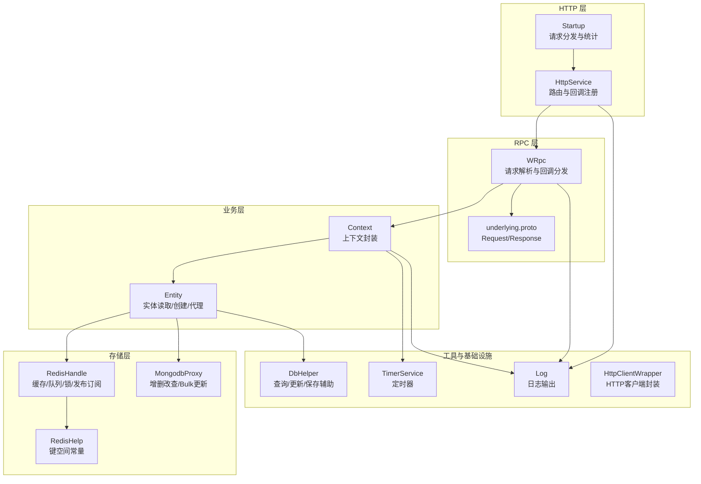
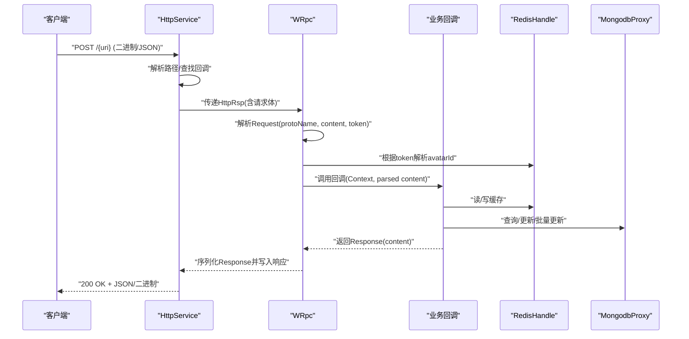
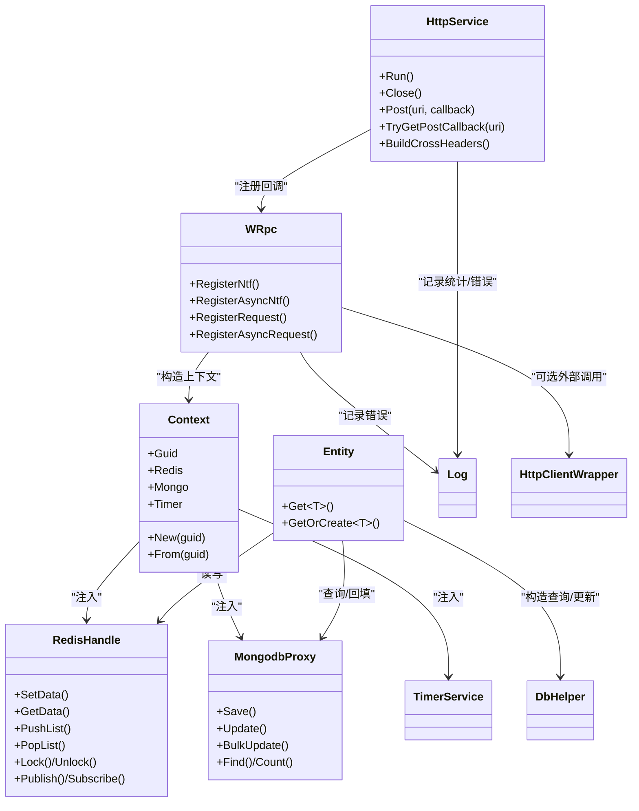

# API参考

<cite>
**本文引用的文件**
- [Main.cs](file://lgbf/hub/Main.cs)
- [HttpService.cs](file://lgbf/hub/HttpService.cs)
- [WRpc.cs](file://lgbf/hub/WRpc.cs)
- [underlying.proto](file://lgbf/underlying/underlying.proto)
- [Entity.cs](file://lgbf/hub/Entity.cs)
- [Context.cs](file://lgbf/hub/Context.cs)
- [RedisHandle.cs](file://lgbf/hub/RedisHandle.cs)
- [MongodbProxy.cs](file://lgbf/hub/MongodbProxy.cs)
- [RedisHelp.cs](file://lgbf/hub/RedisHelp.cs)
- [TimerService.cs](file://lgbf/hub/TimerService.cs)
- [Log.cs](file://lgbf/hub/Log.cs)
- [DbHelper.cs](file://lgbf/hub/DbHelper.cs)
- [HttpClientWrapper.cs](file://lgbf/hub/HttpClientWrapper.cs)
- [README.md](file://README.md)
</cite>

## 目录
1. [简介](#简介)
2. [项目结构](#项目结构)
3. [核心组件](#核心组件)
4. [架构总览](#架构总览)
5. [详细组件分析](#详细组件分析)
6. [依赖关系分析](#依赖关系分析)
7. [性能与可靠性](#性能与可靠性)
8. [故障排查指南](#故障排查指南)
9. [结论](#结论)
10. [附录：协议与配置](#附录协议与配置)

## 简介
本文件为 LGBF（Lightweight Game Backend Framework）的完整 API 参考文档，覆盖以下内容：
- HTTP API 的端点注册与调用流程、请求/响应模式、跨域与头部策略
- RPC 协议（基于 Protobuf）的消息格式、字段定义与序列化规则
- SDK 接口使用方式与典型调用路径（以代码路径形式给出）
- 数据持久化与缓存层接口（Redis/MongoDB）
- 配置项、运行时参数与环境变量
- 错误处理、重试与超时策略
- 最佳实践与性能优化建议

## 项目结构
LGBF 后端由 C# 实现，核心模块包括：
- HTTP 服务与路由分发
- 基于 Protobuf 的 RPC 消息编解码
- 实体数据模型与读写代理
- 缓存与数据库访问层
- 定时器与日志系统
- 工具类（查询构建、HTTP 客户端封装等）

图表来源
- [HttpService.cs:117-182](file://lgbf/hub/HttpService.cs#L117-L182)
- [WRpc.cs:1-155](file://lgbf/hub/WRpc.cs#L1-L155)
- [underlying.proto:1-12](file://lgbf/underlying/underlying.proto#L1-L12)
- [Entity.cs:94-154](file://lgbf/hub/Entity.cs#L94-L154)
- [Context.cs:4-27](file://lgbf/hub/Context.cs#L4-L27)
- [RedisHandle.cs:13-544](file://lgbf/hub/RedisHandle.cs#L13-L544)
- [MongodbProxy.cs:10-221](file://lgbf/hub/MongodbProxy.cs#L10-L221)
- [RedisHelp.cs:4-20](file://lgbf/hub/RedisHelp.cs#L4-L20)
- [TimerService.cs:7-126](file://lgbf/hub/TimerService.cs#L7-L126)
- [Log.cs:6-113](file://lgbf/hub/Log.cs#L6-L113)
- [DbHelper.cs:4-311](file://lgbf/hub/DbHelper.cs#L4-L311)
- [HttpClientWrapper.cs:4-48](file://lgbf/hub/HttpClientWrapper.cs#L4-L48)

章节来源
- [README.md:1-3](file://README.md#L1-L3)
- [Main.cs:13-49](file://lgbf/hub/Main.cs#L13-L49)

## 核心组件
- 配置与启动
  - 入口与配置对象：[Config:4-11](file://lgbf/hub/Main.cs#L4-L11)
  - 启动流程：初始化 Redis/Mongo、定时器、HTTP 服务
  - 关闭流程：优雅关闭 HTTP 服务
- HTTP 服务
  - 路由注册与回调：[HttpService.Post/TryGetPostCallback:139-147](file://lgbf/hub/HttpService.cs#L139-L147)
  - 跨域与头部：[BuildCrossHeaders:134-137](file://lgbf/hub/HttpService.cs#L134-L137)
  - 请求统计与超时告警：[Startup.Configure:50-115](file://lgbf/hub/HttpService.cs#L50-L115)
- RPC 协议
  - 请求/响应消息定义：[underlying.proto:3-12](file://lgbf/underlying/underlying.proto#L3-L12)
  - 请求解析与回调分发：[WRpc 构造与回调注册:14-45](file://lgbf/hub/WRpc.cs#L14-L45)
- 上下文与实体
  - 上下文封装：[Context:4-27](file://lgbf/hub/Context.cs#L4-L27)
  - 实体读取/创建/写回：[Entity.Get/GetOrCreate/WriteBack:104-152](file://lgbf/hub/Entity.cs#L104-L152)
- 存储访问
  - Redis 封装：[RedisHandle:13-544](file://lgbf/hub/RedisHandle.cs#L13-L544)
  - MongoDB 封装：[MongodbProxy:10-221](file://lgbf/hub/MongodbProxy.cs#L10-L221)
  - Redis 键空间常量：[RedisHelp:4-20](file://lgbf/hub/RedisHelp.cs#L4-L20)
- 工具与基础设施
  - 日志：[Log:6-113](file://lgbf/hub/Log.cs#L6-L113)
  - 查询/更新/保存辅助：[DbHelper:4-311](file://lgbf/hub/DbHelper.cs#L4-L311)
  - HTTP 客户端封装：[HttpClientWrapper:4-48](file://lgbf/hub/HttpClientWrapper.cs#L4-L48)
  - 定时器：[TimerService:7-126](file://lgbf/hub/TimerService.cs#L7-L126)

章节来源
- [Main.cs:13-49](file://lgbf/hub/Main.cs#L13-L49)
- [HttpService.cs:117-182](file://lgbf/hub/HttpService.cs#L117-L182)
- [WRpc.cs:1-155](file://lgbf/hub/WRpc.cs#L1-L155)
- [underlying.proto:1-12](file://lgbf/underlying/underlying.proto#L1-L12)
- [Context.cs:4-27](file://lgbf/hub/Context.cs#L4-L27)
- [Entity.cs:94-154](file://lgbf/hub/Entity.cs#L94-L154)
- [RedisHandle.cs:13-544](file://lgbf/hub/RedisHandle.cs#L13-L544)
- [MongodbProxy.cs:10-221](file://lgbf/hub/MongodbProxy.cs#L10-L221)
- [RedisHelp.cs:4-20](file://lgbf/hub/RedisHelp.cs#L4-L20)
- [Log.cs:6-113](file://lgbf/hub/Log.cs#L6-L113)
- [DbHelper.cs:4-311](file://lgbf/hub/DbHelper.cs#L4-L311)
- [HttpClientWrapper.cs:4-48](file://lgbf/hub/HttpClientWrapper.cs#L4-L48)
- [TimerService.cs:7-126](file://lgbf/hub/TimerService.cs#L7-L126)

## 架构总览
LGBF 的请求处理链路如下：
- 客户端通过 HTTP POST 访问指定 URI
- HttpService 解析路径并查找已注册回调
- WRpc 将请求体解析为 Protobuf Request，按 protoName 分派到对应回调
- 回调在 Context 中获取 Redis/Mongo/Timers 等资源，执行业务逻辑
- 回调返回 Response，WRpc 统一序列化并写回 HTTP 响应

图表来源
- [HttpService.cs:50-115](file://lgbf/hub/HttpService.cs#L50-L115)
- [WRpc.cs:16-44](file://lgbf/hub/WRpc.cs#L16-L44)
- [underlying.proto:3-12](file://lgbf/underlying/underlying.proto#L3-L12)
- [Context.cs:11-20](file://lgbf/hub/Context.cs#L11-L20)
- [RedisHandle.cs:159-174](file://lgbf/hub/RedisHandle.cs#L159-L174)
- [MongodbProxy.cs:76-120](file://lgbf/hub/MongodbProxy.cs#L76-L120)

## 详细组件分析

### HTTP API 参考
- 路由注册
  - 注册 POST 回调：[HttpService.Post:139-142](file://lgbf/hub/HttpService.cs#L139-L142)
  - 获取回调：[HttpService.TryGetPostCallback:144-147](file://lgbf/hub/HttpService.cs#L144-L147)
- 跨域与头部
  - 默认跨域头：[HttpService.BuildCrossHeaders:134-137](file://lgbf/hub/HttpService.cs#L134-L137)
- 请求处理
  - 路由分发与统计：[Startup.Configure:50-115](file://lgbf/hub/HttpService.cs#L50-L115)
  - 选项预检处理：[OPTIONS 处理:72-81](file://lgbf/hub/HttpService.cs#L72-L81)
- 响应封装
  - 响应写入：[HttpRsp.Response:24-38](file://lgbf/hub/HttpService.cs#L24-L38)
- 服务器配置
  - Kestrel 参数：并发连接、保活、HTTP/2 支持：[HttpService.RunServerAsync:149-169](file://lgbf/hub/HttpService.cs#L149-L169)
- 优雅关闭
  - 关闭主机：[HttpService.Close:175-180](file://lgbf/hub/HttpService.cs#L175-L180)

使用示例（代码路径）
- 在业务模块中注册一个端点回调：[示例注册:47-71](file://lgbf/hub/WRpc.cs#L47-L71)
- 发送请求到 /rpc/{method} 并等待响应：[示例调用:127-153](file://lgbf/hub/WRpc.cs#L127-L153)

章节来源
- [HttpService.cs:117-182](file://lgbf/hub/HttpService.cs#L117-L182)

### RPC 协议参考
- 消息定义
  - Request：protoName、content、token
  - Response：errMsg、content
  - 参考：[underlying.proto:3-12](file://lgbf/underlying/underlying.proto#L3-L12)
- 序列化与反序列化
  - 使用 Google.Protobuf 进行解析与生成
  - 参考：[WRpc 构造函数与解析:16-26](file://lgbf/hub/WRpc.cs#L16-L26)
- 回调注册
  - 同步通知/异步通知/同步请求/异步请求四种类型
  - 参考：[RegisterNtf/RegisterAsyncNtf/RegisterRequest/RegisterAsyncRequest:47-153](file://lgbf/hub/WRpc.cs#L47-L153)

使用示例（代码路径）
- 注册一个同步请求回调：[示例:99-125](file://lgbf/hub/WRpc.cs#L99-L125)
- 注册一个异步通知回调：[示例:73-97](file://lgbf/hub/WRpc.cs#L73-L97)

章节来源
- [underlying.proto:1-12](file://lgbf/underlying/underlying.proto#L1-L12)
- [WRpc.cs:1-155](file://lgbf/hub/WRpc.cs#L1-L155)

### 实体与数据代理
- 实体接口与代理
  - IHostingData：类型标识、创建、加载、存储
  - IDataAgent：Data 属性与 WriteBack
  - 参考：[Entity.cs:4-29](file://lgbf/hub/Entity.cs#L4-L29)
- 实体读取/创建
  - Get：优先从 Redis 加载，不存在则从 Mongo 查询并回填 Redis
  - GetOrCreate：不存在则调用 T.Create() 创建
  - 参考：[Entity.Get/GetOrCreate:104-152](file://lgbf/hub/Entity.cs#L104-L152)
- 写回机制
  - WriteBack：写入 Redis，设置脏标记，推入 MongoDB 写入队列
  - 参考：[DataAgent.WriteBack:52-91](file://lgbf/hub/Entity.cs#L52-L91)

使用示例（代码路径）
- 获取或创建实体代理：[示例:137-152](file://lgbf/hub/Entity.cs#L137-L152)
- 写回实体数据：[示例:52-56](file://lgbf/hub/Entity.cs#L52-L56)

章节来源
- [Entity.cs:31-154](file://lgbf/hub/Entity.cs#L31-L154)

### 上下文 Context
- 字段
  - Guid、Redis、Mongo、Timer
  - 参考：[Context:4-27](file://lgbf/hub/Context.cs#L4-L27)
- 构造
  - New：从 Main 注入全局 Redis/Mongo/Timers
  - From：复制并替换 Guid
  - 参考：[Context.New/From:11-26](file://lgbf/hub/Context.cs#L11-L26)

使用示例（代码路径）
- 从 token 解析 avatarId 并构造 Context：[示例:31-37](file://lgbf/hub/WRpc.cs#L31-L37)
- 在回调中使用 Context 访问存储与定时器：[示例:56-82](file://lgbf/hub/WRpc.cs#L56-L82)

章节来源
- [Context.cs:4-27](file://lgbf/hub/Context.cs#L4-L27)
- [WRpc.cs:31-37](file://lgbf/hub/WRpc.cs#L31-L37)

### 缓存与数据库访问

#### Redis 封装（RedisHandle）
- 基础操作
  - SetData/GetData/DelData/Expire
  - 参考：[SetData/GetData/DelData/Expire:84-195](file://lgbf/hub/RedisHandle.cs#L84-L195)
- 列表操作
  - PushList/PopList
  - 参考：[PushList/PopList:257-303](file://lgbf/hub/RedisHandle.cs#L257-L303)
- 锁与分布式锁
  - Lock/TryLock/LockExtend/UnLock
  - 参考：[Lock 系列:305-394](file://lgbf/hub/RedisHandle.cs#L305-L394)
- 发布/订阅
  - Publish/Subscribe（内部用于通知）
  - 参考：[Publish/Subscribe:197-255](file://lgbf/hub/RedisHandle.cs#L197-L255)
- 集合操作
  - SortedSet/HashSet/HashGet
  - 参考：[集合操作:396-542](file://lgbf/hub/RedisHandle.cs#L396-L542)

Redis 键空间常量（RedisHelp）
- 实体锁、Token->Guid 映射、实体存储键、脏标记、写入队列、排行榜键
- 参考：[RedisHelp:4-20](file://lgbf/hub/RedisHelp.cs#L4-L20)

使用示例（代码路径）
- 写入实体数据并设置脏标记：[示例:62-84](file://lgbf/hub/Entity.cs#L62-L84)
- 从 Redis 读取实体数据：[示例:107-110](file://lgbf/hub/Entity.cs#L107-L110)
- 发布通知到频道：[示例:208-215](file://lgbf/hub/RedisHandle.cs#L208-L215)

章节来源
- [RedisHandle.cs:13-544](file://lgbf/hub/RedisHandle.cs#L13-L544)
- [RedisHelp.cs:4-20](file://lgbf/hub/RedisHelp.cs#L4-L20)
- [Entity.cs:52-91](file://lgbf/hub/Entity.cs#L52-L91)

#### MongoDB 封装（MongodbProxy）
- 基础操作
  - Save/Update/Remove
  - 参考：[Save/Update/Remove:76-202](file://lgbf/hub/MongodbProxy.cs#L76-L202)
- 批量更新
  - BulkUpdate：支持 upsert
  - 参考：[BulkUpdate:102-120](file://lgbf/hub/MongodbProxy.cs#L102-L120)
- 查询与计数
  - Find/Count/FindAndModify
  - 参考：[Find/Count/FindAndModify:143-142](file://lgbf/hub/MongodbProxy.cs#L143-L142)
- 索引与 Guid 自增
  - CreateIndex/CheckIntGuid/GetGuid
  - 参考：[索引与 Guid:35-219](file://lgbf/hub/MongodbProxy.cs#L35-L219)

使用示例（代码路径）
- 从 Mongo 查询实体并回填 Redis：[示例:120-131](file://lgbf/hub/Entity.cs#L120-L131)
- 批量更新实体数据：[示例:125-134](file://lgbf/hub/Main.cs#L125-L134)

章节来源
- [MongodbProxy.cs:10-221](file://lgbf/hub/MongodbProxy.cs#L10-L221)
- [Entity.cs:120-131](file://lgbf/hub/Entity.cs#L120-L131)
- [Main.cs:125-134](file://lgbf/hub/Main.cs#L125-L134)

### 工具与基础设施

#### 日志（Log）
- 日志级别与输出
  - Trace/Debug/Info/Warn/Err
  - 文件滚动与自动刷新
  - 参考：[Log:6-113](file://lgbf/hub/Log.cs#L6-L113)

使用示例（代码路径）
- 记录错误与异常：[示例:55-58](file://lgbf/hub/Log.cs#L55-L58)
- 记录慢请求与统计：[示例:108-112](file://lgbf/hub/HttpService.cs#L108-L112)

章节来源
- [Log.cs:6-113](file://lgbf/hub/Log.cs#L6-L113)
- [HttpService.cs:108-112](file://lgbf/hub/HttpService.cs#L108-L112)

#### 查询/更新/保存辅助（DbHelper）
- SaveDataHelper：构造插入文档
- UpdateDataHelper：构造 $set/$inc 更新
- DBQueryHelper：构造查询条件
- 参考：[DbHelper:4-311](file://lgbf/hub/DbHelper.cs#L4-L311)

使用示例（代码路径）
- 构造更新文档并应用：[示例:116-122](file://lgbf/hub/Entity.cs#L116-L122)
- 构造查询条件：[示例:118-122](file://lgbf/hub/Entity.cs#L118-L122)

章节来源
- [DbHelper.cs:4-311](file://lgbf/hub/DbHelper.cs#L4-L311)
- [Entity.cs:116-122](file://lgbf/hub/Entity.cs#L116-L122)

#### HTTP 客户端封装（HttpClientWrapper）
- 默认超时与统一异常处理
- 参考：[HttpClientWrapper:4-48](file://lgbf/hub/HttpClientWrapper.cs#L4-L48)

使用示例（代码路径）
- 发起 HTTP 请求并处理异常：[示例:12-25](file://lgbf/hub/HttpClientWrapper.cs#L12-L25)

章节来源
- [HttpClientWrapper.cs:4-48](file://lgbf/hub/HttpClientWrapper.cs#L4-L48)

#### 定时器（TimerService）
- 单例与轮询
  - 轮询间隔、Tick 刷新、多粒度调度
  - 参考：[TimerService:7-126](file://lgbf/hub/TimerService.cs#L7-L126)

使用示例（代码路径）
- 注册周期性任务：[示例:36-39](file://lgbf/hub/Main.cs#L36-L39)

章节来源
- [TimerService.cs:7-126](file://lgbf/hub/TimerService.cs#L7-L126)
- [Main.cs:36-39](file://lgbf/hub/Main.cs#L36-L39)

## 依赖关系分析

图表来源
- [HttpService.cs:117-182](file://lgbf/hub/HttpService.cs#L117-L182)
- [WRpc.cs:1-155](file://lgbf/hub/WRpc.cs#L1-L155)
- [Context.cs:4-27](file://lgbf/hub/Context.cs#L4-L27)
- [Entity.cs:94-154](file://lgbf/hub/Entity.cs#L94-L154)
- [RedisHandle.cs:13-544](file://lgbf/hub/RedisHandle.cs#L13-L544)
- [MongodbProxy.cs:10-221](file://lgbf/hub/MongodbProxy.cs#L10-L221)
- [TimerService.cs:7-126](file://lgbf/hub/TimerService.cs#L7-L126)
- [Log.cs:6-113](file://lgbf/hub/Log.cs#L6-L113)
- [DbHelper.cs:4-311](file://lgbf/hub/DbHelper.cs#L4-L311)
- [HttpClientWrapper.cs:4-48](file://lgbf/hub/HttpClientWrapper.cs#L4-L48)

## 性能与可靠性
- HTTP 服务
  - 最大并发连接：16384；KeepAlive 超时：120 秒；启用 HTTP/2
  - 参考：[Kestrel 配置:154-160](file://lgbf/hub/HttpService.cs#L154-L160)
- Redis 访问
  - 超时异常自动恢复与指数退避式重试
  - 参考：[RedisHandle 异常处理:27-34](file://lgbf/hub/RedisHandle.cs#L27-L34)
- MongoDB 批量更新
  - BulkWrite（非有序），提升吞吐
  - 参考：[MongodbProxy.BulkUpdate:118-119](file://lgbf/hub/MongodbProxy.cs#L118-L119)
- 实体写回
  - 写回后设置脏标记与延时过期，避免重复写入
  - 参考：[Entity 写回流程:62-91](file://lgbf/hub/Entity.cs#L62-L91)
- 日志与统计
  - 每秒统计连接数，超过阈值记录告警
  - 参考：[请求统计:56-62](file://lgbf/hub/HttpService.cs#L56-L62)

章节来源
- [HttpService.cs:154-160](file://lgbf/hub/HttpService.cs#L154-L160)
- [RedisHandle.cs:27-34](file://lgbf/hub/RedisHandle.cs#L27-L34)
- [MongodbProxy.cs:118-119](file://lgbf/hub/MongodbProxy.cs#L118-L119)
- [Entity.cs:62-91](file://lgbf/hub/Entity.cs#L62-L91)
- [HttpService.cs:56-62](file://lgbf/hub/HttpService.cs#L56-L62)

## 故障排查指南
- HTTP 请求无响应或超时
  - 检查 Kestrel 配置与并发限制
  - 参考：[RunServerAsync:149-169](file://lgbf/hub/HttpService.cs#L149-L169)
  - 观察慢请求日志：[统计与告警:108-112](file://lgbf/hub/HttpService.cs#L108-L112)
- RPC 回调未触发
  - 确认 protoName 与注册一致
  - 检查 token 是否映射到有效 avatarId
  - 参考：[WRpc 解析与回调:16-44](file://lgbf/hub/WRpc.cs#L16-L44)
- Redis 写入失败
  - 查看异常恢复与重试逻辑
  - 参考：[RedisHandle 异常处理:27-34](file://lgbf/hub/RedisHandle.cs#L27-L34)
- MongoDB 写入失败
  - 检查批量更新返回与重试入队
  - 参考：[Main.SaveAsync 重试:125-134](file://lgbf/hub/Main.cs#L125-L134)
- 日志定位
  - 使用 Log.Err 输出错误堆栈
  - 参考：[Log.Err:55-58](file://lgbf/hub/Log.cs#L55-L58)

章节来源
- [HttpService.cs:149-169](file://lgbf/hub/HttpService.cs#L149-L169)
- [WRpc.cs:16-44](file://lgbf/hub/WRpc.cs#L16-L44)
- [RedisHandle.cs:27-34](file://lgbf/hub/RedisHandle.cs#L27-L34)
- [Main.cs:125-134](file://lgbf/hub/Main.cs#L125-L134)
- [Log.cs:55-58](file://lgbf/hub/Log.cs#L55-L58)

## 结论
LGBF 提供了清晰的 HTTP+RPC 双栈 API，结合 Redis/MongoDB 的高性能存储与完善的错误处理机制，适合构建轻量级游戏后端。通过 Context 统一注入存储与定时器资源，业务回调可专注于领域逻辑。

## 附录：协议与配置

### HTTP API 端点与请求/响应模式
- 端点注册
  - POST 回调注册：[HttpService.Post:139-142](file://lgbf/hub/HttpService.cs#L139-L142)
  - 回调获取：[HttpService.TryGetPostCallback:144-147](file://lgbf/hub/HttpService.cs#L144-L147)
- 跨域与头部
  - 默认跨域头：[BuildCrossHeaders:134-137](file://lgbf/hub/HttpService.cs#L134-L137)
- 请求处理
  - 路由分发与统计：[Startup.Configure:50-115](file://lgbf/hub/HttpService.cs#L50-L115)
  - OPTIONS 预检：[OPTIONS 处理:72-81](file://lgbf/hub/HttpService.cs#L72-L81)
- 响应
  - 统一响应封装：[HttpRsp.Response:24-38](file://lgbf/hub/HttpService.cs#L24-L38)

章节来源
- [HttpService.cs:117-182](file://lgbf/hub/HttpService.cs#L117-L182)

### RPC 消息格式与序列化
- 消息定义
  - Request：protoName、content、token
  - Response：errMsg、content
  - 参考：[underlying.proto:3-12](file://lgbf/underlying/underlying.proto#L3-L12)
- 解析与分发
  - 解析 Request 并按 protoName 调用回调
  - 参考：[WRpc 构造与回调:16-44](file://lgbf/hub/WRpc.cs#L16-L44)

章节来源
- [underlying.proto:1-12](file://lgbf/underlying/underlying.proto#L1-L12)
- [WRpc.cs:16-44](file://lgbf/hub/WRpc.cs#L16-L44)

### 配置项与运行时参数
- 启动配置
  - 主机地址、端口、Redis 地址/密码、MongoDB 连接串
  - 参考：[Config:4-11](file://lgbf/hub/Main.cs#L4-L11)
- HTTP 服务
  - 最大并发连接、KeepAlive 超时、HTTP/2 支持
  - 参考：[RunServerAsync:154-160](file://lgbf/hub/HttpService.cs#L154-L160)
- 实体写回
  - 保存间隔（毫秒）、批大小
  - 参考：[Main 常量与 SaveAsync:15-16](file://lgbf/hub/Main.cs#L15-L16)
- 日志
  - 日志级别、日志路径与文件名
  - 参考：[Log 配置:109-112](file://lgbf/hub/Log.cs#L109-L112)

章节来源
- [Main.cs:4-11](file://lgbf/hub/Main.cs#L4-L11)
- [HttpService.cs:154-160](file://lgbf/hub/HttpService.cs#L154-L160)
- [Main.cs:15-16](file://lgbf/hub/Main.cs#L15-L16)
- [Log.cs:109-112](file://lgbf/hub/Log.cs#L109-L112)

### 错误码与状态语义
- HTTP 状态
  - 200 OK：成功
  - 404 未知端点：未找到回调
  - 500 服务器错误：回调抛出异常
  - 参考：[Startup.Configure 回调处理:82-84](file://lgbf/hub/HttpService.cs#L82-L84)
- RPC 响应
  - errMsg："OK" 表示成功，其他表示错误信息
  - content：成功时为业务响应数据，失败时为错误字符串
  - 参考：[WRpc 回调封装:52-69](file://lgbf/hub/WRpc.cs#L52-L69)

章节来源
- [HttpService.cs:82-84](file://lgbf/hub/HttpService.cs#L82-L84)
- [WRpc.cs:52-69](file://lgbf/hub/WRpc.cs#L52-L69)

### 最佳实践与性能优化建议
- 使用 Context 统一管理 Redis/Mongo/Timers，避免全局状态
- 对热点实体使用 Redis 缓存，批量写回减少数据库压力
- 合理设置 Redis 过期时间与脏标记，避免重复写入
- 使用 MongodbProxy.BulkUpdate 执行批量更新
- 控制 HTTP 并发与 KeepAlive 超时，避免资源耗尽
- 使用 Log 记录关键路径与慢请求，便于问题定位

章节来源
- [Context.cs:11-26](file://lgbf/hub/Context.cs#L11-L26)
- [Entity.cs:62-91](file://lgbf/hub/Entity.cs#L62-L91)
- [MongodbProxy.cs:118-119](file://lgbf/hub/MongodbProxy.cs#L118-L119)
- [HttpService.cs:154-160](file://lgbf/hub/HttpService.cs#L154-L160)
- [Log.cs:55-58](file://lgbf/hub/Log.cs#L55-L58)