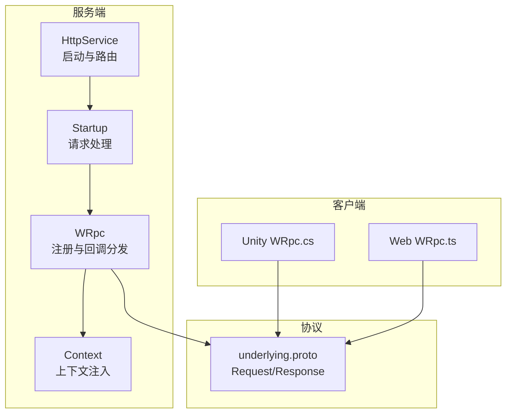
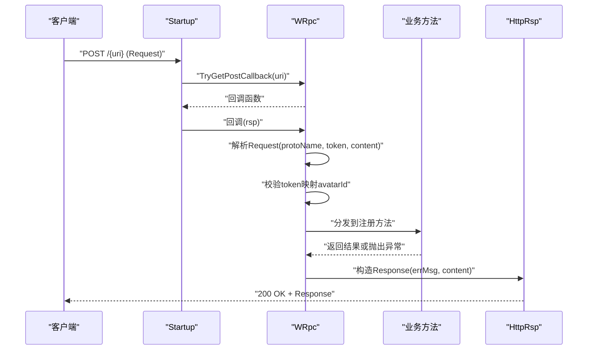
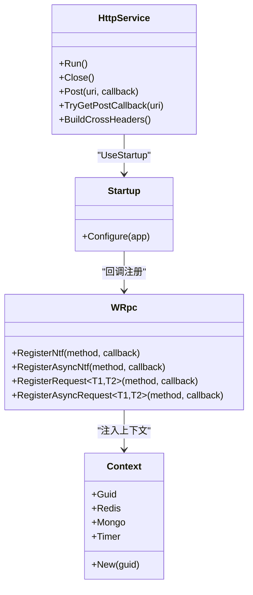

# HTTP API

<cite>
**本文引用的文件**
- [HttpService.cs](file://lgbf/hub/HttpService.cs)
- [WRpc.cs](file://lgbf/hub/WRpc.cs)
- [Main.cs](file://lgbf/hub/Main.cs)
- [Context.cs](file://lgbf/hub/Context.cs)
- [underlying.proto](file://lgbf/underlying/underlying.proto)
- [WRpc.cs（Unity 客户端）](file://gem/unity/Assets/Script/NetDriver/WRpc.cs)
- [WRpc.ts（Web 客户端）](file://gem/ccc/assets/script/ServerSDK/wrpc.ts)
- [Log.cs](file://lgbf/hub/Log.cs)
- [HttpClientWrapper.cs](file://lgbf/hub/HttpClientWrapper.cs)
</cite>

## 目录
1. [简介](#简介)
2. [项目结构](#项目结构)
3. [核心组件](#核心组件)
4. [架构总览](#架构总览)
5. [详细组件分析](#详细组件分析)
6. [依赖关系分析](#依赖关系分析)
7. [性能与配置](#性能与配置)
8. [故障排查](#故障排查)
9. [结论](#结论)
10. [附录：接口清单与示例](#附录接口清单与示例)

## 简介
本文件系统性记录 LGBF 框架的 HTTP API 设计与实现，重点覆盖：
- 基于路径的 RPC 调用机制与 POST URI 路由规则
- CORS 配置与跨域支持
- 请求/响应格式与状态码约定
- 错误码与异常处理策略
- 连接限制、超时配置与性能优化建议
- HTTP 客户端集成指南与最佳实践

## 项目结构
围绕 HTTP API 的关键代码集中在 hub 子项目中，配合底层协议定义与多端客户端实现：
- 服务端 HTTP 层：HttpService、Startup、WRpc
- 协议定义：underlying.proto（Request/Response）
- 客户端实现：Unity（C#）、Web（TypeScript）
- 日志与通用 HTTP 客户端封装：Log、HttpClientWrapper

图表来源
- [HttpService.cs:40-115](file://lgbf/hub/HttpService.cs#L40-L115)
- [WRpc.cs:14-45](file://lgbf/hub/WRpc.cs#L14-L45)
- [underlying.proto:3-12](file://lgbf/underlying/underlying.proto#L3-L12)
- [WRpc.cs（Unity 客户端）:35-82](file://gem/unity/Assets/Script/NetDriver/WRpc.cs#L35-L82)
- [WRpc.ts（Web 客户端）:54-100](file://gem/ccc/assets/script/ServerSDK/wrpc.ts#L54-L100)

章节来源
- [HttpService.cs:40-181](file://lgbf/hub/HttpService.cs#L40-L181)
- [WRpc.cs:1-155](file://lgbf/hub/WRpc.cs#L1-L155)
- [underlying.proto:1-12](file://lgbf/underlying/underlying.proto#L1-L12)

## 核心组件
- HttpService：负责 Kestrel 启动、HTTP 路由与回调注册；内置 CORS 头部生成器；限制并发连接与保活超时。
- Startup：解析请求路径，按首段作为 URI 路由键匹配 POST 回调；处理 OPTIONS 预检；统计连接速率。
- WRpc：在指定 URI 注册回调，解析 Request，校验 token 映射到 avatarId，分发到具体业务方法并返回 Response。
- Context：为业务回调提供统一上下文（Redis、Mongo、Timer 等）。
- underlying.proto：定义 Request/Response 的二进制协议结构。
- 客户端 WRpc（Unity/Web）：构造 Request，发送 POST，解析 Response，处理超时与错误。

章节来源
- [HttpService.cs:117-181](file://lgbf/hub/HttpService.cs#L117-L181)
- [WRpc.cs:6-155](file://lgbf/hub/WRpc.cs#L6-L155)
- [Context.cs:4-26](file://lgbf/hub/Context.cs#L4-L26)
- [underlying.proto:3-12](file://lgbf/underlying/underlying.proto#L3-L12)

## 架构总览
HTTP API 的调用链路如下：
- 客户端通过 POST 将 Request 序列化字节流发送至服务端指定 URI
- 服务端 Startup 解析路径首段作为路由键，查找对应回调
- WRpc 接收回调，反序列化 Request，校验 token 并获取 avatarId
- 分发到已注册的方法，执行业务逻辑后返回 Response
- 服务端将 Response 序列化为字节流写回客户端

图表来源
- [HttpService.cs:64-100](file://lgbf/hub/HttpService.cs#L64-L100)
- [WRpc.cs:16-44](file://lgbf/hub/WRpc.cs#L16-L44)
- [underlying.proto:3-12](file://lgbf/underlying/underlying.proto#L3-L12)

## 详细组件分析

### HTTP 路由与回调注册（基于路径的 RPC）
- 路由规则：请求路径首段作为 URI 路由键，用于匹配已注册的 POST 回调。
- 注册方式：WRpc 在构造时通过 HttpService.Post(uri, callback) 注册回调。
- 匹配流程：Startup.TryGetPostCallback(endpoint) 返回对应回调；若未找到则忽略请求。
- OPTIONS 预检：直接返回 200 OK，并设置 CORS 头部。

章节来源
- [HttpService.cs:64-81](file://lgbf/hub/HttpService.cs#L64-L81)
- [HttpService.cs:139-147](file://lgbf/hub/HttpService.cs#L139-L147)
- [WRpc.cs:16-44](file://lgbf/hub/WRpc.cs#L16-L44)

### 请求/响应格式与状态码
- 请求体：二进制 Protobuf Request
  - 字段：protoName（方法名）、content（方法参数的二进制）、token（鉴权标识）
- 响应体：二进制 Protobuf Response
  - 字段：errMsg（错误信息，成功时为“OK”）、content（返回数据的二进制）
- 状态码：
  - 200 OK：正常返回 Response
  - 200 OK（OPTIONS 预检）：返回空体
  - 其他：由 ASP.NET Core 默认处理（如 404 未匹配路由）

章节来源
- [underlying.proto:3-12](file://lgbf/underlying/underlying.proto#L3-L12)
- [HttpService.cs:24-37](file://lgbf/hub/HttpService.cs#L24-L37)
- [HttpService.cs:72-81](file://lgbf/hub/HttpService.cs#L72-L81)

### CORS 配置与跨域支持
- 默认允许来源：*（通配）
- 允许头：Content-Type、XL-Token
- 允许方法：POST、GET、OPTIONS
- 预检请求：OPTIONS 直接返回 200 OK

章节来源
- [HttpService.cs:129-137](file://lgbf/hub/HttpService.cs#L129-L137)
- [HttpService.cs:72-81](file://lgbf/hub/HttpService.cs#L72-L81)

### 参数验证与鉴权
- token 校验：WRpc 从 Redis 中查询 token 到 avatarId 的映射，若为空则抛出异常
- protoName 校验：若未注册对应方法名，抛出“未知 proto”异常
- 请求体校验：空体或长度为 0 触发异常

章节来源
- [WRpc.cs:31-35](file://lgbf/hub/WRpc.cs#L31-L35)
- [WRpc.cs:25-29](file://lgbf/hub/WRpc.cs#L25-L29)
- [WRpc.cs:20-23](file://lgbf/hub/WRpc.cs#L20-L23)

### 异常处理与错误码
- 服务器内部异常：日志记录并返回 Response.ErrMsg = "error"，客户端收到 errMsg 非空
- 客户端侧异常：
  - Unity：超时、网络错误、空响应体等均会抛出异常
  - Web：XHR 状态码不在 2xx、超时、网络错误、空响应体均抛出 WRpcError
- 日志输出：统一通过 Log 类输出，包含时间戳、级别、位置信息

章节来源
- [WRpc.cs:61-65](file://lgbf/hub/WRpc.cs#L61-L65)
- [WRpc.cs:87-99](file://lgbf/hub/WRpc.cs#L87-L99)
- [WRpc.cs（Unity 客户端）:70-82](file://gem/unity/Assets/Script/NetDriver/WRpc.cs#L70-L82)
- [WRpc.ts（Web 客户端）:80-99](file://gem/ccc/assets/script/ServerSDK/wrpc.ts#L80-L99)
- [Log.cs:55-58](file://lgbf/hub/Log.cs#L55-L58)

### 客户端集成指南与最佳实践
- Unity 客户端
  - 使用 WRpc(uri, token, timeoutMs) 发起请求
  - Notify 用于通知类调用，Request 用于请求-响应调用
  - 注意设置 Content-Type: application/octet-stream
  - 超时与取消：利用 CancellationToken 控制
- Web 客户端
  - 使用 WRpc(uri, token, timeoutMs) 发起请求
  - 设置 Content-Type: application/octet-stream
  - 处理 errMsg 与空 content 的场景
- 通用建议
  - 统一在客户端封装 token 与 uri
  - 对高频调用进行重试与退避策略
  - 严格区分 Notify 与 Request 的语义

章节来源
- [WRpc.cs（Unity 客户端）:28-33](file://gem/unity/Assets/Script/NetDriver/WRpc.cs#L28-L33)
- [WRpc.cs（Unity 客户端）:84-126](file://gem/unity/Assets/Script/NetDriver/WRpc.cs#L84-L126)
- [WRpc.ts（Web 客户端）:26-30](file://gem/ccc/assets/script/ServerSDK/wrpc.ts#L26-L30)
- [WRpc.ts（Web 客户端）:32-52](file://gem/ccc/assets/script/ServerSDK/wrpc.ts#L32-L52)

## 依赖关系分析

图表来源
- [HttpService.cs:117-181](file://lgbf/hub/HttpService.cs#L117-L181)
- [Startup.cs:50-115](file://lgbf/hub/HttpService.cs#L50-L115)
- [WRpc.cs:6-155](file://lgbf/hub/WRpc.cs#L6-L155)
- [Context.cs:4-26](file://lgbf/hub/Context.cs#L4-L26)

章节来源
- [HttpService.cs:117-181](file://lgbf/hub/HttpService.cs#L117-L181)
- [WRpc.cs:6-155](file://lgbf/hub/WRpc.cs#L6-L155)
- [Context.cs:4-26](file://lgbf/hub/Context.cs#L4-L26)

## 性能与配置
- 连接限制
  - 最大并发连接：16384
  - Keep-Alive 超时：120 秒
- 协议支持：HTTP/1.1 与 HTTP/2
- 内存管理：请求体使用 ArrayPool<byte> 进行租借与归还
- 统计与告警：每秒统计连接数，超过 1000ms 的请求会记录超时日志
- 客户端超时
  - Unity 默认 10 秒；可按需传入 timeoutMs
  - Web 默认 10 秒；可通过 timeoutMs 配置

章节来源
- [HttpService.cs:154-160](file://lgbf/hub/HttpService.cs#L154-L160)
- [HttpService.cs:108-112](file://lgbf/hub/HttpService.cs#L108-L112)
- [WRpc.cs（Unity 客户端）:23-33](file://gem/unity/Assets/Script/NetDriver/WRpc.cs#L23-L33)
- [WRpc.ts（Web 客户端）:26-30](file://gem/ccc/assets/script/ServerSDK/wrpc.ts#L26-L30)

## 故障排查
- 404/未匹配路由
  - 现象：OPTIONS 成功但 POST 未命中回调
  - 排查：确认 URI 是否与注册一致；检查路径首段是否正确
- 500/内部异常
  - 现象：Response.ErrMsg 非空
  - 排查：查看服务端日志；确认 protoName 是否注册；检查 token 映射是否有效
- 超时
  - 现象：客户端抛出超时异常；服务端记录超时日志
  - 排查：调整客户端 timeoutMs；优化服务端处理逻辑；检查网络质量
- CORS 问题
  - 现象：浏览器预检失败或跨域被拒绝
  - 排查：确认 Access-Control-Allow-* 头部是否正确设置；源是否匹配
- 空响应体
  - 现象：客户端提示空响应体
  - 排查：确认服务端是否正确序列化 Response；检查回调是否抛出异常

章节来源
- [HttpService.cs:72-81](file://lgbf/hub/HttpService.cs#L72-L81)
- [WRpc.cs:61-65](file://lgbf/hub/WRpc.cs#L61-L65)
- [WRpc.cs（Unity 客户端）:75-82](file://gem/unity/Assets/Script/NetDriver/WRpc.cs#L75-L82)
- [WRpc.ts（Web 客户端）:85-99](file://gem/ccc/assets/script/ServerSDK/wrpc.ts#L85-L99)
- [Log.cs:55-58](file://lgbf/hub/Log.cs#L55-L58)

## 结论
LGBF 的 HTTP API 采用轻量级设计：以路径首段作为路由键，结合 Protobuf 二进制协议，提供简洁高效的 RPC 能力。服务端通过 Kestrel 提供高并发与 HTTP/2 支持，客户端提供 Unity 与 Web 两端实现，便于快速集成。建议在生产环境中完善鉴权、限流与监控，并根据业务场景优化超时与重试策略。

## 附录：接口清单与示例

### URI 路由规则
- 路由键：请求路径首段（例如 /login、/game/scene）
- 注册：WRpc(uri) 构造时完成注册
- 匹配：Startup.TryGetPostCallback(endpoint) 查找回调

章节来源
- [HttpService.cs:64-71](file://lgbf/hub/HttpService.cs#L64-L71)
- [WRpc.cs:16-44](file://lgbf/hub/WRpc.cs#L16-L44)

### 请求/响应格式
- 请求 Request（二进制 Protobuf）
  - protoName：方法名
  - content：参数二进制
  - token：鉴权标识
- 响应 Response（二进制 Protobuf）
  - errMsg：错误信息（成功为“OK”）
  - content：返回值二进制

章节来源
- [underlying.proto:3-12](file://lgbf/underlying/underlying.proto#L3-L12)

### 状态码与头部
- 200 OK：成功返回 Response
- 200 OK（OPTIONS）：跨域预检
- CORS 头部：默认允许任意来源、指定头与方法

章节来源
- [HttpService.cs:72-81](file://lgbf/hub/HttpService.cs#L72-L81)
- [HttpService.cs:129-137](file://lgbf/hub/HttpService.cs#L129-L137)

### 客户端请求示例（概念性）
- Unity
  - 设置 Content-Type: application/octet-stream
  - 使用 WRpc(uri, token, timeoutMs) 发送 Request，解析 Response.ErrMsg 与 Response.Content
- Web
  - 设置 Content-Type: application/octet-stream
  - 使用 WRpc(uri, token, timeoutMs) 发送 Request，处理 errMsg 与解码 content

章节来源
- [WRpc.cs（Unity 客户端）:44-48](file://gem/unity/Assets/Script/NetDriver/WRpc.cs#L44-L48)
- [WRpc.ts（Web 客户端）:77-78](file://gem/ccc/assets/script/ServerSDK/wrpc.ts#L77-L78)

### 错误码与异常处理
- 服务器端
  - errMsg = "error" 表示业务异常；ERR 日志记录异常详情
- 客户端
  - Unity：超时、网络错误、空响应体抛出异常
  - Web：XHR 非 2xx、超时、网络错误、空响应体抛出 WRpcError

章节来源
- [WRpc.cs:61-65](file://lgbf/hub/WRpc.cs#L61-L65)
- [WRpc.cs（Unity 客户端）:70-82](file://gem/unity/Assets/Script/NetDriver/WRpc.cs#L70-L82)
- [WRpc.ts（Web 客户端）:80-99](file://gem/ccc/assets/script/ServerSDK/wrpc.ts#L80-L99)

### 连接限制与超时配置
- 服务端
  - 最大并发连接：16384
  - Keep-Alive 超时：120 秒
  - 协议：HTTP/1.1 与 HTTP/2
- 客户端
  - 默认超时：10 秒（可配置）

章节来源
- [HttpService.cs:154-160](file://lgbf/hub/HttpService.cs#L154-L160)
- [WRpc.cs（Unity 客户端）:23-33](file://gem/unity/Assets/Script/NetDriver/WRpc.cs#L23-L33)
- [WRpc.ts（Web 客户端）:26-30](file://gem/ccc/assets/script/ServerSDK/wrpc.ts#L26-L30)