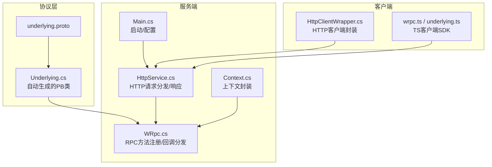
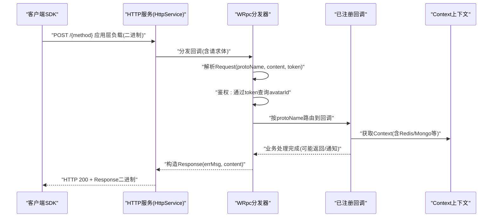
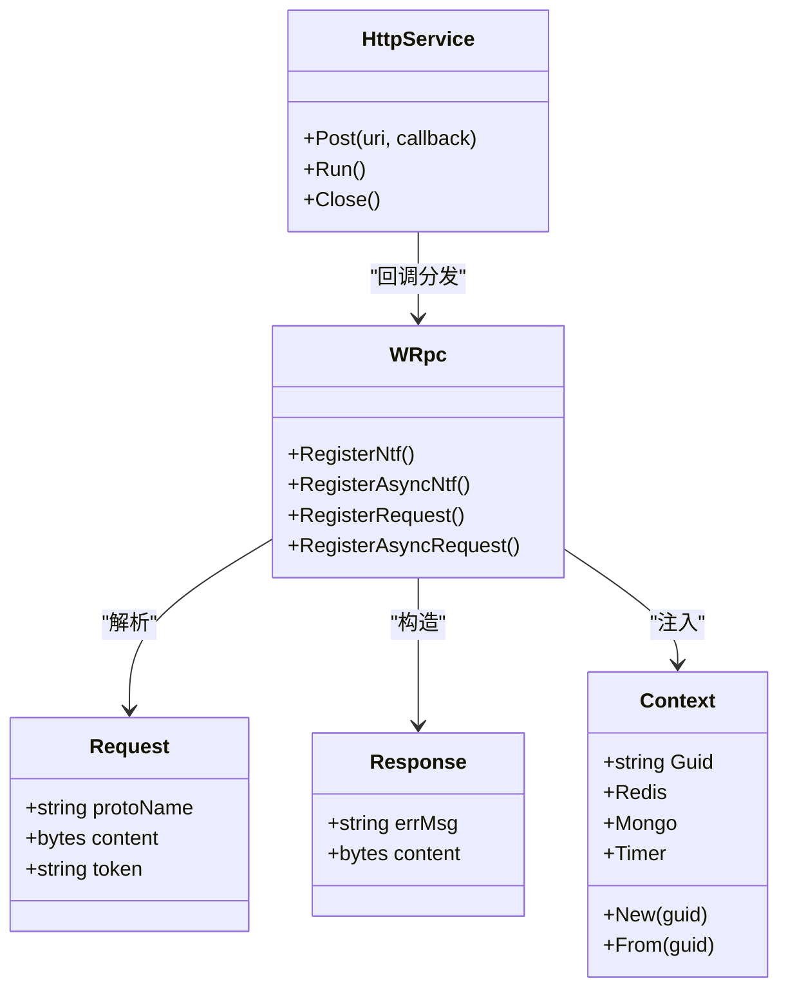
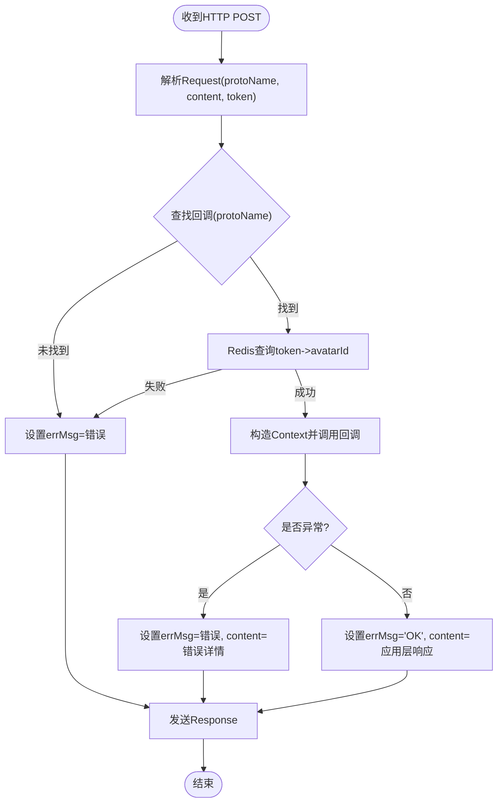
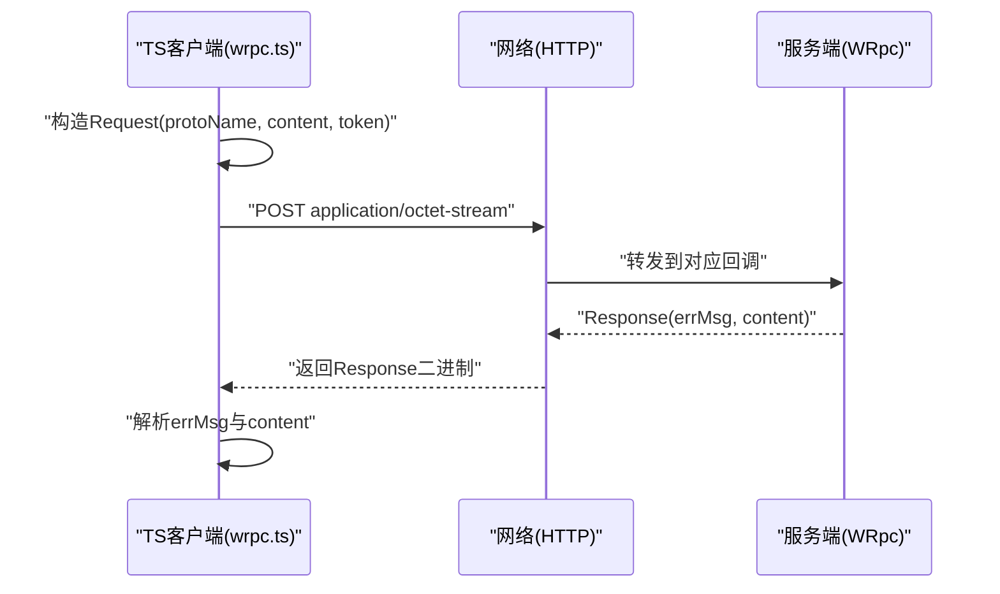
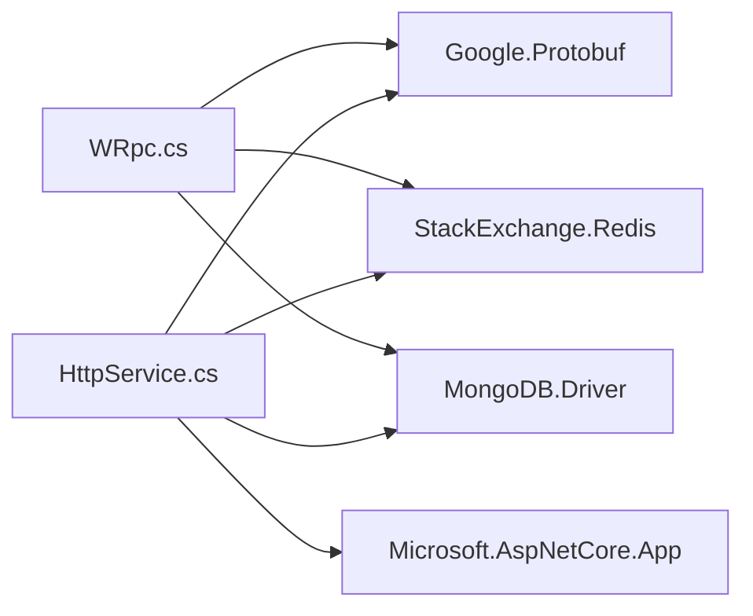

# RPC协议

<cite>
**本文引用的文件**
- [underlying.proto](file://lgbf/underlying/underlying.proto)
- [Underlying.cs](file://lgbf/hub/Underlying.cs)
- [WRpc.cs](file://lgbf/hub/WRpc.cs)
- [HttpService.cs](file://lgbf/hub/HttpService.cs)
- [Main.cs](file://lgbf/hub/Main.cs)
- [Context.cs](file://lgbf/hub/Context.cs)
- [HttpClientWrapper.cs](file://lgbf/hub/HttpClientWrapper.cs)
- [wrpc.ts](file://gem/ccc/assets/script/ServerSDK/wrpc.ts)
- [underlying.ts](file://gem/ccc/assets/script/ServerSDK/underlying.ts)
- [hub.csproj](file://lgbf/hub/hub.csproj)
</cite>

## 目录
1. [简介](#简介)
2. [项目结构](#项目结构)
3. [核心组件](#核心组件)
4. [架构总览](#架构总览)
5. [详细组件分析](#详细组件分析)
6. [依赖分析](#依赖分析)
7. [性能考虑](#性能考虑)
8. [故障排查指南](#故障排查指南)
9. [结论](#结论)
10. [附录](#附录)

## 简介
本文件系统化梳理 LGBF 框架中的 RPC 协议规范与实现，覆盖 Protocol Buffers 消息定义、字段类型与序列化规则；明确 RPC 方法注册与调用流程、参数与返回值格式；给出消息头、版本控制与向后兼容策略；并提供客户端 SDK（C# 与 TypeScript）的使用示例与集成指南，涵盖 WRpc 客户端实现、连接管理、错误处理、消息压缩与安全传输建议，以及协议调试与性能监控方法。

## 项目结构
围绕 RPC 协议的关键文件分布于以下模块：
- 协议定义：underlying.proto（C# 生成代码 Underlying.cs）
- 服务端 RPC 框架：WRpc.cs、HttpService.cs、Main.cs、Context.cs
- 客户端 SDK：C# WRpc 客户端（通过底层 HTTP 调用）、TypeScript WRpc 客户端
- 项目依赖：hub.csproj（包含 Google.Protobuf、MongoDB、StackExchange.Redis 等）

**图表来源**
- [underlying.proto:1-12](file://lgbf/underlying/underlying.proto#L1-L12)
- [Underlying.cs:1-550](file://lgbf/hub/Underlying.cs#L1-L550)
- [WRpc.cs:1-155](file://lgbf/hub/WRpc.cs#L1-L155)
- [HttpService.cs:1-182](file://lgbf/hub/HttpService.cs#L1-L182)
- [Main.cs:1-159](file://lgbf/hub/Main.cs#L1-L159)
- [Context.cs:1-27](file://lgbf/hub/Context.cs#L1-L27)
- [HttpClientWrapper.cs:1-48](file://lgbf/hub/HttpClientWrapper.cs#L1-L48)
- [wrpc.ts:1-102](file://gem/ccc/assets/script/ServerSDK/wrpc.ts#L1-L102)
- [underlying.ts:1-240](file://gem/ccc/assets/script/ServerSDK/underlying.ts#L1-L240)

**章节来源**
- [underlying.proto:1-12](file://lgbf/underlying/underlying.proto#L1-L12)
- [Underlying.cs:1-550](file://lgbf/hub/Underlying.cs#L1-L550)
- [WRpc.cs:1-155](file://lgbf/hub/WRpc.cs#L1-L155)
- [HttpService.cs:1-182](file://lgbf/hub/HttpService.cs#L1-L182)
- [Main.cs:1-159](file://lgbf/hub/Main.cs#L1-L159)
- [Context.cs:1-27](file://lgbf/hub/Context.cs#L1-L27)
- [HttpClientWrapper.cs:1-48](file://lgbf/hub/HttpClientWrapper.cs#L1-L48)
- [wrpc.ts:1-102](file://gem/ccc/assets/script/ServerSDK/wrpc.ts#L1-L102)
- [underlying.ts:1-240](file://gem/ccc/assets/script/ServerSDK/underlying.ts#L1-L240)
- [hub.csproj:1-20](file://lgbf/hub/hub.csproj#L1-L20)

## 核心组件
- 协议消息模型
  - Request：包含 protoName（方法名）、content（二进制负载）、token（鉴权令牌）
  - Response：包含 errMsg（错误信息或“OK”）、content（二进制返回体）
- 服务端 WRpc：基于 HTTP 的 RPC 分发器，负责解析 Request、按方法名路由到已注册回调、鉴权校验、构造 Response 并回传
- HTTP 服务：Kestrel 承载 HTTP/1.1 与 HTTP/2，统一入口分发 POST 请求，支持 CORS 头
- 上下文 Context：封装当前调用的用户标识与数据访问能力（Redis/Mongo/Timers）
- 客户端 SDK：C# 与 TypeScript 两端均以 Request/Response 为载体，通过 HTTP 发送二进制负载

**章节来源**
- [underlying.proto:1-12](file://lgbf/underlying/underlying.proto#L1-L12)
- [Underlying.cs:39-544](file://lgbf/hub/Underlying.cs#L39-L544)
- [WRpc.cs:6-154](file://lgbf/hub/WRpc.cs#L6-L154)
- [HttpService.cs:18-181](file://lgbf/hub/HttpService.cs#L18-L181)
- [Context.cs:4-26](file://lgbf/hub/Context.cs#L4-L26)
- [wrpc.ts:21-101](file://gem/ccc/assets/script/ServerSDK/wrpc.ts#L21-L101)
- [underlying.ts:12-21](file://gem/ccc/assets/script/ServerSDK/underlying.ts#L12-L21)

## 架构总览
下图展示从客户端发起 RPC 到服务端处理与回包的整体流程。

**图表来源**
- [HttpService.cs:50-114](file://lgbf/hub/HttpService.cs#L50-L114)
- [WRpc.cs:14-45](file://lgbf/hub/WRpc.cs#L14-L45)
- [WRpc.cs:47-153](file://lgbf/hub/WRpc.cs#L47-L153)
- [Context.cs:11-20](file://lgbf/hub/Context.cs#L11-L20)

## 详细组件分析

### 协议消息定义与序列化规则
- 消息定义
  - Request：字符串字段 protoName、字节字段 content、字符串字段 token
  - Response：字符串字段 errMsg、字节字段 content
- 字段类型与约束
  - protoName：方法名，用于路由到具体回调
  - content：任意应用层 PB 消息的二进制编码
  - token：鉴权令牌，服务端通过 Redis 查询关联的 avatarId
  - errMsg：成功时为“OK”，失败时为错误描述
  - content：成功时为应用层返回消息的二进制编码，失败时可携带错误详情
- 序列化规则
  - 使用 Protocol Buffers 编解码，字段采用 varint/length-prefixed 编码
  - 客户端与服务端共享同一 .proto 文件，确保双方一致的二进制格式
  - 服务端使用 Google.Protobuf 解析 Request，再由回调函数解析应用层消息

**图表来源**
- [underlying.proto:3-12](file://lgbf/underlying/underlying.proto#L3-L12)
- [Underlying.cs:40-544](file://lgbf/hub/Underlying.cs#L40-L544)
- [WRpc.cs:47-153](file://lgbf/hub/WRpc.cs#L47-L153)
- [HttpService.cs:117-181](file://lgbf/hub/HttpService.cs#L117-L181)
- [Context.cs:4-26](file://lgbf/hub/Context.cs#L4-L26)

**章节来源**
- [underlying.proto:1-12](file://lgbf/underlying/underlying.proto#L1-L12)
- [Underlying.cs:39-544](file://lgbf/hub/Underlying.cs#L39-L544)
- [wrpc.ts:54-68](file://gem/ccc/assets/script/ServerSDK/wrpc.ts#L54-L68)
- [underlying.ts:27-189](file://gem/ccc/assets/script/ServerSDK/underlying.ts#L27-L189)

### RPC 方法注册与调用流程
- 注册接口
  - 同步通知 RegisterNtf：接收应用层消息，无返回值
  - 异步通知 RegisterAsyncNtf：异步处理通知
  - 同步请求 RegisterRequest：接收应用层请求消息，返回应用层响应消息
  - 异步请求 RegisterAsyncRequest：异步处理请求
- 路由与鉴权
  - 通过 protoName 查找已注册回调
  - 使用 token 从 Redis 获取 avatarId，作为 Context.Guid
- 回调签名
  - 回调入参包含 Context 与应用层消息
  - 返回值为应用层响应消息（同步/异步两种模式）
- 响应回传
  - 成功：errMsg=“OK”，content=应用层响应消息的二进制
  - 失败：errMsg=错误信息，content=可选错误详情

**图表来源**
- [WRpc.cs:14-45](file://lgbf/hub/WRpc.cs#L14-L45)
- [WRpc.cs:47-153](file://lgbf/hub/WRpc.cs#L47-L153)
- [Context.cs:11-20](file://lgbf/hub/Context.cs#L11-L20)

**章节来源**
- [WRpc.cs:47-153](file://lgbf/hub/WRpc.cs#L47-L153)
- [Context.cs:4-26](file://lgbf/hub/Context.cs#L4-L26)

### HTTP 服务与连接管理
- 入口与分发
  - Kestrel 监听指定端口，支持 HTTP/1.1 与 HTTP/2
  - 路径首段作为 endpoint，POST 请求交由对应回调处理
  - OPTIONS 预检请求直接返回跨域头与 200
- 请求体读取
  - 使用 ArrayPool<byte> 进行内存复用
  - 支持长连接 Keep-Alive，默认超时 120 秒
- 统计与日志
  - 每秒统计连接数，便于性能观测
  - 超时超过 1000ms 记录告警日志

**章节来源**
- [HttpService.cs:40-114](file://lgbf/hub/HttpService.cs#L40-L114)
- [HttpService.cs:149-181](file://lgbf/hub/HttpService.cs#L149-L181)

### 客户端 SDK（C# 与 TypeScript）
- C# 客户端
  - 通过 HttpClientWrapper 封装 HTTP 请求
  - 构造 Request（protoName、content、token），发送至服务端
  - 接收 Response，解析 errMsg 与 content
- TypeScript 客户端
  - 使用 XMLHttpRequest 发送二进制请求
  - 通过 underlying.ts 中的 Request/Response 编解码
  - 提供 WRpc 类封装 Notify 与 Request 两类调用

**图表来源**
- [wrpc.ts:21-101](file://gem/ccc/assets/script/ServerSDK/wrpc.ts#L21-L101)
- [underlying.ts:27-189](file://gem/ccc/assets/script/ServerSDK/underlying.ts#L27-L189)
- [WRpc.cs:14-45](file://lgbf/hub/WRpc.cs#L14-L45)

**章节来源**
- [HttpClientWrapper.cs:4-48](file://lgbf/hub/HttpClientWrapper.cs#L4-L48)
- [wrpc.ts:1-102](file://gem/ccc/assets/script/ServerSDK/wrpc.ts#L1-L102)
- [underlying.ts:1-240](file://gem/ccc/assets/script/ServerSDK/underlying.ts#L1-L240)

### 错误处理机制
- 服务端
  - 空请求体、未知 protoName、token 无效等场景抛出异常并记录日志
  - 回调内部异常捕获后写入 Response.errMsg，并返回错误详情
- 客户端
  - C#：HttpClientWrapper 对 HTTP 异常进行日志记录并抛出
  - TS：XHR 对 HTTP 状态码、空响应体、超时、网络错误分别处理并抛出 WRpcError

**章节来源**
- [WRpc.cs:18-44](file://lgbf/hub/WRpc.cs#L18-L44)
- [WRpc.cs:56-95](file://lgbf/hub/WRpc.cs#L56-L95)
- [HttpClientWrapper.cs:12-47](file://lgbf/hub/HttpClientWrapper.cs#L12-L47)
- [wrpc.ts:70-100](file://gem/ccc/assets/script/ServerSDK/wrpc.ts#L70-L100)

## 依赖分析
- 协议与编解码
  - Google.Protobuf：Request/Response 的编解码与反射
- 数据存储
  - StackExchange.Redis：token -> avatarId 的鉴权映射
  - MongoDB.Driver：实体持久化与批量更新
- Web 框架
  - Microsoft.AspNetCore.App：Kestrel、ASP.NET Core 管道
- JSON 工具
  - Newtonsoft.Json：部分场景下的 JSON 序列化

**图表来源**
- [hub.csproj:9-17](file://lgbf/hub/hub.csproj#L9-L17)
- [WRpc.cs:1-10](file://lgbf/hub/WRpc.cs#L1-L10)
- [HttpService.cs:1-14](file://lgbf/hub/HttpService.cs#L1-L14)

**章节来源**
- [hub.csproj:1-20](file://lgbf/hub/hub.csproj#L1-L20)

## 性能考虑
- 连接与并发
  - Kestrel 最大并发连接数上限配置，避免过载
  - Keep-Alive 超时设置，平衡资源占用与延迟
- 内存与序列化
  - 使用 ArrayPool<byte> 减少 GC 压力
  - Protocol Buffers 二进制序列化相比 JSON 更紧凑高效
- 监控与统计
  - 每秒连接统计输出，便于观察峰值与异常波动
  - 超时阈值告警，辅助定位慢请求

**章节来源**
- [HttpService.cs:154-160](file://lgbf/hub/HttpService.cs#L154-L160)
- [HttpService.cs:47-62](file://lgbf/hub/HttpService.cs#L47-L62)
- [HttpService.cs:108-112](file://lgbf/hub/HttpService.cs#L108-L112)

## 故障排查指南
- 常见问题定位
  - 空请求体：检查客户端是否正确构造 Request 且设置了正确的 Content-Type
  - 未知方法名：确认 protoName 是否与服务端注册一致
  - token 无效：核对 Redis 中 token 与 avatarId 的映射是否存在
  - 回调异常：查看服务端日志中 WRpc 的异常堆栈
- 日志与指标
  - 服务端日志包含请求处理耗时与连接统计
  - 客户端网络异常与超时均有明确错误信息
- 快速验证
  - 使用最小化应用层消息进行端到端联调
  - 在本地环境开启详细日志，逐步缩小问题范围

**章节来源**
- [WRpc.cs:18-44](file://lgbf/hub/WRpc.cs#L18-L44)
- [WRpc.cs:56-95](file://lgbf/hub/WRpc.cs#L56-L95)
- [HttpService.cs:101-103](file://lgbf/hub/HttpService.cs#L101-L103)
- [HttpClientWrapper.cs:14-25](file://lgbf/hub/HttpClientWrapper.cs#L14-L25)
- [wrpc.ts:79-96](file://gem/ccc/assets/script/ServerSDK/wrpc.ts#L79-L96)

## 结论
LGBF 的 RPC 协议以 Protocol Buffers 为核心，结合 HTTP/1.1 与 HTTP/2 实现高吞吐、低开销的服务间通信。服务端通过 WRpc 提供统一的回调注册与分发机制，配合 Context 上下文与 Redis/Mongo 访问能力，满足游戏与实时业务的扩展需求。客户端 SDK 提供 C# 与 TypeScript 双端实现，便于在不同运行时集成。建议在生产环境中启用连接池与内存复用、完善超时与重试策略，并持续监控连接统计与慢请求指标。

## 附录

### 协议字段与类型对照表
- Request
  - protoName: string（方法名）
  - content: bytes（应用层消息二进制）
  - token: string（鉴权令牌）
- Response
  - errMsg: string（错误信息或“OK”）
  - content: bytes（应用层返回消息二进制）

**章节来源**
- [underlying.proto:3-12](file://lgbf/underlying/underlying.proto#L3-L12)
- [Underlying.cs:40-544](file://lgbf/hub/Underlying.cs#L40-L544)

### 版本控制与向后兼容
- 版本控制
  - 当前协议为单文件定义，版本号未内建于消息头
- 向后兼容
  - 新增字段应保持 optional 或使用新字段编号，避免破坏旧客户端解析
  - 不建议删除或重用已有字段编号
  - 服务端可通过 protoName 前缀区分版本（如 v1_method），以实现多版本共存

**章节来源**
- [underlying.proto:1-12](file://lgbf/underlying/underlying.proto#L1-L12)

### 客户端集成示例（要点）
- C#
  - 使用 HttpClientWrapper 发送 POST，设置 Content-Type 为 application/octet-stream
  - 将应用层消息编码为字节数组，填充到 Request.content
  - 读取 Response.errMsg 与 Response.content，解析应用层响应
- TypeScript
  - 使用 wrpc.ts 的 WRpc 类，调用 Notify 或 Request
  - 通过 underlying.ts 的 Request/Response 编解码器传递应用层消息

**章节来源**
- [HttpClientWrapper.cs:12-47](file://lgbf/hub/HttpClientWrapper.cs#L12-L47)
- [wrpc.ts:21-101](file://gem/ccc/assets/script/ServerSDK/wrpc.ts#L21-L101)
- [underlying.ts:27-189](file://gem/ccc/assets/script/ServerSDK/underlying.ts#L27-L189)

### 消息压缩与加密（建议）
- 压缩
  - 对大体积 content 可在应用层启用 gzip/deflate 压缩，服务端解压后再解析
- 加密
  - 建议在 TLS 层（HTTPS）传输，或在应用层对 content 进行对称加密
- 安全传输
  - 严格校验 token 与 avatarId 映射，防止越权访问
  - 限制请求体大小与超时时间，抵御滥用

[本节为通用实践建议，不直接分析具体文件]

### 协议调试与性能监控
- 调试
  - 使用抓包工具（如 Wireshark/Charles）观察 HTTP 报文与二进制负载
  - 在服务端开启详细日志，记录 protoName、token、耗时与异常
- 性能监控
  - 关注每秒连接统计与慢请求阈值告警
  - 监控 Redis/Mongo 的延迟与错误率，定位瓶颈

**章节来源**
- [HttpService.cs:47-62](file://lgbf/hub/HttpService.cs#L47-L62)
- [HttpService.cs:108-112](file://lgbf/hub/HttpService.cs#L108-L112)