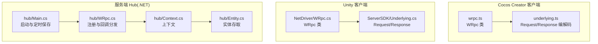
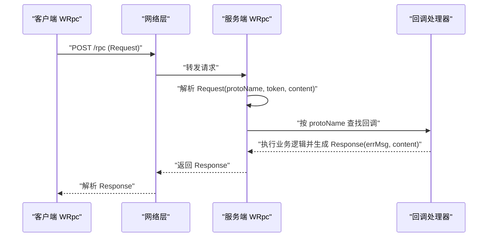
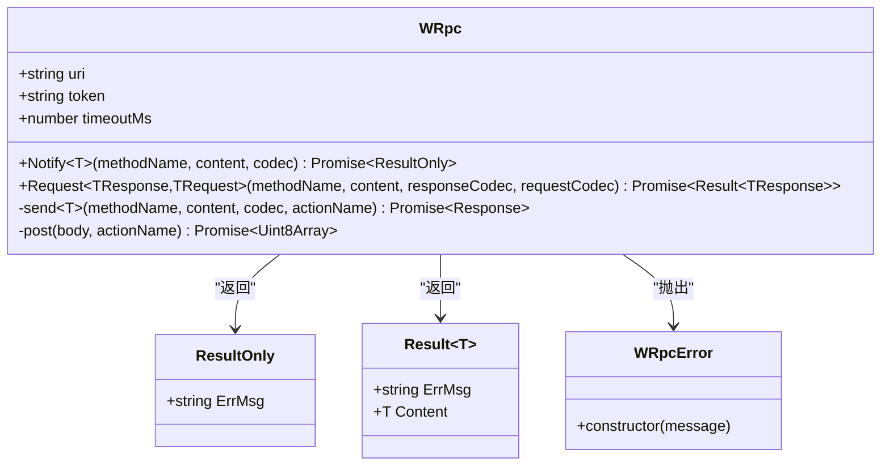
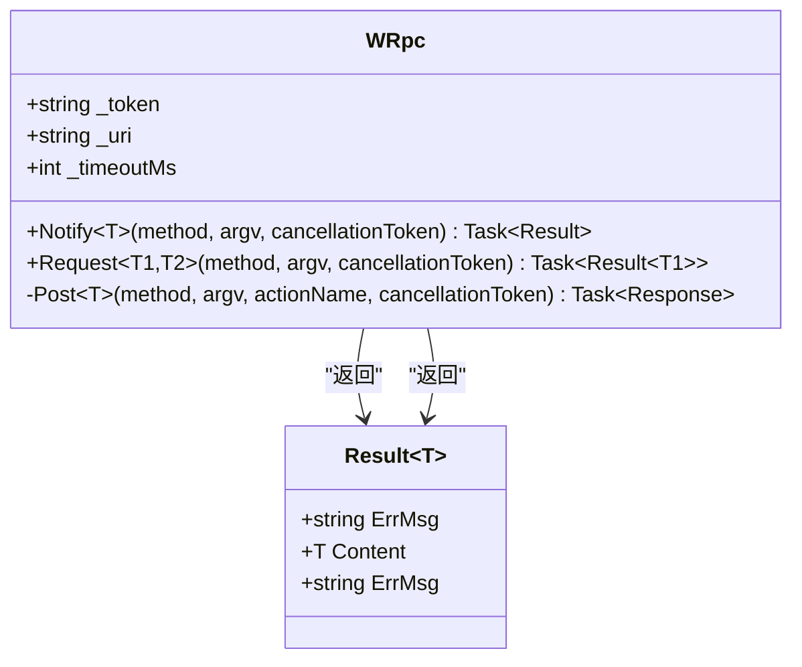
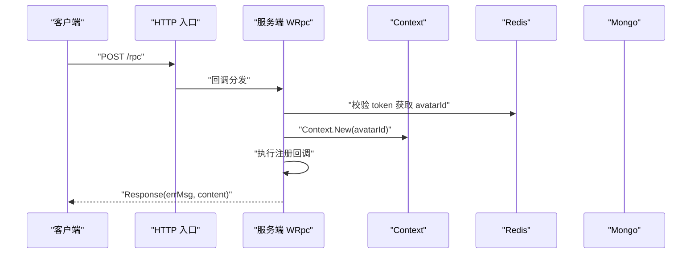
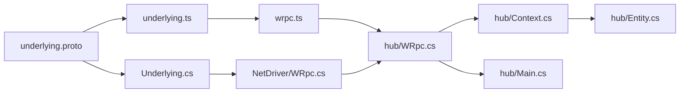

# SDK接口

<cite>
**本文引用的文件**
- [WRpc.cs](file://gem/ccc/assets/script/ServerSDK/wrpc.ts)
- [underlying.ts](file://gem/ccc/assets/script/ServerSDK/underlying.ts)
- [WRpc.cs](file://gem/unity/Assets/Script/NetDriver/WRpc.cs)
- [Underlying.cs](file://gem/unity/Assets/Script/ServerSDK/Underlying.cs)
- [WRpc.cs](file://lgbf/hub/WRpc.cs)
- [Context.cs](file://lgbf/hub/Context.cs)
- [Entity.cs](file://lgbf/hub/Entity.cs)
- [Main.cs](file://lgbf/hub/Main.cs)
- [underlying.proto](file://lgbf/underlying/underlying.proto)
</cite>

## 目录
1. [简介](#简介)
2. [项目结构](#项目结构)
3. [核心组件](#核心组件)
4. [架构总览](#架构总览)
5. [详细组件分析](#详细组件分析)
6. [依赖关系分析](#依赖关系分析)
7. [性能考虑](#性能考虑)
8. [故障排除指南](#故障排除指南)
9. [结论](#结论)
10. [附录](#附录)

## 简介
本文件为 LGBF 框架 SDK 的接口参考文档，覆盖 Cocos Creator 与 Unity 两大引擎生态下的 WRpc 客户端 API。内容包括：
- 方法签名、参数定义与返回值类型
- 使用示例与代码片段路径（以源码路径代替具体代码）
- 连接建立、消息发送、回调处理与错误恢复机制
- 异步操作、Promise 处理与事件监听最佳实践
- SDK 配置选项、性能调优与内存管理建议
- 故障排除指南与常见问题解决方案

## 项目结构
围绕 WRpc 的实现，仓库在不同平台下提供了对应的客户端与服务端适配层：
- Cocos Creator 客户端：基于 TypeScript 的 WRpc 类与底层 Protobuf 编解码
- Unity 客户端：基于 C# 的 WRpc 类与 UnityWebRequest 发送
- 服务端 Hub：基于 .NET 的 WRpc 注册与回调分发，结合 Context、Entity 等能力

图表来源
- [wrpc.ts:21-101](file://gem/ccc/assets/script/ServerSDK/wrpc.ts#L21-L101)
- [underlying.ts:12-21](file://gem/ccc/assets/script/ServerSDK/underlying.ts#L12-L21)
- [WRpc.cs:21-127](file://gem/unity/Assets/Script/NetDriver/WRpc.cs#L21-L127)
- [Underlying.cs:40-120](file://gem/unity/Assets/Script/ServerSDK/Underlying.cs#L40-L120)
- [WRpc.cs:6-154](file://lgbf/hub/WRpc.cs#L6-L154)
- [Context.cs:4-26](file://lgbf/hub/Context.cs#L4-L26)
- [Entity.cs:94-153](file://lgbf/hub/Entity.cs#L94-L153)
- [Main.cs:13-40](file://lgbf/hub/Main.cs#L13-L40)

章节来源
- [wrpc.ts:1-101](file://gem/ccc/assets/script/ServerSDK/wrpc.ts#L1-L101)
- [underlying.ts:1-240](file://gem/ccc/assets/script/ServerSDK/underlying.ts#L1-L240)
- [WRpc.cs:1-129](file://gem/unity/Assets/Script/NetDriver/WRpc.cs#L1-L129)
- [Underlying.cs:1-550](file://gem/unity/Assets/Script/ServerSDK/Underlying.cs#L1-L550)
- [WRpc.cs:1-155](file://lgbf/hub/WRpc.cs#L1-L155)
- [Context.cs:1-27](file://lgbf/hub/Context.cs#L1-L27)
- [Entity.cs:1-154](file://lgbf/hub/Entity.cs#L1-L154)
- [Main.cs:1-159](file://lgbf/hub/Main.cs#L1-L159)
- [underlying.proto:1-12](file://lgbf/underlying/underlying.proto#L1-L12)

## 核心组件
- Cocos Creator WRpc（TypeScript）
  - 提供 Notify 与 Request 两类 RPC 调用，支持超时控制与错误包装
  - 通过底层 Request/Response 编解码进行消息传输
- Unity WRpc（C#）
  - 提供 Notify 与 Request 两类 RPC 调用，支持取消令牌与超时控制
  - 基于 UnityWebRequest 发送请求，解析 Response 并返回结果对象
- 服务端 WRpc（.NET）
  - 通过 HTTP 接收请求，按 protoName 分发到已注册的回调
  - 结合 Context 提供 Redis、Mongo、Timer 等资源访问
- 底层协议（Protobuf）
  - Request/Response 两消息体，承载 token、protoName 与二进制 content

章节来源
- [wrpc.ts:21-101](file://gem/ccc/assets/script/ServerSDK/wrpc.ts#L21-L101)
- [underlying.ts:12-21](file://gem/ccc/assets/script/ServerSDK/underlying.ts#L12-L21)
- [WRpc.cs:21-127](file://gem/unity/Assets/Script/NetDriver/WRpc.cs#L21-L127)
- [Underlying.cs:40-120](file://gem/unity/Assets/Script/ServerSDK/Underlying.cs#L40-L120)
- [WRpc.cs:6-154](file://lgbf/hub/WRpc.cs#L6-L154)
- [Context.cs:4-26](file://lgbf/hub/Context.cs#L4-L26)
- [underlying.proto:3-12](file://lgbf/underlying/underlying.proto#L3-L12)

## 架构总览
WRpc 在客户端与服务端之间通过 HTTP 传输 Protobuf 编码的消息。客户端负责构造 Request，服务端解析后根据方法名路由到回调，并将执行结果封装为 Response 返回。

图表来源
- [underlying.proto:3-12](file://lgbf/underlying/underlying.proto#L3-L12)
- [WRpc.cs:14-45](file://lgbf/hub/WRpc.cs#L14-L45)
- [underlying.ts:12-21](file://gem/ccc/assets/script/ServerSDK/underlying.ts#L12-L21)
- [WRpc.cs:35-82](file://gem/unity/Assets/Script/NetDriver/WRpc.cs#L35-L82)

## 详细组件分析

### Cocos Creator WRpc（TypeScript）
- 类型与编解码
  - WRpcCodec<T>：仅包含 encode/decode 的编解码器接口
  - Result<T>/ResultOnly：统一的响应载体，包含 errMsg 与可选 content
- 关键方法
  - Notify<T>(methodName, content, codec): Promise<ResultOnly>
  - Request<TResponse, TRequest>(methodName, content, responseCodec, requestCodec): Promise<Result<TResponse>>
- 内部流程
  - send：构造 Request（token/protoName/content），编码后通过 post 发送
  - post：XMLHttpRequest 异步发送，设置超时与错误回调，解析 Response
- 错误处理
  - WRpcError：统一的错误类型，涵盖网络错误、超时、空响应等场景
- 使用示例（代码片段路径）
  - [Notify 示例:32-37](file://gem/ccc/assets/script/ServerSDK/wrpc.ts#L32-L37)
  - [Request 示例:39-52](file://gem/ccc/assets/script/ServerSDK/wrpc.ts#L39-L52)
  - [post 超时与错误处理:70-100](file://gem/ccc/assets/script/ServerSDK/wrpc.ts#L70-L100)

图表来源
- [wrpc.ts:21-101](file://gem/ccc/assets/script/ServerSDK/wrpc.ts#L21-L101)

章节来源
- [wrpc.ts:1-101](file://gem/ccc/assets/script/ServerSDK/wrpc.ts#L1-L101)
- [underlying.ts:12-21](file://gem/ccc/assets/script/ServerSDK/underlying.ts#L12-L21)

### Unity WRpc（C#）
- 类型与结果
  - Result<T>/Result：统一的响应载体，包含 errMsg
- 关键方法
  - Notify<T>(method, argv[, cancellationToken]): Task<Result>
  - Request<T1, T2>(method, argv[, cancellationToken]): Task<Result<T1>>
- 内部流程
  - Post：构造 Request（Token/ProtoName/Content），使用 UnityWebRequest 发送
  - 轮询等待完成，支持取消令牌与超时中断；解析 Response 并返回
- 错误处理
  - 超时、网络错误、空响应体均抛出异常；错误信息写入 Result.ErrMsg
- 使用示例（代码片段路径）
  - [Notify 示例:84-100](file://gem/unity/Assets/Script/NetDriver/WRpc.cs#L84-L100)
  - [Request 示例:102-126](file://gem/unity/Assets/Script/NetDriver/WRpc.cs#L102-L126)
  - [Post 超时与取消处理:35-82](file://gem/unity/Assets/Script/NetDriver/WRpc.cs#L35-L82)

图表来源
- [WRpc.cs:21-127](file://gem/unity/Assets/Script/NetDriver/WRpc.cs#L21-L127)
- [Underlying.cs:40-120](file://gem/unity/Assets/Script/ServerSDK/Underlying.cs#L40-L120)

章节来源
- [WRpc.cs:1-129](file://gem/unity/Assets/Script/NetDriver/WRpc.cs#L1-L129)
- [Underlying.cs:1-550](file://gem/unity/Assets/Script/ServerSDK/Underlying.cs#L1-L550)

### 服务端 WRpc（.NET）
- 初始化与回调注册
  - 构造函数：订阅 HTTP 入口，解析 Request，校验 token，按 protoName 查找回调
  - RegisterNtf/RegisterAsyncNtf：注册通知类回调（无返回值）
  - RegisterRequest/RegisterAsyncRequest：注册请求类回调（返回响应消息）
- 上下文与实体
  - Context：提供 Guid、Redis、Mongo、Timer 等资源访问
  - Entity：基于 Redis/Mongo 的实体读写与脏数据批量落盘
- 启动与定时任务
  - Main.Start：初始化 Redis/Mongo，启动 HTTP 服务，注册定时保存任务
- 使用示例（代码片段路径）
  - [构造与回调分发:14-45](file://lgbf/hub/WRpc.cs#L14-L45)
  - [注册通知回调:47-71](file://lgbf/hub/WRpc.cs#L47-L71)
  - [注册请求回调:99-125](file://lgbf/hub/WRpc.cs#L99-L125)
  - [Context 创建:11-20](file://lgbf/hub/Context.cs#L11-L20)
  - [实体读取/创建:104-152](file://lgbf/hub/Entity.cs#L104-L152)
  - [定时保存流程:50-157](file://lgbf/hub/Main.cs#L50-L157)

图表来源
- [WRpc.cs:14-45](file://lgbf/hub/WRpc.cs#L14-L45)
- [Context.cs:11-20](file://lgbf/hub/Context.cs#L11-L20)
- [Entity.cs:104-152](file://lgbf/hub/Entity.cs#L104-L152)
- [Main.cs:31-40](file://lgbf/hub/Main.cs#L31-L40)

章节来源
- [WRpc.cs:1-155](file://lgbf/hub/WRpc.cs#L1-L155)
- [Context.cs:1-27](file://lgbf/hub/Context.cs#L1-L27)
- [Entity.cs:1-154](file://lgbf/hub/Entity.cs#L1-L154)
- [Main.cs:1-159](file://lgbf/hub/Main.cs#L1-L159)

## 依赖关系分析
- 协议层
  - underlying.proto 定义 Request/Response，TypeScript 与 C# 两端分别生成对应编解码代码
- 客户端到服务端
  - 客户端通过 HTTP POST 发送 Request，服务端解析后按方法名路由回调
- 服务端内部
  - WRpc 依赖 Context 提供资源句柄；Context 又依赖 Main 中的全局 Redis/Mongo/Timers
  - Entity 负责实体数据的读写与批量落盘，Main 中定时触发保存流程

图表来源
- [underlying.proto:1-12](file://lgbf/underlying/underlying.proto#L1-L12)
- [underlying.ts:12-21](file://gem/ccc/assets/script/ServerSDK/underlying.ts#L12-L21)
- [Underlying.cs:40-120](file://gem/unity/Assets/Script/ServerSDK/Underlying.cs#L40-L120)
- [wrpc.ts:1-101](file://gem/ccc/assets/script/ServerSDK/wrpc.ts#L1-L101)
- [WRpc.cs:1-129](file://gem/unity/Assets/Script/NetDriver/WRpc.cs#L1-L129)
- [WRpc.cs:1-155](file://lgbf/hub/WRpc.cs#L1-L155)
- [Context.cs:1-27](file://lgbf/hub/Context.cs#L1-L27)
- [Entity.cs:1-154](file://lgbf/hub/Entity.cs#L1-L154)
- [Main.cs:1-159](file://lgbf/hub/Main.cs#L1-L159)

章节来源
- [underlying.proto:1-12](file://lgbf/underlying/underlying.proto#L1-L12)
- [underlying.ts:1-240](file://gem/ccc/assets/script/ServerSDK/underlying.ts#L1-L240)
- [Underlying.cs:1-550](file://gem/unity/Assets/Script/ServerSDK/Underlying.cs#L1-L550)
- [wrpc.ts:1-101](file://gem/ccc/assets/script/ServerSDK/wrpc.ts#L1-L101)
- [WRpc.cs:1-129](file://gem/unity/Assets/Script/NetDriver/WRpc.cs#L1-L129)
- [WRpc.cs:1-155](file://lgbf/hub/WRpc.cs#L1-L155)
- [Context.cs:1-27](file://lgbf/hub/Context.cs#L1-L27)
- [Entity.cs:1-154](file://lgbf/hub/Entity.cs#L1-L154)
- [Main.cs:1-159](file://lgbf/hub/Main.cs#L1-L159)

## 性能考虑
- 超时与重试
  - 客户端提供超时参数（TypeScript 默认 10 秒；C# 默认 10 秒），建议根据网络环境调整
  - 对关键请求可引入指数退避重试策略，避免瞬时抖动放大
- 序列化开销
  - Protobuf 已较高效，尽量复用编解码器实例，避免重复创建
- 网络并发
  - 控制并发请求数量，避免阻塞主线程或引发网络拥塞
- 服务端批处理
  - 实体落盘采用批量更新与去重队列，减少数据库压力
- 内存管理
  - Unity 客户端使用 UnityWebRequest 生命周期管理，注意及时释放下载/上传处理器
  - TypeScript 客户端注意 ArrayBuffer 的生命周期，避免内存泄漏

## 故障排除指南
- 常见错误与定位
  - 空响应体：检查服务端是否正确返回 Response，确认网络链路与跨域头设置
  - 超时：提升超时阈值或优化服务端处理逻辑；必要时拆分大请求
  - 网络错误：确认 URI 正确性与可达性；检查代理与证书配置
  - 回调未匹配：确保 protoName 与服务端注册一致
- 服务端错误
  - token 校验失败：确认客户端 token 与服务端存储一致
  - 回调异常：服务端回调中捕获异常并返回错误信息，便于客户端诊断
- Unity 特有
  - 取消令牌：使用 CancellationToken 主动中断长时间请求
  - 主线程阻塞：避免在主线程同步等待网络结果，使用异步 API
- Cocos Creator 特有
  - 跨域与安全策略：确保服务端返回正确的 CORS 头
  - 超时与重试：结合业务特性设计合理的重试策略

章节来源
- [wrpc.ts:70-100](file://gem/ccc/assets/script/ServerSDK/wrpc.ts#L70-L100)
- [WRpc.cs:35-82](file://gem/unity/Assets/Script/NetDriver/WRpc.cs#L35-L82)
- [WRpc.cs:14-45](file://lgbf/hub/WRpc.cs#L14-L45)

## 结论
LGBF 的 WRpc 在多端保持一致的 API 设计与协议语义，通过简洁的 Notify/Request 两类调用满足大多数游戏后端交互需求。配合服务端 Context/Entity 能力与定时落盘机制，可在保证易用性的同时兼顾性能与可靠性。建议在实际项目中结合平台特性完善超时、重试与监控体系，并遵循内存与并发最佳实践。

## 附录

### API 参考速查（方法签名、参数与返回）
- Cocos Creator（TypeScript）
  - Notify<T>(methodName: string, content: T, codec: WRpcCodec<T>): Promise<ResultOnly>
  - Request<TResponse, TRequest>(methodName: string, content: TRequest, responseCodec: WRpcCodec<TResponse>, requestCodec: WRpcCodec<TRequest>): Promise<Result<TResponse>>
- Unity（C#）
  - Notify<T>(method: string, argv: T, cancellationToken: CancellationToken = default): Task<Result>
  - Request<T1, T2>(method: string, argv: T2, cancellationToken: CancellationToken = default): Task<Result<T1>>

章节来源
- [wrpc.ts:32-52](file://gem/ccc/assets/script/ServerSDK/wrpc.ts#L32-L52)
- [WRpc.cs:84-126](file://gem/unity/Assets/Script/NetDriver/WRpc.cs#L84-L126)

### 使用示例（代码片段路径）
- Cocos Creator
  - [Notify 调用:32-37](file://gem/ccc/assets/script/ServerSDK/wrpc.ts#L32-L37)
  - [Request 调用:39-52](file://gem/ccc/assets/script/ServerSDK/wrpc.ts#L39-L52)
- Unity
  - [Notify 调用:84-100](file://gem/unity/Assets/Script/NetDriver/WRpc.cs#L84-L100)
  - [Request 调用:102-126](file://gem/unity/Assets/Script/NetDriver/WRpc.cs#L102-L126)

### 服务端回调注册（代码片段路径）
- [通知回调注册:47-71](file://lgbf/hub/WRpc.cs#L47-L71)
- [请求回调注册:99-125](file://lgbf/hub/WRpc.cs#L99-L125)