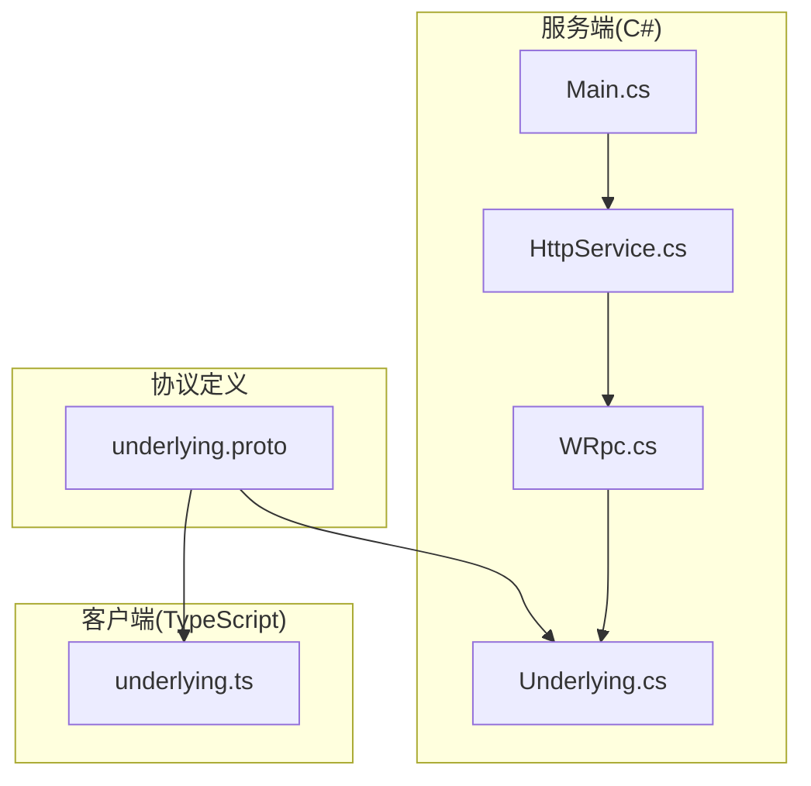
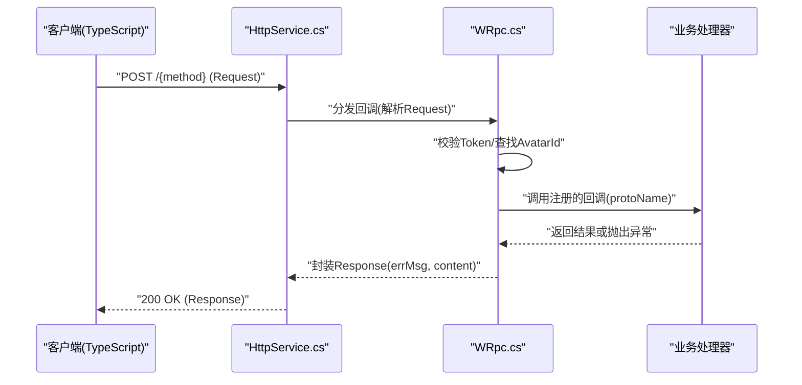
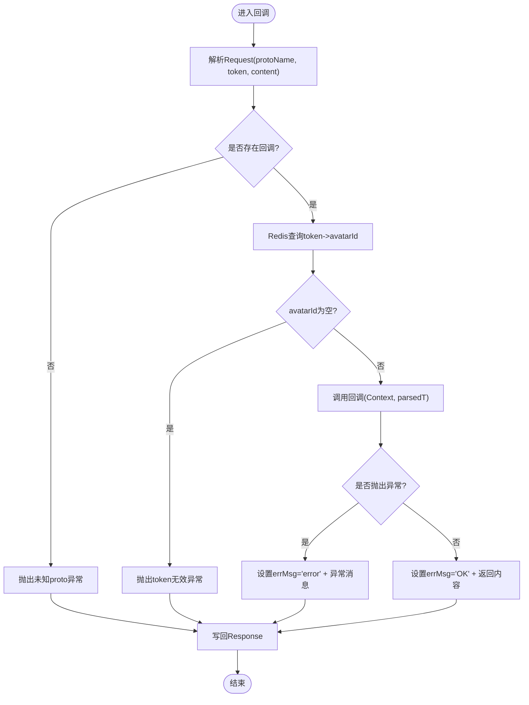
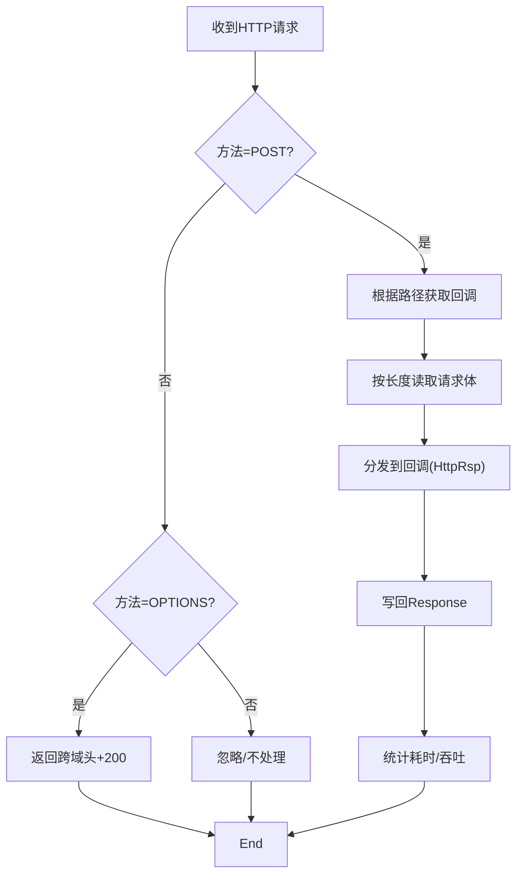
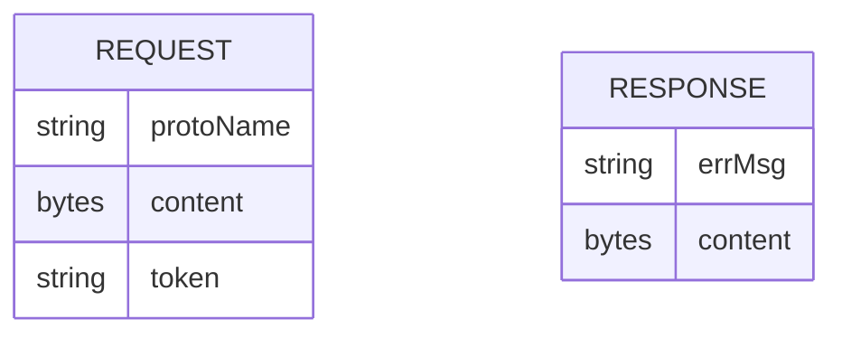
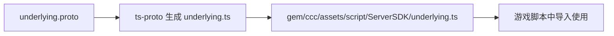
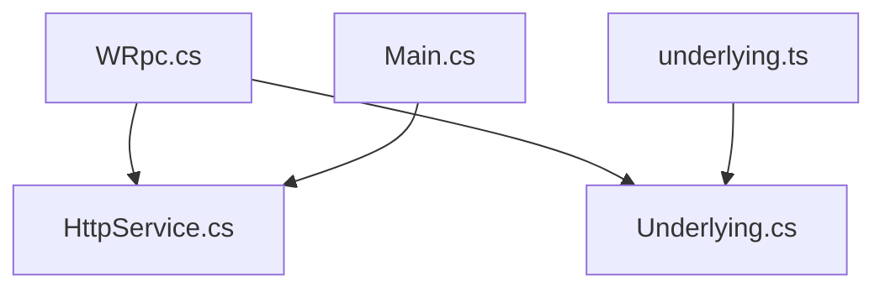

# Cocos Creator集成

<cite>
**本文引用的文件**   
- [WRpc.cs](file://lgbf/hub/WRpc.cs)
- [Underlying.cs](file://lgbf/hub/Underlying.cs)
- [underlying.proto](file://lgbf/underlying/underlying.proto)
- [HttpService.cs](file://lgbf/hub/HttpService.cs)
- [Main.cs](file://lgbf/hub/Main.cs)
- [underlying.ts](file://gem/ccc/assets/script/ServerSDK/underlying.ts)
- [package.json](file://package.json)
- [README.md](file://README.md)
- [tsconfig.json](file://gem/ccc/tsconfig.json)
- [package.json（Cocos Creator项目）](file://gem/ccc/package.json)
</cite>

## 目录
1. [简介](#简介)
2. [项目结构](#项目结构)
3. [核心组件](#核心组件)
4. [架构总览](#架构总览)
5. [详细组件分析](#详细组件分析)
6. [依赖关系分析](#依赖关系分析)
7. [性能考虑](#性能考虑)
8. [故障排查指南](#故障排查指南)
9. [结论](#结论)
10. [附录](#附录)

## 简介
本指南面向在 Cocos Creator 游戏引擎中集成 LGBF SDK 的开发者，重点讲解 WRpc TypeScript 客户端与后端 C# 实现之间的消息编解码、HTTP 通信机制与错误处理流程。文档同时覆盖 Cocos Creator 项目中的 TypeScript 配置、包管理器设置、构建优化以及典型游戏场景（如玩家登录、角色数据同步、实时通信）的集成步骤与最佳实践。

## 项目结构
仓库采用分层组织：服务端位于 lgbf/hub，包含 HTTP 服务、WRpc 协议适配与底层消息模型；TypeScript 客户端位于 gem/ccc/assets/script/ServerSDK，提供与服务端一致的消息编解码接口；协议定义位于 lgbf/underlying。

**图表来源**
- [WRpc.cs:1-155](file://lgbf/hub/WRpc.cs#L1-L155)
- [HttpService.cs:1-182](file://lgbf/hub/HttpService.cs#L1-L182)
- [Main.cs:1-159](file://lgbf/hub/Main.cs#L1-L159)
- [Underlying.cs:1-550](file://lgbf/hub/Underlying.cs#L1-L550)
- [underlying.proto:1-12](file://lgbf/underlying/underlying.proto#L1-L12)
- [underlying.ts:1-240](file://gem/ccc/assets/script/ServerSDK/underlying.ts#L1-L240)

**章节来源**
- [README.md:1-3](file://README.md#L1-L3)
- [package.json:1-6](file://package.json#L1-L6)
- [tsconfig.json:1-11](file://gem/ccc/tsconfig.json#L1-L11)
- [package.json（Cocos Creator项目）:1-13](file://gem/ccc/package.json#L1-L13)

## 核心组件
- WRpc（C#）：负责接收 HTTP 请求，解析底层请求消息，按方法名路由到注册的回调，完成业务处理并返回统一响应。
- HttpService（C#）：基于 Kestrel 的 HTTP 服务器，提供跨域头、POST 路由注册与请求体读取、响应写回。
- Underlying（C#/TS）：协议消息模型，定义 Request/Response 的字段与编解码逻辑。
- underlying.ts（TypeScript）：客户端侧生成的协议编解码工具，用于构造与解析 Request/Response。
- Main（C#）：应用启动入口，初始化 Redis/Mongo、定时保存任务与 HTTP 服务。

**章节来源**
- [WRpc.cs:6-155](file://lgbf/hub/WRpc.cs#L6-L155)
- [HttpService.cs:18-182](file://lgbf/hub/HttpService.cs#L18-L182)
- [Underlying.cs:40-544](file://lgbf/hub/Underlying.cs#L40-L544)
- [underlying.ts:12-240](file://gem/ccc/assets/script/ServerSDK/underlying.ts#L12-L240)
- [Main.cs:13-48](file://lgbf/hub/Main.cs#L13-L48)

## 架构总览
WRpc 在服务端以 HTTP 接口暴露 RPC 能力，客户端通过 underlying.ts 编码消息并通过 HTTP 发送至对应 URI。服务端解析后根据 protoName 路由到已注册的处理器，最终统一返回 Response。

**图表来源**
- [HttpService.cs:50-114](file://lgbf/hub/HttpService.cs#L50-L114)
- [WRpc.cs:14-45](file://lgbf/hub/WRpc.cs#L14-L45)
- [WRpc.cs:47-153](file://lgbf/hub/WRpc.cs#L47-L153)
- [underlying.ts:12-21](file://gem/ccc/assets/script/ServerSDK/underlying.ts#L12-L21)

## 详细组件分析

### WRpc（C#）实现原理
- 消息路由：通过方法名（protoName）匹配已注册回调，未匹配时抛出异常。
- 认证与上下文：从 Redis 中根据 token 解析 avatarId，构造 Context 上下文传递给回调。
- 错误处理：捕获回调异常，将错误信息写入 Response.errMsg，内容为异常消息；成功则返回“OK”与空内容或业务结果。
- 响应格式：统一 Response 结构，Content 字段承载业务序列化后的字节流。

**图表来源**
- [WRpc.cs:14-45](file://lgbf/hub/WRpc.cs#L14-L45)
- [WRpc.cs:47-153](file://lgbf/hub/WRpc.cs#L47-L153)

**章节来源**
- [WRpc.cs:6-155](file://lgbf/hub/WRpc.cs#L6-L155)

### HTTP 通信机制与错误处理
- 跨域支持：内置跨域头，OPTIONS 预检直接返回 200。
- 请求体读取：使用 ArrayPool 复用缓冲区，避免频繁分配；按 Content-Length 分块读取。
- 统一响应：通过 HttpRsp.Response 写回状态码、头部与字节数组。
- 超时日志：超过 1 秒的请求记录错误日志便于定位慢请求。

**图表来源**
- [HttpService.cs:50-114](file://lgbf/hub/HttpService.cs#L50-L114)
- [HttpService.cs:18-38](file://lgbf/hub/HttpService.cs#L18-L38)

**章节来源**
- [HttpService.cs:18-182](file://lgbf/hub/HttpService.cs#L18-L182)

### 协议定义与消息格式（underlying.ts 与 Underlying.cs）
- Request：包含 protoName（方法名）、content（业务消息字节）、token（鉴权）。
- Response：包含 errMsg（错误信息）、content（返回字节）。
- 编解码：TypeScript 使用 @bufbuild/protobuf 的 wire 编解码；C# 使用 Google.Protobuf。

**图表来源**
- [underlying.proto:3-12](file://lgbf/underlying/underlying.proto#L3-L12)
- [Underlying.cs:40-121](file://lgbf/hub/Underlying.cs#L40-L121)
- [Underlying.cs:312-380](file://lgbf/hub/Underlying.cs#L312-L380)
- [underlying.ts:12-21](file://gem/ccc/assets/script/ServerSDK/underlying.ts#L12-L21)

**章节来源**
- [underlying.proto:1-12](file://lgbf/underlying/underlying.proto#L1-L12)
- [Underlying.cs:1-550](file://lgbf/hub/Underlying.cs#L1-L550)
- [underlying.ts:1-240](file://gem/ccc/assets/script/ServerSDK/underlying.ts#L1-L240)

### Cocos Creator 项目中的 WRpc 客户端集成
- 协议生成：TypeScript 侧使用 ts-proto 生成 underlying.ts，确保与 C# 生成的 Underlying.cs 字段一致。
- 模块化：将 underlying.ts 放置于 ServerSDK 目录，便于在 Cocos Creator 脚本中导入。
- 构建配置：tsconfig.json 设置模块与解析策略，确保打包器能正确处理 ESNext 模块。

**图表来源**
- [underlying.proto:1-12](file://lgbf/underlying/underlying.proto#L1-L12)
- [underlying.ts:1-240](file://gem/ccc/assets/script/ServerSDK/underlying.ts#L1-L240)
- [package.json:1-6](file://package.json#L1-L6)
- [tsconfig.json:1-11](file://gem/ccc/tsconfig.json#L1-L11)

**章节来源**
- [underlying.ts:1-240](file://gem/ccc/assets/script/ServerSDK/underlying.ts#L1-L240)
- [package.json:1-6](file://package.json#L1-L6)
- [tsconfig.json:1-11](file://gem/ccc/tsconfig.json#L1-L11)
- [package.json（Cocos Creator项目）:1-13](file://gem/ccc/package.json#L1-L13)

## 依赖关系分析
- WRpc 依赖 HttpService 提供的 HTTP 回调注册与分发。
- WRpc 依赖 Underlying（C#）的 Protobuf 解析能力。
- 客户端 underlying.ts 与服务端 Underlying.cs 共享 underlying.proto 的消息契约。
- Main 负责启动 HTTP 服务与外部依赖（Redis/Mongo）初始化。

**图表来源**
- [WRpc.cs:6-155](file://lgbf/hub/WRpc.cs#L6-L155)
- [HttpService.cs:117-182](file://lgbf/hub/HttpService.cs#L117-L182)
- [Underlying.cs:1-550](file://lgbf/hub/Underlying.cs#L1-L550)
- [underlying.ts:1-240](file://gem/ccc/assets/script/ServerSDK/underlying.ts#L1-L240)
- [Main.cs:13-48](file://lgbf/hub/Main.cs#L13-L48)

**章节来源**
- [WRpc.cs:6-155](file://lgbf/hub/WRpc.cs#L6-L155)
- [HttpService.cs:117-182](file://lgbf/hub/HttpService.cs#L117-L182)
- [Main.cs:13-48](file://lgbf/hub/Main.cs#L13-L48)

## 性能考虑
- 连接与并发：Kestrel 最大并发连接数与 Keep-Alive 超时已配置，建议结合压测调整。
- 内存复用：请求体读取使用 ArrayPool，减少 GC 压力。
- 日志统计：每秒统计消息量，便于发现异常峰值。
- 序列化开销：Request/Response 仅含必要字段，尽量避免过大 payload；业务消息建议压缩后再放入 content。
- 跨域预检：OPTIONS 直接返回，减少额外握手成本。

**章节来源**
- [HttpService.cs:149-182](file://lgbf/hub/HttpService.cs#L149-L182)
- [HttpService.cs:47-62](file://lgbf/hub/HttpService.cs#L47-L62)

## 故障排查指南
- “空请求体”：检查客户端是否正确发送 Request，确认 Content-Length 与编码。
- “未知 protoName”：确认客户端 protoName 与服务端注册的方法名一致。
- “token 无效/avatarId 为空”：检查 Redis 中 token 到 avatarId 的映射是否正确。
- “回调抛错”：查看 Response.errMsg 获取异常信息；服务端日志会记录详细堆栈。
- “跨域失败”：确认客户端请求头包含 XL-Token 或 Content-Type，并与服务端跨域头一致。
- “超时日志”：若出现 Timeout 日志，检查回调处理耗时与网络延迟。

**章节来源**
- [WRpc.cs:18-44](file://lgbf/hub/WRpc.cs#L18-L44)
- [WRpc.cs:58-91](file://lgbf/hub/WRpc.cs#L58-L91)
- [HttpService.cs:72-81](file://lgbf/hub/HttpService.cs#L72-L81)
- [HttpService.cs:108-112](file://lgbf/hub/HttpService.cs#L108-L112)

## 结论
通过统一的底层协议与跨语言编解码工具，WRpc 在 C# 服务端与 TypeScript 客户端之间建立了稳定高效的 RPC 通道。结合合理的 HTTP 通信机制与错误处理策略，可在 Cocos Creator 项目中快速实现登录、角色数据同步与实时通信等常见功能。

## 附录

### Cocos Creator 项目配置要点
- 模块与解析：确保 tsconfig.json 的 module/moduleResolution 与打包器兼容。
- 包管理：安装 ts-proto 以生成 TypeScript 协议文件。
- 项目元信息：Cocos Creator 版本与项目 UUID 已在 package.json 中声明。

**章节来源**
- [tsconfig.json:1-11](file://gem/ccc/tsconfig.json#L1-L11)
- [package.json:1-6](file://package.json#L1-L6)
- [package.json（Cocos Creator项目）:1-13](file://gem/ccc/package.json#L1-L13)

### 典型集成场景（步骤概述）
- 登录流程
  - 客户端使用 underlying.ts 构造 Request（protoName 对应登录方法），发送至服务端。
  - 服务端 WRpc 查找回调，验证 token 并返回 Response。
- 角色数据同步
  - 客户端发送包含角色数据的 Request，服务端解析后持久化或广播。
- 实时通信
  - 客户端通过相同协议进行推送与拉取，服务端按方法名路由到对应处理器。

**章节来源**
- [underlying.ts:12-21](file://gem/ccc/assets/script/ServerSDK/underlying.ts#L12-L21)
- [WRpc.cs:99-153](file://lgbf/hub/WRpc.cs#L99-L153)