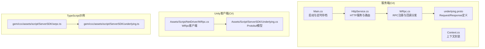
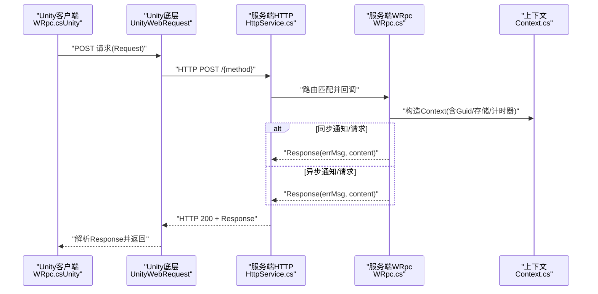
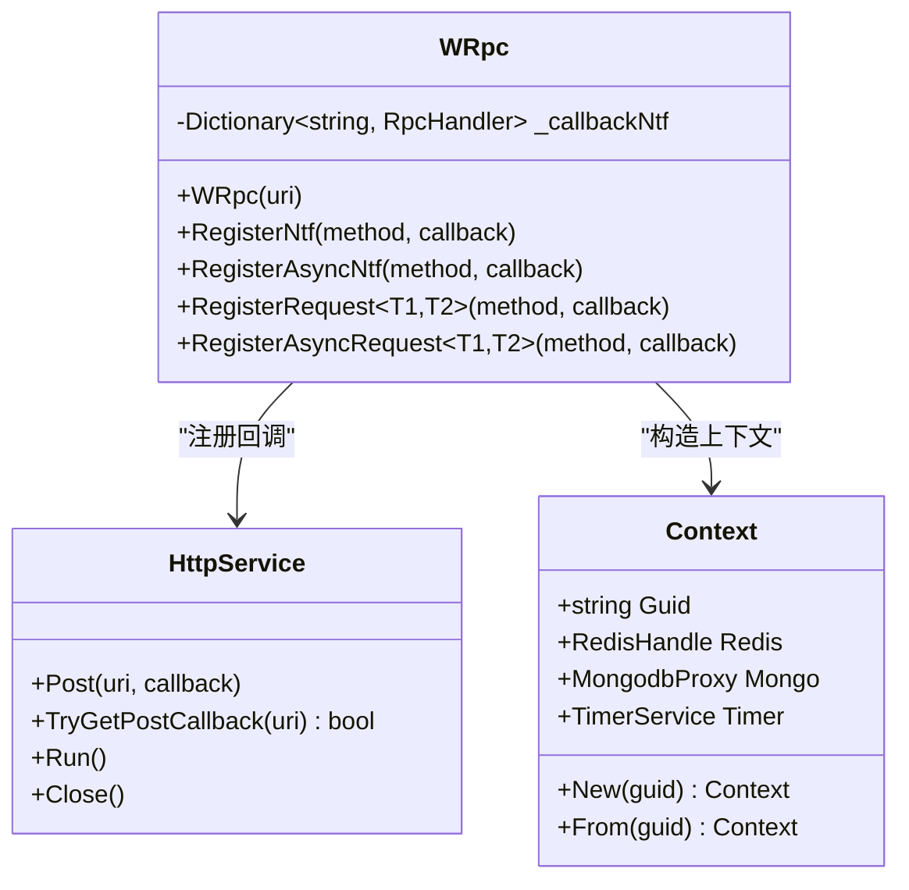
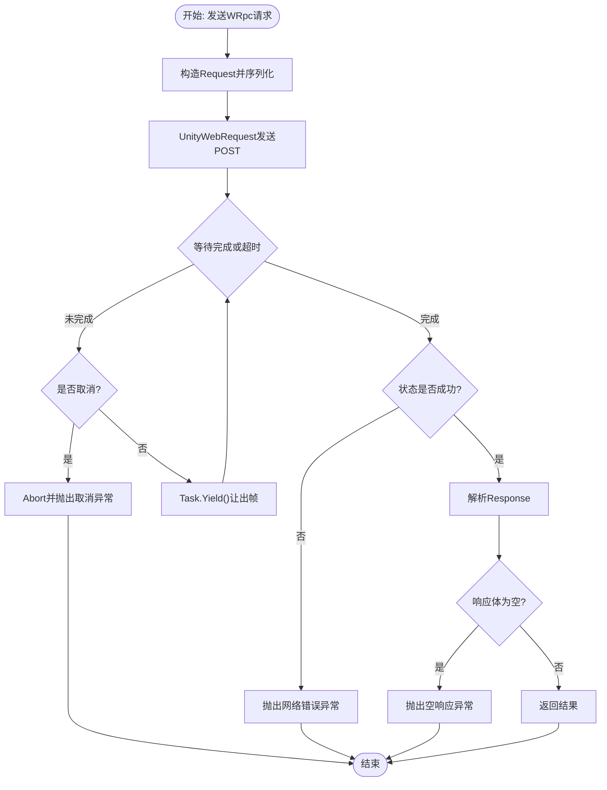
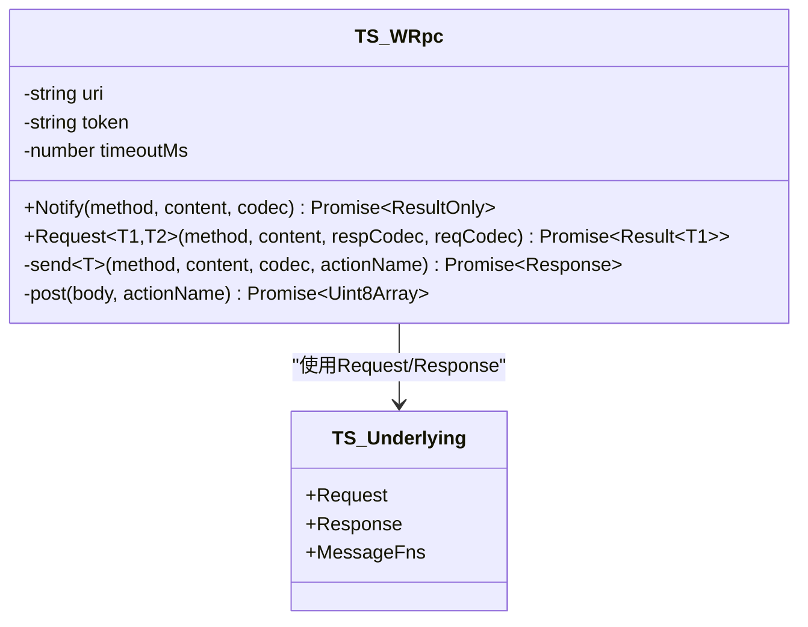
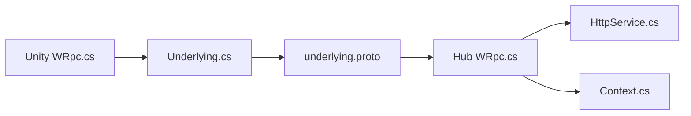

# Unity集成

<cite>
**本文引用的文件**
- [README.md](file://README.md)
- [WRpc.cs](file://lgbf/hub/WRpc.cs)
- [HttpService.cs](file://lgbf/hub/HttpService.cs)
- [Main.cs](file://lgbf/hub/Main.cs)
- [Context.cs](file://lgbf/hub/Context.cs)
- [underlying.proto](file://lgbf/underlying/underlying.proto)
- [wrpc.ts](file://gem/ccc/assets/script/ServerSDK/wrpc.ts)
- [underlying.ts](file://gem/ccc/assets/script/ServerSDK/underlying.ts)
- [WRpc.cs（Unity）](file://gem/unity/Assets/Script/NetDriver/WRpc.cs)
- [Underlying.cs（Unity）](file://gem/unity/Assets/Script/ServerSDK/Underlying.cs)
</cite>

## 目录
1. [简介](#简介)
2. [项目结构](#项目结构)
3. [核心组件](#核心组件)
4. [架构总览](#架构总览)
5. [详细组件分析](#详细组件分析)
6. [依赖关系分析](#依赖关系分析)
7. [性能考量](#性能考量)
8. [故障排查指南](#故障排查指南)
9. [结论](#结论)
10. [附录](#附录)

## 简介
本指南面向在Unity中集成LGBF SDK的开发者，聚焦WRpc C#客户端的实现与使用，涵盖网络通信、消息序列化、异常处理、Unity项目配置、与TypeScript版本的对应关系、协程与线程安全、内存管理、构建与部署以及典型游戏场景与性能优化建议。文档以仓库现有源码为依据，确保内容可追溯至具体文件与行号。

## 项目结构
该仓库包含服务端（C#）与Unity客户端（C#）两部分，以及TypeScript侧的SDK示例。WRpc在服务端与Unity客户端分别实现，但共享同一底层协议定义（underlying.proto），用于统一请求/响应格式与Protobuf序列化。

图表来源
- [Main.cs:31-48](file://lgbf/hub/Main.cs#L31-L48)
- [HttpService.cs:117-181](file://lgbf/hub/HttpService.cs#L117-L181)
- [WRpc.cs:14-45](file://lgbf/hub/WRpc.cs#L14-L45)
- [Context.cs:4-26](file://lgbf/hub/Context.cs#L4-L26)
- [underlying.proto:3-12](file://lgbf/underlying/underlying.proto#L3-L12)
- [WRpc.cs（Unity）:21-128](file://gem/unity/Assets/Script/NetDriver/WRpc.cs#L21-L128)
- [Underlying.cs:40-310](file://gem/unity/Assets/Script/ServerSDK/Underlying.cs#L40-L310)
- [wrpc.ts:21-102](file://gem/ccc/assets/script/ServerSDK/wrpc.ts#L21-L102)
- [underlying.ts:12-21](file://gem/ccc/assets/script/ServerSDK/underlying.ts#L12-L21)

章节来源
- [README.md:1-3](file://README.md#L1-L3)
- [Main.cs:31-48](file://lgbf/hub/Main.cs#L31-L48)
- [HttpService.cs:117-181](file://lgbf/hub/HttpService.cs#L117-L181)
- [WRpc.cs:14-45](file://lgbf/hub/WRpc.cs#L14-L45)
- [Context.cs:4-26](file://lgbf/hub/Context.cs#L4-L26)
- [underlying.proto:3-12](file://lgbf/underlying/underlying.proto#L3-L12)
- [WRpc.cs（Unity）:21-128](file://gem/unity/Assets/Script/NetDriver/WRpc.cs#L21-L128)
- [Underlying.cs:40-310](file://gem/unity/Assets/Script/ServerSDK/Underlying.cs#L40-L310)
- [wrpc.ts:21-102](file://gem/ccc/assets/script/ServerSDK/wrpc.ts#L21-L102)
- [underlying.ts:12-21](file://gem/ccc/assets/script/ServerSDK/underlying.ts#L12-L21)

## 核心组件
- 服务端WRpc（C#）
  - 负责接收HTTP POST请求，解析Protobuf Request，按方法名分发到已注册的回调，并返回Protobuf Response。
  - 支持同步与异步通知/请求两种模式，统一错误信息与成功标记。
- Unity端WRpc（C#）
  - 基于UnityWebRequest发送请求，等待完成并解析Response；支持超时与取消。
- 共同协议（Protobuf）
  - Request/Response结构一致，便于跨语言互通。
- TypeScript示例
  - 提供浏览器端WRpc实现，展示编码/解码、超时与错误处理等行为，便于理解跨语言一致性。

章节来源
- [WRpc.cs:47-153](file://lgbf/hub/WRpc.cs#L47-L153)
- [WRpc.cs（Unity）:21-128](file://gem/unity/Assets/Script/NetDriver/WRpc.cs#L21-L128)
- [underlying.proto:3-12](file://lgbf/underlying/underlying.proto#L3-L12)
- [wrpc.ts:21-102](file://gem/ccc/assets/script/ServerSDK/wrpc.ts#L21-L102)

## 架构总览
下图展示了从Unity客户端发起WRpc调用，经由HTTP传输，到达服务端WRpc处理器并执行业务逻辑，最终返回结果的完整链路。

图表来源
- [WRpc.cs（Unity）:35-82](file://gem/unity/Assets/Script/NetDriver/WRpc.cs#L35-L82)
- [HttpService.cs:50-114](file://lgbf/hub/HttpService.cs#L50-L114)
- [WRpc.cs:104-125](file://lgbf/hub/WRpc.cs#L104-L125)
- [Context.cs:11-20](file://lgbf/hub/Context.cs#L11-L20)

## 详细组件分析

### 服务端WRpc（C#）分析
- 关键点
  - 构造函数订阅HTTP路径，接收请求后解析Request，校验token并查询avatarId，再按方法名分发到注册的回调。
  - 提供RegisterNtf/RegisterAsyncNtf/RegisterRequest/RegisterAsyncRequest四类注册接口，统一返回Response结构。
  - 回调内部通过MessageParser解析入参，执行业务逻辑，最终返回“OK”或错误信息。
- 数据结构与复杂度
  - 回调字典查找：平均O(1)，最坏O(n)（哈希冲突）。
  - Protobuf序列化/反序列化：与消息大小成正比，解析/写入均为线性时间。
- 错误处理
  - 空体、未知proto、token无效、回调异常均会记录日志并返回错误信息。
- 性能与优化
  - 使用数组池与长生命周期任务避免频繁GC。
  - 可结合连接数限制与Keep-Alive策略提升吞吐。

图表来源
- [WRpc.cs:6-153](file://lgbf/hub/WRpc.cs#L6-L153)
- [HttpService.cs:117-181](file://lgbf/hub/HttpService.cs#L117-L181)
- [Context.cs:4-26](file://lgbf/hub/Context.cs#L4-L26)

章节来源
- [WRpc.cs:14-45](file://lgbf/hub/WRpc.cs#L14-L45)
- [WRpc.cs:47-153](file://lgbf/hub/WRpc.cs#L47-L153)
- [HttpService.cs:117-181](file://lgbf/hub/HttpService.cs#L117-L181)
- [Context.cs:11-20](file://lgbf/hub/Context.cs#L11-L20)

### Unity端WRpc（C#）分析
- 关键点
  - 基于UnityWebRequest发送二进制请求，支持超时与取消令牌；解析Response并根据errMsg决定是否抛出异常。
  - 提供Notify与Request两类API，Request将自动反序列化响应内容。
- 协程与线程安全
  - 使用UnityWebRequest异步操作，配合while(!isDone)轮询与Task.Yield让出帧；通过CancellationToken支持取消。
  - 避免在主线程阻塞，遵循Unity协程与异步编程最佳实践。
- 内存管理
  - 使用UploadHandlerRaw/DownloadHandlerBuffer承载数据；完成后由Unity释放。
  - 建议复用消息对象，减少GC压力。
- 错误处理
  - 网络错误、超时、空响应体均抛出明确异常，便于上层捕获与重试。

图表来源
- [WRpc.cs（Unity）:35-82](file://gem/unity/Assets/Script/NetDriver/WRpc.cs#L35-L82)
- [WRpc.cs（Unity）:84-126](file://gem/unity/Assets/Script/NetDriver/WRpc.cs#L84-L126)

章节来源
- [WRpc.cs（Unity）:21-128](file://gem/unity/Assets/Script/NetDriver/WRpc.cs#L21-L128)

### TypeScript版WRpc对比分析
- 对应关系
  - Request/Response字段一致，均包含protoName、content、token（请求）与errMsg、content（响应）。
  - 服务端C#与TypeScript均使用Protobuf进行编解码，保证跨语言一致性。
- 差异点
  - C#端使用Google.Protobuf；TypeScript端使用@bufbuild/protobuf。
  - C#端在服务端通过HttpService路由分发；TypeScript端通过XMLHttpRequest直接发送HTTP请求。
  - C#端回调返回Response结构；TypeScript端返回Result/ResultOnly对象。

图表来源
- [wrpc.ts:21-102](file://gem/ccc/assets/script/ServerSDK/wrpc.ts#L21-L102)
- [underlying.ts:12-21](file://gem/ccc/assets/script/ServerSDK/underlying.ts#L12-L21)

章节来源
- [wrpc.ts:21-102](file://gem/ccc/assets/script/ServerSDK/wrpc.ts#L21-L102)
- [underlying.ts:12-21](file://gem/ccc/assets/script/ServerSDK/underlying.ts#L12-L21)

### 协程使用、线程安全与内存管理（Unity）
- 协程使用
  - 将耗时的网络请求封装为异步方法，配合Unity的async/await与Task.Yield，避免阻塞主线程。
- 线程安全
  - UnityWebRequest非线程安全，应在主线程发起与检查结果；通过CancellationToken在外部控制取消。
- 内存管理
  - 使用UnityWebRequest自带的UploadHandlerRaw/DownloadHandlerBuffer；避免在循环中频繁分配大对象。
  - 复用Protobuf消息对象，减少GC峰值。

章节来源
- [WRpc.cs（Unity）:35-82](file://gem/unity/Assets/Script/NetDriver/WRpc.cs#L35-L82)
- [WRpc.cs（Unity）:84-126](file://gem/unity/Assets/Script/NetDriver/WRpc.cs#L84-L126)

### 游戏开发场景示例与性能优化建议
- 场景示例
  - 角色移动同步：客户端Notify服务器更新位置；服务器广播给其他客户端。
  - 技能释放请求：客户端Request服务器返回伤害计算结果；服务器执行业务逻辑并返回。
- 性能优化
  - 批量请求：合并小消息，降低HTTP开销。
  - 超时与重试：对弱网环境设置合理超时与指数退避重试。
  - 序列化优化：复用Protobuf序列化器，避免重复创建解析器。
  - 连接管理：启用Keep-Alive，限制并发连接数，避免拥塞。

## 依赖关系分析
- 服务端
  - WRpc依赖HttpService进行HTTP路由与响应；依赖Context提供运行时资源访问。
- Unity客户端
  - WRpc依赖Underlying.cs生成的Protobuf模型；基于UnityWebRequest进行网络传输。
- 共同依赖
  - underlying.proto定义Request/Response，确保跨语言一致。

图表来源
- [WRpc.cs（Unity）:21-128](file://gem/unity/Assets/Script/NetDriver/WRpc.cs#L21-L128)
- [Underlying.cs:40-310](file://gem/unity/Assets/Script/ServerSDK/Underlying.cs#L40-L310)
- [WRpc.cs:14-45](file://lgbf/hub/WRpc.cs#L14-L45)
- [HttpService.cs:117-181](file://lgbf/hub/HttpService.cs#L117-L181)
- [Context.cs:11-20](file://lgbf/hub/Context.cs#L11-L20)
- [underlying.proto:3-12](file://lgbf/underlying/underlying.proto#L3-L12)

章节来源
- [WRpc.cs（Unity）:21-128](file://gem/unity/Assets/Script/NetDriver/WRpc.cs#L21-L128)
- [Underlying.cs:40-310](file://gem/unity/Assets/Script/ServerSDK/Underlying.cs#L40-L310)
- [WRpc.cs:14-45](file://lgbf/hub/WRpc.cs#L14-L45)
- [HttpService.cs:117-181](file://lgbf/hub/HttpService.cs#L117-L181)
- [Context.cs:11-20](file://lgbf/hub/Context.cs#L11-L20)
- [underlying.proto:3-12](file://lgbf/underlying/underlying.proto#L3-L12)

## 性能考量
- 网络层面
  - 使用Kestrel的连接限制与Keep-Alive，避免过多短连接。
  - 合理设置超时与重试策略，平衡可靠性与延迟。
- 序列化层面
  - Protobuf体积小、速度快；尽量避免嵌套过深的消息结构。
- 内存层面
  - Unity端使用UnityWebRequest内置缓冲；服务端使用数组池回收。
- 并发层面
  - 服务端回调应尽量无阻塞；必要时使用异步回调版本。

## 故障排查指南
- 常见问题
  - 空响应体：检查服务端是否正确返回Response，客户端是否检测空体并抛错。
  - 超时：调整超时阈值，确认网络状况；在客户端使用CancellationToken支持取消。
  - 未知proto：确认方法名与注册一致，服务端回调字典是否包含该键。
  - token无效：确认客户端token与服务端验证逻辑一致。
- 日志与定位
  - 服务端WRpc捕获异常并记录日志，便于定位业务回调问题。
  - 客户端在Notify/Request失败时输出错误信息，便于前端调试。

章节来源
- [WRpc.cs:38-44](file://lgbf/hub/WRpc.cs#L38-L44)
- [WRpc.cs（Unity）:70-79](file://gem/unity/Assets/Script/NetDriver/WRpc.cs#L70-L79)
- [HttpService.cs:101-102](file://lgbf/hub/HttpService.cs#L101-L102)

## 结论
本指南基于仓库现有源码，系统梳理了LGBF在Unity中的WRpc集成方案：从协议定义、服务端实现到Unity客户端封装，再到跨语言对比与工程实践。通过统一的Protobuf协议与清晰的错误处理机制，可在Unity中稳定地进行网络通信与消息序列化，满足大多数游戏场景的实时交互需求。

## 附录
- 项目设置与脚本集成步骤（概述）
  - Unity项目中引入Underlying.cs（Protobuf模型）与NetDriver/WRpc.cs（WRpc客户端）。
  - 在场景初始化时，配置WRpc实例（URI、Token、超时）。
  - 通过Notify/Request调用服务端方法，注意错误处理与取消令牌。
- 构建与部署
  - 服务端使用Kestrel监听指定端口，开启OPTIONS跨域头；Unity端目标平台选择对应设备。
- 依赖管理
  - 服务端依赖Google.Protobuf与ASP.NET Core；Unity端依赖UnityWebRequest与Google.Protobuf（通过生成的C#代码）。