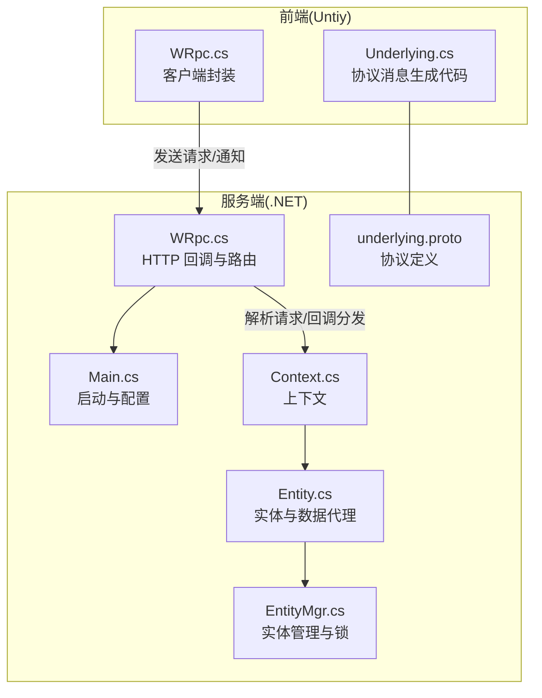
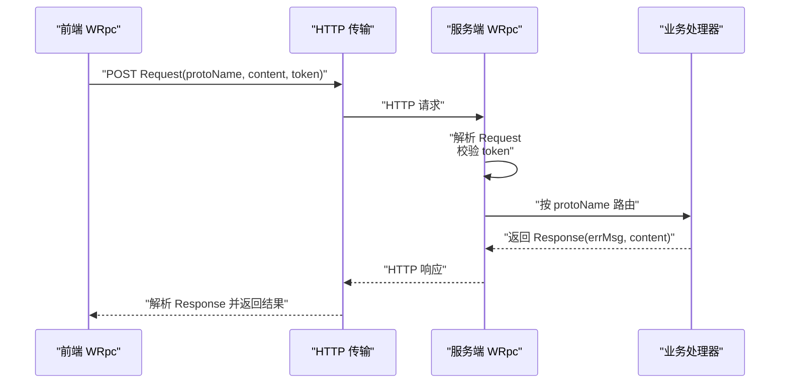
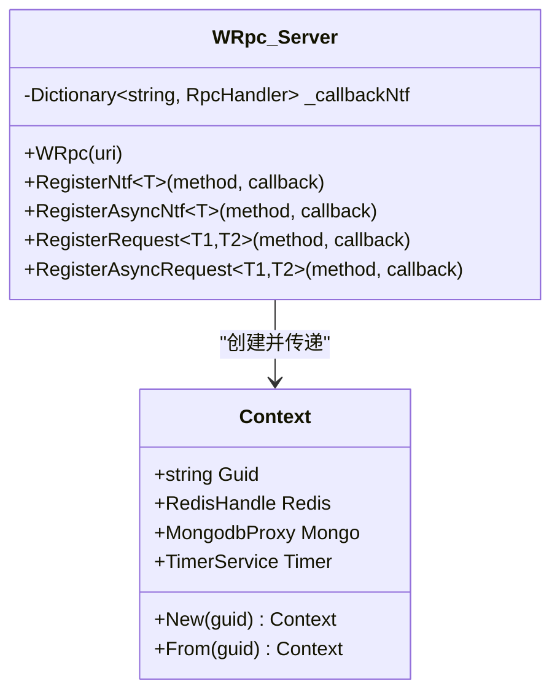
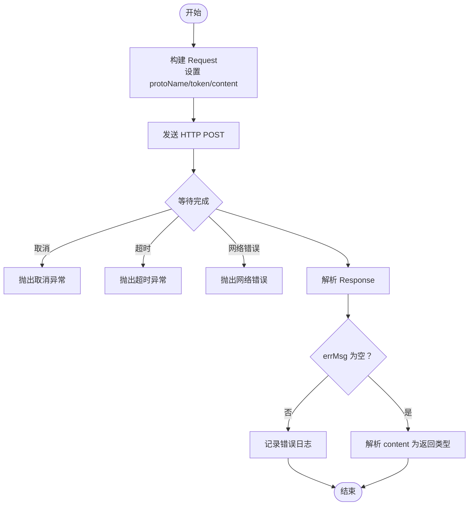
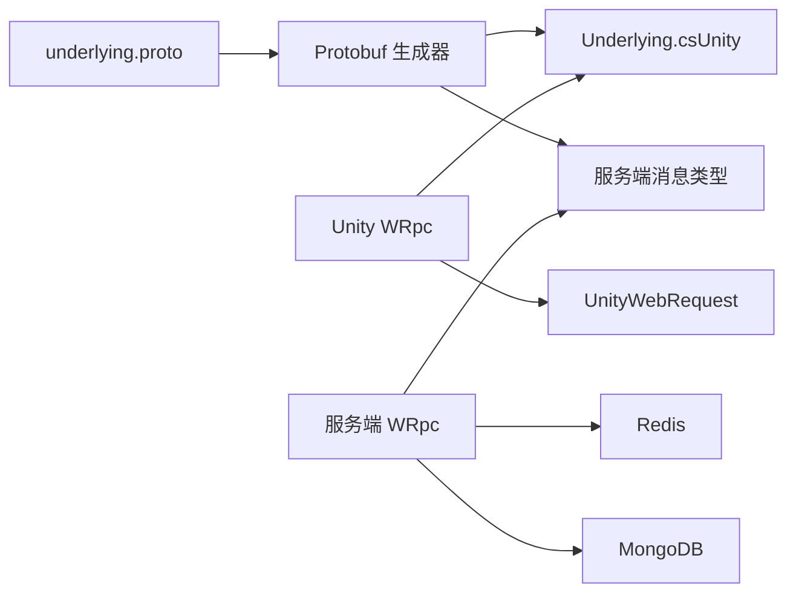

# 前端集成

<cite>
**本文引用的文件**   
- [README.md](file://README.md)
- [WRpc.cs（服务端）](file://lgbf/hub/WRpc.cs)
- [underlying.proto](file://lgbf/underlying/underlying.proto)
- [WRpc.cs（Unity）](file://gem/unity/Assets/Script/NetDriver/WRpc.cs)
- [Underlying.cs（Unity 生成代码）](file://gem/unity/Assets/Script/ServerSDK/Underlying.cs)
- [Main.cs（服务端启动与配置）](file://lgbf/hub/Main.cs)
- [Context.cs（上下文）](file://lgbf/hub/Context.cs)
- [Entity.cs（实体与数据代理）](file://lgbf/hub/Entity.cs)
- [EntityMgr.cs（实体管理与锁）](file://lgbf/hub/EntityMgr.cs)
- [package.json](file://package.json)
</cite>

## 目录
1. [简介](#简介)
2. [项目结构](#项目结构)
3. [核心组件](#核心组件)
4. [架构总览](#架构总览)
5. [组件详解](#组件详解)
6. [依赖关系分析](#依赖关系分析)
7. [性能考量](#性能考量)
8. [故障排查指南](#故障排查指南)
9. [结论](#结论)
10. [附录](#附录)

## 简介
本指南面向希望在 Cocos Creator 与 Unity 游戏引擎中集成 LGBF 的前端开发者。文档围绕 WRpc 客户端实现与使用展开，涵盖消息序列化、连接管理、错误处理、协议定义、集成步骤、性能优化与调试技巧，并提供跨引擎的最佳实践建议。

## 项目结构
仓库包含两部分关键内容：
- 服务端（.NET）：提供基于 HTTP 的 RPC 通道、上下文与实体管理能力，以及 WRpc 服务端实现。
- 前端（Unity）：提供 WRpc 客户端封装、底层协议消息类型生成代码，以及示例脚本与资源。

**图表来源**
- [WRpc.cs（服务端）:1-155](file://lgbf/hub/WRpc.cs#L1-L155)
- [Main.cs（服务端启动与配置）:1-159](file://lgbf/hub/Main.cs#L1-L159)
- [Context.cs（上下文）:1-27](file://lgbf/hub/Context.cs#L1-L27)
- [Entity.cs（实体与数据代理）:1-154](file://lgbf/hub/Entity.cs#L1-L154)
- [EntityMgr.cs（实体管理与锁）:1-128](file://lgbf/hub/EntityMgr.cs#L1-L128)
- [underlying.proto:1-12](file://lgbf/underlying/underlying.proto#L1-L12)
- [WRpc.cs（Unity）:1-129](file://gem/unity/Assets/Script/NetDriver/WRpc.cs#L1-L129)
- [Underlying.cs（Unity 生成代码）:1-550](file://gem/unity/Assets/Script/ServerSDK/Underlying.cs#L1-L550)

**章节来源**
- [README.md:1-3](file://README.md#L1-L3)
- [package.json:1-6](file://package.json#L1-L6)

## 核心组件
- 协议层（Protocol）
  - 使用 Protocol Buffers 定义通用请求/响应消息体，包含方法名、二进制载荷与令牌字段。
- 服务端 WRpc（Server WRpc）
  - 注册通知/请求处理器，解析 HTTP 请求中的协议消息，校验令牌并分发给对应回调，返回统一响应。
- 前端 WRpc（Unity WRpc）
  - 封装 UnityWebRequest 发送请求，支持超时与取消；负责序列化/反序列化 Protobuf 消息，处理错误码与空响应。
- 上下文与实体（Context & Entity）
  - 提供调用方身份（avatarId）、数据库与缓存访问入口，以及实体读写与分布式锁机制。

**章节来源**
- [underlying.proto:1-12](file://lgbf/underlying/underlying.proto#L1-L12)
- [WRpc.cs（服务端）:1-155](file://lgbf/hub/WRpc.cs#L1-L155)
- [WRpc.cs（Unity）:1-129](file://gem/unity/Assets/Script/NetDriver/WRpc.cs#L1-L129)
- [Context.cs（上下文）:1-27](file://lgbf/hub/Context.cs#L1-L27)
- [Entity.cs（实体与数据代理）:1-154](file://lgbf/hub/Entity.cs#L1-L154)
- [EntityMgr.cs（实体管理与锁）:1-128](file://lgbf/hub/EntityMgr.cs#L1-L128)

## 架构总览
WRpc 在前后端之间建立“HTTP + Protobuf”的轻量 RPC 通道。前端以方法名为键，将请求体序列化为字节流，通过 HTTP POST 发送到服务端；服务端根据方法名路由到已注册的处理器，执行业务逻辑后返回统一响应。

**图表来源**
- [WRpc.cs（Unity）:35-82](file://gem/unity/Assets/Script/NetDriver/WRpc.cs#L35-L82)
- [WRpc.cs（服务端）:14-45](file://lgbf/hub/WRpc.cs#L14-L45)
- [underlying.proto:1-12](file://lgbf/underlying/underlying.proto#L1-L12)

## 组件详解

### 协议定义与消息格式
- Request
  - 字段：protoName（方法名）、content（二进制载荷）、token（鉴权令牌）。
- Response
  - 字段：errMsg（错误信息）、content（二进制返回值）。

消息序列化采用 Protobuf，前端与服务端共享同一 .proto 文件，保证双方对消息结构一致。

**章节来源**
- [underlying.proto:1-12](file://lgbf/underlying/underlying.proto#L1-L12)
- [Underlying.cs（Unity 生成代码）:40-120](file://gem/unity/Assets/Script/ServerSDK/Underlying.cs#L40-L120)
- [Underlying.cs（Unity 生成代码）:312-380](file://gem/unity/Assets/Script/ServerSDK/Underlying.cs#L312-L380)

### 服务端 WRpc 实现原理
- 初始化
  - 构造函数订阅指定 URI 的 HTTP POST 请求，解析请求体为 Request。
- 方法注册
  - 支持注册通知（无返回值）、异步通知、请求（有返回值）、异步请求四种类型，均通过方法名映射到处理器。
- 鉴权与路由
  - 从 Redis 中根据 token 解析 avatarId，若为空则抛出异常；否则将 Context（含 avatarId、数据库句柄等）传入回调。
- 响应构建
  - 统一构造 Response，errMsg 为“OK”或“error”，content 为处理结果或错误消息字节。

**图表来源**
- [WRpc.cs（服务端）:6-155](file://lgbf/hub/WRpc.cs#L6-L155)
- [Context.cs（上下文）:4-26](file://lgbf/hub/Context.cs#L4-L26)

**章节来源**
- [WRpc.cs（服务端）:14-155](file://lgbf/hub/WRpc.cs#L14-L155)
- [Context.cs（上下文）:1-27](file://lgbf/hub/Context.cs#L1-L27)

### 前端 WRpc 使用方法
- 初始化
  - 提供服务端地址与用户 token，可选设置超时时间（毫秒）。
- 发送通知（Notify）
  - 序列化参数为 Request.content，发送 HTTP POST；忽略返回值，仅检查 errMsg。
- 发送请求（Request）
  - 序列化参数为 Request.content，等待 Response；若 errMsg 为空则解析 Response.content 为指定类型返回值。
- 错误处理
  - 超时、网络失败、空响应体、取消请求均会抛出异常；errMsg 非空时记录错误日志。

**图表来源**
- [WRpc.cs（Unity）:35-126](file://gem/unity/Assets/Script/NetDriver/WRpc.cs#L35-L126)

**章节来源**
- [WRpc.cs（Unity）:1-129](file://gem/unity/Assets/Script/NetDriver/WRpc.cs#L1-L129)

### 连接管理与生命周期
- 服务端
  - 通过 Main.Start 启动 HTTP 服务，初始化 Redis 与 Mongo 句柄，定时保存脏数据。
- 前端
  - 通过 UnityWebRequest 发送请求，内部处理超时与取消；未显式长连接，每次请求独立建立连接。

**章节来源**
- [Main.cs（服务端启动与配置）:31-48](file://lgbf/hub/Main.cs#L31-L48)
- [WRpc.cs（Unity）:44-68](file://gem/unity/Assets/Script/NetDriver/WRpc.cs#L44-L68)

### 错误处理策略
- 服务端
  - 异常捕获后统一设置 Response.errMsg 为“error”，并将异常消息作为 content 返回；同时记录错误日志。
- 前端
  - 对网络错误、空响应体、超时、取消进行异常处理；errMsg 非空时记录错误日志并返回。

**章节来源**
- [WRpc.cs（服务端）:58-65](file://lgbf/hub/WRpc.cs#L58-L65)
- [WRpc.cs（Unity）:70-79](file://gem/unity/Assets/Script/NetDriver/WRpc.cs#L70-L79)

### 协议与消息格式示例（路径指引）
- Request 结构字段与序列化位置：[Request 类定义:40-120](file://gem/unity/Assets/Script/ServerSDK/Underlying.cs#L40-L120)
- Response 结构字段与序列化位置：[Response 类定义:312-380](file://gem/unity/Assets/Script/ServerSDK/Underlying.cs#L312-L380)
- 协议字段定义：[underlying.proto:3-12](file://lgbf/underlying/underlying.proto#L3-L12)

## 依赖关系分析
- 服务端依赖
  - Google.Protobuf：用于 Request/Response 的序列化与解析。
  - Redis/Mongo：用于鉴权查询与实体持久化。
- 前端依赖
  - Google.Protobuf：与服务端共享协议。
  - UnityWebRequest：HTTP 传输层。
- 协议生成
  - 通过 protoc 与 ts-proto（工具链）生成跨语言消息类型。

**图表来源**
- [underlying.proto:1-12](file://lgbf/underlying/underlying.proto#L1-L12)
- [Underlying.cs（Unity 生成代码）:1-50](file://gem/unity/Assets/Script/ServerSDK/Underlying.cs#L1-L50)
- [WRpc.cs（Unity）:1-10](file://gem/unity/Assets/Script/NetDriver/WRpc.cs#L1-L10)
- [WRpc.cs（服务端）:1-10](file://lgbf/hub/WRpc.cs#L1-L10)
- [package.json:1-6](file://package.json#L1-L6)

**章节来源**
- [package.json:1-6](file://package.json#L1-L6)

## 性能考量
- 序列化开销
  - Protobuf 体积小、解析快，适合频繁 RPC 场景；建议复用消息对象，避免重复分配。
- 网络层
  - UnityWebRequest 默认每请求新建连接，建议在高频调用场景下合并请求或减少并发；合理设置超时与重试。
- 服务端处理
  - 处理器内尽量避免阻塞操作；异步处理器（RegisterAsyncRequest/Notify）优先于同步版本。
- 数据一致性
  - 实体写回采用 Redis 缓存 + 定时批量写入 MongoDB；注意脏数据队列长度与批大小，避免内存压力。

[本节为通用建议，不直接分析具体文件]

## 故障排查指南
- 常见错误与定位
  - “空响应体”：检查服务端是否正确返回 Response；确认网络层未被中断。
  - “未知 proto”：确认方法名拼写与注册一致；核对 protoName 是否匹配。
  - “令牌无效”：确认 token 与 avatarId 的映射关系；检查 Redis 中是否存在对应键。
  - “超时”：增大超时阈值或优化服务端处理逻辑；避免长时间阻塞。
  - “网络错误”：检查服务端地址、防火墙与证书；确认前端网络环境。
- 日志与诊断
  - 服务端：WRpc 捕获异常后记录日志；前端：errMsg 非空时记录错误日志。
- 快速验证
  - 使用最小化请求（空参数）先验证连通性；逐步增加复杂度定位问题。

**章节来源**
- [WRpc.cs（Unity）:70-79](file://gem/unity/Assets/Script/NetDriver/WRpc.cs#L70-L79)
- [WRpc.cs（服务端）:38-44](file://lgbf/hub/WRpc.cs#L38-L44)

## 结论
通过 HTTP + Protobuf 的 WRpc 通道，LGBF 在 Unity 与服务端之间提供了清晰、可扩展的通信模型。遵循本文的协议约定、集成步骤与最佳实践，可在 Cocos Creator 与 Unity 项目中高效完成 LGBF 的前端集成与上线。

## 附录

### Cocos Creator 集成要点（建议）
- 协议生成
  - 使用与 Unity 相同的 .proto 文件生成消息类型，确保双方消息结构一致。
- 网络层选择
  - 若使用原生 HTTP，建议封装统一的请求/响应处理与超时控制；或参考 Unity WRpc 的实现思路。
- 令牌与鉴权
  - 与服务端保持一致的 token 生成与校验流程；在场景切换时妥善管理 token 生命周期。
- 调试与监控
  - 记录请求/响应日志，关注 errMsg 与超时情况；必要时开启抓包定位网络问题。

[本节为概念性建议，不直接分析具体文件]

### Unity 集成步骤（示例流程）
- 准备工作
  - 确保已生成 Underlying.cs（协议消息类型），并放置于项目合适目录。
- 初始化 WRpc
  - 提供服务端地址与用户 token，设置合理的超时时间。
- 发送请求
  - 使用 Request 接口发送请求，解析返回值；处理 errMsg 与异常。
- 注册服务端回调
  - 在服务端 WRpc 中注册对应方法名的处理器，接收前端通知/请求并返回结果。

**章节来源**
- [WRpc.cs（Unity）:28-33](file://gem/unity/Assets/Script/NetDriver/WRpc.cs#L28-L33)
- [WRpc.cs（Unity）:102-126](file://gem/unity/Assets/Script/NetDriver/WRpc.cs#L102-L126)
- [WRpc.cs（服务端）:99-153](file://lgbf/hub/WRpc.cs#L99-L153)