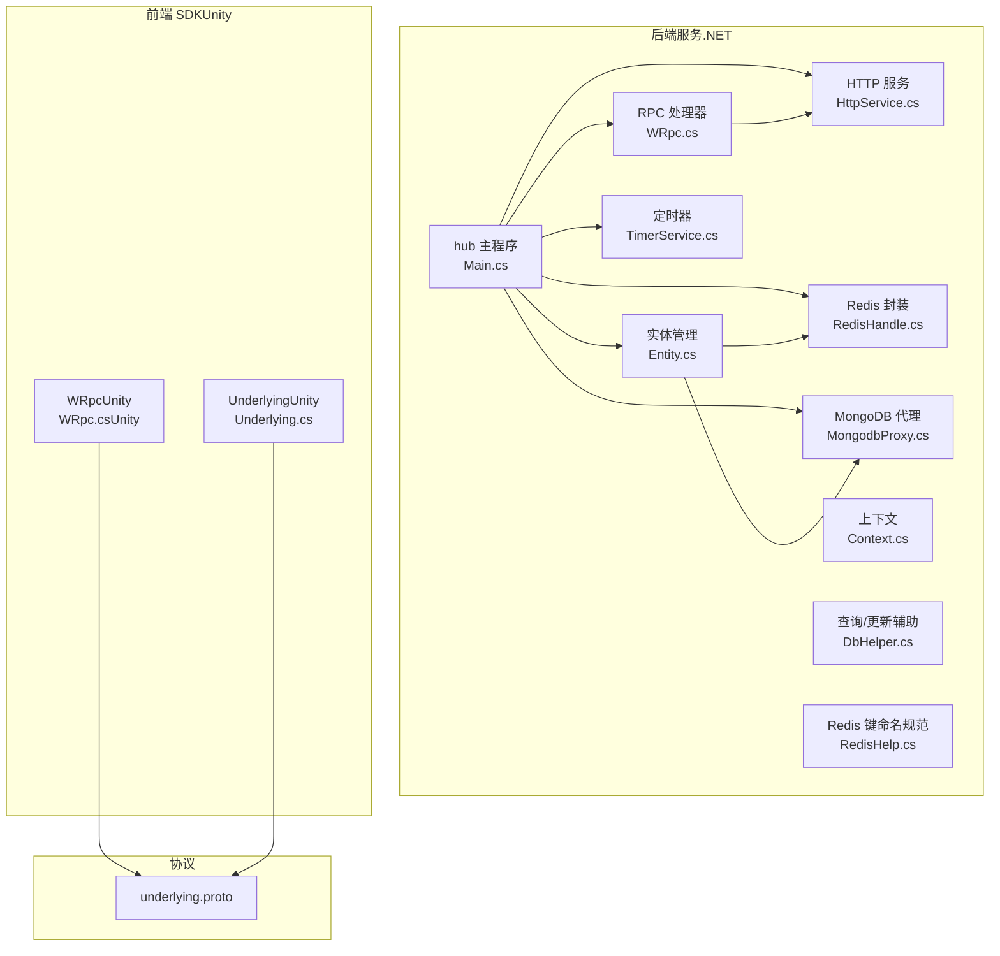
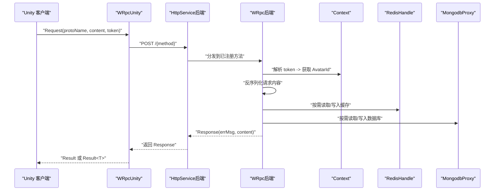
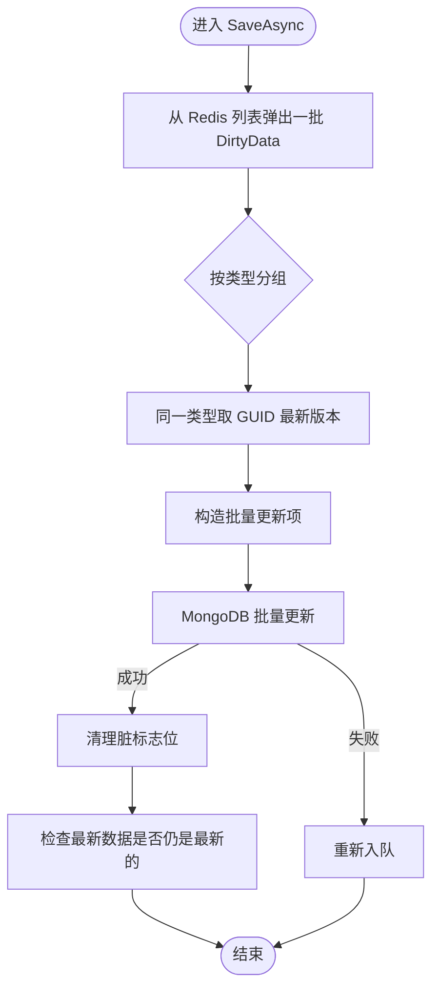
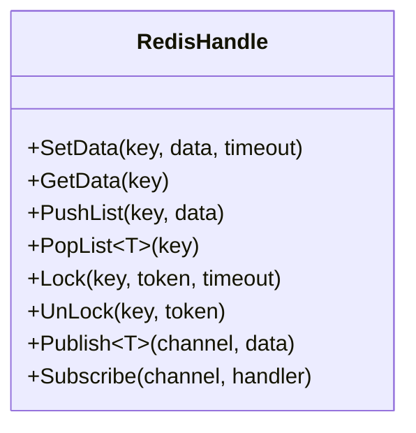
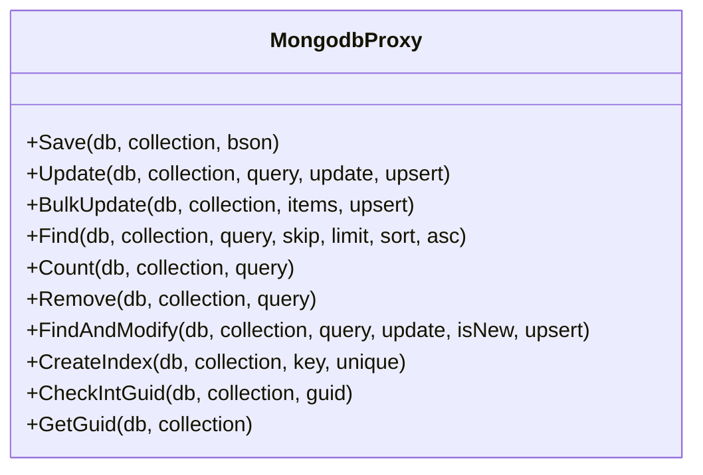
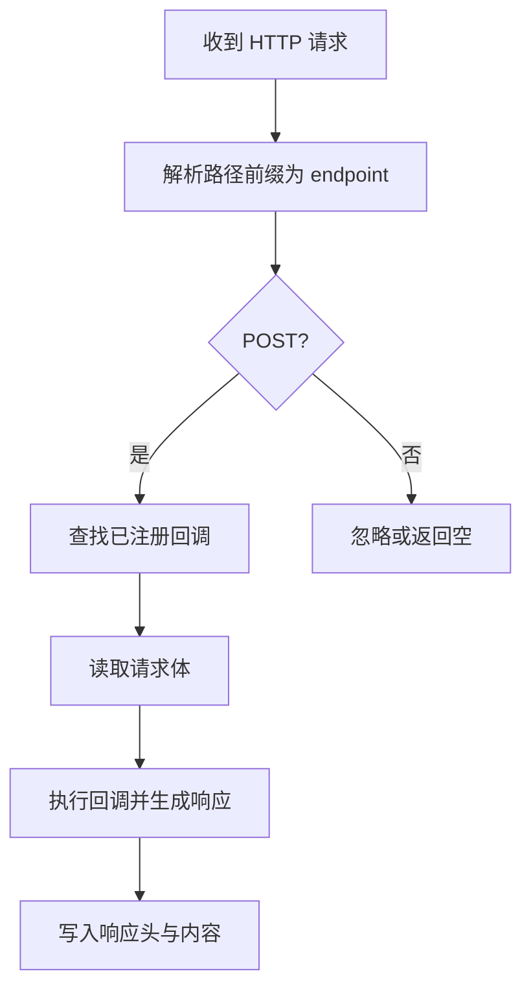
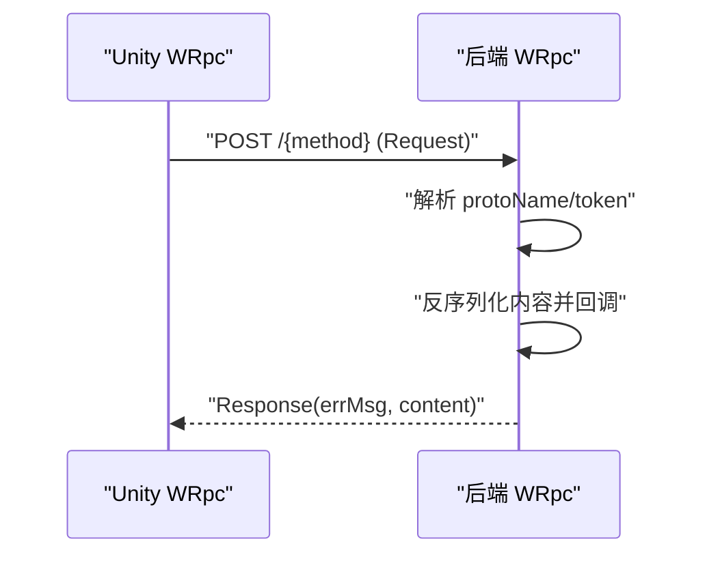
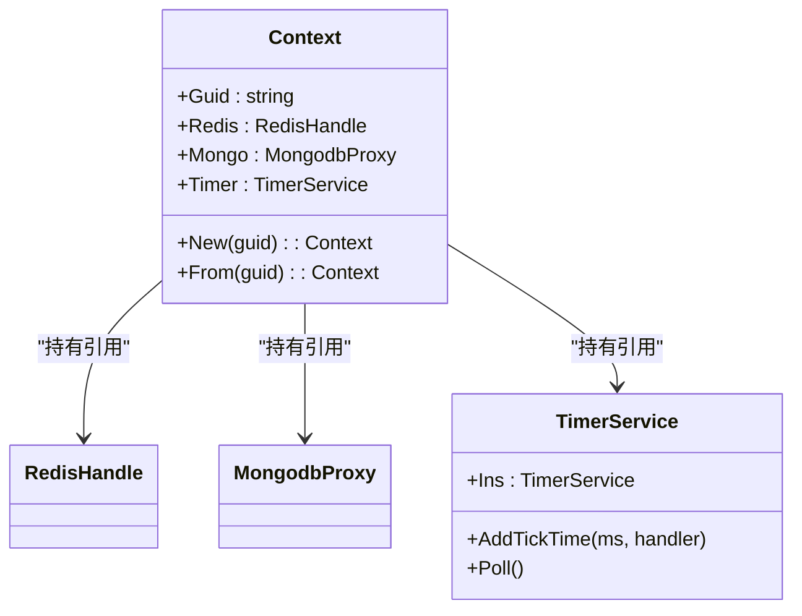
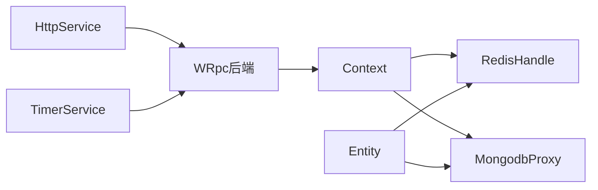

# 快速开始

<cite>
**本文引用的文件**
- [README.md](file://README.md)
- [Main.cs](file://lgbf/hub/Main.cs)
- [Entity.cs](file://lgbf/hub/Entity.cs)
- [WRpc.cs（后端）](file://lgbf/hub/WRpc.cs)
- [RedisHandle.cs](file://lgbf/hub/RedisHandle.cs)
- [MongodbProxy.cs](file://lgbf/hub/MongodbProxy.cs)
- [Context.cs](file://lgbf/hub/Context.cs)
- [HttpService.cs](file://lgbf/hub/HttpService.cs)
- [TimerService.cs](file://lgbf/hub/TimerService.cs)
- [RedisHelp.cs](file://lgbf/hub/RedisHelp.cs)
- [DbHelper.cs](file://lgbf/hub/DbHelper.cs)
- [underlying.proto](file://lgbf/underlying/underlying.proto)
- [WRpc.cs（Unity）](file://gem/unity/Assets/Script/NetDriver/WRpc.cs)
- [Underlying.cs（Unity）](file://gem/unity/Assets/Script/ServerSDK/Underlying.cs)
</cite>

## 目录
1. [简介](#简介)
2. [项目结构](#项目结构)
3. [核心组件](#核心组件)
4. [架构总览](#架构总览)
5. [详细组件分析](#详细组件分析)
6. [依赖关系分析](#依赖关系分析)
7. [性能与扩展性建议](#性能与扩展性建议)
8. [故障排除指南](#故障排除指南)
9. [结论](#结论)
10. [附录：环境与部署步骤](#附录环境与部署步骤)

## 简介
本指南面向初学者与进阶开发者，帮助你在最短时间内完成 LGBF 框架的环境搭建、后端编译部署、数据库配置，以及在 Cocos Creator 与 Unity 中集成 SDK 并完成实体创建、数据读写与 RPC 调用等典型场景。

LGBF 是一个轻量级游戏后端框架，采用 .NET 技术栈，结合 Redis 作为缓存与消息通道，MongoDB 作为持久化存储，并通过 HTTP/Protobuf 提供统一的 RPC 接口，支持定时器、实体管理与批量更新等能力。

## 项目结构
仓库包含以下关键部分：
- 后端服务（.NET）：hub 目录下为服务主程序、实体管理、RPC、HTTP 服务、数据库代理与工具类
- 前端 SDK（Unity）：gem/unity 下的 Unity 工程与 SDK 代码
- 协议定义：lgbf/underlying/underlying.proto 定义了通用请求/响应格式
- 其他资源：Cocos Creator 示例工程（gem/ccc），包含场景、脚本与资源

图表来源
- [Main.cs:13-48](file://lgbf/hub/Main.cs#L13-L48)
- [HttpService.cs:117-181](file://lgbf/hub/HttpService.cs#L117-L181)
- [RedisHandle.cs:13-544](file://lgbf/hub/RedisHandle.cs#L13-L544)
- [MongodbProxy.cs:10-221](file://lgbf/hub/MongodbProxy.cs#L10-L221)
- [Context.cs:4-26](file://lgbf/hub/Context.cs#L4-L26)
- [Entity.cs:94-153](file://lgbf/hub/Entity.cs#L94-L153)
- [WRpc.cs（后端）:6-154](file://lgbf/hub/WRpc.cs#L6-L154)
- [TimerService.cs:7-125](file://lgbf/hub/TimerService.cs#L7-L125)
- [DbHelper.cs:4-310](file://lgbf/hub/DbHelper.cs#L4-L310)
- [RedisHelp.cs:4-19](file://lgbf/hub/RedisHelp.cs#L4-L19)
- [WRpc.cs（Unity）:21-128](file://gem/unity/Assets/Script/NetDriver/WRpc.cs#L21-L128)
- [Underlying.cs（Unity）:40-544](file://gem/unity/Assets/Script/ServerSDK/Underlying.cs#L40-L544)
- [underlying.proto:1-12](file://lgbf/underlying/underlying.proto#L1-L12)

章节来源
- [README.md:1-3](file://README.md#L1-L3)
- [Main.cs:13-48](file://lgbf/hub/Main.cs#L13-L48)

## 核心组件
- 配置与启动：Main 类负责加载配置、初始化 Redis/Mongo 连接、注册 HTTP 服务与定时任务
- 实体管理：Entity 提供“按类型”获取或创建实体的能力；DataAgent 负责写回与脏标记
- 数据访问：RedisHandle 提供键值、列表、有序集合、哈希、分布式锁等操作；MongodbProxy 提供插入、更新、批量更新、查询、计数、删除等
- RPC 通信：WRpc（后端）注册方法，解析请求并回调；WRpc（Unity）封装 HTTP 请求与超时控制
- 上下文与定时器：Context 提供当前会话的 Redis/Mongo/Timer 引用；TimerService 提供高精度轮询与多种时间触发器
- 查询/更新辅助：DbHelper 提供链式构造查询条件、更新语句与保存文档

章节来源
- [Main.cs:4-48](file://lgbf/hub/Main.cs#L4-L48)
- [Entity.cs:4-153](file://lgbf/hub/Entity.cs#L4-L153)
- [RedisHandle.cs:13-544](file://lgbf/hub/RedisHandle.cs#L13-L544)
- [MongodbProxy.cs:10-221](file://lgbf/hub/MongodbProxy.cs#L10-L221)
- [WRpc.cs（后端）:6-154](file://lgbf/hub/WRpc.cs#L6-L154)
- [Context.cs:4-26](file://lgbf/hub/Context.cs#L4-L26)
- [TimerService.cs:7-125](file://lgbf/hub/TimerService.cs#L7-L125)
- [DbHelper.cs:4-310](file://lgbf/hub/DbHelper.cs#L4-L310)

## 架构总览
LGBF 的运行时由“HTTP 入口 + Protobuf 请求 + Redis 缓存 + MongoDB 持久化 + 定时器”构成。客户端通过 Unity SDK 发送 HTTP 请求到后端，后端根据路由分发到对应方法处理，必要时读写 Redis/MongoDB，并返回统一的 Response 结构。

图表来源
- [WRpc.cs（Unity）:35-126](file://gem/unity/Assets/Script/NetDriver/WRpc.cs#L35-L126)
- [HttpService.cs:50-114](file://lgbf/hub/HttpService.cs#L50-L114)
- [WRpc.cs（后端）:14-96](file://lgbf/hub/WRpc.cs#L14-L96)
- [Context.cs:11-20](file://lgbf/hub/Context.cs#L11-L20)
- [RedisHandle.cs:159-174](file://lgbf/hub/RedisHandle.cs#L159-L174)
- [MongodbProxy.cs:76-100](file://lgbf/hub/MongodbProxy.cs#L76-L100)

## 详细组件分析

### 组件一：实体生命周期与数据落盘
- 获取/创建实体：Entity.Get<T>() 优先从 Redis 取，不存在则从 MongoDB 查询并回填 Redis；GetOrCreate<T>() 不存在则调用 T.Create() 创建
- 写回与脏标记：DataAgent<T>.WriteBack() 将 BSON 写入 Redis，并设置“脏标志位”，同时将实体加入“待落盘队列”
- 后台批量落盘：Main.SaveAsync() 消费队列，按类型聚合最新版本，执行 MongoDB 批量更新，并清理脏标志位

图表来源
- [Main.cs:50-157](file://lgbf/hub/Main.cs#L50-L157)
- [Entity.cs:104-152](file://lgbf/hub/Entity.cs#L104-L152)
- [RedisHelp.cs:4-19](file://lgbf/hub/RedisHelp.cs#L4-L19)

章节来源
- [Entity.cs:94-153](file://lgbf/hub/Entity.cs#L94-L153)
- [Main.cs:50-157](file://lgbf/hub/Main.cs#L50-L157)
- [RedisHelp.cs:4-19](file://lgbf/hub/RedisHelp.cs#L4-L19)

### 组件二：Redis 封装与分布式锁
- 键值操作：SetData/GetData/Expire/DelData 支持字节数组与 JSON 序列化
- 列表操作：PushList/PopList 支持队列式异步处理（如脏数据落盘）
- 分布式锁：Lock/TryLock/LockExtend/UnLock 提供原子加解锁与自动续期
- 订阅发布：Publish/Subscribe 支持频道消息广播

图表来源
- [RedisHandle.cs:13-544](file://lgbf/hub/RedisHandle.cs#L13-L544)

章节来源
- [RedisHandle.cs:13-544](file://lgbf/hub/RedisHandle.cs#L13-L544)

### 组件三：MongoDB 代理与批量更新
- 插入/更新/删除/查询/计数/查找并修改
- 批量更新：支持多条 UpdateOne，非有序批量写入
- GUID 自增：通过集合内单文档自增 inside_guid，保证全局唯一

图表来源
- [MongodbProxy.cs:10-221](file://lgbf/hub/MongodbProxy.cs#L10-L221)

章节来源
- [MongodbProxy.cs:10-221](file://lgbf/hub/MongodbProxy.cs#L10-L221)

### 组件四：HTTP 服务与跨域
- 使用 Kestrel 监听指定端口，支持 HTTP/1.1 与 HTTP/2
- 统一处理 POST 请求，按路径前缀分发到注册回调
- 返回头默认允许跨域，便于前端调试

图表来源
- [HttpService.cs:50-114](file://lgbf/hub/HttpService.cs#L50-L114)

章节来源
- [HttpService.cs:117-181](file://lgbf/hub/HttpService.cs#L117-L181)

### 组件五：RPC 注册与调用
- 后端：WRpc 构造路由，解析 protoName，按 token 解析 AvatarId，回调用户注册的方法
- 前端：WRpc（Unity）封装 HTTP 请求，支持取消与超时，解析 Response

图表来源
- [WRpc.cs（后端）:14-96](file://lgbf/hub/WRpc.cs#L14-L96)
- [WRpc.cs（Unity）:35-126](file://gem/unity/Assets/Script/NetDriver/WRpc.cs#L35-L126)
- [underlying.proto:3-12](file://lgbf/underlying/underlying.proto#L3-L12)

章节来源
- [WRpc.cs（后端）:6-154](file://lgbf/hub/WRpc.cs#L6-L154)
- [WRpc.cs（Unity）:21-128](file://gem/unity/Assets/Script/NetDriver/WRpc.cs#L21-L128)
- [underlying.proto:1-12](file://lgbf/underlying/underlying.proto#L1-L12)

### 组件六：上下文与定时器
- Context.New(guid) 提供 Redis/Mongo/Timer 的静态引用
- TimerService 提供轮询与多种周期/日程触发器，内部线程安全

图表来源
- [Context.cs:4-26](file://lgbf/hub/Context.cs#L4-L26)
- [TimerService.cs:7-125](file://lgbf/hub/TimerService.cs#L7-L125)

章节来源
- [Context.cs:4-26](file://lgbf/hub/Context.cs#L4-L26)
- [TimerService.cs:7-125](file://lgbf/hub/TimerService.cs#L7-L125)

## 依赖关系分析
- 后端模块耦合度低：HTTP、RPC、实体、Redis、Mongo、定时器相互独立，通过 Context 汇聚
- 前后端通过 Protobuf Request/Response 对接，协议稳定且跨语言
- Redis 作为“内存缓存+消息队列+分布式锁”的统一介质，降低数据库压力

图表来源
- [HttpService.cs:117-181](file://lgbf/hub/HttpService.cs#L117-L181)
- [WRpc.cs（后端）:6-154](file://lgbf/hub/WRpc.cs#L6-L154)
- [Context.cs:4-26](file://lgbf/hub/Context.cs#L4-L26)
- [RedisHandle.cs:13-544](file://lgbf/hub/RedisHandle.cs#L13-L544)
- [MongodbProxy.cs:10-221](file://lgbf/hub/MongodbProxy.cs#L10-L221)
- [Entity.cs:94-153](file://lgbf/hub/Entity.cs#L94-L153)
- [TimerService.cs:7-125](file://lgbf/hub/TimerService.cs#L7-L125)

## 性能与扩展性建议
- Redis 批量写入：利用列表与批量更新减少网络往返
- 脏数据聚合：按类型与 GUID 聚合，避免重复写入
- 超时与重试：网络异常时自动恢复连接，避免阻塞
- 定时器粒度：合理设置轮询间隔与任务数量，避免 CPU 空转
- 索引策略：针对常用查询字段建立索引，提升查询效率

[本节为通用建议，无需特定文件引用]

## 故障排除指南
- 启动失败（Redis/Mongo 未就绪）
  - 现象：启动时报错或无法连接
  - 排查：确认 Redis/Mongo 地址与凭据正确；检查网络连通性
  - 参考
    - [Main.cs:31-40](file://lgbf/hub/Main.cs#L31-L40)
    - [RedisHandle.cs:21-34](file://lgbf/hub/RedisHandle.cs#L21-L34)
    - [MongodbProxy.cs:14-18](file://lgbf/hub/MongodbProxy.cs#L14-L18)

- 实体写回失败
  - 现象：WriteBack 抛出异常
  - 排查：检查 Redis 是否可用；确认脏队列推送成功
  - 参考
    - [Entity.cs:52-91](file://lgbf/hub/Entity.cs#L52-L91)
    - [RedisHelp.cs:4-19](file://lgbf/hub/RedisHelp.cs#L4-L19)

- RPC 调用超时或失败
  - 现象：Unity WRpc 抛出超时或空响应
  - 排查：检查 token 是否有效；确认后端路由已注册；查看后端日志
  - 参考
    - [WRpc.cs（Unity）:35-82](file://gem/unity/Assets/Script/NetDriver/WRpc.cs#L35-L82)
    - [WRpc.cs（后端）:16-44](file://lgbf/hub/WRpc.cs#L16-L44)

- 落盘任务堆积
  - 现象：后台 SaveAsync 未及时处理
  - 排查：检查 Redis 列表长度与批量大小；确认 MongoDB 写入是否频繁失败
  - 参考
    - [Main.cs:82-101](file://lgbf/hub/Main.cs#L82-L101)
    - [MongodbProxy.cs:102-120](file://lgbf/hub/MongodbProxy.cs#L102-L120)

章节来源
- [Main.cs:31-40](file://lgbf/hub/Main.cs#L31-L40)
- [RedisHandle.cs:21-34](file://lgbf/hub/RedisHandle.cs#L21-L34)
- [MongodbProxy.cs:14-18](file://lgbf/hub/MongodbProxy.cs#L14-L18)
- [Entity.cs:52-91](file://lgbf/hub/Entity.cs#L52-L91)
- [RedisHelp.cs:4-19](file://lgbf/hub/RedisHelp.cs#L4-L19)
- [WRpc.cs（Unity）:35-82](file://gem/unity/Assets/Script/NetDriver/WRpc.cs#L35-L82)
- [WRpc.cs（后端）:16-44](file://lgbf/hub/WRpc.cs#L16-L44)
- [Main.cs:82-101](file://lgbf/hub/Main.cs#L82-L101)
- [MongodbProxy.cs:102-120](file://lgbf/hub/MongodbProxy.cs#L102-L120)

## 结论
通过本指南，你可以在本地快速完成 LGBF 的环境准备、后端编译与部署，并在 Unity 中集成 SDK 完成实体读写与 RPC 调用。建议在开发过程中关注 Redis/Mongo 的连接稳定性、实体写回的幂等性与批量落盘的吞吐，逐步引入索引与监控以保障生产环境的可靠性。

[本节为总结，无需特定文件引用]

## 附录：环境与部署步骤

### 环境要求
- .NET SDK（推荐 LTS 版本）
- Redis 服务器（可本地或云服务）
- MongoDB 服务器（可本地或云服务）

章节来源
- [Main.cs:31-34](file://lgbf/hub/Main.cs#L31-L34)
- [RedisHandle.cs:21-25](file://lgbf/hub/RedisHandle.cs#L21-L25)
- [MongodbProxy.cs:14-18](file://lgbf/hub/MongodbProxy.cs#L14-L18)

### 后端编译与启动
- 打开解决方案文件并编译
  - 参考：[lgbf.sln](file://lgbf/lgbf.sln)
- 准备配置（示例字段）
  - Host、Port、RedisUrl、RedisPwd、MongoUrl
  - 参考：[Main.cs:4-11](file://lgbf/hub/Main.cs#L4-L11)
- 启动服务
  - 初始化 Redis/Mongo 连接
  - 注册 HTTP 服务并监听端口
  - 参考：[Main.cs:31-40](file://lgbf/hub/Main.cs#L31-L40)

章节来源
- [Main.cs:4-11](file://lgbf/hub/Main.cs#L4-L11)
- [Main.cs:31-40](file://lgbf/hub/Main.cs#L31-L40)

### 数据库设置
- Redis
  - 使用 RedisHandle 连接与操作
  - 参考：[RedisHandle.cs:21-25](file://lgbf/hub/RedisHandle.cs#L21-L25)
- MongoDB
  - 使用 MongodbProxy 进行 CRUD 与批量更新
  - 参考：[MongodbProxy.cs:14-221](file://lgbf/hub/MongodbProxy.cs#L14-L221)

章节来源
- [RedisHandle.cs:21-25](file://lgbf/hub/RedisHandle.cs#L21-L25)
- [MongodbProxy.cs:14-221](file://lgbf/hub/MongodbProxy.cs#L14-L221)

### 前端集成（Unity）
- 在 Unity 工程中添加 WRpc（Unity）与 Underlying（Unity）代码
  - WRpc（Unity）用于发送 HTTP 请求与处理超时
  - Underlying（Unity）包含 Protobuf 消息定义
  - 参考：
    - [WRpc.cs（Unity）:21-128](file://gem/unity/Assets/Script/NetDriver/WRpc.cs#L21-L128)
    - [Underlying.cs（Unity）:40-544](file://gem/unity/Assets/Script/ServerSDK/Underlying.cs#L40-L544)
- 使用 underlying.proto 生成消息类（已在工程中提供）
  - 参考：[underlying.proto:1-12](file://lgbf/underlying/underlying.proto#L1-L12)

章节来源
- [WRpc.cs（Unity）:21-128](file://gem/unity/Assets/Script/NetDriver/WRpc.cs#L21-L128)
- [Underlying.cs（Unity）:40-544](file://gem/unity/Assets/Script/ServerSDK/Underlying.cs#L40-L544)
- [underlying.proto:1-12](file://lgbf/underlying/underlying.proto#L1-L12)

### 基本使用示例（步骤说明）
- 实体创建与读取
  - 获取或创建实体：Entity.Get<T>() / GetOrCreate<T>()
  - 写回并触发落盘：IDataAgent<T>.WriteBack()
  - 参考：
    - [Entity.cs:104-152](file://lgbf/hub/Entity.cs#L104-L152)
    - [RedisHelp.cs:4-19](file://lgbf/hub/RedisHelp.cs#L4-L19)
- 数据读写（MongoDB）
  - 使用 MongodbProxy.Save/Update/BulkUpdate/Find/Count/Remove
  - 参考：[MongodbProxy.cs:76-202](file://lgbf/hub/MongodbProxy.cs#L76-L202)
- RPC 调用
  - Unity 端：WRpc.Request/Notify
  - 后端注册：WRpc.RegisterRequest/RegisterNtf
  - 参考：
    - [WRpc.cs（Unity）:102-126](file://gem/unity/Assets/Script/NetDriver/WRpc.cs#L102-L126)
    - [WRpc.cs（后端）:99-153](file://lgbf/hub/WRpc.cs#L99-L153)

章节来源
- [Entity.cs:104-152](file://lgbf/hub/Entity.cs#L104-L152)
- [RedisHelp.cs:4-19](file://lgbf/hub/RedisHelp.cs#L4-L19)
- [MongodbProxy.cs:76-202](file://lgbf/hub/MongodbProxy.cs#L76-L202)
- [WRpc.cs（Unity）:102-126](file://gem/unity/Assets/Script/NetDriver/WRpc.cs#L102-L126)
- [WRpc.cs（后端）:99-153](file://lgbf/hub/WRpc.cs#L99-L153)