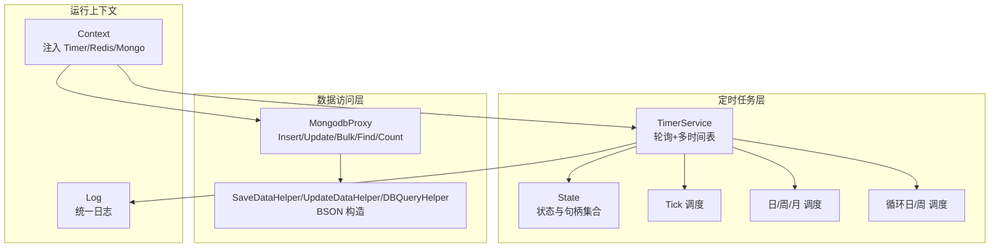
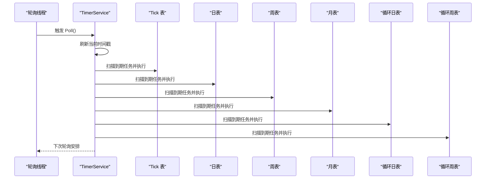
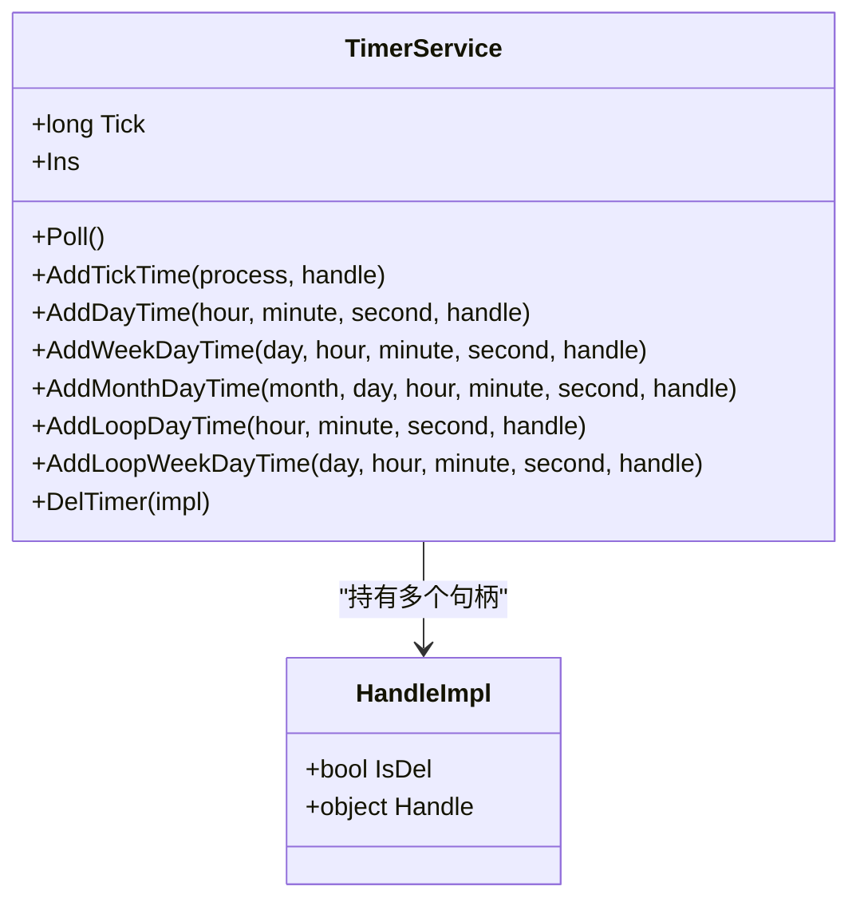
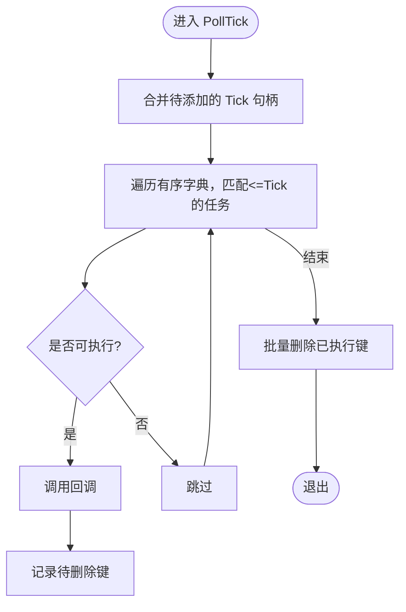
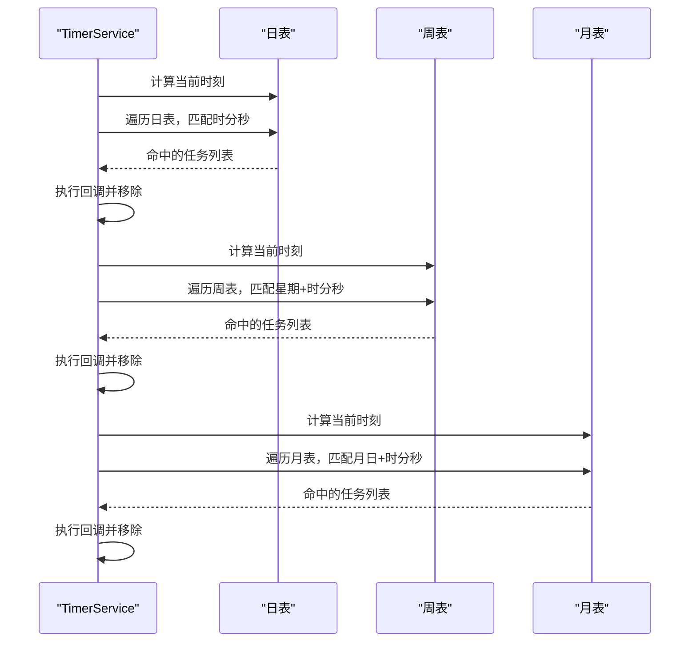
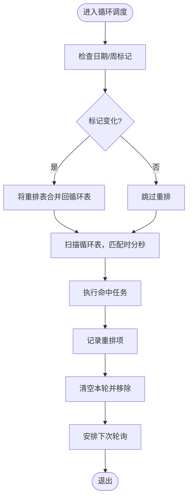
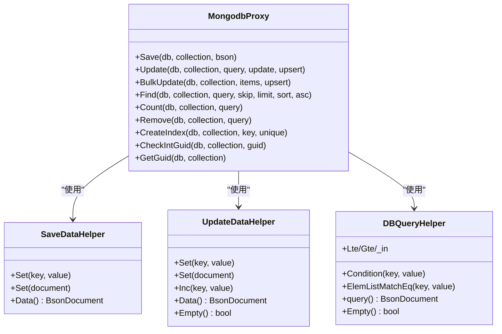
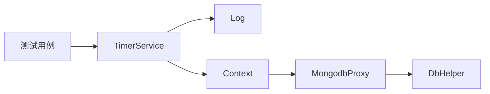

# 定时任务优化

<cite>
**本文引用的文件**
- [TimerService.cs](file://lgbf/hub/TimerService.cs)
- [TimerService.Tick.cs](file://lgbf/hub/TimerService.Tick.cs)
- [TimerService.Calendar.cs](file://lgbf/hub/TimerService.Calendar.cs)
- [TimerService.LoopCalendar.cs](file://lgbf/hub/TimerService.LoopCalendar.cs)
- [TimerService.State.cs](file://lgbf/hub/TimerService.State.cs)
- [Context.cs](file://lgbf/hub/Context.cs)
- [Log.cs](file://lgbf/hub/Log.cs)
- [DbHelper.cs](file://lgbf/hub/DbHelper.cs)
- [MongodbProxy.cs](file://lgbf/hub/MongodbProxy.cs)
- [RedisHelp.cs](file://lgbf/hub/RedisHelp.cs)
- [Program.cs（测试）](file://lgbf/hub.Tests/Program.cs)
</cite>

## 目录
1. [引言](#引言)
2. [项目结构](#项目结构)
3. [核心组件](#核心组件)
4. [架构总览](#架构总览)
5. [详细组件分析](#详细组件分析)
6. [依赖关系分析](#依赖关系分析)
7. [性能考量与优化建议](#性能考量与优化建议)
8. [故障排查指南](#故障排查指南)
9. [结论](#结论)
10. [附录：性能测试与基准测试方法](#附录性能测试与基准测试方法)

## 引言
本指南围绕 LGBF 的定时任务系统，结合源码实现，系统性地给出调度优化策略（任务分片、负载均衡、优先级调度）、数据保存策略优化（批量写入时机、脏数据处理、内存管理）、性能监控与调优（执行时间统计、资源消耗分析、瓶颈识别）、分布式协调机制（任务去重、故障转移、一致性保证），以及配置优化与性能测试方法。目标是帮助读者在不改动业务逻辑的前提下，显著提升定时任务的稳定性与吞吐。

## 项目结构
- 定时任务核心位于 hub 模块，采用单例线程安全设计，基于轮询与多粒度时间表（日/周/月/循环日/循环周）驱动执行。
- 数据持久化通过 MongoDB 代理与 BSON 辅助器完成，支持单条插入、更新、批量更新、查询等。
- 日志模块统一输出带时间戳与级别，便于性能分析与问题定位。
- 测试用例覆盖循环定时器行为验证，辅助回归与性能回归。

图表来源
- [TimerService.cs:1-126](file://lgbf/hub/TimerService.cs#L1-L126)
- [TimerService.State.cs:1-58](file://lgbf/hub/TimerService.State.cs#L1-L58)
- [TimerService.Tick.cs:1-104](file://lgbf/hub/TimerService.Tick.cs#L1-L104)
- [TimerService.Calendar.cs:1-264](file://lgbf/hub/TimerService.Calendar.cs#L1-L264)
- [TimerService.LoopCalendar.cs:1-289](file://lgbf/hub/TimerService.LoopCalendar.cs#L1-L289)
- [MongodbProxy.cs:1-221](file://lgbf/hub/MongodbProxy.cs#L1-L221)
- [DbHelper.cs:1-311](file://lgbf/hub/DbHelper.cs#L1-L311)
- [Context.cs:1-27](file://lgbf/hub/Context.cs#L1-L27)
- [Log.cs:1-113](file://lgbf/hub/Log.cs#L1-L113)

章节来源
- [TimerService.cs:1-126](file://lgbf/hub/TimerService.cs#L1-L126)
- [TimerService.State.cs:1-58](file://lgbf/hub/TimerService.State.cs#L1-L58)
- [Context.cs:1-27](file://lgbf/hub/Context.cs#L1-L27)

## 核心组件
- TimerService：全局单例，负责轮询与各类定时器的触发；内部使用锁保护状态，避免并发冲突；轮询间隔固定为毫秒级，确保高精度与时序正确性。
- 时间表实现：按日、周、月、循环日、循环周五类时间维度组织任务，每类维护“当前表”与“待提交表”，在每次轮询周期内合并，减少锁持有时间。
- 数据访问：MongodbProxy 提供异步 CRUD 与批量更新能力；BSON 辅助器封装 $set/$inc 等更新结构，降低出错概率。
- 上下文与日志：Context 注入 Timer/Redis/Mongo，Log 输出带时间戳的日志，便于性能分析与排障。

章节来源
- [TimerService.cs:1-126](file://lgbf/hub/TimerService.cs#L1-L126)
- [TimerService.State.cs:1-58](file://lgbf/hub/TimerService.State.cs#L1-L58)
- [MongodbProxy.cs:1-221](file://lgbf/hub/MongodbProxy.cs#L1-L221)
- [DbHelper.cs:1-311](file://lgbf/hub/DbHelper.cs#L1-L311)
- [Log.cs:1-113](file://lgbf/hub/Log.cs#L1-L113)

## 架构总览
定时任务系统以 TimerService 为核心，通过固定轮询周期扫描各时间表，触发对应回调。数据持久化由 MongodbProxy 统一承载，配合 BSON 辅助器构造高效写入。日志模块贯穿全链路，用于性能观测与问题定位。

图表来源
- [TimerService.cs:120-125](file://lgbf/hub/TimerService.cs#L120-L125)
- [TimerService.Tick.cs:31-76](file://lgbf/hub/TimerService.Tick.cs#L31-L76)
- [TimerService.Calendar.cs:24-67](file://lgbf/hub/TimerService.Calendar.cs#L24-L67)
- [TimerService.LoopCalendar.cs:63-138](file://lgbf/hub/TimerService.LoopCalendar.cs#L63-L138)

## 详细组件分析

### 组件A：定时服务与轮询机制
- 单例模式与延迟初始化，线程安全；内部使用互斥锁与内存屏障保证可见性。
- 固定轮询间隔，避免忙轮询；轮询中仅做最小必要工作，随后释放锁。
- 多时间表分离：Tick、日、周、月、循环日、循环周，分别维护“当前表/待提交表”，在轮询开始时合并，降低锁竞争。
- 任务执行异常捕获，避免中断后续任务。

图表来源
- [TimerService.cs:13-96](file://lgbf/hub/TimerService.cs#L13-L96)
- [TimerService.State.cs:40-56](file://lgbf/hub/TimerService.State.cs#L40-L56)

章节来源
- [TimerService.cs:1-126](file://lgbf/hub/TimerService.cs#L1-L126)
- [TimerService.State.cs:1-58](file://lgbf/hub/TimerService.State.cs#L1-L58)

### 组件B：Tick 任务调度
- 将任务按绝对时间戳排序存储，轮询时从头到尾扫描，命中即执行并移除。
- 使用临时列表收集待删除键，避免遍历中修改集合导致异常。
- 支持取消标记，防止已删除句柄继续执行。

图表来源
- [TimerService.Tick.cs:31-76](file://lgbf/hub/TimerService.Tick.cs#L31-L76)

章节来源
- [TimerService.Tick.cs:1-104](file://lgbf/hub/TimerService.Tick.cs#L1-L104)

### 组件C：日/周/月一次性任务调度
- 按小时/分钟/秒匹配当前时刻，命中后执行并从表中移除，确保仅触发一次。
- 使用临时列表记录需移除的时间键，避免遍历中修改集合。

图表来源
- [TimerService.Calendar.cs:24-67](file://lgbf/hub/TimerService.Calendar.cs#L24-L67)
- [TimerService.Calendar.cs:86-129](file://lgbf/hub/TimerService.Calendar.cs#L86-L129)
- [TimerService.Calendar.cs:148-191](file://lgbf/hub/TimerService.Calendar.cs#L148-L191)

章节来源
- [TimerService.Calendar.cs:1-264](file://lgbf/hub/TimerService.Calendar.cs#L1-L264)

### 组件D：循环日/周调度与重排机制
- 循环表引入“标记位”（当日/当周起始）与“重排表”，每日/每周仅触发一次，结束后将本轮句柄重排至下个周期。
- 通过“标记位”判断是否需要重新排队，避免重复触发。

图表来源
- [TimerService.LoopCalendar.cs:63-138](file://lgbf/hub/TimerService.LoopCalendar.cs#L63-L138)
- [TimerService.LoopCalendar.cs:157-232](file://lgbf/hub/TimerService.LoopCalendar.cs#L157-L232)

章节来源
- [TimerService.LoopCalendar.cs:1-289](file://lgbf/hub/TimerService.LoopCalendar.cs#L1-L289)

### 组件E：数据保存与批量写入
- SaveDataHelper/UpdateDataHelper/DBQueryHelper 提供链式构建，自动校验参数，避免重复设置。
- MongodbProxy 支持 Insert、Update、BulkUpdate、Find、Count、Remove 等，批量写入使用无序批处理，提升吞吐。
- 查询支持 skip/limit/sort/projection 排除 _id，减少网络与解析开销。

图表来源
- [DbHelper.cs:1-311](file://lgbf/hub/DbHelper.cs#L1-L311)
- [MongodbProxy.cs:1-221](file://lgbf/hub/MongodbProxy.cs#L1-L221)

章节来源
- [DbHelper.cs:1-311](file://lgbf/hub/DbHelper.cs#L1-L311)
- [MongodbProxy.cs:1-221](file://lgbf/hub/MongodbProxy.cs#L1-L221)

### 组件F：上下文与日志
- Context 提供统一上下文，注入 Timer/Redis/Mongo，便于在业务中直接使用。
- Log 提供多级别输出，自动滚动日志文件，带时间戳与调用栈信息，适合性能分析与问题定位。

章节来源
- [Context.cs:1-27](file://lgbf/hub/Context.cs#L1-L27)
- [Log.cs:1-113](file://lgbf/hub/Log.cs#L1-L113)

## 依赖关系分析
- TimerService 依赖于内部状态与句柄集合，对外暴露统一接口；日志模块贯穿执行路径。
- 数据访问层通过 MongodbProxy 对外提供异步接口，BSON 辅助器降低错误率。
- 测试用例验证循环定时器行为，确保在边界条件下不会重复触发或遗漏。

图表来源
- [TimerService.cs:1-126](file://lgbf/hub/TimerService.cs#L1-L126)
- [Context.cs:1-27](file://lgbf/hub/Context.cs#L1-L27)
- [MongodbProxy.cs:1-221](file://lgbf/hub/MongodbProxy.cs#L1-L221)
- [DbHelper.cs:1-311](file://lgbf/hub/DbHelper.cs#L1-L311)
- [Program.cs（测试）:1-117](file://lgbf/hub.Tests/Program.cs#L1-L117)

章节来源
- [Program.cs（测试）:1-117](file://lgbf/hub.Tests/Program.cs#L1-L117)

## 性能考量与优化建议

### 调度优化策略
- 任务分片
  - 将大量定时任务按“时间槽”分片，例如将循环日/周任务按分钟/秒切片，减少单次扫描范围。
  - 在 Tick 表中采用更细粒度的键步进，避免同一毫秒内大量任务堆积。
- 负载均衡
  - 多实例部署时，对循环表的“重排表”进行分桶，按实例编号只处理对应桶的任务，实现天然分片。
  - 对一次性日/周/月任务，可通过哈希取模将不同时间点的任务分散到不同实例。
- 优先级调度
  - 在 HandleImpl 中扩展优先级字段，轮询时按优先级顺序执行，或为高优先级任务单独建立更高频次的轮询通道。
  - 对高频短任务与低频长任务分表，短任务提高轮询频率，长任务降低轮询压力。

### 数据保存策略优化
- 批量写入时机
  - 将 UpdateDataHelper 的变更聚合到一定数量或时间窗口后统一执行 BulkUpdate，减少网络往返与事务开销。
  - 对 Insert 场景，尽量合并为批量插入，避免多次小事务。
- 脏数据处理
  - 使用 UpdateDataHelper 的 Inc 接口进行原子计数，避免竞态条件下的数据不一致。
  - 对可能失败的批量写入，采用幂等键与重试策略，确保最终一致性。
- 内存管理
  - 控制临时列表与字典大小，及时清空已执行项，避免内存膨胀。
  - 对 BSON 文档构造，优先复用对象或使用池化策略，减少 GC 压力。

### 性能监控与调优
- 任务执行时间统计
  - 在回调入口与出口埋点，记录 Tick 时间戳与耗时，结合 Log 输出进行统计分析。
- 资源消耗分析
  - 结合系统指标（CPU、内存、网络、磁盘）与日志时间戳，定位热点时段与热点任务。
- 性能瓶颈识别
  - 若发现轮询周期内无法完成所有扫描，考虑拆分时间表或降低任务密度。
  - 若数据库写入成为瓶颈，优先优化批量写入与索引设计。

### 分布式定时任务协调
- 任务去重
  - 使用 Redis 键空间（如实体锁、标志位）在实例间进行任务去重，确保同一时间仅有一个实例执行。
- 故障转移
  - 为循环表的“重排表”增加 TTL 与心跳检测，若实例宕机，其他实例接管其桶的任务。
- 一致性保证
  - 对关键写入使用 Upsert 与幂等键，确保重复执行不产生副作用。
  - 对批量写入使用无序批处理，但对关键路径可考虑有序批处理以保证严格顺序。

### 配置优化建议
- 调度频率
  - 根据任务密度调整轮询间隔，避免过短导致 CPU 占用过高，过长导致延迟增大。
- 执行超时
  - 为回调设置超时控制，超时则记录告警并中断，避免阻塞后续任务。
- 异常处理
  - 对回调异常进行隔离与记录，避免异常传播影响整体调度。
  - 对数据库异常进行指数退避重试，避免雪崩效应。

## 故障排查指南
- 回调未触发
  - 检查时间表是否正确注册，确认当前时间与目标时间是否匹配。
  - 对一次性任务，确认执行后是否被移除；对循环任务，确认重排逻辑是否生效。
- 回调重复触发
  - 检查循环表的标记位与重排表是否正确更新，避免跨周期重复执行。
- 数据写入异常
  - 使用 UpdateDataHelper 的 Empty 校验，确保更新体非空；对批量写入检查模型数量与 IsUpsert 设置。
- 日志定位
  - 使用 Log 的时间戳与调用栈信息，结合业务日志定位问题发生点。

章节来源
- [Log.cs:1-113](file://lgbf/hub/Log.cs#L1-L113)
- [TimerService.LoopCalendar.cs:63-138](file://lgbf/hub/TimerService.LoopCalendar.cs#L63-L138)
- [DbHelper.cs:153-156](file://lgbf/hub/DbHelper.cs#L153-L156)

## 结论
LGBF 定时任务系统以轻量、清晰的架构实现了高精度的多粒度调度，并通过统一的数据访问与日志模块提供了良好的可观测性。通过合理的任务分片、负载均衡与优先级策略，结合批量写入与内存管理优化，可在高并发场景下保持稳定与高性能。分布式环境下，借助 Redis 去重与心跳机制，可进一步增强一致性与可用性。

## 附录：性能测试与基准测试方法
- 单元测试
  - 使用测试用例验证循环定时器行为，确保边界条件正确（如跨日/跨周仅触发一次）。
- 基准测试
  - 构造大规模 Tick 任务与循环任务，测量轮询周期内的最大吞吐与平均延迟。
  - 对数据库写入进行压测，评估批量写入与单条写入的性能差异。
- 回归测试
  - 在每次优化后运行回归测试，确保功能不变且性能不退化。

章节来源
- [Program.cs（测试）:62-100](file://lgbf/hub.Tests/Program.cs#L62-L100)