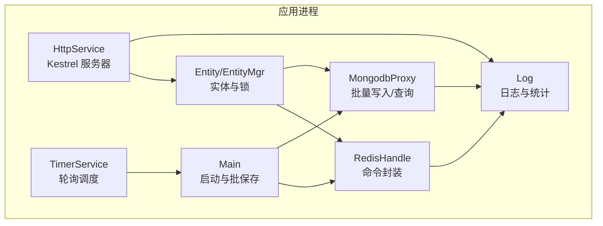
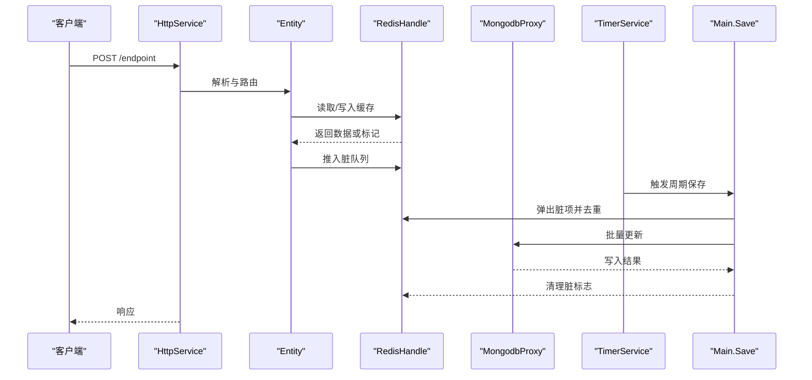
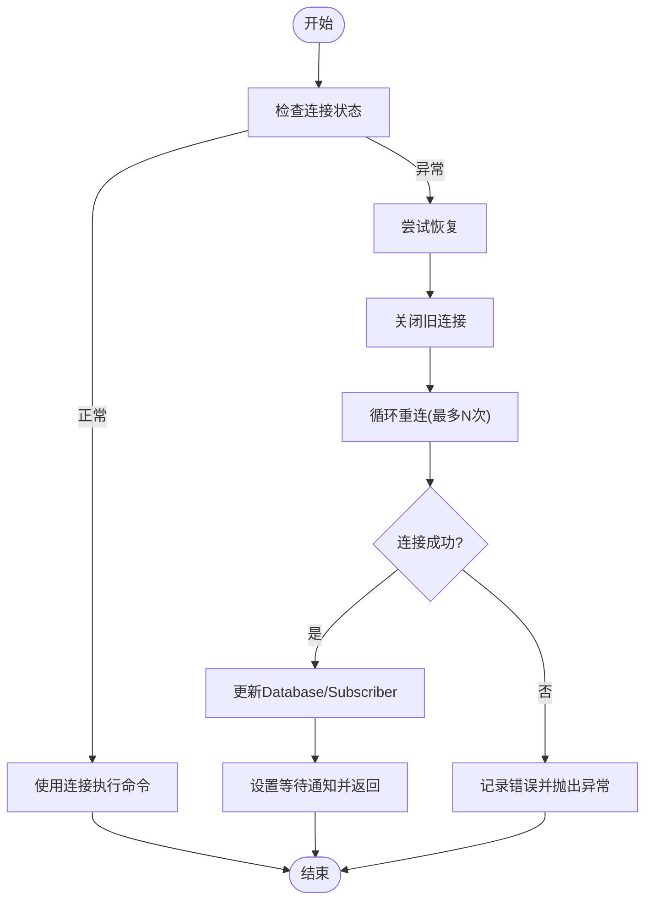
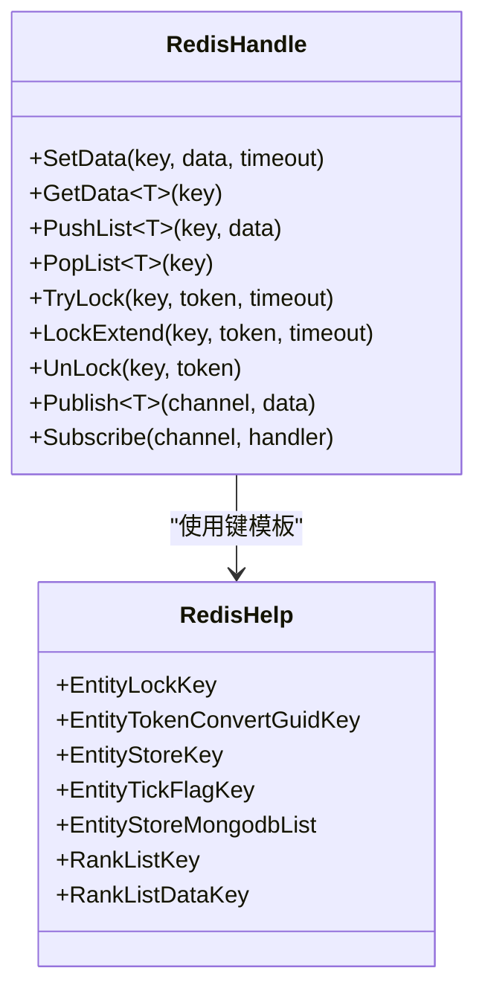
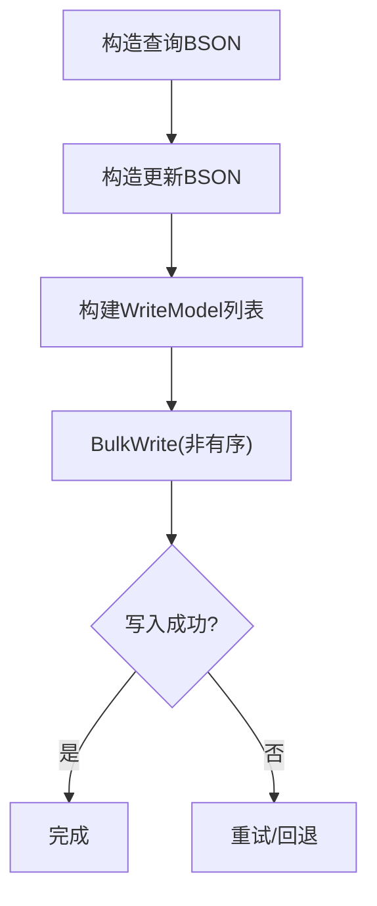
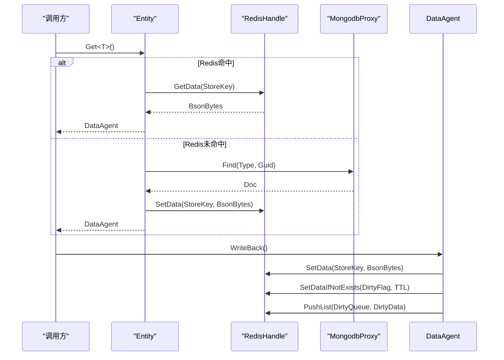
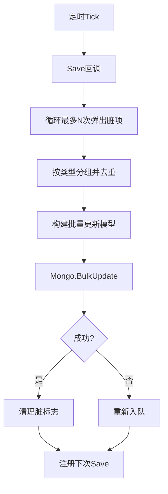
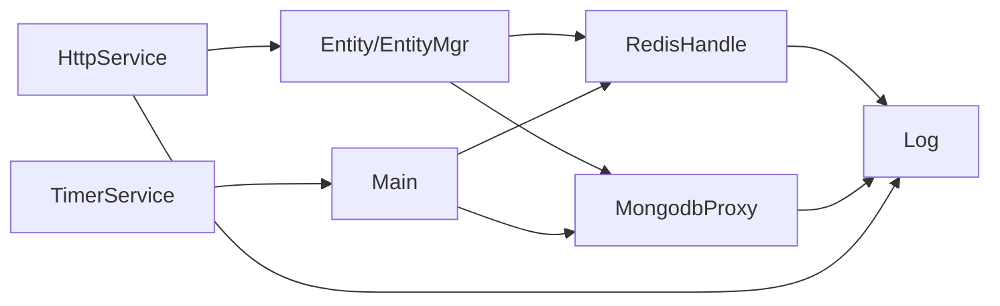

# 性能优化

<cite>
**本文引用的文件**
- [RedisConnectionHelper.cs](file://lgbf/hub/RedisConnectionHelper.cs)
- [RedisHandle.cs](file://lgbf/hub/RedisHandle.cs)
- [RedisHelp.cs](file://lgbf/hub/RedisHelp.cs)
- [MongodbProxy.cs](file://lgbf/hub/MongodbProxy.cs)
- [DbHelper.cs](file://lgbf/hub/DbHelper.cs)
- [Main.cs](file://lgbf/hub/Main.cs)
- [Entity.cs](file://lgbf/hub/Entity.cs)
- [EntityMgr.cs](file://lgbf/hub/EntityMgr.cs)
- [TimerService.cs](file://lgbf/hub/TimerService.cs)
- [HttpService.cs](file://lgbf/hub/HttpService.cs)
- [Log.cs](file://lgbf/hub/Log.cs)
- [README.md](file://README.md)
</cite>

## 目录
1. [简介](#简介)
2. [项目结构](#项目结构)
3. [核心组件](#核心组件)
4. [架构总览](#架构总览)
5. [详细组件分析](#详细组件分析)
6. [依赖关系分析](#依赖关系分析)
7. [性能考量与优化建议](#性能考量与优化建议)
8. [故障排查指南](#故障排查指南)
9. [结论](#结论)
10. [附录：监控指标与基准测试](#附录监控指标与基准测试)

## 简介
本指南围绕 LGBF 轻量级游戏后端框架在性能方面的优化实践展开，重点覆盖以下方面：
- 缓存层（Redis）：连接池与恢复机制、键空间设计、并发访问控制、锁与队列策略
- 数据存储层（MongoDB）：索引设计、批量写入、查询与投影优化
- 网络层（HTTP/Kestrel）：连接数限制、长连接保活、HTTP/1.1 与 HTTP/2、请求合并与缓冲区复用
- 定时任务系统：轮询间隔、批处理策略、幂等与重试
- 监控与日志：性能指标采集、慢日志与错误追踪
- 基准测试与压测：可落地的实施步骤与注意事项
- 生产案例与最佳实践：常见瓶颈与解决方案

## 项目结构
LGBF 的核心运行时由以下模块组成：
- 缓存与消息：Redis 连接管理、命令封装、发布订阅、分布式锁与有序集合
- 数据持久化：MongoDB 访问代理、批量更新、查询与计数、文档序列化
- 实体与数据代理：实体生命周期、脏数据标记、按类型分组的批量落库
- 定时服务：统一时间轮询、周期性任务调度
- 网络服务：基于 Kestrel 的 HTTP 服务，支持跨域与并发连接上限
- 日志与监控：统一日志输出、连接统计与超时告警

图表来源
- [HttpService.cs:117-182](file://lgbf/hub/HttpService.cs#L117-L182)
- [TimerService.cs:7-126](file://lgbf/hub/TimerService.cs#L7-L126)
- [Main.cs:13-159](file://lgbf/hub/Main.cs#L13-L159)
- [Entity.cs:31-154](file://lgbf/hub/Entity.cs#L31-L154)
- [EntityMgr.cs:3-128](file://lgbf/hub/EntityMgr.cs#L3-L128)
- [RedisHandle.cs:13-544](file://lgbf/hub/RedisHandle.cs#L13-L544)
- [MongodbProxy.cs:10-221](file://lgbf/hub/MongodbProxy.cs#L10-L221)
- [Log.cs:6-113](file://lgbf/hub/Log.cs#L6-L113)

章节来源
- [README.md:1-3](file://README.md#L1-L3)
- [HttpService.cs:117-182](file://lgbf/hub/HttpService.cs#L117-L182)
- [TimerService.cs:7-126](file://lgbf/hub/TimerService.cs#L7-L126)
- [Main.cs:13-159](file://lgbf/hub/Main.cs#L13-L159)
- [Entity.cs:31-154](file://lgbf/hub/Entity.cs#L31-L154)
- [EntityMgr.cs:3-128](file://lgbf/hub/EntityMgr.cs#L3-L128)
- [RedisHandle.cs:13-544](file://lgbf/hub/RedisHandle.cs#L13-L544)
- [MongodbProxy.cs:10-221](file://lgbf/hub/MongodbProxy.cs#L10-L221)
- [Log.cs:6-113](file://lgbf/hub/Log.cs#L6-L113)

## 核心组件
- Redis 连接与恢复：通过连接辅助类构建配置、启动连接、异常时自动恢复与等待通知
- Redis 命令封装：字符串、字节数组、列表、哈希、有序集合、分布式锁与发布订阅
- MongoDB 代理：索引创建、单条/批量更新、查找与修改、查询、计数、删除
- 实体与数据代理：按类型与 Guid 组织键空间，脏数据标记与去重，批量落库
- 定时服务：统一轮询、周期性任务注册、线程安全与内存屏障
- HTTP 服务：Kestrel 并发连接上限、HTTP/1.1 与 HTTP/2、跨域头、请求体缓冲池复用
- 日志：时间戳、级别、文件滚动与大小限制

章节来源
- [RedisConnectionHelper.cs:6-144](file://lgbf/hub/RedisConnectionHelper.cs#L6-L144)
- [RedisHandle.cs:13-544](file://lgbf/hub/RedisHandle.cs#L13-L544)
- [MongodbProxy.cs:10-221](file://lgbf/hub/MongodbProxy.cs#L10-L221)
- [Entity.cs:31-154](file://lgbf/hub/Entity.cs#L31-L154)
- [TimerService.cs:7-126](file://lgbf/hub/TimerService.cs#L7-L126)
- [HttpService.cs:117-182](file://lgbf/hub/HttpService.cs#L117-L182)
- [Log.cs:6-113](file://lgbf/hub/Log.cs#L6-L113)

## 架构总览
下图展示从 HTTP 请求到实体读取、缓存写入、脏数据聚合与 MongoDB 批量落库的整体流程。

图表来源
- [HttpService.cs:51-114](file://lgbf/hub/HttpService.cs#L51-L114)
- [Entity.cs:104-153](file://lgbf/hub/Entity.cs#L104-L153)
- [RedisHandle.cs:257-303](file://lgbf/hub/RedisHandle.cs#L257-L303)
- [MongodbProxy.cs:102-120](file://lgbf/hub/MongodbProxy.cs#L102-L120)
- [TimerService.cs:120-125](file://lgbf/hub/TimerService.cs#L120-L125)
- [Main.cs:50-157](file://lgbf/hub/Main.cs#L50-L157)

## 详细组件分析

### Redis 连接与恢复机制
- 配置生成：连接 URL、密码、重试次数、超时、DNS 解析、连接名
- 启动连接：首次建立连接 Multiplexer、Database、Subscriber
- 恢复流程：并发保护、指数退避、等待通知、失败回滚与异常抛出
- 关键参数：连接重试、超时、保活、恢复等待超时

图表来源
- [RedisConnectionHelper.cs:35-127](file://lgbf/hub/RedisConnectionHelper.cs#L35-L127)

章节来源
- [RedisConnectionHelper.cs:6-144](file://lgbf/hub/RedisConnectionHelper.cs#L6-L144)
- [RedisHandle.cs:27-34](file://lgbf/hub/RedisHandle.cs#L27-L34)

### Redis 命令封装与并发控制
- 字节数据与 JSON 序列化：SetData/GetData 支持字节数组与泛型对象
- 列表操作：左推左弹，用于脏数据队列
- 分布式锁：TryLock/LockExtend/UnLock，带超时与指数退避
- 发布订阅：通道消息发送与回调处理
- 键空间设计：实体存储键、脏标志键、排序集合、哈希字段

图表来源
- [RedisHandle.cs:13-544](file://lgbf/hub/RedisHandle.cs#L13-L544)
- [RedisHelp.cs:4-19](file://lgbf/hub/RedisHelp.cs#L4-L19)

章节来源
- [RedisHandle.cs:13-544](file://lgbf/hub/RedisHandle.cs#L13-L544)
- [RedisHelp.cs:4-19](file://lgbf/hub/RedisHelp.cs#L4-L19)

### MongoDB 代理与批量写入
- 索引创建：按字段唯一或非唯一
- 单条插入/更新：BSON 反序列化、过滤器与更新定义
- 批量更新：WriteModel 列表，非有序批量写入
- 查找与修改：投影排除主键、排序与分页
- 计数与删除：条件计数与单条删除
- 文档自增：原子更新内部 Guid

图表来源
- [MongodbProxy.cs:102-120](file://lgbf/hub/MongodbProxy.cs#L102-L120)

章节来源
- [MongodbProxy.cs:10-221](file://lgbf/hub/MongodbProxy.cs#L10-L221)
- [DbHelper.cs:4-311](file://lgbf/hub/DbHelper.cs#L4-L311)

### 实体与数据代理
- 实体键空间：按类型与 Guid 组织存储键与脏标志键
- 读取流程：优先从 Redis 获取，不存在则从 MongoDB 查询并回填缓存
- 写回流程：序列化为 BSON，写入 Redis；首次写入设置脏标志并入队
- 脏数据去重：按类型分组，同一 Guid 最新版本参与批量更新

图表来源
- [Entity.cs:104-153](file://lgbf/hub/Entity.cs#L104-L153)
- [RedisHandle.cs:84-131](file://lgbf/hub/RedisHandle.cs#L84-L131)
- [RedisHandle.cs:257-303](file://lgbf/hub/RedisHandle.cs#L257-L303)

章节来源
- [Entity.cs:31-154](file://lgbf/hub/Entity.cs#L31-L154)
- [RedisHandle.cs:84-131](file://lgbf/hub/RedisHandle.cs#L84-L131)
- [RedisHandle.cs:257-303](file://lgbf/hub/RedisHandle.cs#L257-L303)

### 定时任务系统与批保存
- 轮询间隔：固定轮询间隔触发 Poll
- 周期性保存：每 5 分钟触发一次 Save
- 批处理：每次最多取出固定数量的脏项，按类型分组去重，批量更新 MongoDB
- 失败回退：写入失败将脏项重新入队，避免丢失

图表来源
- [TimerService.cs:68-96](file://lgbf/hub/TimerService.cs#L68-L96)
- [Main.cs:50-157](file://lgbf/hub/Main.cs#L50-L157)

章节来源
- [TimerService.cs:7-126](file://lgbf/hub/TimerService.cs#L7-L126)
- [Main.cs:13-159](file://lgbf/hub/Main.cs#L13-L159)

### HTTP 服务与网络优化
- 并发连接上限：最大并发连接数配置
- 保活超时：长连接保活时间
- 协议选择：同时启用 HTTP/1.1 与 HTTP/2
- 跨域支持：统一响应头
- 请求体缓冲：ArrayPool 共享缓冲区，减少 GC 压力
- 连接统计：每秒统计消息数，便于观察峰值

章节来源
- [HttpService.cs:117-182](file://lgbf/hub/HttpService.cs#L117-L182)

## 依赖关系分析
- 组件耦合
  - Main 依赖 RedisHandle 与 MongodbProxy，负责批保存
  - Entity/EntityMgr 依赖 RedisHandle 与 MongodbProxy，负责实体读写
  - TimerService 作为全局调度器，驱动 Main 的 Save
  - HttpService 作为入口，承载外部请求
- 外部依赖
  - StackExchange.Redis：Redis 客户端
  - MongoDB.Driver：MongoDB 客户端
  - ASP.NET Core Kestrel：HTTP 服务器
- 循环依赖
  - 无直接循环依赖，模块职责清晰

图表来源
- [HttpService.cs:117-182](file://lgbf/hub/HttpService.cs#L117-L182)
- [Entity.cs:31-154](file://lgbf/hub/Entity.cs#L31-L154)
- [RedisHandle.cs:13-544](file://lgbf/hub/RedisHandle.cs#L13-L544)
- [MongodbProxy.cs:10-221](file://lgbf/hub/MongodbProxy.cs#L10-L221)
- [Main.cs:13-159](file://lgbf/hub/Main.cs#L13-L159)
- [TimerService.cs:7-126](file://lgbf/hub/TimerService.cs#L7-L126)
- [Log.cs:6-113](file://lgbf/hub/Log.cs#L6-L113)

## 性能考量与优化建议

### 缓存优化策略（Redis）
- 连接池与恢复
  - 使用连接辅助类统一配置与恢复，避免重复连接与抖动
  - 在高并发场景下，确保连接复用与异常快速恢复
- 键空间设计
  - 采用命名规范化的键模板，便于运维与监控
  - 脏标志键设置合理 TTL，避免长期占用
- 并发与锁
  - 分布式锁采用短超时与指数退避，降低死锁风险
  - 锁续期任务与取消令牌配合，避免资源泄漏
- 内存与序列化
  - 优先使用字节数组存储二进制数据，减少 JSON 序列化开销
  - 对热点键设置过期时间，避免无限增长

章节来源
- [RedisConnectionHelper.cs:6-144](file://lgbf/hub/RedisConnectionHelper.cs#L6-L144)
- [RedisHandle.cs:13-544](file://lgbf/hub/RedisHandle.cs#L13-L544)
- [RedisHelp.cs:4-19](file://lgbf/hub/RedisHelp.cs#L4-L19)
- [EntityMgr.cs:20-42](file://lgbf/hub/EntityMgr.cs#L20-L42)

### 数据库性能优化（MongoDB）
- 索引设计
  - 对常用查询字段建立唯一或非唯一索引，减少全表扫描
  - 针对 Guid 主键字段建立索引，提升查找与更新效率
- 批量操作
  - 使用非有序批量写入，提升吞吐量
  - 将相同类型的脏数据合并，减少网络往返
- 查询与投影
  - 排除不必要的字段（如 _id），降低网络与内存压力
  - 合理使用 Skip/Limit 与 Sort，避免全量扫描
- 原子更新
  - 使用 FindAndModify 或 $inc/$set 原子更新，保证一致性

章节来源
- [MongodbProxy.cs:35-53](file://lgbf/hub/MongodbProxy.cs#L35-L53)
- [MongodbProxy.cs:102-120](file://lgbf/hub/MongodbProxy.cs#L102-L120)
- [MongodbProxy.cs:143-184](file://lgbf/hub/MongodbProxy.cs#L143-L184)
- [DbHelper.cs:71-157](file://lgbf/hub/DbHelper.cs#L71-L157)

### 网络层面优化（HTTP/Kestrel）
- 连接复用
  - 启用 HTTP/2，提升多路复用与头部压缩效果
  - 设置合理的 KeepAliveTimeout，平衡资源与延迟
- 请求合并
  - 对高频小请求进行合并（如批量写入），减少 RTT
  - 合理设置请求体缓冲池，避免频繁分配
- 传输协议
  - 在支持的客户端上启用 HTTP/2，显著降低尾延迟
  - 控制并发连接上限，防止突发流量导致拥塞

章节来源
- [HttpService.cs:154-160](file://lgbf/hub/HttpService.cs#L154-L160)
- [HttpService.cs:89-100](file://lgbf/hub/HttpService.cs#L89-L100)

### 定时任务系统性能调优
- 轮询间隔
  - 固定轮询间隔与周期性任务结合，避免忙轮询
  - 通过内存屏障与互斥保证线程安全
- 批处理策略
  - SaveBatchSize 控制单次批处理规模，平衡吞吐与延迟
  - 类型分组去重，避免重复更新

章节来源
- [TimerService.cs:68-96](file://lgbf/hub/TimerService.cs#L68-L96)
- [Main.cs:15-16](file://lgbf/hub/Main.cs#L15-L16)
- [Main.cs:81-101](file://lgbf/hub/Main.cs#L81-L101)

### 监控与日志
- 连接统计：每秒统计消息数，识别突发流量
- 超时告警：超过阈值记录错误日志
- 文件滚动：按大小滚动日志文件，避免磁盘膨胀

章节来源
- [HttpService.cs:56-62](file://lgbf/hub/HttpService.cs#L56-L62)
- [HttpService.cs:108-112](file://lgbf/hub/HttpService.cs#L108-L112)
- [Log.cs:60-101](file://lgbf/hub/Log.cs#L60-L101)

## 故障排查指南
- Redis 连接异常
  - 检查连接 URL、密码、DNS 解析与 keepAlive 配置
  - 观察恢复重试次数与等待通知是否超时
- 分布式锁失败
  - 检查锁超时与续期任务是否正常运行
  - 确认锁释放逻辑与异常路径
- 批量写入失败
  - 查看 MongoDB 写入返回与重试策略
  - 检查脏队列是否回退成功
- HTTP 超时
  - 提升 KeepAliveTimeout 或调整客户端超时
  - 观察连接统计与缓冲池使用情况

章节来源
- [RedisConnectionHelper.cs:56-127](file://lgbf/hub/RedisConnectionHelper.cs#L56-L127)
- [EntityMgr.cs:20-42](file://lgbf/hub/EntityMgr.cs#L20-L42)
- [Main.cs:125-134](file://lgbf/hub/Main.cs#L125-L134)
- [HttpService.cs:155-160](file://lgbf/hub/HttpService.cs#L155-L160)

## 结论
通过对 Redis 连接恢复、键空间设计与并发控制，MongoDB 索引与批量写入策略，以及 HTTP/Kestrel 的连接与协议优化，LGBF 在轻量级场景下实现了良好的吞吐与稳定性。结合定时任务的批处理与日志监控，可在生产环境中持续观测与迭代性能表现。

## 附录：监控指标与基准测试

### 性能监控指标
- Redis
  - 连接数、命令耗时、错误率、恢复次数
  - 锁竞争与续期成功率
- MongoDB
  - 插入/更新/查询 QPS、P95/P99 延迟、索引命中率
- HTTP
  - 并发连接数、请求速率、平均/尾延迟、错误码分布
- 应用
  - 批保存吞吐、脏队列长度、日志滚动与告警

章节来源
- [RedisHandle.cs:36-54](file://lgbf/hub/RedisHandle.cs#L36-L54)
- [MongodbProxy.cs:102-120](file://lgbf/hub/MongodbProxy.cs#L102-L120)
- [HttpService.cs:154-160](file://lgbf/hub/HttpService.cs#L154-L160)
- [Log.cs:60-101](file://lgbf/hub/Log.cs#L60-L101)

### 基准测试方法
- Redis
  - 使用 redis-benchmark 测试 SET/GET、LPUSH/LPOP、锁竞争
  - 关注不同并发下的延迟与吞吐
- MongoDB
  - 使用 mongoimport 导入测试数据，执行批量写入与查询
  - 验证索引创建前后性能差异
- HTTP
  - 使用 wrk 或 ab 压测，逐步提升并发与 RPS
  - 观察 P95/P99 延迟与错误率变化

### 负载测试与压力测试实施指南
- 准备阶段
  - 明确目标：QPS、并发、延迟目标
  - 准备测试数据与脚本
- 执行阶段
  - 逐步加压，记录关键指标
  - 观察 Redis/MongoDB/HTTP 的瓶颈点
- 分析阶段
  - 定位瓶颈：CPU、内存、IO、网络
  - 优化与回归测试

### 常见性能瓶颈与解决方案
- 缓存未命中
  - 优化键空间与 TTL，提升热点数据命中率
- 批量写入阻塞
  - 调整批大小与非有序写入策略
- HTTP 并发不足
  - 提升并发连接上限与启用 HTTP/2
- 锁竞争
  - 降低锁粒度与缩短锁持有时间，优化续期策略