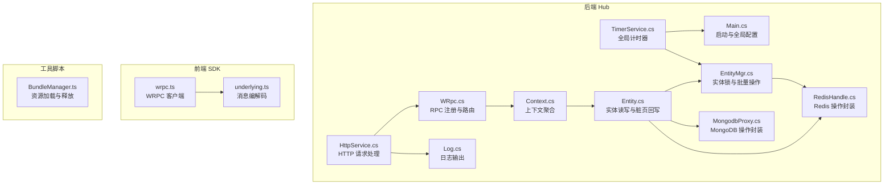
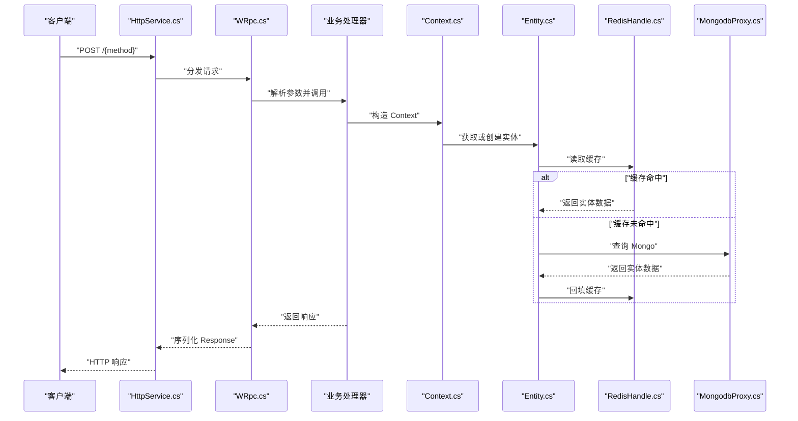
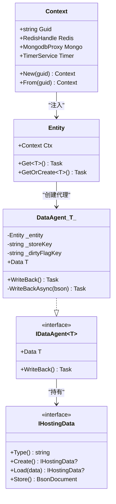
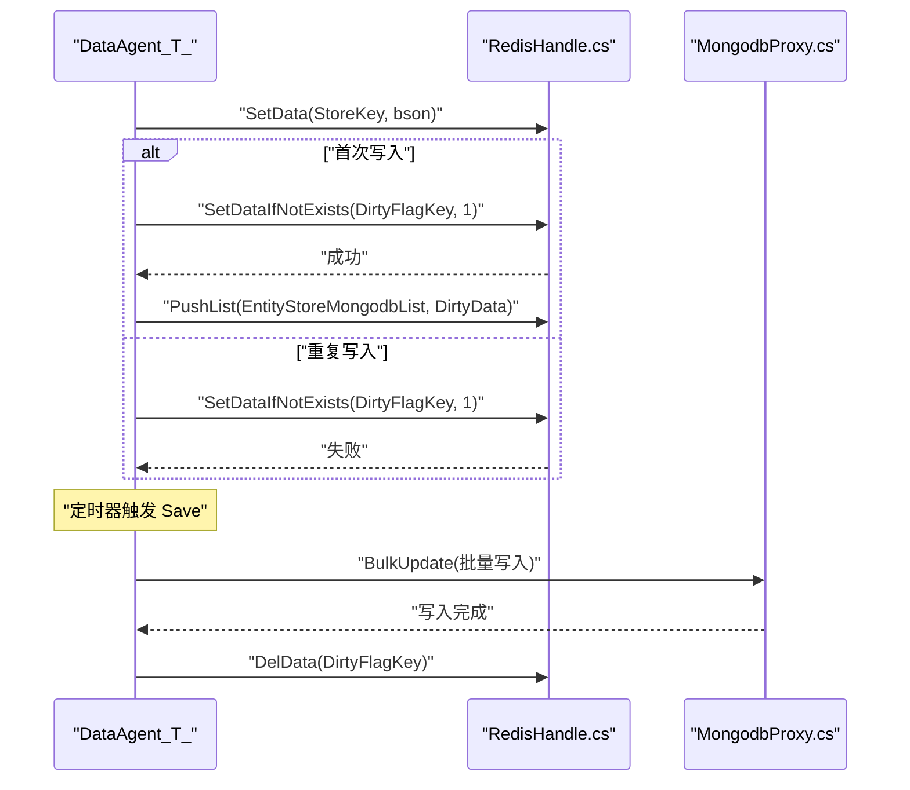
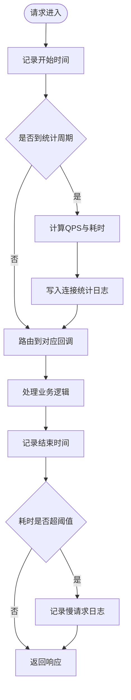
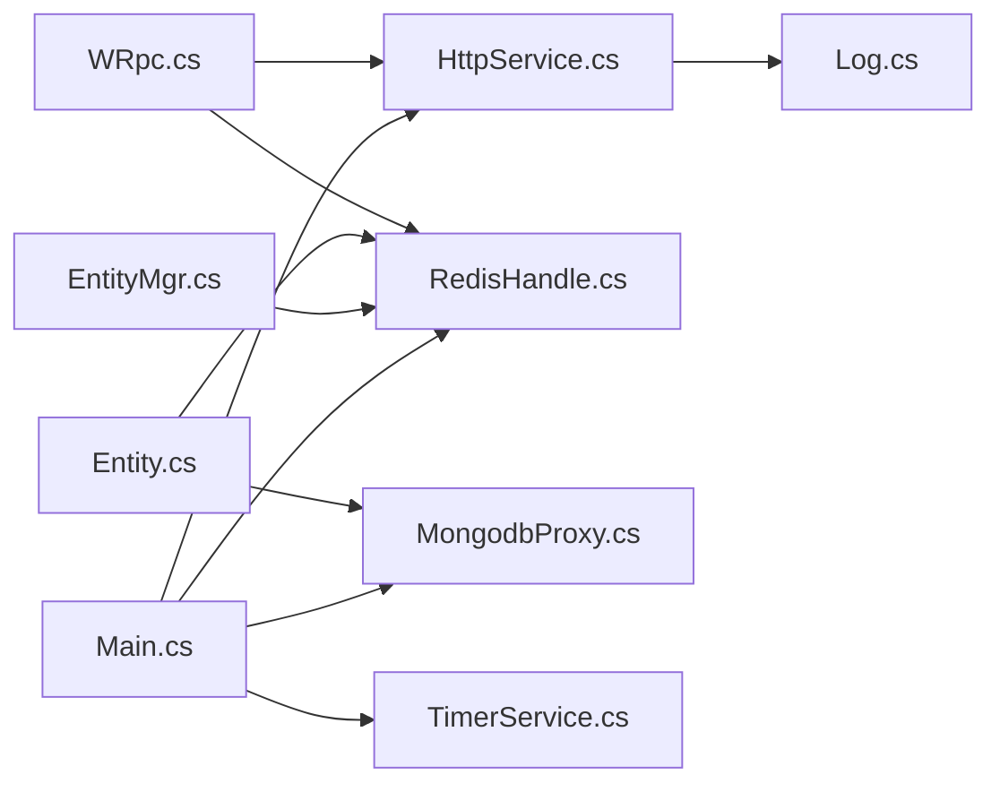

# 性能监控与指标

<cite>
**本文引用的文件**   
- [README.md](file://README.md)
- [package.json](file://package.json)
- [Main.cs](file://lgbf/hub/Main.cs)
- [Context.cs](file://lgbf/hub/Context.cs)
- [Entity.cs](file://lgbf/hub/Entity.cs)
- [EntityMgr.cs](file://lgbf/hub/EntityMgr.cs)
- [RedisHelp.cs](file://lgbf/hub/RedisHelp.cs)
- [RedisHandle.cs](file://lgbf/hub/RedisHandle.cs)
- [MongodbProxy.cs](file://lgbf/hub/MongodbProxy.cs)
- [DbHelper.cs](file://lgbf/hub/DbHelper.cs)
- [TimerService.cs](file://lgbf/hub/TimerService.cs)
- [HttpService.cs](file://lgbf/hub/HttpService.cs)
- [WRpc.cs](file://lgbf/hub/WRpc.cs)
- [Log.cs](file://lgbf/hub/Log.cs)
- [wrpc.ts](file://gem/ccc/assets/script/ServerSDK/wrpc.ts)
- [underlying.ts](file://gem/ccc/assets/script/ServerSDK/underlying.ts)
- [BundleManager.ts](file://gem/ccc/assets/script/tools/BundleManager/BundleManager.ts)
</cite>

## 目录
1. [简介](#简介)
2. [项目结构](#项目结构)
3. [核心组件](#核心组件)
4. [架构总览](#架构总览)
5. [详细组件分析](#详细组件分析)
6. [依赖关系分析](#依赖关系分析)
7. [性能考量](#性能考量)
8. [故障排查指南](#故障排查指南)
9. [结论](#结论)
10. [附录](#附录)

## 简介
本指南围绕 LGBF 轻量级游戏后端框架的性能监控与指标收集展开，目标是帮助读者系统性地理解如何在该框架中定义与采集关键性能指标（KPI），构建指标采集、存储与可视化的体系，并建立实时监控与告警、趋势分析与容量规划、基准测试与日志诊断的方法论。文档结合仓库中的实际代码模块，给出架构图、流程图与类图，使非专业读者也能快速上手。

## 项目结构
LGBF 后端由 C# 编写的 hub 模块与前端脚本 SDK 组成：
- 后端 hub：提供 HTTP RPC 服务、实体管理、缓存与数据库代理、计时器与日志等能力
- 前端 SDK：基于 protobuf 的 WRPC 客户端，用于与后端交互
- 工具脚本：包含资源加载与缓存工具，有助于理解前端侧性能行为

图表来源
- [Main.cs:1-159](file://lgbf/hub/Main.cs#L1-L159)
- [Context.cs:1-27](file://lgbf/hub/Context.cs#L1-L27)
- [Entity.cs:1-154](file://lgbf/hub/Entity.cs#L1-L154)
- [EntityMgr.cs:1-128](file://lgbf/hub/EntityMgr.cs#L1-L128)
- [TimerService.cs:1-126](file://lgbf/hub/TimerService.cs#L1-L126)
- [HttpService.cs:1-182](file://lgbf/hub/HttpService.cs#L1-L182)
- [WRpc.cs:1-155](file://lgbf/hub/WRpc.cs#L1-L155)
- [RedisHandle.cs:1-544](file://lgbf/hub/RedisHandle.cs#L1-L544)
- [MongodbProxy.cs:1-221](file://lgbf/hub/MongodbProxy.cs#L1-L221)
- [Log.cs:1-113](file://lgbf/hub/Log.cs#L1-L113)
- [wrpc.ts:1-101](file://gem/ccc/assets/script/ServerSDK/wrpc.ts#L1-L101)
- [underlying.ts:142-239](file://gem/ccc/assets/script/ServerSDK/underlying.ts#L142-L239)
- [BundleManager.ts:100-141](file://gem/ccc/assets/script/tools/BundleManager/BundleManager.ts#L100-L141)

章节来源
- [README.md:1-3](file://README.md#L1-L3)
- [package.json:1-6](file://package.json#L1-L6)

## 核心组件
- 全局启动与配置：负责初始化 Redis、Mongo、HTTP 服务与定时任务
- 上下文 Context：统一注入 Redis、Mongo、Timer，贯穿实体生命周期
- 实体 Entity：抽象实体数据接口与数据代理，支持从 Redis 读取、从 Mongo 回退加载与写回
- 实体管理 EntityMgr：提供分布式锁、批量实体获取与回调执行
- 计时器 TimerService：全局 Tick 与周期调度，驱动保存任务
- HTTP 与 WRPC：HTTP 请求入口与 RPC 注册分发，内置连接统计与超时记录
- 缓存与数据库：RedisHandle 提供键值、列表、有序集合、哈希、分布式锁等；MongodbProxy 提供索引、插入、更新、批量写入、查询与计数
- 日志：统一日志级别、时间戳、文件轮转与大小限制

章节来源
- [Main.cs:1-159](file://lgbf/hub/Main.cs#L1-L159)
- [Context.cs:1-27](file://lgbf/hub/Context.cs#L1-L27)
- [Entity.cs:1-154](file://lgbf/hub/Entity.cs#L1-L154)
- [EntityMgr.cs:1-128](file://lgbf/hub/EntityMgr.cs#L1-L128)
- [TimerService.cs:1-126](file://lgbf/hub/TimerService.cs#L1-L126)
- [HttpService.cs:1-182](file://lgbf/hub/HttpService.cs#L1-L182)
- [WRpc.cs:1-155](file://lgbf/hub/WRpc.cs#L1-L155)
- [RedisHandle.cs:1-544](file://lgbf/hub/RedisHandle.cs#L1-L544)
- [MongodbProxy.cs:1-221](file://lgbf/hub/MongodbProxy.cs#L1-L221)
- [Log.cs:1-113](file://lgbf/hub/Log.cs#L1-L113)

## 架构总览
后端采用“HTTP + Protobuf RPC”的请求模型，通过 WRpc 将请求路由到具体业务处理器；实体数据以“Redis 缓存 + Mongo 持久化”双写策略实现高并发读写与最终一致性；定时器驱动脏页回写，降低写放大与延迟。

图表来源
- [HttpService.cs:50-114](file://lgbf/hub/HttpService.cs#L50-L114)
- [WRpc.cs:16-44](file://lgbf/hub/WRpc.cs#L16-L44)
- [Entity.cs:104-153](file://lgbf/hub/Entity.cs#L104-L153)
- [RedisHandle.cs:159-174](file://lgbf/hub/RedisHandle.cs#L159-L174)
- [MongodbProxy.cs:143-184](file://lgbf/hub/MongodbProxy.cs#L143-L184)

## 详细组件分析

### 关键性能指标（KPI）定义与计算
- 响应时间（P95/P99）：可在 HTTP 层统计每秒请求数与耗时，结合日志记录长耗时请求
- 吞吐量（QPS/RPS）：统计单位时间内处理的请求数
- 错误率：统计 HTTP 5xx 或 WRPC 返回错误的比例
- 资源利用率：CPU、内存、网络带宽、Redis/Mongo 连接池使用情况（建议通过外部监控系统采集）

章节来源
- [HttpService.cs:47-62](file://lgbf/hub/HttpService.cs#L47-L62)
- [HttpService.cs:108-112](file://lgbf/hub/HttpService.cs#L108-L112)
- [Log.cs:19-58](file://lgbf/hub/Log.cs#L19-L58)

### 指标采集、存储与可视化
- 采集点
  - HTTP 层：连接统计与超时日志
  - 实体写回：批量写入 Mongo 的耗时与失败次数
  - Redis/Mongo：命令耗时与异常重试
- 存储与可视化
  - 可将日志与统计信息写入集中式日志系统（如 ELK/Fluentd）或时序数据库（如 InfluxDB）
  - 使用可视化面板（如 Grafana）展示 KPI 趋势

章节来源
- [Main.cs:50-157](file://lgbf/hub/Main.cs#L50-L157)
- [RedisHandle.cs:27-34](file://lgbf/hub/RedisHandle.cs#L27-L34)
- [MongodbProxy.cs:102-120](file://lgbf/hub/MongodbProxy.cs#L102-L120)

### 实时监控与告警
- 阈值设置
  - HTTP 响应时间超过 1 秒记为慢请求
  - 连接统计异常波动（如 QPS 下降、错误率上升）
- 告警规则
  - 基于阈值触发（如连续 N 分钟 P95 超过阈值）
  - 基于趋势（如错误率环比增长超过 X%）
- 通知策略
  - 邮件/IM/电话分级通知，避免告警风暴

章节来源
- [HttpService.cs:108-112](file://lgbf/hub/HttpService.cs#L108-L112)
- [Log.cs:60-100](file://lgbf/hub/Log.cs#L60-L100)

### 性能数据分析与趋势预测
- 历史数据对比：按天/小时对比 QPS、错误率、平均响应时间
- 性能基线：建立正常时段的 KPI 基线，识别偏离
- 容量规划：根据峰值 QPS 与资源利用率推导扩容节点数与缓存命中率目标

章节来源
- [TimerService.cs:68-89](file://lgbf/hub/TimerService.cs#L68-L89)
- [Main.cs:15-36](file://lgbf/hub/Main.cs#L15-L36)

### 基准测试实施
- 测试场景设计
  - 并发用户数阶梯式增长（如 100→500→1000→2000）
  - 场景覆盖登录、实体读写、排行榜等关键路径
- 数据收集
  - 使用压测工具（如 k6/JMeter）模拟请求，采集响应时间分布、错误率、吞吐量
- 结果分析
  - 对比不同并发下的 P95/P99 响应时间，定位瓶颈（Redis/Mongo/HTTP）

章节来源
- [HttpService.cs:149-173](file://lgbf/hub/HttpService.cs#L149-L173)
- [RedisHandle.cs:84-109](file://lgbf/hub/RedisHandle.cs#L84-L109)
- [MongodbProxy.cs:76-100](file://lgbf/hub/MongodbProxy.cs#L76-L100)

### 日志分析与性能诊断
- 日志结构：时间戳、级别、模块、方法、消息
- 常见问题定位
  - 写回失败：检查 Redis 写入与脏页队列推送
  - 查询超时：检查 Mongo 查询条件与索引
  - 锁竞争：检查实体锁获取与续期逻辑
- 诊断步骤
  - 快速检索错误日志
  - 关联请求链路与慢日志
  - 复现最小化场景

章节来源
- [Log.cs:60-100](file://lgbf/hub/Log.cs#L60-L100)
- [Entity.cs:58-91](file://lgbf/hub/Entity.cs#L58-L91)
- [EntityMgr.cs:20-42](file://lgbf/hub/EntityMgr.cs#L20-L42)
- [MongodbProxy.cs:55-74](file://lgbf/hub/MongodbProxy.cs#L55-L74)

### 类图：实体与数据代理

图表来源
- [Context.cs:4-26](file://lgbf/hub/Context.cs#L4-L26)
- [Entity.cs:4-29](file://lgbf/hub/Entity.cs#L4-L29)
- [Entity.cs:37-92](file://lgbf/hub/Entity.cs#L37-L92)
- [Entity.cs:94-153](file://lgbf/hub/Entity.cs#L94-L153)

### 序列图：实体写回流程

图表来源
- [Entity.cs:58-91](file://lgbf/hub/Entity.cs#L58-L91)
- [Main.cs:81-146](file://lgbf/hub/Main.cs#L81-L146)
- [RedisHandle.cs:111-131](file://lgbf/hub/RedisHandle.cs#L111-L131)
- [MongodbProxy.cs:102-120](file://lgbf/hub/MongodbProxy.cs#L102-L120)

### 流程图：HTTP 请求处理与统计

图表来源
- [HttpService.cs:50-114](file://lgbf/hub/HttpService.cs#L50-L114)
- [Log.cs:60-100](file://lgbf/hub/Log.cs#L60-L100)

## 依赖关系分析
- 组件耦合
  - Context 作为依赖注入中心，被 Entity、EntityMgr 广泛使用
  - WRpc 依赖 Redis 令牌映射与 HTTP 路由
  - Main 负责全局初始化与定时任务注册
- 外部依赖
  - Redis：缓存、分布式锁、有序集合、列表
  - MongoDB：持久化、索引、批量写入
  - Protobuf：跨语言消息编解码（前端 wrpc.ts 与 underlying.ts）

图表来源
- [WRpc.cs:16-44](file://lgbf/hub/WRpc.cs#L16-L44)
- [HttpService.cs:50-114](file://lgbf/hub/HttpService.cs#L50-L114)
- [Entity.cs:104-153](file://lgbf/hub/Entity.cs#L104-L153)
- [EntityMgr.cs:44-126](file://lgbf/hub/EntityMgr.cs#L44-L126)
- [Main.cs:31-40](file://lgbf/hub/Main.cs#L31-L40)
- [TimerService.cs:68-89](file://lgbf/hub/TimerService.cs#L68-L89)
- [RedisHandle.cs:159-174](file://lgbf/hub/RedisHandle.cs#L159-L174)
- [MongodbProxy.cs:143-184](file://lgbf/hub/MongodbProxy.cs#L143-L184)

章节来源
- [package.json:1-6](file://package.json#L1-L6)
- [wrpc.ts:1-101](file://gem/ccc/assets/script/ServerSDK/wrpc.ts#L1-L101)
- [underlying.ts:142-239](file://gem/ccc/assets/script/ServerSDK/underlying.ts#L142-L239)

## 性能考量
- 缓存命中率：优先从 Redis 读取，未命中再回源 Mongo
- 批量写入：利用脏页队列与批量更新减少写放大
- 锁粒度：实体级分布式锁，避免全局阻塞
- 连接与超时：合理设置 Redis/Mongo 超时与重试，防止雪崩
- 日志落盘：控制日志文件大小与轮转，避免 IO 放大

章节来源
- [Entity.cs:104-153](file://lgbf/hub/Entity.cs#L104-L153)
- [Main.cs:81-146](file://lgbf/hub/Main.cs#L81-L146)
- [EntityMgr.cs:44-126](file://lgbf/hub/EntityMgr.cs#L44-L126)
- [RedisHandle.cs:27-34](file://lgbf/hub/RedisHandle.cs#L27-L34)
- [Log.cs:68-98](file://lgbf/hub/Log.cs#L68-L98)

## 故障排查指南
- 写回失败
  - 检查 Redis 写入与脏页队列推送是否成功
  - 观察日志中“实体写回失败”错误
- 查询超时
  - 检查 Mongo 查询条件与索引是否存在
  - 关注慢查询日志
- 锁竞争
  - 检查锁获取与续期是否成功
  - 适当增大锁超时与续期间隔
- HTTP 超时
  - 查看慢请求日志与连接统计
  - 调整 Kestrel 并发与 KeepAlive 超时

章节来源
- [Entity.cs:86-91](file://lgbf/hub/Entity.cs#L86-L91)
- [EntityMgr.cs:20-42](file://lgbf/hub/EntityMgr.cs#L20-L42)
- [MongodbProxy.cs:55-74](file://lgbf/hub/MongodbProxy.cs#L55-L74)
- [HttpService.cs:108-112](file://lgbf/hub/HttpService.cs#L108-L112)

## 结论
LGBF 在后端层提供了清晰的实体读写、缓存与数据库协同、RPC 路由与计时器调度能力。结合本文档的 KPI 定义、采集与可视化、实时监控与告警、趋势分析与容量规划、基准测试与日志诊断方法，可形成一套完整的性能监控体系，支撑业务稳定与持续优化。

## 附录
- 前端 WRPC 客户端与消息编解码
  - 用于与后端进行 Protobuf 通信
- 资源加载与释放
  - 前端侧资源缓存与释放策略，有助于评估前端侧内存与加载性能

章节来源
- [wrpc.ts:1-101](file://gem/ccc/assets/script/ServerSDK/wrpc.ts#L1-L101)
- [underlying.ts:142-239](file://gem/ccc/assets/script/ServerSDK/underlying.ts#L142-L239)
- [BundleManager.ts:100-141](file://gem/ccc/assets/script/tools/BundleManager/BundleManager.ts#L100-L141)