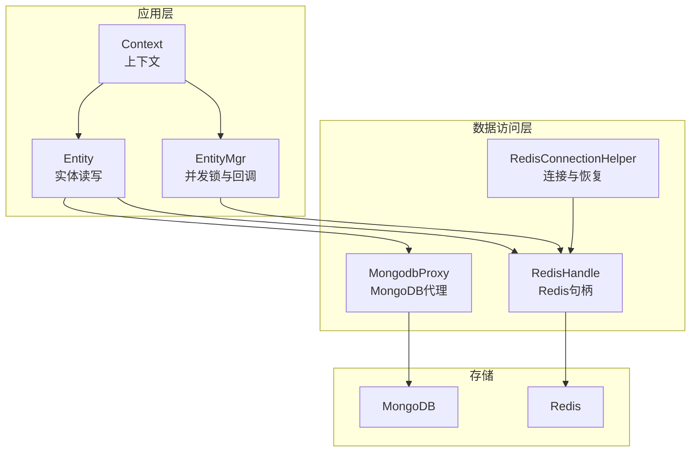
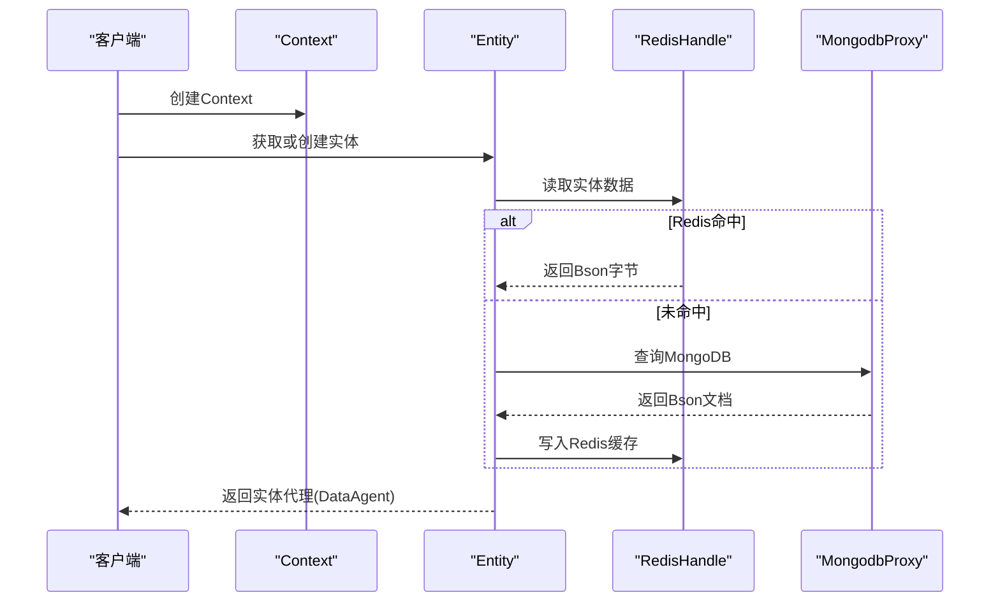
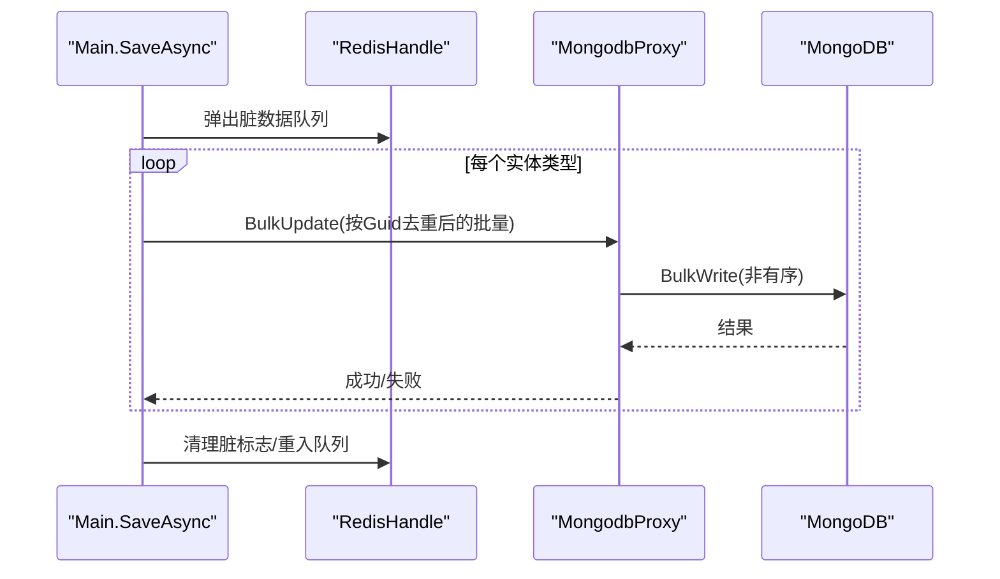
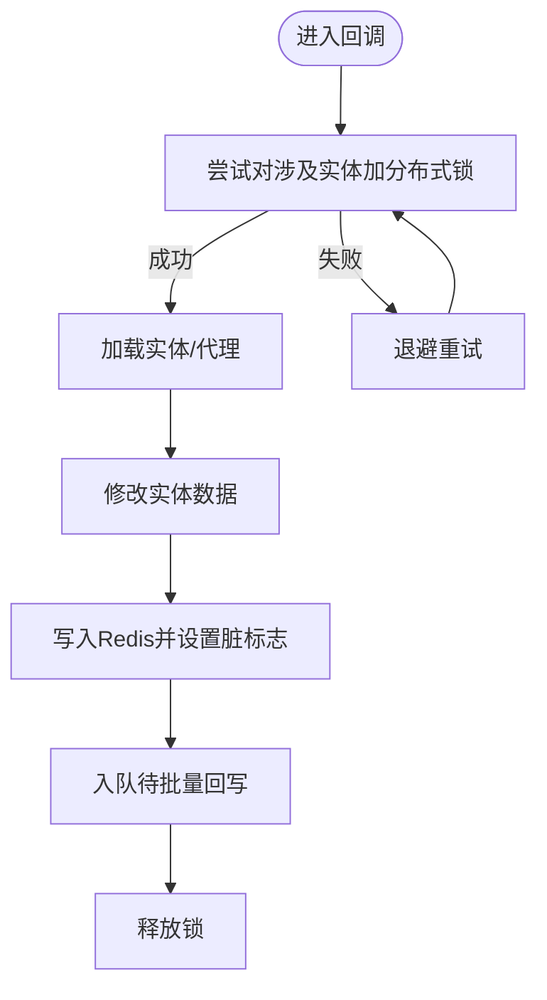
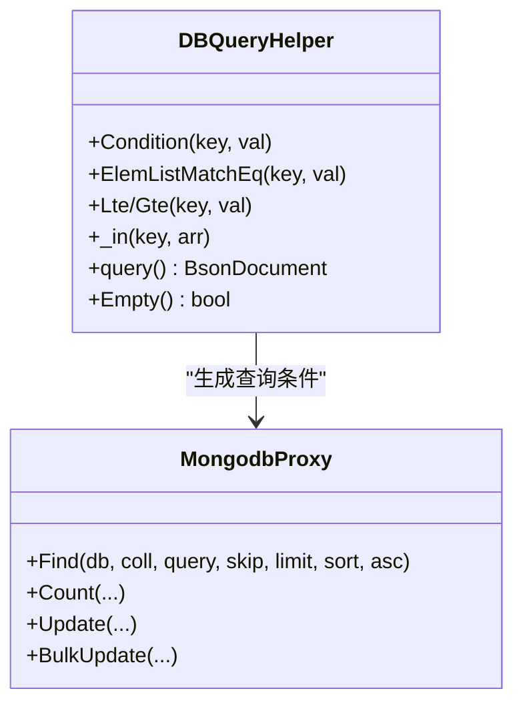
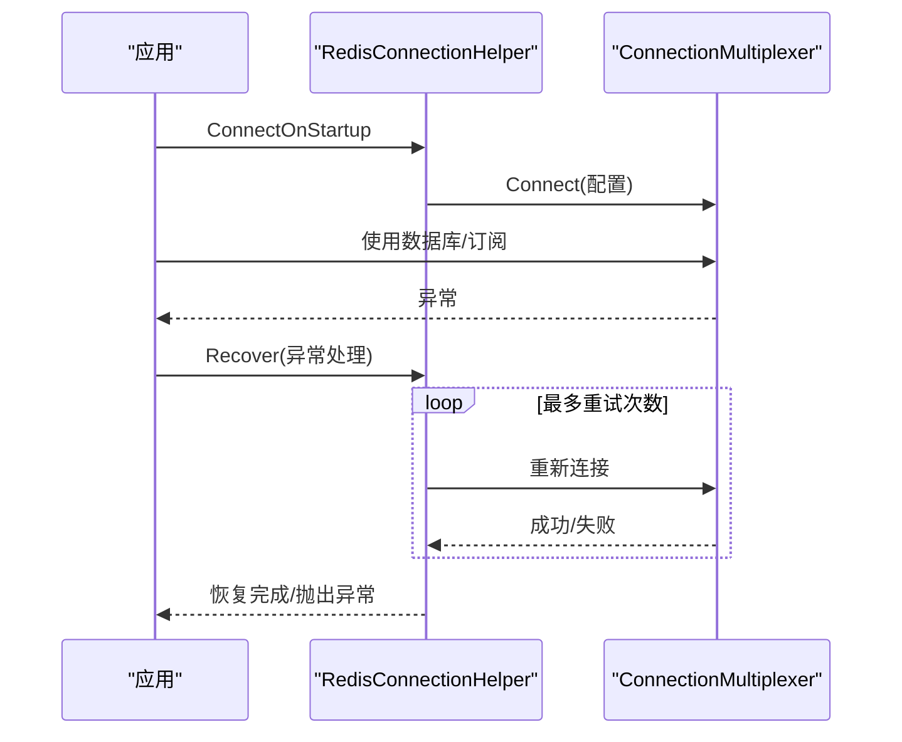
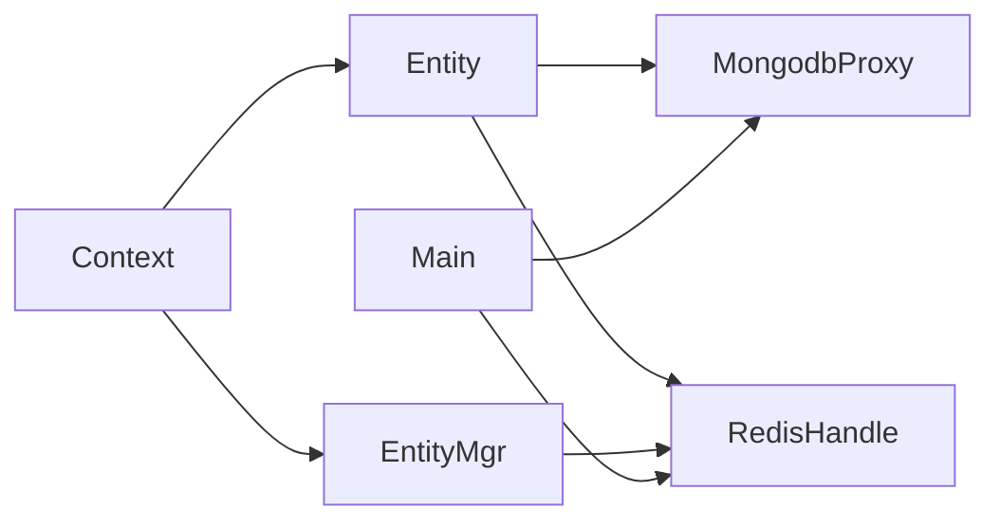

# 数据库优化

<cite>
**本文引用的文件**
- [DbHelper.cs](file://lgbf/hub/DbHelper.cs)
- [MongodbProxy.cs](file://lgbf/hub/MongodbProxy.cs)
- [Main.cs](file://lgbf/hub/Main.cs)
- [Entity.cs](file://lgbf/hub/Entity.cs)
- [EntityMgr.cs](file://lgbf/hub/EntityMgr.cs)
- [Context.cs](file://lgbf/hub/Context.cs)
- [RedisConnectionHelper.cs](file://lgbf/hub/RedisConnectionHelper.cs)
- [RedisHelp.cs](file://lgbf/hub/RedisHelp.cs)
- [Log.cs](file://lgbf/hub/Log.cs)
- [Underlying.cs](file://lgbf/hub/Underlying.cs)
</cite>

## 目录
1. [简介](#简介)
2. [项目结构](#项目结构)
3. [核心组件](#核心组件)
4. [架构总览](#架构总览)
5. [详细组件分析](#详细组件分析)
6. [依赖关系分析](#依赖关系分析)
7. [性能考量与优化建议](#性能考量与优化建议)
8. [故障排查指南](#故障排查指南)
9. [结论](#结论)
10. [附录：索引与查询优化策略](#附录索引与查询优化策略)

## 简介
本指南面向LGBF项目中的数据库优化实践，聚焦于MongoDB与Redis在该系统中的使用现状与可优化点。文档从架构与组件入手，结合现有代码实现，给出索引设计、批量写入、查询优化、连接池与监控等层面的实操建议，并提供慢查询分析与优化路径。

## 项目结构
LGBF后端以C#编写的hub为核心，负责：
- 通过MongodbProxy封装MongoDB访问（插入、更新、批量更新、查询、计数、删除、索引创建等）
- 通过RedisHandle与Redis交互（实体缓存、脏数据队列、锁机制等）
- 通过Entity/EntityMgr抽象实体读写与并发控制
- 通过Context统一注入Redis与Mongo句柄
- 通过定时器周期性将Redis中的脏数据批量回写到MongoDB

图表来源
- [Context.cs:4-26](file://lgbf/hub/Context.cs#L4-L26)
- [Entity.cs:94-153](file://lgbf/hub/Entity.cs#L94-L153)
- [EntityMgr.cs:44-126](file://lgbf/hub/EntityMgr.cs#L44-L126)
- [MongodbProxy.cs:10-220](file://lgbf/hub/MongodbProxy.cs#L10-L220)
- [RedisConnectionHelper.cs:6-143](file://lgbf/hub/RedisConnectionHelper.cs#L6-L143)

章节来源
- [Context.cs:4-26](file://lgbf/hub/Context.cs#L4-L26)
- [Entity.cs:94-153](file://lgbf/hub/Entity.cs#L94-L153)
- [EntityMgr.cs:44-126](file://lgbf/hub/EntityMgr.cs#L44-L126)
- [MongodbProxy.cs:10-220](file://lgbf/hub/MongodbProxy.cs#L10-L220)
- [RedisConnectionHelper.cs:6-143](file://lgbf/hub/RedisConnectionHelper.cs#L6-L143)

## 核心组件
- MongodbProxy：封装MongoDB常用操作，支持单条/批量更新、查找+修改、分页排序、计数、删除、索引创建等
- DBQueryHelper/UpdateDataHelper/SaveDataHelper：构建查询、更新、保存的BSON文档，保证类型安全与一致性
- Entity/EntityMgr：实体生命周期管理、并发锁、脏数据回写流程
- RedisHandle与RedisConnectionHelper：Redis连接建立、重连与恢复策略
- Main：定时任务驱动脏数据批量回写

章节来源
- [MongodbProxy.cs:10-220](file://lgbf/hub/MongodbProxy.cs#L10-L220)
- [DbHelper.cs:4-311](file://lgbf/hub/DbHelper.cs#L4-L311)
- [Entity.cs:37-153](file://lgbf/hub/Entity.cs#L37-L153)
- [EntityMgr.cs:44-126](file://lgbf/hub/EntityMgr.cs#L44-L126)
- [RedisConnectionHelper.cs:6-143](file://lgbf/hub/RedisConnectionHelper.cs#L6-L143)
- [Main.cs:50-157](file://lgbf/hub/Main.cs#L50-L157)

## 架构总览
系统采用“Redis热缓存 + MongoDB持久化”的双层架构。写路径以Redis为缓冲，定期批量回写MongoDB；读路径优先命中Redis，未命中则回源MongoDB并回填Redis。并发控制通过Redis分布式锁保障。

图表来源
- [Context.cs:11-25](file://lgbf/hub/Context.cs#L11-L25)
- [Entity.cs:104-153](file://lgbf/hub/Entity.cs#L104-L153)
- [MongodbProxy.cs:143-184](file://lgbf/hub/MongodbProxy.cs#L143-L184)

## 详细组件分析

### MongoDB代理与批量写入
- 单条更新/插入：支持Upsert，适合幂等写入
- 批量更新：使用BulkWrite（非有序）提升吞吐
- 分页查询：支持Skip/Limit/Sort/ExcludeId投影
- 计数与删除：提供Count与DeleteOne
- 索引创建：支持唯一索引

图表来源
- [Main.cs:81-146](file://lgbf/hub/Main.cs#L81-L146)
- [MongodbProxy.cs:102-120](file://lgbf/hub/MongodbProxy.cs#L102-L120)

章节来源
- [MongodbProxy.cs:10-220](file://lgbf/hub/MongodbProxy.cs#L10-L220)
- [Main.cs:50-157](file://lgbf/hub/Main.cs#L50-L157)

### 实体读写与并发控制
- 实体代理DataAgent：写回时先写Redis，再标记脏标志，最后入队等待批量回写
- 并发锁：EntityMgr基于Redis分布式锁，按实体集合加锁，避免写冲突
- 锁续期：后台任务定时续期，防止超时释放

图表来源
- [Entity.cs:52-91](file://lgbf/hub/Entity.cs#L52-L91)
- [EntityMgr.cs:44-126](file://lgbf/hub/EntityMgr.cs#L44-L126)
- [RedisHelp.cs:4-19](file://lgbf/hub/RedisHelp.cs#L4-L19)

章节来源
- [Entity.cs:37-153](file://lgbf/hub/Entity.cs#L37-L153)
- [EntityMgr.cs:44-126](file://lgbf/hub/EntityMgr.cs#L44-L126)
- [RedisHelp.cs:4-19](file://lgbf/hub/RedisHelp.cs#L4-L19)

### 查询构建与投影优化
- DBQueryHelper：支持多类型条件拼装，最终以$and组合
- 投影：Find接口默认排除_id字段，减少网络传输
- 排序：支持升/降序，配合索引可显著降低排序成本

图表来源
- [DbHelper.cs:160-311](file://lgbf/hub/DbHelper.cs#L160-L311)
- [MongodbProxy.cs:143-184](file://lgbf/hub/MongodbProxy.cs#L143-L184)

章节来源
- [DbHelper.cs:160-311](file://lgbf/hub/DbHelper.cs#L160-L311)
- [MongodbProxy.cs:143-184](file://lgbf/hub/MongodbProxy.cs#L143-L184)

### Redis连接与恢复
- 连接参数：connectRetry、connectTimeout、keepAlive、resolveDns等
- 自动重连：异常时循环重试，指数退避上限控制
- 并发保护：重连过程互斥，避免并发重建

图表来源
- [RedisConnectionHelper.cs:35-127](file://lgbf/hub/RedisConnectionHelper.cs#L35-L127)

章节来源
- [RedisConnectionHelper.cs:6-143](file://lgbf/hub/RedisConnectionHelper.cs#L6-L143)

## 依赖关系分析
- Context注入Mongo与Redis句柄，贯穿Entity/EntityMgr使用
- Entity依赖Redis缓存与Mongo回源，同时触发批量回写
- Main定时器驱动批量回写，形成“热缓存-冷持久化”的写路径闭环

图表来源
- [Context.cs:4-26](file://lgbf/hub/Context.cs#L4-L26)
- [Entity.cs:94-153](file://lgbf/hub/Entity.cs#L94-L153)
- [EntityMgr.cs:44-126](file://lgbf/hub/EntityMgr.cs#L44-L126)
- [Main.cs:50-157](file://lgbf/hub/Main.cs#L50-L157)

章节来源
- [Context.cs:4-26](file://lgbf/hub/Context.cs#L4-L26)
- [Entity.cs:94-153](file://lgbf/hub/Entity.cs#L94-L153)
- [EntityMgr.cs:44-126](file://lgbf/hub/EntityMgr.cs#L44-L126)
- [Main.cs:50-157](file://lgbf/hub/Main.cs#L50-L157)

## 性能考量与优化建议

### MongoDB索引设计策略
- 复合索引
  - 命中率高的查询条件应前置，遵循“最左匹配”原则
  - 避免过多复合索引导致写放大，按实际查询模式逐一评估
- 文本索引
  - 仅在需要全文检索时启用，注意字段大小与分词策略
- 地理空间索引
  - 仅在地理位置查询场景使用，合理选择2dsphere/2d索引类型
- 唯一索引
  - 对业务主键（如Guid）建立唯一索引，确保幂等写入

章节来源
- [MongodbProxy.cs:35-53](file://lgbf/hub/MongodbProxy.cs#L35-L53)

### 批量操作优化
- 批量插入/更新
  - 使用BulkWrite（非有序）提升吞吐，必要时拆分批次
  - 按实体类型分组，避免跨集合/跨库事务
- 批量删除
  - 尽量使用条件过滤，避免全表扫描
- Upsert策略
  - 合理使用Upsert，避免重复写入带来的索引维护开销

章节来源
- [MongodbProxy.cs:102-120](file://lgbf/hub/MongodbProxy.cs#L102-L120)
- [Main.cs:103-146](file://lgbf/hub/Main.cs#L103-L146)

### 查询性能调优
- 查询计划分析
  - 使用explain输出执行计划，关注是否走索引、是否发生排序/覆盖
- 投影优化
  - 默认排除_id，按需投影字段，减少网络与内存占用
- 聚合管道优化
  - 将过滤、排序、投影前移，减少中间文档数量
  - 避免昂贵的聚合阶段（如大结果集排序）

章节来源
- [MongodbProxy.cs:143-184](file://lgbf/hub/MongodbProxy.cs#L143-L184)

### 连接池与连接管理
- MongoDB
  - 使用MongoClient单例，避免频繁创建连接
  - 合理设置连接字符串参数（如连接池大小、超时），结合监控调整
- Redis
  - 参考RedisConnectionHelper的连接参数，结合业务QPS与延迟目标调优
  - 重连策略与退避上限需平衡可用性与资源消耗

章节来源
- [MongodbProxy.cs:14-23](file://lgbf/hub/MongodbProxy.cs#L14-L23)
- [RedisConnectionHelper.cs:26-143](file://lgbf/hub/RedisConnectionHelper.cs#L26-L143)

### 数据分片与副本集
- 分片
  - 选择合适的分片键，确保写入与查询均匀分布
- 副本集
  - 读写分离与延迟复制策略，结合业务容忍度配置
- 本项目当前未见显式分片/副本集配置代码，建议在部署层面对接

（本小节为通用建议，不直接分析具体文件）

### 监控指标与分析工具
- 日志
  - 使用Log模块记录错误与关键事件，便于定位问题
- 指标
  - MongoDB：连接数、命令耗时、索引命中率、写入延迟
  - Redis：连接数、命中率、慢查询、内存使用
- 工具
  - MongoDB：mongostat/mongooplog、Atlas/云服务内置监控
  - Redis：INFO/CLUSTER命令、RedisInsight等

章节来源
- [Log.cs:6-112](file://lgbf/hub/Log.cs#L6-L112)

### 慢查询日志分析与优化
- 开启慢查询日志，设定阈值
- 分析热点集合与慢查询语句，针对性建立索引或重构查询
- 结合批量写入与投影优化，降低慢查询发生概率

（本小节为通用建议，不直接分析具体文件）

## 故障排查指南
- Redis连接异常
  - 观察重连次数与间隔，确认网络与密码配置
  - 若持续失败，检查服务端状态与防火墙
- MongoDB写入失败
  - 检查索引冲突、权限与集合大小限制
  - 关注批量写入返回值，必要时回滚或重试
- 实体写回失败
  - 查看脏标志与队列状态，确认回写流程是否被中断
  - 核对Guid与类型映射，避免跨类型误写

章节来源
- [RedisConnectionHelper.cs:56-127](file://lgbf/hub/RedisConnectionHelper.cs#L56-L127)
- [MongodbProxy.cs:102-120](file://lgbf/hub/MongodbProxy.cs#L102-L120)
- [Entity.cs:52-91](file://lgbf/hub/Entity.cs#L52-L91)

## 结论
LGBF通过“Redis热缓存 + MongoDB持久化”的架构实现了高并发下的读写分离与削峰。结合批量回写、投影优化与合理的索引策略，可在保证一致性的同时显著提升吞吐与延迟表现。建议在部署层进一步完善监控与告警体系，并根据业务增长逐步引入分片/副本集能力。

## 附录：索引与查询优化策略

### 索引设计要点
- 复合索引
  - 优先考虑高频过滤字段，遵循“最左匹配”
  - 控制索引数量，避免写放大
- 文本索引
  - 仅在全文检索场景启用，关注字段大小与分词
- 地理空间索引
  - 仅在位置查询使用，选择合适索引类型

章节来源
- [MongodbProxy.cs:35-53](file://lgbf/hub/MongodbProxy.cs#L35-L53)

### 批量写入最佳实践
- 分批大小
  - 根据网络与磁盘IO调优批次大小，避免过大导致延迟抖动
- 去重与幂等
  - 按实体Guid去重，避免重复写入
- 错误处理
  - 非有序批量写入，失败项单独重试

章节来源
- [Main.cs:103-146](file://lgbf/hub/Main.cs#L103-L146)
- [MongodbProxy.cs:102-120](file://lgbf/hub/MongodbProxy.cs#L102-L120)

### 查询与投影优化
- 投影
  - 默认排除_id，按需投影字段
- 排序
  - 优先使用索引排序，避免内存排序
- 聚合
  - 将过滤与投影前置，减少中间结果集

章节来源
- [MongodbProxy.cs:143-184](file://lgbf/hub/MongodbProxy.cs#L143-L184)
- [DbHelper.cs:160-311](file://lgbf/hub/DbHelper.cs#L160-L311)