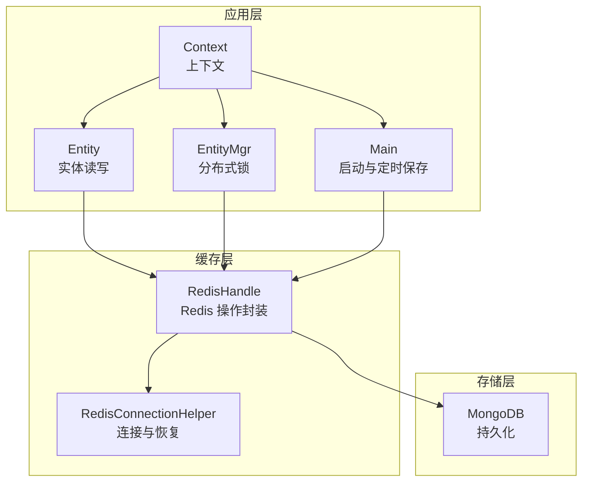
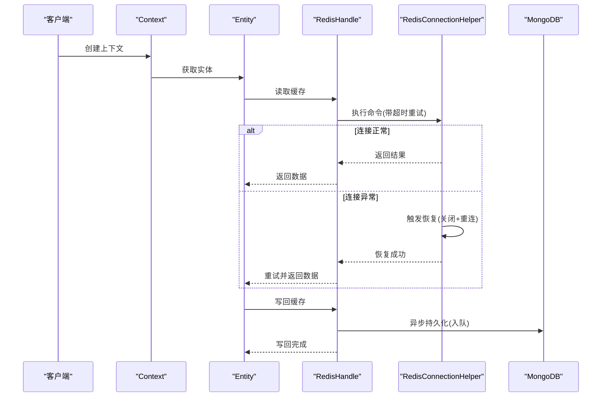
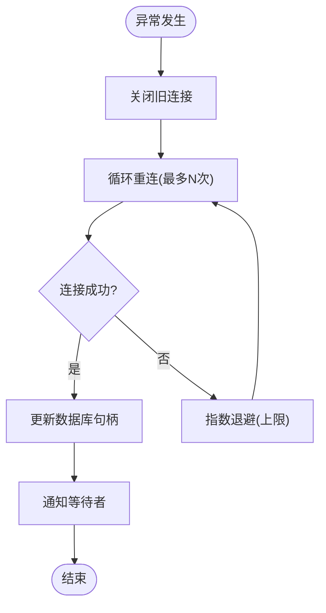
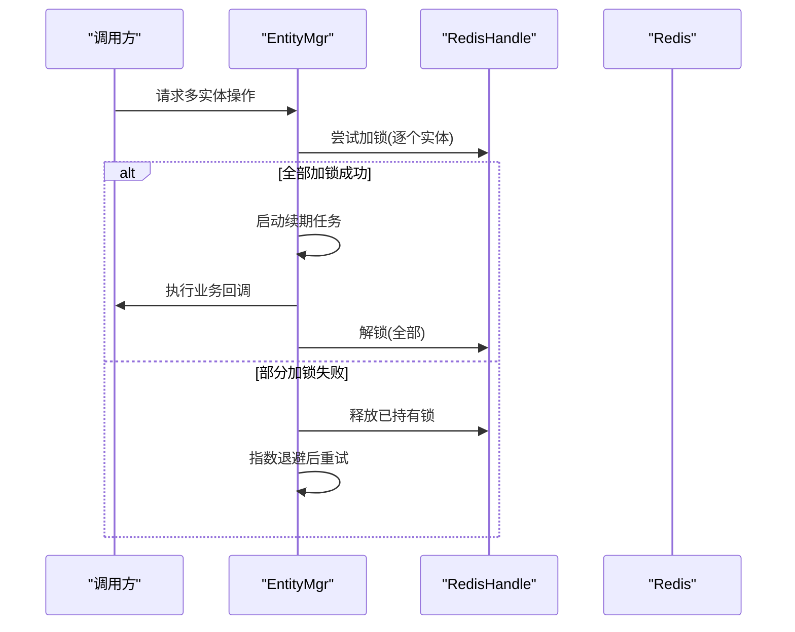
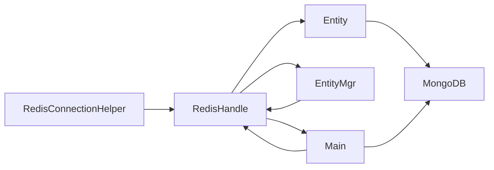

# 缓存优化

<cite>
**本文引用的文件**
- [RedisConnectionHelper.cs](file://lgbf/hub/RedisConnectionHelper.cs)
- [RedisHandle.cs](file://lgbf/hub/RedisHandle.cs)
- [RedisHelp.cs](file://lgbf/hub/RedisHelp.cs)
- [Entity.cs](file://lgbf/hub/Entity.cs)
- [EntityMgr.cs](file://lgbf/hub/EntityMgr.cs)
- [Main.cs](file://lgbf/hub/Main.cs)
- [Context.cs](file://lgbf/hub/Context.cs)
- [Log.cs](file://lgbf/hub/Log.cs)
- [TimerService.cs](file://lgbf/hub/TimerService.cs)
</cite>

## 目录
1. [简介](#简介)
2. [项目结构](#项目结构)
3. [核心组件](#核心组件)
4. [架构总览](#架构总览)
5. [详细组件分析](#详细组件分析)
6. [依赖关系分析](#依赖关系分析)
7. [性能考量](#性能考量)
8. [故障排查指南](#故障排查指南)
9. [结论](#结论)
10. [附录](#附录)

## 简介
本指南围绕 LGBF 的缓存优化展开，重点覆盖 Redis 连接池与连接管理、缓存命中率优化策略、内存使用与碎片整理、分布式锁性能优化、数据结构选择建议以及缓存性能测试与基准分析方法。文档基于仓库中实际代码进行分析，帮助读者在不直接阅读源码的情况下掌握关键实践与最佳做法。

## 项目结构
LGBF 的缓存层主要由以下模块构成：
- Redis 连接与恢复：RedisConnectionHelper 负责连接参数构建与异常恢复；RedisHandle 封装 Redis 操作与重试逻辑。
- 实体缓存与持久化：Entity 提供实体读取与写回流程；Main 中的周期性保存任务负责脏数据落盘。
- 分布式锁：EntityMgr 提供多实体加锁、续期与解锁流程，避免死锁与长时间占用。
- 上下文与日志：Context 提供统一上下文注入；Log 提供日志输出与轮转控制。

图表来源
- [Context.cs:4-26](file://lgbf/hub/Context.cs#L4-L26)
- [Entity.cs:94-153](file://lgbf/hub/Entity.cs#L94-L153)
- [EntityMgr.cs:44-126](file://lgbf/hub/EntityMgr.cs#L44-L126)
- [Main.cs:31-40](file://lgbf/hub/Main.cs#L31-L40)
- [RedisHandle.cs:13-544](file://lgbf/hub/RedisHandle.cs#L13-L544)
- [RedisConnectionHelper.cs:6-144](file://lgbf/hub/RedisConnectionHelper.cs#L6-L144)

章节来源
- [Context.cs:4-26](file://lgbf/hub/Context.cs#L4-L26)
- [Main.cs:31-40](file://lgbf/hub/Main.cs#L31-L40)

## 核心组件
- RedisConnectionHelper：负责连接字符串构建、连接超时、重连次数、保活时间、DNS 解析与连接名称；提供异常恢复流程与并发保护。
- RedisHandle：封装 Redis 命令调用，统一处理 RedisTimeoutException 并触发恢复；提供字符串、哈希、列表、有序集合等常用操作；内置分布式锁接口。
- RedisHelp：集中定义缓存键命名规范，便于统一管理与维护。
- Entity：实体读取与写回流程，优先从 Redis 获取，缺失则回源到 MongoDB，并将数据写回 Redis；写回时通过队列异步持久化。
- EntityMgr：多实体加锁、续期与解锁，避免死锁与长时间占用。
- Main：启动阶段初始化 Redis 与 MongoDB；定时批量处理脏数据队列，减少写入压力。
- Context：统一注入 Redis、Mongo、Timer 等依赖。
- Log：日志输出与轮转，便于定位缓存异常与恢复事件。
- TimerService：全局定时器服务，驱动 Main 的周期性保存任务。

章节来源
- [RedisConnectionHelper.cs:6-144](file://lgbf/hub/RedisConnectionHelper.cs#L6-L144)
- [RedisHandle.cs:13-544](file://lgbf/hub/RedisHandle.cs#L13-L544)
- [RedisHelp.cs:4-19](file://lgbf/hub/RedisHelp.cs#L4-L19)
- [Entity.cs:37-153](file://lgbf/hub/Entity.cs#L37-L153)
- [EntityMgr.cs:4-126](file://lgbf/hub/EntityMgr.cs#L4-L126)
- [Main.cs:13-159](file://lgbf/hub/Main.cs#L13-L159)
- [Context.cs:4-26](file://lgbf/hub/Context.cs#L4-L26)
- [Log.cs:6-112](file://lgbf/hub/Log.cs#L6-L112)
- [TimerService.cs:7-125](file://lgbf/hub/TimerService.cs#L7-L125)

## 架构总览
下图展示了缓存层在系统中的位置与交互路径，包括连接管理、命令执行、异常恢复与持久化流程。

图表来源
- [Entity.cs:104-135](file://lgbf/hub/Entity.cs#L104-L135)
- [RedisHandle.cs:138-174](file://lgbf/hub/RedisHandle.cs#L138-L174)
- [RedisConnectionHelper.cs:56-127](file://lgbf/hub/RedisConnectionHelper.cs#L56-L127)
- [Main.cs:81-146](file://lgbf/hub/Main.cs#L81-L146)

## 详细组件分析

### Redis 连接池与连接管理
- 连接参数构建
  - 连接字符串包含主机地址、密码、连接重试次数、连接超时、保活间隔、DNS 解析开关与连接名称，确保连接稳定性与可观测性。
- 连接超时与保活
  - 设置合理的连接超时与保活时间，有助于及时发现网络波动与断线情况。
- 故障恢复机制
  - 在捕获 RedisTimeoutException 后，进入恢复流程：关闭旧连接、按指数退避重连、记录恢复状态、通知等待者、避免并发恢复。
  - 恢复失败时抛出异常并记录错误日志，防止静默失败。
- 并发保护
  - 使用互斥量与等待通知机制，确保同一时刻仅有一个恢复流程在执行，避免资源竞争。

图表来源
- [RedisConnectionHelper.cs:56-127](file://lgbf/hub/RedisConnectionHelper.cs#L56-L127)

章节来源
- [RedisConnectionHelper.cs:26-144](file://lgbf/hub/RedisConnectionHelper.cs#L26-L144)

### 缓存命中率优化策略
- 数据预热
  - 在启动或业务低峰期，将热点实体从 MongoDB 预加载到 Redis，降低首次访问延迟。
- 热点数据处理
  - 对高频访问的数据设置较短但可续期的 TTL，结合续期任务延长生命周期，避免缓存抖动。
- 缓存失效策略
  - 使用“先写缓存、再入队持久化”的模式，保证最终一致性；对脏数据采用批处理与幂等写入，减少写放大。
- 键空间设计
  - 使用 RedisHelp 统一键命名规范，便于清理与迁移；为不同实体类型划分独立键空间，降低冲突概率。

章节来源
- [Entity.cs:58-91](file://lgbf/hub/Entity.cs#L58-L91)
- [Main.cs:81-146](file://lgbf/hub/Main.cs#L81-L146)
- [RedisHelp.cs:4-19](file://lgbf/hub/RedisHelp.cs#L4-L19)

### 内存使用监控与优化
- 内存碎片整理
  - 定期执行内存碎片整理（如 BGREWRITEAOF 或 BGSAVE），降低碎片率，提升内存使用效率。
- 键空间过期策略
  - 为不同业务设置合理的过期策略，避免大量键同时过期导致的瞬时压力。
- 内存淘汰算法
  - 根据业务特征选择合适的淘汰策略（如 volatile-ttl、allkeys-lru），平衡热点命中与内存占用。

[本节为通用指导，无需特定文件引用]

### Redis 锁机制的性能优化
- 分布式锁实现
  - 使用 Redis 的 SET key value NX EX ttl 原子操作实现基础锁；在业务侧配合唯一令牌与续期机制。
- 锁超时处理
  - 设置合理的锁超时时间，避免长时间占用；在业务执行期间定期续期，防止被其他实例抢占。
- 死锁避免
  - 采用最小持有原则：只在必要范围内持有锁；使用统一的锁顺序与超时重试策略；异常时强制解锁。
- 续期与解锁
  - 使用独立线程或定时任务进行锁续期；回调结束后立即解锁，缩短锁持有时间。

图表来源
- [EntityMgr.cs:44-126](file://lgbf/hub/EntityMgr.cs#L44-L126)
- [RedisHandle.cs:305-394](file://lgbf/hub/RedisHandle.cs#L305-L394)

章节来源
- [EntityMgr.cs:4-126](file://lgbf/hub/EntityMgr.cs#L4-L126)
- [RedisHandle.cs:305-394](file://lgbf/hub/RedisHandle.cs#L305-L394)

### 缓存数据结构选择建议
- 字符串（String）
  - 适合存储序列化后的完整对象或二进制数据；支持原子过期设置，适合实体缓存。
- 哈希（Hash）
  - 适合存储对象的部分字段或元信息；支持单字段更新与查询，适合频繁局部读写的场景。
- 列表（List）
  - 适合实现生产者-消费者队列或消息队列；支持左右推入与弹出，适合异步持久化队列。
- 集合（Set）与有序集合（ZSet）
  - 适合去重与排序需求；ZSet 可用于排行榜、优先级队列等场景。

章节来源
- [RedisHandle.cs:257-303](file://lgbf/hub/RedisHandle.cs#L257-L303)
- [RedisHandle.cs:396-499](file://lgbf/hub/RedisHandle.cs#L396-L499)
- [RedisHandle.cs:501-542](file://lgbf/hub/RedisHandle.cs#L501-L542)

### 缓存性能测试与基准分析
- 测试方法
  - 基准测试：使用稳定流量与固定数据集，测量读写延迟、吞吐量与错误率。
  - 压力测试：逐步增加并发与请求速率，观察缓存命中率变化与系统瓶颈。
  - 场景回归：对比开启/关闭缓存、不同 TTL、不同数据结构的性能差异。
- 结果分析
  - 关注 P50/P95/P99 延迟分布、QPS、缓存命中率与异常比例；结合日志定位慢查询与恢复事件。
  - 对比不同连接参数（连接超时、保活、重试）对稳定性的影响。

[本节为通用指导，无需特定文件引用]

## 依赖关系分析
- RedisHandle 依赖 RedisConnectionHelper 提供稳定的连接与恢复能力。
- Entity 通过 RedisHandle 读取与写回缓存，并通过 MongoDB 完成持久化。
- EntityMgr 通过 RedisHandle 实现分布式锁，协调多实体操作。
- Main 通过 RedisHandle 推送脏数据到队列，通过 MongoDB 批量写入，实现最终一致。

图表来源
- [RedisConnectionHelper.cs:6-144](file://lgbf/hub/RedisConnectionHelper.cs#L6-L144)
- [RedisHandle.cs:13-544](file://lgbf/hub/RedisHandle.cs#L13-L544)
- [Entity.cs:94-153](file://lgbf/hub/Entity.cs#L94-L153)
- [EntityMgr.cs:4-126](file://lgbf/hub/EntityMgr.cs#L4-L126)
- [Main.cs:81-146](file://lgbf/hub/Main.cs#L81-L146)

章节来源
- [RedisHandle.cs:13-544](file://lgbf/hub/RedisHandle.cs#L13-L544)
- [Entity.cs:94-153](file://lgbf/hub/Entity.cs#L94-L153)
- [EntityMgr.cs:4-126](file://lgbf/hub/EntityMgr.cs#L4-L126)
- [Main.cs:81-146](file://lgbf/hub/Main.cs#L81-L146)

## 性能考量
- 连接复用
  - 使用 ConnectionMultiplexer 单例复用连接，减少连接建立开销；合理设置连接池大小与超时参数。
- 命令批量化
  - 对写入操作进行批处理，降低网络往返；对读取操作使用流水线或管道提升吞吐。
- TTL 策略
  - 为不同业务设置差异化 TTL，热点数据短 TTL + 续期，冷数据长 TTL；避免集中过期。
- 锁粒度与超时
  - 最小化锁范围与持有时间；设置合理的锁超时与续期间隔，避免死锁与资源浪费。
- 日志与监控
  - 记录连接恢复、异常重试与慢查询事件，结合指标监控缓存命中率与延迟分布。

[本节为通用指导，无需特定文件引用]

## 故障排查指南
- 连接异常
  - 检查连接参数是否正确、网络是否稳定、DNS 解析是否可用；查看恢复日志与等待超时。
- 写回失败
  - 确认 Redis 写入返回值与异常类型；检查队列推送是否成功；核对 MongoDB 写入结果与重试逻辑。
- 分布式锁问题
  - 检查锁超时与续期任务是否正常运行；确认解锁是否在回调结束后执行；排查指数退避重试策略。
- 日志定位
  - 使用 Log 的错误级别输出与文件轮转功能，定位异常发生时间与上下文信息。

章节来源
- [RedisConnectionHelper.cs:56-127](file://lgbf/hub/RedisConnectionHelper.cs#L56-L127)
- [Entity.cs:58-91](file://lgbf/hub/Entity.cs#L58-L91)
- [EntityMgr.cs:20-42](file://lgbf/hub/EntityMgr.cs#L20-L42)
- [Log.cs:55-58](file://lgbf/hub/Log.cs#L55-L58)

## 结论
通过对 Redis 连接管理、缓存命中率优化、内存与锁机制的系统化梳理，LGBF 的缓存层在稳定性、性能与可维护性方面具备良好基础。建议在现有实现上进一步完善性能测试体系与监控告警，持续优化 TTL 与数据结构选择，以应对更高并发与更复杂业务场景。

## 附录
- 键空间与命名规范
  - 使用 RedisHelp 统一键前缀与格式，便于后续迁移与清理。
- 启动与定时任务
  - Main 负责初始化 Redis 与 MongoDB，并通过定时器周期性处理脏数据队列，保障最终一致性。

章节来源
- [RedisHelp.cs:4-19](file://lgbf/hub/RedisHelp.cs#L4-L19)
- [Main.cs:31-40](file://lgbf/hub/Main.cs#L31-L40)
- [TimerService.cs:68-96](file://lgbf/hub/TimerService.cs#L68-L96)