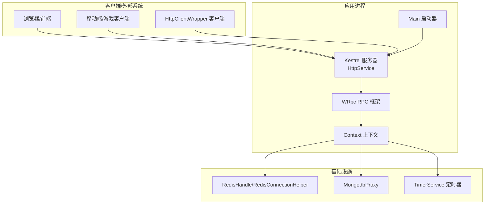
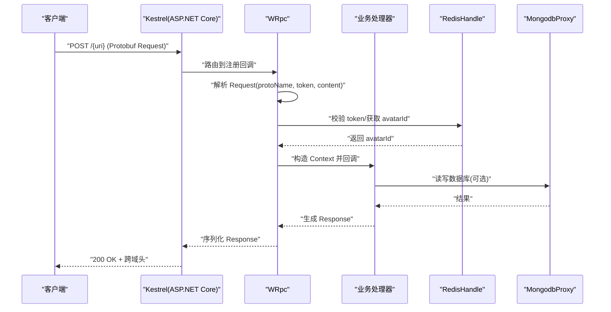
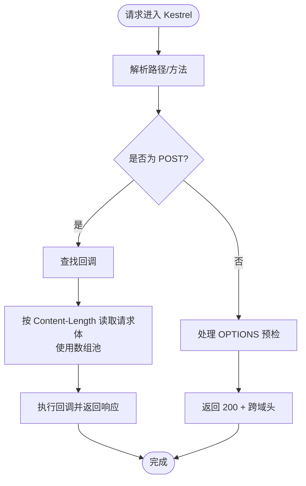
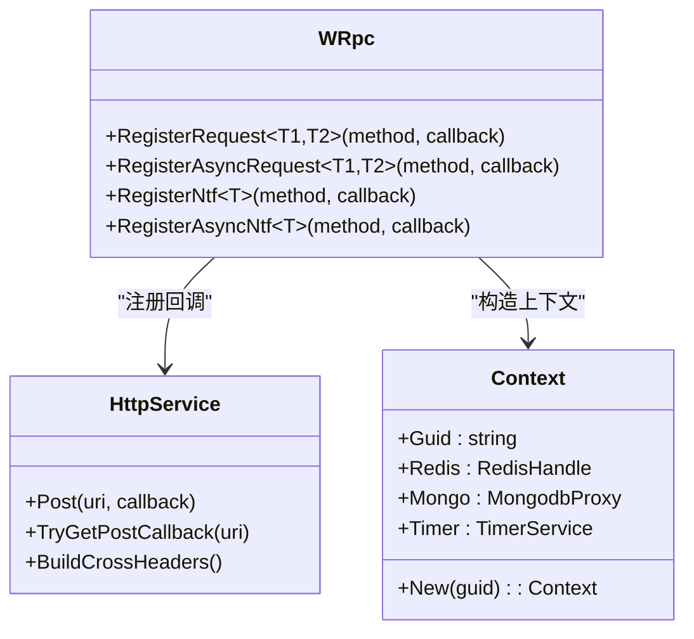
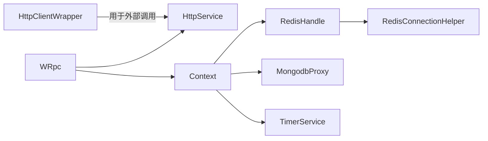

# 网络优化

<cite>
**本文引用的文件**   
- [HttpClientWrapper.cs](file://lgbf/hub/HttpClientWrapper.cs)
- [HttpService.cs](file://lgbf/hub/HttpService.cs)
- [WRpc.cs](file://lgbf/hub/WRpc.cs)
- [Underlying.cs](file://lgbf/hub/Underlying.cs)
- [Context.cs](file://lgbf/hub/Context.cs)
- [Main.cs](file://lgbf/hub/Main.cs)
- [Log.cs](file://lgbf/hub/Log.cs)
- [RedisConnectionHelper.cs](file://lgbf/hub/RedisConnectionHelper.cs)
- [RedisHandle.cs](file://lgbf/hub/RedisHandle.cs)
- [TimerService.cs](file://lgbf/hub/TimerService.cs)
- [Entity.cs](file://lgbf/hub/Entity.cs)
- [EntityMgr.cs](file://lgbf/hub/EntityMgr.cs)
- [MongodbProxy.cs](file://lgbf/hub/MongodbProxy.cs)
- [DbHelper.cs](file://lgbf/hub/DbHelper.cs)
- [Subscribe.cs](file://lgbf/hub/Subscribe.cs)
- [underlying.proto](file://lgbf/underlying/underlying.proto)
- [package.json](file://package.json)
</cite>

## 目录
1. [简介](#简介)
2. [项目结构](#项目结构)
3. [核心组件](#核心组件)
4. [架构总览](#架构总览)
5. [详细组件分析](#详细组件分析)
6. [依赖关系分析](#依赖关系分析)
7. [性能考量与优化建议](#性能考量与优化建议)
8. [故障排查指南](#故障排查指南)
9. [结论](#结论)
10. [附录：网络监控与性能测试方法](#附录网络监控与性能测试方法)

## 简介
本技术指南围绕 LGBF 的网络层与传输优化展开，结合现有代码实现，系统性地给出 HTTP 连接复用与 Keep-Alive 配置、请求合并与批处理策略、传输协议优化（HTTP/2/3、TLS）、WebSocket 连接优化（心跳、断线重连）、CDN 与地理路由、监控与性能测试、带宽利用率优化等实践建议。文档同时提供可视化图示与分层讲解，帮助不同背景读者快速理解与落地。

## 项目结构
LGBF 的网络优化相关代码主要集中在 hub 子项目中，采用“Kestrel + ASP.NET Core”作为 HTTP 服务端，以自定义 RPC 框架封装 Protobuf 请求/响应，配合 Redis 与 MongoDB 实现数据持久化与订阅发布。整体结构如下：

图表来源
- [HttpService.cs:149-181](file://lgbf/hub/HttpService.cs#L149-L181)
- [WRpc.cs:14-45](file://lgbf/hub/WRpc.cs#L14-L45)
- [Context.cs:11-26](file://lgbf/hub/Context.cs#L11-L26)
- [RedisHandle.cs:13-34](file://lgbf/hub/RedisHandle.cs#L13-L34)
- [MongodbProxy.cs:10-23](file://lgbf/hub/MongodbProxy.cs#L10-L23)
- [TimerService.cs:7-35](file://lgbf/hub/TimerService.cs#L7-L35)
- [Main.cs:31-48](file://lgbf/hub/Main.cs#L31-L48)

章节来源
- [HttpService.cs:149-181](file://lgbf/hub/HttpService.cs#L149-L181)
- [WRpc.cs:14-45](file://lgbf/hub/WRpc.cs#L14-L45)
- [Context.cs:11-26](file://lgbf/hub/Context.cs#L11-L26)
- [RedisHandle.cs:13-34](file://lgbf/hub/RedisHandle.cs#L13-L34)
- [MongodbProxy.cs:10-23](file://lgbf/hub/MongodbProxy.cs#L10-L23)
- [TimerService.cs:7-35](file://lgbf/hub/TimerService.cs#L7-L35)
- [Main.cs:31-48](file://lgbf/hub/Main.cs#L31-L48)

## 核心组件
- HTTP 服务端（Kestrel）：负责接收请求、解析路径、路由到对应回调、返回跨域头、限流与 Keep-Alive 超时控制。
- 自定义 RPC 框架（WRpc）：基于 HTTP 的轻量 RPC，使用 Protobuf 序列化，支持同步/异步请求与通知。
- 客户端封装（HttpClientWrapper）：统一的 HTTP 客户端初始化与错误日志记录。
- 数据访问层：RedisHandle（连接管理、锁、列表、发布订阅）、MongodbProxy（批量更新、查询、索引）。
- 上下文（Context）：聚合 Redis、Mongo、Timer 等资源，为业务回调提供统一入口。
- 日志与定时器：Log 提供分级日志；TimerService 提供高精度定时轮询。

章节来源
- [HttpService.cs:117-181](file://lgbf/hub/HttpService.cs#L117-L181)
- [WRpc.cs:6-154](file://lgbf/hub/WRpc.cs#L6-L154)
- [HttpClientWrapper.cs:4-48](file://lgbf/hub/HttpClientWrapper.cs#L4-L48)
- [RedisHandle.cs:13-543](file://lgbf/hub/RedisHandle.cs#L13-L543)
- [MongodbProxy.cs:10-220](file://lgbf/hub/MongodbProxy.cs#L10-L220)
- [Context.cs:4-26](file://lgbf/hub/Context.cs#L4-L26)
- [Log.cs:6-112](file://lgbf/hub/Log.cs#L6-L112)
- [TimerService.cs:7-125](file://lgbf/hub/TimerService.cs#L7-L125)

## 架构总览
LGBF 的网络架构以 Kestrel 为核心，通过 WRpc 将 HTTP 映射为 RPC，消息体采用 Protobuf，上下文 Context 注入 Redis/Mongo/Timer，形成“请求-解析-鉴权-路由-执行-回包”的闭环。

图表来源
- [HttpService.cs:67-103](file://lgbf/hub/HttpService.cs#L67-L103)
- [WRpc.cs:16-96](file://lgbf/hub/WRpc.cs#L16-L96)
- [Context.cs:11-20](file://lgbf/hub/Context.cs#L11-L20)
- [RedisHandle.cs:159-174](file://lgbf/hub/RedisHandle.cs#L159-L174)
- [MongodbProxy.cs:76-120](file://lgbf/hub/MongodbProxy.cs#L76-L120)

## 详细组件分析

### 组件一：HTTP 服务端与连接复用（Kestrel）
- 连接并发限制：最大并发连接数设置为 16384，适合高吞吐场景。
- Keep-Alive 超时：设置为 120 秒，降低长连接维护成本。
- 协议支持：启用 HTTP/1.1 与 HTTP/2；HTTP/3 未在当前实现中启用。
- 跨域支持：OPTIONS 预检返回标准跨域头，简化前端接入。
- 请求体处理：使用数组池（ArrayPool）避免频繁 GC，按长度读取字节流。

图表来源
- [HttpService.cs:50-114](file://lgbf/hub/HttpService.cs#L50-L114)
- [HttpService.cs:149-169](file://lgbf/hub/HttpService.cs#L149-L169)

章节来源
- [HttpService.cs:149-169](file://lgbf/hub/HttpService.cs#L149-L169)
- [HttpService.cs:50-114](file://lgbf/hub/HttpService.cs#L50-L114)

### 组件二：自定义 RPC 框架（WRpc）
- 基于 HTTP 的轻量 RPC：通过 HttpService 注册 URI 回调，统一解析 Protobuf 请求，返回标准化 Response。
- 支持同步/异步请求与通知：RegisterRequest/RegisterAsyncRequest/RegisterNtf/RegisterAsyncNtf。
- 鉴权流程：通过 token 查询 Redis 获取 avatarId，确保请求来源合法。
- 错误处理：捕获异常并返回错误信息，保证接口健壮性。

图表来源
- [WRpc.cs:6-154](file://lgbf/hub/WRpc.cs#L6-L154)
- [HttpService.cs:117-147](file://lgbf/hub/HttpService.cs#L117-L147)
- [Context.cs:4-26](file://lgbf/hub/Context.cs#L4-L26)

章节来源
- [WRpc.cs:6-154](file://lgbf/hub/WRpc.cs#L6-L154)
- [Context.cs:4-26](file://lgbf/hub/Context.cs#L4-L26)

### 组件三：客户端封装（HttpClientWrapper）
- 初始化：设置全局 HttpClient 超时为 3 秒，便于快速失败。
- 请求：支持 GET/POST，GET 可附加自定义头；POST 返回响应并确保成功状态。
- 错误处理：捕获 HttpRequestException 并记录日志，便于定位问题。

章节来源
- [HttpClientWrapper.cs:4-48](file://lgbf/hub/HttpClientWrapper.cs#L4-L48)

### 组件四：数据访问层（Redis/Mongo）
- RedisHandle：提供连接恢复、字符串/列表/有序集合/哈希操作、分布式锁、发布订阅、发布 RPC 请求等能力。
- RedisConnectionHelper：集中配置 keepAlive、connectRetry、connectTimeout 等参数，提升连接稳定性。
- MongodbProxy：提供批量更新、查询、索引创建、计数、删除等操作，支持 BSON 文档直接交互。

章节来源
- [RedisHandle.cs:13-543](file://lgbf/hub/RedisHandle.cs#L13-L543)
- [RedisConnectionHelper.cs:6-143](file://lgbf/hub/RedisConnectionHelper.cs#L6-L143)
- [MongodbProxy.cs:10-220](file://lgbf/hub/MongodbProxy.cs#L10-L220)

### 组件五：实体与锁管理（Entity/EntityMgr）
- Entity：基于 Redis/Mongo 的实体读写代理，支持脏标记与批量落盘。
- EntityMgr：提供加锁/续期/解锁的协作机制，保障多实体并发一致性。

章节来源
- [Entity.cs:31-153](file://lgbf/hub/Entity.cs#L31-L153)
- [EntityMgr.cs:44-126](file://lgbf/hub/EntityMgr.cs#L44-L126)

### 组件六：订阅与通知（Subscribe）
- 基于 Redis 发布订阅的消息转发，按 protoName 解析并回调业务处理函数。

章节来源
- [Subscribe.cs:4-37](file://lgbf/hub/Subscribe.cs#L4-L37)

## 依赖关系分析
- 组件耦合：WRpc 依赖 HttpService 的回调注册；Context 聚合 Redis/Mongo/Timer；RedisHandle/RedisConnectionHelper 提供连接与恢复；MongodbProxy 提供数据库能力。
- 外部依赖：Kestrel（HTTP/1.1+HTTP/2）、Protobuf（序列化）、StackExchange.Redis（Redis）、MongoDB.Driver（MongoDB）。
- 潜在风险：当前未启用 HTTP/3；未见 WebSocket 心跳/断线重连实现；未见请求合并/批处理策略；未见 TLS 加密算法选择配置。

图表来源
- [WRpc.cs:14-45](file://lgbf/hub/WRpc.cs#L14-L45)
- [HttpService.cs:117-147](file://lgbf/hub/HttpService.cs#L117-L147)
- [Context.cs:11-20](file://lgbf/hub/Context.cs#L11-L20)
- [RedisHandle.cs:13-34](file://lgbf/hub/RedisHandle.cs#L13-L34)
- [RedisConnectionHelper.cs:26-33](file://lgbf/hub/RedisConnectionHelper.cs#L26-L33)
- [HttpClientWrapper.cs:6-10](file://lgbf/hub/HttpClientWrapper.cs#L6-L10)

章节来源
- [WRpc.cs:14-45](file://lgbf/hub/WRpc.cs#L14-L45)
- [HttpService.cs:117-147](file://lgbf/hub/HttpService.cs#L117-L147)
- [Context.cs:11-20](file://lgbf/hub/Context.cs#L11-L20)
- [RedisHandle.cs:13-34](file://lgbf/hub/RedisHandle.cs#L13-L34)
- [RedisConnectionHelper.cs:26-33](file://lgbf/hub/RedisConnectionHelper.cs#L26-L33)
- [HttpClientWrapper.cs:6-10](file://lgbf/hub/HttpClientWrapper.cs#L6-L10)

## 性能考量与优化建议

### HTTP 连接复用与 Keep-Alive
- 当前实现
  - Kestrel 最大并发连接：16384
  - Keep-Alive 超时：120 秒
  - 协议：HTTP/1.1 + HTTP/2
- 优化建议
  - 连接池大小：根据 CPU 核数与 QPS 评估，逐步上调至 32768 或更高，观察内存与 FD 使用率。
  - 连接超时：针对长任务可适当延长 Keep-Alive，短任务可缩短以释放资源。
  - HTTP/3：若部署环境支持，启用 HTTP/3 以获得更低延迟与更好的拥塞控制。
  - TLS：启用 TLS1.3，优先使用前向保密曲线（如 X25519、secp256r1），减少握手开销。

章节来源
- [HttpService.cs:154-160](file://lgbf/hub/HttpService.cs#L154-L160)

### 请求合并与批处理策略
- 现状：未见显式请求合并或批处理逻辑。
- 建议
  - 批量 RPC：将多个小请求合并为单次 RPC，减少 RTT；服务端按 protoName 分发。
  - 数据压缩：对大体积 JSON/Protobuf 响应启用 gzip/deflate；客户端支持协商。
  - 写入批处理：参考 MongodbProxy 的批量更新接口，将多次写合并为一次 BulkWrite。

章节来源
- [MongodbProxy.cs:102-120](file://lgbf/hub/MongodbProxy.cs#L102-L120)

### 传输协议优化（HTTP/2/3、TLS）
- 现状：已启用 HTTP/1.1 + HTTP/2。
- 建议
  - HTTP/3：在支持的边缘节点与客户端启用，进一步降低队头阻塞。
  - TLS：优先 ECDHE+AES-GCM 或 ChaCha20-Poly1305，禁用弱密码套件；启用 OCSP Stapling 与 ALPN。

章节来源
- [HttpService.cs:159](file://lgbf/hub/HttpService.cs#L159)

### WebSocket 连接优化（心跳、断线重连）
- 现状：未见 WebSocket 实现。
- 建议
  - 心跳：固定间隔发送 ping，服务端设置超时阈值主动关闭无响应连接。
  - 断线重连：指数退避重连，携带断点续传令牌；服务端维护会话表。
  - 降级策略：网络异常时切换到 HTTP 长轮询或离线缓存。

[本节为概念性建议，不直接分析具体文件]

### CDN、地理路由与负载均衡
- CDN：静态资源走 CDN，动态接口通过就近节点接入。
- 地理路由：基于 IP/ASN 选择最近边缘节点，减少跨域时延。
- 负载均衡：Kubernetes/硬件 LB 结合健康检查与权重，启用连接亲和或会话保持。

[本节为概念性建议，不直接分析具体文件]

### 带宽利用率优化
- TCP 参数：启用 BBR/TCP_NODELAY，合理设置 MSS 与窗口。
- 复用与压缩：HTTP/2 多路复用 + HPACK 压缩头部；启用 HTTP/3。
- 流控与背压：服务端基于队列长度与内存使用动态限速。

[本节为概念性建议，不直接分析具体文件]

## 故障排查指南
- 日志级别：使用 Log 类按等级输出，定位异常与性能瓶颈。
- 关键指标：统计每秒请求数、平均/99 延迟、错误率、连接数、队列长度。
- 常见问题
  - 请求超时：检查 HttpClientWrapper 超时与 Kestrel Keep-Alive 设置。
  - Redis/Mongo 异常：查看连接恢复日志与重试次数。
  - RPC 解析失败：确认 protoName 与 token 校验逻辑。

章节来源
- [Log.cs:6-112](file://lgbf/hub/Log.cs#L6-L112)
- [HttpClientWrapper.cs:14-25](file://lgbf/hub/HttpClientWrapper.cs#L14-L25)
- [RedisConnectionHelper.cs:56-127](file://lgbf/hub/RedisConnectionHelper.cs#L56-L127)

## 结论
LGBF 已具备较为完善的 HTTP/2 服务端与轻量 RPC 能力，结合 Redis/Mongo 的高性能数据访问，可在多数场景下满足低延迟与高吞吐需求。为进一步提升网络性能，建议引入 HTTP/3、TLS 优化、请求合并/批处理、WebSocket 心跳与断线重连、CDN/地理路由与带宽优化策略，并建立完善的监控与压测体系。

## 附录：网络监控与性能测试方法
- 监控指标
  - 请求量、错误率、P50/P95/P99 延迟、连接数、队列深度、GC 次数与暂停时间。
  - Redis/Mongo 命中率、慢查询、连接耗尽告警。
- 性能测试
  - 压测工具：wrk、JMeter、Locust；模拟真实用户行为与突发流量。
  - 关键场景：冷启动、峰值流量、长连接保活、断线重连、热点数据读写。
- 观察与迭代
  - 逐步调整连接池、超时、批处理大小与压缩策略，持续回归测试。

[本节为通用方法总结，不直接分析具体文件]