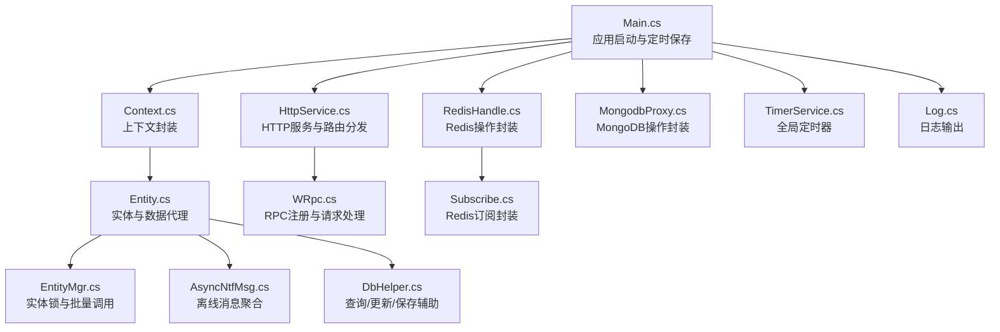
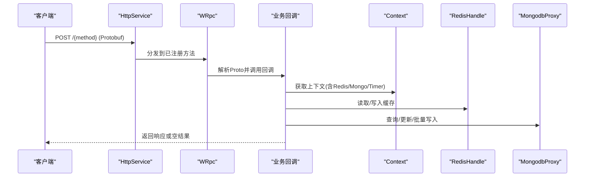
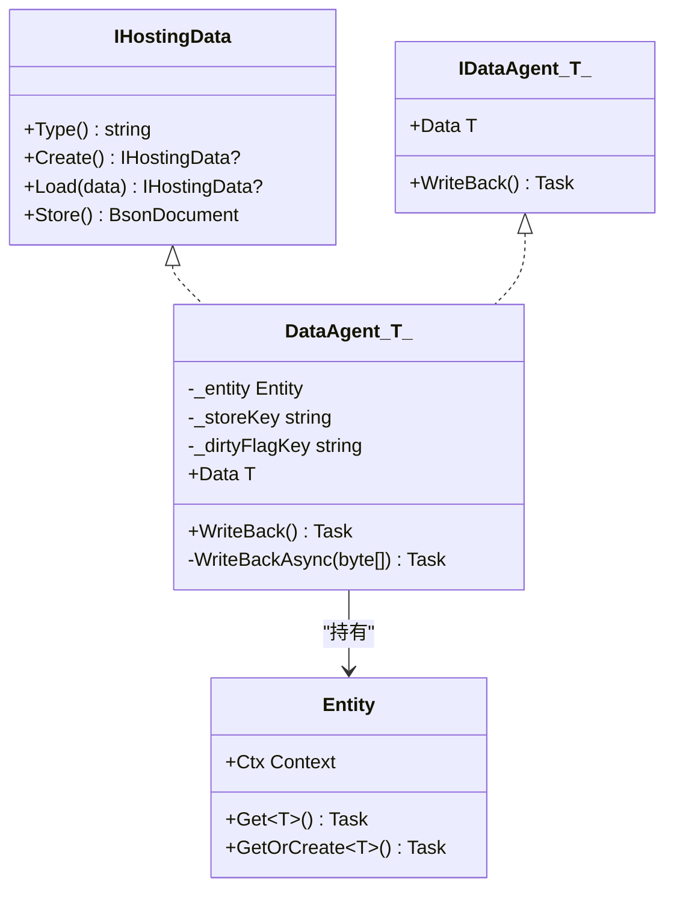
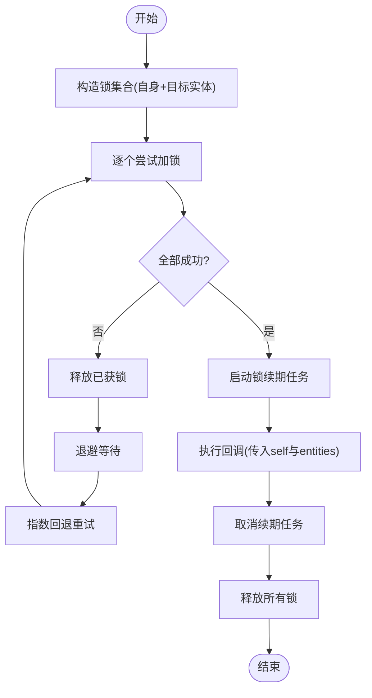
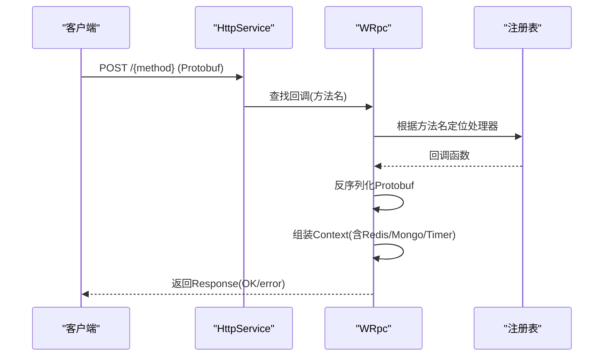
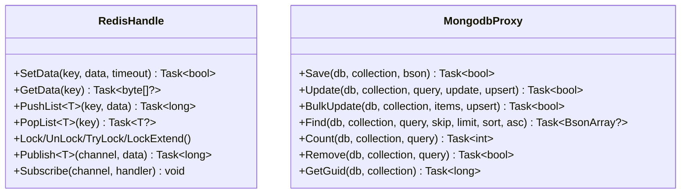
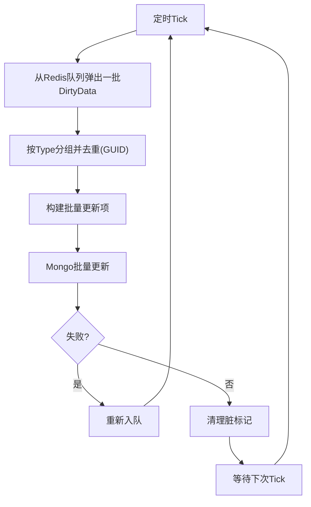
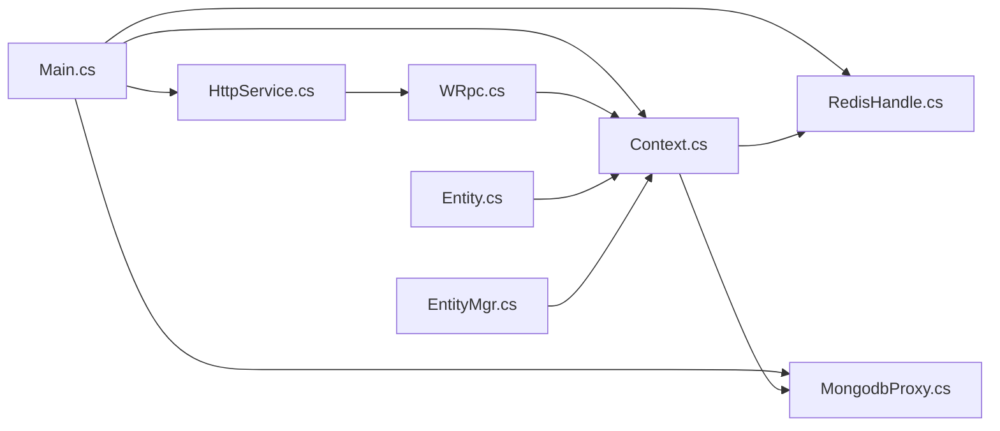

# 扩展开发

<cite>
**本文引用的文件**
- [README.md](file://README.md)
- [Main.cs](file://lgbf/hub/Main.cs)
- [Entity.cs](file://lgbf/hub/Entity.cs)
- [EntityMgr.cs](file://lgbf/hub/EntityMgr.cs)
- [Context.cs](file://lgbf/hub/Context.cs)
- [WRpc.cs](file://lgbf/hub/WRpc.cs)
- [HttpService.cs](file://lgbf/hub/HttpService.cs)
- [TimerService.cs](file://lgbf/hub/TimerService.cs)
- [RedisHandle.cs](file://lgbf/hub/RedisHandle.cs)
- [MongodbProxy.cs](file://lgbf/hub/MongodbProxy.cs)
- [DbHelper.cs](file://lgbf/hub/DbHelper.cs)
- [Log.cs](file://lgbf/hub/Log.cs)
- [Subscribe.cs](file://lgbf/hub/Subscribe.cs)
- [AsyncNtfMsg.cs](file://lgbf/hub/AsyncNtfMsg.cs)
</cite>

## 目录
1. [简介](#简介)
2. [项目结构](#项目结构)
3. [核心组件](#核心组件)
4. [架构总览](#架构总览)
5. [详细组件分析](#详细组件分析)
6. [依赖分析](#依赖分析)
7. [性能考量](#性能考量)
8. [故障排查指南](#故障排查指南)
9. [结论](#结论)
10. [附录：扩展开发流程与示例](#附录扩展开发流程与示例)

## 简介
本指南面向希望在LGBF（轻量级游戏后端框架）之上进行扩展开发的工程师，围绕以下目标展开：
- 如何开发自定义实体：实现IHostingData接口与数据代理IDataAgent<T>，并理解实体生命周期与持久化策略
- 插件系统与扩展点：HTTP RPC路由注册、消息订阅、定时器服务等
- 协议扩展与消息编码：基于Google Protobuf的消息编解码与跨端传输
- 第三方集成：数据库（MongoDB）、缓存（Redis）、外部服务（HTTP客户端包装）
- 版本升级与向后兼容：接口演进与兼容性策略
- 代码规范与最佳实践：命名、异常处理、日志与并发安全
- 测试策略与验证方法：单元测试、集成测试与压测
- 贡献开源：提交流程、分支策略与文档要求

## 项目结构
LGBF后端由C#实现，核心位于lgbf/hub目录，包含启动入口、实体管理、RPC与HTTP服务、缓存与数据库访问、定时器与日志等模块。

图表来源
- [Main.cs:1-159](file://lgbf/hub/Main.cs#L1-L159)
- [Context.cs:1-27](file://lgbf/hub/Context.cs#L1-L27)
- [HttpService.cs:1-182](file://lgbf/hub/HttpService.cs#L1-L182)
- [RedisHandle.cs:1-544](file://lgbf/hub/RedisHandle.cs#L1-L544)
- [MongodbProxy.cs:1-221](file://lgbf/hub/MongodbProxy.cs#L1-L221)
- [Entity.cs:1-154](file://lgbf/hub/Entity.cs#L1-L154)
- [EntityMgr.cs:1-128](file://lgbf/hub/EntityMgr.cs#L1-L128)
- [WRpc.cs:1-155](file://lgbf/hub/WRpc.cs#L1-L155)
- [Subscribe.cs:1-38](file://lgbf/hub/Subscribe.cs#L1-L38)
- [TimerService.cs:1-126](file://lgbf/hub/TimerService.cs#L1-L126)
- [Log.cs:1-113](file://lgbf/hub/Log.cs#L1-L113)
- [AsyncNtfMsg.cs:1-63](file://lgbf/hub/AsyncNtfMsg.cs#L1-L63)
- [DbHelper.cs:1-311](file://lgbf/hub/DbHelper.cs#L1-L311)

章节来源
- [README.md:1-3](file://README.md#L1-L3)
- [Main.cs:1-159](file://lgbf/hub/Main.cs#L1-L159)

## 核心组件
- 应用启动与持久化调度：Main负责初始化Redis与Mongo连接、注册定时保存任务，并启动HTTP服务
- 实体与数据代理：IHostingData定义实体契约，DataAgent<T>负责写回与脏标记；Entity提供Get/GetOrCreate能力
- 上下文Context：统一注入Redis、Mongo、Timer等资源
- HTTP/RPC：HttpService提供路由分发，WRpc基于HTTP实现Proto消息的请求/通知/异步请求
- 缓存与数据库：RedisHandle封装常用操作；MongodbProxy提供批量更新、查询、计数等
- 定时器：TimerService单例全局定时器，支持多种时间粒度
- 日志与错误处理：Log统一输出；各组件对Redis超时等异常进行恢复重试

章节来源
- [Main.cs:1-159](file://lgbf/hub/Main.cs#L1-L159)
- [Entity.cs:1-154](file://lgbf/hub/Entity.cs#L1-L154)
- [Context.cs:1-27](file://lgbf/hub/Context.cs#L1-L27)
- [WRpc.cs:1-155](file://lgbf/hub/WRpc.cs#L1-L155)
- [HttpService.cs:1-182](file://lgbf/hub/HttpService.cs#L1-L182)
- [RedisHandle.cs:1-544](file://lgbf/hub/RedisHandle.cs#L1-L544)
- [MongodbProxy.cs:1-221](file://lgbf/hub/MongodbProxy.cs#L1-L221)
- [TimerService.cs:1-126](file://lgbf/hub/TimerService.cs#L1-L126)
- [Log.cs:1-113](file://lgbf/hub/Log.cs#L1-L113)

## 架构总览
LGBF采用“HTTP + Protobuf + Redis + MongoDB”的组合架构：
- 外部客户端通过HTTP POST调用WRpc注册的方法名，消息以Protobuf序列化
- 服务端解析Proto，按方法名路由到对应回调，回调中使用Context访问Redis/Mongo/Timer
- 实体数据以BSON形式存储于MongoDB，Redis作为缓存与脏页队列
- 定时器周期性触发批量落盘，保证最终一致性

图表来源
- [HttpService.cs:40-115](file://lgbf/hub/HttpService.cs#L40-L115)
- [WRpc.cs:14-97](file://lgbf/hub/WRpc.cs#L14-L97)
- [Context.cs:4-26](file://lgbf/hub/Context.cs#L4-L26)
- [RedisHandle.cs:84-136](file://lgbf/hub/RedisHandle.cs#L84-L136)
- [MongodbProxy.cs:76-120](file://lgbf/hub/MongodbProxy.cs#L76-L120)

## 详细组件分析

### 实体与数据代理（IHostingData 与 IDataAgent<T>）
- IHostingData定义实体类型标识、创建、加载与存储契约
- DataAgent<T>负责将实体数据写回Redis并设置脏标记，随后推入待落盘队列
- Entity提供Get/GetOrCreate，优先从Redis读取，缺失则回源MongoDB并回填Redis

图表来源
- [Entity.cs:4-29](file://lgbf/hub/Entity.cs#L4-L29)
- [Entity.cs:37-92](file://lgbf/hub/Entity.cs#L37-L92)
- [Entity.cs:94-153](file://lgbf/hub/Entity.cs#L94-L153)

章节来源
- [Entity.cs:1-154](file://lgbf/hub/Entity.cs#L1-L154)

### 实体锁与批量调用（EntityMgr）
- 支持对多个实体加锁，避免并发冲突
- 提供可重试与锁续期机制，回调执行期间自动续租锁
- 最终释放所有锁，保证一致性

图表来源
- [EntityMgr.cs:44-126](file://lgbf/hub/EntityMgr.cs#L44-L126)

章节来源
- [EntityMgr.cs:1-128](file://lgbf/hub/EntityMgr.cs#L1-L128)

### HTTP服务与RPC（HttpService 与 WRpc）
- HttpService基于Kestrel，按路径前缀分发POST请求
- WRpc将HTTP请求映射为Protobuf消息，按方法名路由到注册回调
- 支持同步/异步通知与请求，统一返回Response结构

图表来源
- [HttpService.cs:64-113](file://lgbf/hub/HttpService.cs#L64-L113)
- [WRpc.cs:14-97](file://lgbf/hub/WRpc.cs#L14-L97)

章节来源
- [HttpService.cs:1-182](file://lgbf/hub/HttpService.cs#L1-L182)
- [WRpc.cs:1-155](file://lgbf/hub/WRpc.cs#L1-L155)

### 缓存与数据库（RedisHandle 与 MongodbProxy）
- RedisHandle提供键值、列表、有序集、哈希、分布式锁等操作，并内置超时异常恢复
- MongodbProxy提供插入、更新、批量更新、查询、计数、删除与自增Guid等

图表来源
- [RedisHandle.cs:84-303](file://lgbf/hub/RedisHandle.cs#L84-L303)
- [MongodbProxy.cs:76-220](file://lgbf/hub/MongodbProxy.cs#L76-L220)

章节来源
- [RedisHandle.cs:1-544](file://lgbf/hub/RedisHandle.cs#L1-L544)
- [MongodbProxy.cs:1-221](file://lgbf/hub/MongodbProxy.cs#L1-L221)

### 定时器与持久化（TimerService 与 Main）
- TimerService提供全局单例定时器，周期轮询各类定时任务
- Main注册周期性保存任务，从Redis队列取出脏页，按实体类型分组批量更新MongoDB

图表来源
- [TimerService.cs:68-96](file://lgbf/hub/TimerService.cs#L68-L96)
- [Main.cs:50-157](file://lgbf/hub/Main.cs#L50-L157)

章节来源
- [TimerService.cs:1-126](file://lgbf/hub/TimerService.cs#L1-L126)
- [Main.cs:1-159](file://lgbf/hub/Main.cs#L1-L159)

### 离线消息与订阅（AsyncNtfMsg 与 Subscribe）
- AsyncNtfMsg用于聚合离线消息，实体层可追加消息并在落盘后发送
- Subscribe封装Redis频道订阅，按Protobuf消息类型反序列化并回调

章节来源
- [AsyncNtfMsg.cs:1-63](file://lgbf/hub/AsyncNtfMsg.cs#L1-L63)
- [Subscribe.cs:1-38](file://lgbf/hub/Subscribe.cs#L1-L38)

## 依赖分析
- 模块内聚与耦合
  - Main集中协调Redis/Mongo/HTTP/定时器，承担“应用总控”职责
  - Entity/EntityMgr与Redis/Mongo紧密耦合，但通过Context抽象降低直接依赖
  - WRpc与HttpService强绑定，形成清晰的协议层
- 外部依赖
  - StackExchange.Redis、MongoDB.Driver、Google.Protobuf、Kestrel
- 循环依赖风险
  - 当前未见循环引用；若新增实体类型需避免在IHostingData实现中直接依赖Main

图表来源
- [Main.cs:1-159](file://lgbf/hub/Main.cs#L1-L159)
- [Context.cs:1-27](file://lgbf/hub/Context.cs#L1-L27)
- [HttpService.cs:1-182](file://lgbf/hub/HttpService.cs#L1-L182)
- [WRpc.cs:1-155](file://lgbf/hub/WRpc.cs#L1-L155)
- [Entity.cs:1-154](file://lgbf/hub/Entity.cs#L1-L154)
- [EntityMgr.cs:1-128](file://lgbf/hub/EntityMgr.cs#L1-L128)
- [RedisHandle.cs:1-544](file://lgbf/hub/RedisHandle.cs#L1-L544)
- [MongodbProxy.cs:1-221](file://lgbf/hub/MongodbProxy.cs#L1-L221)

## 性能考量
- 连接池与并发
  - Kestrel限制最大并发连接数，合理配置以匹配硬件
  - Redis/Mongo均采用异步API，注意避免阻塞调用
- 写放大与批量
  - 使用批量更新减少网络往返；按实体类型分组提升命中率
- 缓存策略
  - 读多写少场景优先命中Redis；写回后设置脏标记并入队，避免频繁落盘
- 锁竞争
  - 将锁范围最小化，缩短锁持有时间；利用续期任务降低锁过期风险

## 故障排查指南
- 常见问题
  - Redis超时：检查网络与连接参数，确认Recover逻辑生效
  - Mongo批量写入失败：查看队列重入与日志，定位具体实体类型
  - Protobuf解析异常：核对方法名注册与消息定义一致性
  - 实体锁失败：排查锁超时与重试策略
- 日志定位
  - 使用Log.Err输出异常堆栈与上下文信息
  - HttpService统计每秒消息量，便于发现异常峰值

章节来源
- [RedisHandle.cs:27-54](file://lgbf/hub/RedisHandle.cs#L27-L54)
- [Main.cs:50-157](file://lgbf/hub/Main.cs#L50-L157)
- [WRpc.cs:38-44](file://lgbf/hub/WRpc.cs#L38-L44)
- [EntityMgr.cs:20-42](file://lgbf/hub/EntityMgr.cs#L20-L42)
- [Log.cs:55-58](file://lgbf/hub/Log.cs#L55-L58)
- [HttpService.cs:47-62](file://lgbf/hub/HttpService.cs#L47-L62)

## 结论
LGBF提供了清晰的扩展点与稳定的运行时环境。开发者可通过实现IHostingData与WRpc注册方法快速扩展业务能力；通过Redis/Mongo的高可用封装与定时器机制，保障数据一致性和性能。遵循本文的规范与最佳实践，可在不破坏向后兼容的前提下持续迭代。

## 附录：扩展开发流程与示例

### 开发自定义实体（IHostingData）
- 步骤
  - 定义实体类型字符串与静态工厂方法
  - 实现Load/Store，确保BSON可序列化
  - 在需要时提供默认值或初始化逻辑
- 数据代理
  - 通过Entity.GetOrCreate获取/创建实体
  - 修改数据后调用DataAgent<T>.WriteBack触发写回与入队
- 示例参考
  - [AsyncNtfMsg.cs:8-48](file://lgbf/hub/AsyncNtfMsg.cs#L8-L48)
  - [Entity.cs:104-153](file://lgbf/hub/Entity.cs#L104-L153)

章节来源
- [Entity.cs:4-29](file://lgbf/hub/Entity.cs#L4-L29)
- [Entity.cs:104-153](file://lgbf/hub/Entity.cs#L104-L153)
- [AsyncNtfMsg.cs:1-63](file://lgbf/hub/AsyncNtfMsg.cs#L1-L63)

### 自定义消息编码与协议扩展（WRpc）
- 步骤
  - 在服务端通过WRpc.RegisterRequest/RegisterNtf/RegisterAsyncRequest注册方法
  - 客户端以Protobuf序列化消息，POST到对应URI
  - 回调中使用Context访问Redis/Mongo/Timer
- 示例参考
  - [WRpc.cs:47-125](file://lgbf/hub/WRpc.cs#L47-L125)
  - [HttpService.cs:139-147](file://lgbf/hub/HttpService.cs#L139-L147)

章节来源
- [WRpc.cs:1-155](file://lgbf/hub/WRpc.cs#L1-L155)
- [HttpService.cs:1-182](file://lgbf/hub/HttpService.cs#L1-L182)

### 第三方集成（数据库、缓存、外部服务）
- Redis
  - 使用RedisHandle提供的键值、列表、有序集、哈希、锁等操作
  - 注意超时异常的恢复与重试
- MongoDB
  - 使用MongodbProxy的批量更新、查询、计数、删除等
  - 需要唯一索引时调用CreateIndex
- HTTP客户端
  - 可复用HttpClientWrapper（如存在）或直接使用标准HTTP客户端
  - 对外服务调用应设置超时与重试策略

章节来源
- [RedisHandle.cs:84-303](file://lgbf/hub/RedisHandle.cs#L84-L303)
- [MongodbProxy.cs:35-120](file://lgbf/hub/MongodbProxy.cs#L35-L120)

### 版本升级与向后兼容
- 接口演进
  - 新增字段建议保持默认值，避免破坏旧数据Load
  - Protobuf字段建议使用可选语义，避免破坏旧版本序列化
- 兼容策略
  - 保留旧方法名一段时间，逐步迁移客户端
  - 对Mongo索引变更采用幂等脚本，避免重复创建

### 代码规范与最佳实践
- 命名
  - 类型与方法使用PascalCase；常量使用PascalCase
- 异常处理
  - 对外接口捕获并记录异常，返回统一错误响应
- 并发安全
  - 使用Interlocked/Volatile保护共享状态
  - 合理使用锁与原子操作
- 日志
  - 使用Log统一输出，包含时间戳、级别与调用栈信息

章节来源
- [Log.cs:19-58](file://lgbf/hub/Log.cs#L19-L58)
- [Main.cs:62-157](file://lgbf/hub/Main.cs#L62-L157)

### 测试策略与验证方法
- 单元测试
  - 针对DbHelper与实体Load/Store进行单元测试
  - Mock Redis/Mongo，验证查询/更新逻辑
- 集成测试
  - 启动完整服务，验证WRpc路由与实体持久化链路
- 压测
  - 使用高并发POST请求验证HTTP吞吐与Redis/Mongo瓶颈
  - 关注定时保存任务的批量更新性能

### 贡献代码到开源项目
- 分支策略
  - 基于develop分支创建功能分支，完成后发起Pull Request
- 文档要求
  - 补充README或内部文档说明新功能与配置项
- 提交流程
  - 本地测试通过后提交，确保CI通过