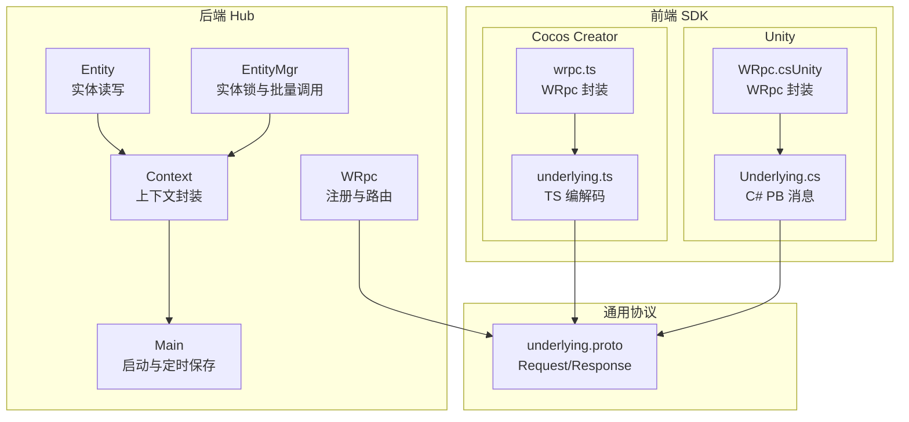
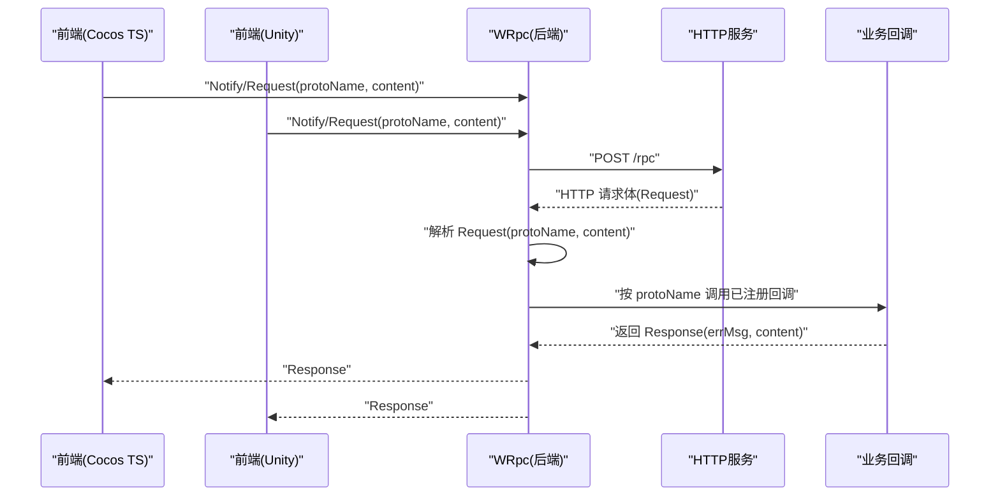
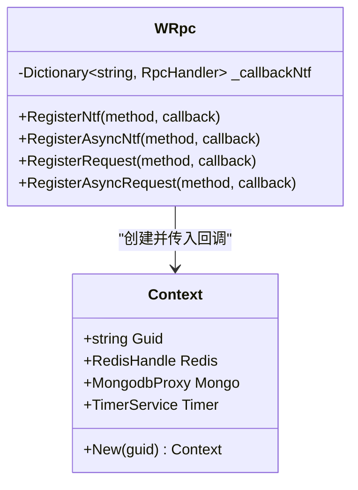
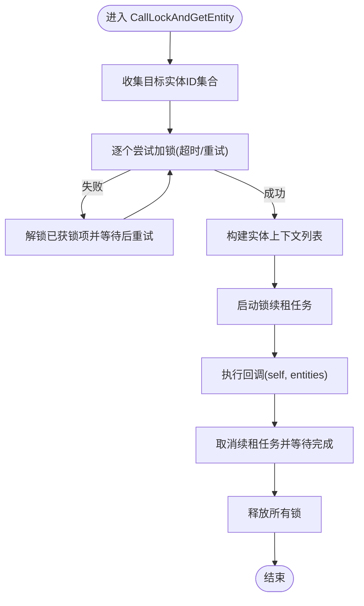
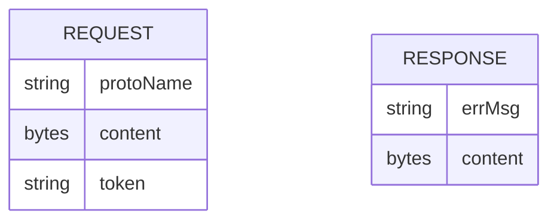
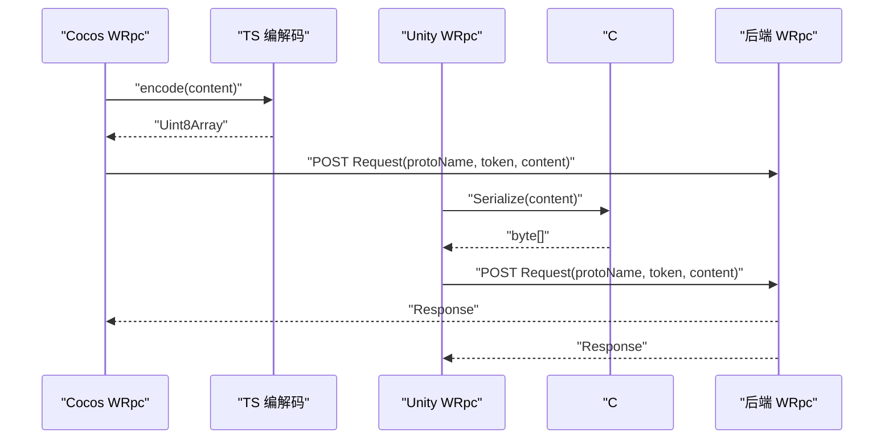
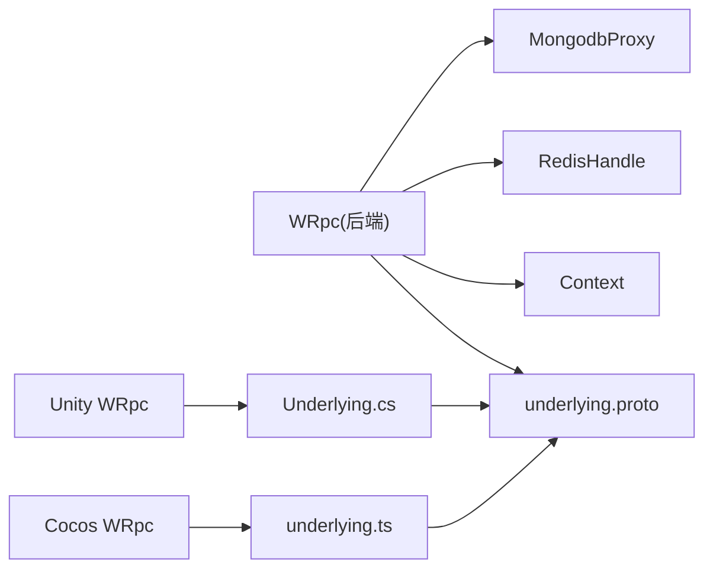

# 插件系统

<cite>
**本文引用的文件**
- [WRpc.cs](file://lgbf/hub/WRpc.cs)
- [Main.cs](file://lgbf/hub/Main.cs)
- [Context.cs](file://lgbf/hub/Context.cs)
- [Entity.cs](file://lgbf/hub/Entity.cs)
- [EntityMgr.cs](file://lgbf/hub/EntityMgr.cs)
- [underlying.proto](file://lgbf/underlying/underlying.proto)
- [underlying.ts](file://gem/ccc/assets/script/ServerSDK/underlying.ts)
- [wrpc.ts](file://gem/ccc/assets/script/ServerSDK/wrpc.ts)
- [Underlying.cs](file://gem/unity/Assets/Script/ServerSDK/Underlying.cs)
- [WRpc.cs（Unity）](file://gem/unity/Assets/Script/NetDriver/WRpc.cs)
- [README.md](file://README.md)
</cite>

## 目录
1. [简介](#简介)
2. [项目结构](#项目结构)
3. [核心组件](#核心组件)
4. [架构总览](#架构总览)
5. [组件详解](#组件详解)
6. [依赖关系分析](#依赖关系分析)
7. [性能考量](#性能考量)
8. [故障排查指南](#故障排查指南)
9. [结论](#结论)
10. [附录：插件开发全流程示例](#附录插件开发全流程示例)

## 简介
本文件系统性阐述 LGBF 插件系统的架构与扩展点，重点覆盖以下主题：
- 消息编码器的自定义实现与协议扩展机制
- WRpc 通信框架的插件化设计：消息序列化、反序列化与传输层扩展
- Protocol Buffers 协议的自定义字段添加与版本兼容策略
- 前端 SDK 的插件化集成：Cocos Creator 与 Unity 的扩展开发
- 完整插件开发示例：从接口定义到实现与部署
- 插件测试与调试实用技巧

## 项目结构
LGBF 采用分层与功能模块结合的组织方式：
- 后端 Hub 层：提供 RPC 注册、上下文管理、实体数据持久化与锁控制等能力
- 通用底层协议：基于 Protocol Buffers 的 Request/Response 模型
- 前端 SDK：分别在 Cocos Creator 与 Unity 提供 WRpc 封装与底层消息编解码

图表来源
- [WRpc.cs:1-155](file://lgbf/hub/WRpc.cs#L1-L155)
- [Context.cs:1-27](file://lgbf/hub/Context.cs#L1-L27)
- [Entity.cs:1-154](file://lgbf/hub/Entity.cs#L1-L154)
- [EntityMgr.cs:1-128](file://lgbf/hub/EntityMgr.cs#L1-L128)
- [Main.cs:1-159](file://lgbf/hub/Main.cs#L1-L159)
- [underlying.proto:1-12](file://lgbf/underlying/underlying.proto#L1-L12)
- [underlying.ts:1-240](file://gem/ccc/assets/script/ServerSDK/underlying.ts#L1-L240)
- [wrpc.ts:1-102](file://gem/ccc/assets/script/ServerSDK/wrpc.ts#L1-L102)
- [Underlying.cs:1-550](file://gem/unity/Assets/Script/ServerSDK/Underlying.cs#L1-L550)
- [WRpc.cs（Unity）:1-129](file://gem/unity/Assets/Script/NetDriver/WRpc.cs#L1-L129)

章节来源
- [README.md:1-3](file://README.md#L1-L3)
- [Main.cs:31-48](file://lgbf/hub/Main.cs#L31-L48)

## 核心组件
- WRpc：后端 HTTP 入口，负责将请求解析为具体协议消息，并按方法名路由到已注册回调；统一返回 Response 结构
- Context：封装当前调用上下文（用户标识、Redis/Mongo/Timers 访问入口）
- Entity/EntityMgr：实体数据的读取、创建、写回与分布式锁控制
- Protocol Buffers 底层协议：Request/Response 作为跨语言传输载体
- 前端 WRpc 封装：Cocos Creator 与 Unity 分别提供类型安全的 WRpc 调用封装与编解码

章节来源
- [WRpc.cs:6-154](file://lgbf/hub/WRpc.cs#L6-L154)
- [Context.cs:4-26](file://lgbf/hub/Context.cs#L4-L26)
- [Entity.cs:31-153](file://lgbf/hub/Entity.cs#L31-L153)
- [EntityMgr.cs:44-126](file://lgbf/hub/EntityMgr.cs#L44-L126)
- [underlying.proto:3-12](file://lgbf/underlying/underlying.proto#L3-L12)

## 架构总览
WRpc 通过 HTTP 接收前端请求，使用底层协议进行解包，再根据 protoName 路由到对应注册的处理器。处理器可同步或异步返回结果，最终统一以 Response 返回。

图表来源
- [wrpc.ts:21-102](file://gem/ccc/assets/script/ServerSDK/wrpc.ts#L21-L102)
- [WRpc.cs（Unity）:21-129](file://gem/unity/Assets/Script/NetDriver/WRpc.cs#L21-L129)
- [WRpc.cs:14-153](file://lgbf/hub/WRpc.cs#L14-L153)
- [underlying.proto:3-12](file://lgbf/underlying/underlying.proto#L3-L12)

## 组件详解

### WRpc：消息路由与响应统一
- 注册能力
  - 支持通知类回调 RegisterNtf/RegisterAsyncNtf
  - 支持请求-响应回调 RegisterRequest/RegisterAsyncRequest
- 解析与路由
  - 使用底层协议解析 Request，提取 protoName 与 content
  - 通过字典映射 protoName 到回调函数
- 上下文注入
  - 回调入参自动注入 Context.New(avatarId)，其中 avatarId 来自 Redis 查询 token 映射
- 统一响应
  - 所有回调最终构造 Response，包含 errMsg 与 content 字段

图表来源
- [WRpc.cs:47-153](file://lgbf/hub/WRpc.cs#L47-L153)
- [Context.cs:11-20](file://lgbf/hub/Context.cs#L11-L20)

章节来源
- [WRpc.cs:14-153](file://lgbf/hub/WRpc.cs#L14-L153)
- [Context.cs:11-20](file://lgbf/hub/Context.cs#L11-L20)

### Context：统一上下文访问
- 提供当前调用的用户标识 Guid
- 暴露 Redis、Mongo、TimerService 等基础设施访问入口
- New(guid) 工厂方法用于创建上下文实例

章节来源
- [Context.cs:4-26](file://lgbf/hub/Context.cs#L4-L26)

### Entity/EntityMgr：实体数据与锁控制
- Entity
  - Get<T>/GetOrCreate<T>：从 Redis/Mongo 加载或创建实体数据代理
  - 写回时将 BSON 数据写入 Redis，并标记脏标志与入队持久化
- EntityMgr
  - CallLockAndGetEntity：对多个实体加分布式锁，执行回调后再解锁
  - 锁续租与重试机制，保证并发安全

图表来源
- [EntityMgr.cs:44-126](file://lgbf/hub/EntityMgr.cs#L44-L126)

章节来源
- [Entity.cs:94-153](file://lgbf/hub/Entity.cs#L94-L153)
- [EntityMgr.cs:44-126](file://lgbf/hub/EntityMgr.cs#L44-L126)

### Protocol Buffers 协议与扩展
- 基础模型
  - Request：包含 protoName、content、token
  - Response：包含 errMsg、content
- 前端编解码
  - Cocos Creator：underlying.ts 提供 TS 版本的 Request/Response 编解码
  - Unity：Underlying.cs 提供 C# 版本的 PB 消息定义
- 扩展机制
  - 新增业务消息：在各自前端 SDK 中生成对应消息定义
  - 后端注册：WRpc.RegisterRequest/Notify 对应 protoName 与消息类型
  - 版本兼容：通过 protoName 区分不同版本的消息契约，content 保持向后兼容字段

图表来源
- [underlying.proto:3-12](file://lgbf/underlying/underlying.proto#L3-L12)

章节来源
- [underlying.proto:1-12](file://lgbf/underlying/underlying.proto#L1-L12)
- [underlying.ts:12-21](file://gem/ccc/assets/script/ServerSDK/underlying.ts#L12-L21)
- [Underlying.cs:40-120](file://gem/unity/Assets/Script/ServerSDK/Underlying.cs#L40-L120)

### 前端 SDK 集成与插件化
- Cocos Creator
  - wrpc.ts：提供 WRpc 类，支持 Notify 与 Request，内部使用 underlying.ts 编解码
  - 可替换编解码器：WRpcCodec<T> 仅依赖 encode/decode 两个方法，便于替换为自定义编解码实现
- Unity
  - WRpc.cs（Unity）：提供类型安全的 WRpc 封装，内部使用 Google.Protobuf
  - Underlying.cs：PB 生成的 Request/Response 类型

图表来源
- [wrpc.ts:21-52](file://gem/ccc/assets/script/ServerSDK/wrpc.ts#L21-L52)
- [underlying.ts:27-113](file://gem/ccc/assets/script/ServerSDK/underlying.ts#L27-L113)
- [WRpc.cs（Unity）:21-126](file://gem/unity/Assets/Script/NetDriver/WRpc.cs#L21-L126)
- [Underlying.cs:40-120](file://gem/unity/Assets/Script/ServerSDK/Underlying.cs#L40-L120)

章节来源
- [wrpc.ts:1-102](file://gem/ccc/assets/script/ServerSDK/wrpc.ts#L1-L102)
- [underlying.ts:1-240](file://gem/ccc/assets/script/ServerSDK/underlying.ts#L1-L240)
- [WRpc.cs（Unity）:1-129](file://gem/unity/Assets/Script/NetDriver/WRpc.cs#L1-L129)
- [Underlying.cs:1-550](file://gem/unity/Assets/Script/ServerSDK/Underlying.cs#L1-L550)

## 依赖关系分析
- 后端 WRpc 依赖底层协议与 HTTP 服务，回调中可直接使用 Context 注入的 Redis/Mongo/Timers
- 前端 SDK 依赖各自语言的 PB 编解码库，通过统一的 Request/Response 进行通信
- Entity/EntityMgr 依赖 Redis 与 Mongo，实现数据一致性与并发控制

图表来源
- [WRpc.cs:1-155](file://lgbf/hub/WRpc.cs#L1-L155)
- [underlying.proto:1-12](file://lgbf/underlying/underlying.proto#L1-L12)
- [underlying.ts:1-240](file://gem/ccc/assets/script/ServerSDK/underlying.ts#L1-L240)
- [Underlying.cs:1-550](file://gem/unity/Assets/Script/ServerSDK/Underlying.cs#L1-L550)

章节来源
- [WRpc.cs:1-155](file://lgbf/hub/WRpc.cs#L1-L155)
- [underlying.proto:1-12](file://lgbf/underlying/underlying.proto#L1-L12)

## 性能考量
- 写回批处理与延迟入队：Entity 写回先写 Redis，再设置脏标志并入队，后台定时批量写入 Mongo，降低写放大
- 定时器与锁续租：EntityMgr 在回调执行期间持续续租锁，避免长时间持有锁导致阻塞
- WRpc 回调统一返回：减少异常路径的额外开销，便于统一错误处理

章节来源
- [Entity.cs:52-91](file://lgbf/hub/Entity.cs#L52-L91)
- [EntityMgr.cs:20-42](file://lgbf/hub/EntityMgr.cs#L20-L42)
- [WRpc.cs:52-153](file://lgbf/hub/WRpc.cs#L52-L153)

## 故障排查指南
- 常见错误
  - 空响应体：检查前端网络请求是否成功，确认后端 Response 是否正确返回
  - 未知 protoName：确认 WRpc.Register* 是否已注册对应方法名
  - token 映射失败：确认 Redis 中 token 到 avatarId 的映射是否存在
  - 并发锁失败：关注 EntityMgr 的锁重试与续租日志
- 调试建议
  - 启用后端日志记录 WRpc 异常与错误信息
  - 前端捕获 WRpcError 并输出详细错误栈
  - 使用最小化消息体复现问题，逐步加入字段定位兼容性问题

章节来源
- [WRpc.cs:18-44](file://lgbf/hub/WRpc.cs#L18-L44)
- [wrpc.ts:70-100](file://gem/ccc/assets/script/ServerSDK/wrpc.ts#L70-L100)
- [WRpc.cs（Unity）:70-82](file://gem/unity/Assets/Script/NetDriver/WRpc.cs#L70-L82)

## 结论
LGBF 插件系统以“统一协议 + 可插拔编解码 + 可扩展路由”为核心设计思想，通过 WRpc 的注册机制与 Context 的上下文注入，实现了前后端一致的扩展体验。配合 Entity/EntityMgr 的数据一致性与并发控制，以及前端 SDK 的类型安全封装，能够快速构建稳定、可维护的插件生态。

## 附录：插件开发全流程示例

### 步骤一：定义业务协议消息
- Cocos Creator
  - 在前端 SDK 中新增消息定义（例如生成新的 TS 消息类型）
  - 使用 underlying.ts 的编解码器进行 encode/decode
- Unity
  - 在前端 SDK 中新增消息定义（例如生成新的 C# PB 消息类型）
  - 使用 Underlying.cs 的 Request/Response 进行序列化

章节来源
- [underlying.ts:12-21](file://gem/ccc/assets/script/ServerSDK/underlying.ts#L12-L21)
- [Underlying.cs:40-120](file://gem/unity/Assets/Script/ServerSDK/Underlying.cs#L40-L120)

### 步骤二：后端注册与实现
- 后端 WRpc 注册
  - 选择 RegisterNtf/RegisterAsyncNtf 或 RegisterRequest/RegisterAsyncRequest
  - 回调中使用 Context.New(avatarId) 获取 Redis/Mongo/Timers
- 实现业务逻辑
  - 读取/写入 Entity 数据
  - 处理异常并返回统一 Response

章节来源
- [WRpc.cs:47-153](file://lgbf/hub/WRpc.cs#L47-L153)
- [Context.cs:11-20](file://lgbf/hub/Context.cs#L11-L20)
- [Entity.cs:94-153](file://lgbf/hub/Entity.cs#L94-L153)

### 步骤三：前端调用与编解码替换
- Cocos Creator
  - 使用 wrpc.ts 的 WRpc 类进行 Notify/Request
  - 若需自定义编解码，实现 WRpcCodec<T> 接口并传入对应方法
- Unity
  - 使用 WRpc.cs（Unity）的 WRpc 类进行 Notify/Request
  - 使用 Google.Protobuf 进行消息序列化

章节来源
- [wrpc.ts:21-52](file://gem/ccc/assets/script/ServerSDK/wrpc.ts#L21-L52)
- [WRpc.cs（Unity）:21-126](file://gem/unity/Assets/Script/NetDriver/WRpc.cs#L21-L126)

### 步骤四：版本兼容与协议演进
- 新增字段
  - 在前端 SDK 生成新消息定义
  - 后端 WRpc.Register* 注册新 protoName
- 兼容策略
  - 通过 protoName 区分版本，content 保留旧字段
  - 旧客户端仍可使用旧 protoName，新客户端使用新 protoName

章节来源
- [underlying.proto:3-12](file://lgbf/underlying/underlying.proto#L3-L12)

### 步骤五：测试与调试
- 单元测试
  - 使用前端 SDK 发送最小化消息，验证后端 WRpc 路由与回调
- 集成测试
  - 搭建本地 Redis/Mongo，模拟多客户端并发场景
- 调试技巧
  - 后端开启详细日志，前端捕获 WRpcError 并打印错误详情
  - 使用抓包工具观察 Request/Response 的内容与状态码

章节来源
- [WRpc.cs:18-44](file://lgbf/hub/WRpc.cs#L18-L44)
- [wrpc.ts:70-100](file://gem/ccc/assets/script/ServerSDK/wrpc.ts#L70-L100)
- [WRpc.cs（Unity）:70-82](file://gem/unity/Assets/Script/NetDriver/WRpc.cs#L70-L82)