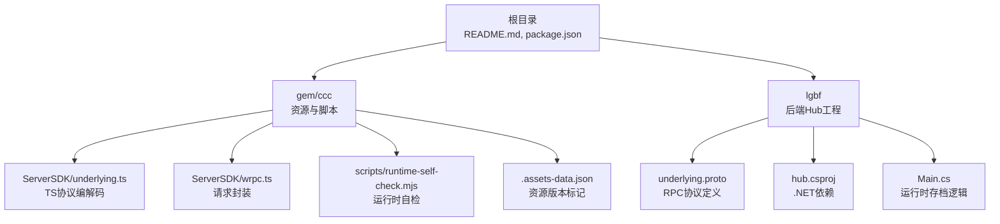
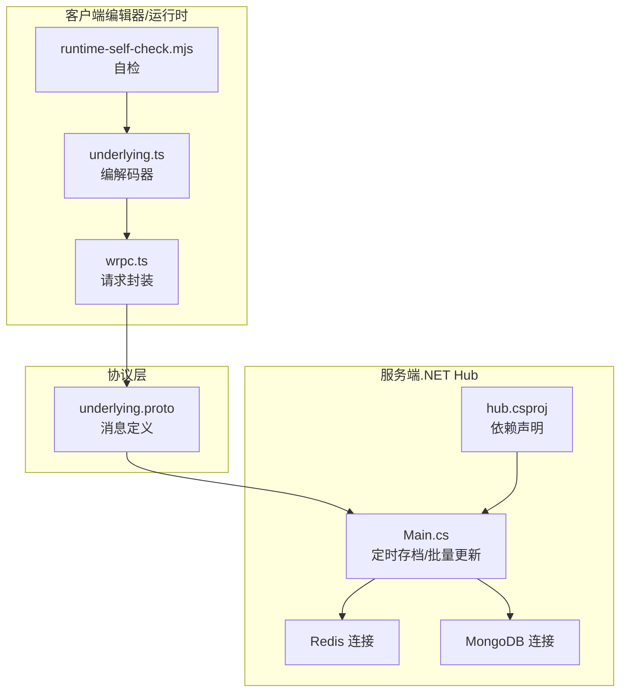
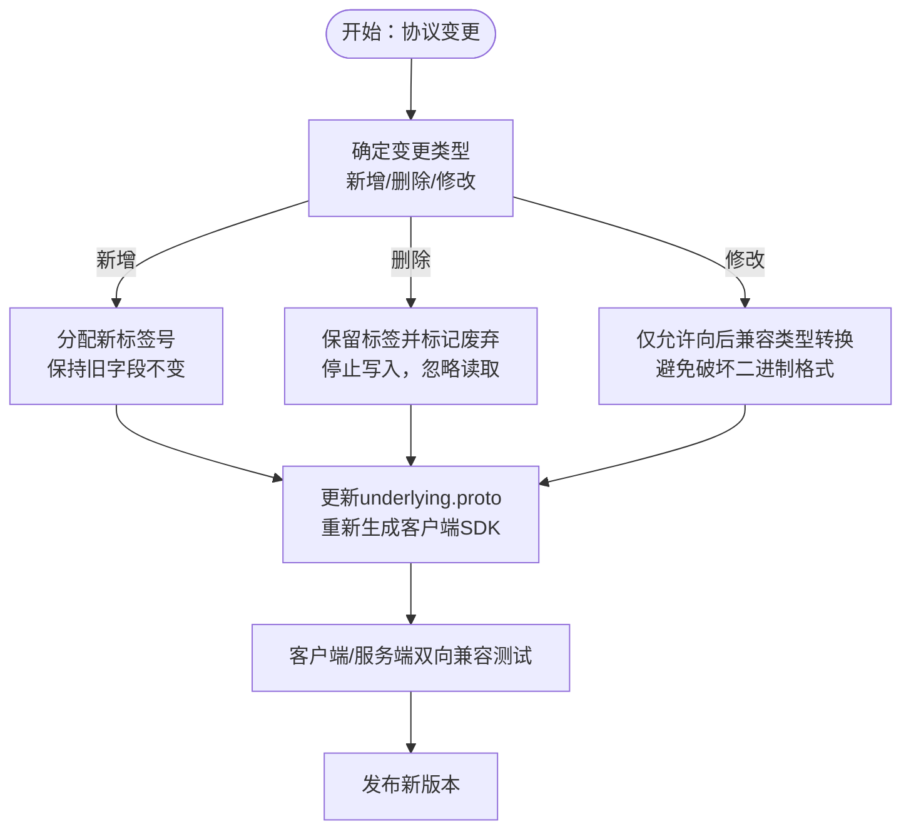
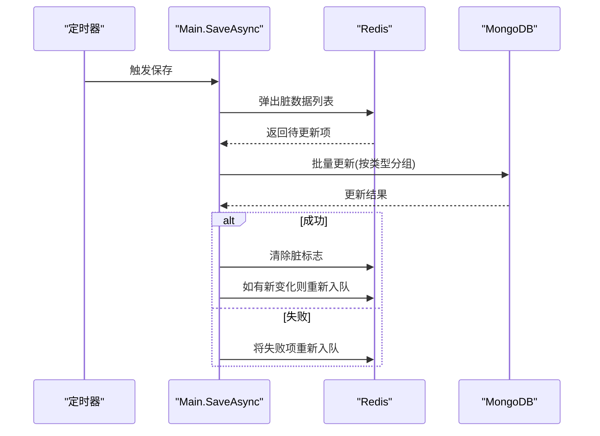
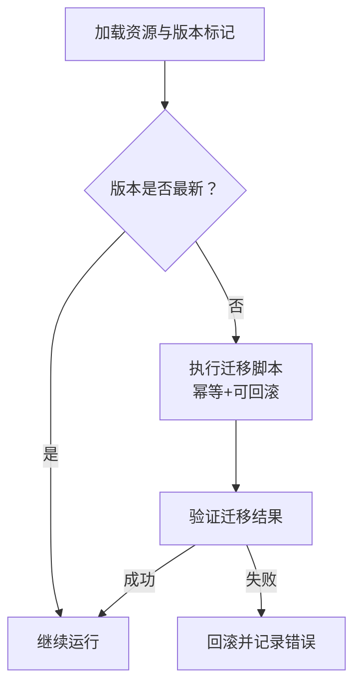
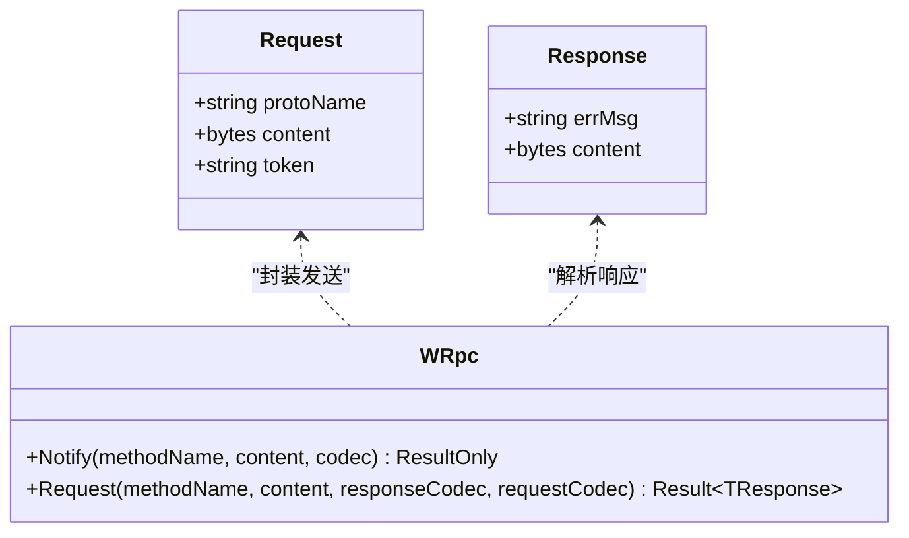
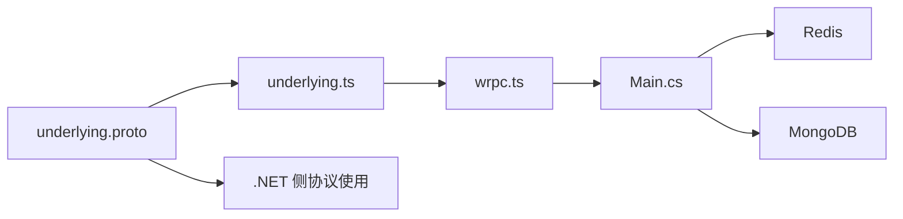

# 版本升级

<cite>
**本文引用的文件**   
- [README.md](file://README.md)
- [package.json](file://package.json)
- [gem/ccc/package.json](file://gem/ccc/package.json)
- [lgbf/hub/hub.csproj](file://lgbf/hub/hub.csproj)
- [lgbf/hub/Main.cs](file://lgbf/hub/Main.cs)
- [lgbf/underlying/underlying.proto](file://lgbf/underlying/underlying.proto)
- [gem/ccc/assets/script/ServerSDK/underlying.ts](file://gem/ccc/assets/script/ServerSDK/underlying.ts)
- [gem/ccc/assets/script/ServerSDK/wrpc.ts](file://gem/ccc/assets/script/ServerSDK/wrpc.ts)
- [gem/ccc/scripts/runtime-self-check.mjs](file://gem/ccc/scripts/runtime-self-check.mjs)
- [gem/ccc/library/.assets-data.json](file://gem/ccc/library/.assets-data.json)
</cite>

## 目录
1. [简介](#简介)
2. [项目结构](#项目结构)
3. [核心组件](#核心组件)
4. [架构总览](#架构总览)
5. [详细组件分析](#详细组件分析)
6. [依赖关系分析](#依赖关系分析)
7. [性能考量](#性能考量)
8. [故障排查指南](#故障排查指南)
9. [结论](#结论)
10. [附录](#附录)

## 简介
本指南面向 LGBF（轻量级游戏后端框架）的版本升级与向后兼容性管理，覆盖以下方面：
- 版本管理策略与升级路径：主版本、次版本、补丁版本的发布节奏与职责边界
- 协议升级的向后兼容性：基于 Protocol Buffers 的字段添加、删除与修改规则
- 数据库 Schema 升级与迁移：迁移脚本编写方法与数据迁移策略
- 配置文件版本与自动迁移：版本标记、迁移机制与回退策略
- 客户端 SDK 同步与兼容性测试：生成器版本、接口契约与测试流程
- 升级准备清单、风险评估、验证测试与回滚策略
- 破坏性变更与废弃功能的处理：弃用流程、清理时机与过渡期支持

## 项目结构
仓库采用多模块组织方式：
- 根目录包含顶层说明与依赖声明
- gem/ccc：编辑器/运行时资源与脚本，含服务端 SDK 与自检脚本
- lgbf：后端 Hub 工程，包含 .NET 项目与底层通信协议定义
- tools：工具链（当前未深入分析）

**图表来源**
- [README.md:1-3](file://README.md#L1-L3)
- [package.json:1-6](file://package.json#L1-L6)
- [lgbf/hub/hub.csproj:1-20](file://lgbf/hub/hub.csproj#L1-L20)
- [lgbf/hub/Main.cs:1-159](file://lgbf/hub/Main.cs#L1-L159)
- [lgbf/underlying/underlying.proto:1-12](file://lgbf/underlying/underlying.proto#L1-L12)
- [gem/ccc/assets/script/ServerSDK/underlying.ts:1-240](file://gem/ccc/assets/script/ServerSDK/underlying.ts#L1-L240)
- [gem/ccc/assets/script/ServerSDK/wrpc.ts:1-101](file://gem/ccc/assets/script/ServerSDK/wrpc.ts#L1-L101)
- [gem/ccc/scripts/runtime-self-check.mjs:1-50](file://gem/ccc/scripts/runtime-self-check.mjs#L1-L50)
- [gem/ccc/library/.assets-data.json:719-770](file://gem/ccc/library/.assets-data.json#L719-L770)

**章节来源**
- [README.md:1-3](file://README.md#L1-L3)
- [package.json:1-6](file://package.json#L1-L6)
- [lgbf/hub/hub.csproj:1-20](file://lgbf/hub/hub.csproj#L1-L20)
- [lgbf/hub/Main.cs:1-159](file://lgbf/hub/Main.cs#L1-L159)
- [lgbf/underlying/underlying.proto:1-12](file://lgbf/underlying/underlying.proto#L1-L12)
- [gem/ccc/assets/script/ServerSDK/underlying.ts:1-240](file://gem/ccc/assets/script/ServerSDK/underlying.ts#L1-L240)
- [gem/ccc/assets/script/ServerSDK/wrpc.ts:1-101](file://gem/ccc/assets/script/ServerSDK/wrpc.ts#L1-L101)
- [gem/ccc/scripts/runtime-self-check.mjs:1-50](file://gem/ccc/scripts/runtime-self-check.mjs#L1-L50)
- [gem/ccc/library/.assets-data.json:719-770](file://gem/ccc/library/.assets-data.json#L719-L770)

## 核心组件
- 协议层（Protocol Buffers）
  - underlying.proto 定义了通用请求/响应消息结构，用于跨语言、跨进程的 RPC 传输
  - 服务端 SDK 通过 protoc-gen-ts_proto 生成 TypeScript 编解码器，确保前后端一致
- 运行时层（.NET Hub）
  - Main.cs 负责启动、定时存档、连接 Redis/MongoDB，并执行批量更新
  - hub.csproj 声明 Google.Protobuf、MongoDB、StackExchange.Redis 等依赖
- 客户端 SDK（编辑器/运行时）
  - underlying.ts/wrpc.ts 提供统一的 WRpc 请求封装与错误处理
  - runtime-self-check.mjs 对关键脚本进行静态检查，保障运行时一致性
- 资源与版本（gem/ccc）
  - .assets-data.json 记录资源版本号，支撑资源版本演进与兼容性判断
  - gem/ccc/package.json 包含项目版本与 Creator 版本信息

**章节来源**
- [lgbf/underlying/underlying.proto:1-12](file://lgbf/underlying/underlying.proto#L1-L12)
- [gem/ccc/assets/script/ServerSDK/underlying.ts:1-240](file://gem/ccc/assets/script/ServerSDK/underlying.ts#L1-L240)
- [gem/ccc/assets/script/ServerSDK/wrpc.ts:1-101](file://gem/ccc/assets/script/ServerSDK/wrpc.ts#L1-L101)
- [lgbf/hub/hub.csproj:1-20](file://lgbf/hub/hub.csproj#L1-L20)
- [lgbf/hub/Main.cs:1-159](file://lgbf/hub/Main.cs#L1-L159)
- [gem/ccc/scripts/runtime-self-check.mjs:1-50](file://gem/ccc/scripts/runtime-self-check.mjs#L1-L50)
- [gem/ccc/library/.assets-data.json:719-770](file://gem/ccc/library/.assets-data.json#L719-L770)
- [gem/ccc/package.json:1-13](file://gem/ccc/package.json#L1-L13)

## 架构总览
下图展示 LGBF 在版本升级与兼容性方面的整体交互：

**图表来源**
- [gem/ccc/assets/script/ServerSDK/underlying.ts:1-240](file://gem/ccc/assets/script/ServerSDK/underlying.ts#L1-L240)
- [gem/ccc/assets/script/ServerSDK/wrpc.ts:1-101](file://gem/ccc/assets/script/ServerSDK/wrpc.ts#L1-L101)
- [gem/ccc/scripts/runtime-self-check.mjs:1-50](file://gem/ccc/scripts/runtime-self-check.mjs#L1-L50)
- [lgbf/underlying/underlying.proto:1-12](file://lgbf/underlying/underlying.proto#L1-L12)
- [lgbf/hub/Main.cs:1-159](file://lgbf/hub/Main.cs#L1-L159)
- [lgbf/hub/hub.csproj:1-20](file://lgbf/hub/hub.csproj#L1-L20)

## 详细组件分析

### 协议升级与向后兼容性（Protocol Buffers）
- 字段添加
  - 新增字段应使用新的标签号，保持已发送字段标签不变，以保证旧客户端能安全忽略新字段
  - 新字段建议设置默认值或可选语义，避免影响序列化/反序列化行为
- 字段删除
  - 不直接删除字段；应保留标签并标记为废弃，新版本不再写入，旧版本读取时忽略
- 字段修改
  - 修改字段类型需谨慎：仅允许向后兼容的类型转换（如 int32 与 sint32），避免破坏二进制编码
  - 字段从必填改为可选时，需确保旧客户端仍能正确解析
- 生成器与版本
  - 客户端 SDK 使用 protoc-gen-ts_proto 生成编解码器，需在升级协议时同步更新生成器版本与编译流程
  - 服务端与客户端均需遵循同一协议版本，避免因版本不一致导致的解析失败

**图表来源**
- [lgbf/underlying/underlying.proto:1-12](file://lgbf/underlying/underlying.proto#L1-L12)
- [gem/ccc/assets/script/ServerSDK/underlying.ts:1-240](file://gem/ccc/assets/script/ServerSDK/underlying.ts#L1-L240)
- [package.json:1-6](file://package.json#L1-L6)

**章节来源**
- [lgbf/underlying/underlying.proto:1-12](file://lgbf/underlying/underlying.proto#L1-L12)
- [gem/ccc/assets/script/ServerSDK/underlying.ts:1-240](file://gem/ccc/assets/script/ServerSDK/underlying.ts#L1-L240)
- [package.json:1-6](file://package.json#L1-L6)

### 数据库 Schema 升级与迁移
- 存档与批量更新流程
  - Hub 每隔固定时间触发 SaveAsync，从 Redis 列表中取出脏数据，按实体类型分组，去重后批量更新 MongoDB
  - 若批量更新失败，将脏数据重新入队；成功后清除脏标志位
- 迁移策略
  - Schema 变更应先在开发环境验证，再在预生产灰度
  - 对于新增字段，写入时使用默认值或空值，读取时兼容缺失字段
  - 对于删除字段，保留字段但标记废弃，迁移完成后清理
  - 批量更新失败时，回滚策略：将失败批次的数据重新入队，等待后续重试
- 数据一致性
  - 通过 Redis 标志位与重复检测，确保最终一致性与幂等性

**图表来源**
- [lgbf/hub/Main.cs:50-157](file://lgbf/hub/Main.cs#L50-L157)

**章节来源**
- [lgbf/hub/Main.cs:50-157](file://lgbf/hub/Main.cs#L50-L157)

### 配置文件版本与自动迁移
- 资源版本标记
  - .assets-data.json 中记录各资源的 versionCode，用于标识资源版本，便于在升级时识别需要迁移的资源
- 自动迁移机制
  - 建议在加载阶段检测资源版本，若低于当前版本，则执行迁移脚本或回退策略
  - 迁移脚本应具备幂等性与可回滚能力，失败时记录日志并中断升级
- 运行时自检
  - runtime-self-check.mjs 对关键脚本进行静态校验，防止因资源版本不匹配导致的运行时异常

**图表来源**
- [gem/ccc/library/.assets-data.json:719-770](file://gem/ccc/library/.assets-data.json#L719-L770)
- [gem/ccc/scripts/runtime-self-check.mjs:1-50](file://gem/ccc/scripts/runtime-self-check.mjs#L1-L50)

**章节来源**
- [gem/ccc/library/.assets-data.json:719-770](file://gem/ccc/library/.assets-data.json#L719-L770)
- [gem/ccc/scripts/runtime-self-check.mjs:1-50](file://gem/ccc/scripts/runtime-self-check.mjs#L1-L50)

### 客户端 SDK 的版本同步与兼容性测试
- 生成器与依赖
  - 客户端 SDK 由 underlying.proto 生成，使用 protoc-gen-ts_proto 与 @bufbuild/protobuf
  - 服务端依赖 Google.Protobuf，需确保两端生成器与运行时库版本一致
- 兼容性测试
  - 使用 runtime-self-check.mjs 对关键脚本进行静态检查，确保运行时行为符合预期
  - 建议在 CI 中增加协议编解码与 WRpc 请求/响应的集成测试

**图表来源**
- [gem/ccc/assets/script/ServerSDK/underlying.ts:12-21](file://gem/ccc/assets/script/ServerSDK/underlying.ts#L12-L21)
- [gem/ccc/assets/script/ServerSDK/wrpc.ts:21-52](file://gem/ccc/assets/script/ServerSDK/wrpc.ts#L21-L52)

**章节来源**
- [gem/ccc/assets/script/ServerSDK/underlying.ts:1-240](file://gem/ccc/assets/script/ServerSDK/underlying.ts#L1-L240)
- [gem/ccc/assets/script/ServerSDK/wrpc.ts:1-101](file://gem/ccc/assets/script/ServerSDK/wrpc.ts#L1-L101)
- [lgbf/hub/hub.csproj:12-16](file://lgbf/hub/hub.csproj#L12-L16)
- [package.json:1-6](file://package.json#L1-L6)

## 依赖关系分析
- 服务端依赖
  - Google.Protobuf：协议编解码
  - MongoDB.Driver/Bson：数据库访问
  - StackExchange.Redis：缓存与队列
- 客户端依赖
  - @bufbuild/protobuf：TS 协议编解码
  - ts-proto：协议生成器（根 package.json）

**图表来源**
- [lgbf/underlying/underlying.proto:1-12](file://lgbf/underlying/underlying.proto#L1-L12)
- [gem/ccc/assets/script/ServerSDK/underlying.ts:1-240](file://gem/ccc/assets/script/ServerSDK/underlying.ts#L1-L240)
- [gem/ccc/assets/script/ServerSDK/wrpc.ts:1-101](file://gem/ccc/assets/script/ServerSDK/wrpc.ts#L1-L101)
- [lgbf/hub/Main.cs:1-159](file://lgbf/hub/Main.cs#L1-L159)
- [lgbf/hub/hub.csproj:12-16](file://lgbf/hub/hub.csproj#L12-L16)
- [package.json:1-6](file://package.json#L1-L6)

**章节来源**
- [lgbf/hub/hub.csproj:1-20](file://lgbf/hub/hub.csproj#L1-L20)
- [lgbf/hub/Main.cs:1-159](file://lgbf/hub/Main.cs#L1-L159)
- [lgbf/underlying/underlying.proto:1-12](file://lgbf/underlying/underlying.proto#L1-L12)
- [gem/ccc/assets/script/ServerSDK/underlying.ts:1-240](file://gem/ccc/assets/script/ServerSDK/underlying.ts#L1-L240)
- [gem/ccc/assets/script/ServerSDK/wrpc.ts:1-101](file://gem/ccc/assets/script/ServerSDK/wrpc.ts#L1-L101)
- [package.json:1-6](file://package.json#L1-L6)

## 性能考量
- 批量更新与去重
  - SaveAsync 按实体类型分组并去重，减少重复写入，提高吞吐
- 写入间隔与批大小
  - 通过常量 SaveIntervalMs 与 SaveBatchSize 控制写入频率与单次批大小，平衡延迟与吞吐
- 错误处理与重试
  - 批量更新失败时将脏数据重新入队，避免丢失；同时避免并发重复执行

**章节来源**
- [lgbf/hub/Main.cs:15-17](file://lgbf/hub/Main.cs#L15-L17)
- [lgbf/hub/Main.cs:81-146](file://lgbf/hub/Main.cs#L81-L146)

## 故障排查指南
- 协议不兼容
  - 现象：客户端/服务端编解码失败或字段缺失
  - 排查：确认 underlying.proto 是否更新；确保两端生成器与运行时库版本一致
- 运行时自检失败
  - 现象：runtime-self-check.mjs 抛出错误
  - 排查：根据错误提示定位具体脚本，修复后重新执行自检
- 数据库写入失败
  - 现象：SaveAsync 日志报错且脏数据重新入队
  - 排查：检查 MongoDB 连接、权限与索引；确认批量更新条件与文档结构

**章节来源**
- [gem/ccc/scripts/runtime-self-check.mjs:40-50](file://gem/ccc/scripts/runtime-self-check.mjs#L40-L50)
- [lgbf/hub/Main.cs:148-151](file://lgbf/hub/Main.cs#L148-L151)

## 结论
- 版本升级应遵循“向后兼容优先”的原则，协议层面严格遵守 PB 字段规则
- 数据库迁移应以幂等与可回滚为核心，结合 Hub 的批量更新与重试机制
- 配置与资源版本通过版本标记与自检脚本共同保障升级质量
- 客户端 SDK 与服务端依赖版本需同步，CI 中加入协议与 WRpc 测试
- 破坏性变更应走弃用流程，提供过渡期支持后再清理

## 附录

### 升级准备清单
- 协议层
  - 更新 underlying.proto 并重新生成客户端 SDK
  - 确认服务端与客户端生成器版本一致
- 数据库层
  - 设计迁移脚本并验证幂等性与回滚
  - 准备灰度环境与监控指标
- 配置与资源
  - 更新 .assets-data.json 中的版本标记
  - 运行 runtime-self-check.mjs 确保关键脚本无异常
- 客户端 SDK
  - 同步 ts-proto 与 @bufbuild/protobuf 版本
  - 增加协议编解码与 WRpc 的集成测试

**章节来源**
- [lgbf/underlying/underlying.proto:1-12](file://lgbf/underlying/underlying.proto#L1-L12)
- [gem/ccc/assets/script/ServerSDK/underlying.ts:1-240](file://gem/ccc/assets/script/ServerSDK/underlying.ts#L1-L240)
- [gem/ccc/scripts/runtime-self-check.mjs:1-50](file://gem/ccc/scripts/runtime-self-check.mjs#L1-L50)
- [gem/ccc/library/.assets-data.json:719-770](file://gem/ccc/library/.assets-data.json#L719-L770)
- [package.json:1-6](file://package.json#L1-L6)

### 风险评估
- 协议不兼容风险：可能导致请求/响应解析失败
- 数据迁移风险：可能造成数据不一致或丢失
- 资源版本不匹配风险：运行时行为异常
- 客户端/服务端版本不同步风险：编解码与运行时库不一致

**章节来源**
- [gem/ccc/scripts/runtime-self-check.mjs:40-50](file://gem/ccc/scripts/runtime-self-check.mjs#L40-L50)
- [lgbf/hub/Main.cs:148-151](file://lgbf/hub/Main.cs#L148-L151)

### 升级后的验证测试流程
- 协议验证：双向编解码与 WRpc 请求/响应
- 数据库验证：批量更新与一致性检查
- 资源验证：runtime-self-check.mjs 与版本标记核对
- 回归测试：关键业务流程与性能指标

**章节来源**
- [gem/ccc/assets/script/ServerSDK/wrpc.ts:1-101](file://gem/ccc/assets/script/ServerSDK/wrpc.ts#L1-L101)
- [lgbf/hub/Main.cs:50-157](file://lgbf/hub/Main.cs#L50-L157)
- [gem/ccc/scripts/runtime-self-check.mjs:1-50](file://gem/ccc/scripts/runtime-self-check.mjs#L1-L50)

### 回滚策略
- 协议回滚：恢复 underlying.proto 至上一版本并重新生成 SDK
- 数据库回滚：执行逆向迁移脚本或基于备份恢复
- 资源回滚：将 .assets-data.json 版本标记回退至上一版本
- 客户端回滚：锁定生成器与运行时库版本，确保与服务端一致

**章节来源**
- [lgbf/underlying/underlying.proto:1-12](file://lgbf/underlying/underlying.proto#L1-L12)
- [gem/ccc/library/.assets-data.json:719-770](file://gem/ccc/library/.assets-data.json#L719-L770)

### 破坏性变更与废弃功能清理
- 弃用流程：新增废弃字段/方法，提供过渡期支持与迁移指引
- 清理时机：在下一个主版本中移除废弃项，并更新协议与文档
- 过渡期：提供自动迁移与兼容层，降低对用户的影响

**章节来源**
- [lgbf/underlying/underlying.proto:1-12](file://lgbf/underlying/underlying.proto#L1-L12)
- [gem/ccc/assets/script/ServerSDK/underlying.ts:1-240](file://gem/ccc/assets/script/ServerSDK/underlying.ts#L1-L240)