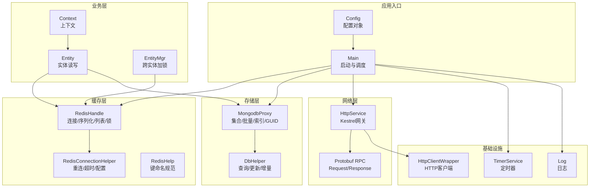
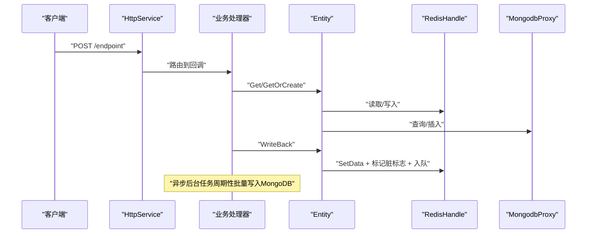
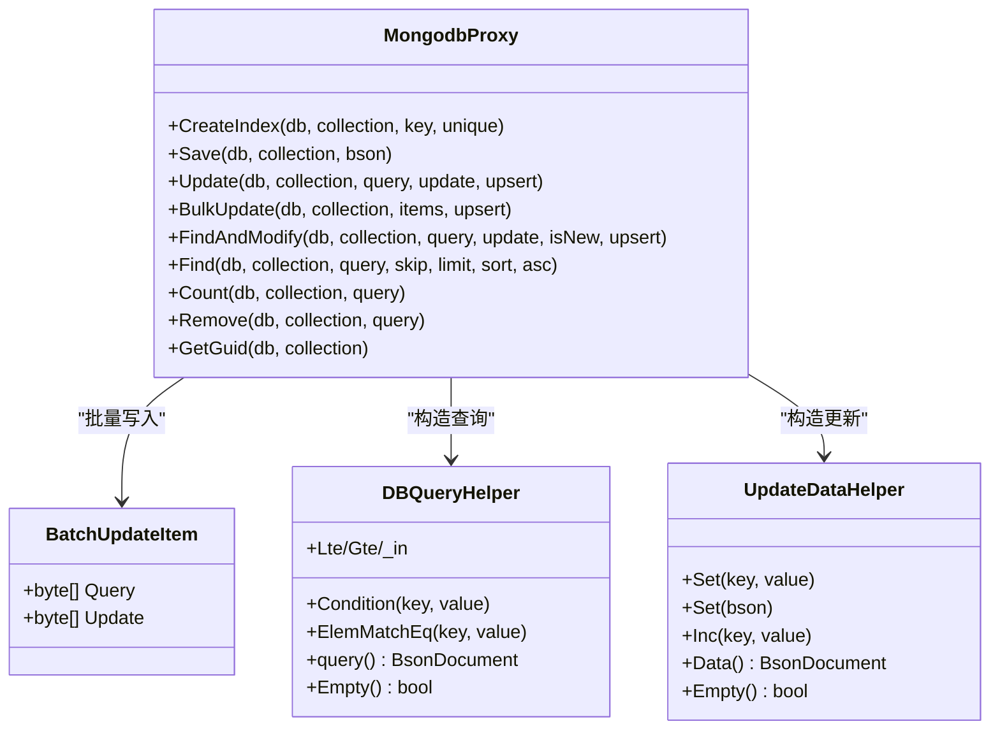
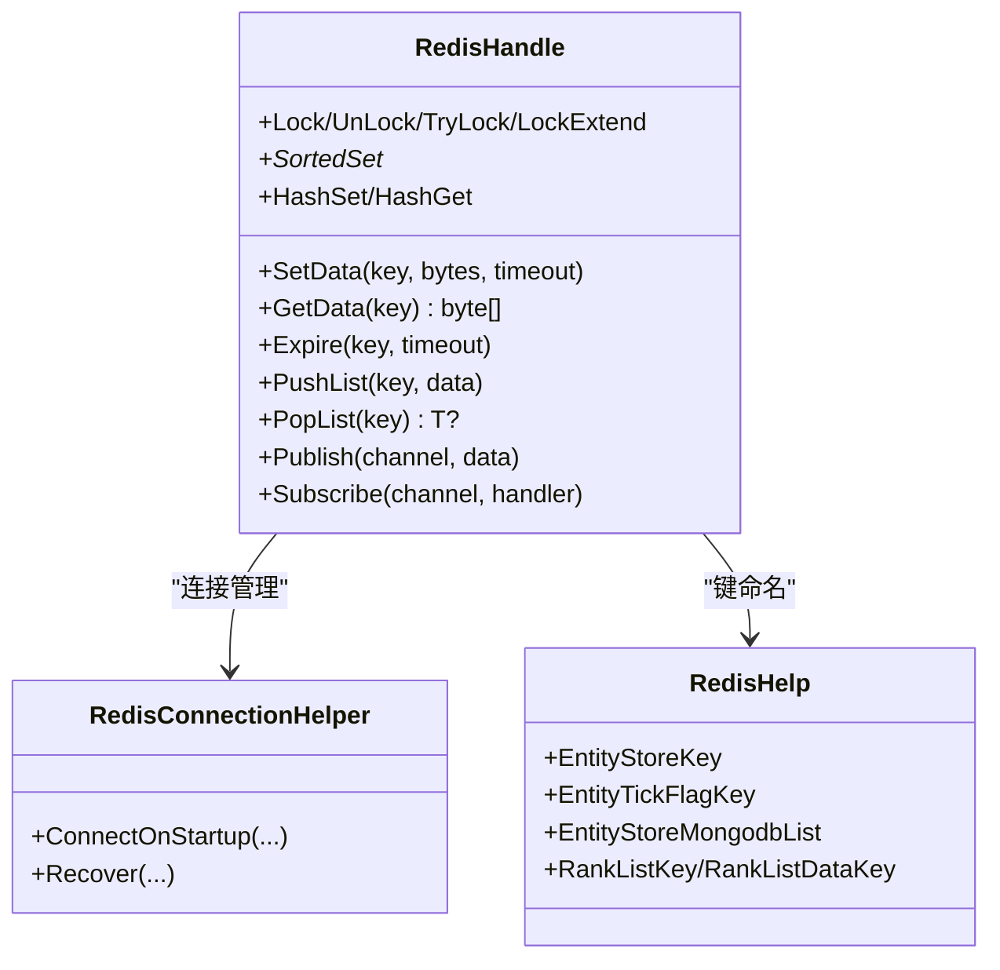
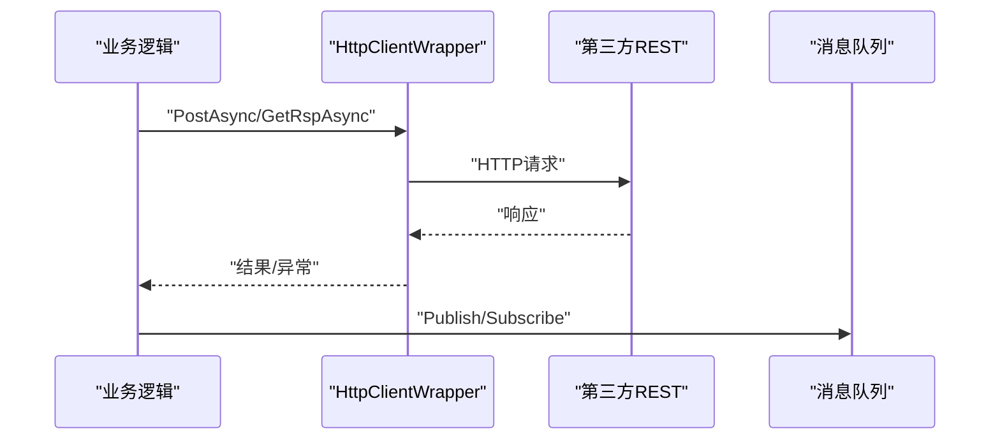
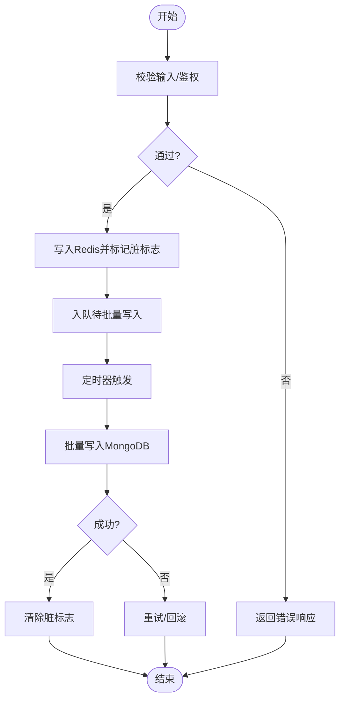
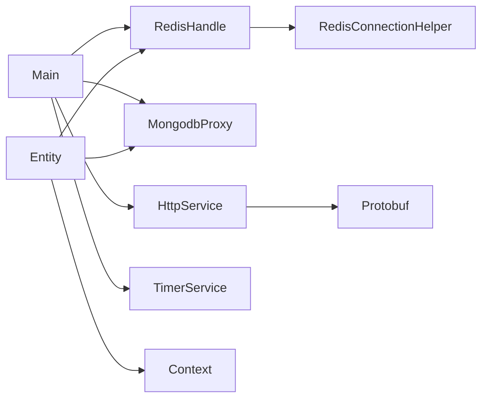

# 第三方集成

<cite>
**本文档引用的文件**
- [Main.cs](file://lgbf/hub/Main.cs)
- [Config.cs](file://lgbf/hub/Main.cs)
- [RedisHandle.cs](file://lgbf/hub/RedisHandle.cs)
- [RedisConnectionHelper.cs](file://lgbf/hub/RedisConnectionHelper.cs)
- [RedisHelp.cs](file://lgbf/hub/RedisHelp.cs)
- [MongodbProxy.cs](file://lgbf/hub/MongodbProxy.cs)
- [DbHelper.cs](file://lgbf/hub/DbHelper.cs)
- [Entity.cs](file://lgbf/hub/Entity.cs)
- [EntityMgr.cs](file://lgbf/hub/EntityMgr.cs)
- [Context.cs](file://lgbf/hub/Context.cs)
- [HttpService.cs](file://lgbf/hub/HttpService.cs)
- [HttpClientWrapper.cs](file://lgbf/hub/HttpClientWrapper.cs)
- [TimerService.cs](file://lgbf/hub/TimerService.cs)
- [Log.cs](file://lgbf/hub/Log.cs)
- [README.md](file://README.md)
</cite>

## 目录
1. [简介](#简介)
2. [项目结构](#项目结构)
3. [核心组件](#核心组件)
4. [架构总览](#架构总览)
5. [详细组件分析](#详细组件分析)
6. [依赖关系分析](#依赖关系分析)
7. [性能考量](#性能考量)
8. [故障排查指南](#故障排查指南)
9. [结论](#结论)
10. [附录](#附录)

## 简介
本指南面向需要在现有轻量级游戏后端框架基础上扩展第三方服务集成的工程师与架构师。内容覆盖：
- 数据库扩展：除MongoDB外的NoSQL接入思路与最佳实践
- 缓存系统扩展：除Redis外的缓存技术集成要点
- 外部API集成：REST调用、消息队列与云服务对接
- 配置管理扩展：多来源配置加载与动态更新
- 安全集成：OAuth、API密钥与数据加密
- 完整集成示例与错误处理策略
- 性能优化与监控方案

## 项目结构
该框架采用“服务化 + 轻量HTTP + 持久化”的分层设计：
- 入口与生命周期：Main负责启动、定时任务与持久化流程编排
- 缓存层：RedisHandle封装连接、序列化、发布订阅、列表操作与分布式锁
- 数据访问层：MongodbProxy封装集合操作、批量写入、索引与自增GUID
- 实体与事务：Entity/EntityMgr提供实体读取、写回与跨实体加锁
- 网关与协议：HttpService基于Kestrel提供HTTP接口；底层通过Protobuf进行RPC
- 工具与基础设施：HttpClientWrapper、TimerService、Log等

**图表来源**
- [Main.cs:13-40](file://lgbf/hub/Main.cs#L13-L40)
- [RedisHandle.cs:13-34](file://lgbf/hub/RedisHandle.cs#L13-L34)
- [MongodbProxy.cs:10-28](file://lgbf/hub/MongodbProxy.cs#L10-L28)
- [Entity.cs:94-153](file://lgbf/hub/Entity.cs#L94-L153)
- [EntityMgr.cs:44-126](file://lgbf/hub/EntityMgr.cs#L44-L126)
- [HttpService.cs:117-181](file://lgbf/hub/HttpService.cs#L117-L181)
- [TimerService.cs:7-96](file://lgbf/hub/TimerService.cs#L7-L96)
- [Log.cs:6-112](file://lgbf/hub/Log.cs#L6-L112)

**章节来源**
- [README.md:1-3](file://README.md#L1-L3)
- [Main.cs:13-40](file://lgbf/hub/Main.cs#L13-L40)

## 核心组件
- 启动与编排（Main）：初始化Redis/Mongo/HTTP服务，注册定时保存任务，统一关闭流程
- 缓存抽象（RedisHandle）：统一连接管理、序列化、发布订阅、列表操作、分布式锁
- 存储抽象（MongodbProxy）：集合操作、批量写入、索引、自增GUID、查询/计数/删除
- 实体模型（Entity/EntityMgr）：实体读取/写回、脏标记、跨实体加锁与续租
- 网关（HttpService）：Kestrel网关、路由到回调、跨域头、请求统计
- 基础设施（TimerService/Log/HttpClientWrapper）：定时器、日志、HTTP客户端

**章节来源**
- [Main.cs:13-40](file://lgbf/hub/Main.cs#L13-L40)
- [RedisHandle.cs:13-34](file://lgbf/hub/RedisHandle.cs#L13-L34)
- [MongodbProxy.cs:10-28](file://lgbf/hub/MongodbProxy.cs#L10-L28)
- [Entity.cs:31-153](file://lgbf/hub/Entity.cs#L31-L153)
- [EntityMgr.cs:44-126](file://lgbf/hub/EntityMgr.cs#L44-L126)
- [HttpService.cs:117-181](file://lgbf/hub/HttpService.cs#L117-L181)
- [TimerService.cs:7-96](file://lgbf/hub/TimerService.cs#L7-L96)
- [Log.cs:6-112](file://lgbf/hub/Log.cs#L6-L112)
- [HttpClientWrapper.cs:4-47](file://lgbf/hub/HttpClientWrapper.cs#L4-L47)

## 架构总览
整体采用“事件驱动 + 异步非阻塞”的模式：
- HTTP请求进入HttpService，路由到具体回调
- 业务逻辑通过Entity读取或创建实体，修改后写回Redis并标记脏数据
- 定时器周期性从Redis拉取脏数据，批量写入MongoDB
- Redis提供分布式锁保障跨实体并发一致性

**图表来源**
- [HttpService.cs:50-114](file://lgbf/hub/HttpService.cs#L50-L114)
- [Entity.cs:104-152](file://lgbf/hub/Entity.cs#L104-L152)
- [RedisHandle.cs:84-136](file://lgbf/hub/RedisHandle.cs#L84-L136)
- [MongodbProxy.cs:76-100](file://lgbf/hub/MongodbProxy.cs#L76-L100)
- [Main.cs:50-157](file://lgbf/hub/Main.cs#L50-L157)

## 详细组件分析

### 组件A：数据库扩展（NoSQL接入与MongoDB高级配置）
- 扩展思路
  - 新增存储代理类，实现与MongodbProxy一致的接口契约（集合操作、批量写入、索引、自增等）
  - 在Main中注入新代理，并在Entity/MongoHelper中按需切换
  - 对于不支持的特性（如自增GUID），在业务层提供替代方案（如应用层生成主键）
- MongoDB高级配置
  - 连接参数：认证、副本集、超时、压缩等
  - 索引策略：唯一索引、复合索引、TTL索引、文本/地理索引
  - 批量写入：有序/无序、错误处理与重试
  - 查询优化：投影、排序、分页、explain分析
- 最佳实践
  - 使用BsonDocument进行灵活序列化
  - 分批处理大批量写入，避免单次超时
  - 对热点集合建立合适索引，避免全表扫描
  - 使用FindAndModify实现原子更新与返回最新值

**图表来源**
- [MongodbProxy.cs:4-220](file://lgbf/hub/MongodbProxy.cs#L4-L220)
- [DbHelper.cs:4-157](file://lgbf/hub/DbHelper.cs#L4-L157)
- [DbHelper.cs:160-310](file://lgbf/hub/DbHelper.cs#L160-L310)

**章节来源**
- [MongodbProxy.cs:35-220](file://lgbf/hub/MongodbProxy.cs#L35-L220)
- [DbHelper.cs:4-157](file://lgbf/hub/DbHelper.cs#L4-L157)
- [DbHelper.cs:160-310](file://lgbf/hub/DbHelper.cs#L160-L310)

### 组件B：缓存系统扩展（Redis之外的缓存技术）
- 扩展点
  - 抽象出RedisHandle的通用接口（设置/获取/过期/列表/发布订阅/分布式锁）
  - 针对不同缓存实现（如Memcached、LevelDB、Redis集群）适配对应SDK
  - 对不支持的功能（如发布订阅、有序集合）提供降级策略
- 关键能力
  - 序列化/反序列化：JSON/Protobuf/BSON
  - 列表操作：左/右推入、弹出
  - 分布式锁：基于SET NX EX或RedLock
  - 发布订阅：事件通知与内部RPC
- 最佳实践
  - 连接池与超时控制
  - 失败重试与指数退避
  - 键空间设计与过期策略
  - 写回流程中使用“脏标志 + 队列”降低写放大

**图表来源**
- [RedisHandle.cs:13-544](file://lgbf/hub/RedisHandle.cs#L13-L544)
- [RedisConnectionHelper.cs:6-144](file://lgbf/hub/RedisConnectionHelper.cs#L6-L144)
- [RedisHelp.cs:4-20](file://lgbf/hub/RedisHelp.cs#L4-L20)

**章节来源**
- [RedisHandle.cs:13-544](file://lgbf/hub/RedisHandle.cs#L13-L544)
- [RedisConnectionHelper.cs:6-144](file://lgbf/hub/RedisConnectionHelper.cs#L6-L144)
- [RedisHelp.cs:4-20](file://lgbf/hub/RedisHelp.cs#L4-L20)

### 组件C：外部API集成（REST、消息队列、云服务）
- RESTful服务调用
  - 使用HttpClientWrapper封装超时、异常与日志
  - 对第三方接口进行幂等设计与重试
  - 参数签名与时间戳校验（如需要）
- 消息队列集成
  - Redis发布订阅用于内部RPC与事件通知
  - 对外可接入RabbitMQ/Kafka，通过适配器桥接
- 云服务对接
  - 对象存储（上传/下载）、CDN、短信/邮件服务
  - 通过配置中心动态切换环境与密钥

**图表来源**
- [HttpClientWrapper.cs:4-47](file://lgbf/hub/HttpClientWrapper.cs#L4-L47)
- [HttpService.cs:117-181](file://lgbf/hub/HttpService.cs#L117-L181)

**章节来源**
- [HttpClientWrapper.cs:4-47](file://lgbf/hub/HttpClientWrapper.cs#L4-L47)
- [HttpService.cs:117-181](file://lgbf/hub/HttpService.cs#L117-L181)

### 组件D：配置管理扩展
- 当前配置
  - Config对象包含主机、端口、Redis地址/密码、Mongo地址
- 扩展建议
  - 支持环境变量、命令行参数、配置中心（Consul/Nacos）
  - 动态刷新：监听配置变更并热更新连接参数
  - 加密存储：敏感字段（如密码）使用密钥管理服务解密

**章节来源**
- [Main.cs:4-11](file://lgbf/hub/Main.cs#L4-L11)
- [Main.cs:31-40](file://lgbf/hub/Main.cs#L31-L40)

### 组件E：安全集成（OAuth、API密钥、数据加密）
- OAuth认证
  - 通过HttpService路由到OAuth回调，获取令牌并校验
  - 将用户标识映射为实体ID，使用EntityMgr进行跨实体操作
- API密钥管理
  - 请求头携带密钥，HttpService统一校验
  - 密钥轮换与黑名单机制
- 数据加密
  - 敏感字段使用对称/非对称加密
  - 传输层TLS，存储层字段级加密

**章节来源**
- [HttpService.cs:117-181](file://lgbf/hub/HttpService.cs#L117-L181)
- [EntityMgr.cs:44-126](file://lgbf/hub/EntityMgr.cs#L44-L126)

### 组件F：完整集成示例与错误处理策略
- 示例场景：玩家充值（HTTP -> Redis写回 -> 定时批量写Mongo）
- 错误处理
  - Redis超时：自动重连与指数退避
  - MongoDB写入失败：回滚到Redis队列，定时重试
  - HTTP调用失败：熔断与快速失败
- 监控与告警
  - 日志分级（Trace/Debug/Info/Warn/Error）
  - 连接统计、请求耗时、错误率阈值

**图表来源**
- [Main.cs:50-157](file://lgbf/hub/Main.cs#L50-L157)
- [RedisHandle.cs:84-136](file://lgbf/hub/RedisHandle.cs#L84-L136)
- [MongodbProxy.cs:102-120](file://lgbf/hub/MongodbProxy.cs#L102-L120)

**章节来源**
- [Main.cs:50-157](file://lgbf/hub/Main.cs#L50-L157)
- [Log.cs:6-112](file://lgbf/hub/Log.cs#L6-L112)

## 依赖关系分析
- 组件耦合
  - Main依赖RedisHandle/MongodbProxy/HttpService/TimerService
  - Entity依赖RedisHandle/MongodbProxy/Context
  - RedisHandle依赖RedisConnectionHelper
- 可能的循环依赖
  - 未发现直接循环依赖；通过接口与上下文传递避免耦合
- 外部依赖
  - MongoDB Driver、StackExchange.Redis、Google.Protobuf、Kestrel

**图表来源**
- [Main.cs:18-39](file://lgbf/hub/Main.cs#L18-L39)
- [Entity.cs:94-153](file://lgbf/hub/Entity.cs#L94-L153)
- [RedisHandle.cs:13-34](file://lgbf/hub/RedisHandle.cs#L13-L34)
- [HttpService.cs:117-181](file://lgbf/hub/HttpService.cs#L117-L181)

**章节来源**
- [Main.cs:18-39](file://lgbf/hub/Main.cs#L18-L39)
- [Entity.cs:94-153](file://lgbf/hub/Entity.cs#L94-L153)
- [RedisHandle.cs:13-34](file://lgbf/hub/RedisHandle.cs#L13-L34)
- [HttpService.cs:117-181](file://lgbf/hub/HttpService.cs#L117-L181)

## 性能考量
- Redis
  - 使用连接池与共享实例，避免频繁创建销毁
  - 列表操作采用左/右弹出，减少内存碎片
  - 分布式锁使用短超时与自动续租
- MongoDB
  - 批量写入使用无序模式提升吞吐
  - 合理索引，避免全表扫描
  - 分片与副本集提升可用性与读扩展
- HTTP
  - Kestrel启用HTTP/2，限制并发连接数
  - 请求体复用缓冲区，避免大对象拷贝
- 定时器
  - 低频批量写入，避免热点时段抖动

[本节为通用指导，无需特定文件引用]

## 故障排查指南
- Redis连接失败
  - 检查连接字符串、密码、网络连通性
  - 观察重连日志与等待通知状态
- MongoDB写入异常
  - 查看批量写入返回值与错误日志
  - 回滚到Redis队列并重试
- HTTP超时
  - 增加超时时间，检查下游服务健康
  - 启用熔断与快速失败
- 日志定位
  - 使用Log记录关键路径与耗时
  - 设置日志级别与滚动策略

**章节来源**
- [RedisConnectionHelper.cs:56-127](file://lgbf/hub/RedisConnectionHelper.cs#L56-L127)
- [MongodbProxy.cs:102-120](file://lgbf/hub/MongodbProxy.cs#L102-L120)
- [HttpService.cs:149-181](file://lgbf/hub/HttpService.cs#L149-L181)
- [Log.cs:6-112](file://lgbf/hub/Log.cs#L6-L112)

## 结论
该框架以“Redis + MongoDB + Protobuf + Kestrel”为核心，提供了清晰的扩展点与稳健的错误处理机制。通过抽象存储与缓存接口，可平滑接入其他NoSQL与缓存技术；通过HTTP服务与定时器，可构建高性能的外部API与批处理流程。结合配置中心、安全组件与监控体系，可满足生产级的可运维性与可扩展性需求。

[本节为总结，无需特定文件引用]

## 附录
- 快速集成步骤
  - 定义存储/缓存接口契约
  - 实现适配器并注入到Main
  - 在Entity/DbHelper中按需切换
  - 配置连接参数与密钥
  - 编写单元测试与集成测试
- 推荐工具链
  - 配置中心：Consul/Nacos
  - 监控：Prometheus/Grafana
  - 日志：ELK/OTLP
  - 安全：Vault/JWT/OAuth2

[本节为补充信息，无需特定文件引用]