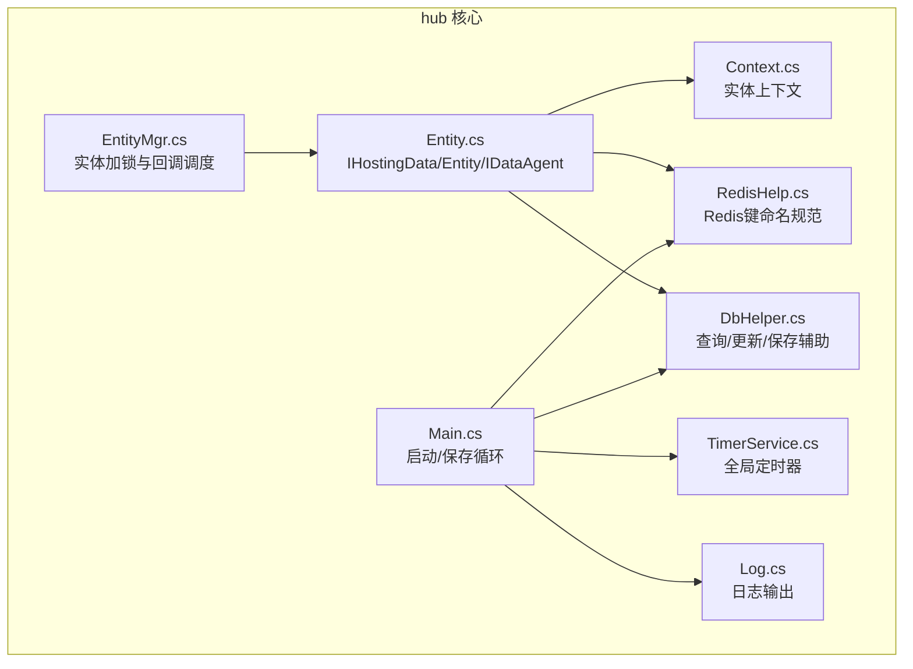
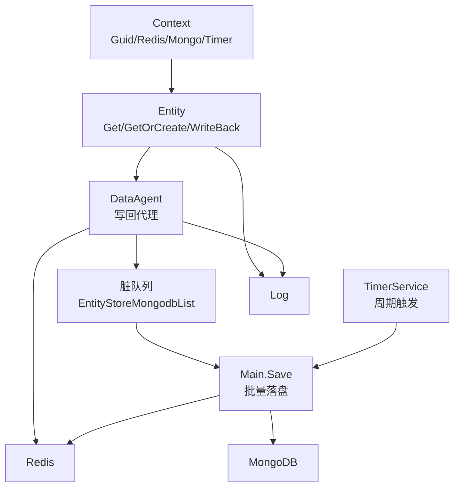
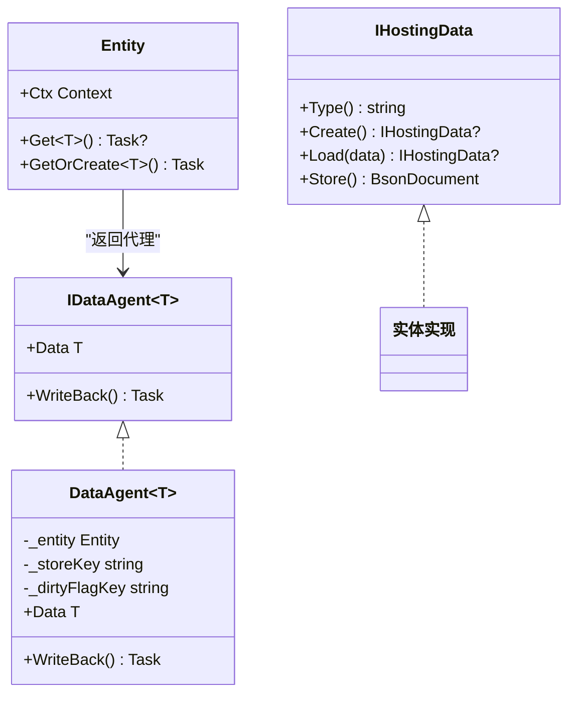
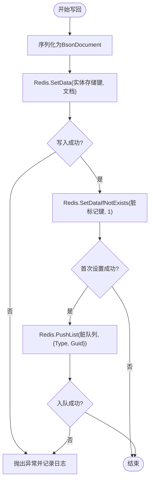
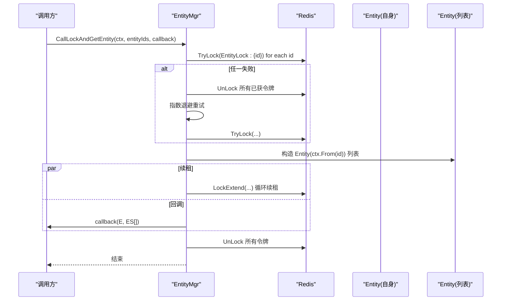
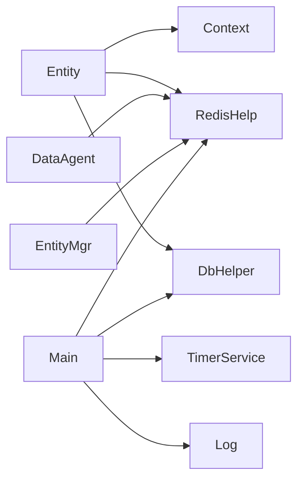

# 自定义实体开发

<cite>
**本文引用的文件**
- [Entity.cs](file://lgbf/hub/Entity.cs)
- [EntityMgr.cs](file://lgbf/hub/EntityMgr.cs)
- [Context.cs](file://lgbf/hub/Context.cs)
- [RedisHelp.cs](file://lgbf/hub/RedisHelp.cs)
- [DbHelper.cs](file://lgbf/hub/DbHelper.cs)
- [TimerService.cs](file://lgbf/hub/TimerService.cs)
- [Main.cs](file://lgbf/hub/Main.cs)
- [Log.cs](file://lgbf/hub/Log.cs)
</cite>

## 目录
1. [简介](#简介)
2. [项目结构](#项目结构)
3. [核心组件](#核心组件)
4. [架构总览](#架构总览)
5. [详细组件分析](#详细组件分析)
6. [依赖关系分析](#依赖关系分析)
7. [性能考量](#性能考量)
8. [故障排查指南](#故障排查指南)
9. [结论](#结论)
10. [附录](#附录)

## 简介
本指南面向需要在系统中开发“自定义实体”的工程师，围绕以下目标展开：深入解析 IHostingData 接口的设计理念与实现约束；阐明实体生命周期管理、数据同步机制与缓存策略；详解 EntityMgr 实体管理器的加锁、并发与回调执行流程；提供从数据模型到业务逻辑的完整开发示例与性能优化建议；说明实体上下文 Context 的作用与使用方式；总结实体继承的最佳实践与常见陷阱；并给出调试与测试自定义实体的方法。

## 项目结构
本项目采用分层与职责分离的组织方式：
- hub 层：核心运行时与基础设施（实体、上下文、Redis/Mongo 访问、定时器、日志、主入口）
- underlying 层：底层协议生成工具（用于跨语言/跨进程通信）
- gem/ccc：资源与脚本（与实体开发无直接关系，但体现了多端协作）

图表来源
- [Entity.cs:1-154](file://lgbf/hub/Entity.cs#L1-L154)
- [EntityMgr.cs:1-128](file://lgbf/hub/EntityMgr.cs#L1-L128)
- [Context.cs:1-27](file://lgbf/hub/Context.cs#L1-L27)
- [RedisHelp.cs:1-20](file://lgbf/hub/RedisHelp.cs#L1-L20)
- [DbHelper.cs:1-311](file://lgbf/hub/DbHelper.cs#L1-L311)
- [TimerService.cs:1-126](file://lgbf/hub/TimerService.cs#L1-L126)
- [Main.cs:1-159](file://lgbf/hub/Main.cs#L1-L159)
- [Log.cs:1-113](file://lgbf/hub/Log.cs#L1-L113)

章节来源
- [Entity.cs:1-154](file://lgbf/hub/Entity.cs#L1-L154)
- [EntityMgr.cs:1-128](file://lgbf/hub/EntityMgr.cs#L1-L128)
- [Context.cs:1-27](file://lgbf/hub/Context.cs#L1-L27)
- [RedisHelp.cs:1-20](file://lgbf/hub/RedisHelp.cs#L1-L20)
- [DbHelper.cs:1-311](file://lgbf/hub/DbHelper.cs#L1-L311)
- [TimerService.cs:1-126](file://lgbf/hub/TimerService.cs#L1-L126)
- [Main.cs:1-159](file://lgbf/hub/Main.cs#L1-L159)
- [Log.cs:1-113](file://lgbf/hub/Log.cs#L1-L113)

## 核心组件
- IHostingData：实体数据契约接口，定义类型标识、创建与加载工厂方法、持久化序列化方法。
- Entity：实体读取/创建代理，负责从 Redis/Mongo 拉取数据、反序列化为具体实体数据，并提供写回代理。
- IDataAgent<T>/DataAgent<T>：实体数据写回代理，封装 Redis 写入与脏标记、入队 MongoDB 同步队列。
- EntityMgr：实体级分布式锁与回调执行器，确保跨实体操作的原子性与一致性。
- Context：实体上下文，封装 Guid、Redis、Mongo、Timer 等运行时依赖。
- RedisHelp：统一的 Redis 键命名规范，便于跨模块共享。
- DbHelper：查询/更新/保存的 BSON 文档构造器，简化数据库交互。
- TimerService：全局定时器服务，驱动周期性任务（如批量落盘）。
- Main：应用入口，初始化 Redis/Mongo、启动 HTTP 服务、注册周期性保存任务。
- Log：统一日志输出与轮转。

章节来源
- [Entity.cs:4-22](file://lgbf/hub/Entity.cs#L4-L22)
- [Entity.cs:24-29](file://lgbf/hub/Entity.cs#L24-L29)
- [Entity.cs:37-92](file://lgbf/hub/Entity.cs#L37-L92)
- [Entity.cs:94-153](file://lgbf/hub/Entity.cs#L94-L153)
- [EntityMgr.cs:3-127](file://lgbf/hub/EntityMgr.cs#L3-L127)
- [Context.cs:4-26](file://lgbf/hub/Context.cs#L4-L26)
- [RedisHelp.cs:4-19](file://lgbf/hub/RedisHelp.cs#L4-L19)
- [DbHelper.cs:4-69](file://lgbf/hub/DbHelper.cs#L4-L69)
- [DbHelper.cs:71-157](file://lgbf/hub/DbHelper.cs#L71-L157)
- [DbHelper.cs:160-311](file://lgbf/hub/DbHelper.cs#L160-L311)
- [TimerService.cs:7-126](file://lgbf/hub/TimerService.cs#L7-L126)
- [Main.cs:13-159](file://lgbf/hub/Main.cs#L13-L159)
- [Log.cs:6-113](file://lgbf/hub/Log.cs#L6-L113)

## 架构总览
下图展示了实体从请求到落盘的全链路：Context 提供运行时依赖；Entity 负责数据拉取与写回；EntityMgr 提供分布式锁；Main 驱动定时器批量落盘；DbHelper 统一构造查询/更新；RedisHelp 统一键命名；Log 输出运行日志。

图表来源
- [Context.cs:4-26](file://lgbf/hub/Context.cs#L4-L26)
- [Entity.cs:94-153](file://lgbf/hub/Entity.cs#L94-L153)
- [Entity.cs:37-92](file://lgbf/hub/Entity.cs#L37-L92)
- [RedisHelp.cs:10-14](file://lgbf/hub/RedisHelp.cs#L10-L14)
- [Main.cs:50-157](file://lgbf/hub/Main.cs#L50-L157)
- [TimerService.cs:68-96](file://lgbf/hub/TimerService.cs#L68-L96)
- [Log.cs:60-101](file://lgbf/hub/Log.cs#L60-L101)

## 详细组件分析

### IHostingData 接口与实体生命周期
- 设计原则
  - 类型标识：通过静态 Type() 返回实体类型名，用于 Redis 键空间隔离与 MongoDB 集合选择。
  - 工厂方法：静态 Create() 与 Load() 提供“空对象”与“从文档重建”的能力，保证 Entity.Get()/GetOrCreate() 的一致性。
  - 序列化：Store() 将实体状态序列化为 BsonDocument，供 Redis/Mongo 存储。
- 生命周期管理
  - 获取：Entity.Get<T>() 先查 Redis，未命中则查 Mongo 并回填 Redis。
  - 创建：Entity.GetOrCreate<T>() 若不存在则调用 T.Create() 初始化。
  - 写回：DataAgent<T>.WriteBack() 将最新数据写回 Redis，并设置脏标记与入队 MongoDB。
  - 落盘：Main.Save() 周期性从队列弹出脏项，按类型去重后批量更新 Mongo，并清理脏标记。
- 实现要求
  - 所有字段需可被 MongoDB.Bson 序列化。
  - Load() 必须能从 BsonDocument 完整还原对象状态。
  - Store() 输出应覆盖所有需要持久化的状态。
  - 避免在实体内持有外部资源或非幂等副作用。

图表来源
- [Entity.cs:4-22](file://lgbf/hub/Entity.cs#L4-L22)
- [Entity.cs:24-29](file://lgbf/hub/Entity.cs#L24-L29)
- [Entity.cs:37-92](file://lgbf/hub/Entity.cs#L37-L92)
- [Entity.cs:94-153](file://lgbf/hub/Entity.cs#L94-L153)

章节来源
- [Entity.cs:4-22](file://lgbf/hub/Entity.cs#L4-L22)
- [Entity.cs:94-153](file://lgbf/hub/Entity.cs#L94-L153)

### 数据同步机制与缓存策略
- 缓存层次
  - 本地缓存：Entity.Get()/GetOrCreate() 返回的 DataAgent<T> 持有当前实体数据副本。
  - Redis 缓存：以“类型+Guid”为键存储实体 BsonDocument；同时维护“脏标记”键避免重复入队。
  - MongoDB 备份：最终一致，通过队列批量写入。
- 写回流程
  - 写回成功后设置脏标记键，将 (Type, Guid) 入队“脏队列”。
  - Main.Save() 弹出队列项，按类型去重，批量更新 Mongo，并清理脏标记。
  - 若落盘失败，重新入队，等待下次重试。
- 关键键名
  - 实体存储键：EntityStore{Type}:{Guid}
  - 脏标记键：EntityTickFlag:{Type}:{Guid}
  - 脏队列：EntityStoreMongodbList
  - 分布式锁键：EntityLock:{entityId}

图表来源
- [Entity.cs:52-91](file://lgbf/hub/Entity.cs#L52-L91)
- [RedisHelp.cs:10-14](file://lgbf/hub/RedisHelp.cs#L10-L14)
- [Main.cs:81-146](file://lgbf/hub/Main.cs#L81-L146)

章节来源
- [Entity.cs:52-91](file://lgbf/hub/Entity.cs#L52-L91)
- [RedisHelp.cs:6-14](file://lgbf/hub/RedisHelp.cs#L6-L14)
- [Main.cs:81-146](file://lgbf/hub/Main.cs#L81-L146)

### EntityMgr 实体管理器工作原理
- 加锁策略
  - 对传入的实体集合（含自身）计算唯一集合，逐个尝试 Redis TryLock。
  - 任一失败则解锁已获令牌并指数退避重试，直至全部成功或取消。
- 锁续租
  - 在回调执行期间，后台任务以固定间隔对所有锁进行续租，防止超时。
- 回调执行
  - 构造 self 与 entities 数组，按传入顺序组装，调用回调函数。
  - 回调结束后停止续租并释放所有锁。
- 并发与一致性
  - 通过分布式锁保证同一事务内的多实体操作原子性。
  - 使用 SortedSet 去重，避免重复加锁。

图表来源
- [EntityMgr.cs:44-126](file://lgbf/hub/EntityMgr.cs#L44-L126)
- [RedisHelp.cs:6](file://lgbf/hub/RedisHelp.cs#L6)
- [Context.cs:22-25](file://lgbf/hub/Context.cs#L22-L25)

章节来源
- [EntityMgr.cs:44-126](file://lgbf/hub/EntityMgr.cs#L44-L126)
- [RedisHelp.cs:6](file://lgbf/hub/RedisHelp.cs#L6)
- [Context.cs:22-25](file://lgbf/hub/Context.cs#L22-L25)

### 实体上下文 Context 的作用与使用
- 作用
  - 作为实体运行时的“环境容器”，注入 Guid、Redis、Mongo、Timer 等依赖。
  - 提供 From() 方法快速切换实体 Guid，复用相同上下文配置。
- 使用方式
  - 通过 Context.New(guid) 创建初始上下文。
  - 在 EntityMgr 回调中使用 ctx.From(entityId) 生成目标实体上下文。
  - 在 Entity.Get()/GetOrCreate() 中通过 Ctx.Redis/Mongo 访问存储。

章节来源
- [Context.cs:4-26](file://lgbf/hub/Context.cs#L4-L26)

### 数据模型设计与业务逻辑实现示例（步骤化）
以下为“自定义实体开发”的完整步骤，不展示具体代码，仅给出路径与要点：

- 步骤1：定义实体数据契约
  - 新建一个实现 IHostingData 的类，实现 Type()、Create()、Load()、Store()。
  - 参考路径：[IHostingData 接口定义:4-22](file://lgbf/hub/Entity.cs#L4-L22)
- 步骤2：实现工厂与序列化
  - 在 Create() 中返回新实例；在 Load() 中从 BsonDocument 还原；在 Store() 中序列化。
  - 参考路径：[DataAgent 写回与序列化:52-91](file://lgbf/hub/Entity.cs#L52-L91)
- 步骤3：在 Entity 中读取/创建实体
  - 使用 Entity.Get<T>() 或 GetOrCreate<T>() 获取代理。
  - 参考路径：[Entity.Get/GetOrCreate:104-152](file://lgbf/hub/Entity.cs#L104-L152)
- 步骤4：在业务回调中加锁并访问多个实体
  - 使用 EntityMgr.CallLockAndGetEntity(ctx, entityIds, callback) 获取分布式锁与实体数组。
  - 参考路径：[EntityMgr 加锁与回调:44-126](file://lgbf/hub/EntityMgr.cs#L44-L126)
- 步骤5：写回并触发落盘
  - 通过代理 DataAgent<T>.WriteBack() 写回 Redis 并入队脏队列。
  - 参考路径：[写回与脏队列:52-91](file://lgbf/hub/Entity.cs#L52-L91)
- 步骤6：确认批量落盘
  - Main.Save() 周期性从队列弹出并批量更新 Mongo。
  - 参考路径：[批量落盘:50-157](file://lgbf/hub/Main.cs#L50-L157)

章节来源
- [Entity.cs:4-22](file://lgbf/hub/Entity.cs#L4-L22)
- [Entity.cs:52-91](file://lgbf/hub/Entity.cs#L52-L91)
- [Entity.cs:104-152](file://lgbf/hub/Entity.cs#L104-L152)
- [EntityMgr.cs:44-126](file://lgbf/hub/EntityMgr.cs#L44-L126)
- [Main.cs:50-157](file://lgbf/hub/Main.cs#L50-L157)

### 实体继承最佳实践与常见陷阱
- 最佳实践
  - 明确区分“类型标识”与“数据内容”。Type() 应稳定且唯一。
  - Load() 必须能处理缺失字段的默认值，避免反序列化失败。
  - Store() 输出应覆盖所有持久化字段，避免遗漏导致的数据丢失。
  - 写回前先合并变更，减少脏标记与队列入队次数。
- 常见陷阱
  - 忘记设置脏标记或入队，导致写回成功但未落盘。
  - 在回调中手动修改 Redis/Mongo，破坏 EntityMgr 的加锁语义。
  - 在 Load() 中对不可序列化字段进行硬编码，导致序列化异常。
  - 多实体操作未使用 EntityMgr 加锁，引发竞态条件。

章节来源
- [Entity.cs:52-91](file://lgbf/hub/Entity.cs#L52-L91)
- [EntityMgr.cs:44-126](file://lgbf/hub/EntityMgr.cs#L44-L126)

### 调试与测试自定义实体
- 日志定位
  - 使用 Log.Err/Info/Warn 输出关键路径与异常信息，结合 TimerService.Tick 定位时间线。
  - 参考路径：[日志输出:55-58](file://lgbf/hub/Log.cs#L55-L58)，[时间戳刷新:103-107](file://lgbf/hub/TimerService.cs#L103-L107)
- 写回验证
  - 检查 Redis 脏标记键是否存在，以及脏队列是否正确入队。
  - 参考路径：[脏标记与队列键:10-14](file://lgbf/hub/RedisHelp.cs#L10-L14)
- 落盘验证
  - 观察 Main.Save() 是否弹出队列项并批量更新 Mongo。
  - 参考路径：[批量落盘:81-146](file://lgbf/hub/Main.cs#L81-L146)
- 单元测试建议
  - Mock Redis/Mongo，断言写回与队列入队行为。
  - 使用 TimerService.CreateForTests() 控制时间推进。
  - 参考路径：[测试构造器:98-101](file://lgbf/hub/TimerService.cs#L98-L101)

章节来源
- [Log.cs:55-58](file://lgbf/hub/Log.cs#L55-L58)
- [TimerService.cs:98-101](file://lgbf/hub/TimerService.cs#L98-L101)
- [RedisHelp.cs:10-14](file://lgbf/hub/RedisHelp.cs#L10-L14)
- [Main.cs:81-146](file://lgbf/hub/Main.cs#L81-L146)

## 依赖关系分析
- 组件耦合
  - Entity 依赖 Context、RedisHelp、DbHelper；DataAgent 依赖 RedisHandle 与 RedisHelp。
  - EntityMgr 依赖 RedisHandle 与 RedisHelp，协调多实体加锁。
  - Main 依赖 TimerService、RedisHelp、DbHelper、Log，驱动保存循环。
- 外部依赖
  - Redis：键空间、列表、字符串操作。
  - MongoDB：查询、更新、批量更新。
  - TimerService：全局定时器。

图表来源
- [Entity.cs:94-153](file://lgbf/hub/Entity.cs#L94-L153)
- [EntityMgr.cs:44-126](file://lgbf/hub/EntityMgr.cs#L44-L126)
- [Main.cs:50-157](file://lgbf/hub/Main.cs#L50-L157)
- [RedisHelp.cs:6-19](file://lgbf/hub/RedisHelp.cs#L6-L19)
- [DbHelper.cs:160-311](file://lgbf/hub/DbHelper.cs#L160-L311)
- [TimerService.cs:68-96](file://lgbf/hub/TimerService.cs#L68-L96)
- [Log.cs:60-101](file://lgbf/hub/Log.cs#L60-L101)

章节来源
- [Entity.cs:94-153](file://lgbf/hub/Entity.cs#L94-L153)
- [EntityMgr.cs:44-126](file://lgbf/hub/EntityMgr.cs#L44-L126)
- [Main.cs:50-157](file://lgbf/hub/Main.cs#L50-L157)
- [RedisHelp.cs:6-19](file://lgbf/hub/RedisHelp.cs#L6-L19)
- [DbHelper.cs:160-311](file://lgbf/hub/DbHelper.cs#L160-L311)
- [TimerService.cs:68-96](file://lgbf/hub/TimerService.cs#L68-L96)
- [Log.cs:60-101](file://lgbf/hub/Log.cs#L60-L101)

## 性能考量
- 写回批量化
  - 通过脏队列聚合多次写回，降低 Redis/Mongo 压力。
  - 参考路径：[Main.Save 批量处理:81-146](file://lgbf/hub/Main.cs#L81-L146)
- 锁粒度与重试
  - 将实体集合去重并一次性加锁，减少锁竞争；指数退避避免拥塞。
  - 参考路径：[EntityMgr 加锁与重试:56-81](file://lgbf/hub/EntityMgr.cs#L56-L81)
- 缓存命中率
  - 优先从 Redis 命中，未命中再回源 Mongo；写回后及时回填 Redis。
  - 参考路径：[Entity.Get 流程:104-135](file://lgbf/hub/Entity.cs#L104-L135)
- 序列化开销
  - Store() 输出尽量精简，避免大字段频繁写回。
  - 参考路径：[Store 序列化](file://lgbf/hub/Entity.cs#L21)

## 故障排查指南
- 写回失败
  - 现象：Redis.SetData 返回失败或脏队列入队失败。
  - 排查：检查 Redis 连接、键空间权限；查看日志 Err 输出。
  - 参考路径：[写回异常处理:86-90](file://lgbf/hub/Entity.cs#L86-L90)，[日志 Err:55-58](file://lgbf/hub/Log.cs#L55-L58)
- 落盘失败重试
  - 现象：批量更新失败，脏队列重新入队。
  - 排查：检查 Mongo 连接、集合权限、索引；观察日志错误。
  - 参考路径：[批量落盘异常:125-134](file://lgbf/hub/Main.cs#L125-L134)
- 锁超时/死锁
  - 现象：EntityMgr 无法获取全部锁或续租失败。
  - 排查：检查锁键冲突、回调耗时过长；缩短回调逻辑或增加锁超时。
  - 参考路径：[锁续租与异常:20-42](file://lgbf/hub/EntityMgr.cs#L20-L42)

章节来源
- [Entity.cs:86-90](file://lgbf/hub/Entity.cs#L86-L90)
- [Log.cs:55-58](file://lgbf/hub/Log.cs#L55-L58)
- [Main.cs:125-134](file://lgbf/hub/Main.cs#L125-L134)
- [EntityMgr.cs:20-42](file://lgbf/hub/EntityMgr.cs#L20-L42)

## 结论
通过 IHostingData 的契约化设计、Entity 的读写代理、EntityMgr 的分布式锁与回调调度、以及 Main 的周期性批量落盘，系统实现了高可靠、低耦合的实体持久化与并发控制。开发者只需遵循接口约定与生命周期规范，即可快速扩展自定义实体，同时借助缓存与队列机制获得良好的性能表现。

## 附录
- 关键键命名参考
  - 实体存储键：EntityStore{Type}:{Guid}
  - 脏标记键：EntityTickFlag:{Type}:{Guid}
  - 脏队列：EntityStoreMongodbList
  - 分布式锁键：EntityLock:{entityId}
- 查询/更新辅助参考
  - SaveDataHelper/Set：构造 $set 文档
  - UpdateDataHelper/Set/Inc：构造 $set/$inc 文档
  - DBQueryHelper/Condition：构造查询条件
- 启动与定时器
  - Main.Start 初始化 Redis/Mongo 与 HTTP 服务
  - TimerService 全局定时器，驱动 Save 任务

章节来源
- [RedisHelp.cs:6-19](file://lgbf/hub/RedisHelp.cs#L6-L19)
- [DbHelper.cs:4-69](file://lgbf/hub/DbHelper.cs#L4-L69)
- [DbHelper.cs:71-157](file://lgbf/hub/DbHelper.cs#L71-L157)
- [DbHelper.cs:160-311](file://lgbf/hub/DbHelper.cs#L160-L311)
- [Main.cs:31-40](file://lgbf/hub/Main.cs#L31-L40)
- [TimerService.cs:68-96](file://lgbf/hub/TimerService.cs#L68-L96)