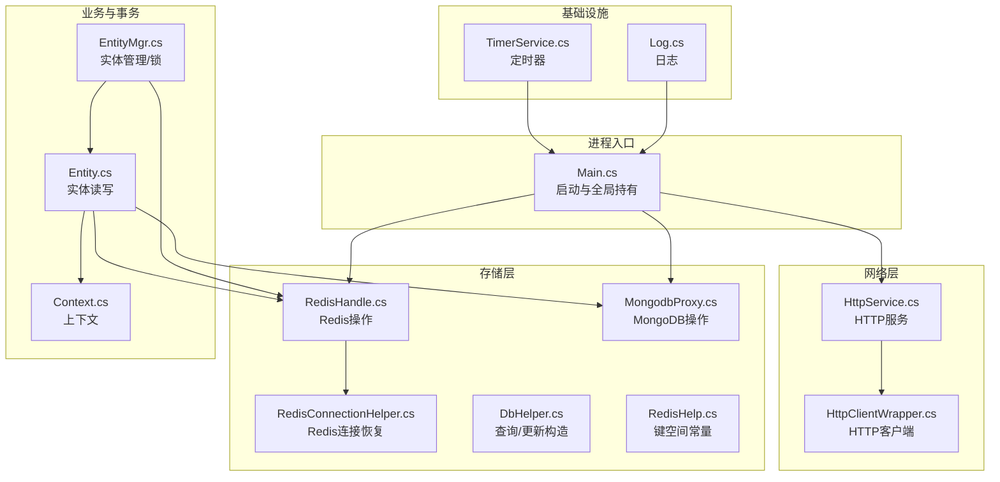
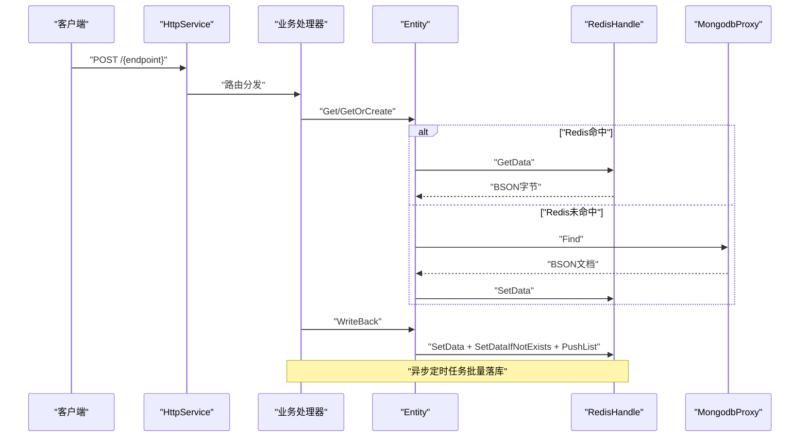
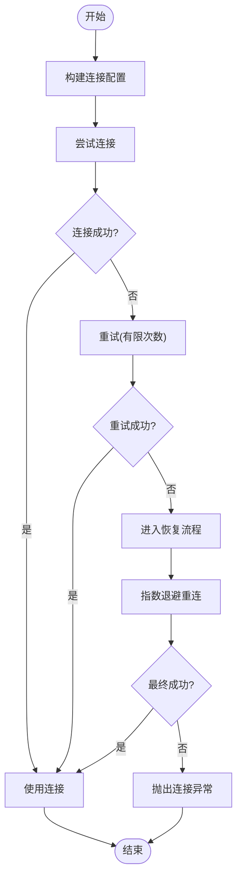
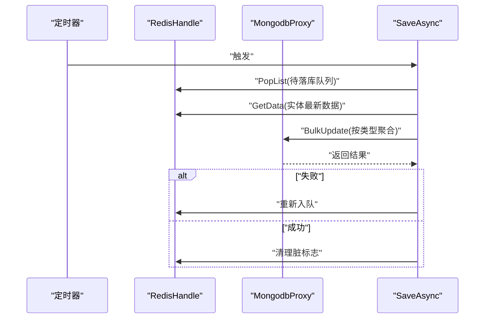
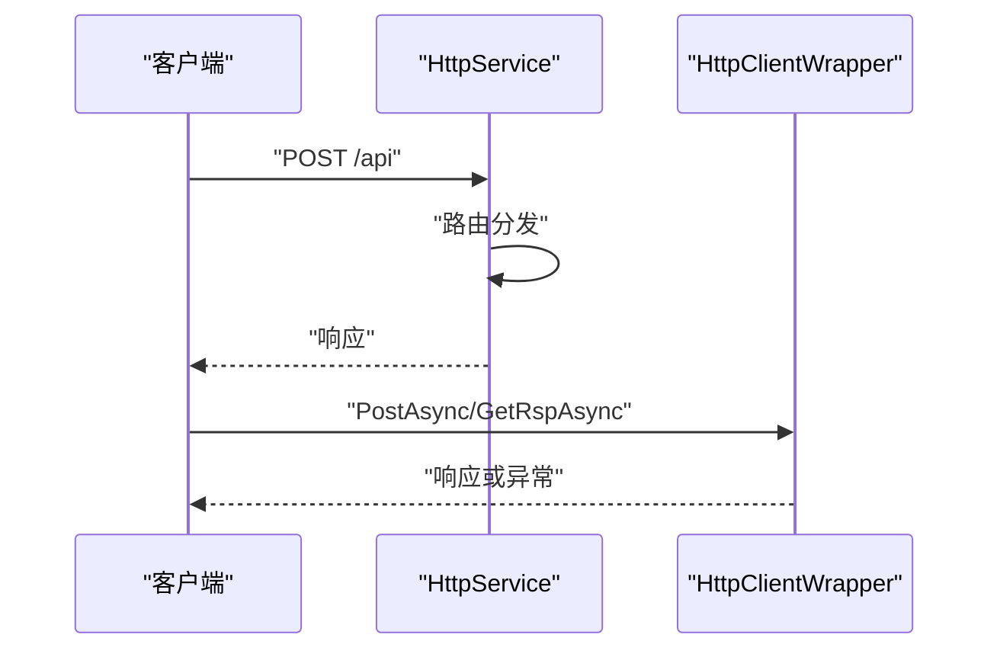
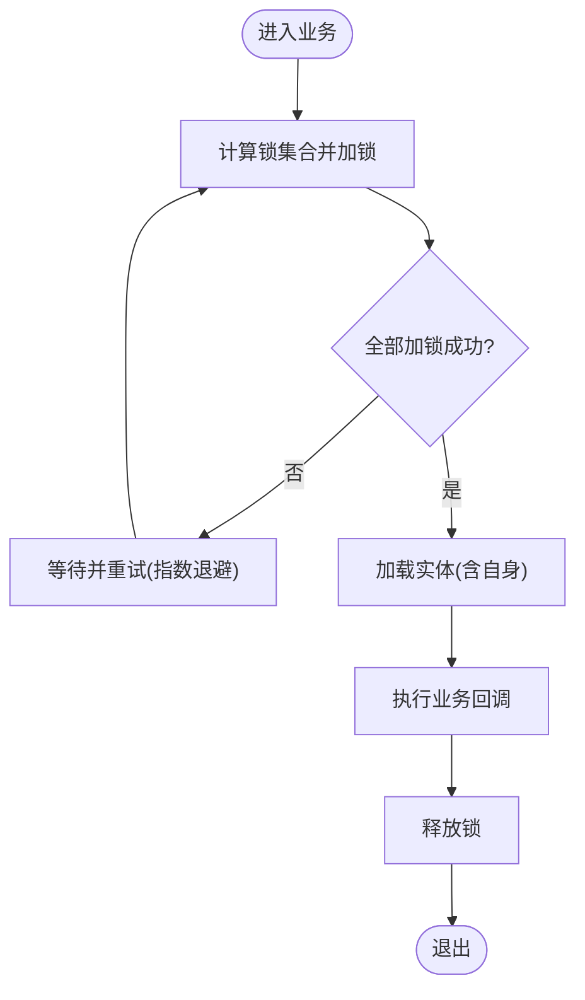
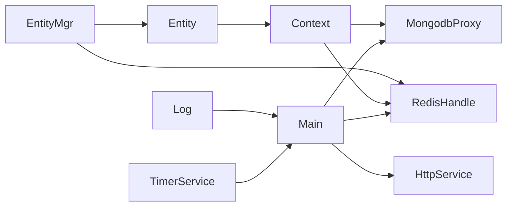

# 常见问题解答

<cite>
**本文引用的文件**   
- [Main.cs](file://lgbf/hub/Main.cs)
- [Context.cs](file://lgbf/hub/Context.cs)
- [Entity.cs](file://lgbf/hub/Entity.cs)
- [EntityMgr.cs](file://lgbf/hub/EntityMgr.cs)
- [RedisConnectionHelper.cs](file://lgbf/hub/RedisConnectionHelper.cs)
- [RedisHandle.cs](file://lgbf/hub/RedisHandle.cs)
- [RedisHelp.cs](file://lgbf/hub/RedisHelp.cs)
- [MongodbProxy.cs](file://lgbf/hub/MongodbProxy.cs)
- [DbHelper.cs](file://lgbf/hub/DbHelper.cs)
- [HttpService.cs](file://lgbf/hub/HttpService.cs)
- [HttpClientWrapper.cs](file://lgbf/hub/HttpClientWrapper.cs)
- [TimerService.cs](file://lgbf/hub/TimerService.cs)
- [Log.cs](file://lgbf/hub/Log.cs)
- [README.md](file://README.md)
</cite>

## 目录
1. [简介](#简介)
2. [项目结构](#项目结构)
3. [核心组件](#核心组件)
4. [架构总览](#架构总览)
5. [详细组件分析](#详细组件分析)
6. [依赖关系分析](#依赖关系分析)
7. [性能与稳定性考量](#性能与稳定性考量)
8. [故障排查指南](#故障排查指南)
9. [结论](#结论)
10. [附录：快速检查清单](#附录：快速检查清单)

## 简介
本文件面向一线开发者与运维人员，系统性梳理LGBF（轻量级游戏后端框架）在运行过程中常见的连接失败、认证错误、数据访问异常等问题，并给出可操作的诊断步骤、根因定位与修复建议。内容覆盖Redis连接超时、MongoDB连接异常、HTTP请求失败等典型场景，同时提供配置错误的常见陷阱与修正方案，以及“快速检查清单”，帮助快速定位问题根源。

## 项目结构
LGBF后端由以下关键模块组成：
- 启动与服务入口：Main负责初始化Redis、MongoDB与HTTP服务
- 数据访问层：RedisHandle/MongodbProxy封装底层连接与操作
- 实体与事务：Entity/EntityMgr实现实体读写、分布式锁与批量落库
- 网络与日志：HttpService提供HTTP接口；Log统一输出日志
- 工具与定时器：TimerService提供周期任务调度；DbHelper/RedisHelp提供查询与键空间常量

图表来源
- [Main.cs:31-40](file://lgbf/hub/Main.cs#L31-L40)
- [HttpService.cs:117-182](file://lgbf/hub/HttpService.cs#L117-L182)
- [RedisHandle.cs](file://lgbf/hub/RedisHandle.cs)
- [RedisConnectionHelper.cs:35-54](file://lgbf/hub/RedisConnectionHelper.cs#L35-L54)
- [MongodbProxy.cs:10-28](file://lgbf/hub/MongodbProxy.cs#L10-L28)
- [Entity.cs:94-154](file://lgbf/hub/Entity.cs#L94-L154)
- [EntityMgr.cs:44-128](file://lgbf/hub/EntityMgr.cs#L44-L128)
- [TimerService.cs:7-126](file://lgbf/hub/TimerService.cs#L7-L126)
- [Log.cs:6-113](file://lgbf/hub/Log.cs#L6-L113)

章节来源
- [Main.cs:31-40](file://lgbf/hub/Main.cs#L31-L40)
- [README.md:1-3](file://README.md#L1-L3)

## 核心组件
- 全局配置与启动
  - 配置项包括监听地址、端口、Redis连接串与密码、MongoDB连接串
  - 启动时初始化RedisHandle与MongodbProxy，并注册定时保存任务与HTTP服务
- 上下文与实体
  - Context封装当前会话的Redis、MongoDB与定时器实例
  - Entity支持从Redis或MongoDB加载/写回，写回时标记脏标志并入队批量落库
- 存储访问
  - RedisHandle封装常用操作；RedisConnectionHelper负责连接建立与异常恢复
  - MongodbProxy封装插入、更新、批量更新、查询、计数、删除等
- 网络与日志
  - HttpService基于Kestrel提供HTTP接口；HttpClientWrapper封装HTTP客户端调用
  - Log统一输出日志并按大小轮转

章节来源
- [Main.cs:4-11](file://lgbf/hub/Main.cs#L4-L11)
- [Main.cs:31-40](file://lgbf/hub/Main.cs#L31-L40)
- [Context.cs:4-26](file://lgbf/hub/Context.cs#L4-L26)
- [Entity.cs:94-154](file://lgbf/hub/Entity.cs#L94-L154)
- [RedisHandle.cs](file://lgbf/hub/RedisHandle.cs)
- [RedisConnectionHelper.cs:26-33](file://lgbf/hub/RedisConnectionHelper.cs#L26-L33)
- [MongodbProxy.cs:10-28](file://lgbf/hub/MongodbProxy.cs#L10-L28)
- [HttpService.cs:117-182](file://lgbf/hub/HttpService.cs#L117-L182)
- [HttpClientWrapper.cs:4-48](file://lgbf/hub/HttpClientWrapper.cs#L4-L48)
- [Log.cs:6-113](file://lgbf/hub/Log.cs#L6-L113)

## 架构总览
LGBF采用“HTTP入口 + Redis缓存 + MongoDB持久化”的分层架构。业务通过HTTP接入，实体数据优先从Redis读取，未命中则回源MongoDB；写回时先写Redis并标记脏标志，随后由定时任务批量同步到MongoDB。

图表来源
- [HttpService.cs:50-114](file://lgbf/hub/HttpService.cs#L50-L114)
- [Entity.cs:104-153](file://lgbf/hub/Entity.cs#L104-L153)
- [RedisHandle.cs](file://lgbf/hub/RedisHandle.cs)
- [MongodbProxy.cs:143-184](file://lgbf/hub/MongodbProxy.cs#L143-L184)
- [Main.cs:50-157](file://lgbf/hub/Main.cs#L50-L157)

## 详细组件分析

### Redis连接与恢复机制
- 连接参数
  - 支持无密码与带密码两种配置
  - 关键参数：connectRetry、connectTimeout、keepAlive、resolveDns、name
- 异常恢复
  - 发生连接异常时自动重试，指数退避上限控制
  - 并发恢复互斥，避免重复重建
- 常见问题
  - 连接字符串格式错误、密码不匹配、DNS解析失败、目标不可达
  - 超时阈值过低导致频繁抖动

图表来源
- [RedisConnectionHelper.cs:130-142](file://lgbf/hub/RedisConnectionHelper.cs#L130-L142)
- [RedisConnectionHelper.cs:56-127](file://lgbf/hub/RedisConnectionHelper.cs#L56-L127)

章节来源
- [RedisConnectionHelper.cs:26-33](file://lgbf/hub/RedisConnectionHelper.cs#L26-L33)
- [RedisConnectionHelper.cs:35-54](file://lgbf/hub/RedisConnectionHelper.cs#L35-L54)
- [RedisConnectionHelper.cs:56-127](file://lgbf/hub/RedisConnectionHelper.cs#L56-L127)
- [RedisConnectionHelper.cs:130-142](file://lgbf/hub/RedisConnectionHelper.cs#L130-L142)

### MongoDB连接与批量写入
- 连接
  - 使用MongoUrl解析连接串，创建MongoClient
- 操作
  - 插入、更新、批量更新、查找、计数、删除、自增获取Guid
- 批量写入
  - 将多条更新组装为UpdateOneModel，非有序批量写入，提升吞吐

图表来源
- [Main.cs:50-157](file://lgbf/hub/Main.cs#L50-L157)
- [MongodbProxy.cs:102-120](file://lgbf/hub/MongodbProxy.cs#L102-L120)
- [RedisHandle.cs](file://lgbf/hub/RedisHandle.cs)

章节来源
- [MongodbProxy.cs:14-28](file://lgbf/hub/MongodbProxy.cs#L14-L28)
- [MongodbProxy.cs:76-120](file://lgbf/hub/MongodbProxy.cs#L76-L120)
- [Main.cs:50-157](file://lgbf/hub/Main.cs#L50-L157)

### HTTP服务与客户端
- HTTP服务
  - 基于Kestrel，限制并发连接与保活超时；支持跨域头部
  - 统一接收请求体，回调处理完成后响应
- HTTP客户端
  - 默认3秒超时；对HttpRequestException进行记录与上抛

图表来源
- [HttpService.cs:117-182](file://lgbf/hub/HttpService.cs#L117-L182)
- [HttpClientWrapper.cs:12-47](file://lgbf/hub/HttpClientWrapper.cs#L12-L47)

章节来源
- [HttpService.cs:117-182](file://lgbf/hub/HttpService.cs#L117-L182)
- [HttpClientWrapper.cs:4-48](file://lgbf/hub/HttpClientWrapper.cs#L4-L48)

### 实体读写与分布式锁
- 读写
  - 优先从Redis读取；未命中则回源MongoDB并写回Redis
  - 写回时设置数据与脏标志位，并将实体加入待落库队列
- 分布式锁
  - 多实体联合加锁，失败重试并指数退避
  - 后台定期续期，避免锁过期

图表来源
- [EntityMgr.cs:44-128](file://lgbf/hub/EntityMgr.cs#L44-L128)
- [Entity.cs:104-153](file://lgbf/hub/Entity.cs#L104-L153)

章节来源
- [Entity.cs:94-154](file://lgbf/hub/Entity.cs#L94-L154)
- [EntityMgr.cs:44-128](file://lgbf/hub/EntityMgr.cs#L44-L128)

## 依赖关系分析
- 组件耦合
  - Main持有全局RedisHandle与MongodbProxy，供各业务使用
  - Entity/EntityMgr依赖Context，Context再依赖Main持有的全局实例
  - 定时器驱动批量落库流程
- 外部依赖
  - Redis：StackExchange.Redis
  - MongoDB：MongoDB.Driver
  - HTTP：ASP.NET Core Kestrel
- 潜在风险
  - Redis/MongoDB连接异常未恢复会导致批量落库停滞
  - HTTP超时或异常未捕获会影响客户端体验

图表来源
- [Main.cs:18-26](file://lgbf/hub/Main.cs#L18-L26)
- [Context.cs:11-20](file://lgbf/hub/Context.cs#L11-L20)
- [Entity.cs:94-102](file://lgbf/hub/Entity.cs#L94-L102)
- [EntityMgr.cs:44-51](file://lgbf/hub/EntityMgr.cs#L44-L51)
- [TimerService.cs:7-35](file://lgbf/hub/TimerService.cs#L7-L35)
- [Log.cs:6-113](file://lgbf/hub/Log.cs#L6-L113)

章节来源
- [Main.cs:18-26](file://lgbf/hub/Main.cs#L18-L26)
- [Context.cs:11-20](file://lgbf/hub/Context.cs#L11-L20)
- [Entity.cs:94-102](file://lgbf/hub/Entity.cs#L94-L102)
- [EntityMgr.cs:44-51](file://lgbf/hub/EntityMgr.cs#L44-L51)
- [TimerService.cs:7-35](file://lgbf/hub/TimerService.cs#L7-L35)
- [Log.cs:6-113](file://lgbf/hub/Log.cs#L6-L113)

## 性能与稳定性考量
- Redis/MongoDB批量写入采用非有序批量，降低尾延迟
- 定时器周期性触发落库，避免瞬时高峰
- HTTP服务限制并发与保活超时，防止资源耗尽
- 日志按大小轮转，避免磁盘膨胀

章节来源
- [MongodbProxy.cs:118-120](file://lgbf/hub/MongodbProxy.cs#L118-L120)
- [HttpService.cs:154-160](file://lgbf/hub/HttpService.cs#L154-L160)
- [Log.cs:85-97](file://lgbf/hub/Log.cs#L85-L97)

## 故障排查指南

### 一、连接失败类问题

1) Redis连接失败
- 现象
  - 启动即报连接异常；运行中偶发断连后无法恢复
- 可能原因
  - 连接字符串格式错误、密码不匹配、DNS解析失败、网络不可达
  - 连接超时阈值过低、keepAlive配置不当
- 排查步骤
  - 检查配置中的RedisUrl与RedisPwd是否正确
  - 使用工具验证Redis可达性与认证
  - 查看日志中“Recover retry failed”“Recover failed”等关键字
- 修复建议
  - 调整connectRetry/connectTimeout/keepAlive参数
  - 在防火墙/安全组放通目标端口
  - 如使用密码，确认连接串包含password参数

章节来源
- [RedisConnectionHelper.cs:35-54](file://lgbf/hub/RedisConnectionHelper.cs#L35-L54)
- [RedisConnectionHelper.cs:56-127](file://lgbf/hub/RedisConnectionHelper.cs#L56-L127)
- [RedisConnectionHelper.cs:130-142](file://lgbf/hub/RedisConnectionHelper.cs#L130-L142)

2) MongoDB连接异常
- 现象
  - 初始化MongoClient失败；批量写入返回false
- 可能原因
  - 连接串格式错误、认证失败、网络不可达
- 排查步骤
  - 校验MongoUrl格式；确认数据库凭据
  - 观察日志中“create_index failed”“check_int_guid db...”等错误
- 修复建议
  - 修正连接串；确保网络连通与权限正确

章节来源
- [MongodbProxy.cs:14-18](file://lgbf/hub/MongodbProxy.cs#L14-L18)
- [MongodbProxy.cs:35-53](file://lgbf/hub/MongodbProxy.cs#L35-L53)

3) HTTP请求失败
- 现象
  - 客户端收到非2xx状态码；请求超时或网络错误
- 可能原因
  - 服务端未正确处理回调；客户端超时过短
- 排查步骤
  - 检查HttpService回调注册与路由分发
  - 查看日志中“Timeout: elapsed_ticks=...”“Response Exception”
  - 客户端侧检查HttpClientWrapper的超时设置
- 修复建议
  - 优化业务处理耗时；适当提高客户端超时时间

章节来源
- [HttpService.cs:50-114](file://lgbf/hub/HttpService.cs#L50-L114)
- [HttpService.cs:154-160](file://lgbf/hub/HttpService.cs#L154-L160)
- [HttpClientWrapper.cs:9-10](file://lgbf/hub/HttpClientWrapper.cs#L9-L10)

### 二、认证错误类问题

- 现象
  - Redis/MongoDB返回认证失败
- 排查步骤
  - 确认配置中的密码字段与实际一致
  - 检查连接串是否包含password参数
- 修复建议
  - 更新配置并重启服务

章节来源
- [RedisConnectionHelper.cs:139-141](file://lgbf/hub/RedisConnectionHelper.cs#L139-L141)
- [MongodbProxy.cs:16](file://lgbf/hub/MongodbProxy.cs#L16)

### 三、数据访问异常类问题

1) 写回失败
- 现象
  - 写回抛出异常；日志出现“entity write back failed”
- 可能原因
  - Redis写入失败；入队失败
- 排查步骤
  - 检查Redis连接状态与可用性
  - 查看队列长度与入队返回值
- 修复建议
  - 恢复Redis连接；必要时重建队列

章节来源
- [Entity.cs:58-91](file://lgbf/hub/Entity.cs#L58-L91)

2) 批量落库失败
- 现象
  - SaveAsync日志提示“Save mongodb error”，部分实体重新入队
- 可能原因
  - MongoDB批量写入失败；集合不存在或索引冲突
- 排查步骤
  - 检查集合是否存在与索引创建情况
  - 查看日志中“create_index failed”
- 修复建议
  - 手动创建缺失索引；修复冲突键

章节来源
- [Main.cs:125-134](file://lgbf/hub/Main.cs#L125-L134)
- [MongodbProxy.cs:35-53](file://lgbf/hub/MongodbProxy.cs#L35-L53)

3) 查询/更新构造错误
- 现象
  - 条件构造异常或空文档
- 可能原因
  - 同时设置了多种更新方式；未设置任何更新字段
- 排查步骤
  - 检查UpdateDataHelper/DBQueryHelper的调用链
- 修复建议
  - 遵循单一更新模式；确保至少设置一个更新字段

章节来源
- [DbHelper.cs:6-69](file://lgbf/hub/DbHelper.cs#L6-L69)
- [DbHelper.cs:71-157](file://lgbf/hub/DbHelper.cs#L71-L157)
- [DbHelper.cs:160-311](file://lgbf/hub/DbHelper.cs#L160-L311)

### 四、配置错误类问题

- 常见场景
  - RedisUrl/MongoUrl格式错误；RedisPwd为空但连接串要求密码
  - HTTP监听端口被占用；跨域头未正确设置
- 修复建议
  - 逐项核对配置文件；确保与环境一致
  - 重启服务以应用新配置

章节来源
- [Main.cs:4-11](file://lgbf/hub/Main.cs#L4-L11)
- [Main.cs:31-40](file://lgbf/hub/Main.cs#L31-L40)
- [HttpService.cs:134-137](file://lgbf/hub/HttpService.cs#L134-L137)

## 结论
通过对LGBF核心模块的深入分析，可以发现其在连接恢复、批量写入、HTTP服务与日志等方面具备完善的容错与可观测性设计。针对连接失败、认证错误与数据访问异常等典型问题，建议优先从配置校验、网络连通性与连接参数调整入手，结合日志定位根因，必要时通过指数退避与限流策略提升稳定性。

## 附录：快速检查清单

- 启动与连接
  - Redis/MongoDB连接串与凭据是否正确
  - DNS解析与网络连通性是否正常
  - 连接超时、重试与保活参数是否合理
- 写回与落库
  - Redis写入与入队是否成功
  - 批量落库是否持续推进；失败后是否重新入队
- HTTP服务
  - 路由与回调是否正确注册
  - 跨域头是否完整；客户端超时是否足够
- 日志与监控
  - 是否存在“Recover failed”“Save mongodb error”“Response Exception”等关键字
  - 日志文件是否按大小轮转