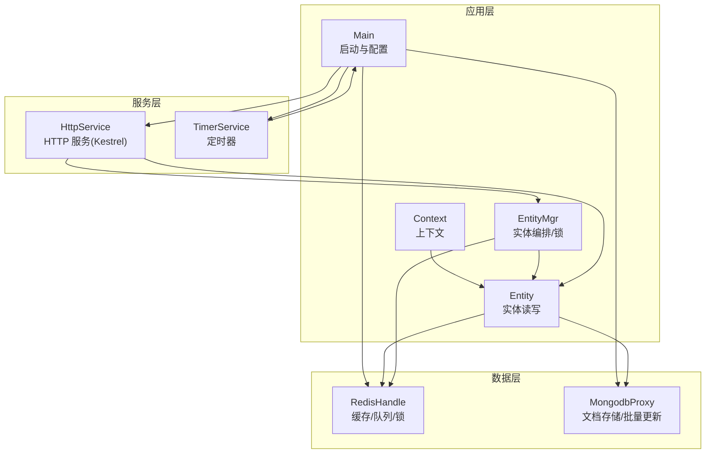
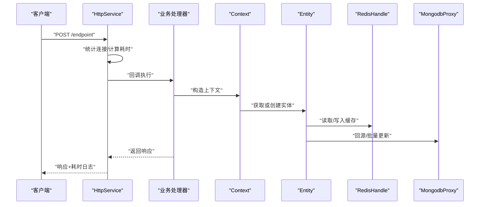
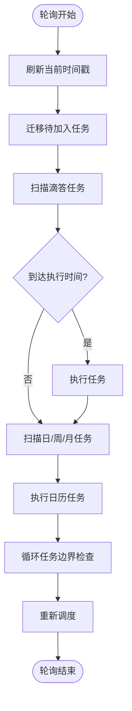
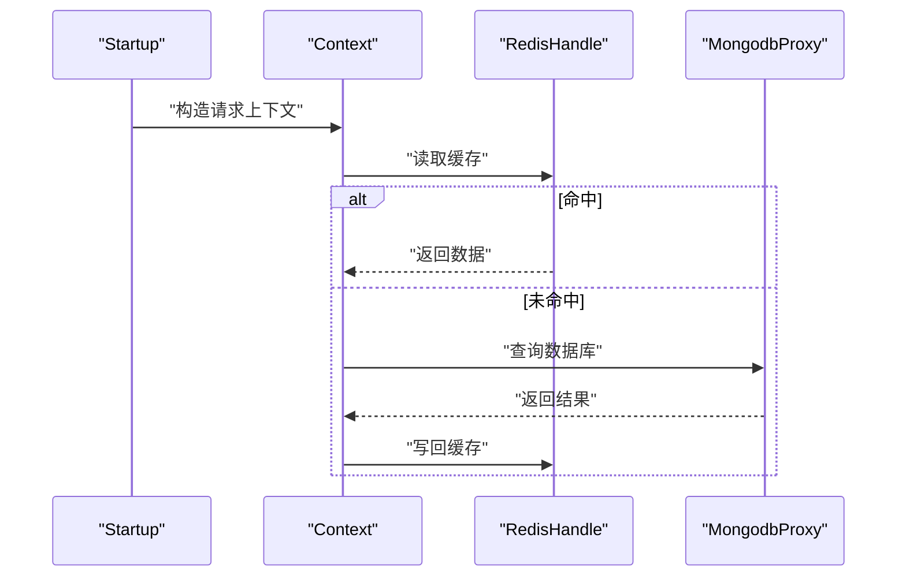
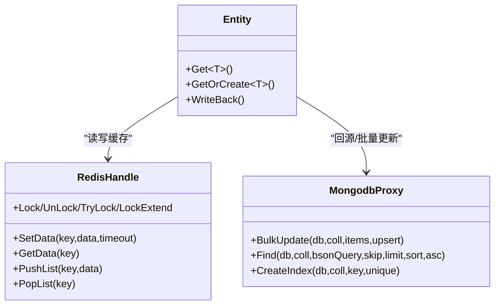
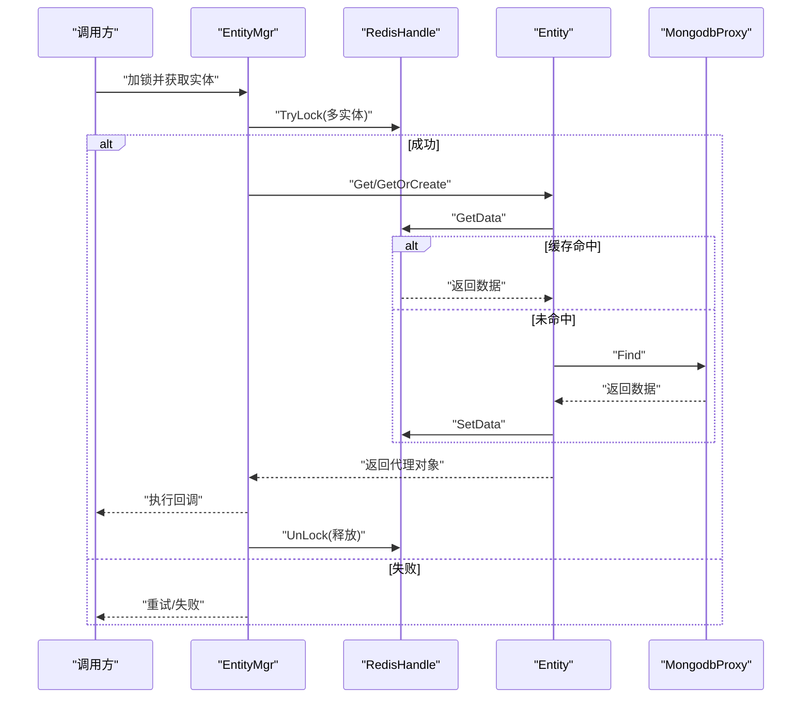
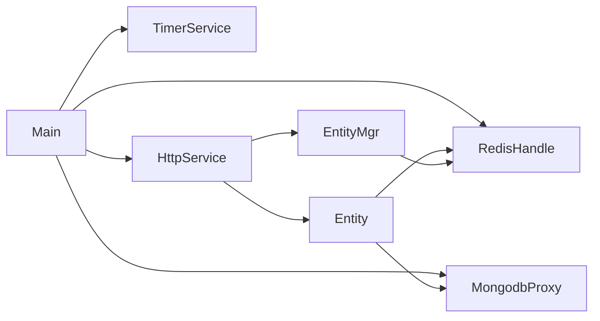

# 性能监控与诊断

<cite>
**本文引用的文件**   
- [Main.cs](file://lgbf/hub/Main.cs)
- [TimerService.cs](file://lgbf/hub/TimerService.cs)
- [TimerService.Tick.cs](file://lgbf/hub/TimerService.Tick.cs)
- [TimerService.Calendar.cs](file://lgbf/hub/TimerService.Calendar.cs)
- [TimerService.LoopCalendar.cs](file://lgbf/hub/TimerService.LoopCalendar.cs)
- [TimerService.Keys.cs](file://lgbf/hub/TimerService.Keys.cs)
- [TimerService.State.cs](file://lgbf/hub/TimerService.State.cs)
- [HttpService.cs](file://lgbf/hub/HttpService.cs)
- [Context.cs](file://lgbf/hub/Context.cs)
- [Entity.cs](file://lgbf/hub/Entity.cs)
- [EntityMgr.cs](file://lgbf/hub/EntityMgr.cs)
- [RedisHandle.cs](file://lgbf/hub/RedisHandle.cs)
- [MongodbProxy.cs](file://lgbf/hub/MongodbProxy.cs)
- [RedisHelp.cs](file://lgbf/hub/RedisHelp.cs)
- [Log.cs](file://lgbf/hub/Log.cs)
</cite>

## 目录
1. [简介](#简介)
2. [项目结构](#项目结构)
3. [核心组件](#核心组件)
4. [架构总览](#架构总览)
5. [详细组件分析](#详细组件分析)
6. [依赖关系分析](#依赖关系分析)
7. [性能考量](#性能考量)
8. [故障排查指南](#故障排查指南)
9. [结论](#结论)
10. [附录](#附录)

## 简介
本指南围绕 LGBF 系统的性能监控与诊断展开，聚焦以下目标：
- 关键性能指标（响应时间、吞吐量、并发数、资源利用率）的定义与测量方法
- 定时任务系统的性能监控与优化策略
- 内存使用、CPU 占用与 GC 影响的评估路径
- 缓存命中率、数据库查询性能与网络延迟的监控技巧
- 性能基准测试设计与实施
- 性能瓶颈识别与优化步骤
- 压力测试与容量规划最佳实践
- 确保系统性能问题可被及时发现与有效改善

## 项目结构
LGBF 后端采用 C#/.NET 技术栈，核心由以下模块组成：
- 入口与配置：Main 负责启动、初始化外部服务与定时器，并注册周期性保存任务
- 定时任务系统：TimerService 提供毫秒级轮询与日历型定时能力，支持一次性与循环调度
- Web 服务：基于 Kestrel 的 HTTP 服务，内置连接统计与超时告警
- 数据访问：RedisHandle 封装 Redis 操作；MongodbProxy 封装 MongoDB 批量写入与查询
- 实体与锁：Entity/EntityMgr 提供实体读取、写回与分布式锁管理
- 日志：Log 提供统一日志输出与按时间滚动的文件管理

图表来源
- [Main.cs:31-40](file://lgbf/hub/Main.cs#L31-L40)
- [HttpService.cs:117-182](file://lgbf/hub/HttpService.cs#L117-L182)
- [TimerService.cs:68-96](file://lgbf/hub/TimerService.cs#L68-L96)
- [RedisHandle.cs:21-25](file://lgbf/hub/RedisHandle.cs#L21-L25)
- [MongodbProxy.cs:14-18](file://lgbf/hub/MongodbProxy.cs#L14-L18)

章节来源
- [Main.cs:31-40](file://lgbf/hub/Main.cs#L31-L40)
- [HttpService.cs:117-182](file://lgbf/hub/HttpService.cs#L117-L182)
- [TimerService.cs:68-96](file://lgbf/hub/TimerService.cs#L68-L96)
- [RedisHandle.cs:21-25](file://lgbf/hub/RedisHandle.cs#L21-L25)
- [MongodbProxy.cs:14-18](file://lgbf/hub/MongodbProxy.cs#L14-L18)

## 核心组件
- 定时任务系统（TimerService）
  - 轮询间隔：固定轮询，避免高精度计时器开销
  - 调度类型：按“滴答”触发的一次性任务；按“日/周/月”时分秒触发的日历型任务；按“日/周”循环的循环型任务
  - 并发控制：内部互斥与“正在轮询”标记，避免重入
- HTTP 服务（HttpService）
  - 连接统计：每秒统计消息数量，辅助评估吞吐
  - 超时检测：请求处理耗时超过阈值记录错误日志
  - 配置上限：最大并发连接、保活超时、HTTP/1&2
- 数据访问（RedisHandle / MongodbProxy）
  - Redis：封装字符串、列表、有序集合、哈希、分布式锁等常用操作，统一异常恢复与重试策略
  - MongoDB：批量写入、查询、索引创建、自增 GUID 等
- 实体与锁（Entity / EntityMgr）
  - 实体读写：优先从 Redis 获取，缺失则回源 MongoDB；写回时标记脏位并入队持久化
  - 分布式锁：多实体联合加锁，支持续期与自动解锁
- 日志（Log）
  - 时间戳与级别输出，文件大小滚动，便于性能问题定位

章节来源
- [TimerService.cs:9-126](file://lgbf/hub/TimerService.cs#L9-L126)
- [TimerService.Tick.cs:31-76](file://lgbf/hub/TimerService.Tick.cs#L31-L76)
- [TimerService.Calendar.cs:24-67](file://lgbf/hub/TimerService.Calendar.cs#L24-L67)
- [TimerService.LoopCalendar.cs:63-138](file://lgbf/hub/TimerService.LoopCalendar.cs#L63-L138)
- [HttpService.cs:40-115](file://lgbf/hub/HttpService.cs#L40-L115)
- [RedisHandle.cs:36-109](file://lgbf/hub/RedisHandle.cs#L36-L109)
- [MongodbProxy.cs:102-120](file://lgbf/hub/MongodbProxy.cs#L102-L120)
- [Entity.cs:94-154](file://lgbf/hub/Entity.cs#L94-L154)
- [EntityMgr.cs:44-126](file://lgbf/hub/EntityMgr.cs#L44-L126)
- [Log.cs:19-101](file://lgbf/hub/Log.cs#L19-L101)

## 架构总览
下图展示请求在系统中的流转与关键性能观测点：

图表来源
- [HttpService.cs:50-114](file://lgbf/hub/HttpService.cs#L50-L114)
- [Context.cs:11-26](file://lgbf/hub/Context.cs#L11-L26)
- [Entity.cs:104-135](file://lgbf/hub/Entity.cs#L104-L135)
- [RedisHandle.cs:159-174](file://lgbf/hub/RedisHandle.cs#L159-L174)
- [MongodbProxy.cs:102-120](file://lgbf/hub/MongodbProxy.cs#L102-L120)

## 详细组件分析

### 定时任务系统（性能监控与优化）
- 设计要点
  - 固定轮询间隔，降低系统调用频率与 CPU 开销
  - 多种调度粒度：滴答、日/周/月时分秒、循环日/周
  - 并发安全：互斥锁与“正在轮询”标志，避免重入
- 性能监控建议
  - 记录每次轮询耗时与触发任务数量，形成“轮询负载曲线”
  - 对高频日历型任务进行去抖与合并，减少重复触发
  - 使用“一次性任务 + 合理间隔”替代过于频繁的循环任务
- 优化策略
  - 将长耗时任务拆分为多个短任务，分批执行
  - 对需要跨天/周的任务，使用循环型任务并在边界重排，避免重复扫描
  - 为关键任务设置超时与失败重试上限，防止雪崩

图表来源
- [TimerService.cs:120-125](file://lgbf/hub/TimerService.cs#L120-L125)
- [TimerService.Tick.cs:31-76](file://lgbf/hub/TimerService.Tick.cs#L31-L76)
- [TimerService.Calendar.cs:24-67](file://lgbf/hub/TimerService.Calendar.cs#L24-L67)
- [TimerService.LoopCalendar.cs:63-138](file://lgbf/hub/TimerService.LoopCalendar.cs#L63-L138)

章节来源
- [TimerService.cs:9-126](file://lgbf/hub/TimerService.cs#L9-L126)
- [TimerService.Tick.cs:31-76](file://lgbf/hub/TimerService.Tick.cs#L31-L76)
- [TimerService.Calendar.cs:24-67](file://lgbf/hub/TimerService.Calendar.cs#L24-L67)
- [TimerService.LoopCalendar.cs:63-138](file://lgbf/hub/TimerService.LoopCalendar.cs#L63-L138)

### HTTP 服务（响应时间与吞吐量）
- 关键观测
  - 每秒消息统计：用于评估瞬时吞吐
  - 请求处理耗时：超过阈值记录错误日志，便于识别慢请求
  - 连接限制与保活：避免连接堆积导致资源耗尽
- 监控与优化
  - 结合 Nginx/Apache Bench/JMeter 做压测，记录 P50/P95/P99 响应时间
  - 通过限流与熔断保护下游（Redis/Mongo），避免级联故障
  - 启用 HTTP/2 与连接复用，降低握手开销

图表来源
- [HttpService.cs:50-114](file://lgbf/hub/HttpService.cs#L50-L114)
- [Entity.cs:104-135](file://lgbf/hub/Entity.cs#L104-L135)
- [RedisHandle.cs:159-174](file://lgbf/hub/RedisHandle.cs#L159-L174)
- [MongodbProxy.cs:143-184](file://lgbf/hub/MongodbProxy.cs#L143-L184)

章节来源
- [HttpService.cs:40-115](file://lgbf/hub/HttpService.cs#L40-L115)

### 数据访问（Redis/Mongo）
- Redis
  - 统一异常恢复与指数退避重试，避免瞬时抖动放大
  - 列表操作用于脏数据队列，批量消费提升吞吐
  - 分布式锁用于多实体一致性，需配合续期任务
- MongoDB
  - 批量写入关闭顺序写，提高吞吐
  - 查询时使用投影与排序参数，避免不必要的字段传输
- 监控建议
  - 记录 Redis/Mongo 操作耗时与成功率，绘制 P95/P99
  - 观察队列长度与积压，作为背压信号

图表来源
- [RedisHandle.cs:84-109](file://lgbf/hub/RedisHandle.cs#L84-L109)
- [RedisHandle.cs:257-303](file://lgbf/hub/RedisHandle.cs#L257-L303)
- [RedisHandle.cs:305-394](file://lgbf/hub/RedisHandle.cs#L305-L394)
- [MongodbProxy.cs:102-120](file://lgbf/hub/MongodbProxy.cs#L102-L120)
- [MongodbProxy.cs:143-184](file://lgbf/hub/MongodbProxy.cs#L143-L184)
- [Entity.cs:52-92](file://lgbf/hub/Entity.cs#L52-L92)

章节来源
- [RedisHandle.cs:36-109](file://lgbf/hub/RedisHandle.cs#L36-L109)
- [RedisHandle.cs:257-303](file://lgbf/hub/RedisHandle.cs#L257-L303)
- [RedisHandle.cs:305-394](file://lgbf/hub/RedisHandle.cs#L305-L394)
- [MongodbProxy.cs:102-120](file://lgbf/hub/MongodbProxy.cs#L102-L120)
- [MongodbProxy.cs:143-184](file://lgbf/hub/MongodbProxy.cs#L143-L184)
- [Entity.cs:52-92](file://lgbf/hub/Entity.cs#L52-L92)

### 实体与锁（一致性与性能）
- 读写路径
  - 优先从 Redis 获取，缺失则回源 MongoDB，并写回缓存
  - 写回时设置脏标志并入队，异步批量持久化
- 锁策略
  - 多实体联合加锁，避免死锁；支持续期任务
  - 解锁在 finally 中执行，保证释放
- 性能建议
  - 将热点实体常驻缓存，减少回源次数
  - 对批量写回任务进行分组与去重，避免重复持久化

图表来源
- [EntityMgr.cs:44-126](file://lgbf/hub/EntityMgr.cs#L44-L126)
- [Entity.cs:104-135](file://lgbf/hub/Entity.cs#L104-L135)
- [RedisHandle.cs:159-174](file://lgbf/hub/RedisHandle.cs#L159-L174)
- [MongodbProxy.cs:143-184](file://lgbf/hub/MongodbProxy.cs#L143-L184)

章节来源
- [EntityMgr.cs:44-126](file://lgbf/hub/EntityMgr.cs#L44-L126)
- [Entity.cs:104-135](file://lgbf/hub/Entity.cs#L104-L135)

## 依赖关系分析
- 组件耦合
  - Main 依赖 TimerService、RedisHandle、MongodbProxy、HttpService
  - Entity/EntityMgr 依赖 RedisHandle 与 MongodbProxy
  - HttpService 通过回调与业务解耦
- 外部依赖
  - Kestrel（HTTP）、StackExchange.Redis（Redis）、MongoDB.Driver（Mongo）
- 潜在风险
  - Redis/Mongo 异常恢复链路复杂，需关注重试与退避策略
  - 定时任务若阻塞轮询，可能引发后续任务堆积

图表来源
- [Main.cs:31-40](file://lgbf/hub/Main.cs#L31-L40)
- [Entity.cs:94-154](file://lgbf/hub/Entity.cs#L94-L154)
- [EntityMgr.cs:44-126](file://lgbf/hub/EntityMgr.cs#L44-L126)
- [HttpService.cs:117-182](file://lgbf/hub/HttpService.cs#L117-L182)

章节来源
- [Main.cs:31-40](file://lgbf/hub/Main.cs#L31-L40)
- [Entity.cs:94-154](file://lgbf/hub/Entity.cs#L94-L154)
- [EntityMgr.cs:44-126](file://lgbf/hub/EntityMgr.cs#L44-L126)
- [HttpService.cs:117-182](file://lgbf/hub/HttpService.cs#L117-L182)

## 性能考量
- 响应时间
  - 以 HttpService 的请求处理耗时为观测指标，结合 Nginx/JMeter 压测，记录 P50/P95/P99
  - 对慢接口进行链路追踪与热点函数分析
- 吞吐量
  - 通过每秒消息统计与并发连接上限评估系统承载能力
  - 优化点：启用 HTTP/2、连接复用、批量写入、缓存命中
- 并发数
  - Kestrel 最大并发连接与保活超时需与业务峰值匹配
  - Redis/Mongo 连接池与超时设置需与并发相适配
- 资源利用率
  - CPU：关注定时轮询与序列化/反序列化开销
  - 内存：注意 JSON/BSON 序列化与缓冲池使用，避免碎片化
  - IO：Redis/Mongo 的批量与索引对磁盘/网络有显著影响

[本节为通用指导，不直接分析具体文件]

## 故障排查指南
- 日志定位
  - 使用 Log 输出带时间戳与堆栈信息的日志，结合文件滚动策略定位问题
  - 关注错误级别日志与超时告警
- Redis/Mongo 异常
  - 观察异常恢复与重试次数，必要时调整超时与重试策略
  - 检查队列长度与积压，作为背压信号
- 定时任务卡顿
  - 检查轮询是否被阻塞，确认“正在轮询”标志与互斥锁状态
  - 对长任务进行拆分与限频

章节来源
- [Log.cs:19-101](file://lgbf/hub/Log.cs#L19-L101)
- [RedisHandle.cs:27-34](file://lgbf/hub/RedisHandle.cs#L27-L34)
- [TimerService.cs:76-88](file://lgbf/hub/TimerService.cs#L76-L88)

## 结论
通过将“请求处理耗时/吞吐量/并发数/资源利用率”与“定时任务轮询/缓存命中/数据库批量写入/网络延迟”相结合，可以建立一套完整的性能监控体系。建议以压测驱动优化，持续迭代轮询策略、缓存策略与数据访问模式，确保系统在高负载下保持稳定与低延迟。

[本节为总结，不直接分析具体文件]

## 附录

### 关键性能指标定义与测量方法
- 响应时间
  - 定义：从接收请求到发送响应的总耗时
  - 测量：HttpService 中的耗时统计与日志输出
- 吞吐量
  - 定义：单位时间内处理的请求数
  - 测量：每秒消息统计与压测工具
- 并发数
  - 定义：同时处理的连接数
  - 测量：Kestrel 连接限制与实际连接数
- 资源利用率
  - 定义：CPU/内存/IO 使用情况
  - 测量：系统监控与应用内日志

章节来源
- [HttpService.cs:48-62](file://lgbf/hub/HttpService.cs#L48-L62)
- [HttpService.cs:108-112](file://lgbf/hub/HttpService.cs#L108-L112)

### 定时任务监控与优化策略
- 监控
  - 记录轮询耗时与触发任务数
  - 对高频日历型任务进行去抖与合并
- 优化
  - 拆分长任务、使用循环任务边界重排、设置超时与重试上限

章节来源
- [TimerService.Tick.cs:31-76](file://lgbf/hub/TimerService.Tick.cs#L31-L76)
- [TimerService.Calendar.cs:24-67](file://lgbf/hub/TimerService.Calendar.cs#L24-L67)
- [TimerService.LoopCalendar.cs:63-138](file://lgbf/hub/TimerService.LoopCalendar.cs#L63-L138)

### 缓存命中率、数据库查询与网络延迟监控
- 缓存命中率
  - 通过 Redis 操作命中/未命中计数计算
- 数据库查询
  - 使用投影与排序参数，记录查询耗时与返回条数
- 网络延迟
  - 结合压测工具与链路追踪，定位网络瓶颈

章节来源
- [RedisHandle.cs:159-174](file://lgbf/hub/RedisHandle.cs#L159-L174)
- [MongodbProxy.cs:143-184](file://lgbf/hub/MongodbProxy.cs#L143-L184)

### 性能基准测试设计与实施
- 设计
  - 明确指标（P50/P95/P99、吞吐、错误率）
  - 设定负载曲线（线性增长、峰值冲击、回归测试）
- 实施
  - 使用 JMeter/Apache Bench/自研压测工具
  - 采集系统与应用日志，进行对比分析

[本节为通用指导，不直接分析具体文件]

### 压力测试与容量规划最佳实践
- 压测
  - 逐步加压至系统临界点，记录拐点与异常
- 容量规划
  - 基于压测结果与成本评估，确定硬件与连接池配置

[本节为通用指导，不直接分析具体文件]