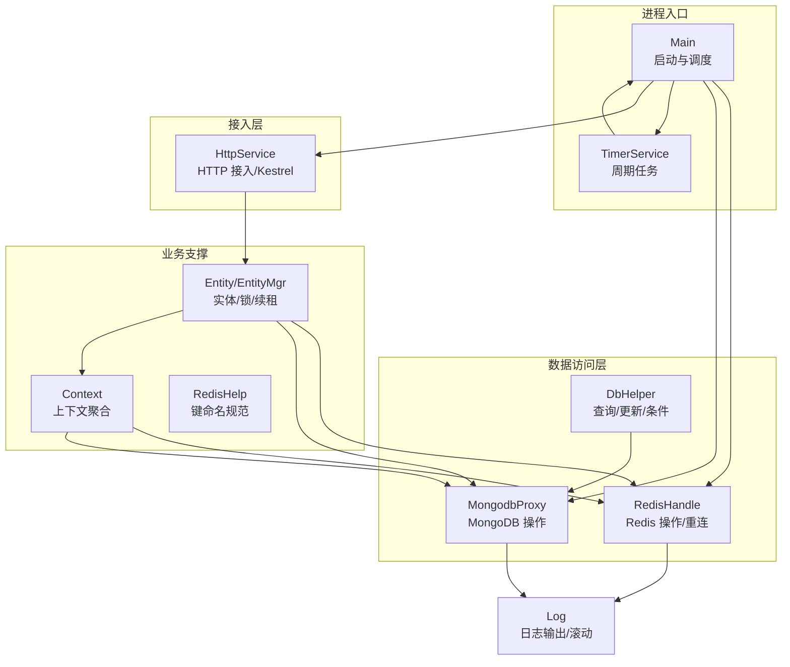
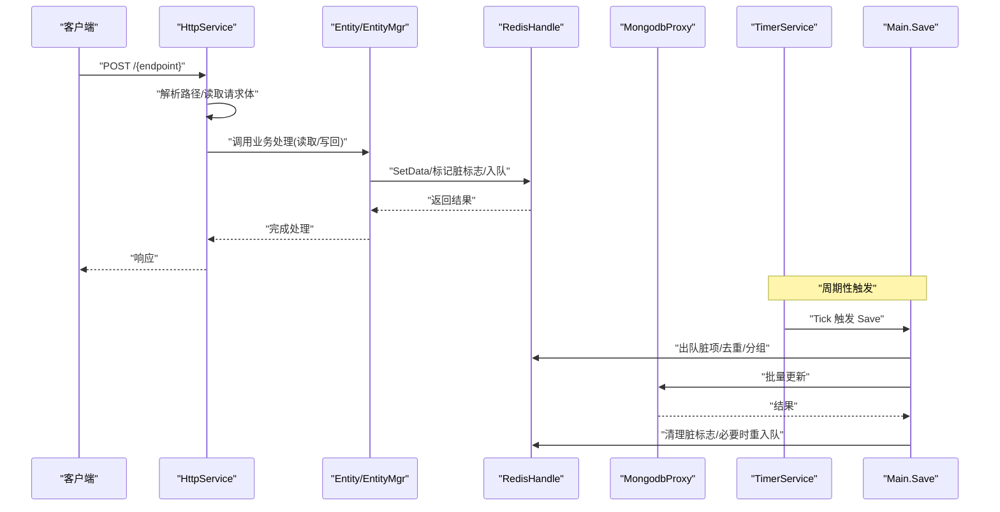
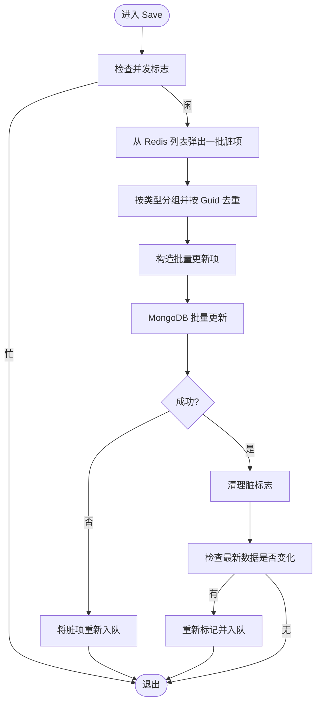
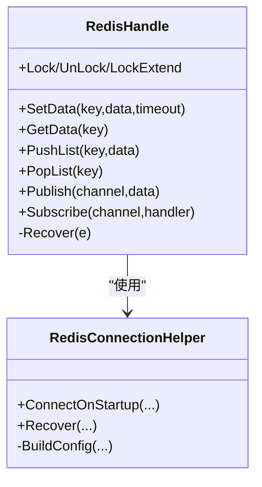
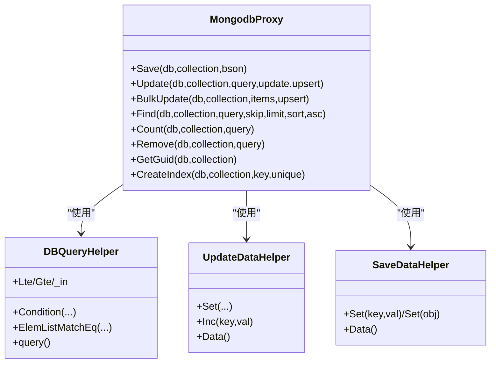
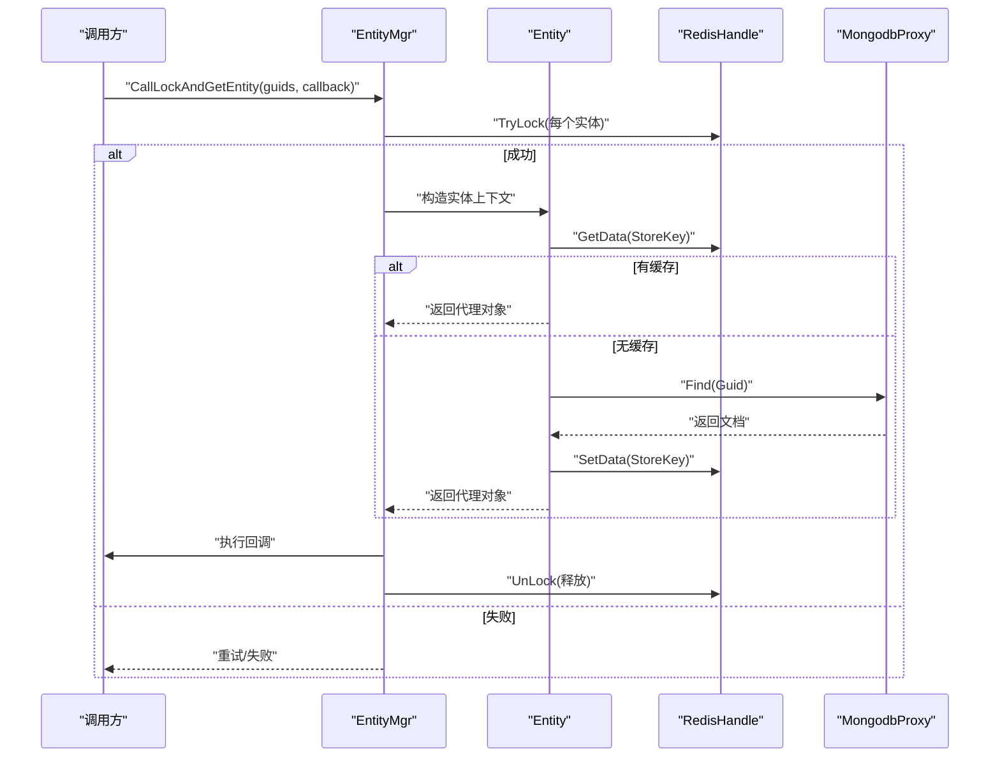
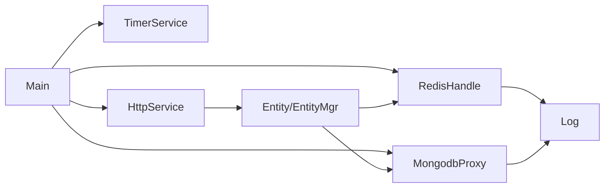

# 故障排除

<cite>
**本文引用的文件**   
- [Main.cs](file://lgbf/hub/Main.cs)
- [Log.cs](file://lgbf/hub/Log.cs)
- [RedisHandle.cs](file://lgbf/hub/RedisHandle.cs)
- [RedisConnectionHelper.cs](file://lgbf/hub/RedisConnectionHelper.cs)
- [MongodbProxy.cs](file://lgbf/hub/MongodbProxy.cs)
- [DbHelper.cs](file://lgbf/hub/DbHelper.cs)
- [TimerService.cs](file://lgbf/hub/TimerService.cs)
- [HttpService.cs](file://lgbf/hub/HttpService.cs)
- [EntityMgr.cs](file://lgbf/hub/EntityMgr.cs)
- [Entity.cs](file://lgbf/hub/Entity.cs)
- [Context.cs](file://lgbf/hub/Context.cs)
- [RedisHelp.cs](file://lgbf/hub/RedisHelp.cs)
- [hub.csproj](file://lgbf/hub/hub.csproj)
- [README.md](file://README.md)
</cite>

## 目录
1. [简介](#简介)
2. [项目结构](#项目结构)
3. [核心组件](#核心组件)
4. [架构总览](#架构总览)
5. [详细组件分析与排障要点](#详细组件分析与排障要点)
6. [依赖关系分析](#依赖关系分析)
7. [性能考量与优化建议](#性能考量与优化建议)
8. [故障排除指南](#故障排除指南)
9. [结论](#结论)
10. [附录：日志与监控最佳实践](#附录日志与监控最佳实践)

## 简介
本指南面向开发者与运维人员，围绕 LGBF（轻量级游戏后端框架）在运行期可能遇到的典型问题，提供系统化的诊断流程与解决方案，覆盖连接失败、性能问题、数据不一致、网络通信异常、数据库与缓存问题、以及监控与告警配置建议。文档以代码为依据，结合关键组件的实现细节，帮助快速定位根因并高效修复。

## 项目结构
LGBF 后端由以下关键模块构成：
- 入口与调度：Main 负责启动 Redis/Mongo 客户端、定时器与 HTTP 服务；TimerService 提供全局时间轮询与周期任务。
- 数据访问层：RedisHandle 封装 Redis 操作与自动重连；MongodbProxy 封装 MongoDB 常用操作；DbHelper 提供查询、更新、增量更新的构造器。
- 实体与事务：Entity/EntityMgr 提供实体读取、写回、分布式锁与续租机制；RedisHelp 定义键空间规范。
- 日志与网络：Log 提供分级日志输出与滚动；HttpService 提供基于 Kestrel 的 HTTP 接入与统计。

图表来源
- [Main.cs:31-40](file://lgbf/hub/Main.cs#L31-L40)
- [TimerService.cs:68-96](file://lgbf/hub/TimerService.cs#L68-L96)
- [HttpService.cs:149-173](file://lgbf/hub/HttpService.cs#L149-L173)
- [RedisHandle.cs:21-34](file://lgbf/hub/RedisHandle.cs#L21-L34)
- [MongodbProxy.cs:14-28](file://lgbf/hub/MongodbProxy.cs#L14-L28)
- [DbHelper.cs:160-310](file://lgbf/hub/DbHelper.cs#L160-L310)
- [Entity.cs:94-154](file://lgbf/hub/Entity.cs#L94-L154)
- [Context.cs:4-26](file://lgbf/hub/Context.cs#L4-L26)
- [RedisHelp.cs:4-19](file://lgbf/hub/RedisHelp.cs#L4-L19)
- [Log.cs:60-101](file://lgbf/hub/Log.cs#L60-L101)

章节来源
- [Main.cs:31-40](file://lgbf/hub/Main.cs#L31-L40)
- [hub.csproj:9-17](file://lgbf/hub/hub.csproj#L9-L17)

## 核心组件
- 入口与调度：Main 负责初始化 RedisHandle 与 MongodbProxy，注册定时保存任务，并启动 HttpService。
- 定时器：TimerService 提供统一 Tick 与多种周期触发器，用于驱动批量落库等后台任务。
- Redis：RedisHandle 封装字符串、列表、有序集合、哈希、分布式锁等常用操作，并内置自动重连逻辑。
- MongoDB：MongodbProxy 提供插入、更新、批量更新、查找、计数、自增等能力。
- 实体与锁：Entity 提供按 Guid 读取/创建实体，写回时标记脏标志并入队待落库；EntityMgr 提供多实体联合加锁与续租。
- 日志：Log 支持 Trace/Debug/Info/Warn/Err 分级输出，带时间戳与文件滚动。
- HTTP：HttpService 基于 Kestrel，支持并发限制、Keep-Alive、跨域头、请求耗时统计与异常记录。

章节来源
- [Main.cs:18-40](file://lgbf/hub/Main.cs#L18-L40)
- [TimerService.cs:7-125](file://lgbf/hub/TimerService.cs#L7-L125)
- [RedisHandle.cs:13-544](file://lgbf/hub/RedisHandle.cs#L13-L544)
- [MongodbProxy.cs:10-221](file://lgbf/hub/MongodbProxy.cs#L10-L221)
- [Entity.cs:94-154](file://lgbf/hub/Entity.cs#L94-L154)
- [EntityMgr.cs:44-127](file://lgbf/hub/EntityMgr.cs#L44-L127)
- [Log.cs:6-113](file://lgbf/hub/Log.cs#L6-L113)
- [HttpService.cs:117-182](file://lgbf/hub/HttpService.cs#L117-L182)

## 架构总览
下图展示从 HTTP 请求到实体写回与批量落库的关键路径，以及 Redis/Mongo 的交互与重试策略。

图表来源
- [HttpService.cs:51-114](file://lgbf/hub/HttpService.cs#L51-L114)
- [Entity.cs:104-154](file://lgbf/hub/Entity.cs#L104-L154)
- [RedisHandle.cs:84-109](file://lgbf/hub/RedisHandle.cs#L84-L109)
- [MongodbProxy.cs:102-120](file://lgbf/hub/MongodbProxy.cs#L102-L120)
- [TimerService.cs:68-96](file://lgbf/hub/TimerService.cs#L68-L96)
- [Main.cs:50-157](file://lgbf/hub/Main.cs#L50-L157)

## 详细组件分析与排障要点

### 组件一：Main 与定时落库（Save）
- 关键点
  - 使用定时器周期触发 Save，每次从 Redis 队列取出一批“脏”实体，按类型+Guid 去重，构造批量更新请求，写入 MongoDB。
  - 若写入失败，将脏项重新入队；若写回后发现最新数据变化，则再次标记并入队，保证最终一致性。
  - 写回流程中对 Redis/Mongo 为空进行保护，避免空引用。
- 常见问题与排障
  - MongoDB 批量写入失败：检查返回值与日志；失败项会重新入队，需关注队列堆积与重试延迟。
  - Redis 出队后数据被删除：需确认脏标志是否正确清理；若最新数据仍存在但与已落库不同，应重新入队。
  - 并发写入导致重复执行：Save 内部使用互斥位防止并发执行，同时周期性添加下一次触发，避免漏掉。
- 优化建议
  - 控制批次大小与间隔，平衡吞吐与延迟。
  - 对热点类型进行限速或分区，避免单批过大。

图表来源
- [Main.cs:50-157](file://lgbf/hub/Main.cs#L50-L157)

章节来源
- [Main.cs:50-157](file://lgbf/hub/Main.cs#L50-L157)

### 组件二：RedisHandle 与自动重连
- 关键点
  - RedisHandle 在每次操作捕获超时异常后触发 Recover，内部通过 RedisConnectionHelper 进行重连与等待，避免并发重连。
  - 支持字符串、列表、有序集合、哈希、发布订阅、分布式锁等常用操作。
- 常见问题与排障
  - Redis 超时/断连：观察日志中的 Err/Warn；确认连接参数、密码、超时配置；检查 Recover 重试次数与延迟。
  - 发布订阅无消息：确认频道名称、序列化协议一致；检查 OnMessage 回调异常是否被捕获并触发重连。
  - 分布式锁失败：检查锁键格式、Token 生成、续租线程是否正常；注意锁超时与竞争退避。
- 优化建议
  - 合理设置 keepAlive、connectRetry、connectTimeout；根据网络质量调整 Recover 延迟上限。
  - 对高频操作使用连接池与共享实例，减少频繁重建。

图表来源
- [RedisHandle.cs:13-544](file://lgbf/hub/RedisHandle.cs#L13-L544)
- [RedisConnectionHelper.cs:6-144](file://lgbf/hub/RedisConnectionHelper.cs#L6-L144)

章节来源
- [RedisHandle.cs:27-34](file://lgbf/hub/RedisHandle.cs#L27-L34)
- [RedisHandle.cs:36-109](file://lgbf/hub/RedisHandle.cs#L36-L109)
- [RedisHandle.cs:257-303](file://lgbf/hub/RedisHandle.cs#L257-L303)
- [RedisHandle.cs:305-394](file://lgbf/hub/RedisHandle.cs#L305-L394)
- [RedisConnectionHelper.cs:35-54](file://lgbf/hub/RedisConnectionHelper.cs#L35-L54)
- [RedisConnectionHelper.cs:56-127](file://lgbf/hub/RedisConnectionHelper.cs#L56-L127)

### 组件三：MongodbProxy 与查询/更新构造器
- 关键点
  - MongodbProxy 提供插入、更新、批量更新、查找、计数、自增等常用接口；批量更新采用非有序写入提升吞吐。
  - DBQueryHelper/UpdateDataHelper/SaveDataHelper 提供链式构建查询与更新条件，避免手写 BSON 错误。
- 常见问题与排障
  - 批量更新失败：检查 items 是否为空；确认查询/更新条件是否合法；查看日志错误。
  - 查找结果为空：确认集合名、过滤条件；注意投影与排序参数。
  - 自增失败：确认 Guid 文档是否存在且 upsert 开启。
- 优化建议
  - 为高频查询字段建立索引；合理使用投影与分页参数。

图表来源
- [MongodbProxy.cs:10-221](file://lgbf/hub/MongodbProxy.cs#L10-L221)
- [DbHelper.cs:4-69](file://lgbf/hub/DbHelper.cs#L4-L69)
- [DbHelper.cs:71-157](file://lgbf/hub/DbHelper.cs#L71-L157)
- [DbHelper.cs:160-310](file://lgbf/hub/DbHelper.cs#L160-L310)

章节来源
- [MongodbProxy.cs:76-120](file://lgbf/hub/MongodbProxy.cs#L76-L120)
- [DbHelper.cs:4-69](file://lgbf/hub/DbHelper.cs#L4-L69)
- [DbHelper.cs:71-157](file://lgbf/hub/DbHelper.cs#L71-L157)

### 组件四：实体读取/写回与分布式锁
- 关键点
  - Entity.Get/GetOrCreate：优先从 Redis 读取，不存在则从 Mongo 查询并回填 Redis；写回时先写 Redis，再标记脏标志并入队。
  - EntityMgr.CallLockAndGetEntity：对多个实体加联合锁，执行回调期间定期续租，结束后释放。
- 常见问题与排障
  - 写回失败：检查 Redis Set 返回值；确认脏标志与队列入队是否成功。
  - 加锁失败：检查锁键格式、Token 生成、重试退避；确认续租线程未提前取消。
  - 数据不一致：若写回后最新数据变化，需重新入队；检查脏标志清理逻辑。
- 优化建议
  - 对热点实体进行分片或限流；合理设置锁超时与续租间隔。

图表来源
- [EntityMgr.cs:44-127](file://lgbf/hub/EntityMgr.cs#L44-L127)
- [Entity.cs:104-154](file://lgbf/hub/Entity.cs#L104-L154)
- [RedisHelp.cs:4-19](file://lgbf/hub/RedisHelp.cs#L4-L19)

章节来源
- [Entity.cs:52-92](file://lgbf/hub/Entity.cs#L52-L92)
- [Entity.cs:104-154](file://lgbf/hub/Entity.cs#L104-L154)
- [EntityMgr.cs:44-127](file://lgbf/hub/EntityMgr.cs#L44-L127)

### 组件五：日志与 HTTP 服务
- 关键点
  - Log 支持 Trace/Debug/Info/Warn/Err 分级输出，带时间戳与文件滚动；默认输出到当前目录 log.txt。
  - HttpService 基于 Kestrel，限制并发连接、设置 Keep-Alive、输出连接统计与超时警告。
- 常见问题与排障
  - 日志缺失：确认 logPath/logFile 设置与权限；检查滚动阈值与文件移动。
  - HTTP 超时：查看日志中的超时警告；检查请求体读取与回调处理耗时。
  - 跨域问题：确认 Access-Control 头是否正确下发。
- 优化建议
  - 生产环境建议将日志输出到标准位置并开启压缩归档；根据流量调整 Kestrel 并发限制。

章节来源
- [Log.cs:19-58](file://lgbf/hub/Log.cs#L19-L58)
- [Log.cs:60-101](file://lgbf/hub/Log.cs#L60-L101)
- [HttpService.cs:47-62](file://lgbf/hub/HttpService.cs#L47-L62)
- [HttpService.cs:101-112](file://lgbf/hub/HttpService.cs#L101-L112)
- [HttpService.cs:154-160](file://lgbf/hub/HttpService.cs#L154-L160)

## 依赖关系分析
- 运行时依赖
  - ASP.NET Core（Kestrel）、Google.Protobuf、MongoDB.Driver/Bson、StackExchange.Redis、Newtonsoft.Json。
- 组件耦合
  - Main 聚合 RedisHandle/MongodbProxy/TimerService/HttpService；Entity/EntityMgr 依赖 RedisHandle 与 MongodbProxy；Log 作为通用输出工具贯穿各组件。

图表来源
- [Main.cs:18-40](file://lgbf/hub/Main.cs#L18-L40)
- [hub.csproj:11-16](file://lgbf/hub/hub.csproj#L11-L16)

章节来源
- [hub.csproj:9-17](file://lgbf/hub/hub.csproj#L9-L17)

## 性能考量与优化建议
- Redis
  - 合理设置 keepAlive、connectRetry、connectTimeout；对高频键使用连接池复用。
  - 列表操作采用左/右弹出，避免阻塞式阻塞队列；发布订阅使用频道字面量。
- MongoDB
  - 批量更新使用非有序写入；为热点字段建立索引；控制单批条目数量。
  - 查找使用投影与分页，避免全量传输。
- 定时落库
  - 控制 Save 批次大小与周期；对热点类型进行分区或限速。
- HTTP
  - 调整 MaxConcurrentConnections 与 KeepAliveTimeout；启用 HTTP/2；监控连接统计。

[本节为通用指导，无需特定文件引用]

## 故障排除指南

### 一、连接失败类问题
- Redis 连接失败
  - 现象：启动时报连接异常、运行中频繁 Err/Warn。
  - 排查步骤
    - 检查连接 URL、密码、name 参数；确认 DNS 解析与网络可达。
    - 查看 RedisConnectionHelper 的连接与重试配置；确认 Recover 流程是否成功。
    - 观察日志中连接异常堆栈与重试次数。
  - 解决方案
    - 修正连接参数；在网络抖动环境下适当增大超时与重试间隔。
    - 如持续失败，考虑切换到主从或哨兵模式。
- MongoDB 连接失败
  - 现象：批量更新/查找抛出异常；日志出现连接错误。
  - 排查步骤
    - 检查 MongoUrl 与认证信息；确认副本集/分片集群状态。
    - 查看 MongodbProxy 初始化与异常日志。
  - 解决方案
    - 修复连接串；在高可用部署中启用副本集连接字符串。
- HTTP 服务无法监听
  - 现象：启动后无法接收请求或端口占用。
  - 排查步骤
    - 检查端口占用与防火墙；确认 ListenAnyIP 与协议配置。
  - 解决方案
    - 更换端口或修复权限；确保 Kestrel 正常启动。

章节来源
- [RedisConnectionHelper.cs:35-54](file://lgbf/hub/RedisConnectionHelper.cs#L35-L54)
- [RedisConnectionHelper.cs:56-127](file://lgbf/hub/RedisConnectionHelper.cs#L56-L127)
- [MongodbProxy.cs:14-28](file://lgbf/hub/MongodbProxy.cs#L14-L28)
- [HttpService.cs:154-160](file://lgbf/hub/HttpService.cs#L154-L160)

### 二、性能问题
- 高延迟/高 CPU
  - 现象：请求耗时长、CPU 占用高。
  - 排查步骤
    - 查看 HttpService 中的耗时统计日志；定位慢请求路径。
    - 检查 Save 批次大小与频率；确认 Redis/Mongo 操作是否阻塞。
  - 解决方案
    - 降低 Save 批次或延长周期；优化查询条件与索引；拆分热点实体。
- 并发瓶颈
  - 现象：并发连接数受限、队列积压。
  - 排查步骤
    - 检查 Kestrel 并发限制与 Keep-Alive；评估 Redis/Mongo 的并发能力。
  - 解决方案
    - 提升并发限制；增加 Redis/Mongo 实例或分片。

章节来源
- [HttpService.cs:47-62](file://lgbf/hub/HttpService.cs#L47-L62)
- [HttpService.cs:154-160](file://lgbf/hub/HttpService.cs#L154-L160)
- [Main.cs:15-16](file://lgbf/hub/Main.cs#L15-L16)

### 三、数据不一致
- 实体写回后未落库
  - 现象：内存中数据已更新，但 MongoDB 未同步。
  - 排查步骤
    - 检查脏标志与队列入队是否成功；确认 Save 是否触发。
    - 观察日志中 SaveAsync 的异常与重试。
  - 解决方案
    - 修复队列入队逻辑；确保 Save 循环触发。
- 脏标志清理异常
  - 现象：脏标志长期存在，队列不断增长。
  - 排查步骤
    - 检查 Save 中脏标志清理与最新数据比对逻辑。
  - 解决方案
    - 修复清理条件；必要时手动巡检与补偿。

章节来源
- [Entity.cs:52-92](file://lgbf/hub/Entity.cs#L52-L92)
- [Main.cs:125-146](file://lgbf/hub/Main.cs#L125-L146)

### 四、网络通信问题
- 连接超时
  - 现象：Redis/Mongo 操作超时；日志出现超时警告。
  - 排查步骤
    - 检查 Redis/Mongo 的超时配置；确认网络延迟与丢包。
  - 解决方案
    - 增大超时时间；优化网络路径；启用 Keep-Alive。
- 协议错误
  - 现象：HTTP 响应异常、跨域失败。
  - 排查步骤
    - 检查 Access-Control 头是否正确；确认请求方法与路径映射。
  - 解决方案
    - 补充跨域头；校验路由与回调注册。
- 序列化异常
  - 现象：发布订阅或 JSON 反序列化失败。
  - 排查步骤
    - 检查 Protobuf 类型名与内容；确认 JSON 字符集编码。
  - 解决方案
    - 统一序列化协议；确保字段兼容。

章节来源
- [RedisHandle.cs:36-54](file://lgbf/hub/RedisHandle.cs#L36-L54)
- [HttpService.cs:134-147](file://lgbf/hub/HttpService.cs#L134-L147)
- [HttpService.cs:24-37](file://lgbf/hub/HttpService.cs#L24-L37)

### 五、数据库连接问题
- MongoDB 连接不稳定
  - 现象：偶发连接中断、查询失败。
  - 排查步骤
    - 检查副本集状态与仲裁节点；确认驱动版本与连接串。
  - 解决方案
    - 使用副本集连接串；升级驱动版本；优化网络质量。
- 索引缺失导致慢查询
  - 现象：Find/Count 慢。
  - 排查步骤
    - 使用 Explain 分析查询计划；确认过滤字段是否建索引。
  - 解决方案
    - 创建复合索引；优化查询条件。

章节来源
- [MongodbProxy.cs:35-53](file://lgbf/hub/MongodbProxy.cs#L35-L53)
- [MongodbProxy.cs:143-192](file://lgbf/hub/MongodbProxy.cs#L143-L192)

### 六、缓存相关问题
- 缓存穿透
  - 现象：查询不存在的数据导致直连数据库。
  - 排查步骤
    - 检查缓存空值是否写入与过期；确认查询路径。
  - 解决方案
    - 对空结果写入短 TTL；使用布隆过滤器预判。
- 缓存雪崩
  - 现象：大量缓存同时失效导致数据库压力骤增。
  - 排查步骤
    - 检查过期时间是否集中；确认热点数据的过期策略。
  - 解决方案
    - 为过期时间加入随机抖动；热点数据常驻或双缓冲。
- 数据同步
  - 现象：缓存与数据库不一致。
  - 排查步骤
    - 检查写回流程与脏标志；确认 Save 是否及时执行。
  - 解决方案
    - 强制写回后清理脏标志；必要时引入补偿任务。

章节来源
- [Entity.cs:104-154](file://lgbf/hub/Entity.cs#L104-L154)
- [Main.cs:125-146](file://lgbf/hub/Main.cs#L125-L146)

### 七、分布式锁与并发
- 加锁失败/死锁
  - 现象：多实例竞争失败、锁超时。
  - 排查步骤
    - 检查锁键格式、Token 生成与续租线程。
  - 解决方案
    - 为锁超时与续租间隔设定合理上限；避免长事务持有锁。
- 锁续租异常
  - 现象：回调执行期间锁丢失。
  - 排查步骤
    - 检查取消令牌与异常处理。
  - 解决方案
    - 确保续租线程独立运行并健壮处理异常。

章节来源
- [EntityMgr.cs:20-42](file://lgbf/hub/EntityMgr.cs#L20-L42)
- [EntityMgr.cs:305-394](file://lgbf/hub/EntityMgr.cs#L305-L394)

## 结论
通过以上组件与流程的深入分析，可以系统化地定位 LGBF 在运行期的连接、性能、一致性与网络通信等问题。建议在生产环境中：
- 明确日志级别与输出路径，建立滚动与归档策略；
- 对 Redis/Mongo 进行容量与网络规划，启用健康检查与告警；
- 对热点资源进行限流与分片，优化查询与索引；
- 建立补偿与巡检机制，保障最终一致性。

[本节为总结，无需特定文件引用]

## 附录：日志与监控最佳实践
- 日志级别
  - 开发：Debug/Trace；测试：Info；生产：Warn/Err。
  - 关键事件：连接失败、重试、超时、异常堆栈、脏队列长度。
- 日志滚动
  - 控制单文件大小阈值；超过阈值自动滚动并保留历史。
- 监控指标
  - Redis：连接数、命令耗时、队列长度、重连次数。
  - MongoDB：批量写入成功率、查询耗时、索引命中率。
  - HTTP：并发连接数、请求速率、平均/99 分位耗时、错误码分布。
- 告警建议
  - 连接失败率、超时比例、队列堆积、CPU/内存/磁盘使用率。
  - 建立分级告警与自动恢复预案。

章节来源
- [Log.cs:109-111](file://lgbf/hub/Log.cs#L109-L111)
- [Log.cs:60-101](file://lgbf/hub/Log.cs#L60-L101)
- [HttpService.cs:47-62](file://lgbf/hub/HttpService.cs#L47-L62)