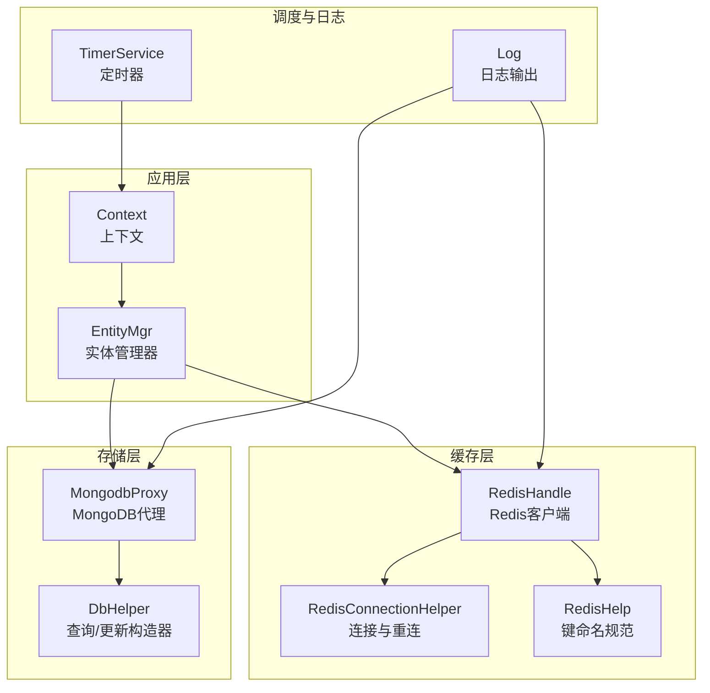
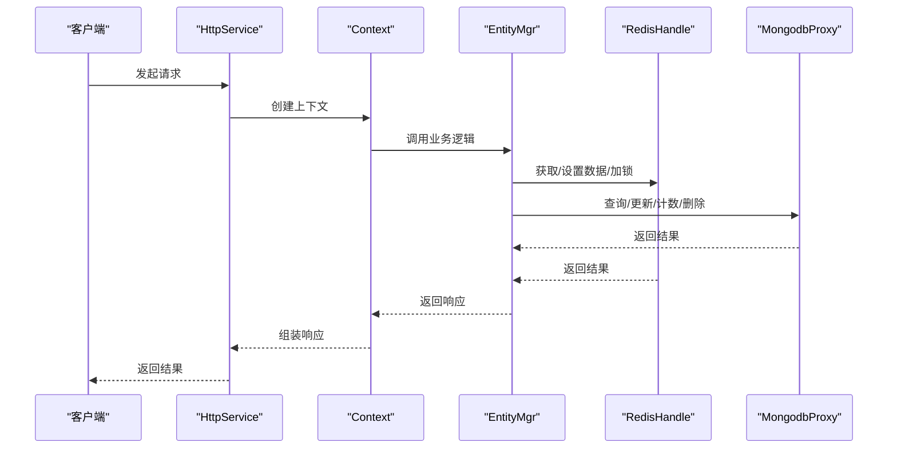
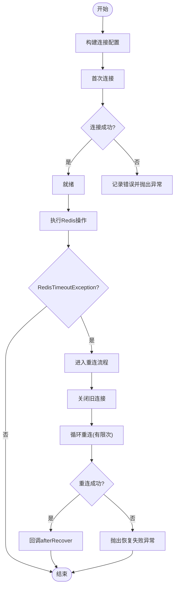
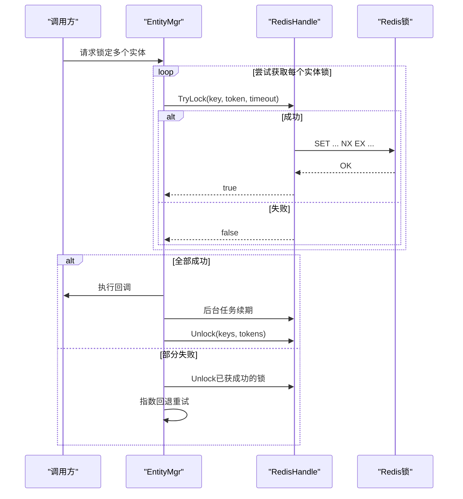
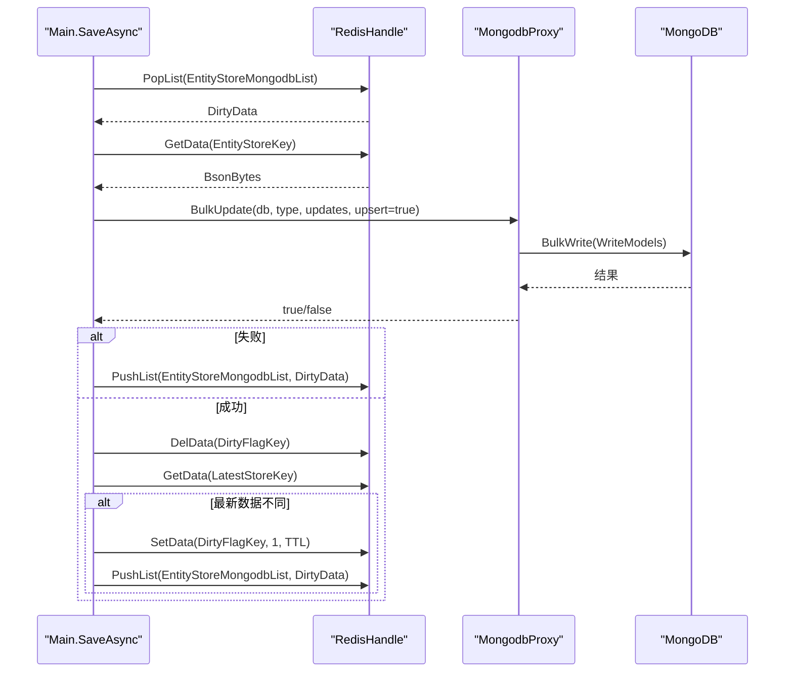
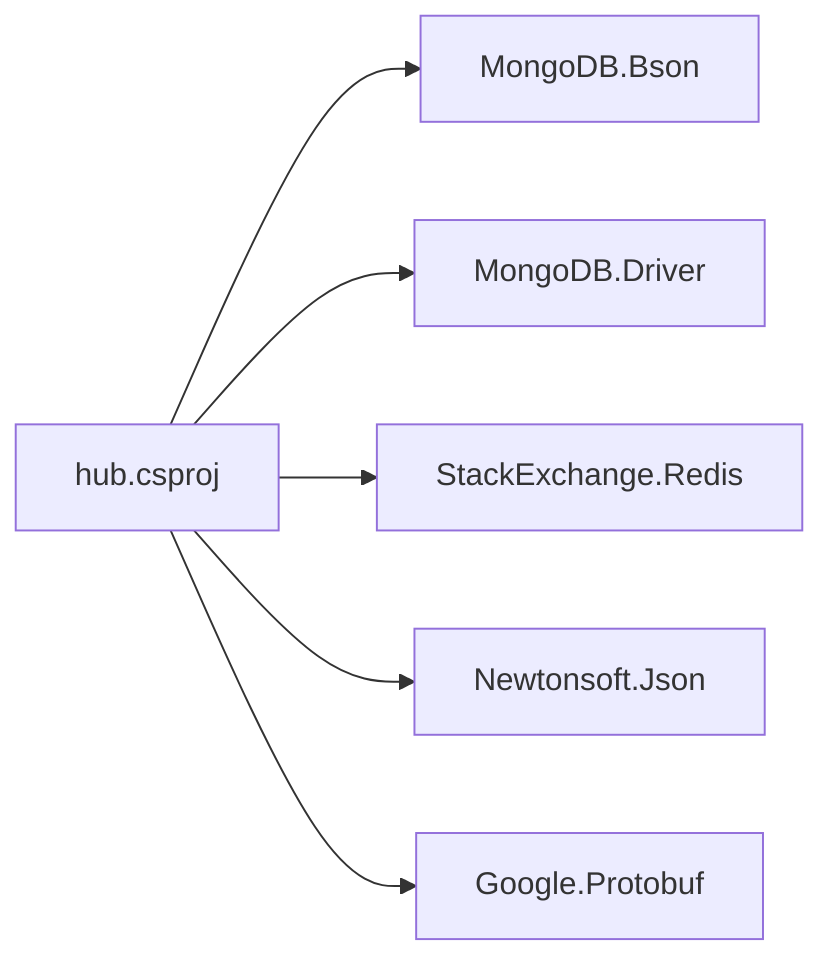

# 数据库问题排查

<cite>
**本文引用的文件列表**
- [Main.cs](file://lgbf/hub/Main.cs)
- [Context.cs](file://lgbf/hub/Context.cs)
- [RedisHandle.cs](file://lgbf/hub/RedisHandle.cs)
- [RedisConnectionHelper.cs](file://lgbf/hub/RedisConnectionHelper.cs)
- [RedisHelp.cs](file://lgbf/hub/RedisHelp.cs)
- [EntityMgr.cs](file://lgbf/hub/EntityMgr.cs)
- [MongodbProxy.cs](file://lgbf/hub/MongodbProxy.cs)
- [DbHelper.cs](file://lgbf/hub/DbHelper.cs)
- [Log.cs](file://lgbf/hub/Log.cs)
- [hub.csproj](file://lgbf/hub/hub.csproj)
</cite>

## 目录
1. [简介](#简介)
2. [项目结构与数据库组件概览](#项目结构与数据库组件概览)
3. [核心组件](#核心组件)
4. [架构总览](#架构总览)
5. [详细组件分析与排查要点](#详细组件分析与排查要点)
6. [依赖关系分析](#依赖关系分析)
7. [性能与容量规划建议](#性能与容量规划建议)
8. [故障排查指南](#故障排查指南)
9. [结论](#结论)
10. [附录：监控与告警建议](#附录监控与告警建议)

## 简介
本指南面向LGBF（轻量级游戏后端框架）的数据库问题排查，覆盖以下场景：
- MongoDB连接失败、查询超时、写入异常
- Redis连接池配置、内存使用与性能问题
- 慢查询分析与索引优化
- 数据一致性检查与修复流程
- 备份与恢复常见问题
- 监控指标解读与告警配置
- 连接数限制、内存溢出、锁等待等疑难问题的定位与解决

## 项目结构与数据库组件概览
LGBF后端采用“Redis缓存 + MongoDB持久化”的双存储架构：
- Redis负责高并发读写、分布式锁、消息订阅、有序集合排行等
- MongoDB负责实体数据的持久化存储与批量更新
- 通过定时任务将Redis中的脏数据批量落盘到MongoDB

图表来源
- [Main.cs:31-40](file://lgbf/hub/Main.cs#L31-L40)
- [Context.cs:4-26](file://lgbf/hub/Context.cs#L4-L26)
- [RedisHandle.cs:13-34](file://lgbf/hub/RedisHandle.cs#L13-L34)
- [RedisConnectionHelper.cs:6-33](file://lgbf/hub/RedisConnectionHelper.cs#L6-L33)
- [RedisHelp.cs:4-19](file://lgbf/hub/RedisHelp.cs#L4-L19)
- [EntityMgr.cs:3-127](file://lgbf/hub/EntityMgr.cs#L3-L127)
- [MongodbProxy.cs:10-221](file://lgbf/hub/MongodbProxy.cs#L10-L221)
- [DbHelper.cs:4-311](file://lgbf/hub/DbHelper.cs#L4-L311)
- [Log.cs:6-113](file://lgbf/hub/Log.cs#L6-L113)

章节来源
- [Main.cs:31-40](file://lgbf/hub/Main.cs#L31-L40)
- [Context.cs:4-26](file://lgbf/hub/Context.cs#L4-L26)
- [RedisHandle.cs:13-34](file://lgbf/hub/RedisHandle.cs#L13-L34)
- [RedisConnectionHelper.cs:6-33](file://lgbf/hub/RedisConnectionHelper.cs#L6-L33)
- [RedisHelp.cs:4-19](file://lgbf/hub/RedisHelp.cs#L4-L19)
- [EntityMgr.cs:3-127](file://lgbf/hub/EntityMgr.cs#L3-L127)
- [MongodbProxy.cs:10-221](file://lgbf/hub/MongodbProxy.cs#L10-L221)
- [DbHelper.cs:4-311](file://lgbf/hub/DbHelper.cs#L4-L311)
- [Log.cs:6-113](file://lgbf/hub/Log.cs#L6-L113)

## 核心组件
- RedisHandle：封装Redis操作，包含连接恢复、超时处理、锁机制、发布订阅、列表与有序集合等常用操作
- RedisConnectionHelper：负责连接字符串构建、连接与重连策略、并发重连保护
- RedisHelp：统一的键命名规范，便于排查与维护
- EntityMgr：基于Redis分布式锁的实体并发控制与生命周期管理
- MongodbProxy：MongoDB访问代理，支持单条/批量更新、查询、计数、删除、索引创建、GUID自增等
- DbHelper：MongoDB查询条件与更新文档的构造器，避免手写BSON错误
- Log：统一日志输出，支持按大小轮转与级别过滤
- Main：应用入口，初始化Redis与MongoDB，启动HTTP服务与定时保存任务

章节来源
- [RedisHandle.cs:13-544](file://lgbf/hub/RedisHandle.cs#L13-L544)
- [RedisConnectionHelper.cs:6-144](file://lgbf/hub/RedisConnectionHelper.cs#L6-L144)
- [RedisHelp.cs:4-19](file://lgbf/hub/RedisHelp.cs#L4-L19)
- [EntityMgr.cs:3-127](file://lgbf/hub/EntityMgr.cs#L3-L127)
- [MongodbProxy.cs:10-221](file://lgbf/hub/MongodbProxy.cs#L10-L221)
- [DbHelper.cs:4-311](file://lgbf/hub/DbHelper.cs#L4-L311)
- [Log.cs:6-113](file://lgbf/hub/Log.cs#L6-L113)
- [Main.cs:13-159](file://lgbf/hub/Main.cs#L13-L159)

## 架构总览

图表来源
- [Main.cs:31-40](file://lgbf/hub/Main.cs#L31-L40)
- [Context.cs:4-26](file://lgbf/hub/Context.cs#L4-L26)
- [EntityMgr.cs:44-126](file://lgbf/hub/EntityMgr.cs#L44-L126)
- [RedisHandle.cs:13-544](file://lgbf/hub/RedisHandle.cs#L13-L544)
- [MongodbProxy.cs:10-221](file://lgbf/hub/MongodbProxy.cs#L10-L221)

## 详细组件分析与排查要点

### Redis连接与重连
- 连接参数与构建
  - 连接字符串由RedisConnectionHelper根据URL、密码、名称、超时、重试次数、保活等参数拼装
  - 支持无密码与带密码两种模式
- 重连策略
  - 初始连接失败会记录错误并抛出异常
  - 运行中发生连接异常时，进入Recover流程，最多尝试固定次数，指数退避延迟
  - 使用互斥信号量保证同一时间仅一次重连，避免竞态
- 常见问题定位
  - 连接失败：检查URL、密码、网络连通性、防火墙、DNS解析
  - 连接抖动：关注日志中的“Recover retry failed”与“Reconnect for”
  - 阻塞等待：若重连期间其他线程等待，可能触发超时异常

图表来源
- [RedisConnectionHelper.cs:35-127](file://lgbf/hub/RedisConnectionHelper.cs#L35-L127)
- [RedisHandle.cs:27-34](file://lgbf/hub/RedisHandle.cs#L27-L34)

章节来源
- [RedisConnectionHelper.cs:26-144](file://lgbf/hub/RedisConnectionHelper.cs#L26-L144)
- [RedisHandle.cs:27-34](file://lgbf/hub/RedisHandle.cs#L27-L34)

### Redis锁与并发控制
- 分布式锁
  - 使用Redis SET key value NX EX timeout 实现锁
  - 锁续期：后台任务定期延长锁有效期，防止业务耗时过长导致锁过期
  - 解锁：释放所有已持有的锁令牌
- 并发重试
  - 获取锁失败时，指数回退重试，避免热点竞争
- 排查要点
  - 锁未释放：确认finally路径是否执行，检查异常分支
  - 锁续期失败：关注返回false的续期调用，必要时缩短业务处理时间
  - 死锁风险：确保锁粒度合理，避免跨实体长事务

图表来源
- [EntityMgr.cs:44-126](file://lgbf/hub/EntityMgr.cs#L44-L126)
- [RedisHandle.cs:305-394](file://lgbf/hub/RedisHandle.cs#L305-L394)

章节来源
- [EntityMgr.cs:3-127](file://lgbf/hub/EntityMgr.cs#L3-L127)
- [RedisHandle.cs:305-394](file://lgbf/hub/RedisHandle.cs#L305-L394)

### MongoDB访问与批量写入
- 访问代理
  - 提供插入、更新、批量更新、查找、计数、删除、索引创建、GUID自增等能力
  - 查询与更新均以BSON字节数组传入，内部反序列化为BsonDocument
- 批量写入
  - 将多条更新组装为WriteModel集合，非有序批量写入，提升吞吐
  - 写入失败时，将脏数据重新入队，等待下次重试
- 排查要点
  - 插入/更新失败：检查BSON格式、字段类型、索引冲突
  - 批量写入阻塞：关注IsOrdered=false带来的部分失败容忍
  - GUID自增：确认唯一索引存在，避免并发冲突

图表来源
- [Main.cs:50-157](file://lgbf/hub/Main.cs#L50-L157)
- [MongodbProxy.cs:102-120](file://lgbf/hub/MongodbProxy.cs#L102-L120)

章节来源
- [MongodbProxy.cs:10-221](file://lgbf/hub/MongodbProxy.cs#L10-L221)
- [Main.cs:50-157](file://lgbf/hub/Main.cs#L50-L157)

### 查询与更新构造器
- SaveDataHelper/UpdateDataHelper
  - 提供链式Set/Inc接口，生成$set/$inc等更新文档
  - 防重复设置，避免构造错误
- DBQueryHelper
  - 支持等值、元素匹配、范围查询、$in等
  - 自动包装为$and数组
- 排查要点
  - 更新为空：Empty()判断，避免无效写入
  - 查询为空：Empty()判断，避免全表扫描
  - 类型不匹配：注意数值类型与索引定义一致

章节来源
- [DbHelper.cs:4-311](file://lgbf/hub/DbHelper.cs#L4-L311)

### 日志与监控
- 日志级别与输出
  - 支持Trace/Debug/Info/Warn/Err五级
  - 文件按大小轮转，超过阈值自动归档
- 监控建议
  - 关键路径打点：连接建立、重连、批量写入、锁续期
  - 异常统计：RedisTimeoutException、MongoDB异常、锁续期失败

章节来源
- [Log.cs:6-113](file://lgbf/hub/Log.cs#L6-L113)

## 依赖关系分析
- 包依赖
  - MongoDB：MongoDB.Bson、MongoDB.Driver
  - Redis：StackExchange.Redis
  - 序列化：Newtonsoft.Json、Google.Protobuf
- 组件耦合
  - RedisHandle与RedisConnectionHelper强耦合，负责连接与重连
  - EntityMgr依赖RedisHandle进行锁与数据操作
  - Main负责协调RedisHandle与MongodbProxy，并驱动定时保存

图表来源
- [hub.csproj:9-17](file://lgbf/hub/hub.csproj#L9-L17)

章节来源
- [hub.csproj:9-17](file://lgbf/hub/hub.csproj#L9-L17)

## 性能与容量规划建议
- Redis
  - 控制键数量与体积，避免大对象与热Key
  - 合理设置TTL，及时清理过期数据
  - 使用管道与批处理减少RTT
- MongoDB
  - 为高频查询字段建立合适索引，避免全表扫描
  - 批量写入时控制批次大小，平衡吞吐与延迟
  - 定期分析慢查询日志，优化查询与索引
- 缓存-存储一致性
  - 通过脏标志与队列实现最终一致性
  - 定时任务周期与批量大小需结合业务峰值评估

[本节为通用建议，无需特定文件引用]

## 故障排查指南

### MongoDB连接失败
- 现象
  - 初始化MongodbProxy失败；后续查询/更新抛出异常
- 排查步骤
  - 检查MongoURL格式与可达性
  - 查看日志中“create_index failed”等错误
  - 确认数据库/集合存在，权限正确
- 处置
  - 修正连接串与认证信息
  - 重建缺失索引或调整唯一性约束

章节来源
- [MongodbProxy.cs:14-18](file://lgbf/hub/MongodbProxy.cs#L14-L18)
- [MongodbProxy.cs:39-52](file://lgbf/hub/MongodbProxy.cs#L39-L52)

### MongoDB查询超时/慢查询
- 现象
  - Find/Count操作耗时显著上升
- 排查步骤
  - 使用DBQueryHelper构造精确查询条件，避免全表扫描
  - 为查询字段建立索引，优先考虑复合索引
  - 分页查询时指定排序字段与方向
- 处置
  - 优化查询条件与索引
  - 对于聚合场景，考虑分片或读副本

章节来源
- [DbHelper.cs:160-311](file://lgbf/hub/DbHelper.cs#L160-L311)
- [MongodbProxy.cs:143-192](file://lgbf/hub/MongodbProxy.cs#L143-L192)

### MongoDB写入异常
- 现象
  - Insert/Update/BulkUpdate失败
- 排查步骤
  - 检查BSON格式与字段类型
  - 确认唯一索引冲突与upsert策略
  - 观察批量写入返回值，失败项重新入队
- 处置
  - 修复数据模型与索引
  - 调整批量大小与重试策略

章节来源
- [MongodbProxy.cs:76-120](file://lgbf/hub/MongodbProxy.cs#L76-L120)
- [Main.cs:125-134](file://lgbf/hub/Main.cs#L125-L134)

### Redis连接池与内存问题
- 现象
  - 连接抖动频繁、命令超时、内存增长
- 排查步骤
  - 检查连接字符串构建参数（超时、重试、保活）
  - 关注“Recover retry failed”日志
  - 监控键空间大小与过期策略
- 处置
  - 调整连接参数，避免过度重试
  - 清理僵尸连接，优化键设计

章节来源
- [RedisConnectionHelper.cs:26-144](file://lgbf/hub/RedisConnectionHelper.cs#L26-L144)
- [RedisHandle.cs:36-54](file://lgbf/hub/RedisHandle.cs#L36-L54)

### Redis锁等待与死锁
- 现象
  - 获取锁长时间阻塞、续期失败
- 排查步骤
  - 检查锁粒度与持有时间
  - 关注指数回退与重试间隔
  - 确认finally路径是否执行
- 处置
  - 缩短业务处理时间，降低锁持有时间
  - 合理拆分锁粒度，避免跨实体长事务

章节来源
- [EntityMgr.cs:44-126](file://lgbf/hub/EntityMgr.cs#L44-L126)
- [RedisHandle.cs:305-394](file://lgbf/hub/RedisHandle.cs#L305-L394)

### 数据一致性检查与修复
- 检查流程
  - 对比Redis中的最新数据与MongoDB中的持久化数据
  - 通过脏标志与队列确认是否存在未落盘变更
- 修复策略
  - 重新入队脏数据，等待定时任务重试
  - 手工执行批量更新或单条修复
  - 校验GUID自增与唯一索引

章节来源
- [Main.cs:81-146](file://lgbf/hub/Main.cs#L81-L146)
- [MongodbProxy.cs:204-219](file://lgbf/hub/MongodbProxy.cs#L204-L219)

### 备份与恢复常见问题
- 备份
  - MongoDB：使用mongodump导出集合，注意索引与权限
  - Redis：使用RDB快照或AOF持久化
- 恢复
  - MongoDB：使用mongorestore导入，重建索引
  - Redis：重启实例后数据恢复，注意键空间清理
- 常见问题
  - 导入失败：检查目标实例状态与权限
  - 索引缺失：导入后手动重建或在导入脚本中包含索引

[本节为通用建议，无需特定文件引用]

## 结论
通过以上组件与流程的深入分析，可以系统性地定位与解决LGBF中的数据库问题。建议在生产环境中：
- 明确连接参数与重连策略
- 建立完善的索引与查询规范
- 严格控制锁粒度与持有时间
- 健全日志与监控体系
- 制定备份与恢复演练计划

[本节为总结，无需特定文件引用]

## 附录：监控与告警建议
- Redis指标
  - 连接数、命中率、内存使用、阻塞命令数
  - 锁续期失败次数、重连次数
- MongoDB指标
  - 连接池使用率、慢查询数、写入延迟
  - 索引使用率、未命中查询比例
- 告警阈值示例
  - Redis：连接抖动>阈值、锁续期失败>阈值、重连失败>阈值
  - MongoDB：慢查询>阈值、写入延迟>阈值、索引未命中>阈值

[本节为通用建议，无需特定文件引用]