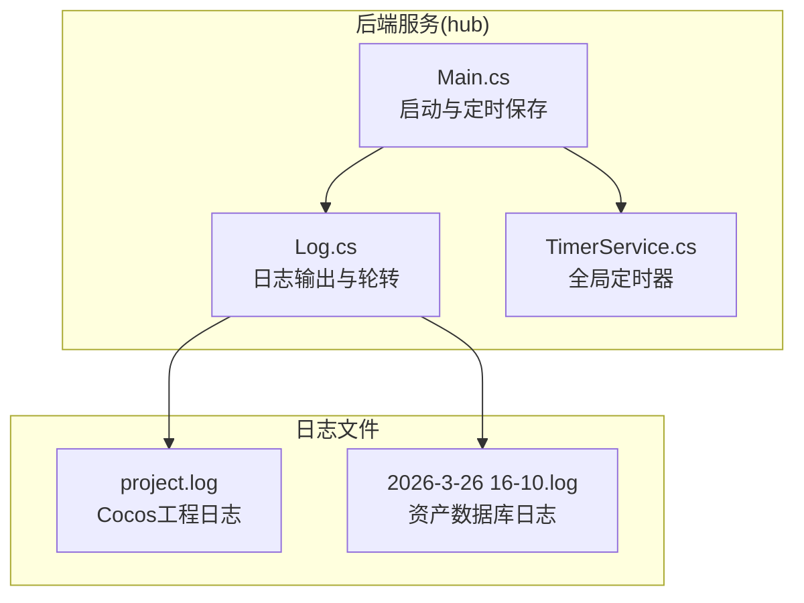
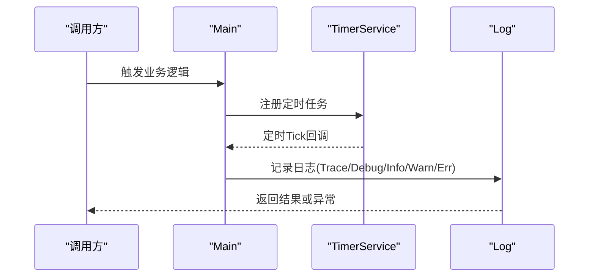
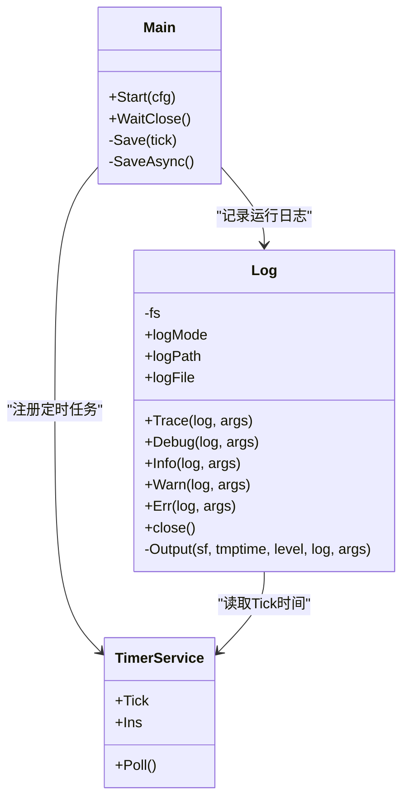

# 日志分析

<cite>
**本文引用的文件**
- [Log.cs](file://lgbf/hub/Log.cs)
- [Main.cs](file://lgbf/hub/Main.cs)
- [TimerService.cs](file://lgbf/hub/TimerService.cs)
- [project.log](file://gem/ccc/temp/logs/project.log)
- [2026-3-26 16-10.log](file://gem/ccc/temp/asset-db/log/2026-3-26 16-10.log)
- [README.md](file://README.md)
</cite>

## 目录
1. [简介](#简介)
2. [项目结构](#项目结构)
3. [核心组件](#核心组件)
4. [架构总览](#架构总览)
5. [组件详解](#组件详解)
6. [依赖关系分析](#依赖关系分析)
7. [性能与容量考量](#性能与容量考量)
8. [故障排查指南](#故障排查指南)
9. [结论](#结论)
10. [附录](#附录)

## 简介
本指南聚焦于 LGBF 后端服务的日志系统，目标是帮助开发者快速理解并高效利用日志进行问题诊断、性能分析与系统监控。内容涵盖：
- 日志级别（Trace、Debug、Info、Warn、Err）的使用场景与配置方法
- 日志文件组织、轮转与存储策略
- 关键日志信息的识别与解读（时间戳、类名、方法名等）
- 日志分析工具与自动化分析思路
- 基于日志定位性能瓶颈与内存异常的方法
- 日志监控与告警配置最佳实践

## 项目结构
LGBF 是一个轻量级游戏后端框架，日志能力由 hub 模块中的 Log 组件提供，核心入口与定时任务由 Main 与 TimerService 驱动。同时，仓库中还包含大量 Unity/Cocos 工程日志文件，可用于对比不同运行环境下的日志风格与信息密度。

图表来源
- [Log.cs:1-113](file://lgbf/hub/Log.cs#L1-L113)
- [Main.cs:1-159](file://lgbf/hub/Main.cs#L1-L159)
- [TimerService.cs:1-126](file://lgbf/hub/TimerService.cs#L1-L126)
- [project.log:1-71](file://gem/ccc/temp/logs/project.log#L1-L71)
- [2026-3-26 16-10.log:1-489](file://gem/ccc/temp/asset-db/log/2026-3-26 16-10.log#L1-L489)

章节来源
- [README.md:1-3](file://README.md#L1-L3)
- [Log.cs:1-113](file://lgbf/hub/Log.cs#L1-L113)
- [Main.cs:1-159](file://lgbf/hub/Main.cs#L1-L159)
- [TimerService.cs:1-126](file://lgbf/hub/TimerService.cs#L1-L126)
- [project.log:1-71](file://gem/ccc/temp/logs/project.log#L1-L71)
- [2026-3-26 16-10.log:1-489](file://gem/ccc/temp/asset-db/log/2026-3-26 16-10.log#L1-L489)

## 核心组件
- Log：统一日志输出、级别过滤、文件轮转与写入
- Main：应用启动、定时任务调度、错误兜底记录
- TimerService：全局定时器，提供毫秒级 Tick 与周期性回调

章节来源
- [Log.cs:6-113](file://lgbf/hub/Log.cs#L6-L113)
- [Main.cs:13-159](file://lgbf/hub/Main.cs#L13-L159)
- [TimerService.cs:7-126](file://lgbf/hub/TimerService.cs#L7-L126)

## 架构总览
后端服务通过 Log 组件输出结构化日志，Main 负责业务主流程与定时任务，TimerService 提供统一的时间基准。日志文件按大小轮转，支持在运行时动态调整日志级别与输出路径。

图表来源
- [Main.cs:31-60](file://lgbf/hub/Main.cs#L31-L60)
- [TimerService.cs:68-96](file://lgbf/hub/TimerService.cs#L68-L96)
- [Log.cs:19-58](file://lgbf/hub/Log.cs#L19-L58)

## 组件详解

### 日志级别与配置
- 级别枚举：Trace < Debug < Info < Warn < Err
- 过滤规则：仅当当前级别小于等于 logMode 时输出
- 默认级别：Debug；默认输出目录为当前工作目录；默认文件名为 log.txt
- 使用建议：
  - 开发调试：使用 Debug/Trace，便于细粒度追踪
  - 生产观察：使用 Info/Warn，避免过多噪声
  - 错误定位：使用 Err 并附带异常对象，便于回溯

章节来源
- [Log.cs:10-17](file://lgbf/hub/Log.cs#L10-L17)
- [Log.cs:19-58](file://lgbf/hub/Log.cs#L19-L58)
- [Log.cs:108-112](file://lgbf/hub/Log.cs#L108-L112)

### 日志格式与关键字段
- 时间戳：采用自 1970-01-01 UTC 起的毫秒数转换为本地时间
- 级别：trace/debug/info/warn/err
- 类型：调用栈中方法所属类型全名
- 方法：调用栈中方法名
- 内容：用户格式化字符串与参数

示例字段解读：
- 时间戳：[2026-3-26 16:10:08] 或 4-17-2026 15:43:43
- 类型：如 [Scene]、[box2d]、[bullet] 等上下文标识
- 方法：如 Initialize、Reload、Execute 等
- 内容：具体事件描述，如“wasm lib loaded”、“Convert asset ... success”

章节来源
- [Log.cs:60-100](file://lgbf/hub/Log.cs#L60-L100)
- [project.log:1-71](file://gem/ccc/temp/logs/project.log#L1-L71)
- [2026-3-26 16-10.log:1-489](file://gem/ccc/temp/asset-db/log/2026-3-26 16-10.log#L1-L489)

### 文件组织、轮转与存储策略
- 输出路径：logPath/logFile（默认当前目录/当前可执行文件所在目录）
- 写入策略：自动创建文件，AutoFlush=true
- 轮转条件：单文件超过 32MB 时触发
- 轮转动作：关闭当前文件，重命名旧文件为带时间戳的备份，重新创建新文件并继续写入
- 存储建议：生产环境建议将 logPath 指向持久化挂载点，结合外部日志收集系统集中管理

章节来源
- [Log.cs:60-100](file://lgbf/hub/Log.cs#L60-L100)
- [Log.cs:108-112](file://lgbf/hub/Log.cs#L108-L112)

### 关键日志识别与解读
- 时间戳：用于排序与关联多源日志
- 类型/上下文：区分引擎、物理、渲染、场景等子系统
- 方法：定位调用链路的关键节点
- 内容：错误消息、警告提示、耗时统计、资源转换状态等

示例参考：
- 项目日志：包含引擎加载、管线切换、物理库初始化、模块解析失败等
- 资产数据库日志：包含大量资源导入、效果编译、材质处理等

章节来源
- [project.log:1-71](file://gem/ccc/temp/logs/project.log#L1-L71)
- [2026-3-26 16-10.log:1-489](file://gem/ccc/temp/asset-db/log/2026-3-26 16-10.log#L1-L489)

### 日志分析工具与自动化脚本思路
- 文本搜索与统计
  - 使用 grep/awk/sed 进行关键字过滤与计数
  - 统计各级别出现频次、错误堆栈数量
- 结构化解析
  - 将时间戳、级别、类型、方法、内容提取为结构化字段
  - 生成 CSV/JSON 以便进一步分析
- 可视化
  - 利用 Excel/Python Matplotlib/ELK/Kibana 等工具绘制趋势图
- 自动化脚本
  - 周期性扫描日志目录，识别异常模式（如 Err/Warn 激增）
  - 对关键错误进行归类与去重，输出报告

说明：本节为通用分析方法论，不直接引用具体代码文件。

### 性能瓶颈与内存问题定位
- 性能瓶颈
  - 通过时间戳与方法名定位长耗时操作
  - 关注“Initialize/Reload/Convert/Compile”等高开销阶段
  - 对比不同级别日志的耗时信息，评估优化收益
- 内存问题
  - 关注内存峰值与增长趋势（可通过外部监控采集）
  - 结合错误日志中的异常堆栈，定位内存释放时机不当的模块

说明：本节为通用分析方法论，不直接引用具体代码文件。

### 日志监控与告警配置最佳实践
- 分层告警
  - Info：常规指标（启动、定时任务执行）
  - Warn：潜在风险（资源缺失、兼容性警告）
  - Err：故障事件（数据库连接失败、序列化异常）
- 告警阈值
  - Err/Warn 连续 N 分钟内超过阈值触发告警
  - 特定错误关键字（如“not found”、“failed”）即时告警
- 外部集成
  - 将日志接入 ELK/Fluentd/Logstash 等系统
  - 配置日志切割、索引与可视化面板
- 审计与保留
  - 明确日志保留周期与合规要求
  - 对敏感信息进行脱敏处理

说明：本节为通用实践建议，不直接引用具体代码文件。

## 依赖关系分析
- Log 依赖 TimerService.Tick 获取时间戳
- Main 依赖 TimerService 注册周期任务
- 日志文件依赖文件系统写入与轮转

图表来源
- [Log.cs:6-113](file://lgbf/hub/Log.cs#L6-L113)
- [TimerService.cs:7-126](file://lgbf/hub/TimerService.cs#L7-L126)
- [Main.cs:13-159](file://lgbf/hub/Main.cs#L13-L159)

章节来源
- [Log.cs:60-100](file://lgbf/hub/Log.cs#L60-L100)
- [TimerService.cs:63-96](file://lgbf/hub/TimerService.cs#L63-L96)
- [Main.cs:31-60](file://lgbf/hub/Main.cs#L31-L60)

## 性能与容量考量
- 单文件上限：32MB，避免单文件过大影响读写性能与备份效率
- AutoFlush：保证实时性但可能增加 IO 压力，建议在高并发场景下评估
- 轮转策略：基于文件大小而非时间，适合突发流量场景
- 建议
  - 生产环境将 logPath 指向高性能磁盘
  - 结合外部日志收集系统实现集中式存储与压缩

章节来源
- [Log.cs:86-98](file://lgbf/hub/Log.cs#L86-L98)
- [Log.cs:73-96](file://lgbf/hub/Log.cs#L73-L96)

## 故障排查指南
- 常见问题定位步骤
  - 确认 Err/Warn 数量与分布，优先处理高频错误
  - 依据时间戳串联事件链，定位首次异常发生点
  - 检查调用栈中的类型与方法，缩小到具体模块
  - 对照项目日志与资产数据库日志，确认是否为资源或管线问题
- 典型场景
  - 资源加载失败：关注“not found”“failed”等关键字
  - 物理/渲染初始化失败：关注“wasm lib loaded”“Using custom pipeline”
  - 定时任务异常：检查 Save/SaveAsync 的 Err 记录与重试逻辑

章节来源
- [project.log:12-71](file://gem/ccc/temp/logs/project.log#L12-L71)
- [2026-3-26 16-10.log:1-489](file://gem/ccc/temp/asset-db/log/2026-3-26 16-10.log#L1-L489)
- [Main.cs:50-60](file://lgbf/hub/Main.cs#L50-L60)
- [Main.cs:148-151](file://lgbf/hub/Main.cs#L148-L151)

## 结论
LGBF 的日志系统以简洁可靠为核心设计目标：统一的级别控制、稳定的文件轮转与清晰的结构化输出，使其既能满足开发调试需求，也能支撑生产环境的问题定位与监控告警。配合外部日志收集与可视化平台，可进一步提升可观测性与运维效率。

## 附录

### 日志级别使用建议速查
- Trace：极细粒度调试，仅在深入排查时启用
- Debug：日常开发调试，记录关键路径与中间状态
- Info：生产观察，记录正常流程与关键事件
- Warn：潜在问题，需关注但不影响功能
- Err：故障事件，必须处理并记录上下文

章节来源
- [Log.cs:10-17](file://lgbf/hub/Log.cs#L10-L17)
- [Log.cs:19-58](file://lgbf/hub/Log.cs#L19-L58)