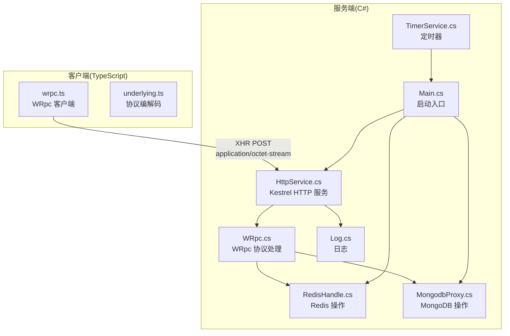
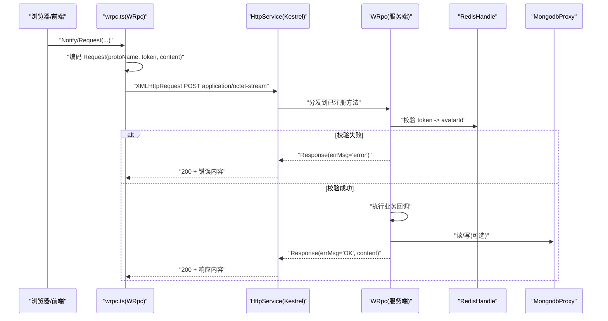
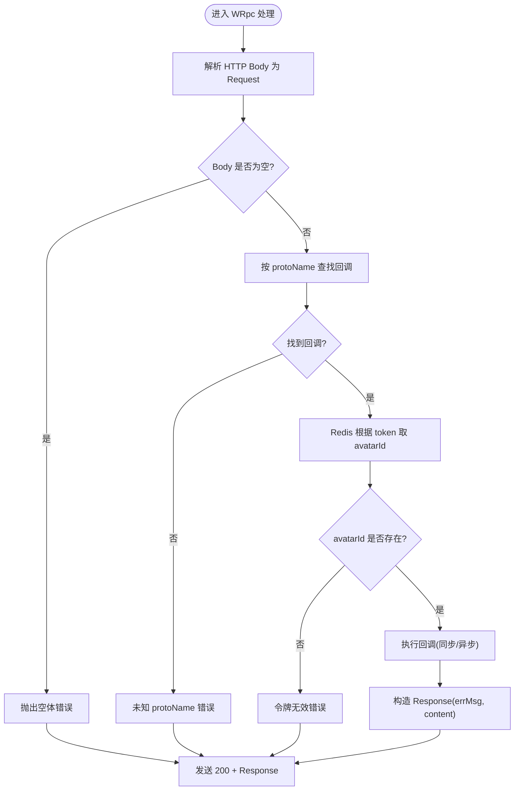
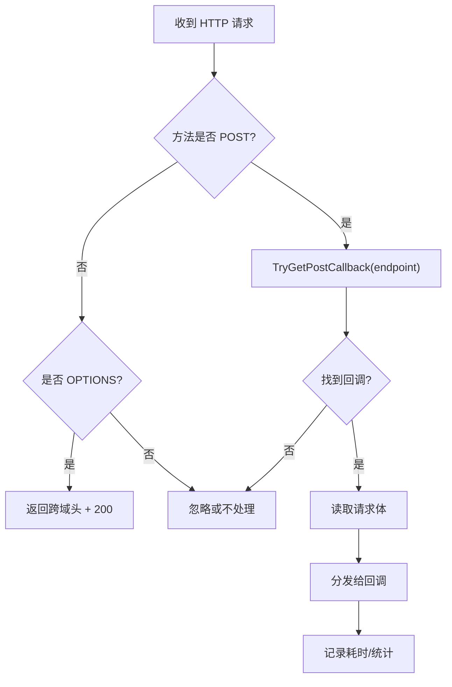
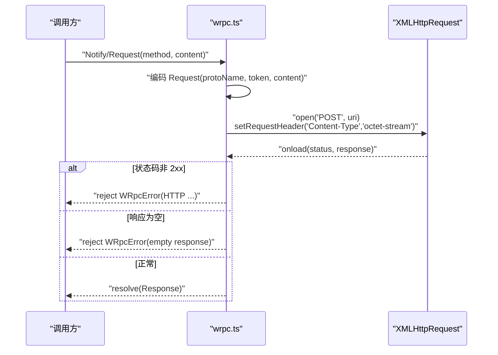
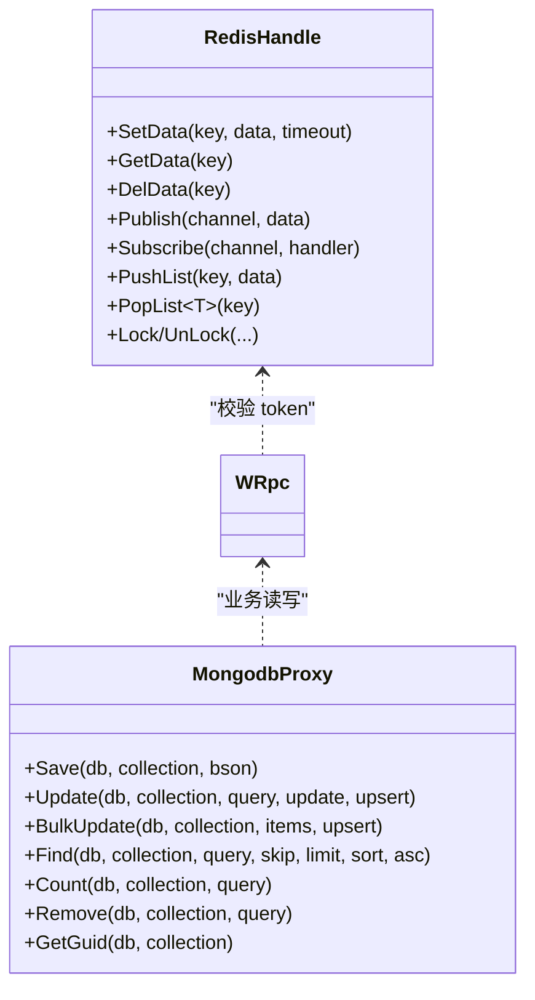
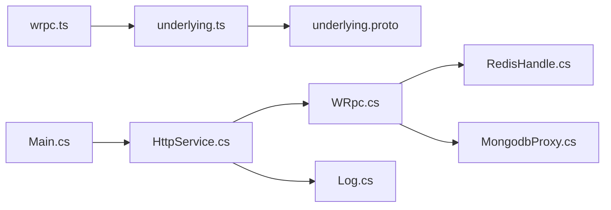

# 网络通信诊断

<cite>
**本文引用的文件**   
- [WRpc.cs](file://lgbf/hub/WRpc.cs)
- [HttpService.cs](file://lgbf/hub/HttpService.cs)
- [HttpClientWrapper.cs](file://lgbf/hub/HttpClientWrapper.cs)
- [Main.cs](file://lgbf/hub/Main.cs)
- [Log.cs](file://lgbf/hub/Log.cs)
- [RedisHandle.cs](file://lgbf/hub/RedisHandle.cs)
- [MongodbProxy.cs](file://lgbf/hub/MongodbProxy.cs)
- [underlying.proto](file://lgbf/underlying/underlying.proto)
- [wrpc.ts](file://gem/ccc/assets/script/ServerSDK/wrpc.ts)
- [underlying.ts](file://gem/ccc/assets/script/ServerSDK/underlying.ts)
- [TimerService.cs](file://lgbf/hub/TimerService.cs)
- [README.md](file://README.md)
</cite>

## 目录
1. [简介](#简介)
2. [项目结构](#项目结构)
3. [核心组件](#核心组件)
4. [架构总览](#架构总览)
5. [详细组件分析](#详细组件分析)
6. [依赖关系分析](#依赖关系分析)
7. [性能考量](#性能考量)
8. [故障排查指南](#故障排查指南)
9. [结论](#结论)
10. [附录](#附录)

## 简介
本指南聚焦于 LGBF 后端框架中的网络通信问题诊断与修复，覆盖以下主题：
- HTTP 连接超时、请求失败、响应异常的排查步骤
- WRpc 协议的通信机制与常见协议错误识别
- 网络延迟测量与带宽分析方法
- 防火墙、SSL 证书验证、跨域（CORS）问题的解决方案
- 负载均衡与反向代理对通信的影响
- 网络监控工具与性能指标解读
- WebSocket 连接问题的诊断与修复

目标是在最短时间内定位并解决网络问题。

## 项目结构
LGBF 是一个轻量级游戏后端框架，核心网络层由 C# 编写的 Kestrel HTTP 服务器与前端 TypeScript 客户端 WRpc 组件构成。数据持久化通过 Redis 和 MongoDB 实现，日志系统统一输出到文件。

**图表来源**
- [Main.cs:31-40](file://lgbf/hub/Main.cs#L31-L40)
- [HttpService.cs:149-181](file://lgbf/hub/HttpService.cs#L149-L181)
- [WRpc.cs:14-45](file://lgbf/hub/WRpc.cs#L14-L45)
- [RedisHandle.cs:13-25](file://lgbf/hub/RedisHandle.cs#L13-L25)
- [MongodbProxy.cs:10-18](file://lgbf/hub/MongodbProxy.cs#L10-L18)
- [wrpc.ts:21-101](file://gem/ccc/assets/script/ServerSDK/wrpc.ts#L21-L101)
- [underlying.ts:191-239](file://gem/ccc/assets/script/ServerSDK/underlying.ts#L191-L239)

**章节来源**
- [README.md:1-3](file://README.md#L1-L3)
- [Main.cs:31-40](file://lgbf/hub/Main.cs#L31-L40)
- [HttpService.cs:149-181](file://lgbf/hub/HttpService.cs#L149-L181)

## 核心组件
- HTTP 服务与路由：基于 Kestrel 的最小实现，支持 OPTIONS 预检与跨域头设置，接收 POST 请求并分发到对应回调。
- WRpc 协议：以 Protobuf 为载体，通过 HTTP POST 传输 Request/Response，服务端按方法名路由到注册的处理器。
- 客户端 WRpc：前端使用 XMLHttpRequest 发送 application/octet-stream，内置超时与错误处理。
- 数据存储：Redis 用于会话令牌校验与缓存；MongoDB 用于批量写入与查询。
- 日志与监控：统一日志输出与每秒连接统计。

**章节来源**
- [HttpService.cs:40-114](file://lgbf/hub/HttpService.cs#L40-L114)
- [WRpc.cs:47-153](file://lgbf/hub/WRpc.cs#L47-L153)
- [wrpc.ts:21-101](file://gem/ccc/assets/script/ServerSDK/wrpc.ts#L21-L101)
- [RedisHandle.cs:13-25](file://lgbf/hub/RedisHandle.cs#L13-L25)
- [MongodbProxy.cs:10-18](file://lgbf/hub/MongodbProxy.cs#L10-L18)
- [Log.cs:6-112](file://lgbf/hub/Log.cs#L6-L112)

## 架构总览
下图展示从浏览器到服务端的完整调用链路，包括 WRpc 协议封装、HTTP 传输、服务端解析与存储交互。

**图表来源**
- [wrpc.ts:32-68](file://gem/ccc/assets/script/ServerSDK/wrpc.ts#L32-L68)
- [HttpService.cs:50-114](file://lgbf/hub/HttpService.cs#L50-L114)
- [WRpc.cs:14-45](file://lgbf/hub/WRpc.cs#L14-L45)
- [WRpc.cs:47-153](file://lgbf/hub/WRpc.cs#L47-L153)
- [RedisHandle.cs:13-25](file://lgbf/hub/RedisHandle.cs#L13-L25)
- [MongodbProxy.cs:10-18](file://lgbf/hub/MongodbProxy.cs#L10-L18)

## 详细组件分析

### WRpc 协议与服务端处理
- 方法注册：支持同步/异步通知与请求，按 protoName 路由到回调。
- 请求解析：从 HTTP Body 解析 Protobuf Request，提取 token 与 protoName。
- 令牌校验：通过 Redis 获取 avatarId，若为空则返回错误。
- 响应格式：统一返回 Protobuf Response，包含 errMsg 与 content。
- 异常处理：捕获回调异常并回传错误信息，最终总是发送 200 OK。

**图表来源**
- [WRpc.cs:14-45](file://lgbf/hub/WRpc.cs#L14-L45)
- [WRpc.cs:47-153](file://lgbf/hub/WRpc.cs#L47-L153)

**章节来源**
- [WRpc.cs:14-153](file://lgbf/hub/WRpc.cs#L14-L153)
- [underlying.proto:3-12](file://lgbf/underlying/underlying.proto#L3-L12)

### HTTP 服务与跨域
- 路由：根据请求路径首段作为 endpoint，POST 走 TryGetPostCallback 分发。
- CORS：OPTIONS 预检直接返回允许的跨域头与 200。
- 超时检测：记录处理耗时，超过阈值在日志中告警。
- 连接统计：每秒统计消息数量，便于观察流量峰值。

**图表来源**
- [HttpService.cs:50-114](file://lgbf/hub/HttpService.cs#L50-L114)
- [HttpService.cs:139-147](file://lgbf/hub/HttpService.cs#L139-L147)

**章节来源**
- [HttpService.cs:40-114](file://lgbf/hub/HttpService.cs#L40-L114)
- [HttpService.cs:129-137](file://lgbf/hub/HttpService.cs#L129-L137)

### 客户端 WRpc（前端）
- 使用 XMLHttpRequest 发送 POST，设置 Content-Type 为 application/octet-stream。
- 内置超时、网络错误、请求中止等错误类型，统一包装为 WRpcError。
- 对响应进行状态码检查与空体校验，并解码 Protobuf Response。

**图表来源**
- [wrpc.ts:70-100](file://gem/ccc/assets/script/ServerSDK/wrpc.ts#L70-L100)

**章节来源**
- [wrpc.ts:21-101](file://gem/ccc/assets/script/ServerSDK/wrpc.ts#L21-L101)

### 存储与并发
- Redis：提供字符串、列表、有序集合、哈希等操作，内部对超时异常进行重连恢复与退避。
- MongoDB：支持插入、更新、批量写入、查询、计数等，批量写入采用无序模式提升吞吐。
- 并发限制：Kestrel KeepAlive 超时与最大并发连接数限制，避免资源耗尽。

**图表来源**
- [RedisHandle.cs:13-544](file://lgbf/hub/RedisHandle.cs#L13-L544)
- [MongodbProxy.cs:10-221](file://lgbf/hub/MongodbProxy.cs#L10-L221)
- [WRpc.cs:31-35](file://lgbf/hub/WRpc.cs#L31-L35)

**章节来源**
- [RedisHandle.cs:13-544](file://lgbf/hub/RedisHandle.cs#L13-L544)
- [MongodbProxy.cs:10-221](file://lgbf/hub/MongodbProxy.cs#L10-L221)
- [HttpService.cs:154-160](file://lgbf/hub/HttpService.cs#L154-L160)

## 依赖关系分析
- 服务端依赖：Microsoft.AspNetCore.*（Kestrel）、Google.Protobuf、StackExchange.Redis、MongoDB.Driver。
- 客户端依赖：ts-proto 生成的底层消息定义与编解码工具。
- 关键耦合点：WRpc 依赖 Redis 校验 token；HTTP 层依赖回调字典进行方法分发；日志贯穿全链路。

**图表来源**
- [wrpc.ts:1-101](file://gem/ccc/assets/script/ServerSDK/wrpc.ts#L1-L101)
- [underlying.ts:191-239](file://gem/ccc/assets/script/ServerSDK/underlying.ts#L191-L239)
- [underlying.proto:1-12](file://lgbf/underlying/underlying.proto#L1-L12)
- [Main.cs:31-40](file://lgbf/hub/Main.cs#L31-L40)
- [HttpService.cs:149-181](file://lgbf/hub/HttpService.cs#L149-L181)
- [WRpc.cs:14-45](file://lgbf/hub/WRpc.cs#L14-L45)
- [RedisHandle.cs:13-25](file://lgbf/hub/RedisHandle.cs#L13-L25)
- [MongodbProxy.cs:10-18](file://lgbf/hub/MongodbProxy.cs#L10-L18)
- [Log.cs:6-112](file://lgbf/hub/Log.cs#L6-L112)

**章节来源**
- [package-lock.json:1-40](file://package-lock.json#L1-L40)

## 性能考量
- 连接与并发
  - Kestrel 最大并发连接数与 KeepAlive 超时限制，避免单机过载。
  - 建议在反向代理层做连接复用与队列限流。
- 序列化与传输
  - Protobuf 二进制体积小，建议保持 application/octet-stream。
  - 大对象建议分片或压缩（需前后端约定）。
- 存储写入
  - MongoDB 批量写入采用无序模式，提高吞吐；注意写入失败的回滚策略。
- 日志与统计
  - 每秒连接统计可用于快速发现流量尖峰；超时日志用于定位慢请求。

**章节来源**
- [HttpService.cs:154-160](file://lgbf/hub/HttpService.cs#L154-L160)
- [MongodbProxy.cs:102-120](file://lgbf/hub/MongodbProxy.cs#L102-L120)
- [HttpService.cs:47-62](file://lgbf/hub/HttpService.cs#L47-L62)
- [Log.cs:6-112](file://lgbf/hub/Log.cs#L6-L112)

## 故障排查指南

### 一、HTTP 连接超时
- 现象
  - 客户端报“超时”或“网络错误”，服务端日志出现“Timeout: elapsed_ticks=...”。
- 排查步骤
  1) 检查服务端 Kestrel 配置：最大并发连接数、KeepAlive 超时是否合理。
  2) 检查服务端日志：是否存在大量“Timeout: elapsed_ticks=...”。
  3) 检查反向代理/负载均衡：是否正确转发请求体与头部。
  4) 检查网络路径：中间链路是否存在丢包/延迟抖动。
- 修复建议
  - 提升服务端并发上限或启用连接池。
  - 在网关层增加健康检查与熔断。
  - 优化业务回调逻辑，避免阻塞 IO。

**章节来源**
- [HttpService.cs:154-160](file://lgbf/hub/HttpService.cs#L154-L160)
- [HttpService.cs:108-112](file://lgbf/hub/HttpService.cs#L108-L112)

### 二、请求失败（HTTP 4xx/5xx）
- 现象
  - 客户端收到非 2xx 状态码；或响应体为空。
- 排查步骤
  1) 客户端侧：确认 Content-Type 设置为 application/octet-stream。
  2) 服务端侧：查看 OPTIONS 预检是否返回跨域头；检查回调是否注册。
  3) 服务端侧：检查日志中是否有异常堆栈。
- 修复建议
  - 补充缺失的回调注册。
  - 修正跨域头配置，确保预检通过。
  - 修复业务回调中的异常。

**章节来源**
- [wrpc.ts:70-100](file://gem/ccc/assets/script/ServerSDK/wrpc.ts#L70-L100)
- [HttpService.cs:72-81](file://lgbf/hub/HttpService.cs#L72-L81)
- [HttpService.cs:139-147](file://lgbf/hub/HttpService.cs#L139-L147)

### 三、响应异常（WRpc Response）
- 现象
  - Response.errMsg 非 “OK”，content 包含错误信息。
- 排查步骤
  1) 确认 protoName 与注册方法一致。
  2) 检查 token 是否有效（Redis 中是否存在对应 avatarId）。
  3) 捕获回调异常并查看 errMsg。
- 修复建议
  - 重新发放有效 token。
  - 修复回调逻辑或数据模型。

**章节来源**
- [WRpc.cs:26-35](file://lgbf/hub/WRpc.cs#L26-L35)
- [WRpc.cs:58-69](file://lgbf/hub/WRpc.cs#L58-L69)
- [WRpc.cs:117-123](file://lgbf/hub/WRpc.cs#L117-L123)

### 四、WRpc 协议错误识别
- 错误类型
  - 空请求体：服务端抛出“empty body”。
  - 未知 protoName：服务端抛出“unknown proto”。
  - 令牌无效：服务端抛出“wrong avatarId is nil!”。
- 诊断要点
  - 核对前端编码的 protoName 与服务端注册一致。
  - 核对 token 是否在 Redis 中存在且未过期。
  - 检查 Protobuf 编解码版本一致性。

**章节来源**
- [WRpc.cs:20-23](file://lgbf/hub/WRpc.cs#L20-L23)
- [WRpc.cs:28](file://lgbf/hub/WRpc.cs#L28)
- [WRpc.cs:34](file://lgbf/hub/WRpc.cs#L34)
- [underlying.proto:3-12](file://lgbf/underlying/underlying.proto#L3-L12)

### 五、网络延迟测量与带宽分析
- 延迟测量
  - 使用客户端 WRpc 的超时参数与服务端日志耗时统计交叉验证。
  - 在网关层记录请求进入时间与响应时间，计算 P50/P95。
- 带宽分析
  - 统计请求体大小与响应体大小分布，结合并发连接数评估带宽占用。
  - 对大对象进行压缩或分片传输。

**章节来源**
- [wrpc.ts:26](file://gem/ccc/assets/script/ServerSDK/wrpc.ts#L26)
- [HttpService.cs:108-112](file://lgbf/hub/HttpService.cs#L108-L112)

### 六、防火墙与跨域（CORS）
- 现象
  - 浏览器报跨域错误；OPTIONS 预检失败。
- 排查步骤
  1) 确认服务端返回 Access-Control-Allow-* 头。
  2) 确认客户端请求头包含 XL-Token 或 Content-Type。
  3) 确认防火墙放行目标端口。
- 修复建议
  - 保持跨域头配置一致。
  - 在网关层统一处理预检请求。

**章节来源**
- [HttpService.cs:129-137](file://lgbf/hub/HttpService.cs#L129-L137)
- [HttpService.cs:72-81](file://lgbf/hub/HttpService.cs#L72-L81)

### 七、SSL 证书验证
- 现象
  - HTTPS 下客户端报证书错误或握手失败。
- 排查步骤
  1) 检查证书链完整性与域名匹配。
  2) 检查服务端 TLS 版本与加密套件。
  3) 检查网关/反向代理是否正确终止 TLS。
- 修复建议
  - 更新证书与中间证书。
  - 在网关层开启 TLS 并透传至后端。

### 八、负载均衡与反向代理
- 影响
  - 会话粘性不足导致 token 校验失败。
  - 超时与连接复用不当引发连接中断。
- 排查步骤
  1) 检查代理是否转发真实客户端 IP 与原始协议。
  2) 检查代理超时设置与 Keep-Alive。
  3) 检查健康检查与熔断策略。
- 修复建议
  - 启用基于 Cookie/Session 的粘性会话。
  - 调整超时与连接池参数。

### 九、网络监控与性能指标
- 指标
  - QPS、P95 延迟、错误率、超时率、连接数、内存/CPU。
- 工具
  - Prometheus/Grafana、APM（如 Application Insights）、服务端日志统计。
- 指标解读
  - QPS 突增 + 超时上升：上游压力过大或下游慢查询。
  - 错误率升高：协议不一致或数据异常。

**章节来源**
- [HttpService.cs:47-62](file://lgbf/hub/HttpService.cs#L47-L62)
- [Log.cs:6-112](file://lgbf/hub/Log.cs#L6-L112)

### 十、WebSocket 连接问题
- 现象
  - 握手失败、心跳超时、断线重连频繁。
- 排查步骤
  1) 检查反向代理是否支持 WebSocket 升级。
  2) 检查 Keep-Alive 与超时配置。
  3) 检查防火墙是否放行 WebSocket 端口。
- 修复建议
  - 在网关层启用 WebSocket 支持与长连接。
  - 调整心跳间隔与超时阈值。

[本节为通用指导，不直接分析具体文件]

## 结论
通过统一的日志、明确的协议边界与合理的网关配置，LGBF 的网络通信问题可以被快速定位与修复。建议优先检查 WRpc 协议一致性、跨域与超时配置，再逐步深入到存储与并发层面。

## 附录

### A. WRpc 协议字段说明
- Request.protoName：方法名，用于服务端路由。
- Request.token：令牌，用于 Redis 校验。
- Request.content：序列化后的业务数据。
- Response.errMsg：错误信息，正常为 “OK”。
- Response.content：返回的业务数据。

**章节来源**
- [underlying.proto:3-12](file://lgbf/underlying/underlying.proto#L3-L12)

### B. 常见错误对照表
- 空请求体：服务端抛出“empty body”。
- 未知 protoName：服务端抛出“unknown proto”。
- 令牌无效：服务端抛出“wrong avatarId is nil!”。
- 非 2xx 响应：客户端抛出“HTTP ...”。

**章节来源**
- [WRpc.cs:20-23](file://lgbf/hub/WRpc.cs#L20-L23)
- [WRpc.cs:28](file://lgbf/hub/WRpc.cs#L28)
- [WRpc.cs:34](file://lgbf/hub/WRpc.cs#L34)
- [wrpc.ts:79-96](file://gem/ccc/assets/script/ServerSDK/wrpc.ts#L79-L96)