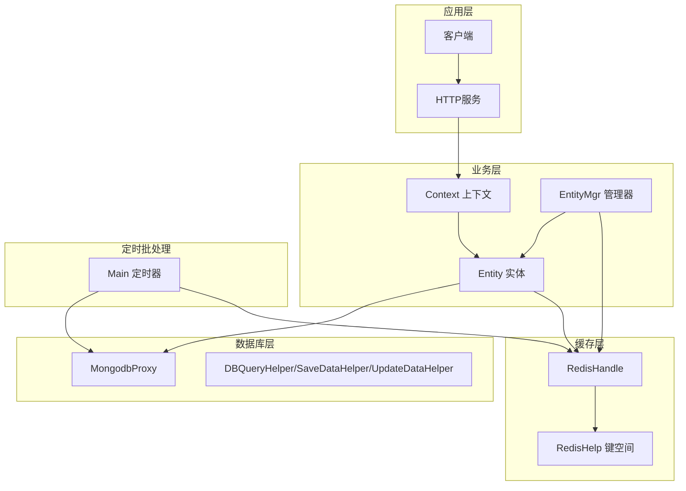
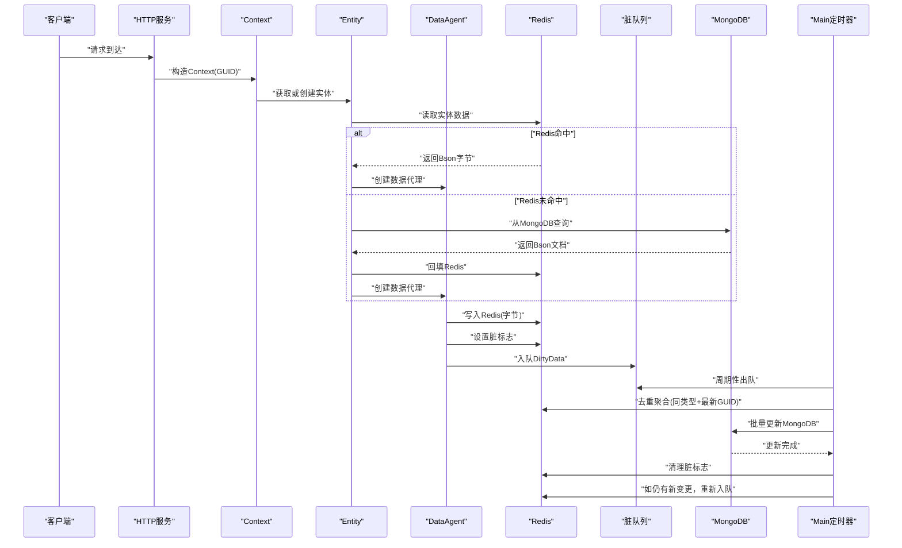
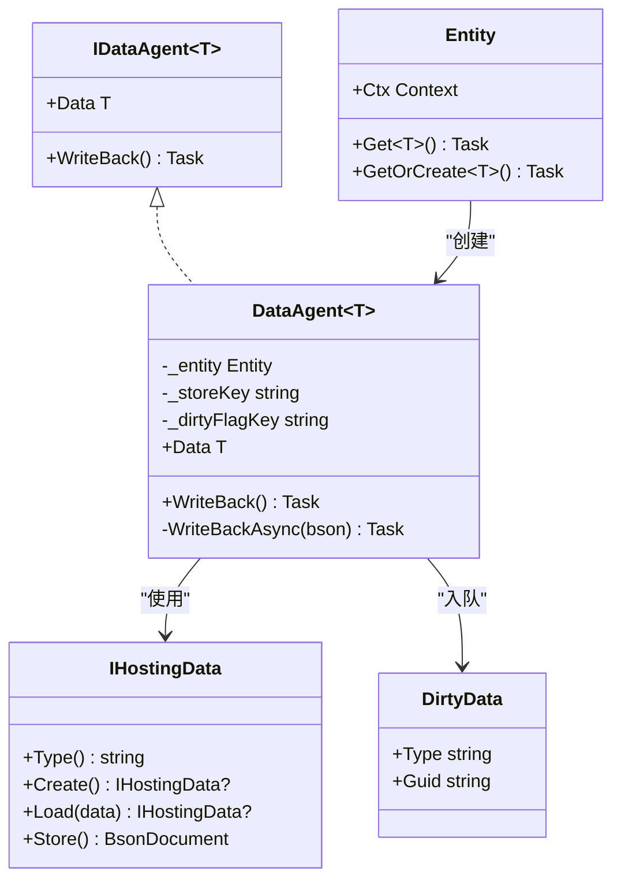
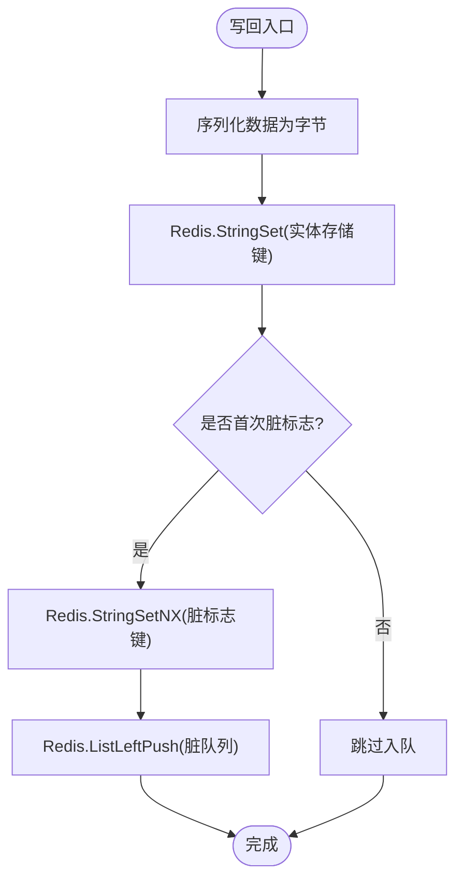
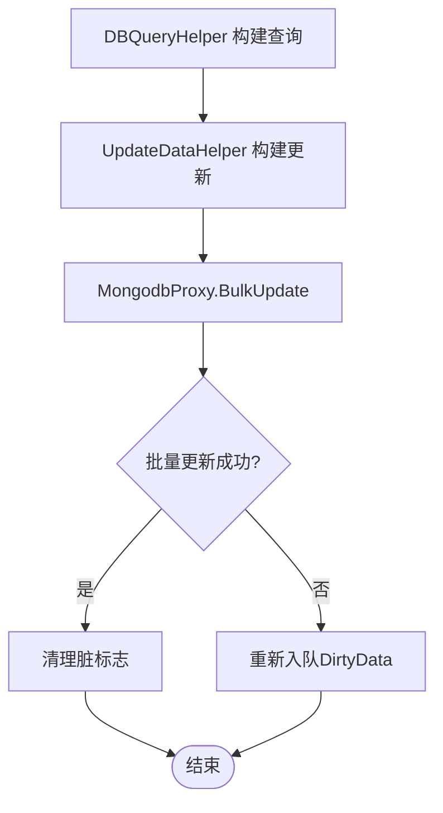
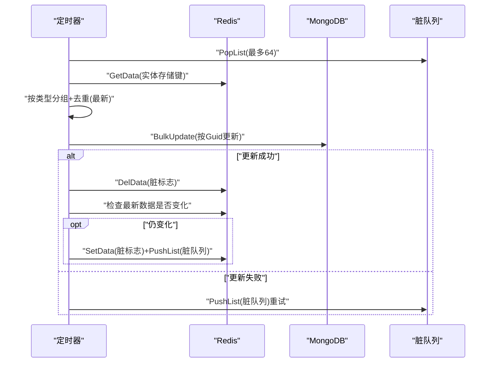
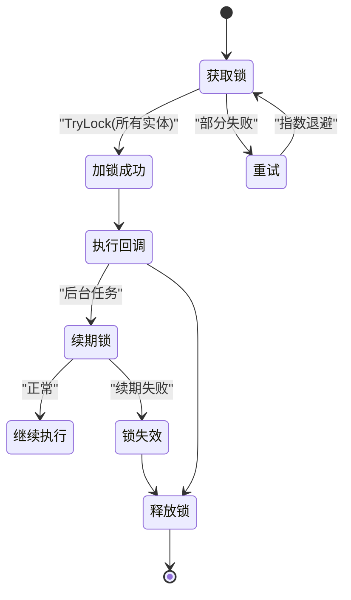
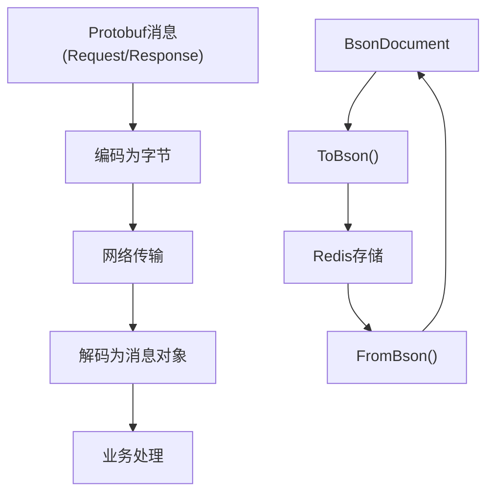
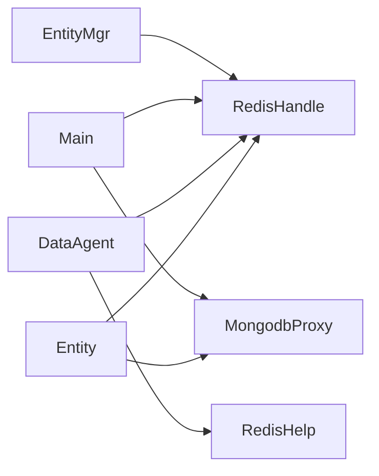

# 数据流架构

<cite>
**本文引用的文件**
- [Entity.cs](file://lgbf/hub/Entity.cs)
- [EntityMgr.cs](file://lgbf/hub/EntityMgr.cs)
- [RedisHandle.cs](file://lgbf/hub/RedisHandle.cs)
- [RedisHelp.cs](file://lgbf/hub/RedisHelp.cs)
- [MongodbProxy.cs](file://lgbf/hub/MongodbProxy.cs)
- [DbHelper.cs](file://lgbf/hub/DbHelper.cs)
- [Main.cs](file://lgbf/hub/Main.cs)
- [Context.cs](file://lgbf/hub/Context.cs)
- [underlying.proto](file://lgbf/underlying/underlying.proto)
- [Log.cs](file://lgbf/hub/Log.cs)
</cite>

## 目录
1. [引言](#引言)
2. [项目结构](#项目结构)
3. [核心组件](#核心组件)
4. [架构总览](#架构总览)
5. [详细组件分析](#详细组件分析)
6. [依赖关系分析](#依赖关系分析)
7. [性能考量](#性能考量)
8. [故障排查指南](#故障排查指南)
9. [结论](#结论)
10. [附录](#附录)

## 引言
本文件面向LGBF框架，系统性阐述其数据流架构：从客户端请求进入、实体数据处理、Redis缓存层写入、脏数据标记与批量落库，到MongoDB数据库持久化；并深入解析脏数据管理机制（变更检测、批量保存策略、冲突解决）、Redis与MongoDB之间的一致性保障策略、数据序列化与反序列化（含Protobuf）以及备份与恢复机制。文档同时提供数据流图与状态转换图，帮助读者快速把握系统全貌。

## 项目结构
LGBF后端主要由以下模块构成：
- 实体与数据代理：Entity、IDataAgent、DataAgent
- 缓存层：RedisHandle、RedisHelp
- 数据库层：MongodbProxy、DBQueryHelper、SaveDataHelper、UpdateDataHelper
- 运行时上下文：Context
- 定时批处理：Main（定时器触发批量落库）
- 序列化协议：underlying.proto
- 日志与错误处理：Log

图表来源
- [Context.cs:4-26](file://lgbf/hub/Context.cs#L4-L26)
- [Entity.cs:94-153](file://lgbf/hub/Entity.cs#L94-L153)
- [EntityMgr.cs:44-126](file://lgbf/hub/EntityMgr.cs#L44-L126)
- [RedisHandle.cs:13-543](file://lgbf/hub/RedisHandle.cs#L13-L543)
- [RedisHelp.cs:4-19](file://lgbf/hub/RedisHelp.cs#L4-L19)
- [MongodbProxy.cs:10-220](file://lgbf/hub/MongodbProxy.cs#L10-L220)
- [DbHelper.cs:4-310](file://lgbf/hub/DbHelper.cs#L4-L310)
- [Main.cs:13-158](file://lgbf/hub/Main.cs#L13-L158)

章节来源
- [Context.cs:4-26](file://lgbf/hub/Context.cs#L4-L26)
- [Entity.cs:94-153](file://lgbf/hub/Entity.cs#L94-L153)
- [EntityMgr.cs:44-126](file://lgbf/hub/EntityMgr.cs#L44-L126)
- [RedisHandle.cs:13-543](file://lgbf/hub/RedisHandle.cs#L13-L543)
- [RedisHelp.cs:4-19](file://lgbf/hub/RedisHelp.cs#L4-L19)
- [MongodbProxy.cs:10-220](file://lgbf/hub/MongodbProxy.cs#L10-L220)
- [DbHelper.cs:4-310](file://lgbf/hub/DbHelper.cs#L4-L310)
- [Main.cs:13-158](file://lgbf/hub/Main.cs#L13-L158)

## 核心组件
- 实体与数据代理
  - IHostingData：定义实体数据的序列化/反序列化接口
  - IDataAgent<T>：实体数据的读写代理接口
  - DataAgent<T>：具体实现，负责将内存数据写回Redis，并标记脏数据
  - Entity：实体生命周期管理，支持Get/GetOrCreate，优先从Redis加载，缺失则从MongoDB加载并回填Redis
- 缓存层
  - RedisHandle：封装Redis连接、命令执行、发布订阅、列表操作、分布式锁等
  - RedisHelp：集中定义键空间命名规范（实体存储、脏标志、队列、排行榜等）
- 数据库层
  - MongodbProxy：封装MongoDB的插入、更新、批量更新、查询、计数、删除、自增等
  - DBQueryHelper/SaveDataHelper/UpdateDataHelper：构建查询、保存、更新的BSON文档
- 运行时上下文
  - Context：持有当前实体的GUID、Redis句柄、MongoDB句柄、定时器实例
- 定时批处理
  - Main：定时器周期性拉取脏数据队列，按类型聚合最新版本，批量更新MongoDB，并清理脏标志

章节来源
- [Entity.cs:4-153](file://lgbf/hub/Entity.cs#L4-L153)
- [RedisHandle.cs:13-543](file://lgbf/hub/RedisHandle.cs#L13-L543)
- [RedisHelp.cs:4-19](file://lgbf/hub/RedisHelp.cs#L4-L19)
- [MongodbProxy.cs:10-220](file://lgbf/hub/MongodbProxy.cs#L10-L220)
- [DbHelper.cs:4-310](file://lgbf/hub/DbHelper.cs#L4-L310)
- [Context.cs:4-26](file://lgbf/hub/Context.cs#L4-L26)
- [Main.cs:13-158](file://lgbf/hub/Main.cs#L13-L158)

## 架构总览
LGBF采用“缓存优先、异步落库”的数据架构：
- 写路径：业务修改实体 -> 写回Redis -> 设置脏标志 -> 入队待落库
- 读路径：优先从Redis读取 -> 缺失则从MongoDB读取并回填Redis
- 批处理：定时器周期性从队列取出脏数据，去重聚合，批量写入MongoDB，清理脏标志
- 一致性：通过Redis键空间命名、脏标志、队列、分布式锁保障最终一致

图表来源
- [Entity.cs:104-153](file://lgbf/hub/Entity.cs#L104-L153)
- [RedisHandle.cs:84-131](file://lgbf/hub/RedisHandle.cs#L84-L131)
- [RedisHelp.cs:4-19](file://lgbf/hub/RedisHelp.cs#L4-L19)
- [MongodbProxy.cs:102-120](file://lgbf/hub/MongodbProxy.cs#L102-L120)
- [Main.cs:50-157](file://lgbf/hub/Main.cs#L50-L157)

## 详细组件分析

### 实体与数据代理（Entity/DataAgent）
- 职责
  - Entity：根据GUID定位实体，优先从Redis加载；若无则从MongoDB加载并回填Redis；提供Get/GetOrCreate
  - DataAgent：将内存数据序列化为Bson字节，写入Redis；设置脏标志；将DirtyData入队等待批量落库
- 关键点
  - 序列化：调用IHostingData.Store()生成BsonDocument，再ToBson()写入Redis
  - 脏标志：首次设置脏标志后，后续变更不再重复入队
  - 队列：将DirtyData推入Redis列表，供定时器消费

图表来源
- [Entity.cs:4-92](file://lgbf/hub/Entity.cs#L4-L92)
- [Entity.cs:94-153](file://lgbf/hub/Entity.cs#L94-L153)

章节来源
- [Entity.cs:4-153](file://lgbf/hub/Entity.cs#L4-L153)

### 缓存层（RedisHandle/RedisHelp）
- RedisHandle
  - 提供字符串、列表、哈希、有序集合、发布订阅、分布式锁等常用操作
  - 对RedisTimeoutException进行自动恢复与重试
  - 支持Protobuf消息的序列化与反序列化（通过底层二进制与JSON混合使用）
- RedisHelp
  - 统一键空间命名：实体存储、脏标志、队列、锁、排行榜等

图表来源
- [Entity.cs:52-91](file://lgbf/hub/Entity.cs#L52-L91)
- [RedisHandle.cs:84-131](file://lgbf/hub/RedisHandle.cs#L84-L131)
- [RedisHelp.cs:4-19](file://lgbf/hub/RedisHelp.cs#L4-L19)

章节来源
- [RedisHandle.cs:13-543](file://lgbf/hub/RedisHandle.cs#L13-L543)
- [RedisHelp.cs:4-19](file://lgbf/hub/RedisHelp.cs#L4-L19)

### 数据库层（MongodbProxy/DBQueryHelper/SaveDataHelper/UpdateDataHelper）
- MongodbProxy
  - 封装插入、更新、批量更新、查询、计数、删除、自增等
  - 批量更新使用BulkWrite，非有序模式提升吞吐
- DBQueryHelper/SaveDataHelper/UpdateDataHelper
  - 构建BSON查询、$set/$inc更新文档，避免手写字符串拼接

图表来源
- [DbHelper.cs:160-310](file://lgbf/hub/DbHelper.cs#L160-L310)
- [MongodbProxy.cs:102-120](file://lgbf/hub/MongodbProxy.cs#L102-L120)
- [Main.cs:103-146](file://lgbf/hub/Main.cs#L103-L146)

章节来源
- [MongodbProxy.cs:10-220](file://lgbf/hub/MongodbProxy.cs#L10-L220)
- [DbHelper.cs:4-310](file://lgbf/hub/DbHelper.cs#L4-L310)

### 定时批处理（Main）
- 周期性任务
  - 每5分钟扫描一次脏队列，最多取64条
  - 同类型按GUID去重，保留最新版本
  - 聚合后以upsert方式批量更新MongoDB
  - 成功后清理脏标志；若仍有新变更，重新入队

图表来源
- [Main.cs:50-157](file://lgbf/hub/Main.cs#L50-L157)

章节来源
- [Main.cs:13-158](file://lgbf/hub/Main.cs#L13-L158)

### 并发与一致性（EntityMgr/分布式锁）
- EntityMgr.CallLockAndGetEntity
  - 对多个实体ID加分布式锁，确保跨实体事务性
  - 后台线程定期续期锁，避免超时
  - 回调结束后统一释放锁

图表来源
- [EntityMgr.cs:44-126](file://lgbf/hub/EntityMgr.cs#L44-L126)

章节来源
- [EntityMgr.cs:44-126](file://lgbf/hub/EntityMgr.cs#L44-L126)

### 序列化与反序列化（Protobuf/BSON）
- Protobuf
  - underlying.proto定义Request/Response消息，用于RPC通信
  - 客户端/服务端通过编码/解码传输二进制消息
- BSON
  - 实体数据在Redis中以BsonDocument序列化为字节存储
  - 从MongoDB读取时同样使用BsonDocument，保持跨层一致性

图表来源
- [underlying.proto:3-12](file://lgbf/underlying/underlying.proto#L3-L12)
- [Entity.cs:54-110](file://lgbf/hub/Entity.cs#L54-L110)
- [MongodbProxy.cs:30-33](file://lgbf/hub/MongodbProxy.cs#L30-L33)

章节来源
- [underlying.proto:3-12](file://lgbf/underlying/underlying.proto#L3-L12)
- [Entity.cs:54-110](file://lgbf/hub/Entity.cs#L54-L110)
- [MongodbProxy.cs:30-33](file://lgbf/hub/MongodbProxy.cs#L30-L33)

## 依赖关系分析
- 组件耦合
  - Entity依赖RedisHandle与MongodbProxy，通过Context注入
  - DataAgent依赖RedisHelp键空间与Entity上下文
  - Main依赖RedisHandle与MongodbProxy，驱动批量落库
  - EntityMgr依赖RedisHandle进行分布式锁
- 外部依赖
  - StackExchange.Redis（Redis）
  - MongoDB.Bson（BSON序列化）
  - Google.Protobuf（RPC消息）

图表来源
- [Entity.cs:94-153](file://lgbf/hub/Entity.cs#L94-L153)
- [RedisHandle.cs:13-543](file://lgbf/hub/RedisHandle.cs#L13-L543)
- [MongodbProxy.cs:10-220](file://lgbf/hub/MongodbProxy.cs#L10-L220)
- [Main.cs:13-158](file://lgbf/hub/Main.cs#L13-L158)
- [EntityMgr.cs:44-126](file://lgbf/hub/EntityMgr.cs#L44-L126)

章节来源
- [Entity.cs:94-153](file://lgbf/hub/Entity.cs#L94-L153)
- [RedisHandle.cs:13-543](file://lgbf/hub/RedisHandle.cs#L13-L543)
- [MongodbProxy.cs:10-220](file://lgbf/hub/MongodbProxy.cs#L10-L220)
- [Main.cs:13-158](file://lgbf/hub/Main.cs#L13-L158)
- [EntityMgr.cs:44-126](file://lgbf/hub/EntityMgr.cs#L44-L126)

## 性能考量
- 写入路径
  - Redis写入为O(1)，脏标志首次设置为O(1)，入队为O(1)
  - 批量更新使用BulkWrite，非有序模式减少往返开销
- 读取路径
  - 优先Redis命中，避免MongoDB查询
  - 未命中时一次性回填Redis，后续命中率提升
- 锁与并发
  - 分布式锁采用Redis SET key value NX EX seconds，避免死锁
  - 后台续期降低锁超时风险
- 定时批处理
  - 固定批次大小与间隔，平衡延迟与吞吐
  - 去重聚合避免重复更新同一实体

[本节为通用性能讨论，无需特定文件来源]

## 故障排查指南
- 常见问题
  - Redis超时：RedisHandle对RedisTimeoutException进行自动恢复与重试
  - 批量落库失败：Main在失败时将DirtyData重新入队，等待下次重试
  - 锁续期失败：抛出异常并终止回调，确保锁被释放
- 日志
  - Log模块提供Trace/Debug/Info/Warn/Err分级输出，自动轮转与截断
  - 关键路径均记录错误信息，便于定位

章节来源
- [RedisHandle.cs:27-34](file://lgbf/hub/RedisHandle.cs#L27-L34)
- [Main.cs:125-134](file://lgbf/hub/Main.cs#L125-L134)
- [EntityMgr.cs:35-41](file://lgbf/hub/EntityMgr.cs#L35-L41)
- [Log.cs:6-112](file://lgbf/hub/Log.cs#L6-L112)

## 结论
LGBF通过“缓存优先、异步落库、批量更新、分布式锁”实现了高吞吐、低延迟且具备最终一致性的数据流架构。Redis承担高频读写与脏数据管理，MongoDB承担持久化与复杂查询；定时批处理在不阻塞主线程的前提下完成落库，兼顾性能与一致性。Protobuf与BSON分别服务于RPC与实体存储，保证了跨层数据格式的高效与稳定。

[本节为总结性内容，无需特定文件来源]

## 附录

### 数据一致性与冲突解决
- 最终一致性
  - 写入先Redis，后批量落库至MongoDB
  - 通过脏标志与队列确保每条变更至少被处理一次
- 冲突解决
  - 同类型实体按GUID去重，保留最新版本
  - upsert模式避免重复主键冲突
  - 若批量更新失败，重新入队，保证幂等性

章节来源
- [Main.cs:103-146](file://lgbf/hub/Main.cs#L103-L146)
- [MongodbProxy.cs:102-120](file://lgbf/hub/MongodbProxy.cs#L102-L120)

### 备份与恢复机制
- 备份
  - MongoDB提供标准备份工具链（mongodump/mongorestore），建议结合时间窗口快照
- 恢复
  - 使用mongorestore从备份恢复；如需按GUID恢复单个实体，可结合Entity.Get/GetOrCreate逻辑从MongoDB重建Redis缓存
- 注意
  - 本仓库未提供专用备份脚本，建议在运维层面配置自动化备份与演练

[本节为通用运维建议，无需特定文件来源]