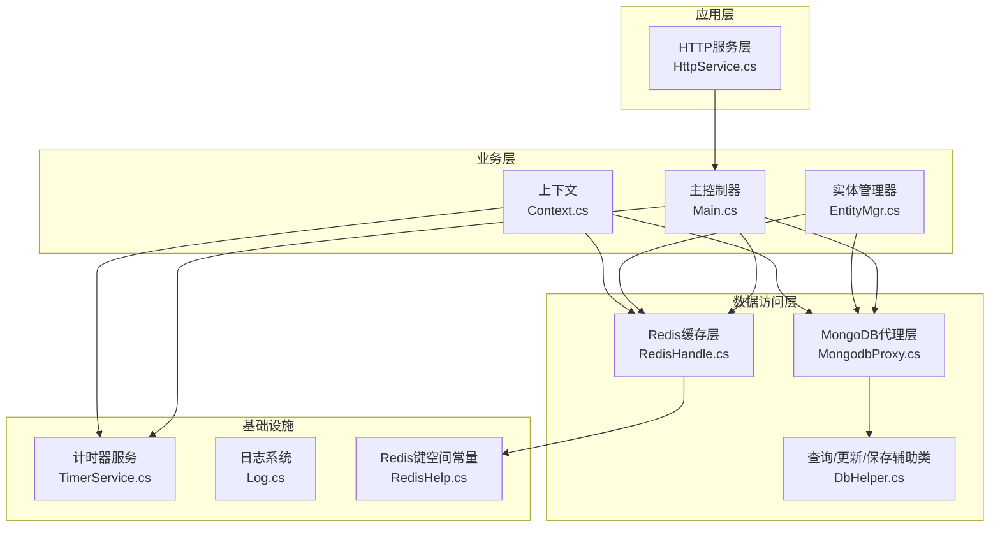
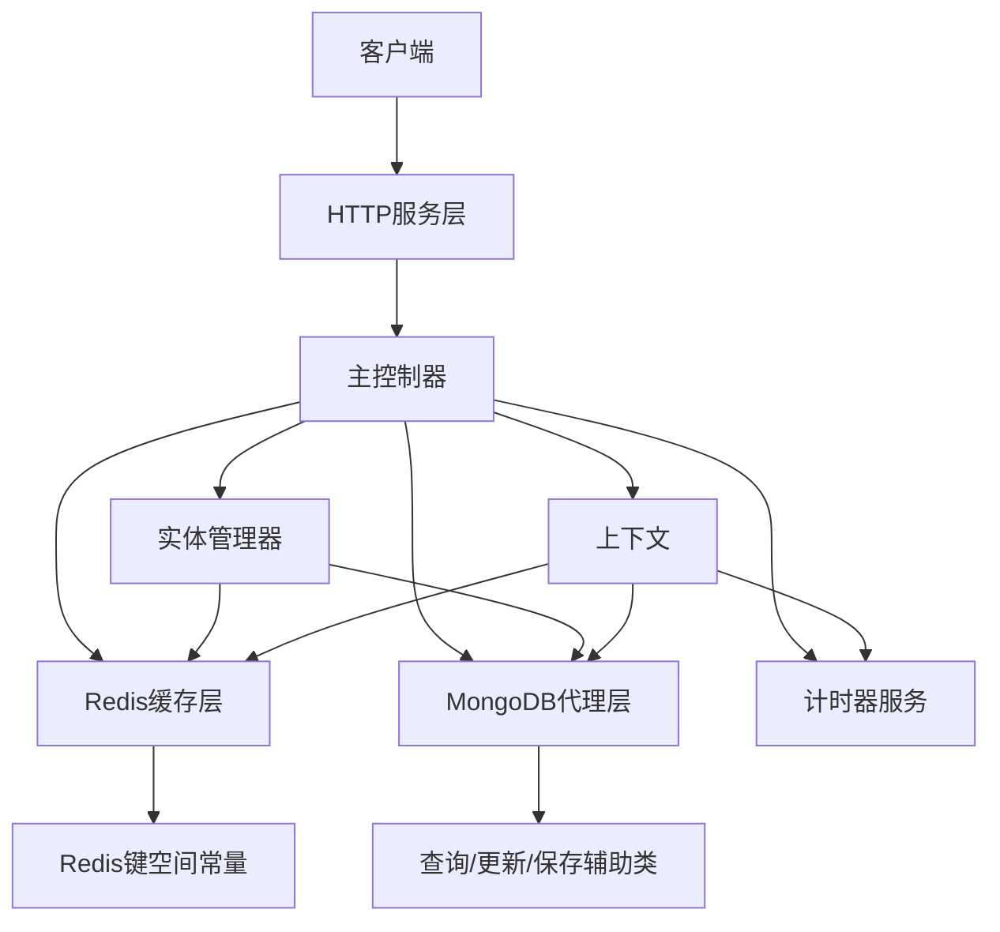
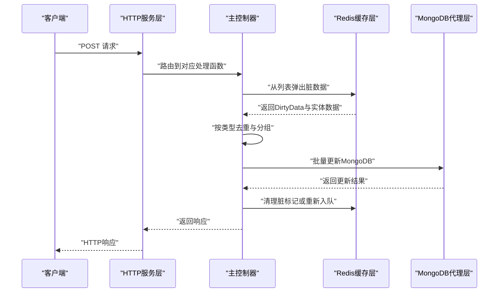
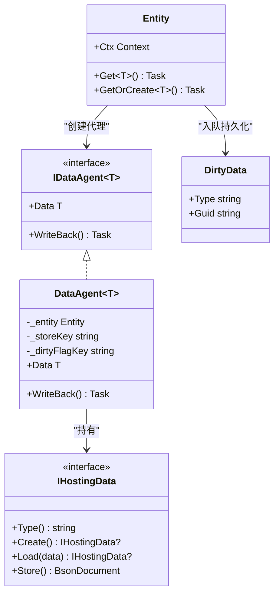
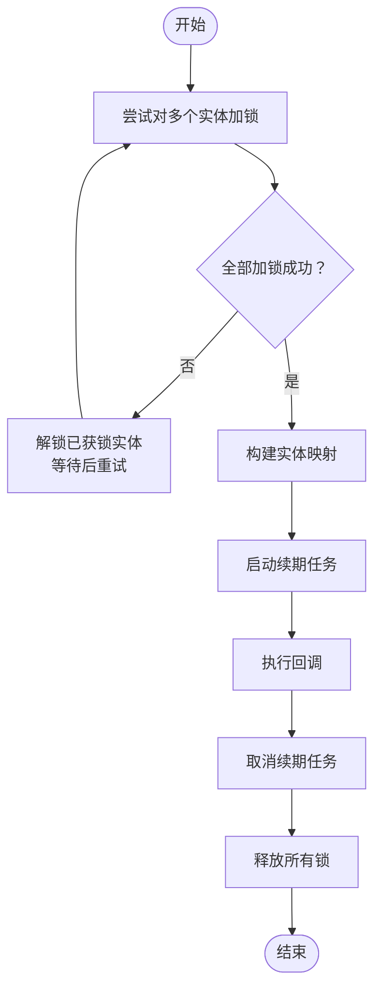
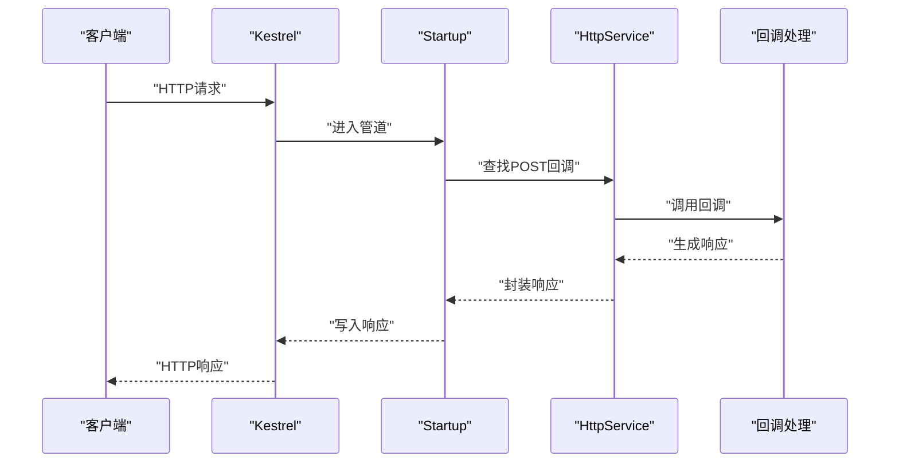
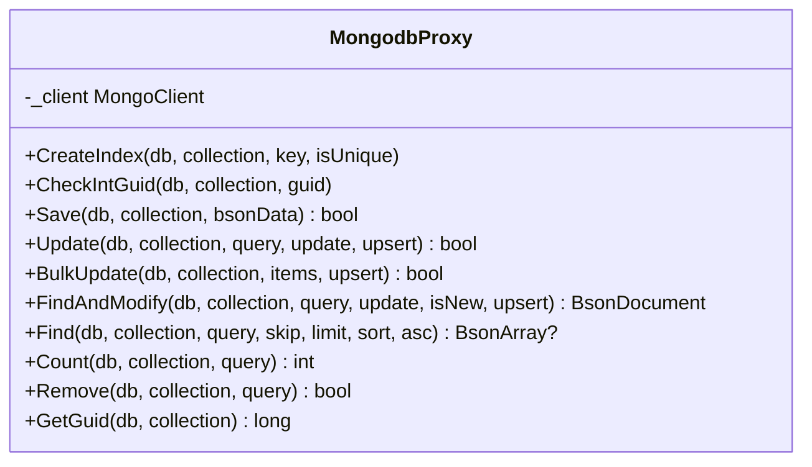
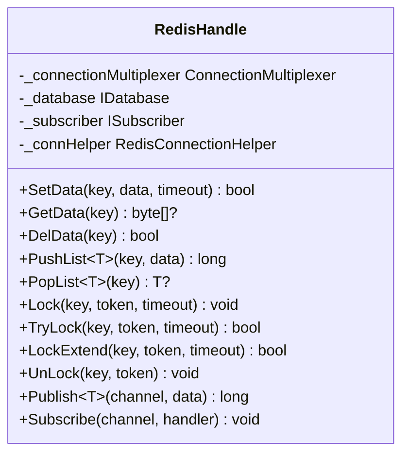
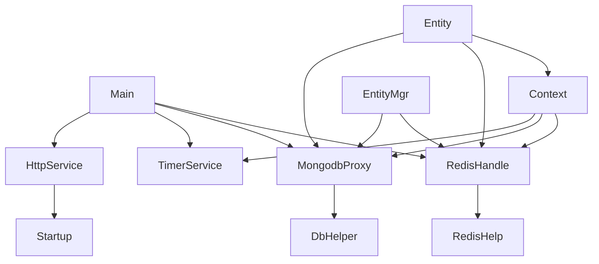

# 整体架构概览

<cite>
**本文档引用的文件**
- [Main.cs](file://lgbf/hub/Main.cs)
- [Entity.cs](file://lgbf/hub/Entity.cs)
- [EntityMgr.cs](file://lgbf/hub/EntityMgr.cs)
- [HttpService.cs](file://lgbf/hub/HttpService.cs)
- [MongodbProxy.cs](file://lgbf/hub/MongodbProxy.cs)
- [RedisHandle.cs](file://lgbf/hub/RedisHandle.cs)
- [Context.cs](file://lgbf/hub/Context.cs)
- [TimerService.cs](file://lgbf/hub/TimerService.cs)
- [RedisHelp.cs](file://lgbf/hub/RedisHelp.cs)
- [DbHelper.cs](file://lgbf/hub/DbHelper.cs)
- [Log.cs](file://lgbf/hub/Log.cs)
- [README.md](file://README.md)
</cite>

## 目录
1. [简介](#简介)
2. [项目结构](#项目结构)
3. [核心组件](#核心组件)
4. [架构总览](#架构总览)
5. [详细组件分析](#详细组件分析)
6. [依赖关系分析](#依赖关系分析)
7. [性能考虑](#性能考虑)
8. [故障排查指南](#故障排查指南)
9. [结论](#结论)

## 简介
LGBF（Lightweight Game Backend Framework）是一个轻量级游戏后端框架，采用分层架构与模块化设计，结合接口驱动的开发方式，实现高性能、可扩展的游戏服务器基础设施。系统通过Redis提供高速缓存与分布式锁，MongoDB提供持久化存储，并以HTTP服务层对外提供REST风格的接口能力。核心设计理念包括：
- 分层架构：清晰分离HTTP服务层、业务逻辑层、实体管理层与数据访问层
- 模块化设计：各组件职责单一，便于替换与扩展
- 接口驱动：通过接口抽象实体数据模型与数据代理，提升可测试性与可维护性
- 异步非阻塞：基于异步I/O与定时器机制，保证高并发下的响应性能

本架构文档旨在帮助开发者快速理解系统宏观结构、组件职责、数据流与控制流，以及关键设计决策（如Redis与MongoDB的技术选型）。

**章节来源**
- [README.md:1-3](file://README.md#L1-L3)

## 项目结构
项目采用按功能域划分的目录组织方式，核心代码位于lgbf/hub目录下，包含主控制器、实体管理、HTTP服务、数据库代理、缓存操作、上下文与计时器等模块。资源与工具位于gem与tools目录，用于支持Unity与Cocos引擎的资源管线与构建。

**图表来源**
- [Main.cs:13-40](file://lgbf/hub/Main.cs#L13-L40)
- [HttpService.cs:117-182](file://lgbf/hub/HttpService.cs#L117-L182)
- [EntityMgr.cs:3-128](file://lgbf/hub/EntityMgr.cs#L3-L128)
- [RedisHandle.cs:13-544](file://lgbf/hub/RedisHandle.cs#L13-L544)
- [MongodbProxy.cs:10-221](file://lgbf/hub/MongodbProxy.cs#L10-L221)
- [DbHelper.cs:4-311](file://lgbf/hub/DbHelper.cs#L4-L311)
- [TimerService.cs:7-126](file://lgbf/hub/TimerService.cs#L7-L126)
- [Log.cs:6-113](file://lgbf/hub/Log.cs#L6-L113)
- [RedisHelp.cs:4-20](file://lgbf/hub/RedisHelp.cs#L4-L20)

**章节来源**
- [Main.cs:13-40](file://lgbf/hub/Main.cs#L13-L40)
- [HttpService.cs:117-182](file://lgbf/hub/HttpService.cs#L117-L182)
- [EntityMgr.cs:3-128](file://lgbf/hub/EntityMgr.cs#L3-L128)
- [RedisHandle.cs:13-544](file://lgbf/hub/RedisHandle.cs#L13-L544)
- [MongodbProxy.cs:10-221](file://lgbf/hub/MongodbProxy.cs#L10-L221)
- [DbHelper.cs:4-311](file://lgbf/hub/DbHelper.cs#L4-L311)
- [TimerService.cs:7-126](file://lgbf/hub/TimerService.cs#L7-L126)
- [Log.cs:6-113](file://lgbf/hub/Log.cs#L6-L113)
- [RedisHelp.cs:4-20](file://lgbf/hub/RedisHelp.cs#L4-L20)

## 核心组件
- 主控制器Main：负责系统启动、初始化Redis与MongoDB连接、注册定时保存任务、启动HTTP服务；提供周期性实体持久化流程
- 实体管理Entity：定义实体数据接口IHostingData与数据代理IDataAgent，封装实体读取、写回与持久化队列推送
- 实体管理器EntityMgr：提供跨实体的分布式锁与批量实体获取/回调执行，确保事务一致性
- HTTP服务层HttpService：基于ASP.NET Core Kestrel，提供请求路由、跨域支持、请求体缓冲与响应封装
- 数据库代理MongodbProxy：封装MongoDB的插入、更新、批量更新、查询、索引创建等常用操作
- 缓存层RedisHandle：封装Redis的字符串、列表、有序集合、哈希、分布式锁等操作，具备自动重连与异常恢复
- 上下文Context：承载实体操作所需的Redis、MongoDB、计时器实例，提供新上下文构造与GUID切换
- 计时器服务TimerService：全局单例计时器，提供轮询调度、日/周/月时间点触发与循环触发
- 辅助类DbHelper：提供查询条件构建、更新语句构建、保存数据构建等工具
- 日志Log：统一输出日志，支持级别过滤与文件滚动

**章节来源**
- [Main.cs:13-159](file://lgbf/hub/Main.cs#L13-L159)
- [Entity.cs:4-154](file://lgbf/hub/Entity.cs#L4-L154)
- [EntityMgr.cs:3-128](file://lgbf/hub/EntityMgr.cs#L3-L128)
- [HttpService.cs:117-182](file://lgbf/hub/HttpService.cs#L117-L182)
- [MongodbProxy.cs:10-221](file://lgbf/hub/MongodbProxy.cs#L10-L221)
- [RedisHandle.cs:13-544](file://lgbf/hub/RedisHandle.cs#L13-L544)
- [Context.cs:4-27](file://lgbf/hub/Context.cs#L4-L27)
- [TimerService.cs:7-126](file://lgbf/hub/TimerService.cs#L7-L126)
- [DbHelper.cs:4-311](file://lgbf/hub/DbHelper.cs#L4-L311)
- [Log.cs:6-113](file://lgbf/hub/Log.cs#L6-L113)

## 架构总览
系统采用典型的三层架构与模块化设计：
- 表现层：HTTP服务层接收外部请求，解析路由并调用业务逻辑
- 业务层：主控制器与实体管理器协调Redis与MongoDB，完成实体的读取、写回与持久化
- 数据层：Redis提供缓存与分布式锁，MongoDB提供持久化存储

**图表来源**
- [Main.cs:13-40](file://lgbf/hub/Main.cs#L13-L40)
- [HttpService.cs:117-182](file://lgbf/hub/HttpService.cs#L117-L182)
- [EntityMgr.cs:3-128](file://lgbf/hub/EntityMgr.cs#L3-L128)
- [RedisHandle.cs:13-544](file://lgbf/hub/RedisHandle.cs#L13-L544)
- [MongodbProxy.cs:10-221](file://lgbf/hub/MongodbProxy.cs#L10-L221)
- [DbHelper.cs:4-311](file://lgbf/hub/DbHelper.cs#L4-L311)
- [RedisHelp.cs:4-20](file://lgbf/hub/RedisHelp.cs#L4-L20)
- [Context.cs:4-27](file://lgbf/hub/Context.cs#L4-L27)

## 详细组件分析

### 主控制器Main
- 职责：系统入口，负责初始化Redis与MongoDB连接、注册定时保存任务、启动HTTP服务
- 关键流程：
  - 启动阶段：创建RedisHandle与MongodbProxy实例，设置定时器周期性触发保存逻辑
  - 运行阶段：启动HTTP服务，处理外部请求
  - 保存阶段：从Redis列表中批量取出脏数据，去重后按类型分组，使用批量更新写入MongoDB，完成后清理脏标记或重新入队

**图表来源**
- [Main.cs:31-159](file://lgbf/hub/Main.cs#L31-L159)
- [RedisHandle.cs:278-303](file://lgbf/hub/RedisHandle.cs#L278-L303)
- [MongodbProxy.cs:102-120](file://lgbf/hub/MongodbProxy.cs#L102-L120)

**章节来源**
- [Main.cs:31-159](file://lgbf/hub/Main.cs#L31-L159)

### 实体管理Entity
- 职责：提供实体数据接口IHostingData与数据代理IDataAgent，封装实体的读取、写回与持久化队列推送
- 关键流程：
  - 读取：优先从Redis缓存获取，若不存在则查询MongoDB并回填缓存
  - 写回：将实体序列化为BSON写入Redis，设置脏标记并入队待持久化
  - 获取或创建：若缓存与数据库均无，则调用实体类型的Create方法创建新实体

**图表来源**
- [Entity.cs:4-154](file://lgbf/hub/Entity.cs#L4-L154)

**章节来源**
- [Entity.cs:4-154](file://lgbf/hub/Entity.cs#L4-L154)

### 实体管理器EntityMgr
- 职责：提供跨实体的分布式锁与批量实体回调执行，确保事务一致性
- 关键流程：
  - 锁定：对目标实体集合尝试加锁，失败则指数退避重试
  - 执行：在锁有效期内执行回调，期间后台线程定期续期
  - 解锁：无论成功与否，最终释放所有锁令牌

**图表来源**
- [EntityMgr.cs:44-126](file://lgbf/hub/EntityMgr.cs#L44-L126)

**章节来源**
- [EntityMgr.cs:44-126](file://lgbf/hub/EntityMgr.cs#L44-L126)

### HTTP服务层HttpService
- 职责：基于ASP.NET Core Kestrel提供HTTP服务，支持路由、跨域、请求体缓冲与响应封装
- 关键流程：
  - 配置：设置Kestrel参数、监听端口、启用HTTP/1与HTTP/2
  - 路由：根据请求路径匹配回调，POST请求调用对应处理函数
  - 响应：封装状态码、头部与正文，支持超时统计与错误记录

**图表来源**
- [HttpService.cs:117-182](file://lgbf/hub/HttpService.cs#L117-L182)
- [HttpService.cs:40-115](file://lgbf/hub/HttpService.cs#L40-L115)

**章节来源**
- [HttpService.cs:117-182](file://lgbf/hub/HttpService.cs#L117-L182)

### 数据库代理MongodbProxy
- 职责：封装MongoDB常用操作，包括插入、更新、批量更新、查询、索引创建、自增ID等
- 关键流程：
  - 插入：将BSON数据插入指定集合
  - 更新：支持条件更新与Upsert
  - 批量更新：按查询与更新条件批量写入
  - 查询：支持跳过、限制、排序与投影
  - 自增ID：通过原子更新获取自增GUID

**图表来源**
- [MongodbProxy.cs:10-221](file://lgbf/hub/MongodbProxy.cs#L10-L221)

**章节来源**
- [MongodbProxy.cs:10-221](file://lgbf/hub/MongodbProxy.cs#L10-L221)

### 缓存层RedisHandle
- 职责：封装Redis常用操作，包括字符串、列表、有序集合、哈希、分布式锁与发布订阅
- 关键流程：
  - 连接：初始化连接与订阅器，支持异常恢复
  - 字符串：支持设置、获取、删除与条件设置
  - 列表：左入队与左弹出，支持泛型序列化
  - 分布式锁：支持加锁、续期、解锁与条件加锁
  - 发布订阅：支持消息发布与订阅回调

**图表来源**
- [RedisHandle.cs:13-544](file://lgbf/hub/RedisHandle.cs#L13-L544)

**章节来源**
- [RedisHandle.cs:13-544](file://lgbf/hub/RedisHandle.cs#L13-L544)

### 上下文Context
- 职责：封装实体操作所需的Redis、MongoDB、计时器实例，提供新上下文构造与GUID切换
- 关键流程：
  - 新建：从Main静态实例复制Redis、MongoDB、Timer
  - 切换：通过From方法生成新的Context副本仅改变GUID

**章节来源**
- [Context.cs:4-27](file://lgbf/hub/Context.cs#L4-L27)

### 计时器服务TimerService
- 职责：全局单例计时器，提供轮询调度、日/周/月时间点触发与循环触发
- 关键流程：
  - 单例：双重检查锁定确保线程安全
  - 轮询：定时器每100ms轮询一次，刷新当前时间戳并触发各类定时事件
  - 触发：支持按毫秒、日、周、月与循环触发

**章节来源**
- [TimerService.cs:7-126](file://lgbf/hub/TimerService.cs#L7-L126)

### 辅助类DbHelper
- 职责：提供查询条件构建、更新语句构建、保存数据构建等工具
- 关键流程：
  - 查询构建：支持多字段条件、范围查询、数组匹配与$in
  - 更新构建：支持$set与$inc组合
  - 保存构建：支持单字段与整段BSON设置

**章节来源**
- [DbHelper.cs:4-311](file://lgbf/hub/DbHelper.cs#L4-L311)

### 日志Log
- 职责：统一输出日志，支持级别过滤与文件滚动
- 关键流程：
  - 输出：按级别与时间戳格式化输出
  - 滚动：超过阈值自动备份并创建新文件

**章节来源**
- [Log.cs:6-113](file://lgbf/hub/Log.cs#L6-L113)

## 依赖关系分析
系统组件之间的依赖关系如下：
- Main依赖RedisHandle、MongodbProxy、TimerService与HttpService
- Entity依赖Context与RedisHandle、MongodbProxy
- EntityMgr依赖RedisHandle与MongodbProxy
- HttpService依赖Startup与回调注册
- RedisHandle依赖StackExchange.Redis与配置
- MongodbProxy依赖MongoDB.Driver
- DbHelper为MongoDB操作提供查询与更新构建
- Log为全系统提供日志输出

**图表来源**
- [Main.cs:18-26](file://lgbf/hub/Main.cs#L18-L26)
- [Entity.cs:94-154](file://lgbf/hub/Entity.cs#L94-L154)
- [EntityMgr.cs:44-126](file://lgbf/hub/EntityMgr.cs#L44-L126)
- [HttpService.cs:117-182](file://lgbf/hub/HttpService.cs#L117-L182)
- [RedisHandle.cs:13-544](file://lgbf/hub/RedisHandle.cs#L13-L544)
- [MongodbProxy.cs:10-221](file://lgbf/hub/MongodbProxy.cs#L10-L221)
- [DbHelper.cs:4-311](file://lgbf/hub/DbHelper.cs#L4-L311)
- [RedisHelp.cs:4-20](file://lgbf/hub/RedisHelp.cs#L4-L20)
- [Context.cs:4-27](file://lgbf/hub/Context.cs#L4-L27)

**章节来源**
- [Main.cs:18-26](file://lgbf/hub/Main.cs#L18-L26)
- [Entity.cs:94-154](file://lgbf/hub/Entity.cs#L94-L154)
- [EntityMgr.cs:44-126](file://lgbf/hub/EntityMgr.cs#L44-L126)
- [HttpService.cs:117-182](file://lgbf/hub/HttpService.cs#L117-L182)
- [RedisHandle.cs:13-544](file://lgbf/hub/RedisHandle.cs#L13-L544)
- [MongodbProxy.cs:10-221](file://lgbf/hub/MongodbProxy.cs#L10-L221)
- [DbHelper.cs:4-311](file://lgbf/hub/DbHelper.cs#L4-L311)
- [RedisHelp.cs:4-20](file://lgbf/hub/RedisHelp.cs#L4-L20)
- [Context.cs:4-27](file://lgbf/hub/Context.cs#L4-L27)

## 性能考虑
- 异步非阻塞：HTTP服务与数据库操作均采用异步I/O，避免阻塞主线程
- 批量持久化：主控制器按批次从Redis列表弹出脏数据，去重后批量写入MongoDB，减少网络往返
- 缓存优先：实体读取优先从Redis缓存获取，降低MongoDB压力
- 定时器轮询：计时器每100ms轮询一次，平衡CPU占用与实时性
- 连接池与恢复：Redis连接具备异常恢复与重试机制，保障稳定性
- 跨域与协议：Kestrel启用HTTP/1与HTTP/2，提升传输效率

[本节为通用性能讨论，不直接分析具体文件]

## 故障排查指南
- Redis连接异常：检查连接URL与密码配置，确认异常恢复流程是否正常工作
- MongoDB写入失败：查看批量更新返回值与错误日志，必要时重试或回滚
- 实体持久化卡顿：检查Redis列表长度与脏标记清理情况，确认保存间隔与批次大小
- HTTP请求超时：关注日志中的超时统计，优化回调处理逻辑
- 分布式锁失效：确认锁续期任务是否正常运行，检查锁超时与令牌有效性

**章节来源**
- [Log.cs:55-58](file://lgbf/hub/Log.cs#L55-L58)
- [Main.cs:50-157](file://lgbf/hub/Main.cs#L50-L157)
- [RedisHandle.cs:27-34](file://lgbf/hub/RedisHandle.cs#L27-L34)
- [MongodbProxy.cs:102-120](file://lgbf/hub/MongodbProxy.cs#L102-L120)

## 结论
LGBF框架通过清晰的分层架构与模块化设计，实现了高性能、可扩展的游戏后端基础设施。Redis与MongoDB的组合满足了缓存与持久化的双重需求，HTTP服务层提供了简洁的接口接入方式。接口驱动的设计提升了系统的可测试性与可维护性。建议在实际部署中关注连接池配置、批量策略与日志监控，以进一步提升系统稳定性与可观测性。

[本节为总结性内容，不直接分析具体文件]