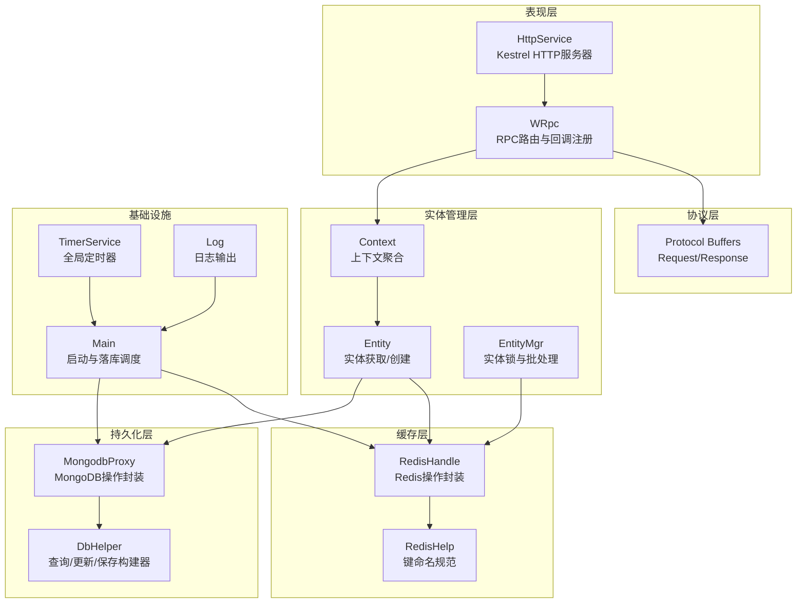
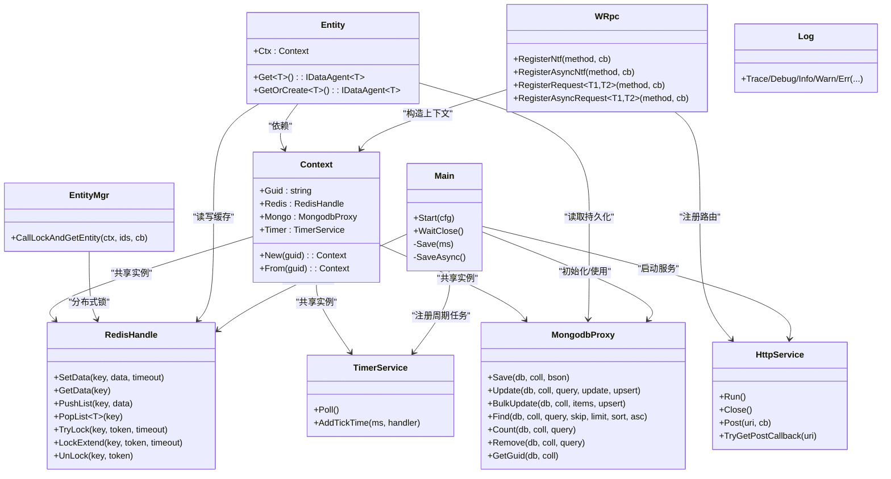
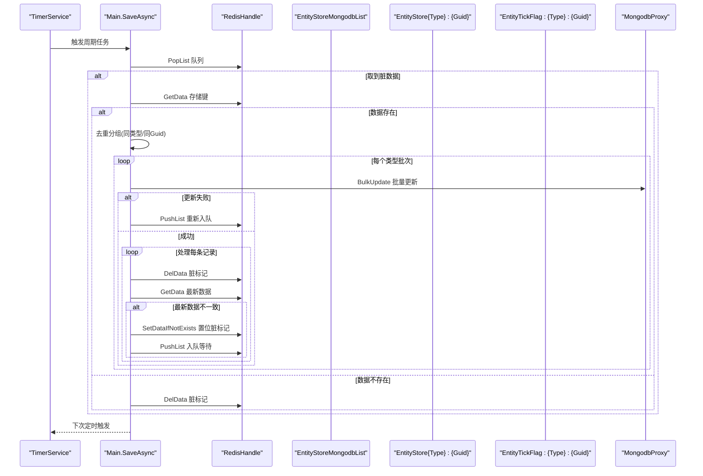
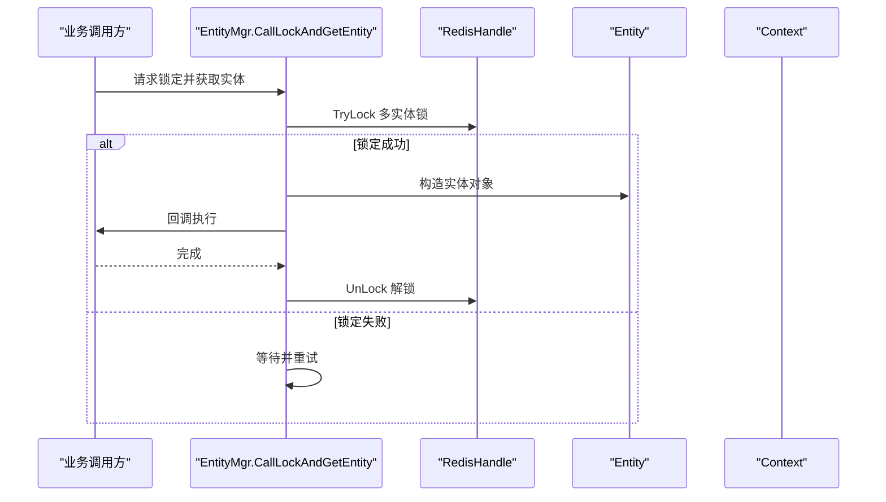
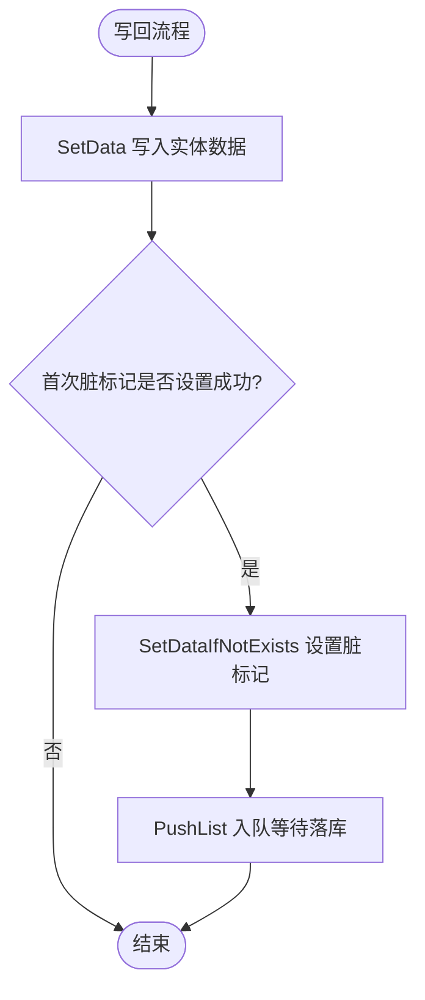
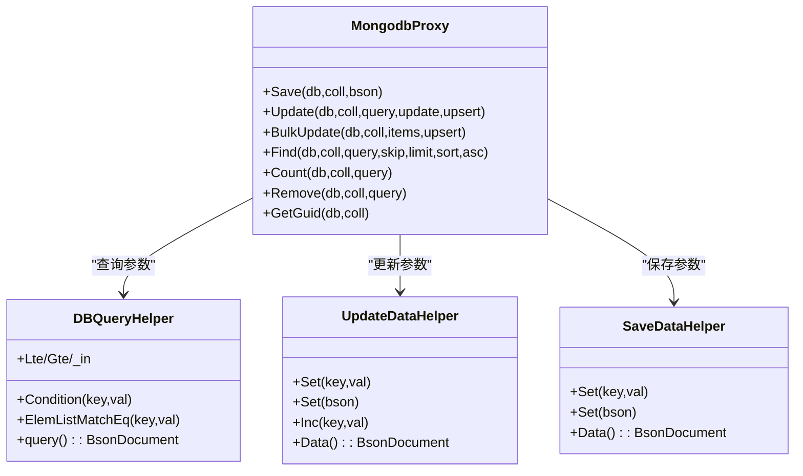
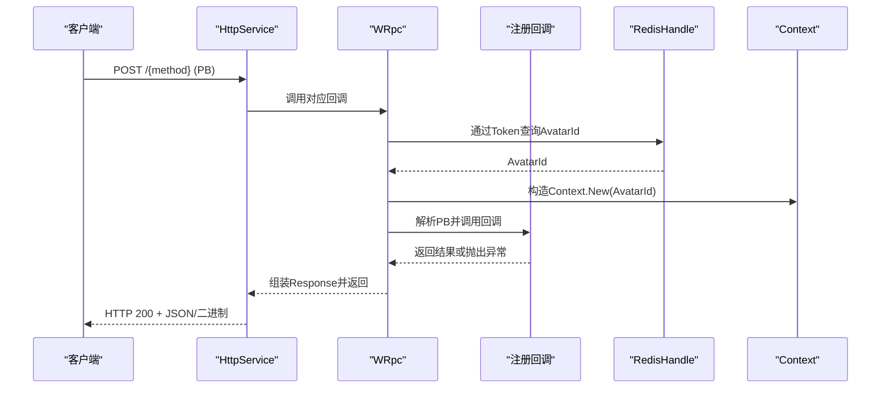
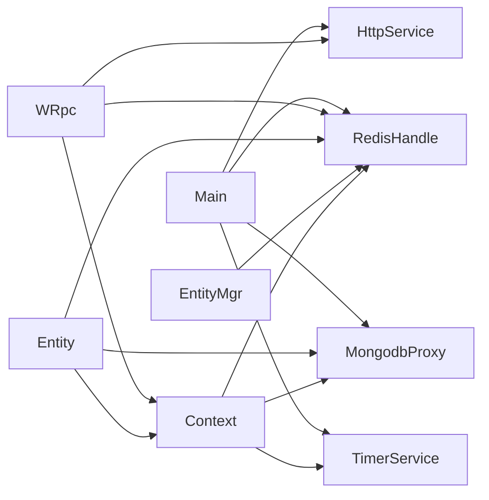

# 架构设计

<cite>
**本文引用的文件**
- [Main.cs](file://lgbf/hub/Main.cs)
- [Context.cs](file://lgbf/hub/Context.cs)
- [Entity.cs](file://lgbf/hub/Entity.cs)
- [EntityMgr.cs](file://lgbf/hub/EntityMgr.cs)
- [RedisHelp.cs](file://lgbf/hub/RedisHelp.cs)
- [RedisHandle.cs](file://lgbf/hub/RedisHandle.cs)
- [MongodbProxy.cs](file://lgbf/hub/MongodbProxy.cs)
- [HttpService.cs](file://lgbf/hub/HttpService.cs)
- [WRpc.cs](file://lgbf/hub/WRpc.cs)
- [TimerService.cs](file://lgbf/hub/TimerService.cs)
- [DbHelper.cs](file://lgbf/hub/DbHelper.cs)
- [Log.cs](file://lgbf/hub/Log.cs)
- [underlying.proto](file://lgbf/underlying/underlying.proto)
- [Underlying.cs](file://lgbf/hub/Underlying.cs)
- [README.md](file://README.md)
</cite>

## 目录
1. [引言](#引言)
2. [项目结构](#项目结构)
3. [核心组件](#核心组件)
4. [架构总览](#架构总览)
5. [详细组件分析](#详细组件分析)
6. [依赖关系分析](#依赖关系分析)
7. [性能考量](#性能考量)
8. [故障排查指南](#故障排查指南)
9. [结论](#结论)
10. [附录](#附录)

## 引言
本文件面向LGBF（Lightweight Game Backend Framework）框架，提供系统级架构设计文档。文档聚焦于高层设计理念与整体架构模式，阐述分层架构、模块化设计与接口驱动的架构原则；详解核心组件间的交互关系，包括实体管理、缓存层、数据持久化层与通信协议层；梳理从客户端请求到数据存储的完整数据流；解释设计决策背后的技术考量与权衡，涵盖性能优化、可扩展性与可靠性；明确系统边界与集成模式，并通过架构图表与组件关系图帮助开发者快速理解整体结构与职责分工。

## 项目结构
LGBF采用清晰的分层与模块化组织方式：
- 表现层：基于Kestrel的HTTP服务，负责接收外部请求并路由到具体RPC处理逻辑。
- 协议层：基于Protocol Buffers的消息封装，统一请求/响应格式，便于跨语言与跨进程通信。
- 实体管理层：抽象实体接口与代理，提供读写回写、脏标记与批量落库调度。
- 缓存层：基于Redis的高性能键值存储与列表、有序集合等数据结构，支撑实体热数据与并发控制。
- 持久化层：基于MongoDB的文档数据库，提供批量更新、查询与索引能力。
- 定时器层：集中式定时器服务，支持周期性任务与循环日/周/月时间点触发。
- 工具与基础设施：日志、查询构建器、更新构建器、连接辅助等。

**图表来源**
- [HttpService.cs:117-182](file://lgbf/hub/HttpService.cs#L117-L182)
- [WRpc.cs:6-155](file://lgbf/hub/WRpc.cs#L6-L155)
- [Context.cs:4-27](file://lgbf/hub/Context.cs#L4-L27)
- [Entity.cs:94-154](file://lgbf/hub/Entity.cs#L94-L154)
- [EntityMgr.cs:4-128](file://lgbf/hub/EntityMgr.cs#L4-L128)
- [RedisHandle.cs:13-544](file://lgbf/hub/RedisHandle.cs#L13-L544)
- [RedisHelp.cs:4-20](file://lgbf/hub/RedisHelp.cs#L4-L20)
- [MongodbProxy.cs:10-221](file://lgbf/hub/MongodbProxy.cs#L10-L221)
- [DbHelper.cs:4-311](file://lgbf/hub/DbHelper.cs#L4-L311)
- [TimerService.cs:7-126](file://lgbf/hub/TimerService.cs#L7-L126)
- [Log.cs:6-113](file://lgbf/hub/Log.cs#L6-L113)
- [Main.cs:13-159](file://lgbf/hub/Main.cs#L13-L159)

**章节来源**
- [README.md:1-3](file://README.md#L1-L3)
- [Main.cs:13-49](file://lgbf/hub/Main.cs#L13-L49)
- [HttpService.cs:117-182](file://lgbf/hub/HttpService.cs#L117-L182)
- [WRpc.cs:6-45](file://lgbf/hub/WRpc.cs#L6-L45)

## 核心组件
- 启动与调度中心：Main负责初始化Redis与MongoDB连接、注册HTTP服务、启动定时器并周期性触发批量落库。
- 上下文Context：聚合当前会话所需的Redis、MongoDB、定时器实例，统一注入到实体与业务逻辑中。
- 实体Entity与代理DataAgent：提供实体的读取、创建、写回与脏标记机制；写回后入队等待批量落库。
- 实体管理器EntityMgr：提供多实体加锁、锁续期与回调执行，确保事务一致性与并发安全。
- 缓存RedisHandle与键规范RedisHelp：封装Redis常用操作（字符串、列表、有序集合、哈希、分布式锁），并提供统一键命名规范。
- 持久化MongodbProxy与查询/更新构建器DbHelper：提供MongoDB的插入、更新、批量更新、查询、计数、删除等能力，并以BSON字节流形式传递。
- HTTP服务HttpService与RPC适配WRpc：基于Kestrel提供HTTP端点，解析PB消息，按方法名路由到注册的回调。
- 定时器TimerService：集中式轮询定时器，支持周期性与日/周/月循环触发。
- 日志Log：统一日志输出，带时间戳与级别过滤。

**章节来源**
- [Main.cs:13-159](file://lgbf/hub/Main.cs#L13-L159)
- [Context.cs:4-27](file://lgbf/hub/Context.cs#L4-L27)
- [Entity.cs:31-154](file://lgbf/hub/Entity.cs#L31-L154)
- [EntityMgr.cs:4-128](file://lgbf/hub/EntityMgr.cs#L4-L128)
- [RedisHandle.cs:13-544](file://lgbf/hub/RedisHandle.cs#L13-L544)
- [RedisHelp.cs:4-20](file://lgbf/hub/RedisHelp.cs#L4-L20)
- [MongodbProxy.cs:10-221](file://lgbf/hub/MongodbProxy.cs#L10-L221)
- [DbHelper.cs:4-311](file://lgbf/hub/DbHelper.cs#L4-L311)
- [HttpService.cs:117-182](file://lgbf/hub/HttpService.cs#L117-L182)
- [WRpc.cs:6-155](file://lgbf/hub/WRpc.cs#L6-L155)
- [TimerService.cs:7-126](file://lgbf/hub/TimerService.cs#L7-L126)
- [Log.cs:6-113](file://lgbf/hub/Log.cs#L6-L113)

## 架构总览
LGBF采用“接口驱动 + 分层解耦”的架构模式：
- 分层架构：表现层（HTTP）、协议层（PB）、实体层、缓存层、持久化层、基础设施层。
- 模块化设计：每个模块职责单一，通过接口与最小依赖耦合，便于替换与扩展。
- 接口驱动：通过Context聚合资源，Entity抽象实体行为，WRpc统一RPC入口，DbHelper统一封装查询/更新。

**图表来源**
- [Main.cs:13-159](file://lgbf/hub/Main.cs#L13-L159)
- [Context.cs:4-27](file://lgbf/hub/Context.cs#L4-L27)
- [Entity.cs:94-154](file://lgbf/hub/Entity.cs#L94-L154)
- [EntityMgr.cs:4-128](file://lgbf/hub/EntityMgr.cs#L4-L128)
- [RedisHandle.cs:13-544](file://lgbf/hub/RedisHandle.cs#L13-L544)
- [MongodbProxy.cs:10-221](file://lgbf/hub/MongodbProxy.cs#L10-L221)
- [HttpService.cs:117-182](file://lgbf/hub/HttpService.cs#L117-L182)
- [WRpc.cs:6-155](file://lgbf/hub/WRpc.cs#L6-L155)
- [TimerService.cs:7-126](file://lgbf/hub/TimerService.cs#L7-L126)
- [Log.cs:6-113](file://lgbf/hub/Log.cs#L6-L113)

## 详细组件分析

### 启动与调度（Main）
- 负责初始化Redis与MongoDB连接，启动HTTP服务与定时器。
- 注册周期性保存任务，按固定间隔从Redis队列取出脏数据，去重后批量更新MongoDB。
- 写回成功后清理脏标记；若最新数据被覆盖，则重新置位并入队等待下次落库。

**图表来源**
- [Main.cs:50-157](file://lgbf/hub/Main.cs#L50-L157)
- [RedisHandle.cs:257-303](file://lgbf/hub/RedisHandle.cs#L257-L303)
- [RedisHelp.cs:4-20](file://lgbf/hub/RedisHelp.cs#L4-L20)
- [MongodbProxy.cs:102-120](file://lgbf/hub/MongodbProxy.cs#L102-L120)

**章节来源**
- [Main.cs:31-49](file://lgbf/hub/Main.cs#L31-L49)
- [Main.cs:62-157](file://lgbf/hub/Main.cs#L62-L157)

### 实体管理（Entity/EntityMgr）
- Entity提供Get与GetOrCreate两种模式：优先从Redis缓存加载，不存在则从MongoDB查询并回填缓存。
- 写回时先写Redis，再设置脏标记与入队，交由Main周期性落库。
- EntityMgr提供多实体联合加锁与锁续期，避免并发写冲突，回调结束后自动解锁。

**图表来源**
- [EntityMgr.cs:44-126](file://lgbf/hub/EntityMgr.cs#L44-L126)
- [RedisHandle.cs:305-394](file://lgbf/hub/RedisHandle.cs#L305-L394)
- [Entity.cs:94-154](file://lgbf/hub/Entity.cs#L94-L154)
- [Context.cs:11-26](file://lgbf/hub/Context.cs#L11-L26)

**章节来源**
- [Entity.cs:94-154](file://lgbf/hub/Entity.cs#L94-L154)
- [EntityMgr.cs:4-128](file://lgbf/hub/EntityMgr.cs#L4-L128)

### 缓存层（RedisHandle/RedisHelp）
- 提供字符串、列表、有序集合、哈希、分布式锁等操作，封装异常恢复与重试。
- 键命名规范集中在RedisHelp，保证键空间清晰与可维护性。

**图表来源**
- [Entity.cs:52-92](file://lgbf/hub/Entity.cs#L52-L92)
- [RedisHandle.cs:84-136](file://lgbf/hub/RedisHandle.cs#L84-L136)
- [RedisHandle.cs:257-303](file://lgbf/hub/RedisHandle.cs#L257-L303)
- [RedisHelp.cs:4-20](file://lgbf/hub/RedisHelp.cs#L4-L20)

**章节来源**
- [RedisHandle.cs:84-136](file://lgbf/hub/RedisHandle.cs#L84-L136)
- [RedisHandle.cs:257-303](file://lgbf/hub/RedisHandle.cs#L257-L303)
- [RedisHelp.cs:4-20](file://lgbf/hub/RedisHelp.cs#L4-L20)

### 持久化层（MongodbProxy/DbHelper）
- MongodbProxy提供插入、更新、批量更新、查询、计数、删除与自增Guid等能力，均以BSON字节流形式传参，降低序列化开销。
- DbHelper提供链式构建器，简化查询条件、更新字段与增量更新的拼装。

**图表来源**
- [MongodbProxy.cs:10-221](file://lgbf/hub/MongodbProxy.cs#L10-L221)
- [DbHelper.cs:4-311](file://lgbf/hub/DbHelper.cs#L4-L311)

**章节来源**
- [MongodbProxy.cs:76-221](file://lgbf/hub/MongodbProxy.cs#L76-L221)
- [DbHelper.cs:4-311](file://lgbf/hub/DbHelper.cs#L4-L311)

### 通信协议层（HttpService/WRpc/Underlying）
- HttpService基于Kestrel提供HTTP端点，解析请求体为PB消息，按URI路由到WRpc注册的回调。
- WRpc注册多种回调类型（通知、异步通知、请求、异步请求），统一处理鉴权令牌映射与响应返回。
- Underlying定义Request/Response消息结构，用于跨进程通信。

**图表来源**
- [HttpService.cs:117-182](file://lgbf/hub/HttpService.cs#L117-L182)
- [WRpc.cs:6-155](file://lgbf/hub/WRpc.cs#L6-L155)
- [RedisHandle.cs:159-174](file://lgbf/hub/RedisHandle.cs#L159-L174)
- [Context.cs:11-20](file://lgbf/hub/Context.cs#L11-L20)
- [Underlying.cs:40-120](file://lgbf/hub/Underlying.cs#L40-L120)

**章节来源**
- [HttpService.cs:117-182](file://lgbf/hub/HttpService.cs#L117-L182)
- [WRpc.cs:6-155](file://lgbf/hub/WRpc.cs#L6-L155)
- [underlying.proto:1-35](file://lgbf/underlying/underlying.proto#L1-L35)
- [Underlying.cs:40-120](file://lgbf/hub/Underlying.cs#L40-L120)

### 定时器与日志（TimerService/Log）
- TimerService集中轮询，支持周期性与日/周/月循环触发，避免多线程竞争。
- Log提供统一日志输出，带时间戳与文件滚动策略，便于线上问题定位。

**章节来源**
- [TimerService.cs:7-126](file://lgbf/hub/TimerService.cs#L7-L126)
- [Log.cs:6-113](file://lgbf/hub/Log.cs#L6-L113)

## 依赖关系分析
- 组件内聚与解耦：Main聚合Redis/Mongo/Timing/HTTP，Context作为资源注入点，Entity/EntityMgr仅依赖Context，降低耦合度。
- 外部依赖：StackExchange.Redis、MongoDB.Driver、Google.Protobuf、ASP.NET Core Kestrel。
- 循环依赖规避：通过接口与回调注册避免直接相互引用；RPC通过方法名路由，不直接持有回调对象。

**图表来源**
- [Main.cs:18-39](file://lgbf/hub/Main.cs#L18-L39)
- [Context.cs:11-20](file://lgbf/hub/Context.cs#L11-L20)
- [Entity.cs:94-154](file://lgbf/hub/Entity.cs#L94-L154)
- [EntityMgr.cs:44-126](file://lgbf/hub/EntityMgr.cs#L44-L126)
- [WRpc.cs:6-45](file://lgbf/hub/WRpc.cs#L6-L45)

**章节来源**
- [Main.cs:18-39](file://lgbf/hub/Main.cs#L18-L39)
- [Context.cs:11-20](file://lgbf/hub/Context.cs#L11-L20)
- [Entity.cs:94-154](file://lgbf/hub/Entity.cs#L94-L154)
- [EntityMgr.cs:44-126](file://lgbf/hub/EntityMgr.cs#L44-L126)
- [WRpc.cs:6-45](file://lgbf/hub/WRpc.cs#L6-L45)

## 性能考量
- 缓存优先：实体读取优先Redis，减少MongoDB压力；写回采用异步与批量落库，降低IO频率。
- 批量更新：Main按类型分组去重后批量更新，提升吞吐并减少网络往返。
- 锁粒度与重试：EntityMgr对多实体加锁，指数退避重试，避免热点竞争导致的抖动。
- 连接与序列化：Redis/Mongo均采用异步API与字节流传输，减少GC与序列化开销。
- HTTP并发：Kestrel限制最大并发连接与Keep-Alive超时，配合数组池复用内存，提高高并发稳定性。

[本节为通用性能讨论，无需特定文件来源]

## 故障排查指南
- 写回失败：检查Redis写入与脏标记设置是否成功；确认队列入队是否正常；查看日志错误信息。
- 落库失败：观察Main批量更新返回状态，失败时会重新入队；检查MongoDB连接与权限。
- 锁冲突：关注EntityMgr加锁重试日志，必要时调整重试策略或拆分实体范围。
- RPC路由：确认WRpc注册的方法名与客户端调用一致；检查Token到AvatarId映射是否正确。
- 日志定位：通过Log输出的时间戳与级别快速定位问题；注意日志文件滚动策略。

**章节来源**
- [Entity.cs:52-92](file://lgbf/hub/Entity.cs#L52-L92)
- [Main.cs:125-134](file://lgbf/hub/Main.cs#L125-L134)
- [EntityMgr.cs:56-81](file://lgbf/hub/EntityMgr.cs#L56-L81)
- [WRpc.cs:31-35](file://lgbf/hub/WRpc.cs#L31-L35)
- [Log.cs:55-58](file://lgbf/hub/Log.cs#L55-L58)

## 结论
LGBF通过清晰的分层与模块化设计，结合接口驱动与协议统一，实现了高性能、可扩展且可靠的后端框架。缓存优先与批量落库策略有效平衡了延迟与吞吐；分布式锁与定时器保障了并发一致性与后台任务稳定运行；HTTP+PB的通信模型便于跨语言集成。该架构适合需要低延迟、高并发与强一致性的游戏与实时应用场景。

[本节为总结性内容，无需特定文件来源]

## 附录
- 系统边界与集成模式
  - 外部系统通过HTTP+PB与框架交互，方法名即API标识，Token用于身份映射。
  - Redis与MongoDB作为外部依赖，需独立部署与监控；可通过配置中心动态调整连接参数。
  - 框架内部通过Context统一注入资源，避免硬编码与环境差异带来的风险。

**章节来源**
- [WRpc.cs:6-45](file://lgbf/hub/WRpc.cs#L6-L45)
- [Context.cs:11-20](file://lgbf/hub/Context.cs#L11-L20)
- [Main.cs:31-39](file://lgbf/hub/Main.cs#L31-L39)