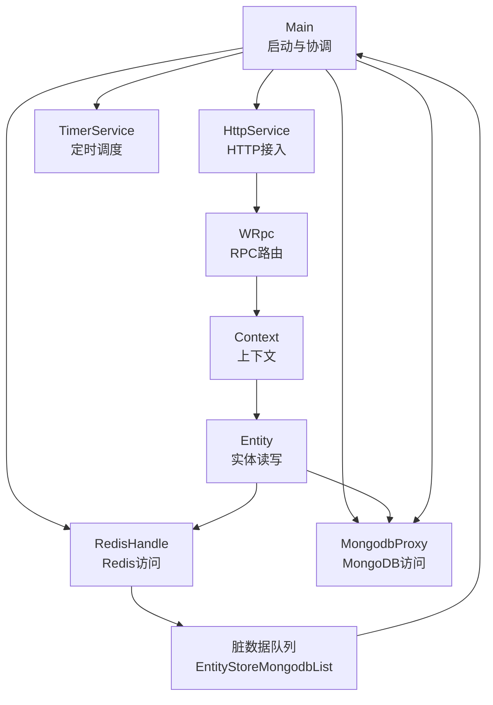
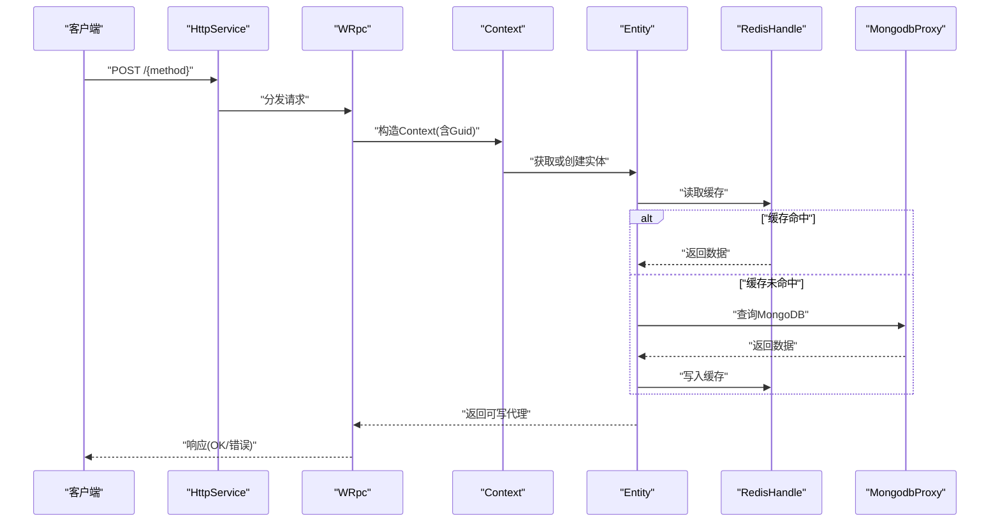
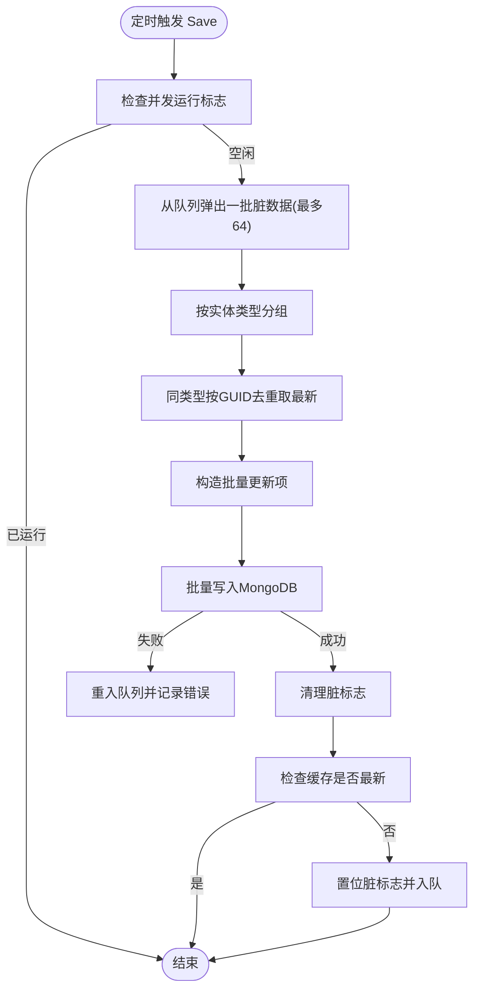
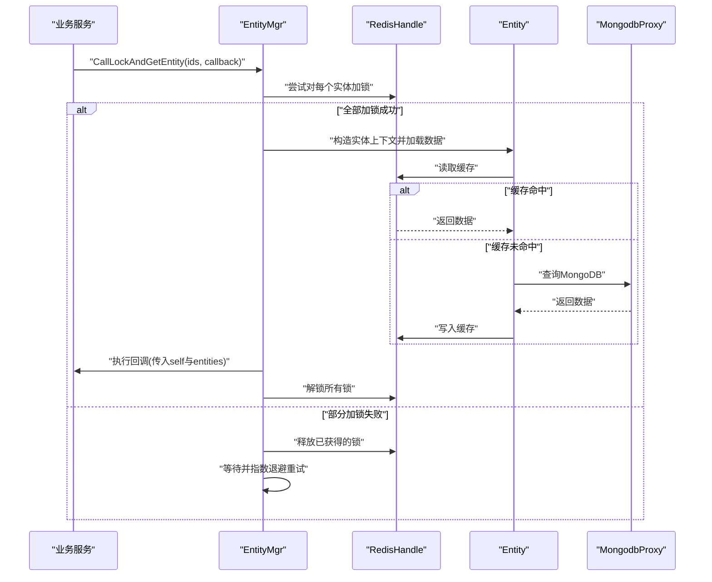
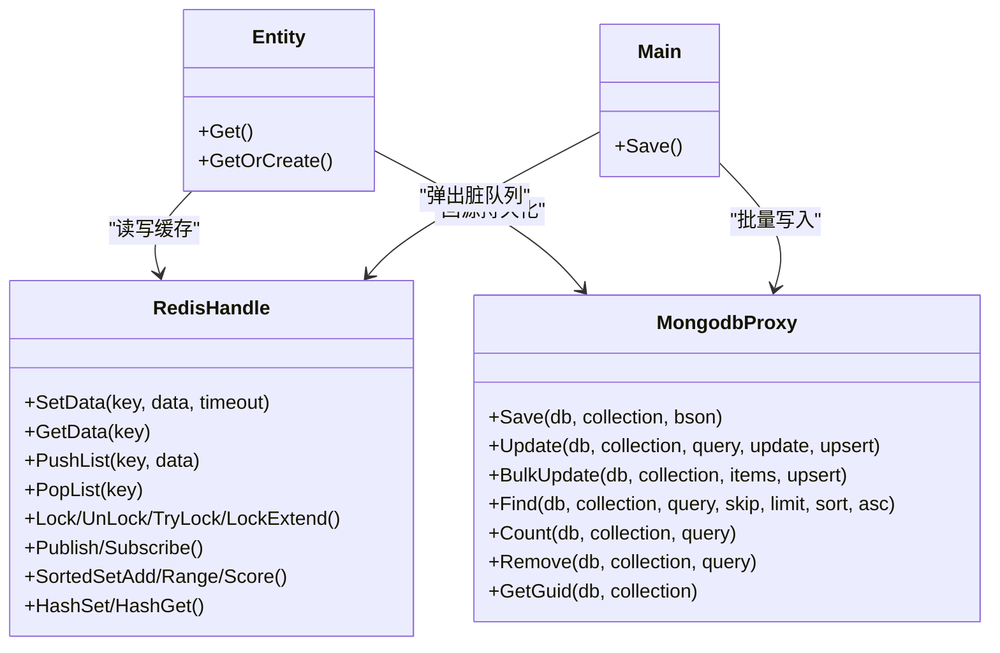
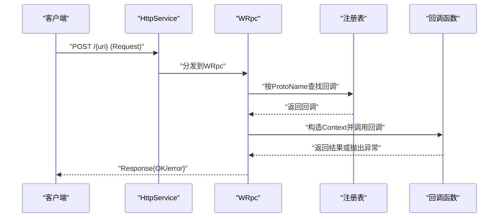
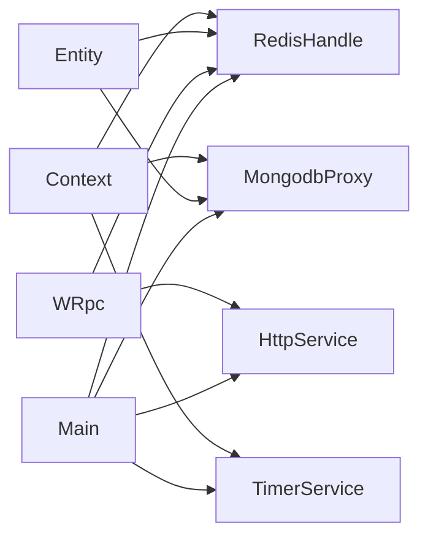

# 组件交互关系

<cite>
**本文引用的文件**
- [Main.cs](file://lgbf/hub/Main.cs)
- [Context.cs](file://lgbf/hub/Context.cs)
- [EntityMgr.cs](file://lgbf/hub/EntityMgr.cs)
- [Entity.cs](file://lgbf/hub/Entity.cs)
- [RedisHandle.cs](file://lgbf/hub/RedisHandle.cs)
- [MongodbProxy.cs](file://lgbf/hub/MongodbProxy.cs)
- [RedisHelp.cs](file://lgbf/hub/RedisHelp.cs)
- [HttpService.cs](file://lgbf/hub/HttpService.cs)
- [TimerService.cs](file://lgbf/hub/TimerService.cs)
- [DbHelper.cs](file://lgbf/hub/DbHelper.cs)
- [Log.cs](file://lgbf/hub/Log.cs)
- [Underlying.cs](file://lgbf/hub/Underlying.cs)
- [WRpc.cs](file://lgbf/hub/WRpc.cs)
- [Subscribe.cs](file://lgbf/hub/Subscribe.cs)
- [RankList.cs](file://lgbf/hub/RankList.cs)
</cite>

## 目录
1. [简介](#简介)
2. [项目结构](#项目结构)
3. [核心组件](#核心组件)
4. [架构总览](#架构总览)
5. [详细组件分析](#详细组件分析)
6. [依赖关系分析](#依赖关系分析)
7. [性能考量](#性能考量)
8. [故障排查指南](#故障排查指南)
9. [结论](#结论)
10. [附录](#附录)

## 简介
本文件面向LGBF框架，系统性梳理组件交互关系与通信机制，重点覆盖以下方面：
- Main类如何协调各子系统（HTTP服务、定时器、Redis、MongoDB）
- Entity管理器与缓存层（Redis）的交互模式
- RedisHandle与MongodbProxy之间的数据同步机制
- 组件间依赖关系与调用顺序
- 数据在不同组件间的传递路径
- 接口契约（方法签名、参数与返回值约定）
- 错误处理与异常传播机制

## 项目结构
LGBF采用“入口启动 + 子系统模块”的分层组织方式：
- 入口与协调：Main负责初始化Redis、MongoDB、HTTP服务与定时器，并驱动周期性落库任务
- 上下文与实体：Context封装当前请求上下文；Entity通过Redis缓存与MongoDB持久化进行读写
- 缓存与存储：RedisHandle提供Redis访问能力；MongodbProxy封装MongoDB操作
- 通信与调度：HttpService承载HTTP接入；WRpc基于HTTP实现RPC；Subscribe基于Redis订阅；TimerService提供全局定时调度
- 工具与日志：DbHelper提供查询/更新/保存辅助；Log统一输出日志

图表来源
- [Main.cs:31-40](file://lgbf/hub/Main.cs#L31-L40)
- [HttpService.cs:117-182](file://lgbf/hub/HttpService.cs#L117-L182)
- [WRpc.cs:14-45](file://lgbf/hub/WRpc.cs#L14-L45)
- [Context.cs:4-26](file://lgbf/hub/Context.cs#L4-L26)
- [Entity.cs:94-154](file://lgbf/hub/Entity.cs#L94-L154)
- [RedisHandle.cs:13-544](file://lgbf/hub/RedisHandle.cs#L13-L544)
- [MongodbProxy.cs:10-221](file://lgbf/hub/MongodbProxy.cs#L10-L221)
- [RedisHelp.cs:4-19](file://lgbf/hub/RedisHelp.cs#L4-L19)

章节来源
- [Main.cs:31-40](file://lgbf/hub/Main.cs#L31-L40)
- [Context.cs:4-26](file://lgbf/hub/Context.cs#L4-L26)
- [RedisHelp.cs:4-19](file://lgbf/hub/RedisHelp.cs#L4-L19)

## 核心组件
- Main：应用入口，负责初始化RedisHandle与MongodbProxy，注册定时器，启动HTTP服务
- Context：请求上下文，持有Guid、RedisHandle、MongodbProxy与TimerService实例
- Entity：实体读写门面，负责从Redis缓存或MongoDB加载数据，并在变更时标记脏数据
- EntityMgr：实体级分布式锁与批量回调执行，保障并发安全
- RedisHandle：Redis客户端封装，提供键值、列表、有序集合、哈希、发布订阅、分布式锁等操作
- MongodbProxy：MongoDB客户端封装，提供插入、更新、批量更新、查询、计数、删除、自增等
- HttpService：基于Kestrel的HTTP服务，统一请求处理与响应
- WRpc：基于HTTP的RPC框架，按消息类型路由到注册的回调
- Subscribe：基于Redis的订阅器，按消息类型分发到注册回调
- TimerService：全局定时器，提供轮询与多种时间粒度的调度
- DbHelper：查询、更新、保存的BSON构建工具
- Log：统一日志输出
- Underlying：底层消息协议（Request/Response）

章节来源
- [Main.cs:13-159](file://lgbf/hub/Main.cs#L13-L159)
- [Context.cs:4-26](file://lgbf/hub/Context.cs#L4-L26)
- [Entity.cs:31-154](file://lgbf/hub/Entity.cs#L31-L154)
- [EntityMgr.cs:44-128](file://lgbf/hub/EntityMgr.cs#L44-L128)
- [RedisHandle.cs:13-544](file://lgbf/hub/RedisHandle.cs#L13-L544)
- [MongodbProxy.cs:10-221](file://lgbf/hub/MongodbProxy.cs#L10-L221)
- [HttpService.cs:117-182](file://lgbf/hub/HttpService.cs#L117-L182)
- [WRpc.cs:6-155](file://lgbf/hub/WRpc.cs#L6-L155)
- [Subscribe.cs:4-38](file://lgbf/hub/Subscribe.cs#L4-L38)
- [TimerService.cs:7-126](file://lgbf/hub/TimerService.cs#L7-L126)
- [DbHelper.cs:4-311](file://lgbf/hub/DbHelper.cs#L4-L311)
- [Log.cs:6-113](file://lgbf/hub/Log.cs#L6-L113)
- [Underlying.cs:40-550](file://lgbf/hub/Underlying.cs#L40-L550)

## 架构总览
LGBF采用“HTTP入口 + RPC路由 + 实体缓存 + 定时落库”的架构：
- HTTP请求进入HttpService，WRpc根据消息类型解析并路由到业务回调
- 业务回调通过Context获取Entity，Entity优先从Redis缓存读取，不存在则回源MongoDB
- 对实体的修改通过DataAgent触发写回：先写Redis，再设置脏标志与入队
- Main定时器周期性从队列取出脏数据，去重后批量写入MongoDB，若失败则重试

图表来源
- [HttpService.cs:50-114](file://lgbf/hub/HttpService.cs#L50-L114)
- [WRpc.cs:16-44](file://lgbf/hub/WRpc.cs#L16-L44)
- [Context.cs:11-25](file://lgbf/hub/Context.cs#L11-L25)
- [Entity.cs:104-152](file://lgbf/hub/Entity.cs#L104-L152)
- [RedisHandle.cs:159-174](file://lgbf/hub/RedisHandle.cs#L159-L174)
- [MongodbProxy.cs:143-184](file://lgbf/hub/MongodbProxy.cs#L143-L184)

## 详细组件分析

### Main类：启动与周期性落库
- 职责
  - 初始化RedisHandle与MongodbProxy
  - 注册定时器，周期性执行保存流程
  - 启动HTTP服务
- 关键流程
  - 保存流程：从队列弹出脏数据，按类型+GUID去重，构造批量更新，写入MongoDB；成功后清理脏标志；若缓存最新数据变化，则重新置位脏标志并入队
- 异常处理
  - 保存过程捕获异常并记录日志；避免并发重复执行，使用原子标志控制

图表来源
- [Main.cs:50-157](file://lgbf/hub/Main.cs#L50-L157)
- [RedisHelp.cs:10-14](file://lgbf/hub/RedisHelp.cs#L10-L14)
- [MongodbProxy.cs:102-120](file://lgbf/hub/MongodbProxy.cs#L102-L120)

章节来源
- [Main.cs:31-40](file://lgbf/hub/Main.cs#L31-L40)
- [Main.cs:50-157](file://lgbf/hub/Main.cs#L50-L157)

### Entity与EntityMgr：缓存与并发控制
- Entity
  - 通过Redis缓存键读取/写入实体数据
  - 若缓存无数据则回源MongoDB查询并写回缓存
  - 写回通过DataAgent完成：先写Redis，再设置脏标志与入队
- EntityMgr
  - 对多个实体ID加分布式锁，确保事务一致性
  - 提供回调执行，内部自动续期锁并释放

图表来源
- [EntityMgr.cs:44-126](file://lgbf/hub/EntityMgr.cs#L44-L126)
- [Entity.cs:104-152](file://lgbf/hub/Entity.cs#L104-L152)
- [RedisHandle.cs:305-394](file://lgbf/hub/RedisHandle.cs#L305-L394)

章节来源
- [Entity.cs:31-154](file://lgbf/hub/Entity.cs#L31-L154)
- [EntityMgr.cs:44-128](file://lgbf/hub/EntityMgr.cs#L44-L128)

### RedisHandle与MongodbProxy：数据同步机制
- RedisHandle
  - 提供键值、列表、有序集合、哈希、发布订阅、分布式锁等操作
  - 所有操作具备超时异常恢复与重试机制
- MongodbProxy
  - 提供单条/批量更新、查询、计数、删除、自增等
  - 批量写入采用非有序写入以提升吞吐
- 同步机制
  - 写回：Redis写入成功后设置脏标志与入队
  - 落库：Main定时器从队列取数据，去重后批量写入MongoDB

图表来源
- [RedisHandle.cs:84-303](file://lgbf/hub/RedisHandle.cs#L84-L303)
- [MongodbProxy.cs:76-220](file://lgbf/hub/MongodbProxy.cs#L76-L220)
- [Entity.cs:104-152](file://lgbf/hub/Entity.cs#L104-L152)
- [Main.cs:50-157](file://lgbf/hub/Main.cs#L50-L157)

章节来源
- [RedisHandle.cs:13-544](file://lgbf/hub/RedisHandle.cs#L13-L544)
- [MongodbProxy.cs:10-221](file://lgbf/hub/MongodbProxy.cs#L10-L221)

### HttpService与WRpc：请求接入与RPC路由
- HttpService
  - 基于Kestrel的HTTP服务，统一接收POST请求，统计连接与耗时
- WRpc
  - 将HTTP请求解析为底层消息协议，按消息类型路由到注册回调
  - 支持通知、异步通知、请求/响应、异步请求/响应
  - 通过Redis令牌映射获取用户标识

图表来源
- [HttpService.cs:50-114](file://lgbf/hub/HttpService.cs#L50-L114)
- [WRpc.cs:16-44](file://lgbf/hub/WRpc.cs#L16-L44)
- [Underlying.cs:40-120](file://lgbf/hub/Underlying.cs#L40-L120)

章节来源
- [HttpService.cs:117-182](file://lgbf/hub/HttpService.cs#L117-L182)
- [WRpc.cs:6-155](file://lgbf/hub/WRpc.cs#L6-L155)

### 订阅与排行榜：扩展能力
- Subscribe
  - 基于Redis订阅，按消息类型分发到注册回调
- RankList
  - 基于有序集合维护排行榜，支持更新分数与关联数据存储

章节来源
- [Subscribe.cs:4-38](file://lgbf/hub/Subscribe.cs#L4-L38)
- [RankList.cs:14-128](file://lgbf/hub/RankList.cs#L14-L128)

## 依赖关系分析
- 组件耦合
  - Main强依赖RedisHandle与MongodbProxy，弱依赖TimerService与HttpService
  - Entity依赖Context中的RedisHandle与MongodbProxy
  - WRpc依赖HttpService与RedisHandle
- 外部依赖
  - Redis：分布式锁、键值、列表、有序集合、哈希、发布订阅
  - MongoDB：文档存储与批量写入
- 循环依赖
  - 未发现直接循环依赖；通过接口与静态字段解耦

图表来源
- [Main.cs:18-26](file://lgbf/hub/Main.cs#L18-L26)
- [Context.cs:7-18](file://lgbf/hub/Context.cs#L7-L18)
- [WRpc.cs:31-35](file://lgbf/hub/WRpc.cs#L31-L35)

章节来源
- [Main.cs:18-26](file://lgbf/hub/Main.cs#L18-L26)
- [Context.cs:7-18](file://lgbf/hub/Context.cs#L7-L18)

## 性能考量
- 缓存优先策略：实体优先从Redis读取，减少MongoDB压力
- 批量写入：Main定时器按类型聚合，使用MongodbProxy批量更新
- 非阻塞IO：Redis与MongoDB均采用异步API
- 锁优化：指数退避重试，降低热点竞争
- 日志与统计：HttpService统计连接与耗时，便于性能监控

## 故障排查指南
- Redis异常
  - 现象：操作返回false或抛出超时异常
  - 处理：RedisHandle内部自动恢复与重试；检查网络与连接池配置
- MongoDB异常
  - 现象：批量写入失败或查询异常
  - 处理：Main保存流程会记录错误并重入队列；检查集合索引与权限
- RPC路由异常
  - 现象：未知消息类型或令牌无效
  - 处理：WRpc会记录错误并返回错误响应；确认消息类型与令牌映射
- 日志定位
  - 使用Log统一输出，结合时间戳与堆栈信息定位问题

章节来源
- [RedisHandle.cs:27-34](file://lgbf/hub/RedisHandle.cs#L27-L34)
- [Main.cs:56-59](file://lgbf/hub/Main.cs#L56-L59)
- [WRpc.cs:31-35](file://lgbf/hub/WRpc.cs#L31-L35)
- [Log.cs:55-58](file://lgbf/hub/Log.cs#L55-L58)

## 结论
LGBF通过清晰的组件边界与职责划分，实现了高性能、可扩展的实体缓存与持久化方案。Main作为协调者，结合EntityMgr的并发控制、RedisHandle的高可用缓存与MongodbProxy的可靠持久化，形成稳定的读写链路。WRpc与HttpService提供灵活的接入与路由能力，配合TimerService实现异步落库与可观测性。

## 附录

### 组件接口与契约（方法签名与约定）
- RedisHandle
  - SetData/GetData/Expire/SortedSet*/HashSet/HashGet/Publish/Subscribe/Lock系列
  - 返回值：布尔或Task<T>；异常时内部重试并返回默认值
- MongodbProxy
  - Save/Update/BulkUpdate/Find/Count/Remove/GetGuid
  - 参数：数据库名、集合名、BSON字节或BsonDocument；返回布尔或Task<T>
- Entity
  - Get<T>/GetOrCreate<T>：返回可写代理IDataAgent<T>
  - DataAgent<T>.WriteBack：触发写回流程
- WRpc
  - RegisterNtf/RegisterAsyncNtf/RegisterRequest/RegisterAsyncRequest
  - 回调签名：Action/Func或Task版本；返回Response对象
- HttpService
  - Post/TryGetPostCallback/Run/Close
  - 请求体缓冲复用，响应头跨域支持

章节来源
- [RedisHandle.cs:84-544](file://lgbf/hub/RedisHandle.cs#L84-L544)
- [MongodbProxy.cs:76-220](file://lgbf/hub/MongodbProxy.cs#L76-L220)
- [Entity.cs:104-152](file://lgbf/hub/Entity.cs#L104-L152)
- [WRpc.cs:47-153](file://lgbf/hub/WRpc.cs#L47-L153)
- [HttpService.cs:119-182](file://lgbf/hub/HttpService.cs#L119-L182)