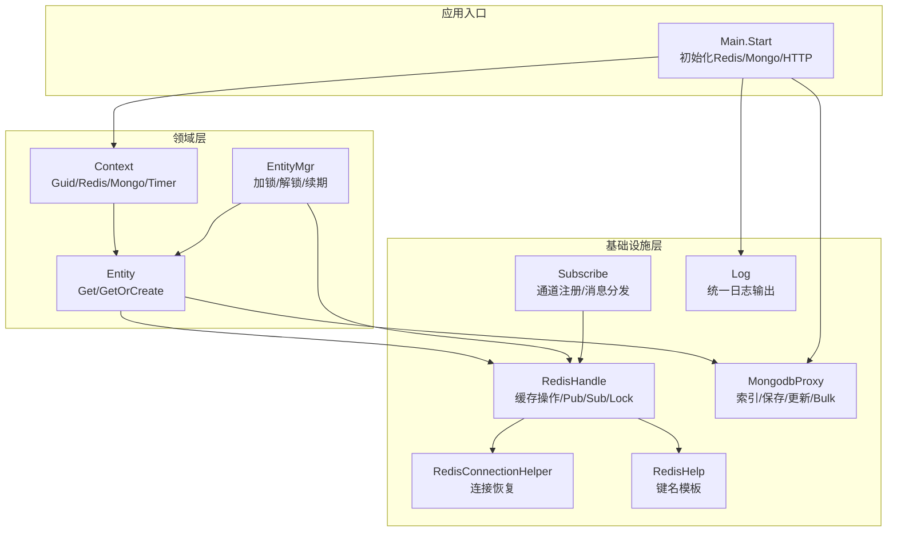
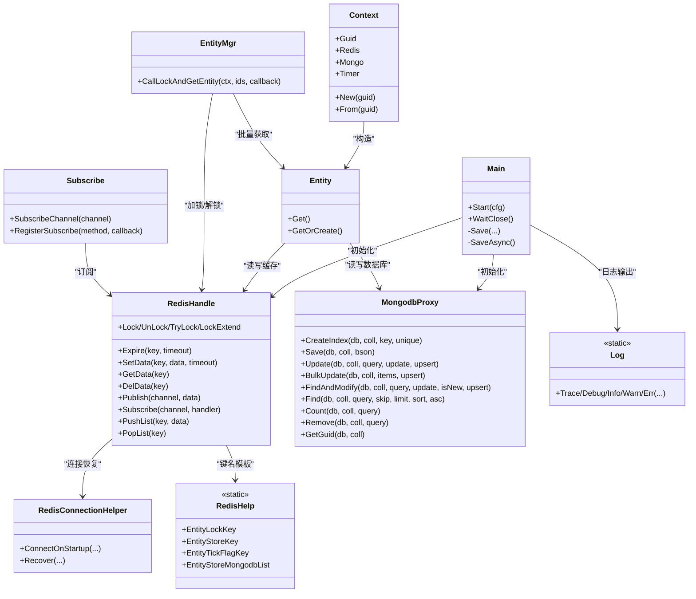
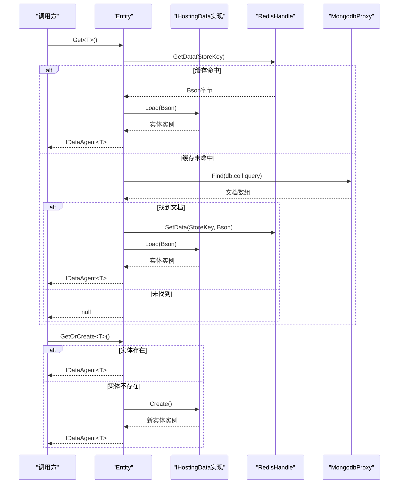
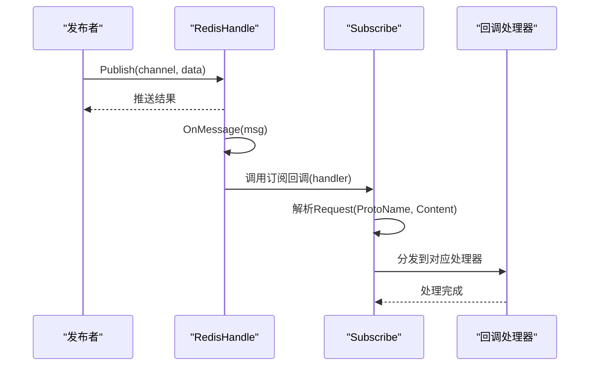
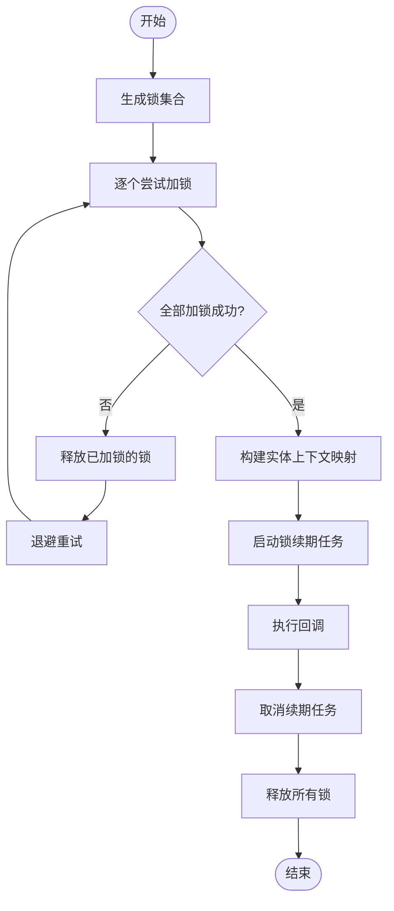
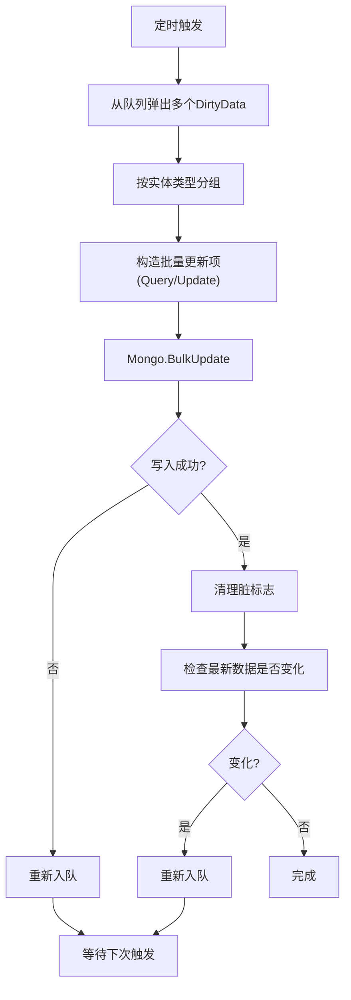
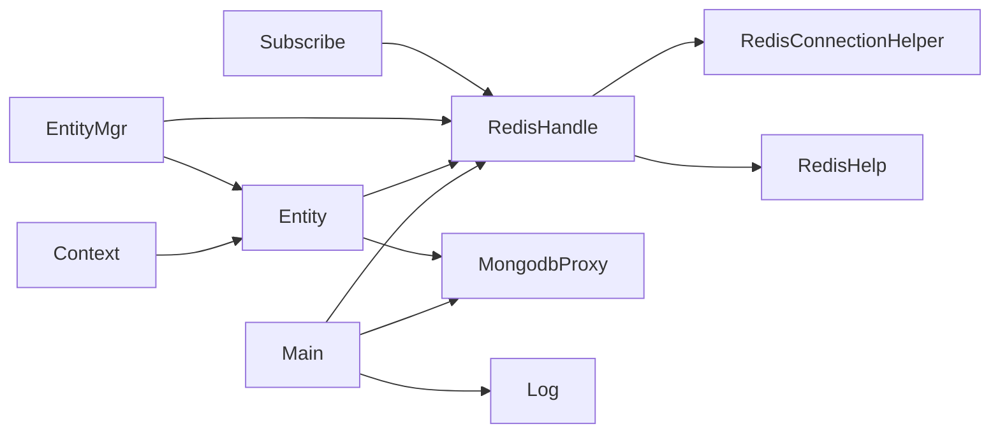

# 设计模式应用

<cite>
**本文引用的文件**
- [RedisHandle.cs](file://lgbf/hub/RedisHandle.cs)
- [MongodbProxy.cs](file://lgbf/hub/MongodbProxy.cs)
- [Entity.cs](file://lgbf/hub/Entity.cs)
- [EntityMgr.cs](file://lgbf/hub/EntityMgr.cs)
- [Subscribe.cs](file://lgbf/hub/Subscribe.cs)
- [Context.cs](file://lgbf/hub/Context.cs)
- [RedisConnectionHelper.cs](file://lgbf/hub/RedisConnectionHelper.cs)
- [RedisHelp.cs](file://lgbf/hub/RedisHelp.cs)
- [Main.cs](file://lgbf/hub/Main.cs)
- [DbHelper.cs](file://lgbf/hub/DbHelper.cs)
- [Log.cs](file://lgbf/hub/Log.cs)
</cite>

## 目录
1. [引言](#引言)
2. [项目结构](#项目结构)
3. [核心组件](#核心组件)
4. [架构总览](#架构总览)
5. [详细组件分析](#详细组件分析)
6. [依赖分析](#依赖分析)
7. [性能考量](#性能考量)
8. [故障排查指南](#故障排查指南)
9. [结论](#结论)
10. [附录](#附录)

## 引言
本文件聚焦于LGBF框架中设计模式的应用与实践，围绕以下主题展开：
- 单例模式：在RedisHandle与MongodbProxy中的应用与选择理由
- 工厂模式：在实体创建中的使用（IHostingData.Create）
- 观察者模式：在Redis订阅中的实现（Subscribe）
- 组合使用与协同机制：锁管理、持久化批处理、日志记录等
- 最佳实践与注意事项：错误恢复、并发控制、可维护性与扩展性

目标是帮助读者快速理解系统如何通过设计模式提升代码复用性、可维护性与扩展性，并提供可直接定位到源码位置的参考路径。

## 项目结构
LGBF框架的核心位于hub目录，采用“领域服务+基础设施”的分层组织：
- 领域层：实体与数据代理（Entity、IDataAgent）、上下文（Context）
- 基础设施层：缓存访问（RedisHandle、RedisConnectionHelper、RedisHelp）、数据库访问（MongodbProxy）、消息订阅（Subscribe）、定时器（TimerService）
- 应用入口：Main负责初始化与调度

图表来源
- [Main.cs:31-40](file://lgbf/hub/Main.cs#L31-L40)
- [Context.cs:11-20](file://lgbf/hub/Context.cs#L11-L20)
- [Entity.cs:94-153](file://lgbf/hub/Entity.cs#L94-L153)
- [EntityMgr.cs:44-126](file://lgbf/hub/EntityMgr.cs#L44-L126)
- [RedisHandle.cs:13-544](file://lgbf/hub/RedisHandle.cs#L13-L544)
- [RedisConnectionHelper.cs:35-127](file://lgbf/hub/RedisConnectionHelper.cs#L35-L127)
- [RedisHelp.cs:4-19](file://lgbf/hub/RedisHelp.cs#L4-L19)
- [MongodbProxy.cs:10-220](file://lgbf/hub/MongodbProxy.cs#L10-L220)
- [Subscribe.cs:4-37](file://lgbf/hub/Subscribe.cs#L4-L37)
- [Log.cs:6-112](file://lgbf/hub/Log.cs#L6-L112)

章节来源
- [Main.cs:31-40](file://lgbf/hub/Main.cs#L31-L40)
- [Context.cs:11-20](file://lgbf/hub/Context.cs#L11-L20)

## 核心组件
- RedisHandle：封装Redis连接、数据库句柄、订阅器，提供键值操作、发布订阅、列表操作、分布式锁、有序集合等能力；内部通过RedisConnectionHelper进行连接恢复。
- MongodbProxy：封装MongoDB客户端，提供索引创建、保存、更新、批量更新、查找修改、查询、计数、删除、自增GUID等。
- Entity：定义实体接口IHostingData与数据代理IDataAgent，提供实体获取与创建逻辑，结合Redis与MongoDB实现读写分离与延迟落盘。
- EntityMgr：提供跨实体的加锁策略，支持锁续期与异常释放，确保事务一致性。
- Subscribe：基于Redis订阅的消息分发器，按协议类型路由到对应处理器。
- Context：实体上下文，携带Guid、Redis、Mongo、Timer实例，提供From方法生成子上下文。
- RedisHelp：集中管理Redis键名模板，便于统一命名规范。
- RedisConnectionHelper：负责Redis连接建立与异常恢复，避免重复恢复与超时等待。
- Main：应用入口，初始化全局RedisHandle与MongodbProxy，启动HTTP服务与定时任务。
- DbHelper：查询、更新、保存辅助类，简化BSON构建与条件拼装。
- Log：统一日志输出，支持级别过滤与文件滚动。

章节来源
- [RedisHandle.cs:13-544](file://lgbf/hub/RedisHandle.cs#L13-L544)
- [MongodbProxy.cs:10-220](file://lgbf/hub/MongodbProxy.cs#L10-L220)
- [Entity.cs:4-153](file://lgbf/hub/Entity.cs#L4-L153)
- [EntityMgr.cs:3-127](file://lgbf/hub/EntityMgr.cs#L3-L127)
- [Subscribe.cs:4-37](file://lgbf/hub/Subscribe.cs#L4-L37)
- [Context.cs:4-26](file://lgbf/hub/Context.cs#L4-L26)
- [RedisHelp.cs:4-19](file://lgbf/hub/RedisHelp.cs#L4-L19)
- [RedisConnectionHelper.cs:6-127](file://lgbf/hub/RedisConnectionHelper.cs#L6-L127)
- [Main.cs:13-158](file://lgbf/hub/Main.cs#L13-L158)
- [DbHelper.cs:4-310](file://lgbf/hub/DbHelper.cs#L4-L310)
- [Log.cs:6-112](file://lgbf/hub/Log.cs#L6-L112)

## 架构总览
下图展示了关键组件间的交互关系与职责划分，体现设计模式的协同工作方式。

图表来源
- [Main.cs:18-39](file://lgbf/hub/Main.cs#L18-L39)
- [Context.cs:4-26](file://lgbf/hub/Context.cs#L4-L26)
- [Entity.cs:94-153](file://lgbf/hub/Entity.cs#L94-L153)
- [EntityMgr.cs:44-126](file://lgbf/hub/EntityMgr.cs#L44-L126)
- [RedisHandle.cs:13-544](file://lgbf/hub/RedisHandle.cs#L13-L544)
- [RedisConnectionHelper.cs:35-127](file://lgbf/hub/RedisConnectionHelper.cs#L35-L127)
- [RedisHelp.cs:4-19](file://lgbf/hub/RedisHelp.cs#L4-L19)
- [MongodbProxy.cs:10-220](file://lgbf/hub/MongodbProxy.cs#L10-L220)
- [Subscribe.cs:4-37](file://lgbf/hub/Subscribe.cs#L4-L37)
- [Log.cs:6-112](file://lgbf/hub/Log.cs#L6-L112)

## 详细组件分析

### 单例模式：RedisHandle与MongodbProxy
- RedisHandle
  - 作用：作为Redis访问的门面，封装连接、数据库、订阅器与各类Redis操作；内部通过RedisConnectionHelper进行连接恢复，避免重复恢复与阻塞等待。
  - 单例选择理由：
    - 全局唯一连接与数据库句柄，减少资源开销；
    - 统一异常恢复策略，避免分散处理；
    - 与业务解耦，便于替换底层实现。
  - 关键实现要点：
    - 构造函数中注入RedisConnectionHelper并完成连接初始化；
    - 所有操作均在循环内捕获RedisTimeoutException并调用Recover进行恢复；
    - 发布/订阅、锁操作、列表操作、有序集合、哈希等均提供异步/同步封装。
  - 参考路径：
    - [RedisHandle.cs:21-34](file://lgbf/hub/RedisHandle.cs#L21-L34)
    - [RedisHandle.cs:197-255](file://lgbf/hub/RedisHandle.cs#L197-L255)
    - [RedisHandle.cs:305-394](file://lgbf/hub/RedisHandle.cs#L305-L394)
    - [RedisHandle.cs:257-303](file://lgbf/hub/RedisHandle.cs#L257-L303)
    - [RedisHandle.cs:396-542](file://lgbf/hub/RedisHandle.cs#L396-L542)

- MongodbProxy
  - 作用：作为MongoDB访问的门面，提供索引、保存、更新、批量更新、查找修改、查询、计数、删除、自增GUID等操作。
  - 单例选择理由：
    - 全局唯一MongoClient，降低连接成本；
    - 统一异常处理与日志记录；
    - 便于扩展更多集合操作。
  - 关键实现要点：
    - 构造函数解析MongoURL并创建MongoClient；
    - 提供批量更新（BulkWrite）与FindOneAndUpdate等高级操作；
    - 使用BsonDocument进行序列化/反序列化，保证与Protobuf传输的数据兼容。
  - 参考路径：
    - [MongodbProxy.cs:14-23](file://lgbf/hub/MongodbProxy.cs#L14-L23)
    - [MongodbProxy.cs:102-120](file://lgbf/hub/MongodbProxy.cs#L102-L120)
    - [MongodbProxy.cs:122-141](file://lgbf/hub/MongodbProxy.cs#L122-L141)
    - [MongodbProxy.cs:143-184](file://lgbf/hub/MongodbProxy.cs#L143-L184)
    - [MongodbProxy.cs:186-192](file://lgbf/hub/MongodbProxy.cs#L186-L192)
    - [MongodbProxy.cs:194-202](file://lgbf/hub/MongodbProxy.cs#L194-L202)
    - [MongodbProxy.cs:204-219](file://lgbf/hub/MongodbProxy.cs#L204-L219)

- 单例的使用方式
  - Main静态字段持有全局实例，供Context.New与各业务模块共享。
  - 参考路径：
    - [Main.cs:18-26](file://lgbf/hub/Main.cs#L18-L26)
    - [Context.cs:11-20](file://lgbf/hub/Context.cs#L11-L20)

章节来源
- [RedisHandle.cs:13-544](file://lgbf/hub/RedisHandle.cs#L13-L544)
- [MongodbProxy.cs:10-220](file://lgbf/hub/MongodbProxy.cs#L10-L220)
- [Main.cs:18-26](file://lgbf/hub/Main.cs#L18-L26)
- [Context.cs:11-20](file://lgbf/hub/Context.cs#L11-L20)

### 工厂模式：实体创建（IHostingData.Create）
- 模式说明
  - 通过接口IHostingData定义静态工厂方法Type/Create/Load，具体实体类型实现这些方法以提供创建与加载逻辑。
  - Entity根据Guid从Redis或MongoDB加载数据，若不存在则调用T.Create()创建新实体。
- 优势
  - 解耦实体类型与创建逻辑，便于扩展新的实体类型；
  - 统一存储与加载流程，减少重复代码。
- 关键实现
  - IHostingData接口定义静态工厂方法；
  - Entity.Get<T>/GetOrCreate<T>调用T.Create()/T.Load()；
  - DataAgent将实体数据写回Redis并入队待落盘。
- 参考路径
  - [Entity.cs:4-22](file://lgbf/hub/Entity.cs#L4-L22)
  - [Entity.cs:104-152](file://lgbf/hub/Entity.cs#L104-L152)
  - [Entity.cs:37-92](file://lgbf/hub/Entity.cs#L37-L92)

图表来源
- [Entity.cs:104-152](file://lgbf/hub/Entity.cs#L104-L152)
- [Entity.cs:37-92](file://lgbf/hub/Entity.cs#L37-L92)

章节来源
- [Entity.cs:4-22](file://lgbf/hub/Entity.cs#L4-L22)
- [Entity.cs:104-152](file://lgbf/hub/Entity.cs#L104-L152)

### 观察者模式：Redis订阅（Subscribe）
- 模式说明
  - Subscribe作为观察者，注册特定通道的回调；当Redis发布消息时，按ProtoName路由到对应处理器。
  - RedisHandle负责订阅与消息接收，将原始字节交由Subscribe解析并分发。
- 优势
  - 松耦合的消息分发，支持多协议类型；
  - 易于扩展新的消息类型与处理器。
- 关键实现
  - Subscribe.RegisterSubscribe<T>注册处理器；
  - RedisHandle.Subscribe(channel, handler)绑定订阅事件；
  - 订阅消息解析后按消息类型分发。
- 参考路径
  - [Subscribe.cs:4-37](file://lgbf/hub/Subscribe.cs#L4-L37)
  - [RedisHandle.cs:225-255](file://lgbf/hub/RedisHandle.cs#L225-L255)

图表来源
- [Subscribe.cs:10-37](file://lgbf/hub/Subscribe.cs#L10-L37)
- [RedisHandle.cs:225-255](file://lgbf/hub/RedisHandle.cs#L225-L255)

章节来源
- [Subscribe.cs:4-37](file://lgbf/hub/Subscribe.cs#L4-L37)
- [RedisHandle.cs:225-255](file://lgbf/hub/RedisHandle.cs#L225-L255)

### 锁管理与事务一致性（EntityMgr）
- 模式说明
  - EntityMgr对多个实体ID进行加锁，确保跨实体操作的一致性；支持锁续期与异常释放。
- 关键实现
  - 生成随机token并尝试对每个实体加锁；
  - 使用后台任务定期续期锁；
  - 异常或完成后统一解锁。
- 参考路径
  - [EntityMgr.cs:44-126](file://lgbf/hub/EntityMgr.cs#L44-L126)

图表来源
- [EntityMgr.cs:44-126](file://lgbf/hub/EntityMgr.cs#L44-L126)

章节来源
- [EntityMgr.cs:44-126](file://lgbf/hub/EntityMgr.cs#L44-L126)

### 持久化批处理（Main.SaveAsync）
- 模式说明
  - 定时从Redis队列取出脏数据，按实体类型聚合，批量写入MongoDB，失败重试并保持最终一致性。
- 关键实现
  - 从队列弹出多个DirtyData，组装最新Bson；
  - 按实体类型分组，构造批量更新请求；
  - 写入失败时重新入队，成功后清理脏标志。
- 参考路径
  - [Main.cs:50-157](file://lgbf/hub/Main.cs#L50-L157)
  - [RedisHelp.cs:4-19](file://lgbf/hub/RedisHelp.cs#L4-L19)
  - [DbHelper.cs:102-157](file://lgbf/hub/DbHelper.cs#L102-L157)

图表来源
- [Main.cs:50-157](file://lgbf/hub/Main.cs#L50-L157)
- [DbHelper.cs:102-157](file://lgbf/hub/DbHelper.cs#L102-L157)

章节来源
- [Main.cs:50-157](file://lgbf/hub/Main.cs#L50-L157)
- [DbHelper.cs:102-157](file://lgbf/hub/DbHelper.cs#L102-L157)

## 依赖分析
- 组件耦合
  - Entity依赖RedisHandle与MongodbProxy，但通过Context注入，便于测试与替换；
  - EntityMgr依赖RedisHandle与Entity，协调跨实体一致性；
  - Subscribe依赖RedisHandle，实现消息路由；
  - RedisHandle依赖RedisConnectionHelper，统一异常恢复；
  - Main持有全局RedisHandle与MongodbProxy，作为应用入口。
- 外部依赖
  - StackExchange.Redis用于Redis；
  - MongoDB.Driver用于MongoDB；
  - Google.Protobuf用于消息编解码；
  - Newtonsoft.Json用于Redis字符串序列化。

图表来源
- [Main.cs:18-39](file://lgbf/hub/Main.cs#L18-L39)
- [Context.cs:4-26](file://lgbf/hub/Context.cs#L4-L26)
- [Entity.cs:94-153](file://lgbf/hub/Entity.cs#L94-L153)
- [EntityMgr.cs:44-126](file://lgbf/hub/EntityMgr.cs#L44-L126)
- [Subscribe.cs:4-37](file://lgbf/hub/Subscribe.cs#L4-L37)
- [RedisHandle.cs:13-544](file://lgbf/hub/RedisHandle.cs#L13-L544)
- [RedisConnectionHelper.cs:35-127](file://lgbf/hub/RedisConnectionHelper.cs#L35-L127)
- [RedisHelp.cs:4-19](file://lgbf/hub/RedisHelp.cs#L4-L19)
- [Log.cs:6-112](file://lgbf/hub/Log.cs#L6-L112)

章节来源
- [Main.cs:18-39](file://lgbf/hub/Main.cs#L18-L39)
- [Context.cs:4-26](file://lgbf/hub/Context.cs#L4-L26)
- [Entity.cs:94-153](file://lgbf/hub/Entity.cs#L94-L153)
- [EntityMgr.cs:44-126](file://lgbf/hub/EntityMgr.cs#L44-L126)
- [Subscribe.cs:4-37](file://lgbf/hub/Subscribe.cs#L4-L37)
- [RedisHandle.cs:13-544](file://lgbf/hub/RedisHandle.cs#L13-L544)
- [RedisConnectionHelper.cs:35-127](file://lgbf/hub/RedisConnectionHelper.cs#L35-L127)
- [RedisHelp.cs:4-19](file://lgbf/hub/RedisHelp.cs#L4-L19)
- [Log.cs:6-112](file://lgbf/hub/Log.cs#L6-L112)

## 性能考量
- 连接与恢复
  - RedisHandle在每次操作前检查数据库句柄，捕获超时异常并调用RedisConnectionHelper进行恢复，避免频繁重建连接。
  - RedisConnectionHelper使用互斥量防止重复恢复，设置等待通知与超时保护。
- 批量写入
  - Main.SaveAsync按类型聚合批量更新，减少网络往返与写入次数。
- 缓存优先
  - Entity优先从Redis读取，失败再回源MongoDB，降低数据库压力。
- 锁策略
  - EntityMgr采用指数退避与锁续期，平衡吞吐与一致性。

[本节为通用指导，无需列出章节来源]

## 故障排查指南
- Redis连接异常
  - 现象：操作抛出RedisTimeoutException或连接断开。
  - 处理：RedisHandle自动调用Recover进行重连；检查RedisConnectionHelper配置与密码。
  - 参考路径：
    - [RedisHandle.cs:27-34](file://lgbf/hub/RedisHandle.cs#L27-L34)
    - [RedisConnectionHelper.cs:56-127](file://lgbf/hub/RedisConnectionHelper.cs#L56-L127)
- 实体写回失败
  - 现象：DataAgent写回Redis失败或入队失败。
  - 处理：查看日志输出，确认Redis可用性与键名格式；检查EntityStoreKey模板。
  - 参考路径：
    - [Entity.cs:58-91](file://lgbf/hub/Entity.cs#L58-L91)
    - [RedisHelp.cs:10](file://lgbf/hub/RedisHelp.cs#L10)
- 批量写入失败
  - 现象：Main.SaveAsync写入MongoDB失败，重新入队。
  - 处理：检查查询条件与更新内容，确认实体类型与键名一致。
  - 参考路径：
    - [Main.cs:125-134](file://lgbf/hub/Main.cs#L125-L134)
    - [DbHelper.cs:102-157](file://lgbf/hub/DbHelper.cs#L102-L157)
- 日志问题
  - 现象：日志文件过大或无法写入。
  - 处理：调整Log.logPath与Log.logFile，检查文件权限与磁盘空间。
  - 参考路径：
    - [Log.cs:60-101](file://lgbf/hub/Log.cs#L60-L101)

章节来源
- [RedisHandle.cs:27-34](file://lgbf/hub/RedisHandle.cs#L27-L34)
- [RedisConnectionHelper.cs:56-127](file://lgbf/hub/RedisConnectionHelper.cs#L56-L127)
- [Entity.cs:58-91](file://lgbf/hub/Entity.cs#L58-L91)
- [RedisHelp.cs:10](file://lgbf/hub/RedisHelp.cs#L10)
- [Main.cs:125-134](file://lgbf/hub/Main.cs#L125-L134)
- [DbHelper.cs:102-157](file://lgbf/hub/DbHelper.cs#L102-L157)
- [Log.cs:60-101](file://lgbf/hub/Log.cs#L60-L101)

## 结论
LGBF框架通过多种设计模式的组合应用，实现了高内聚、低耦合、可扩展的系统架构：
- 单例模式确保基础设施的统一与高效；
- 工厂模式简化实体创建与加载流程；
- 观察者模式实现松耦合的消息分发；
- 锁管理与批处理保障一致性与性能；
- 统一日志与异常恢复提升可维护性。

建议在扩展新功能时遵循现有模式，保持接口稳定与实现解耦，以最大化代码复用与可维护性。

[本节为总结，无需列出章节来源]

## 附录
- 最佳实践
  - 将配置参数集中在Config中，便于集中管理；
  - 在实体接口中提供默认实现，减少重复代码；
  - 对外暴露只读属性，内部通过工厂方法创建实例；
  - 使用键名模板统一命名，避免硬编码。
- 注意事项
  - RedisHandle的所有操作均需考虑异常恢复与重试；
  - 批量更新前校验查询与更新内容，避免无效写入；
  - 锁续期任务需正确取消，防止资源泄漏；
  - 日志级别与文件大小需根据生产环境调整。

[本节为通用指导，无需列出章节来源]