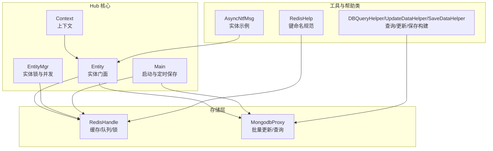
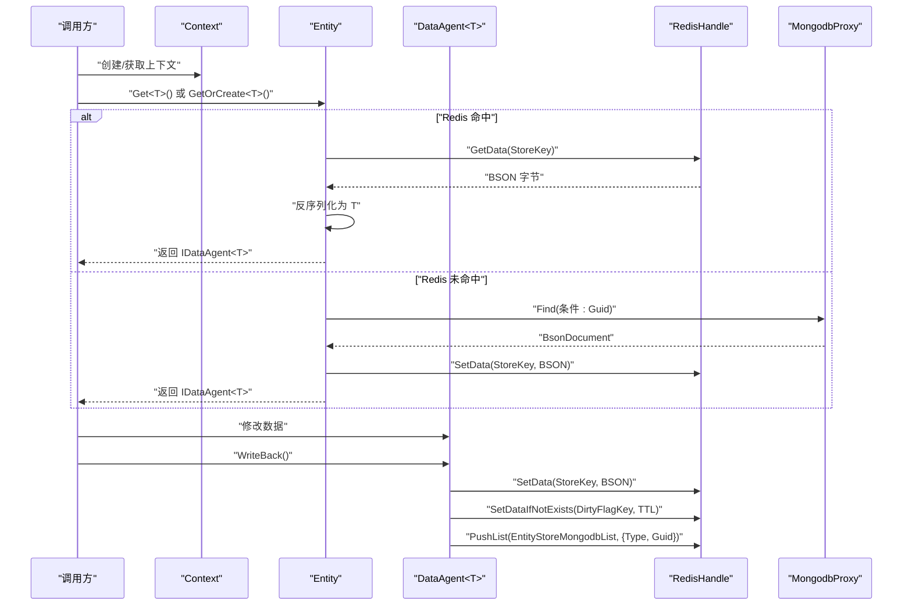
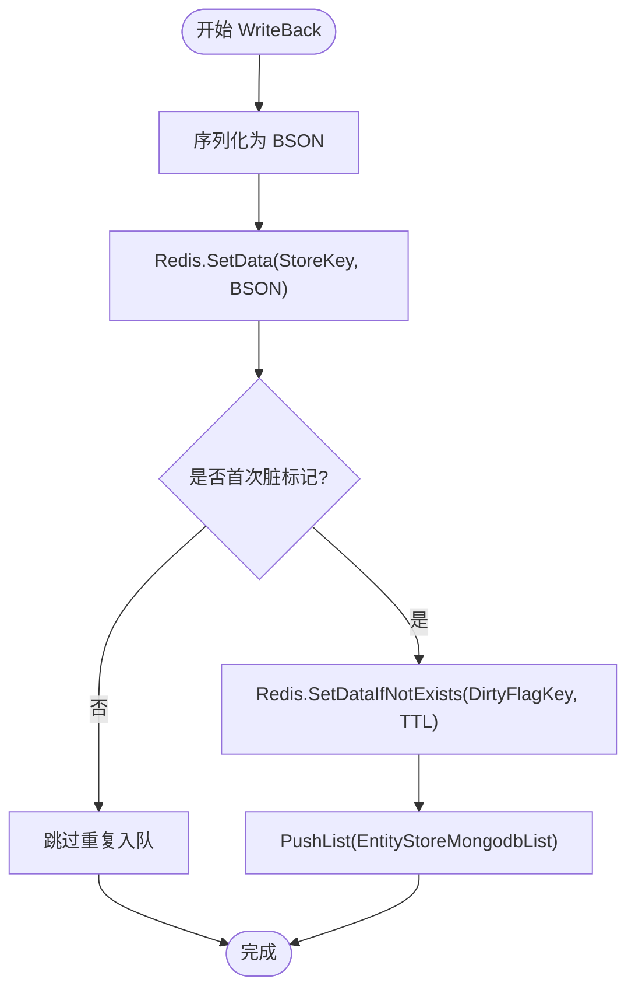
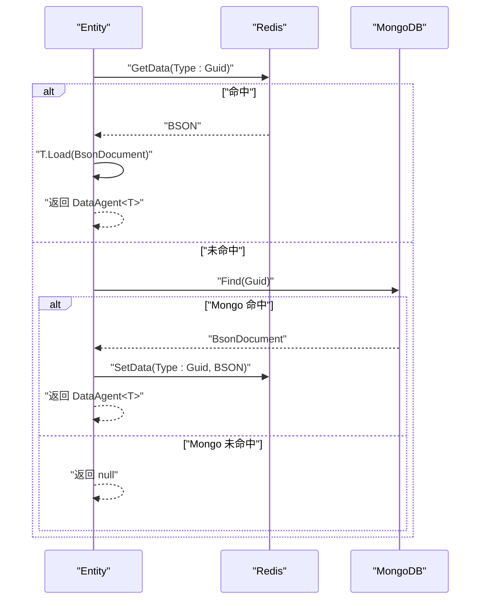
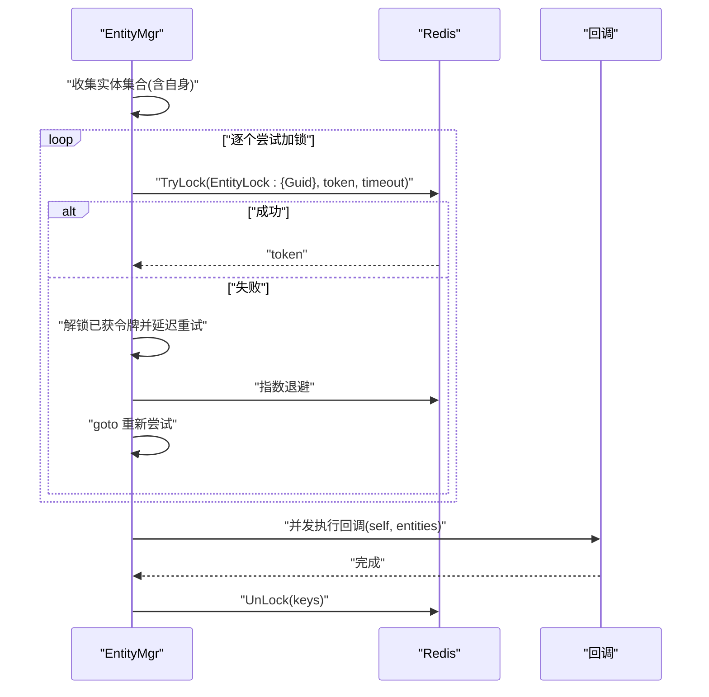
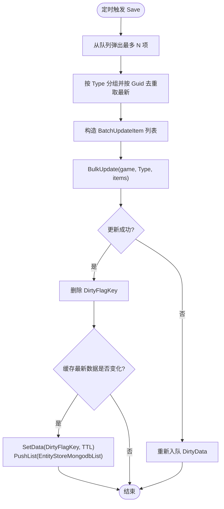
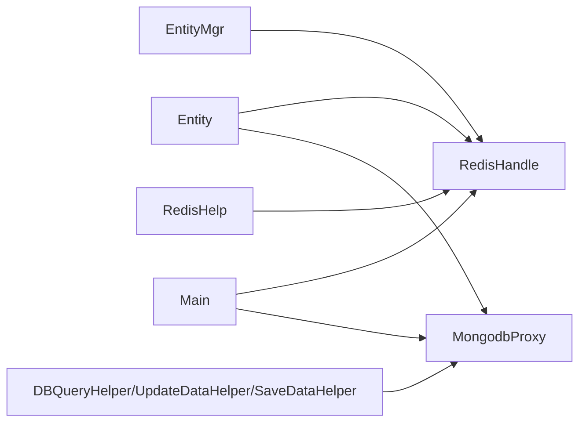

# 实体管理系统

<cite>
**本文引用的文件**
- [Entity.cs](file://lgbf/hub/Entity.cs)
- [EntityMgr.cs](file://lgbf/hub/EntityMgr.cs)
- [RedisHelp.cs](file://lgbf/hub/RedisHelp.cs)
- [Context.cs](file://lgbf/hub/Context.cs)
- [Main.cs](file://lgbf/hub/Main.cs)
- [RedisHandle.cs](file://lgbf/hub/RedisHandle.cs)
- [MongodbProxy.cs](file://lgbf/hub/MongodbProxy.cs)
- [DbHelper.cs](file://lgbf/hub/DbHelper.cs)
- [AsyncNtfMsg.cs](file://lgbf/hub/AsyncNtfMsg.cs)
</cite>

## 目录
1. [简介](#简介)
2. [项目结构](#项目结构)
3. [核心组件](#核心组件)
4. [架构总览](#架构总览)
5. [详细组件分析](#详细组件分析)
6. [依赖关系分析](#依赖关系分析)
7. [性能考量](#性能考量)
8. [故障排查指南](#故障排查指南)
9. [结论](#结论)
10. [附录：自定义实体实现示例](#附录自定义实体实现示例)

## 简介
本文件系统性阐述实体管理子系统的设计与实现，覆盖以下主题：
- IHostingData 类型系统与数据创建/加载机制
- DataAgent 代理模式：生命周期、写回流程与脏数据标记
- Entity 类：实体获取、创建与缓存策略
- GUID 管理、类型注册与数据序列化
- 自定义实体类型的实现步骤与最佳实践
- 性能优化、错误处理与扩展性设计

## 项目结构
实体管理相关代码集中在 hub 子目录，围绕“上下文 Context”组织，通过 Redis 缓存与 MongoDB 持久化协同工作，并由定时器驱动批量落盘。

图表来源
- [Context.cs:4-26](file://lgbf/hub/Context.cs#L4-L26)
- [Entity.cs:94-153](file://lgbf/hub/Entity.cs#L94-L153)
- [EntityMgr.cs:44-126](file://lgbf/hub/EntityMgr.cs#L44-L126)
- [Main.cs:31-157](file://lgbf/hub/Main.cs#L31-L157)
- [RedisHandle.cs:13-543](file://lgbf/hub/RedisHandle.cs#L13-L543)
- [MongodbProxy.cs:10-220](file://lgbf/hub/MongodbProxy.cs#L10-L220)
- [RedisHelp.cs:4-19](file://lgbf/hub/RedisHelp.cs#L4-L19)
- [DbHelper.cs:160-310](file://lgbf/hub/DbHelper.cs#L160-L310)
- [AsyncNtfMsg.cs:4-62](file://lgbf/hub/AsyncNtfMsg.cs#L4-L62)

章节来源
- [Context.cs:4-26](file://lgbf/hub/Context.cs#L4-L26)
- [Entity.cs:94-153](file://lgbf/hub/Entity.cs#L94-L153)
- [EntityMgr.cs:44-126](file://lgbf/hub/EntityMgr.cs#L44-L126)
- [Main.cs:31-157](file://lgbf/hub/Main.cs#L31-L157)
- [RedisHandle.cs:13-543](file://lgbf/hub/RedisHandle.cs#L13-L543)
- [MongodbProxy.cs:10-220](file://lgbf/hub/MongodbProxy.cs#L10-L220)
- [RedisHelp.cs:4-19](file://lgbf/hub/RedisHelp.cs#L4-L19)
- [DbHelper.cs:160-310](file://lgbf/hub/DbHelper.cs#L160-L310)
- [AsyncNtfMsg.cs:4-62](file://lgbf/hub/AsyncNtfMsg.cs#L4-L62)

## 核心组件
- IHostingData：实体数据契约，定义静态工厂（Type/Create/Load）与实例序列化（Store）
- IDataAgent<T>/DataAgent<T>：实体数据代理，封装读写、写回与脏数据标记
- Entity：实体门面，负责从 Redis/MongoDB 加载或创建实体数据
- EntityMgr：多实体加锁与并发控制，保障事务一致性
- Main：定时器驱动的批量落盘，消费脏队列并批量更新 MongoDB
- RedisHelp：统一的键命名规范
- RedisHandle/MongodbProxy：缓存与数据库访问抽象
- DBQueryHelper/UpdateDataHelper/SaveDataHelper：查询/更新/保存的构建器

章节来源
- [Entity.cs:4-22](file://lgbf/hub/Entity.cs#L4-L22)
- [Entity.cs:24-29](file://lgbf/hub/Entity.cs#L24-L29)
- [Entity.cs:37-92](file://lgbf/hub/Entity.cs#L37-L92)
- [Entity.cs:94-153](file://lgbf/hub/Entity.cs#L94-L153)
- [EntityMgr.cs:3-126](file://lgbf/hub/EntityMgr.cs#L3-L126)
- [Main.cs:15-157](file://lgbf/hub/Main.cs#L15-L157)
- [RedisHelp.cs:4-19](file://lgbf/hub/RedisHelp.cs#L4-L19)
- [RedisHandle.cs:13-543](file://lgbf/hub/RedisHandle.cs#L13-L543)
- [MongodbProxy.cs:10-220](file://lgbf/hub/MongodbProxy.cs#L10-L220)
- [DbHelper.cs:4-157](file://lgbf/hub/DbHelper.cs#L4-L157)
- [DbHelper.cs:160-310](file://lgbf/hub/DbHelper.cs#L160-L310)

## 架构总览
实体管理采用“缓存优先 + 异步落盘”的双层架构：
- 写路径：Entity.GetOrCreate 创建或加载 -> 修改数据 -> DataAgent.WriteBack 写回 Redis 并入队脏列表
- 读路径：Entity.Get 先查 Redis，缺失则查 MongoDB 并回填 Redis
- 落盘路径：Main.Save 定时从脏队列取数据，按类型去重后批量写入 MongoDB，并清理脏标志

图表来源
- [Entity.cs:104-152](file://lgbf/hub/Entity.cs#L104-L152)
- [RedisHandle.cs:84-131](file://lgbf/hub/RedisHandle.cs#L84-L131)
- [RedisHandle.cs:257-303](file://lgbf/hub/RedisHandle.cs#L257-L303)
- [RedisHelp.cs:6-14](file://lgbf/hub/RedisHelp.cs#L6-L14)
- [MongodbProxy.cs:143-184](file://lgbf/hub/MongodbProxy.cs#L143-L184)

章节来源
- [Entity.cs:104-152](file://lgbf/hub/Entity.cs#L104-L152)
- [RedisHandle.cs:84-131](file://lgbf/hub/RedisHandle.cs#L84-L131)
- [RedisHandle.cs:257-303](file://lgbf/hub/RedisHandle.cs#L257-L303)
- [RedisHelp.cs:6-14](file://lgbf/hub/RedisHelp.cs#L6-L14)
- [MongodbProxy.cs:143-184](file://lgbf/hub/MongodbProxy.cs#L143-L184)

## 详细组件分析

### IHostingData 类型系统与数据契约
- 静态方法 Type：用于实体类型注册与键空间隔离
- 静态方法 Create：工厂方法，用于创建新实体的默认数据
- 静态方法 Load：从 BsonDocument 反序列化为实体数据
- 实例方法 Store：将实体数据序列化为 BsonDocument

该设计确保了“类型即键前缀”，避免不同实体类型之间的键冲突；同时以 BsonDocument 作为跨语言/跨模块的通用序列化介质。

章节来源
- [Entity.cs:4-22](file://lgbf/hub/Entity.cs#L4-L22)

### DataAgent 代理模式与写回机制
- 生命周期：由 Entity.CreateAgent<T> 创建，持有 Entity 上下文与类型信息
- 写回流程：
  1) 序列化 Store() 为 BSON
  2) Redis.SetData(StoreKey, BSON) 写入缓存
  3) Redis.SetDataIfNotExists(DirtyFlagKey, TTL) 标记脏数据
  4) Redis.PushList(EntityStoreMongodbList, {Type, Guid}) 入队等待批量落盘
- 脏数据标记：首次写入时设置过期标志，后续同周期内不再重复入队
- 错误处理：异常记录日志并抛出，上层可选择重试或补偿

图表来源
- [Entity.cs:52-91](file://lgbf/hub/Entity.cs#L52-L91)
- [RedisHandle.cs:84-131](file://lgbf/hub/RedisHandle.cs#L84-L131)
- [RedisHandle.cs:257-303](file://lgbf/hub/RedisHandle.cs#L257-L303)
- [RedisHelp.cs:6-14](file://lgbf/hub/RedisHelp.cs#L6-L14)

章节来源
- [Entity.cs:37-92](file://lgbf/hub/Entity.cs#L37-L92)
- [RedisHandle.cs:84-131](file://lgbf/hub/RedisHandle.cs#L84-L131)
- [RedisHandle.cs:257-303](file://lgbf/hub/RedisHandle.cs#L257-L303)
- [RedisHelp.cs:6-14](file://lgbf/hub/RedisHelp.cs#L6-L14)

### Entity 获取、创建与缓存策略
- Get<T>()：先查 Redis，命中则反序列化；未命中则查 MongoDB，再回填 Redis
- GetOrCreate<T>()：若不存在则调用 T.Create() 创建默认数据
- 缓存键：使用 RedisHelp.EntityStoreKey 规范化键名，结合类型与 GUID
- 失败与边界：当 MongoDB 无记录时返回空，避免误创建

图表来源
- [Entity.cs:104-152](file://lgbf/hub/Entity.cs#L104-L152)
- [RedisHandle.cs:159-174](file://lgbf/hub/RedisHandle.cs#L159-L174)
- [MongodbProxy.cs:143-184](file://lgbf/hub/MongodbProxy.cs#L143-L184)
- [RedisHelp.cs](file://lgbf/hub/RedisHelp.cs#L10)

章节来源
- [Entity.cs:104-152](file://lgbf/hub/Entity.cs#L104-L152)
- [RedisHandle.cs:159-174](file://lgbf/hub/RedisHandle.cs#L159-L174)
- [MongodbProxy.cs:143-184](file://lgbf/hub/MongodbProxy.cs#L143-L184)
- [RedisHelp.cs](file://lgbf/hub/RedisHelp.cs#L10)

### EntityMgr 并发与锁管理
- 批量锁定：对多个实体 GUID 进行排序去重，逐个尝试加锁
- 锁续租：后台任务定期续租，防止长时间持有导致死锁
- 重试退避：失败时指数退避重试，降低热点竞争
- 解锁：回调执行完毕后统一解锁

图表来源
- [EntityMgr.cs:44-126](file://lgbf/hub/EntityMgr.cs#L44-L126)
- [RedisHandle.cs:334-394](file://lgbf/hub/RedisHandle.cs#L334-L394)

章节来源
- [EntityMgr.cs:44-126](file://lgbf/hub/EntityMgr.cs#L44-L126)
- [RedisHandle.cs:334-394](file://lgbf/hub/RedisHandle.cs#L334-L394)

### Main 批量落盘与去重
- 脏队列：Redis 列表存储 {Type, Guid}，保证幂等
- 去重策略：按类型分组后，按 GUID 去重保留最新一次写入的数据
- 批量更新：构造 UpdateOneModel 列表，异步批量写入 MongoDB
- 冲突处理：若 MongoDB 更新失败，将脏项重新入队；若缓存最新数据变化，则重新置脏并入队

图表来源
- [Main.cs:62-157](file://lgbf/hub/Main.cs#L62-L157)
- [RedisHandle.cs:257-303](file://lgbf/hub/RedisHandle.cs#L257-L303)
- [RedisHandle.cs:84-131](file://lgbf/hub/RedisHandle.cs#L84-L131)
- [MongodbProxy.cs:102-120](file://lgbf/hub/MongodbProxy.cs#L102-L120)

章节来源
- [Main.cs:62-157](file://lgbf/hub/Main.cs#L62-L157)
- [RedisHandle.cs:257-303](file://lgbf/hub/RedisHandle.cs#L257-L303)
- [RedisHandle.cs:84-131](file://lgbf/hub/RedisHandle.cs#L84-L131)
- [MongodbProxy.cs:102-120](file://lgbf/hub/MongodbProxy.cs#L102-L120)

### GUID 管理与类型注册
- GUID 分配：通过 MongoDB 的原子自增字段 inside_guid 统一分配
- 类型注册：IHostingData.Type() 返回实体类型名，作为键空间前缀
- 键命名：RedisHelp 提供统一模板，避免硬编码与不一致

章节来源
- [MongodbProxy.cs:204-219](file://lgbf/hub/MongodbProxy.cs#L204-L219)
- [Entity.cs:6-9](file://lgbf/hub/Entity.cs#L6-L9)
- [RedisHelp.cs:6-14](file://lgbf/hub/RedisHelp.cs#L6-L14)

### 数据序列化与查询构建
- 序列化：IHostingData.Store() 返回 BsonDocument，统一 BSON 编解码
- 查询构建：DBQueryHelper 支持多类型条件拼装，最终生成 $and 条件数组
- 更新构建：UpdateDataHelper 支持 $set/$inc 组合，避免覆盖性更新

章节来源
- [Entity.cs:21-21](file://lgbf/hub/Entity.cs#L21-L21)
- [DbHelper.cs:160-310](file://lgbf/hub/DbHelper.cs#L160-L310)
- [DbHelper.cs:71-157](file://lgbf/hub/DbHelper.cs#L71-L157)
- [DbHelper.cs:4-69](file://lgbf/hub/DbHelper.cs#L4-L69)

## 依赖关系分析
- Entity 依赖 RedisHandle 与 MongodbProxy 进行读写
- EntityMgr 依赖 RedisHandle 进行分布式锁
- Main 依赖 RedisHandle/MongodbProxy 进行批量落盘
- RedisHelp 为所有组件提供键命名规范
- DBQueryHelper/UpdateDataHelper/SaveDataHelper 为数据库操作提供构建器

图表来源
- [Entity.cs:94-153](file://lgbf/hub/Entity.cs#L94-L153)
- [EntityMgr.cs:44-126](file://lgbf/hub/EntityMgr.cs#L44-L126)
- [Main.cs:62-157](file://lgbf/hub/Main.cs#L62-L157)
- [RedisHandle.cs:13-543](file://lgbf/hub/RedisHandle.cs#L13-L543)
- [MongodbProxy.cs:10-220](file://lgbf/hub/MongodbProxy.cs#L10-L220)
- [RedisHelp.cs:4-19](file://lgbf/hub/RedisHelp.cs#L4-L19)
- [DbHelper.cs:160-310](file://lgbf/hub/DbHelper.cs#L160-L310)

章节来源
- [Entity.cs:94-153](file://lgbf/hub/Entity.cs#L94-L153)
- [EntityMgr.cs:44-126](file://lgbf/hub/EntityMgr.cs#L44-L126)
- [Main.cs:62-157](file://lgbf/hub/Main.cs#L62-L157)
- [RedisHandle.cs:13-543](file://lgbf/hub/RedisHandle.cs#L13-L543)
- [MongodbProxy.cs:10-220](file://lgbf/hub/MongodbProxy.cs#L10-L220)
- [RedisHelp.cs:4-19](file://lgbf/hub/RedisHelp.cs#L4-L19)
- [DbHelper.cs:160-310](file://lgbf/hub/DbHelper.cs#L160-L310)

## 性能考量
- 缓存命中率：优先从 Redis 读取，减少 MongoDB 压力；批量落盘降低写放大
- 脏队列批处理：按类型分组+去重，减少重复写入
- 锁粒度：按实体 GUID 分散锁，避免全局互斥
- 异常恢复：Redis/Mongo 访问均具备超时与重连机制，提升稳定性
- 建议：
  - 合理设置脏标志 TTL，平衡落盘及时性与队列压力
  - 对热点实体进行预热，提前填充 Redis
  - 控制批量大小与定时周期，避免突发 IO 峰值

[本节为通用性能建议，无需特定文件引用]

## 故障排查指南
- 写回失败
  - 现象：WriteBack 抛出异常并记录日志
  - 排查：检查 Redis 连接状态、键写入权限、脏队列推送是否成功
  - 参考
    - [Entity.cs:52-91](file://lgbf/hub/Entity.cs#L52-L91)
    - [RedisHandle.cs:84-131](file://lgbf/hub/RedisHandle.cs#L84-L131)
    - [RedisHandle.cs:257-303](file://lgbf/hub/RedisHandle.cs#L257-L303)
- 落盘失败
  - 现象：Main.Save 批量更新失败，脏项重新入队
  - 排查：确认 MongoDB 连接、索引、权限；检查批量请求格式
  - 参考
    - [Main.cs:102-134](file://lgbf/hub/Main.cs#L102-L134)
    - [MongodbProxy.cs:102-120](file://lgbf/hub/MongodbProxy.cs#L102-L120)
- 锁失败
  - 现象：EntityMgr 重试后仍无法获得锁
  - 排查：检查锁超时配置、是否存在死锁；观察指数退避是否过长
  - 参考
    - [EntityMgr.cs:56-81](file://lgbf/hub/EntityMgr.cs#L56-L81)
    - [RedisHandle.cs:334-394](file://lgbf/hub/RedisHandle.cs#L334-L394)

章节来源
- [Entity.cs:52-91](file://lgbf/hub/Entity.cs#L52-L91)
- [RedisHandle.cs:84-131](file://lgbf/hub/RedisHandle.cs#L84-L131)
- [RedisHandle.cs:257-303](file://lgbf/hub/RedisHandle.cs#L257-L303)
- [Main.cs:102-134](file://lgbf/hub/Main.cs#L102-L134)
- [MongodbProxy.cs:102-120](file://lgbf/hub/MongodbProxy.cs#L102-L120)
- [EntityMgr.cs:56-81](file://lgbf/hub/EntityMgr.cs#L56-L81)
- [RedisHandle.cs:334-394](file://lgbf/hub/RedisHandle.cs#L334-L394)

## 结论
该实体管理系统通过清晰的类型契约、代理写回与批量落盘机制，实现了高可用、高性能的实体数据管理。其关键优势在于：
- 明确的类型注册与键空间隔离
- 缓存优先与异步落盘的读写分离
- 分布式锁保障并发一致性
- 工具化的查询/更新构建器简化开发

[本节为总结性内容，无需特定文件引用]

## 附录：自定义实体实现示例
以下步骤基于现有 AsyncNtfMsg 实现，展示如何新增一个自定义实体类型：

- 步骤一：定义实体类型
  - 实现 IHostingData，提供 Type()/Create()/Load()/Store() 方法
  - 参考
    - [AsyncNtfMsg.cs:4-62](file://lgbf/hub/AsyncNtfMsg.cs#L4-L62)
- 步骤二：在业务中使用
  - 通过 Context 获取 Entity，调用 Get<T>() 或 GetOrCreate<T>()
  - 修改数据后调用 IDataAgent<T>.WriteBack() 提交
  - 参考
    - [Context.cs:4-26](file://lgbf/hub/Context.cs#L4-L26)
    - [Entity.cs:104-152](file://lgbf/hub/Entity.cs#L104-L152)
- 步骤三：并发安全
  - 使用 EntityMgr.CallLockAndGetEntity 在需要时对多个实体加锁
  - 参考
    - [EntityMgr.cs:44-126](file://lgbf/hub/EntityMgr.cs#L44-L126)
- 步骤四：数据持久化
  - 不需手动落盘，Main.Save 会自动批量处理脏队列
  - 参考
    - [Main.cs:62-157](file://lgbf/hub/Main.cs#L62-L157)

章节来源
- [AsyncNtfMsg.cs:4-62](file://lgbf/hub/AsyncNtfMsg.cs#L4-L62)
- [Context.cs:4-26](file://lgbf/hub/Context.cs#L4-L26)
- [Entity.cs:104-152](file://lgbf/hub/Entity.cs#L104-L152)
- [EntityMgr.cs:44-126](file://lgbf/hub/EntityMgr.cs#L44-L126)
- [Main.cs:62-157](file://lgbf/hub/Main.cs#L62-L157)