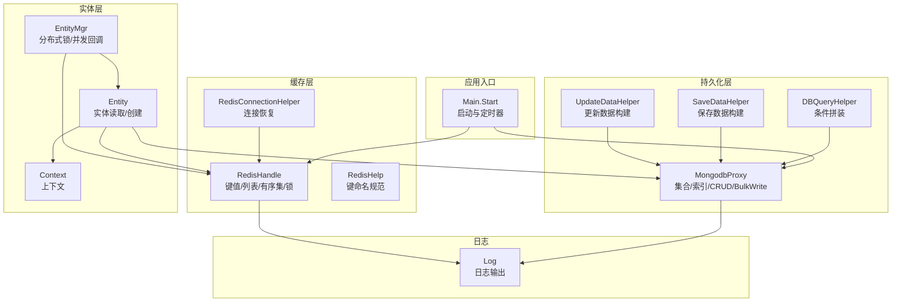
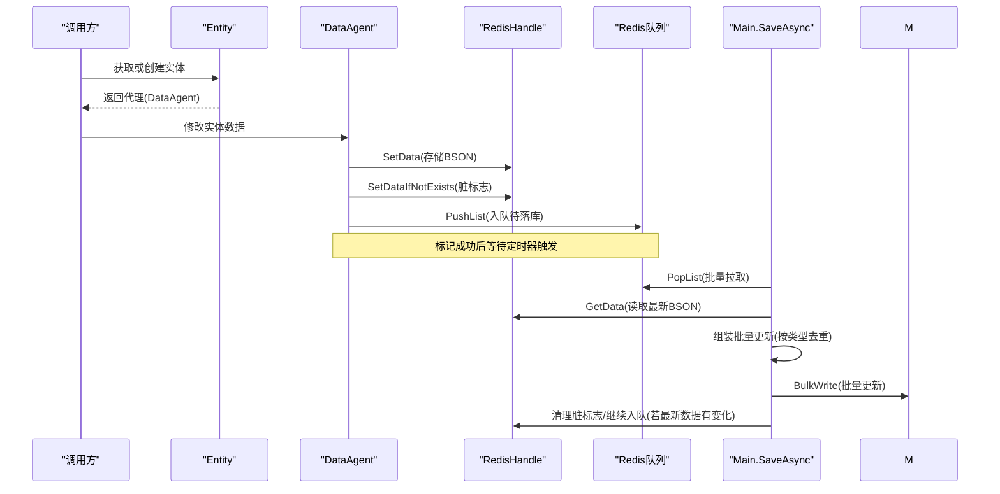
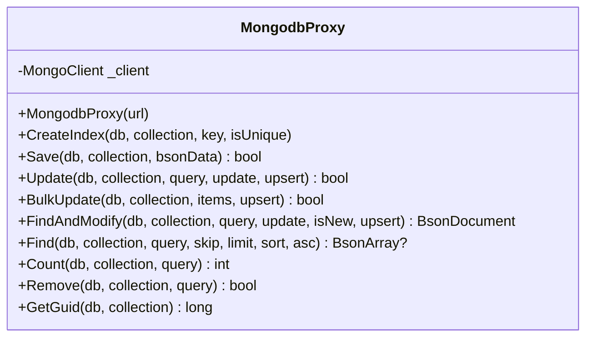
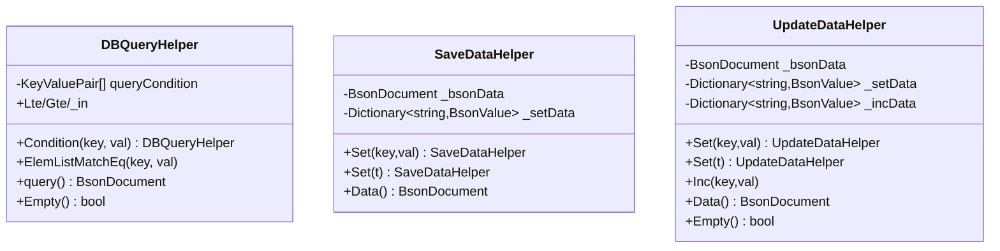
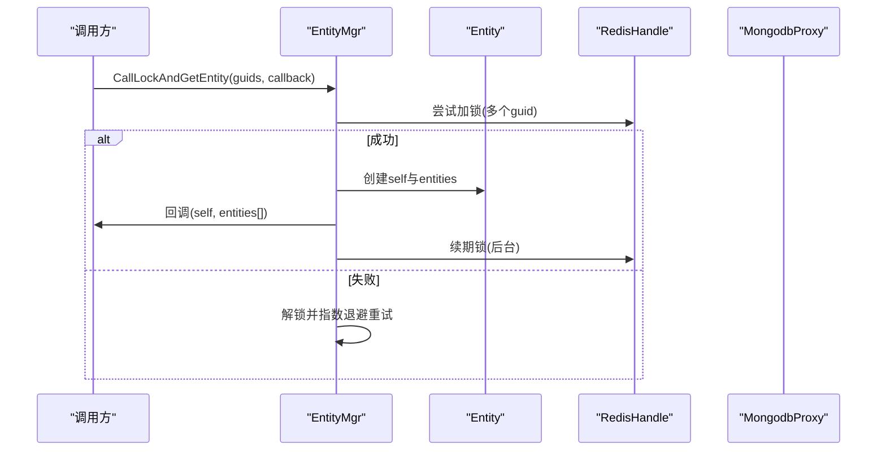
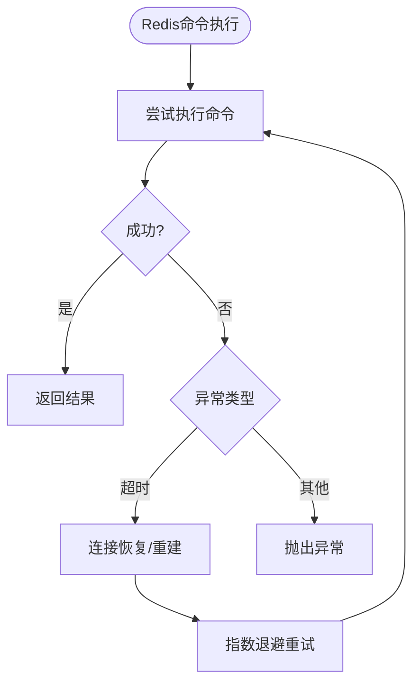
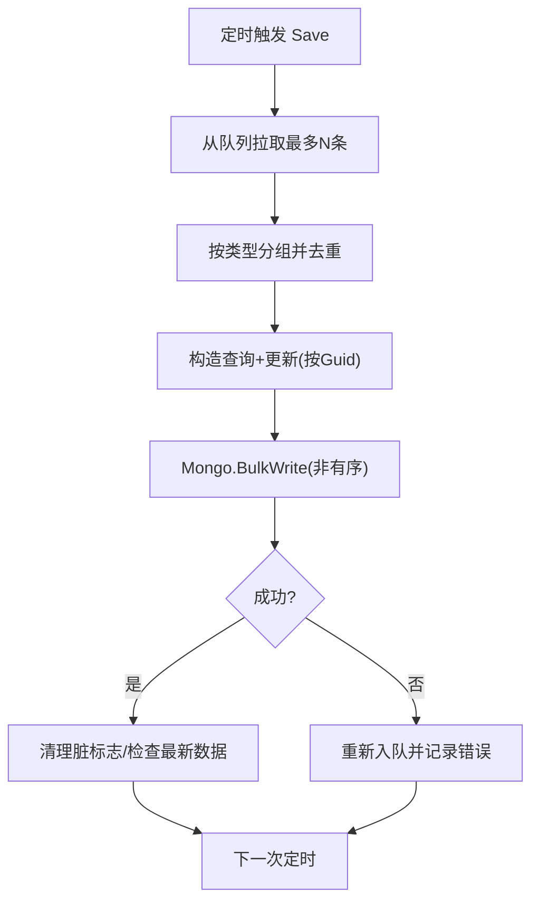
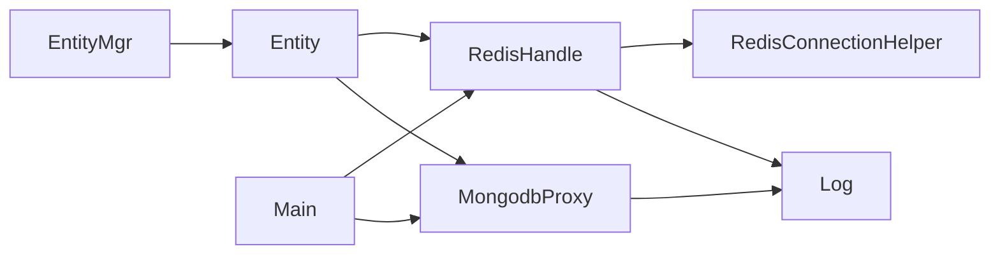

# 数据持久化层

<cite>
**本文引用的文件**   
- [MongodbProxy.cs](file://lgbf/hub/MongodbProxy.cs)
- [DbHelper.cs](file://lgbf/hub/DbHelper.cs)
- [Entity.cs](file://lgbf/hub/Entity.cs)
- [EntityMgr.cs](file://lgbf/hub/EntityMgr.cs)
- [Context.cs](file://lgbf/hub/Context.cs)
- [RedisHelp.cs](file://lgbf/hub/RedisHelp.cs)
- [Main.cs](file://lgbf/hub/Main.cs)
- [RedisHandle.cs](file://lgbf/hub/RedisHandle.cs)
- [RedisConnectionHelper.cs](file://lgbf/hub/RedisConnectionHelper.cs)
- [Log.cs](file://lgbf/hub/Log.cs)
- [Main.cs](file://lgbf/hub/Main.cs)
</cite>

## 目录
1. [简介](#简介)
2. [项目结构](#项目结构)
3. [核心组件](#核心组件)
4. [架构总览](#架构总览)
5. [详细组件分析](#详细组件分析)
6. [依赖关系分析](#依赖关系分析)
7. [性能考量](#性能考量)
8. [故障排查指南](#故障排查指南)
9. [结论](#结论)
10. [附录](#附录)

## 简介
本文件聚焦于数据持久化层，系统性阐述基于 MongoDB 的代理设计、查询构建器与结果集处理、批量写入优化（含批量操作与事务）、索引管理与查询优化、数据访问模式（CRUD、聚合、迁移）、配置与部署要点（副本集、分片、备份恢复），以及数据安全（访问控制、加密传输、审计日志）。同时提供面向代码路径的示例定位，帮助读者快速定位到具体实现。

## 项目结构
数据持久化层主要由以下模块构成：
- MongoDB 代理：封装连接、集合访问、索引、CRUD、聚合等能力
- 查询/更新/保存构建器：以类型安全的方式构造 BSON 文档与更新语义
- 实体与实体管理：定义实体接口、代理写回机制、分布式锁与并发控制
- Redis 缓存与队列：作为热数据缓存与异步落库的缓冲区
- 启动与定时任务：负责初始化、周期性批量写回与错误处理

图表来源
- [Main.cs:31-40](file://lgbf/hub/Main.cs#L31-L40)
- [RedisHandle.cs:21-25](file://lgbf/hub/RedisHandle.cs#L21-L25)
- [MongodbProxy.cs:14-18](file://lgbf/hub/MongodbProxy.cs#L14-L18)
- [Entity.cs:94-135](file://lgbf/hub/Entity.cs#L94-L135)
- [EntityMgr.cs:44-126](file://lgbf/hub/EntityMgr.cs#L44-L126)
- [RedisHelp.cs:4-19](file://lgbf/hub/RedisHelp.cs#L4-L19)
- [DbHelper.cs:4-69](file://lgbf/hub/DbHelper.cs#L4-L69)

章节来源
- [Main.cs:31-40](file://lgbf/hub/Main.cs#L31-L40)
- [RedisHandle.cs:21-25](file://lgbf/hub/RedisHandle.cs#L21-L25)
- [MongodbProxy.cs:14-18](file://lgbf/hub/MongodbProxy.cs#L14-L18)
- [Entity.cs:94-135](file://lgbf/hub/Entity.cs#L94-L135)
- [EntityMgr.cs:44-126](file://lgbf/hub/EntityMgr.cs#L44-L126)
- [RedisHelp.cs:4-19](file://lgbf/hub/RedisHelp.cs#L4-L19)
- [DbHelper.cs:4-69](file://lgbf/hub/DbHelper.cs#L4-L69)

## 核心组件
- MongodbProxy：统一的 MongoDB 访问代理，提供集合获取、索引创建、单条/批量更新、查找修改、查询、计数、删除等能力，并对异常进行记录
- DBQueryHelper/SaveDataHelper/UpdateDataHelper：分别用于构造查询条件、保存文档、更新文档（支持 $set/$inc）
- Entity/EntityMgr：定义实体接口与代理写回流程；通过 Redis 锁保证并发一致性；在内存中缓存实体并在后台批量落库
- RedisHandle/RedisConnectionHelper：Redis 连接、命令封装、自动重连与恢复、超时处理
- Context：贯穿各层的上下文对象，注入 Redis 与 Mongo 客户端
- Log：统一日志输出与滚动

章节来源
- [MongodbProxy.cs:10-221](file://lgbf/hub/MongodbProxy.cs#L10-L221)
- [DbHelper.cs:4-311](file://lgbf/hub/DbHelper.cs#L4-L311)
- [Entity.cs:4-154](file://lgbf/hub/Entity.cs#L4-L154)
- [EntityMgr.cs:44-126](file://lgbf/hub/EntityMgr.cs#L44-L126)
- [RedisHandle.cs:13-544](file://lgbf/hub/RedisHandle.cs#L13-L544)
- [RedisConnectionHelper.cs:6-144](file://lgbf/hub/RedisConnectionHelper.cs#L6-L144)
- [Context.cs:4-26](file://lgbf/hub/Context.cs#L4-L26)
- [Log.cs:6-113](file://lgbf/hub/Log.cs#L6-L113)

## 架构总览
该持久化层采用“缓存优先 + 异步批量落库”的设计：
- 写入：实体变更先写入 Redis，标记脏标志，推入待落库队列
- 批量落库：定时器周期性从队列拉取一批实体，按类型分组去重，构造批量更新请求，最终调用 BulkWrite 落库
- 读取：优先从 Redis 命中；未命中则查询 MongoDB 并回填 Redis
- 并发：使用 Redis 分布式锁保护跨实体的原子操作；锁续期线程保障长事务场景

图表来源
- [Entity.cs:94-154](file://lgbf/hub/Entity.cs#L94-L154)
- [RedisHandle.cs:84-131](file://lgbf/hub/RedisHandle.cs#L84-L131)
- [RedisHelp.cs:4-19](file://lgbf/hub/RedisHelp.cs#L4-L19)
- [Main.cs:50-157](file://lgbf/hub/Main.cs#L50-L157)

章节来源
- [Entity.cs:94-154](file://lgbf/hub/Entity.cs#L94-L154)
- [RedisHandle.cs:84-131](file://lgbf/hub/RedisHandle.cs#L84-L131)
- [RedisHelp.cs:4-19](file://lgbf/hub/RedisHelp.cs#L4-L19)
- [Main.cs:50-157](file://lgbf/hub/Main.cs#L50-L157)

## 详细组件分析

### MongoDB 代理（MongodbProxy）
- 连接管理：通过 MongoUrl 构造 MongoClient，提供单实例客户端复用
- 集合访问：按数据库与集合名获取 BsonDocument 集合
- 索引管理：支持唯一/非唯一索引创建
- CRUD 操作：
  - 保存：InsertOne
  - 更新：UpdateOne（可选 Upsert）
  - 批量更新：BulkWrite（非有序，提升吞吐）
  - 查找修改：FindOneAndUpdate（支持返回前/后文档、Upsert）
  - 查询：Find（支持跳过、限制、排序、投影排除 _id）
  - 计数：CountDocuments
  - 删除：DeleteOne
  - 原子自增：FindOneAndUpdate + $inc 获取自增序列
- 异常处理：捕获异常并记录错误日志

图表来源
- [MongodbProxy.cs:10-221](file://lgbf/hub/MongodbProxy.cs#L10-L221)

章节来源
- [MongodbProxy.cs:10-221](file://lgbf/hub/MongodbProxy.cs#L10-L221)

### 查询/更新/保存构建器（DBQueryHelper/SaveDataHelper/UpdateDataHelper）
- DBQueryHelper：支持多类型条件拼装（相等、$elemMatch、$lte/$gte、$in），最终生成 $and 条件
- SaveDataHelper：支持键值设置与整段 BSON 设置，生成完整文档
- UpdateDataHelper：支持 $set 与 $inc，组合为更新文档

图表来源
- [DbHelper.cs:4-311](file://lgbf/hub/DbHelper.cs#L4-L311)

章节来源
- [DbHelper.cs:4-311](file://lgbf/hub/DbHelper.cs#L4-L311)

### 实体与实体管理（Entity/EntityMgr/Context）
- IHostingData：实体数据契约（类型标识、创建、加载、存储）
- IDataAgent<T>：实体代理接口，负责写回
- DataAgent<T>：实现写回逻辑，将 BSON 存入 Redis，设置脏标志，推入待落库队列
- Entity：根据 Guid 优先从 Redis 加载，否则从 MongoDB 查询并回填 Redis
- EntityMgr：提供带分布式锁的实体批量获取与回调执行，支持锁续期与重试退避
- Context：封装当前上下文（Guid、Redis、Mongo、Timer）

图表来源
- [EntityMgr.cs:44-126](file://lgbf/hub/EntityMgr.cs#L44-L126)
- [Entity.cs:94-154](file://lgbf/hub/Entity.cs#L94-L154)
- [Context.cs:4-26](file://lgbf/hub/Context.cs#L4-L26)

章节来源
- [Entity.cs:4-154](file://lgbf/hub/Entity.cs#L4-L154)
- [EntityMgr.cs:44-126](file://lgbf/hub/EntityMgr.cs#L44-L126)
- [Context.cs:4-26](file://lgbf/hub/Context.cs#L4-L26)

### Redis 缓存与连接（RedisHandle/RedisConnectionHelper/RedisHelp）
- RedisHandle：封装字符串/二进制数据读写、JSON 序列化/反序列化、列表操作、发布订阅、分布式锁、有序集合、哈希等；对 RedisTimeoutException 自动恢复
- RedisConnectionHelper：构建连接配置、连接/恢复策略、并发恢复互斥
- RedisHelp：统一键命名规范（锁、存储、脏标志、排行榜等）

图表来源
- [RedisHandle.cs:36-332](file://lgbf/hub/RedisHandle.cs#L36-L332)
- [RedisConnectionHelper.cs:56-127](file://lgbf/hub/RedisConnectionHelper.cs#L56-L127)

章节来源
- [RedisHandle.cs:13-544](file://lgbf/hub/RedisHandle.cs#L13-L544)
- [RedisConnectionHelper.cs:6-144](file://lgbf/hub/RedisConnectionHelper.cs#L6-L144)
- [RedisHelp.cs:4-19](file://lgbf/hub/RedisHelp.cs#L4-L19)

### 启动与批量写回（Main）
- 启动：初始化 Redis 与 Mongo 客户端，注册定时器
- 批量写回：周期性从 Redis 队列弹出待落库实体，按类型分组去重，构造批量更新请求，调用 Mongo.BulkWrite；失败则重新入队；若最新数据与落库数据不一致则继续标记脏标志并入队

图表来源
- [Main.cs:50-157](file://lgbf/hub/Main.cs#L50-L157)

章节来源
- [Main.cs:31-157](file://lgbf/hub/Main.cs#L31-L157)

## 依赖关系分析
- 组件耦合
  - Entity 依赖 RedisHandle 与 MongodbProxy
  - EntityMgr 依赖 RedisHandle 与 Entity
  - Main 依赖 RedisHandle 与 MongodbProxy，驱动批量写回
  - 日志组件被各层共享
- 外部依赖
  - MongoDB.Driver（BsonDocument、Builders、Indexes、BulkWrite）
  - StackExchange.Redis（连接、命令、发布订阅、锁）
- 可能的循环依赖
  - 无直接循环；通过 Context 注入避免运行时循环引用

图表来源
- [EntityMgr.cs:44-126](file://lgbf/hub/EntityMgr.cs#L44-L126)
- [Entity.cs:94-154](file://lgbf/hub/Entity.cs#L94-L154)
- [Main.cs:31-157](file://lgbf/hub/Main.cs#L31-L157)
- [RedisHandle.cs:13-544](file://lgbf/hub/RedisHandle.cs#L13-L544)
- [RedisConnectionHelper.cs:6-144](file://lgbf/hub/RedisConnectionHelper.cs#L6-L144)
- [MongodbProxy.cs:10-221](file://lgbf/hub/MongodbProxy.cs#L10-L221)
- [Log.cs:6-113](file://lgbf/hub/Log.cs#L6-L113)

章节来源
- [EntityMgr.cs:44-126](file://lgbf/hub/EntityMgr.cs#L44-L126)
- [Entity.cs:94-154](file://lgbf/hub/Entity.cs#L94-L154)
- [Main.cs:31-157](file://lgbf/hub/Main.cs#L31-L157)
- [RedisHandle.cs:13-544](file://lgbf/hub/RedisHandle.cs#L13-L544)
- [RedisConnectionHelper.cs:6-144](file://lgbf/hub/RedisConnectionHelper.cs#L6-L144)
- [MongodbProxy.cs:10-221](file://lgbf/hub/MongodbProxy.cs#L10-L221)
- [Log.cs:6-113](file://lgbf/hub/Log.cs#L6-L113)

## 性能考量
- 批量写入优化
  - 使用 BulkWrite（非有序）提升吞吐，减少网络往返
  - 按实体类型分组去重，避免重复更新同一文档
  - 脏标志 + 队列异步落库，削峰填谷
- 查询优化
  - 使用 DBQueryHelper 组合条件，确保索引可命中
  - 查询时排除 _id，减少传输体积
  - 排序与分页参数化，避免全表扫描
- 缓存策略
  - Redis 作为热数据缓存，降低 MongoDB 压力
  - 脏标志 + 队列保证最终一致性
- 连接与恢复
  - RedisHandle 对超时异常自动恢复，指数退避重试
  - MongodbProxy 统一客户端实例，减少连接开销
- 并发控制
  - Redis 分布式锁 + 续期线程，保障跨实体操作一致性

[本节为通用性能建议，无需特定文件引用]

## 故障排查指南
- 日志定位
  - 使用 Log.Err 输出关键错误，包含堆栈与时间戳
- Redis 连接问题
  - RedisConnectionHelper 提供连接/恢复策略与互斥恢复
  - RedisHandle 对超时异常自动恢复并指数退避
- MongoDB 写入失败
  - 批量写回失败会重新入队，检查队列长度与错误日志
  - 确认索引是否存在、查询条件是否合理
- 并发冲突
  - 若锁续期失败，检查锁超时与续期间隔配置
  - 观察指数退避重试是否导致延迟

章节来源
- [Log.cs:55-58](file://lgbf/hub/Log.cs#L55-L58)
- [RedisConnectionHelper.cs:56-127](file://lgbf/hub/RedisConnectionHelper.cs#L56-L127)
- [RedisHandle.cs:36-332](file://lgbf/hub/RedisHandle.cs#L36-L332)
- [Main.cs:125-134](file://lgbf/hub/Main.cs#L125-L134)
- [EntityMgr.cs:20-42](file://lgbf/hub/EntityMgr.cs#L20-L42)

## 结论
该持久化层通过“Redis 缓存 + 异步批量落库 + MongoDB 代理”的组合，实现了高吞吐、低延迟与最终一致性的数据持久化方案。查询/更新/保存构建器提供了类型安全的文档构造方式；分布式锁与定时批处理保障了并发与一致性；完善的日志与连接恢复机制提升了稳定性。后续可在索引设计、查询计划分析与备份策略上进一步完善。

[本节为总结性内容，无需特定文件引用]

## 附录

### 数据库索引管理
- 设计原则
  - 为高频查询字段建立唯一/普通索引
  - 复合索引需遵循查询最左前缀原则
  - 定期评估索引选择性与维护成本
- 实现参考
  - 创建索引：[MongodbProxy.CreateIndex:35-53](file://lgbf/hub/MongodbProxy.cs#L35-L53)
  - 唯一索引：[MongodbProxy.CreateIndex:42-46](file://lgbf/hub/MongodbProxy.cs#L42-L46)
- 查询优化
  - 使用 DBQueryHelper 组合条件，确保覆盖索引
  - 查询时排除 _id，减少传输
  - 合理使用 skip/limit 与排序

章节来源
- [MongodbProxy.cs:35-53](file://lgbf/hub/MongodbProxy.cs#L35-L53)
- [DbHelper.cs:160-311](file://lgbf/hub/DbHelper.cs#L160-L311)

### 批量写入与事务
- 批量写入
  - 批量更新：[MongodbProxy.BulkUpdate:102-120](file://lgbf/hub/MongodbProxy.cs#L102-L120)
  - 批处理策略：[Main.SaveAsync:103-146](file://lgbf/hub/Main.cs#L103-L146)
- 事务
  - MongoDB 支持多文档 ACID 事务，可在需要强一致场景使用
  - 当前实现采用异步批量落库，满足最终一致需求

章节来源
- [MongodbProxy.cs:102-120](file://lgbf/hub/MongodbProxy.cs#L102-L120)
- [Main.cs:103-146](file://lgbf/hub/Main.cs#L103-L146)

### 数据访问模式
- CRUD
  - 保存：[MongodbProxy.Save:76-84](file://lgbf/hub/MongodbProxy.cs#L76-L84)
  - 更新：[MongodbProxy.Update:86-100](file://lgbf/hub/MongodbProxy.cs#L86-L100)
  - 删除：[MongodbProxy.Remove:194-202](file://lgbf/hub/MongodbProxy.cs#L194-L202)
  - 计数：[MongodbProxy.Count:186-192](file://lgbf/hub/MongodbProxy.cs#L186-L192)
- 聚合与查询
  - 查询：[MongodbProxy.Find:143-184](file://lgbf/hub/MongodbProxy.cs#L143-L184)
  - 查找修改：[MongodbProxy.FindAndModify:122-141](file://lgbf/hub/MongodbProxy.cs#L122-L141)
- 实体读写
  - 读取：[Entity.Get/GetOrCreate:104-152](file://lgbf/hub/Entity.cs#L104-L152)
  - 写回：[DataAgent.WriteBack:52-91](file://lgbf/hub/Entity.cs#L52-L91)

章节来源
- [MongodbProxy.cs:76-202](file://lgbf/hub/MongodbProxy.cs#L76-L202)
- [Entity.cs:52-152](file://lgbf/hub/Entity.cs#L52-L152)

### 数据模型设计与复杂查询示例（路径定位）
- 复杂查询构建
  - 条件拼装：[DBQueryHelper.Condition/ElemListMatchEq/Lte/Gte/_in:164-304](file://lgbf/hub/DbHelper.cs#L164-L304)
  - 查询文档生成：[DBQueryHelper.query:291-304](file://lgbf/hub/DbHelper.cs#L291-L304)
- 数据模型设计
  - 实体接口与存储契约：[IHostingData/Store:4-22](file://lgbf/hub/Entity.cs#L4-L22)
  - 实体加载/创建：[IHostingData.Load/Create:16-19](file://lgbf/hub/Entity.cs#L16-L19)
- 性能优化技巧
  - 批量更新去重与分组：[Main.SaveAsync 组装与分组:103-124](file://lgbf/hub/Main.cs#L103-L124)
  - 排序与投影：[MongodbProxy.Find 排序/投影:148-162](file://lgbf/hub/MongodbProxy.cs#L148-L162)

章节来源
- [DbHelper.cs:160-311](file://lgbf/hub/DbHelper.cs#L160-L311)
- [Entity.cs:4-22](file://lgbf/hub/Entity.cs#L4-L22)
- [Main.cs:103-124](file://lgbf/hub/Main.cs#L103-L124)
- [MongodbProxy.cs:148-162](file://lgbf/hub/MongodbProxy.cs#L148-L162)

### 配置与部署指南（概念性说明）
- 副本集设置
  - 使用 MongoUrl 指向副本集，确保高可用与读写分离
- 分片策略
  - 在业务层按实体类型/范围分片，结合索引设计
- 备份恢复
  - 定期导出/导入，验证恢复流程
- 访问控制与加密
  - 启用认证与 TLS；最小权限原则；审计日志记录敏感操作

[本节为通用部署建议，无需特定文件引用]

### 数据安全（概念性说明）
- 访问控制
  - 用户/角色最小权限；IP 白名单
- 加密传输
  - 启用 TLS；密钥轮换
- 审计日志
  - 记录关键操作与异常；定期归档与审查

[本节为通用安全建议，无需特定文件引用]