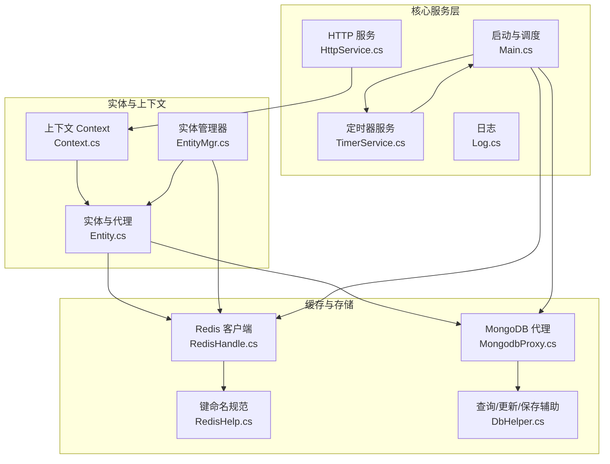
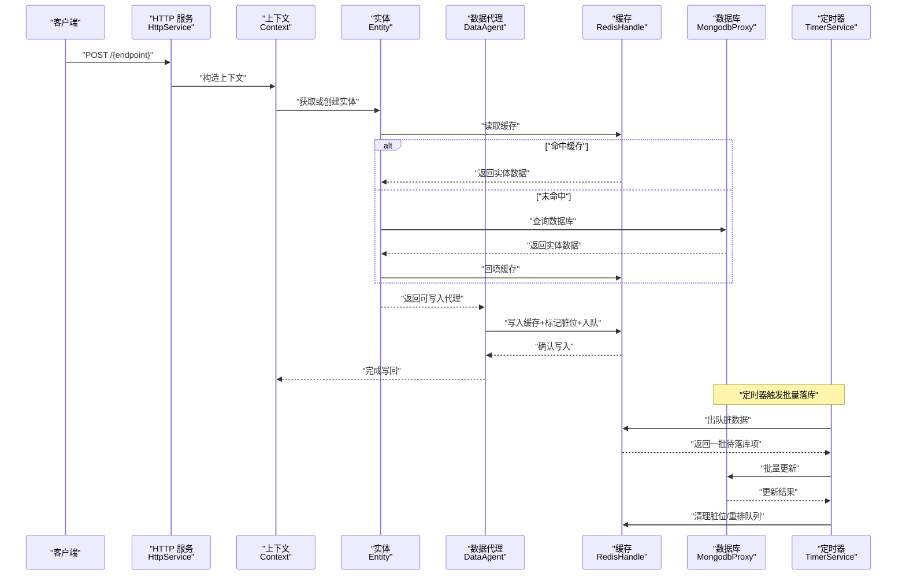
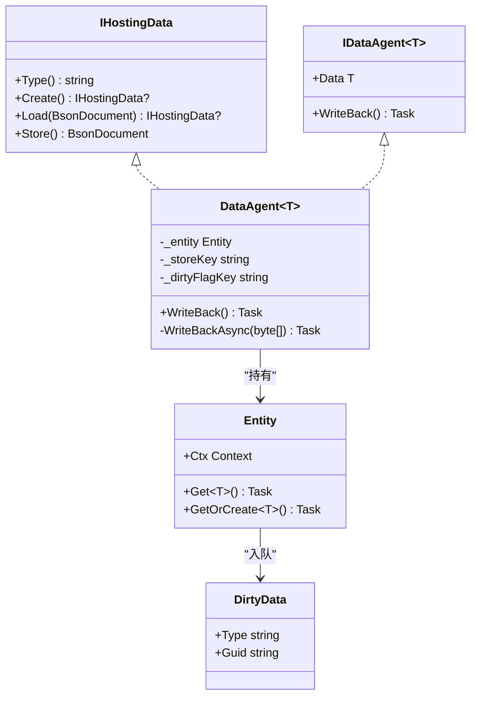
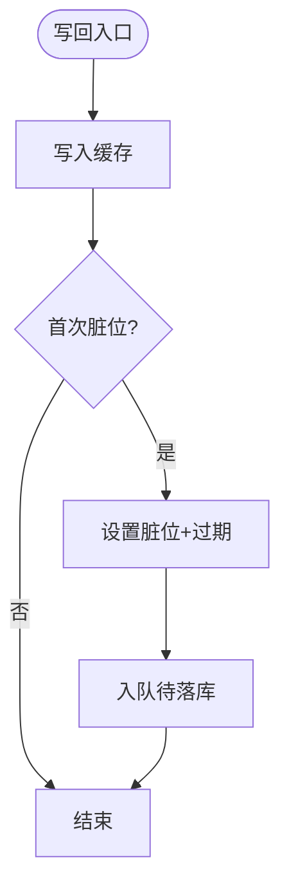
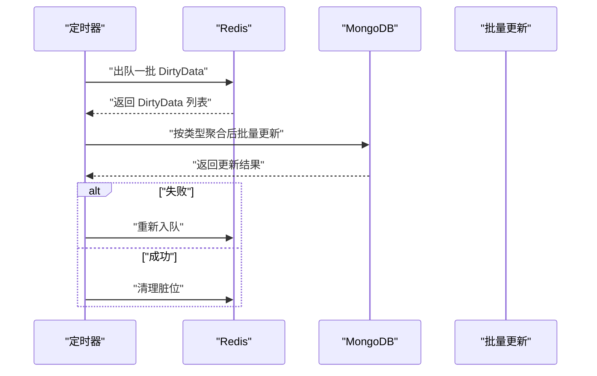
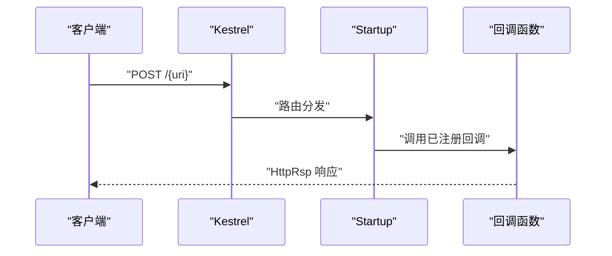
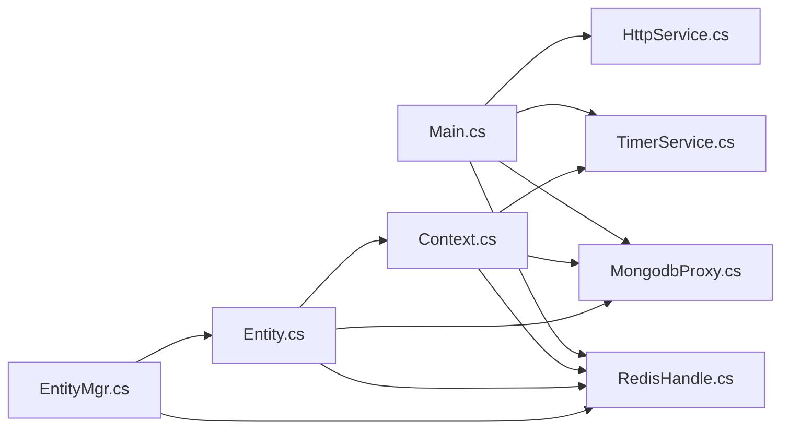

# 核心模块

<cite>
**本文引用的文件**
- [Main.cs](file://lgbf/hub/Main.cs)
- [Entity.cs](file://lgbf/hub/Entity.cs)
- [EntityMgr.cs](file://lgbf/hub/EntityMgr.cs)
- [RedisHelp.cs](file://lgbf/hub/RedisHelp.cs)
- [RedisHandle.cs](file://lgbf/hub/RedisHandle.cs)
- [MongodbProxy.cs](file://lgbf/hub/MongodbProxy.cs)
- [Context.cs](file://lgbf/hub/Context.cs)
- [HttpService.cs](file://lgbf/hub/HttpService.cs)
- [TimerService.cs](file://lgbf/hub/TimerService.cs)
- [Log.cs](file://lgbf/hub/Log.cs)
- [DbHelper.cs](file://lgbf/hub/DbHelper.cs)
- [hub.csproj](file://lgbf/hub/hub.csproj)
</cite>

## 目录
1. [简介](#简介)
2. [项目结构](#项目结构)
3. [核心组件](#核心组件)
4. [架构总览](#架构总览)
5. [详细组件分析](#详细组件分析)
6. [依赖关系分析](#依赖关系分析)
7. [性能考量](#性能考量)
8. [故障排查指南](#故障排查指南)
9. [结论](#结论)
10. [附录：API 参考与配置](#附录api-参考与配置)

## 简介
本文件面向 LGBF（轻量级游戏后端框架）的核心模块，系统化梳理实体管理、缓存管理、数据持久化与通信协议四层的设计与实现。文档重点解释各模块职责边界、接口定义、内部协作机制、模块间依赖与数据流，并提供可操作的使用路径与最佳实践建议，帮助读者快速理解并扩展该后端服务。

## 项目结构
- 顶层采用分层组织：lgbf/hub 为核心服务层，包含 HTTP 入口、实体管理、缓存与数据库代理、计时器与日志等。
- 通过 Redis 提供高速缓存与分布式锁；通过 MongoDB 实现持久化存储；通过 Kestrel 承载 HTTP 协议入口；通过定时器驱动周期性任务（如批量落库）。
- 项目使用 .NET 10，依赖 Google.Protobuf、MongoDB.Driver、StackExchange.Redis 等包。

图表来源
- [Main.cs:1-159](file://lgbf/hub/Main.cs#L1-L159)
- [Context.cs:1-27](file://lgbf/hub/Context.cs#L1-L27)
- [Entity.cs:1-154](file://lgbf/hub/Entity.cs#L1-L154)
- [EntityMgr.cs:1-128](file://lgbf/hub/EntityMgr.cs#L1-L128)
- [RedisHandle.cs:1-544](file://lgbf/hub/RedisHandle.cs#L1-L544)
- [RedisHelp.cs:1-20](file://lgbf/hub/RedisHelp.cs#L1-L20)
- [MongodbProxy.cs:1-221](file://lgbf/hub/MongodbProxy.cs#L1-L221)
- [DbHelper.cs:1-311](file://lgbf/hub/DbHelper.cs#L1-L311)
- [HttpService.cs:1-182](file://lgbf/hub/HttpService.cs#L1-L182)
- [TimerService.cs:1-126](file://lgbf/hub/TimerService.cs#L1-L126)
- [Log.cs:1-113](file://lgbf/hub/Log.cs#L1-L113)

章节来源
- [hub.csproj:1-20](file://lgbf/hub/hub.csproj#L1-L20)

## 核心组件
- 启动与调度（Main）
  - 初始化 Redis、MongoDB 连接，注册周期性落库任务，启动 HTTP 服务。
  - 负责脏数据批处理与幂等重试，确保最终一致。
- 实体管理（Entity/EntityMgr）
  - IHostingData 抽象实体数据模型；IDataAgent 提供写回接口；DataAgent 将内存态与缓存/持久化解耦。
  - Entity 提供 Get/GetOrCreate，优先读取缓存，缺失则从数据库加载并回填缓存。
  - EntityMgr 提供跨实体的分布式锁与并发控制，保障事务一致性。
- 缓存管理（RedisHandle/RedisHelp）
  - 面向高可用封装 Redis 操作：字符串、列表、有序集合、哈希、发布订阅、分布式锁。
  - 键命名规范集中于 RedisHelp，统一缓存键前缀与队列名。
- 数据持久化（MongodbProxy/DbHelper）
  - MongodbProxy 对 MongoDB Driver 做薄封装，支持单条/批量更新、查找修改、分页查询、索引创建等。
  - DbHelper 提供构建查询条件、更新语句与保存文档的辅助类，降低重复代码。
- 通信协议（HttpService）
  - 基于 Kestrel 的 HTTP 入口，支持动态注册路由回调、跨域头、请求体缓冲复用与统计日志。
- 计时器与日志（TimerService/Log）
  - TimerService 提供毫秒级轮询与多种时间粒度的调度；Log 提供文件滚动与分级输出。

章节来源
- [Main.cs:1-159](file://lgbf/hub/Main.cs#L1-L159)
- [Entity.cs:1-154](file://lgbf/hub/Entity.cs#L1-L154)
- [EntityMgr.cs:1-128](file://lgbf/hub/EntityMgr.cs#L1-L128)
- [RedisHandle.cs:1-544](file://lgbf/hub/RedisHandle.cs#L1-L544)
- [RedisHelp.cs:1-20](file://lgbf/hub/RedisHelp.cs#L1-L20)
- [MongodbProxy.cs:1-221](file://lgbf/hub/MongodbProxy.cs#L1-L221)
- [DbHelper.cs:1-311](file://lgbf/hub/DbHelper.cs#L1-L311)
- [HttpService.cs:1-182](file://lgbf/hub/HttpService.cs#L1-L182)
- [TimerService.cs:1-126](file://lgbf/hub/TimerService.cs#L1-L126)
- [Log.cs:1-113](file://lgbf/hub/Log.cs#L1-L113)

## 架构总览
下图展示从 HTTP 请求到实体读写的完整链路，以及后台批量落库流程。

图表来源
- [HttpService.cs:40-115](file://lgbf/hub/HttpService.cs#L40-L115)
- [Context.cs:4-26](file://lgbf/hub/Context.cs#L4-L26)
- [Entity.cs:94-153](file://lgbf/hub/Entity.cs#L94-L153)
- [RedisHandle.cs:84-136](file://lgbf/hub/RedisHandle.cs#L84-L136)
- [MongodbProxy.cs:102-120](file://lgbf/hub/MongodbProxy.cs#L102-L120)
- [TimerService.cs:68-96](file://lgbf/hub/TimerService.cs#L68-L96)
- [Main.cs:50-157](file://lgbf/hub/Main.cs#L50-L157)

## 详细组件分析

### 实体管理系统
- 设计要点
  - IHostingData 规范实体的类型标识、创建与序列化/反序列化接口；IDataAgent 统一写回契约。
  - DataAgent 将“内存态”与“持久化”解耦：写回时仅更新缓存与入队，不阻塞业务线程。
  - Entity.Get/GetOrCreate 采用“缓存优先、数据库兜底”的策略，减少数据库压力。
- 关键流程
  - 写回：SetData -> 标记脏位 -> 入队 -> 定时器批量落库。
  - 读取：先查缓存，未命中再查数据库并回填缓存。
- 并发与一致性
  - 多实体操作通过 EntityMgr 的分布式锁，按顺序加锁，避免写偏斜与死锁。
  - 锁续期线程在回调执行期间持续延长锁，异常时统一解锁。

图表来源
- [Entity.cs:4-29](file://lgbf/hub/Entity.cs#L4-L29)
- [Entity.cs:37-92](file://lgbf/hub/Entity.cs#L37-L92)
- [Entity.cs:94-153](file://lgbf/hub/Entity.cs#L94-L153)

章节来源
- [Entity.cs:1-154](file://lgbf/hub/Entity.cs#L1-L154)
- [EntityMgr.cs:1-128](file://lgbf/hub/EntityMgr.cs#L1-L128)

### 缓存管理层
- 能力范围
  - 字符串/二进制读写、条件写入、过期设置。
  - 列表左推右弹、发布订阅、分布式锁（获取/续期/释放）。
  - 有序集合增减分、查询排名与分数、区间带分查询。
  - 哈希字段读写。
- 异常恢复
  - 所有 Redis 操作在超时异常时自动尝试恢复连接并指数退避重试。
- 键命名
  - 统一前缀：实体锁、实体存储、脏标志、排行榜键等，便于运维与排障。

图表来源
- [RedisHandle.cs:84-136](file://lgbf/hub/RedisHandle.cs#L84-L136)
- [RedisHandle.cs:257-303](file://lgbf/hub/RedisHandle.cs#L257-L303)
- [RedisHelp.cs:4-19](file://lgbf/hub/RedisHelp.cs#L4-L19)

章节来源
- [RedisHandle.cs:1-544](file://lgbf/hub/RedisHandle.cs#L1-L544)
- [RedisHelp.cs:1-20](file://lgbf/hub/RedisHelp.cs#L1-L20)

### 数据持久化层
- 能力范围
  - 插入、更新、批量更新、查找修改、分页查询、计数、删除、自增 Guid。
  - 支持索引创建、排序与投影。
- 使用模式
  - 写回阶段：将缓存中的 BSON 文档转换为更新语句，按实体类型聚合后批量写入。
  - 读取阶段：优先缓存，未命中查询数据库并回填缓存。
- 错误处理
  - 批量写入失败时，将脏数据重新入队，等待下次重试。

图表来源
- [Main.cs:81-146](file://lgbf/hub/Main.cs#L81-L146)
- [MongodbProxy.cs:102-120](file://lgbf/hub/MongodbProxy.cs#L102-L120)

章节来源
- [MongodbProxy.cs:1-221](file://lgbf/hub/MongodbProxy.cs#L1-L221)
- [DbHelper.cs:1-311](file://lgbf/hub/DbHelper.cs#L1-L311)

### 通信协议层（HTTP）
- 能力范围
  - 动态注册路由回调，统一处理 POST 与 OPTIONS。
  - 自动注入跨域响应头，支持 JSON 响应。
  - 请求体缓冲池复用，降低 GC 压力；周期性连接统计日志。
- 典型用法
  - 在业务模块中调用 HttpService.Post 注册 endpoint -> 回调函数，回调内通过 HttpRsp 返回数据。

图表来源
- [HttpService.cs:40-115](file://lgbf/hub/HttpService.cs#L40-L115)
- [HttpService.cs:117-182](file://lgbf/hub/HttpService.cs#L117-L182)

章节来源
- [HttpService.cs:1-182](file://lgbf/hub/HttpService.cs#L1-L182)

## 依赖关系分析
- 组件耦合
  - Main 作为全局入口，依赖 RedisHandle、MongodbProxy、TimerService、HttpService。
  - Entity/EntityMgr 依赖 Context，Context 持有 RedisHandle 与 MongodbProxy 的静态实例。
  - RedisHandle 与 MongodbProxy 分别封装第三方客户端，提供稳定 API。
- 外部依赖
  - Google.Protobuf：用于消息编解码（发布订阅等场景）。
  - MongoDB.Driver/Bson：文档存储与查询。
  - StackExchange.Redis：高性能缓存与分布式能力。
- 循环依赖
  - 无直接循环依赖；通过 Context 传递共享资源，避免强耦合。

图表来源
- [Main.cs:31-40](file://lgbf/hub/Main.cs#L31-L40)
- [Context.cs:4-26](file://lgbf/hub/Context.cs#L4-L26)
- [Entity.cs:94-153](file://lgbf/hub/Entity.cs#L94-L153)
- [EntityMgr.cs:44-126](file://lgbf/hub/EntityMgr.cs#L44-L126)
- [RedisHandle.cs:13-25](file://lgbf/hub/RedisHandle.cs#L13-L25)
- [MongodbProxy.cs:10-18](file://lgbf/hub/MongodbProxy.cs#L10-L18)

章节来源
- [hub.csproj:9-17](file://lgbf/hub/hub.csproj#L9-L17)

## 性能考量
- 缓存命中率
  - 通过 Entity.Get 的缓存优先策略与回填逻辑，显著降低数据库访问频次。
- 批量写回
  - Main 中按实体类型聚合更新，减少网络往返与写放大。
- 连接与资源
  - RedisHandle 对超时异常进行自动恢复与指数退避，避免雪崩。
  - HttpService 使用数组池复用请求体缓冲，降低内存分配。
- 并发控制
  - EntityMgr 的分布式锁与锁续期，避免高并发下的写冲突。
- 定时器节拍
  - TimerService 以固定轮询间隔触发，避免忙轮询；同时提供多种时间粒度调度。

## 故障排查指南
- 日志定位
  - 使用 Log 类按级别输出，结合时间戳与调用栈定位问题。
- 常见问题
  - Redis 超时：检查网络与连接池配置，关注 Recover 重试逻辑是否生效。
  - MongoDB 写入失败：查看批量更新返回值，确认脏队列是否回退重试。
  - HTTP 响应异常：检查回调函数是否抛出异常，关注请求体长度与跨域头。
- 排障步骤
  - 启用更细的日志级别，观察 SaveAsync/WriteBack/Redis 操作链路。
  - 核对 Redis 键空间与脏队列长度，确认是否存在堆积。
  - 检查实体类型与 Guid 生成逻辑，避免重复或冲突。

章节来源
- [Log.cs:1-113](file://lgbf/hub/Log.cs#L1-L113)
- [Main.cs:50-157](file://lgbf/hub/Main.cs#L50-L157)
- [RedisHandle.cs:27-34](file://lgbf/hub/RedisHandle.cs#L27-L34)
- [MongodbProxy.cs:102-120](file://lgbf/hub/MongodbProxy.cs#L102-L120)

## 结论
LGBF 核心模块通过清晰的分层与职责划分，实现了高性能、可扩展的游戏后端服务骨架。实体管理与缓存/持久化解耦、HTTP 入口与定时器协同、分布式锁保障一致性，共同构成稳定可靠的数据通路。遵循本文的最佳实践与扩展建议，可在保证性能的同时提升可维护性与可观测性。

## 附录：API 参考与配置

### 启动与调度（Main）
- 方法
  - Start(Config): 初始化 Redis/Mongo/HTTP，注册定时落库任务。
  - WaitClose(): 关闭 HTTP 服务。
- 关键行为
  - 定时器周期：默认 5 分钟；批大小：默认 64。
  - 写回幂等：重复入队与去重，避免重复写入。

章节来源
- [Main.cs:31-40](file://lgbf/hub/Main.cs#L31-L40)
- [Main.cs:50-157](file://lgbf/hub/Main.cs#L50-L157)

### 实体与代理（Entity/IDataAgent/DataAgent）
- 接口
  - IHostingData：类型标识、创建、加载、存储。
  - IDataAgent<T>：Data 属性与 WriteBack。
- 方法
  - Entity.Get/GetOrCreate：缓存优先、数据库兜底。
  - DataAgent.WriteBack：写入缓存、设置脏位、入队。

章节来源
- [Entity.cs:4-29](file://lgbf/hub/Entity.cs#L4-L29)
- [Entity.cs:94-153](file://lgbf/hub/Entity.cs#L94-L153)
- [Entity.cs:37-92](file://lgbf/hub/Entity.cs#L37-L92)

### 实体管理器（EntityMgr）
- 方法
  - CallLockAndGetEntity：多实体分布式锁、锁续期、回调执行。
- 参数
  - entityIdes：参与事务的实体 ID 列表。
  - callback：业务回调，接收自身与目标实体数组。

章节来源
- [EntityMgr.cs:44-126](file://lgbf/hub/EntityMgr.cs#L44-L126)

### 缓存客户端（RedisHandle）
- 主要能力
  - 字符串/二进制：SetData/GetData/DelData/Expire。
  - 条件写入：SetDataIfNotExists。
  - 列表：PushList/PopList。
  - 发布订阅：Publish/Subscribe。
  - 分布式锁：TryLock/LockExtend/UnLock。
  - 有序集合：SortedSetAdd/Increment/Rank/Score/Range。
  - 哈希：HashSet/HashGet。
- 异常处理
  - RedisTimeoutException 自动恢复与指数退避。

章节来源
- [RedisHandle.cs:84-136](file://lgbf/hub/RedisHandle.cs#L84-L136)
- [RedisHandle.cs:257-303](file://lgbf/hub/RedisHandle.cs#L257-L303)
- [RedisHandle.cs:305-394](file://lgbf/hub/RedisHandle.cs#L305-L394)
- [RedisHandle.cs:396-543](file://lgbf/hub/RedisHandle.cs#L396-L543)

### 键命名规范（RedisHelp）
- 关键键
  - 实体锁、实体存储、脏标志、队列名、排行榜键等。

章节来源
- [RedisHelp.cs:4-19](file://lgbf/hub/RedisHelp.cs#L4-L19)

### 数据库代理（MongodbProxy）
- 主要能力
  - Save/Update/BulkUpdate/FindAndModify/Find/Count/Remove/GetGuid。
  - CreateIndex。
- 辅助类
  - DBQueryHelper/UpdateDataHelper/SaveDataHelper 构建查询与更新。

章节来源
- [MongodbProxy.cs:76-120](file://lgbf/hub/MongodbProxy.cs#L76-L120)
- [MongodbProxy.cs:143-220](file://lgbf/hub/MongodbProxy.cs#L143-L220)
- [DbHelper.cs:160-311](file://lgbf/hub/DbHelper.cs#L160-L311)

### 上下文（Context）
- 字段
  - Guid、Redis、Mongo、Timer。
- 工具
  - New：基于 Main 静态实例创建。
  - From：派生新上下文（切换 Guid）。

章节来源
- [Context.cs:4-26](file://lgbf/hub/Context.cs#L4-L26)

### HTTP 服务（HttpService）
- 能力
  - Post 注册回调、TryGetPostCallback 获取回调。
  - BuildCrossHeaders：统一跨域头。
  - Run/Close：启动与关闭。
- 内部
  - Startup：路由分发、OPTIONS 处理、请求体读取与统计。

章节来源
- [HttpService.cs:117-182](file://lgbf/hub/HttpService.cs#L117-L182)
- [HttpService.cs:40-115](file://lgbf/hub/HttpService.cs#L40-L115)

### 定时器服务（TimerService）
- 能力
  - 轮询 Tick、日/周/月/循环时间点调度。
  - Poll/PollTickHandleImpl 等内部轮询逻辑。

章节来源
- [TimerService.cs:68-125](file://lgbf/hub/TimerService.cs#L68-L125)

### 日志（Log）
- 能力
  - Trace/Debug/Info/Warn/Err 输出。
  - 文件滚动与路径/文件名配置。

章节来源
- [Log.cs:19-113](file://lgbf/hub/Log.cs#L19-L113)

### 项目依赖（hub.csproj）
- 包
  - Google.Protobuf、MongoDB.Bson、MongoDB.Driver、Newtonsoft.Json、StackExchange.Redis。

章节来源
- [hub.csproj:9-17](file://lgbf/hub/hub.csproj#L9-L17)