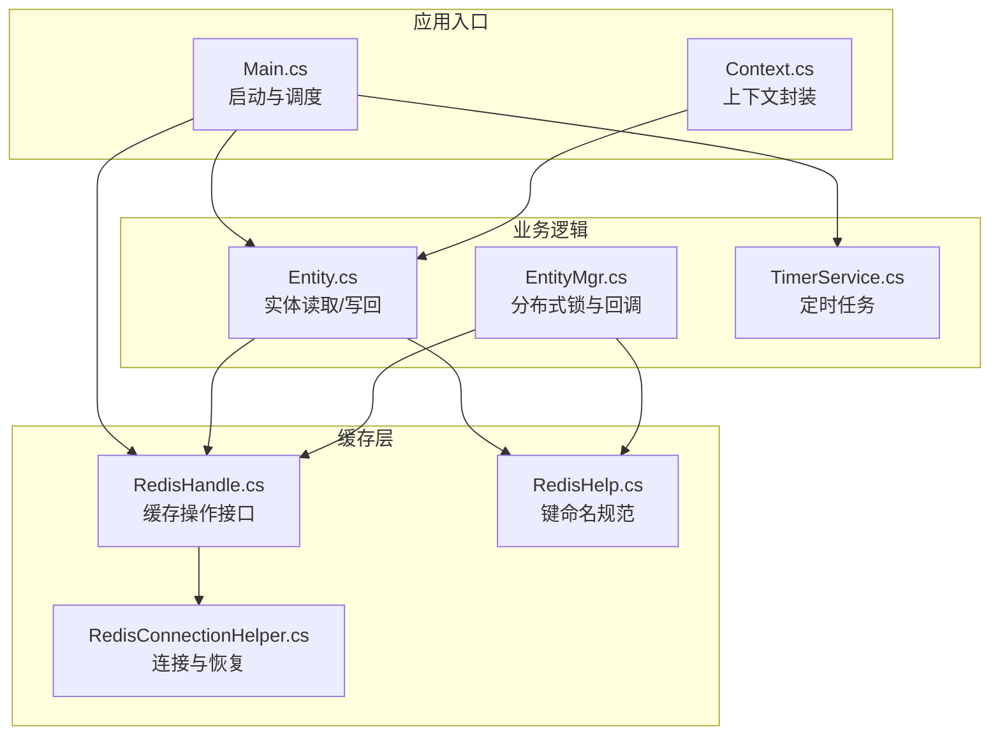
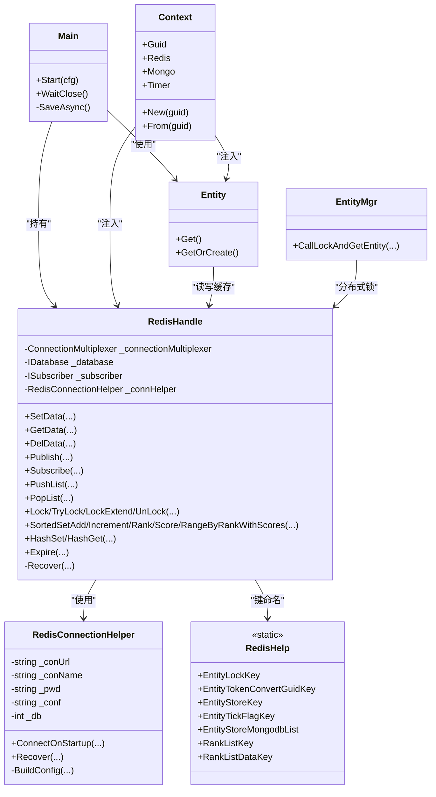
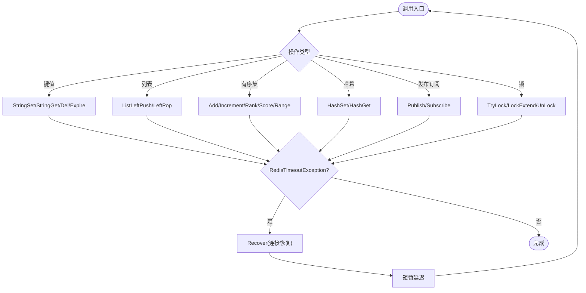
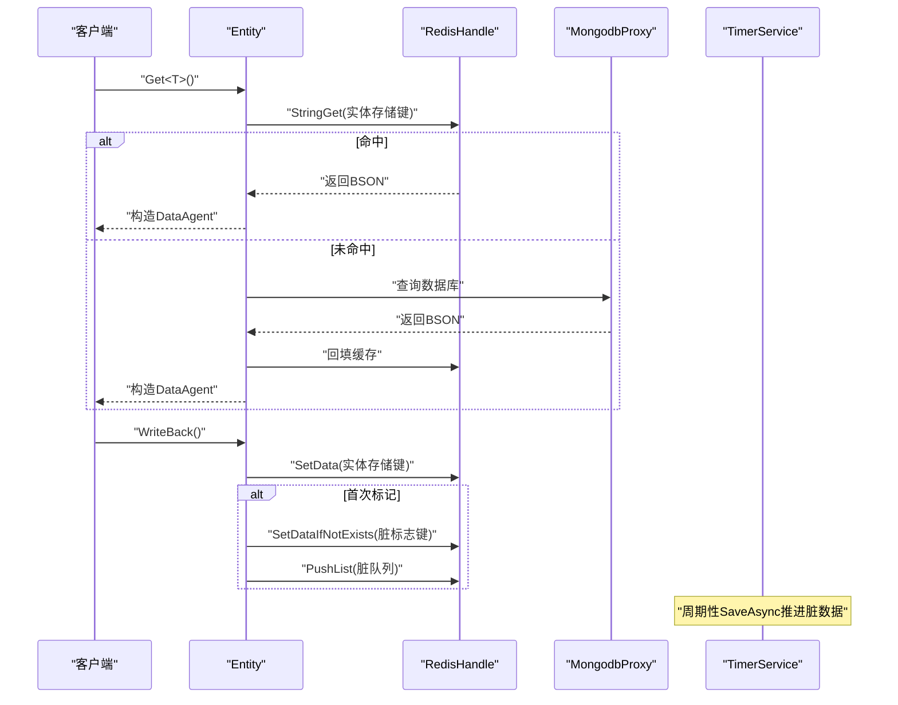
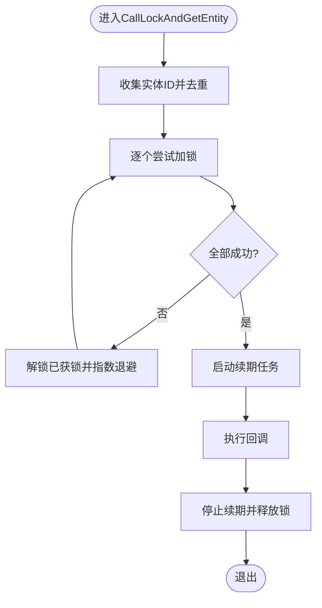
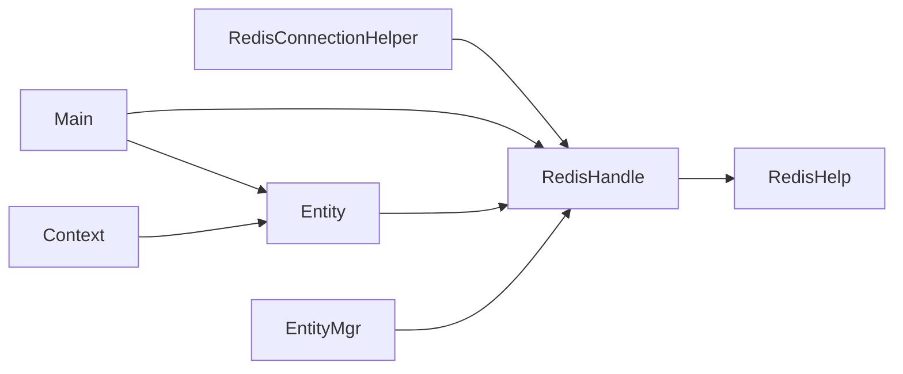

# 缓存管理层

<cite>
**本文引用的文件**
- [RedisConnectionHelper.cs](file://lgbf/hub/RedisConnectionHelper.cs)
- [RedisHandle.cs](file://lgbf/hub/RedisHandle.cs)
- [RedisHelp.cs](file://lgbf/hub/RedisHelp.cs)
- [Main.cs](file://lgbf/hub/Main.cs)
- [Context.cs](file://lgbf/hub/Context.cs)
- [EntityMgr.cs](file://lgbf/hub/EntityMgr.cs)
- [Entity.cs](file://lgbf/hub/Entity.cs)
- [TimerService.cs](file://lgbf/hub/TimerService.cs)
- [Log.cs](file://lgbf/hub/Log.cs)
</cite>

## 目录
1. [简介](#简介)
2. [项目结构](#项目结构)
3. [核心组件](#核心组件)
4. [架构总览](#架构总览)
5. [详细组件分析](#详细组件分析)
6. [依赖关系分析](#依赖关系分析)
7. [性能考量](#性能考量)
8. [故障排查指南](#故障排查指南)
9. [结论](#结论)
10. [附录](#附录)

## 简介
本文件系统性梳理并文档化了仓库中的缓存管理层，重点覆盖以下方面：
- Redis 连接管理：连接池配置、连接生命周期与故障恢复策略
- 数据操作接口：键值存储、列表操作、集合（有序集、哈希）管理
- 键命名规范与数据结构设计：实体存储、脏数据标记、队列管理等
- 一致性保障：读写策略、过期时间、并发控制（分布式锁）
- 性能优化：批量写入、异步非阻塞、重试退避、内存与序列化
- 部署建议：单机、集群、哨兵与持久化最佳实践
- 使用示例与常见问题

## 项目结构
缓存管理层位于 lgbf/hub 目录，围绕 RedisHandle 提供统一的缓存能力，并通过 RedisConnectionHelper 负责连接建立与恢复；RedisHelp 定义键命名规范；Main/Context/Entity/EntityMgr/TimerService 协同实现实体的读取、写回、脏数据队列与分布式锁。



图表来源
- [Main.cs:31-40](file://lgbf/hub/Main.cs#L31-L40)
- [Context.cs:11-20](file://lgbf/hub/Context.cs#L11-L20)
- [RedisHandle.cs:21-25](file://lgbf/hub/RedisHandle.cs#L21-L25)
- [RedisConnectionHelper.cs:35-54](file://lgbf/hub/RedisConnectionHelper.cs#L35-L54)
- [RedisHelp.cs:6-19](file://lgbf/hub/RedisHelp.cs#L6-L19)
- [Entity.cs:104-135](file://lgbf/hub/Entity.cs#L104-L135)
- [EntityMgr.cs:44-126](file://lgbf/hub/EntityMgr.cs#L44-L126)
- [TimerService.cs:68-96](file://lgbf/hub/TimerService.cs#L68-L96)

章节来源
- [Main.cs:31-40](file://lgbf/hub/Main.cs#L31-L40)
- [Context.cs:11-20](file://lgbf/hub/Context.cs#L11-L20)
- [RedisHandle.cs:21-25](file://lgbf/hub/RedisHandle.cs#L21-L25)
- [RedisConnectionHelper.cs:35-54](file://lgbf/hub/RedisConnectionHelper.cs#L35-L54)
- [RedisHelp.cs:6-19](file://lgbf/hub/RedisHelp.cs#L6-L19)
- [Entity.cs:104-135](file://lgbf/hub/Entity.cs#L104-L135)
- [EntityMgr.cs:44-126](file://lgbf/hub/EntityMgr.cs#L44-L126)
- [TimerService.cs:68-96](file://lgbf/hub/TimerService.cs#L68-L96)

## 核心组件
- RedisConnectionHelper：负责连接字符串构建、初始连接、异常时的恢复流程与并发保护
- RedisHandle：面向业务的缓存操作封装，提供键值、列表、有序集、哈希、发布订阅、分布式锁等接口
- RedisHelp：集中定义键命名模板，确保键空间清晰、可维护
- Main/Context：应用启动与上下文传递，贯穿实体读取与写回
- Entity/EntityMgr：实体数据的读取、写回、脏数据队列推进与分布式锁
- TimerService：周期性触发保存任务，驱动脏数据落盘

章节来源
- [RedisConnectionHelper.cs:6-33](file://lgbf/hub/RedisConnectionHelper.cs#L6-L33)
- [RedisHandle.cs:13-34](file://lgbf/hub/RedisHandle.cs#L13-L34)
- [RedisHelp.cs:4-19](file://lgbf/hub/RedisHelp.cs#L4-L19)
- [Main.cs:18-26](file://lgbf/hub/Main.cs#L18-L26)
- [Context.cs:4-20](file://lgbf/hub/Context.cs#L4-L20)
- [Entity.cs:37-92](file://lgbf/hub/Entity.cs#L37-L92)
- [EntityMgr.cs:9-18](file://lgbf/hub/EntityMgr.cs#L9-L18)
- [TimerService.cs:7-35](file://lgbf/hub/TimerService.cs#L7-L35)

## 架构总览
缓存管理层采用“连接管理 + 操作封装 + 业务集成”的分层设计。连接管理独立于业务调用，操作封装屏蔽底层异常与重试细节，业务通过上下文访问缓存与数据库代理。



图表来源
- [RedisConnectionHelper.cs:6-33](file://lgbf/hub/RedisConnectionHelper.cs#L6-L33)
- [RedisHandle.cs:13-34](file://lgbf/hub/RedisHandle.cs#L13-L34)
- [RedisHelp.cs:4-19](file://lgbf/hub/RedisHelp.cs#L4-L19)
- [Main.cs:18-26](file://lgbf/hub/Main.cs#L18-L26)
- [Context.cs:4-20](file://lgbf/hub/Context.cs#L4-L20)
- [Entity.cs:94-153](file://lgbf/hub/Entity.cs#L94-L153)
- [EntityMgr.cs:44-126](file://lgbf/hub/EntityMgr.cs#L44-L126)

## 详细组件分析

### 连接管理与恢复机制
- 连接参数：支持密码、连接重试次数、超时、keepAlive、DNS解析与别名
- 初始连接：启动时建立连接、选择DB、获取数据库与订阅者实例
- 异常恢复：捕获连接异常后关闭旧连接，按指数退避重连，最多尝试固定次数；并发恢复通过互斥与事件通知避免重复恢复
- 恢复后回调：成功恢复后触发回调以重建订阅或其它依赖

```mermaid
sequenceDiagram
participant App as "应用"
participant RH as "RedisHandle"
participant RCH as "RedisConnectionHelper"
participant CM as "ConnectionMultiplexer"
participant DB as "IDatabase"
App->>RH : "构造并初始化"
RH->>RCH : "ConnectOnStartup()"
RCH->>CM : "Connect(配置)"
CM-->>RCH : "返回连接实例"
RCH->>DB : "GetDatabase(db)"
RCH-->>RH : "返回DB/Subscriber"
Note over RH,RCH : "运行中发生超时/断开"
RH->>RCH : "Recover(异常, 回调)"
RCH->>CM : "Close()"
loop 最多N次
RCH->>CM : "Connect(配置)"
alt 成功
RCH->>DB : "GetDatabase(db)"
RCH-->>RH : "恢复成功"
RCH->>RH : "afterRecover()"
exit
else 失败
RCH->>RCH : "等待/指数退避"
end
end
RCH-->>RH : "恢复失败(抛出异常)"
```

图表来源
- [RedisHandle.cs:21-34](file://lgbf/hub/RedisHandle.cs#L21-L34)
- [RedisConnectionHelper.cs:35-54](file://lgbf/hub/RedisConnectionHelper.cs#L35-L54)
- [RedisConnectionHelper.cs:56-127](file://lgbf/hub/RedisConnectionHelper.cs#L56-L127)

章节来源
- [RedisConnectionHelper.cs:26-33](file://lgbf/hub/RedisConnectionHelper.cs#L26-L33)
- [RedisConnectionHelper.cs:35-54](file://lgbf/hub/RedisConnectionHelper.cs#L35-L54)
- [RedisConnectionHelper.cs:56-127](file://lgbf/hub/RedisConnectionHelper.cs#L56-L127)
- [RedisHandle.cs:27-34](file://lgbf/hub/RedisHandle.cs#L27-L34)

### 数据操作接口设计
- 键值存储：字符串/二进制设置与获取，支持过期时间；条件设置（仅当键不存在时）
- 列表操作：左压入、左弹出；用于脏数据队列
- 有序集合：添加成员与分数、增量、排名查询、分数查询、按排名带分数范围查询
- 哈希：字段设置与读取
- 发布/订阅：消息封装为字节数组并通过通道发布
- 分布式锁：尝试加锁、扩展、释放；内部实现指数退避重试
- 过期控制：对键设置过期时间



图表来源
- [RedisHandle.cs:36-109](file://lgbf/hub/RedisHandle.cs#L36-L109)
- [RedisHandle.cs:159-174](file://lgbf/hub/RedisHandle.cs#L159-L174)
- [RedisHandle.cs:176-195](file://lgbf/hub/RedisHandle.cs#L176-L195)
- [RedisHandle.cs:257-303](file://lgbf/hub/RedisHandle.cs#L257-L303)
- [RedisHandle.cs:396-499](file://lgbf/hub/RedisHandle.cs#L396-L499)
- [RedisHandle.cs:501-542](file://lgbf/hub/RedisHandle.cs#L501-L542)
- [RedisHandle.cs:197-223](file://lgbf/hub/RedisHandle.cs#L197-L223)
- [RedisHandle.cs:305-394](file://lgbf/hub/RedisHandle.cs#L305-L394)
- [RedisHandle.cs:36-54](file://lgbf/hub/RedisHandle.cs#L36-L54)

章节来源
- [RedisHandle.cs:36-109](file://lgbf/hub/RedisHandle.cs#L36-L109)
- [RedisHandle.cs:159-174](file://lgbf/hub/RedisHandle.cs#L159-L174)
- [RedisHandle.cs:176-195](file://lgbf/hub/RedisHandle.cs#L176-L195)
- [RedisHandle.cs:257-303](file://lgbf/hub/RedisHandle.cs#L257-L303)
- [RedisHandle.cs:396-499](file://lgbf/hub/RedisHandle.cs#L396-L499)
- [RedisHandle.cs:501-542](file://lgbf/hub/RedisHandle.cs#L501-L542)
- [RedisHandle.cs:197-223](file://lgbf/hub/RedisHandle.cs#L197-L223)
- [RedisHandle.cs:305-394](file://lgbf/hub/RedisHandle.cs#L305-L394)

### 键命名规范与数据结构设计
- 实体存储键：按类型与GUID组织，便于按类型聚合与快速定位
- 实体锁键：基于实体ID的分布式锁，避免并发写冲突
- 脏数据标记键：标记某实体存在未落盘变更，配合过期时间防止长期占用
- 脏数据队列键：先进先出推进脏数据到数据库
- 排行榜键：按维度划分排行榜与数据键

章节来源
- [RedisHelp.cs:6-19](file://lgbf/hub/RedisHelp.cs#L6-L19)

### 一致性保障机制
- 读写策略：优先从缓存读取，未命中则从数据库加载并回填缓存；写回时先写缓存，再标记脏数据并入队
- 过期时间：脏标志键设置过期，避免无限堆积；实体键不过期，由写回流程更新
- 并发控制：分布式锁保护关键路径，锁期内定期续期；锁粒度为一组实体ID，减少争用



图表来源
- [Entity.cs:104-135](file://lgbf/hub/Entity.cs#L104-L135)
- [Entity.cs:58-91](file://lgbf/hub/Entity.cs#L58-L91)
- [Main.cs:50-157](file://lgbf/hub/Main.cs#L50-L157)
- [RedisHandle.cs:84-109](file://lgbf/hub/RedisHandle.cs#L84-L109)
- [RedisHandle.cs:111-131](file://lgbf/hub/RedisHandle.cs#L111-L131)
- [RedisHandle.cs:257-276](file://lgbf/hub/RedisHandle.cs#L257-L276)

章节来源
- [Entity.cs:104-135](file://lgbf/hub/Entity.cs#L104-L135)
- [Entity.cs:58-91](file://lgbf/hub/Entity.cs#L58-L91)
- [Main.cs:50-157](file://lgbf/hub/Main.cs#L50-L157)
- [RedisHandle.cs:84-109](file://lgbf/hub/RedisHandle.cs#L84-L109)
- [RedisHandle.cs:111-131](file://lgbf/hub/RedisHandle.cs#L111-L131)
- [RedisHandle.cs:257-276](file://lgbf/hub/RedisHandle.cs#L257-L276)

### 分布式锁与锁续期
- 加锁：为每个实体生成唯一token，尝试加锁；任一失败则整体回滚并指数退避重试
- 续期：在回调执行期间，定期延长锁有效期，避免长时间持有导致死锁
- 解锁：无论成功与否，最终释放所有已持有的锁



图表来源
- [EntityMgr.cs:44-126](file://lgbf/hub/EntityMgr.cs#L44-L126)

章节来源
- [EntityMgr.cs:9-18](file://lgbf/hub/EntityMgr.cs#L9-L18)
- [EntityMgr.cs:20-42](file://lgbf/hub/EntityMgr.cs#L20-L42)
- [EntityMgr.cs:44-126](file://lgbf/hub/EntityMgr.cs#L44-L126)

## 依赖关系分析
- RedisHandle 依赖 RedisConnectionHelper 提供连接与恢复
- Main 启动时创建 RedisHandle 与数据库代理，并注册定时保存任务
- Context 将 Redis/Mongo/Timer 注入到业务实体中
- Entity 通过 RedisHandle 读写缓存，必要时回填数据库
- EntityMgr 通过 RedisHandle 获取分布式锁，协调多个实体的并发访问



图表来源
- [RedisHandle.cs:19-34](file://lgbf/hub/RedisHandle.cs#L19-L34)
- [Main.cs:33-34](file://lgbf/hub/Main.cs#L33-L34)
- [Context.cs:16-18](file://lgbf/hub/Context.cs#L16-L18)
- [Entity.cs:62-67](file://lgbf/hub/Entity.cs#L62-L67)
- [EntityMgr.cs:63-67](file://lgbf/hub/EntityMgr.cs#L63-L67)
- [RedisHelp.cs:6-19](file://lgbf/hub/RedisHelp.cs#L6-L19)

章节来源
- [RedisHandle.cs:19-34](file://lgbf/hub/RedisHandle.cs#L19-L34)
- [Main.cs:33-34](file://lgbf/hub/Main.cs#L33-L34)
- [Context.cs:16-18](file://lgbf/hub/Context.cs#L16-L18)
- [Entity.cs:62-67](file://lgbf/hub/Entity.cs#L62-L67)
- [EntityMgr.cs:63-67](file://lgbf/hub/EntityMgr.cs#L63-L67)
- [RedisHelp.cs:6-19](file://lgbf/hub/RedisHelp.cs#L6-L19)

## 性能考量
- 异步非阻塞：所有缓存操作均使用异步API，避免阻塞线程
- 批量推进：定时任务按批次从脏队列出队，减少频繁IO
- 序列化与内存：实体以BSON形式存储，JSON序列化用于复杂对象；注意对象大小与序列化成本
- 重试与退避：超时异常时进行短暂延迟与指数退避，降低抖动
- 锁粒度与续期：合理设置锁超时与续期间隔，避免长事务导致锁竞争
- 过期策略：脏标志键设置过期，防止脏数据堆积；实体键不过期，由写回更新

## 故障排查指南
- 连接失败
  - 现象：启动时报连接异常或恢复失败
  - 排查：检查连接URL、密码、网络连通性；查看日志输出
  - 参考
    - [RedisConnectionHelper.cs:48-53](file://lgbf/hub/RedisConnectionHelper.cs#L48-L53)
    - [RedisConnectionHelper.cs:93-99](file://lgbf/hub/RedisConnectionHelper.cs#L93-L99)
- 超时异常
  - 现象：操作抛出超时异常
  - 排查：确认网络延迟、Redis负载；检查恢复流程是否生效
  - 参考
    - [RedisHandle.cs:48-52](file://lgbf/hub/RedisHandle.cs#L48-L52)
    - [RedisHandle.cs:151-155](file://lgbf/hub/RedisHandle.cs#L151-L155)
- 写回失败
  - 现象：实体写回失败或脏队列入队失败
  - 排查：确认缓存可用性、键空间是否正确；检查日志错误
  - 参考
    - [Entity.cs:66-67](file://lgbf/hub/Entity.cs#L66-L67)
    - [Entity.cs:82-84](file://lgbf/hub/Entity.cs#L82-L84)
- 锁无法获取
  - 现象：加锁失败或续期失败
  - 排查：检查锁超时与续期间隔；确认是否存在长时间持有锁的任务
  - 参考
    - [EntityMgr.cs:64](file://lgbf/hub/EntityMgr.cs#L64)
    - [EntityMgr.cs:35](file://lgbf/hub/EntityMgr.cs#L35)
- 日志定位
  - 参考日志模块输出格式与级别
  - 参考
    - [Log.cs:55-58](file://lgbf/hub/Log.cs#L55-L58)
    - [Log.cs:60-101](file://lgbf/hub/Log.cs#L60-L101)

章节来源
- [RedisConnectionHelper.cs:48-53](file://lgbf/hub/RedisConnectionHelper.cs#L48-L53)
- [RedisConnectionHelper.cs:93-99](file://lgbf/hub/RedisConnectionHelper.cs#L93-L99)
- [RedisHandle.cs:48-52](file://lgbf/hub/RedisHandle.cs#L48-L52)
- [RedisHandle.cs:151-155](file://lgbf/hub/RedisHandle.cs#L151-L155)
- [Entity.cs:66-67](file://lgbf/hub/Entity.cs#L66-L67)
- [Entity.cs:82-84](file://lgbf/hub/Entity.cs#L82-L84)
- [EntityMgr.cs:64](file://lgbf/hub/EntityMgr.cs#L64)
- [EntityMgr.cs:35](file://lgbf/hub/EntityMgr.cs#L35)
- [Log.cs:55-58](file://lgbf/hub/Log.cs#L55-L58)
- [Log.cs:60-101](file://lgbf/hub/Log.cs#L60-L101)

## 结论
该缓存管理层以 RedisHandle 为核心，结合 RedisConnectionHelper 的稳健连接与恢复机制，实现了高可用、可扩展的缓存能力。通过明确的键命名规范、脏数据队列与分布式锁，有效保障了读写一致性与并发安全。配合定时任务的批量推进，兼顾了性能与可靠性。建议在生产环境中进一步完善监控与告警、连接池参数调优以及部署层面的高可用方案。

## 附录
- 使用示例（步骤说明）
  - 初始化：在应用启动时传入Redis地址与密码，创建 RedisHandle 实例
    - 参考
      - [Main.cs:33](file://lgbf/hub/Main.cs#L33)
      - [RedisHandle.cs:21-25](file://lgbf/hub/RedisHandle.cs#L21-L25)
  - 读取实体：通过 Entity.Get<T>() 从缓存读取，未命中则从数据库加载并回填
    - 参考
      - [Entity.cs:104-135](file://lgbf/hub/Entity.cs#L104-L135)
  - 写回实体：调用 DataAgent<T>.WriteBack() 先写缓存，再标记脏数据并入队
    - 参考
      - [Entity.cs:58-91](file://lgbf/hub/Entity.cs#L58-L91)
  - 获取分布式锁：使用 EntityMgr.CallLockAndGetEntity(...) 并行保护多个实体
    - 参考
      - [EntityMgr.cs:44-126](file://lgbf/hub/EntityMgr.cs#L44-L126)
  - 订阅与发布：通过 RedisHandle.Subscribe/Publish 在频道间通信
    - 参考
      - [RedisHandle.cs:225-255](file://lgbf/hub/RedisHandle.cs#L225-L255)
      - [RedisHandle.cs:197-223](file://lgbf/hub/RedisHandle.cs#L197-L223)
- 常见问题
  - 连接异常：检查连接参数与网络；观察恢复日志
    - 参考
      - [RedisConnectionHelper.cs:56-127](file://lgbf/hub/RedisConnectionHelper.cs#L56-L127)
  - 超时重试：确认退避策略与恢复流程；避免热点键造成抖动
    - 参考
      - [RedisHandle.cs:48-52](file://lgbf/hub/RedisHandle.cs#L48-L52)
  - 脏数据堆积：检查定时保存任务是否正常运行；关注脏队列长度
    - 参考
      - [Main.cs:50-157](file://lgbf/hub/Main.cs#L50-L157)
  - 锁竞争：调整锁超时与续期间隔；缩小锁粒度
    - 参考
      - [EntityMgr.cs:6-7](file://lgbf/hub/EntityMgr.cs#L6-L7)
      - [EntityMgr.cs:20-42](file://lgbf/hub/EntityMgr.cs#L20-L42)