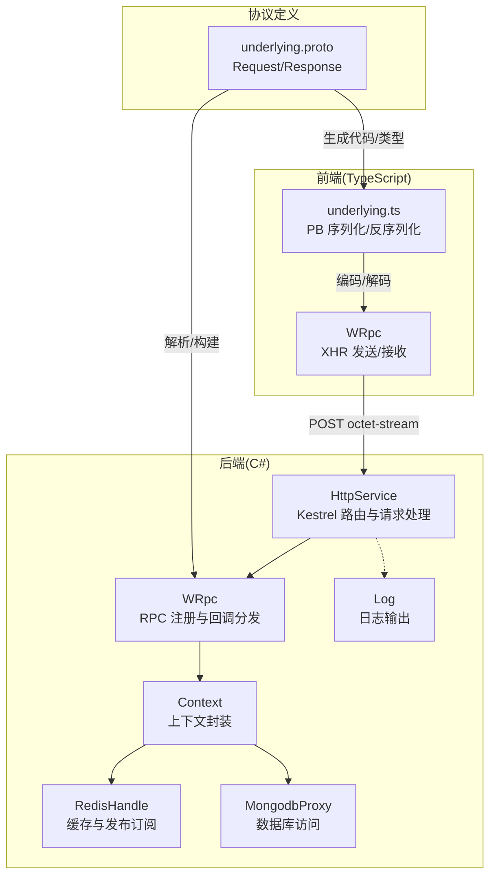
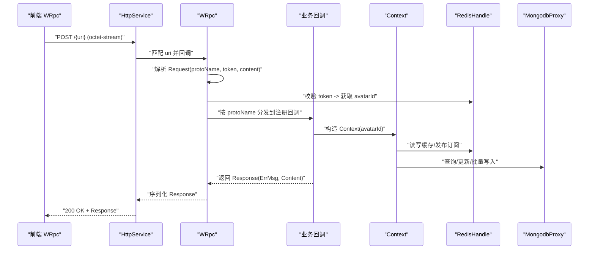
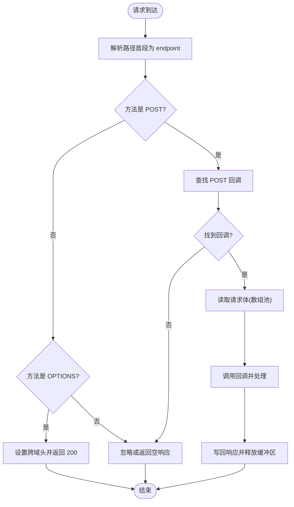
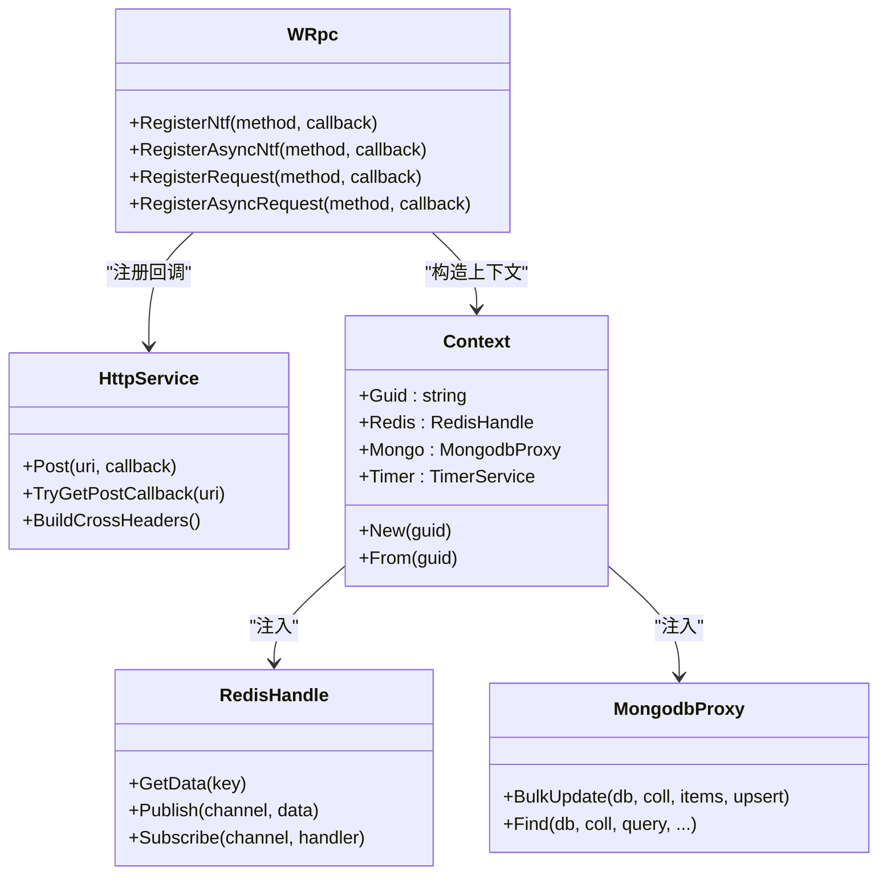
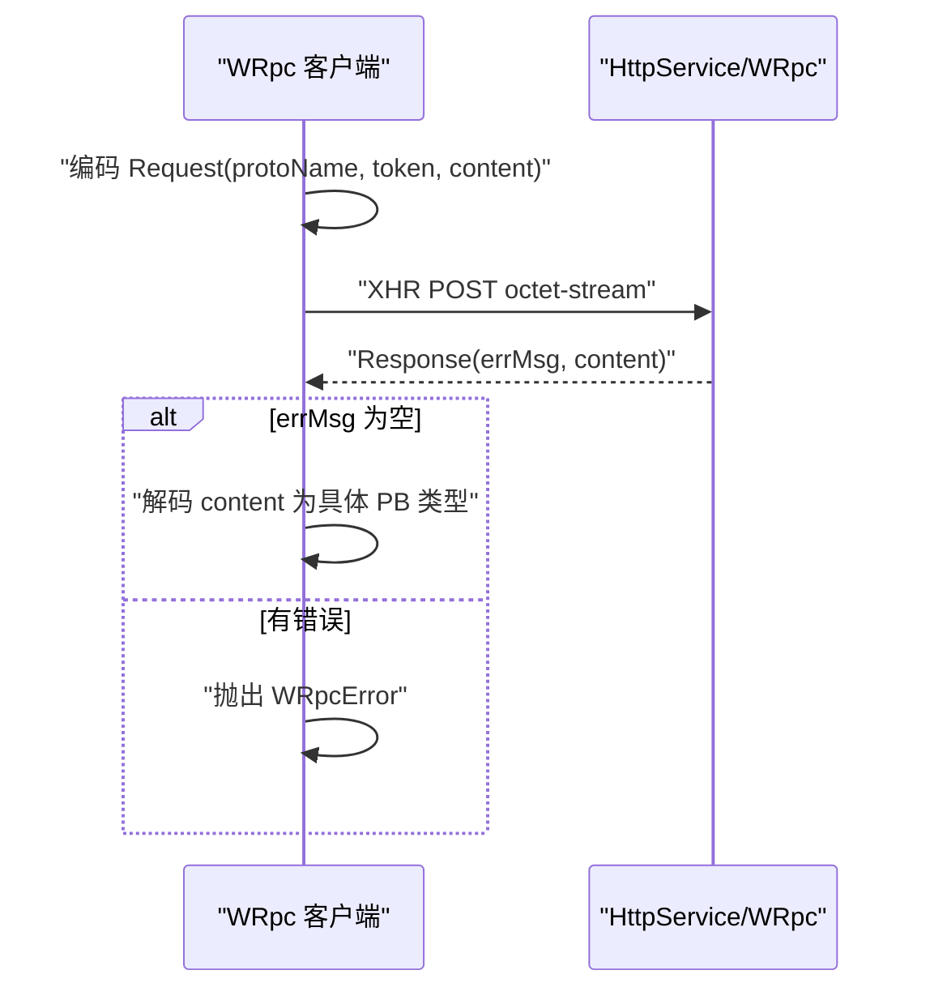
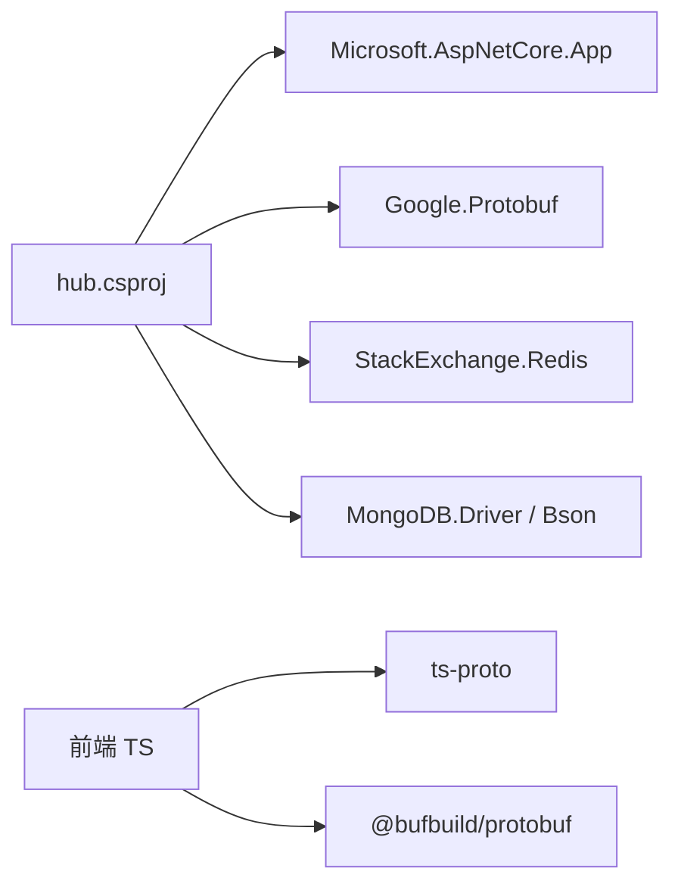

# 通信协议层

<cite>
**本文引用的文件**
- [HttpService.cs](file://lgbf/hub/HttpService.cs)
- [WRpc.cs](file://lgbf/hub/WRpc.cs)
- [underlying.proto](file://lgbf/underlying/underlying.proto)
- [Main.cs](file://lgbf/hub/Main.cs)
- [Context.cs](file://lgbf/hub/Context.cs)
- [RedisHandle.cs](file://lgbf/hub/RedisHandle.cs)
- [MongodbProxy.cs](file://lgbf/hub/MongodbProxy.cs)
- [hub.csproj](file://lgbf/hub/hub.csproj)
- [wrpc.ts](file://gem/ccc/assets/script/ServerSDK/wrpc.ts)
- [underlying.ts](file://gem/ccc/assets/script/ServerSDK/underlying.ts)
- [Log.cs](file://lgbf/hub/Log.cs)
</cite>

## 目录
1. [引言](#引言)
2. [项目结构](#项目结构)
3. [核心组件](#核心组件)
4. [架构总览](#架构总览)
5. [详细组件分析](#详细组件分析)
6. [依赖分析](#依赖分析)
7. [性能考虑](#性能考虑)
8. [故障排查指南](#故障排查指南)
9. [结论](#结论)
10. [附录](#附录)

## 引言
本文件系统性梳理通信协议层的设计与实现，覆盖以下主题：
- HTTP 服务实现：路由配置、中间件管道（以最小必要逻辑体现）、请求处理流程与跨域支持
- RPC 协议设计：消息格式、序列化/反序列化机制、回调注册与响应封装
- Protocol Buffers 协议定义：消息结构、字段类型与版本兼容性建议
- WRpc 客户端实现：连接管理、消息发送、响应处理与错误传播
- 通信安全机制：认证授权、数据加密与防重放思路
- 性能优化策略：连接复用、压缩算法、超时配置
- 错误处理与重试机制、网络异常的优雅降级
- API 使用示例与调试技巧

## 项目结构
通信协议层主要由三部分组成：
- 后端 HTTP 服务与 RPC 框架：C# 实现，基于 Kestrel 与 Google.Protobuf
- 前端 WRpc 客户端：TypeScript 实现，基于 XMLHttpRequest
- 协议定义：Protocol Buffers 文件，前后端共享

图表来源
- [HttpService.cs:50-114](file://lgbf/hub/HttpService.cs#L50-L114)
- [WRpc.cs:14-45](file://lgbf/hub/WRpc.cs#L14-L45)
- [Context.cs:11-26](file://lgbf/hub/Context.cs#L11-L26)
- [RedisHandle.cs:197-223](file://lgbf/hub/RedisHandle.cs#L197-L223)
- [MongodbProxy.cs:102-120](file://lgbf/hub/MongodbProxy.cs#L102-L120)
- [wrpc.ts:21-101](file://gem/ccc/assets/script/ServerSDK/wrpc.ts#L21-L101)
- [underlying.ts:103-148](file://gem/ccc/assets/script/ServerSDK/underlying.ts#L103-L148)
- [underlying.proto:3-12](file://lgbf/underlying/underlying.proto#L3-L12)

章节来源
- [HttpService.cs:50-114](file://lgbf/hub/HttpService.cs#L50-L114)
- [WRpc.cs:14-45](file://lgbf/hub/WRpc.cs#L14-L45)
- [Context.cs:11-26](file://lgbf/hub/Context.cs#L11-L26)
- [RedisHandle.cs:197-223](file://lgbf/hub/RedisHandle.cs#L197-L223)
- [MongodbProxy.cs:102-120](file://lgbf/hub/MongodbProxy.cs#L102-L120)
- [wrpc.ts:21-101](file://gem/ccc/assets/script/ServerSDK/wrpc.ts#L21-L101)
- [underlying.ts:103-148](file://gem/ccc/assets/script/ServerSDK/underlying.ts#L103-L148)
- [underlying.proto:3-12](file://lgbf/underlying/underlying.proto#L3-L12)

## 核心组件
- HTTP 服务与路由
  - 使用 Kestrel 承载 HTTP/1.1 与 HTTP/2，限制并发连接数与 Keep-Alive 超时
  - 路由通过请求路径首段作为 endpoint 匹配，POST 请求进入回调表，OPTIONS 预检返回跨域头
  - 请求体采用 ArrayBuffer 分片读取，使用数组池回收内存
- RPC 协议与 WRpc
  - Request/Response 为通用 RPC 消息载体，内容为任意 PB 消息字节流
  - WRpc 在构造时注册 URI 对应的 POST 回调，解析 Request，按 protoName 查找回调，鉴权通过后执行业务处理并统一返回 Response
- 协议定义
  - underlying.proto 定义了 Request/Response 的字段与类型，便于前后端共享
- 上下文与数据访问
  - Context 封装当前玩家标识与数据访问入口（Redis、Mongo、定时器）
  - RedisHandle 提供缓存、发布订阅、列表操作、分布式锁等能力
  - MongodbProxy 提供批量更新、查询、计数等数据库操作

章节来源
- [HttpService.cs:149-181](file://lgbf/hub/HttpService.cs#L149-L181)
- [HttpService.cs:64-84](file://lgbf/hub/HttpService.cs#L64-L84)
- [WRpc.cs:14-45](file://lgbf/hub/WRpc.cs#L14-L45)
- [WRpc.cs:47-153](file://lgbf/hub/WRpc.cs#L47-L153)
- [underlying.proto:3-12](file://lgbf/underlying/underlying.proto#L3-L12)
- [Context.cs:11-26](file://lgbf/hub/Context.cs#L11-L26)
- [RedisHandle.cs:197-223](file://lgbf/hub/RedisHandle.cs#L197-L223)
- [MongodbProxy.cs:102-120](file://lgbf/hub/MongodbProxy.cs#L102-L120)

## 架构总览
后端以 HttpService 为入口，WRpc 作为 RPC 入口点，Context 统一注入数据源，Redis/Mongo 提供持久化与缓存能力；前端通过 WRpc 客户端以 XHR 方式向后端发起 octet-stream 的 POST 请求。

图表来源
- [HttpService.cs:50-114](file://lgbf/hub/HttpService.cs#L50-L114)
- [WRpc.cs:14-45](file://lgbf/hub/WRpc.cs#L14-L45)
- [WRpc.cs:47-153](file://lgbf/hub/WRpc.cs#L47-L153)
- [Context.cs:11-26](file://lgbf/hub/Context.cs#L11-L26)
- [RedisHandle.cs:197-223](file://lgbf/hub/RedisHandle.cs#L197-L223)
- [MongodbProxy.cs:102-120](file://lgbf/hub/MongodbProxy.cs#L102-L120)

## 详细组件分析

### HTTP 服务与路由
- 路由配置
  - 通过请求路径首段作为 endpoint，映射到静态回调表
  - 支持 OPTIONS 预检，返回跨域头
- 中间件管道
  - 当前实现为最小必要逻辑：统计连接速率、读取请求体、调用回调、返回响应
  - 可扩展点：在 Configure 中插入自定义中间件（如鉴权、限流、压缩）
- 请求处理流程
  - 读取 Content-Length，按块读取请求体，使用数组池避免频繁分配
  - 调用回调后，根据状态码与头部返回响应
- 超时与统计
  - 记录每秒请求数，超过阈值记录告警

图表来源
- [HttpService.cs:50-114](file://lgbf/hub/HttpService.cs#L50-L114)
- [HttpService.cs:149-181](file://lgbf/hub/HttpService.cs#L149-L181)

章节来源
- [HttpService.cs:50-114](file://lgbf/hub/HttpService.cs#L50-L114)
- [HttpService.cs:149-181](file://lgbf/hub/HttpService.cs#L149-L181)

### RPC 协议设计与 WRpc
- 消息格式
  - Request：包含 protoName（方法名）、content（PB 序列化后的字节流）、token（鉴权令牌）
  - Response：包含 errMsg（错误信息）、content（PB 序列化后的字节流）
- 序列化与反序列化
  - 后端使用 Google.Protobuf 解析 Request，按 protoName 查找回调
  - 回调内部使用 MessageParser 解析 content 为具体 PB 类型
  - 返回时将结果序列化为 ByteString 或字符串
- 回调注册
  - 支持同步通知、异步通知、同步请求、异步请求四种模式
  - 统一返回 Response，确保前后端一致的错误处理语义
- 鉴权与上下文
  - 通过 token 查询 Redis 获取 avatarId，构造 Context 传递给回调
  - 回调可直接访问 RedisHandle 与 MongodbProxy

图表来源
- [WRpc.cs:47-153](file://lgbf/hub/WRpc.cs#L47-L153)
- [HttpService.cs:139-147](file://lgbf/hub/HttpService.cs#L139-L147)
- [Context.cs:11-26](file://lgbf/hub/Context.cs#L11-L26)
- [RedisHandle.cs:197-223](file://lgbf/hub/RedisHandle.cs#L197-L223)
- [MongodbProxy.cs:102-120](file://lgbf/hub/MongodbProxy.cs#L102-L120)

章节来源
- [WRpc.cs:14-45](file://lgbf/hub/WRpc.cs#L14-L45)
- [WRpc.cs:47-153](file://lgbf/hub/WRpc.cs#L47-L153)
- [underlying.proto:3-12](file://lgbf/underlying/underlying.proto#L3-L12)

### Protocol Buffers 协议定义
- 消息结构
  - Request：protoName（方法名）、content（字节流）、token（令牌）
  - Response：errMsg（错误信息）、content（字节流）
- 字段类型
  - 字符串用于方法名与错误信息
  - bytes 用于承载任意 PB 消息序列化后的二进制
- 版本兼容性
  - 新增可选字段（保留编号），避免破坏现有序列化
  - 不要修改既有字段编号
  - 保持 content 字段的通用性，便于承载不同消息类型

章节来源
- [underlying.proto:3-12](file://lgbf/underlying/underlying.proto#L3-L12)

### WRpc 客户端实现（前端 TypeScript）
- 连接管理
  - 通过构造函数传入 uri、token、timeoutMs
  - 使用 XMLHttpRequest 发送 POST 请求，设置 Content-Type 为 application/octet-stream
- 消息发送
  - 将 Request 编码为 Uint8Array 后发送
  - 支持 Notify（无返回）与 Request（有返回）两种模式
- 响应处理
  - 成功：解析 Response，若 errMsg 为空则对 content 进行解码
  - 失败：抛出 WRpcError，包含 HTTP 状态、超时、网络错误等信息
- 超时配置
  - 通过构造函数参数 timeoutMs 控制请求超时

图表来源
- [wrpc.ts:21-101](file://gem/ccc/assets/script/ServerSDK/wrpc.ts#L21-L101)
- [underlying.ts:103-148](file://gem/ccc/assets/script/ServerSDK/underlying.ts#L103-L148)

章节来源
- [wrpc.ts:21-101](file://gem/ccc/assets/script/ServerSDK/wrpc.ts#L21-L101)
- [underlying.ts:103-148](file://gem/ccc/assets/script/ServerSDK/underlying.ts#L103-L148)

## 依赖分析
- 后端依赖
  - Microsoft.AspNetCore.App：Kestrel 与 ASP.NET Core
  - Google.Protobuf：PB 序列化/反序列化
  - StackExchange.Redis：缓存、发布订阅、分布式锁
  - MongoDB.Driver/Bson：数据库访问与批量写入
- 前端依赖
  - ts-proto（package-lock 中可见）：生成 PB TypeScript 代码
  - underlying.ts：基于 @bufbuild/protobuf 的 PB 编解码

图表来源
- [hub.csproj:9-17](file://lgbf/hub/hub.csproj#L9-L17)
- [package-lock.json:11-14](file://lgbf/package-lock.json#L11-L14)

章节来源
- [hub.csproj:9-17](file://lgbf/hub/hub.csproj#L9-L17)
- [package-lock.json:11-14](file://lgbf/package-lock.json#L11-L14)

## 性能考虑
- 连接复用
  - 后端启用 HTTP/2，提升多路复用与头部压缩效率
  - 合理设置 Keep-Alive 超时，减少握手开销
- 内存与序列化
  - 请求体读取使用数组池，降低 GC 压力
  - PB 序列化/反序列化为零拷贝场景下的高效选择
- 数据库与缓存
  - 批量更新（BulkUpdate）减少往返次数
  - 列表左推右弹（脏数据队列）与布隆/标记位结合，降低热点冲突
- 超时与背压
  - 前端 WRpc 设置合理超时，避免长时间占用线程
  - 后端统计每秒请求数，及时发现过载

章节来源
- [HttpService.cs:154-160](file://lgbf/hub/HttpService.cs#L154-L160)
- [MongodbProxy.cs:102-120](file://lgbf/hub/MongodbProxy.cs#L102-L120)
- [RedisHandle.cs:257-303](file://lgbf/hub/RedisHandle.cs#L257-L303)
- [wrpc.ts:26-30](file://gem/ccc/assets/script/ServerSDK/wrpc.ts#L26-L30)

## 故障排查指南
- 日志定位
  - 使用 Log 类输出 trace/debug/info/warn/err 级别日志，自动轮转与时间戳
- 常见问题
  - 空响应体：检查 WRpc 是否正确设置 Content-Type 与请求体长度
  - 鉴权失败：确认 token 是否存在且能从 Redis 解析出 avatarId
  - 超时与慢请求：查看后端统计日志与前端超时配置
  - PB 解码失败：确认 protoName 与 content 的对应关系，以及前后端 PB 版本一致性
- 优雅降级
  - Redis/Mongo 访问异常时，可短暂降级为本地缓存或只读模式
  - XHR 网络错误时，前端可进行指数退避重试

章节来源
- [Log.cs:19-58](file://lgbf/hub/Log.cs#L19-L58)
- [WRpc.cs:31-35](file://lgbf/hub/WRpc.cs#L31-L35)
- [wrpc.ts:70-100](file://gem/ccc/assets/script/ServerSDK/wrpc.ts#L70-L100)

## 结论
该通信协议层以简洁的 HTTP + PB RPC 设计为核心，结合 Context 注入与 Redis/Mongo 能力，形成高内聚、易扩展的后端通信框架；前端 WRpc 客户端提供统一的发送/接收抽象。通过合理的超时、统计与日志机制，能够有效支撑在线游戏等低延迟场景。

## 附录

### API 使用示例（步骤说明）
- 后端注册 RPC 方法
  - 在 WRpc 构造完成后，调用 RegisterRequest/RegisterAsyncRequest 等方法注册业务回调
  - 回调中通过 Context 访问 RedisHandle 与 MongodbProxy
- 前端发送请求
  - 创建 WRpc 实例，准备 PB 编解码器
  - 调用 Notify(Request) 发送请求，或使用 Request 获取响应
  - 捕获 WRpcError 并进行重试或提示

章节来源
- [WRpc.cs:99-153](file://lgbf/hub/WRpc.cs#L99-L153)
- [wrpc.ts:32-52](file://gem/ccc/assets/script/ServerSDK/wrpc.ts#L32-L52)

### 调试技巧
- 后端
  - 开启 Info/Warn/Err 日志，观察每秒请求数与慢请求
  - 使用断点验证 protoName 映射与回调执行路径
- 前端
  - 打开浏览器开发者工具，检查 XHR 请求头与响应体
  - 手动构造 Request 并使用 underlying.ts 编码进行测试

章节来源
- [Log.cs:37-58](file://lgbf/hub/Log.cs#L37-L58)
- [underlying.ts:103-148](file://gem/ccc/assets/script/ServerSDK/underlying.ts#L103-L148)