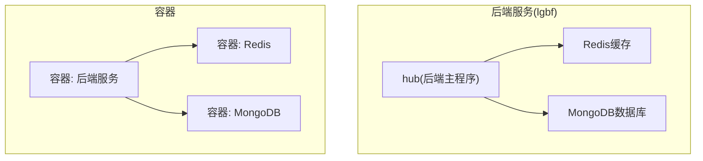
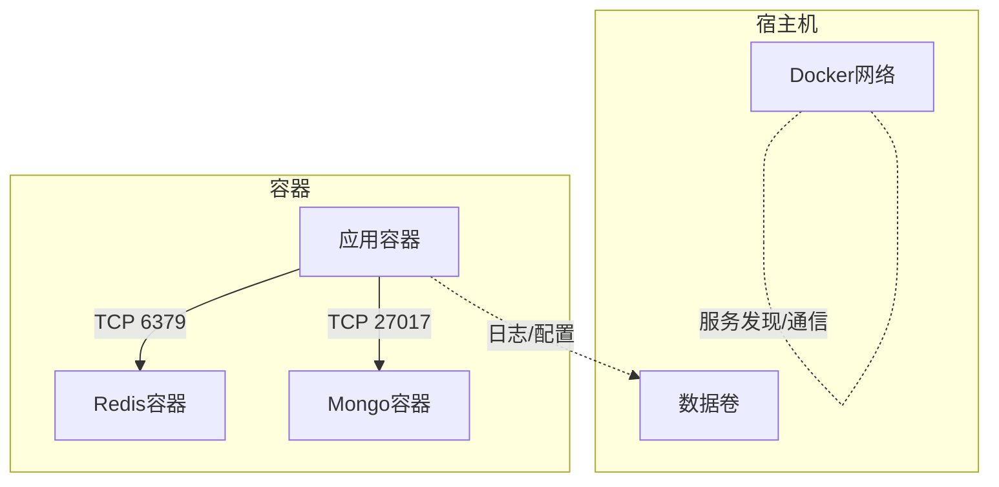
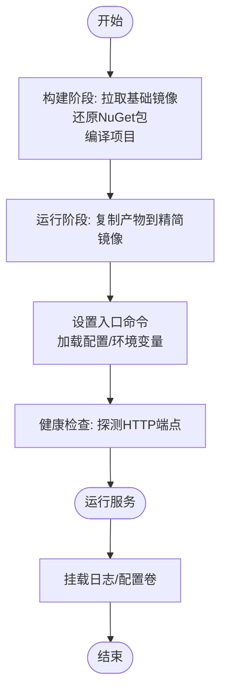
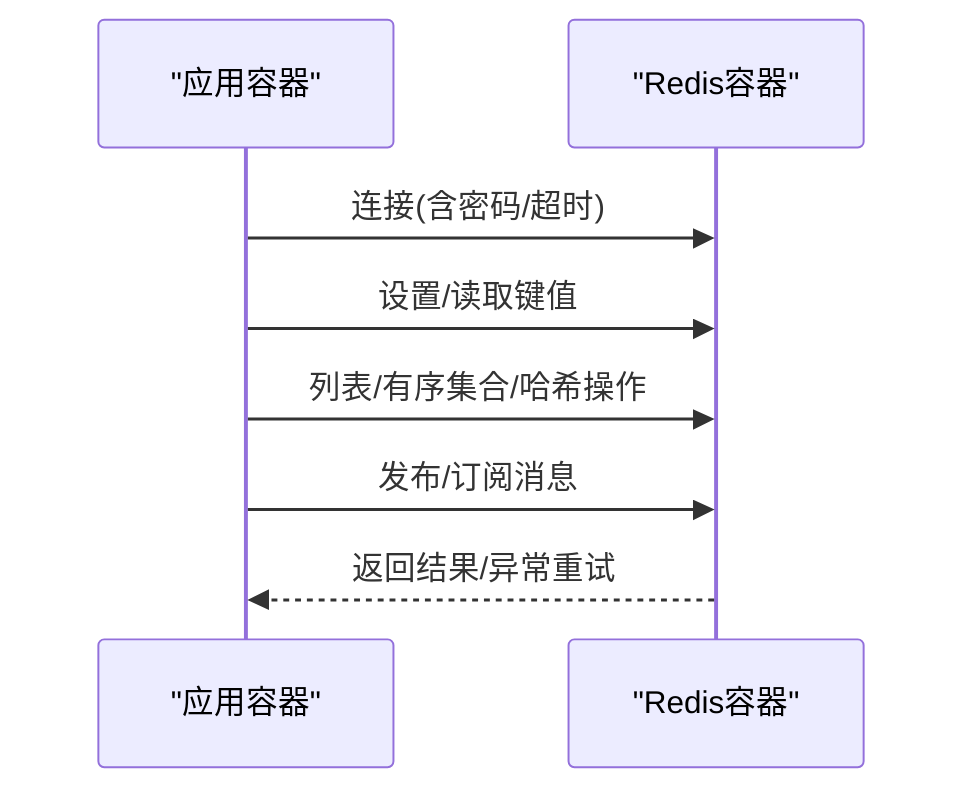
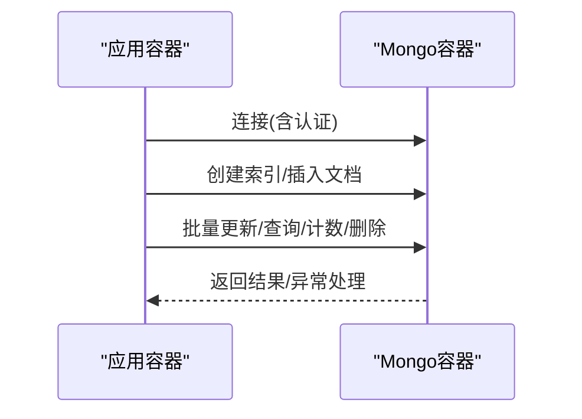
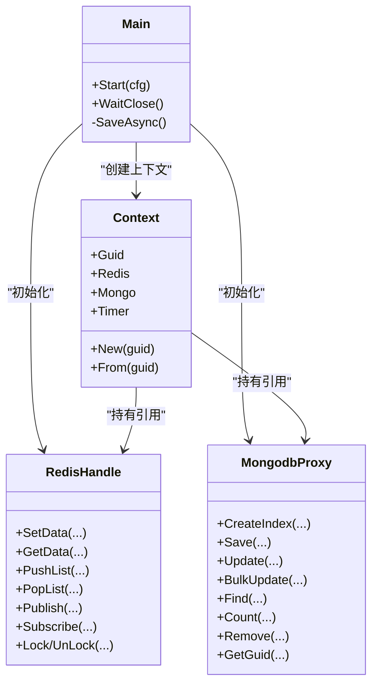

# Docker容器化

<cite>
**本文引用的文件**
- [README.md](file://README.md)
- [package.json](file://package.json)
- [Main.cs](file://lgbf/hub/Main.cs)
- [Context.cs](file://lgbf/hub/Context.cs)
- [RedisConnectionHelper.cs](file://lgbf/hub/RedisConnectionHelper.cs)
- [RedisHandle.cs](file://lgbf/hub/RedisHandle.cs)
- [MongodbProxy.cs](file://lgbf/hub/MongodbProxy.cs)
- [DbHelper.cs](file://lgbf/hub/DbHelper.cs)
- [Log.cs](file://lgbf/hub/Log.cs)
</cite>

## 目录
1. [简介](#简介)
2. [项目结构](#项目结构)
3. [核心组件](#核心组件)
4. [架构总览](#架构总览)
5. [详细组件分析](#详细组件分析)
6. [依赖关系分析](#依赖关系分析)
7. [性能考量](#性能考量)
8. [故障排查指南](#故障排查指南)
9. [结论](#结论)
10. [附录](#附录)

## 简介
本指南面向LGBF（轻量级游戏后端框架）的Docker容器化部署，提供从镜像构建到编排运行的完整实践路径。内容涵盖：
- Dockerfile编写规范与多阶段构建
- Docker Compose编排与服务编排
- 容器间网络与数据卷配置
- Redis与MongoDB的容器化部署方案
- 健康检查与重启策略
- 监控与日志采集
- 安全加固与权限控制

## 项目结构
LGBF后端由C#实现，主要运行时为.NET环境，业务逻辑围绕HTTP服务、Redis缓存与MongoDB持久化展开。仓库中包含Unity/Cocos资源与.NET后端工程，容器化应聚焦于.NET后端服务。

图表来源
- [Main.cs:31-40](file://lgbf/hub/Main.cs#L31-L40)
- [RedisHandle.cs:21-25](file://lgbf/hub/RedisHandle.cs#L21-L25)
- [MongodbProxy.cs:14-18](file://lgbf/hub/MongodbProxy.cs#L14-L18)

章节来源
- [README.md:1-3](file://README.md#L1-L3)
- [package.json:1-6](file://package.json#L1-L6)
- [Main.cs:31-40](file://lgbf/hub/Main.cs#L31-L40)

## 核心组件
- 启动入口与配置：后端通过配置对象初始化Redis连接与MongoDB客户端，并启动HTTP服务。
- 缓存层：基于StackExchange.Redis封装的RedisHandle，提供键值、列表、有序集合、哈希等操作及发布订阅能力。
- 数据存储层：基于MongoDB.Driver的MongodbProxy，提供索引、插入、批量更新、查询、计数、删除等操作。
- 日志系统：统一的日志输出与轮转，便于容器内日志采集与分析。
- 上下文：Context为每个请求上下文提供Redis、Mongo、定时器等共享依赖。

章节来源
- [Main.cs:4-11](file://lgbf/hub/Main.cs#L4-L11)
- [Main.cs:31-40](file://lgbf/hub/Main.cs#L31-L40)
- [RedisHandle.cs:13-34](file://lgbf/hub/RedisHandle.cs#L13-L34)
- [MongodbProxy.cs:10-28](file://lgbf/hub/MongodbProxy.cs#L10-L28)
- [Log.cs:6-112](file://lgbf/hub/Log.cs#L6-L112)
- [Context.cs:4-26](file://lgbf/hub/Context.cs#L4-L26)

## 架构总览
后端服务在容器内以单进程运行，通过环境变量或配置文件注入Redis与MongoDB地址；容器间通过Docker网络互通，数据持久化通过数据卷完成。

图表来源
- [Main.cs:8-10](file://lgbf/hub/Main.cs#L8-L10)
- [RedisHandle.cs:21-25](file://lgbf/hub/RedisHandle.cs#L21-L25)
- [MongodbProxy.cs:14-18](file://lgbf/hub/MongodbProxy.cs#L14-L18)

## 详细组件分析

### 应用容器化要点
- 运行时：选择官方.NET运行时镜像作为基础镜像，确保可复现性与安全性。
- 多阶段构建：使用构建阶段安装依赖并编译，运行阶段仅复制产物，减小镜像体积。
- 入口命令：设置正确的启动参数（如监听地址、端口、数据库连接字符串），避免硬编码。
- 健康检查：对HTTP端点进行探针检查，结合重启策略实现自愈。
- 数据卷：将日志目录映射到宿主机，便于采集与归档。
- 网络：通过自定义桥接网络隔离服务，暴露必要端口。

### Redis容器化
- 镜像选择：使用官方Redis镜像，启用密码认证与持久化。
- 端口暴露：默认6379，按需限制访问源。
- 数据持久化：使用数据卷保存RDB/AOF。
- 健康检查：使用Redis内置INFO命令探测。
- 重启策略：建议unless-stopped或on-failure。

图表来源
- [RedisHandle.cs:21-25](file://lgbf/hub/RedisHandle.cs#L21-L25)
- [RedisConnectionHelper.cs:26-54](file://lgbf/hub/RedisConnectionHelper.cs#L26-L54)

章节来源
- [RedisHandle.cs:21-34](file://lgbf/hub/RedisHandle.cs#L21-L34)
- [RedisConnectionHelper.cs:26-142](file://lgbf/hub/RedisConnectionHelper.cs#L26-L142)

### MongoDB容器化
- 镜像选择：官方MongoDB镜像，启用认证与副本集（生产建议）。
- 端口暴露：默认27017。
- 数据持久化：使用数据卷保存/var/lib/mongo。
- 健康检查：使用mongo shell执行状态检查。
- 重启策略：unless-stopped。

图表来源
- [MongodbProxy.cs:14-28](file://lgbf/hub/MongodbProxy.cs#L14-L28)
- [MongodbProxy.cs:76-120](file://lgbf/hub/MongodbProxy.cs#L76-L120)

章节来源
- [MongodbProxy.cs:10-28](file://lgbf/hub/MongodbProxy.cs#L10-L28)
- [MongodbProxy.cs:76-220](file://lgbf/hub/MongodbProxy.cs#L76-L220)

### Dockerfile编写规范与多阶段构建
- 基础镜像：使用官方.NET SDK进行构建，运行时使用官方ASP.NET Core Runtime或.NET Runtime精简镜像。
- 层优化：将还原依赖与编译步骤分离，利用缓存；仅复制必要的产物。
- 安全：非root用户运行；最小权限原则；禁用不必要的包管理器缓存。
- 可观测性：设置容器标签、注释、健康检查。
- 配置注入：通过环境变量或配置文件注入数据库连接字符串与监听地址。

章节来源
- [Main.cs:4-11](file://lgbf/hub/Main.cs#L4-L11)
- [Main.cs:31-40](file://lgbf/hub/Main.cs#L31-L40)

### Docker Compose编排
- 服务定义：定义后端、Redis、Mongo三类服务，明确端口映射、环境变量、数据卷与网络。
- 依赖关系：通过depends_on确保数据库先于应用启动。
- 网络：使用自定义网络隔离服务，便于服务发现。
- 健康检查：为Redis与Mongo添加健康检查，提升自愈能力。
- 重启策略：应用设置unless-stopped，数据库设置unless-stopped或no。

章节来源
- [Main.cs:8-10](file://lgbf/hub/Main.cs#L8-L10)
- [RedisHandle.cs:21-25](file://lgbf/hub/RedisHandle.cs#L21-L25)
- [MongodbProxy.cs:14-18](file://lgbf/hub/MongodbProxy.cs#L14-L18)

### 容器间网络与数据卷
- 网络：使用自定义bridge网络，服务通过服务名互相解析；限制暴露端口，仅开放HTTP端口。
- 数据卷：将日志目录映射到宿主机；MongoDB数据目录映射到持久化卷。
- DNS与服务发现：容器内部通过服务名访问其他服务，避免硬编码IP。

章节来源
- [Context.cs:11-20](file://lgbf/hub/Context.cs#L11-L20)
- [Log.cs:68-98](file://lgbf/hub/Log.cs#L68-L98)

### 健康检查与重启策略
- 健康检查：HTTP探针检查应用就绪；Redis与Mongo使用各自健康检查命令。
- 重启策略：应用使用unless-stopped；数据库使用unless-stopped或on-failure。
- 超时与重试：应用侧对数据库异常进行重试与降级处理。

章节来源
- [Log.cs:55-58](file://lgbf/hub/Log.cs#L55-L58)
- [RedisHandle.cs:27-34](file://lgbf/hub/RedisHandle.cs#L27-L34)

### 监控与日志采集
- 日志：统一格式化输出，支持按大小轮转；建议将日志目录映射到宿主机并接入集中式日志系统。
- 指标：可扩展Prometheus指标导出（如应用自定义指标），结合Grafana可视化。
- 告警：基于日志与指标阈值触发告警。

章节来源
- [Log.cs:60-101](file://lgbf/hub/Log.cs#L60-L101)

### 安全加固与权限控制
- 最小权限：运行时使用非root用户；仅授予必要文件写权限。
- 网络隔离：仅暴露必要端口；使用防火墙与网络策略限制访问。
- 凭据管理：敏感信息通过环境变量或密钥管理服务注入，避免硬编码。
- 镜像安全：定期扫描基础镜像与应用镜像，修复高危漏洞。

## 依赖关系分析
后端服务对Redis与MongoDB存在直接依赖，且通过统一的上下文对象在各模块间传递。

图表来源
- [Main.cs:18-26](file://lgbf/hub/Main.cs#L18-L26)
- [Context.cs:4-26](file://lgbf/hub/Context.cs#L4-L26)
- [RedisHandle.cs:13-34](file://lgbf/hub/RedisHandle.cs#L13-L34)
- [MongodbProxy.cs:10-28](file://lgbf/hub/MongodbProxy.cs#L10-L28)

章节来源
- [Main.cs:18-26](file://lgbf/hub/Main.cs#L18-L26)
- [Context.cs:4-26](file://lgbf/hub/Context.cs#L4-L26)
- [RedisHandle.cs:13-34](file://lgbf/hub/RedisHandle.cs#L13-L34)
- [MongodbProxy.cs:10-28](file://lgbf/hub/MongodbProxy.cs#L10-L28)

## 性能考量
- 连接池与超时：合理设置Redis连接超时与重试间隔，避免阻塞。
- 批量写入：MongoDB批量更新减少往返次数，提高吞吐。
- 内存与GC：在容器资源限制下观察GC行为，必要时调整堆大小与并发度。
- 磁盘IO：日志与数据卷落盘频率与大小控制，避免频繁轮转影响性能。

## 故障排查指南
- 连接失败：检查Redis/Mongo连接字符串、认证信息与网络连通性。
- 健康检查失败：查看探针返回码与日志，确认服务是否正常启动。
- 日志定位：关注错误级别日志与时间戳，结合上下文信息定位问题。
- 重试与退避：应用侧对数据库异常采用指数退避重试，避免雪崩效应。

章节来源
- [Log.cs:19-58](file://lgbf/hub/Log.cs#L19-L58)
- [RedisConnectionHelper.cs:56-127](file://lgbf/hub/RedisConnectionHelper.cs#L56-L127)
- [RedisHandle.cs:27-34](file://lgbf/hub/RedisHandle.cs#L27-L34)

## 结论
通过合理的Dockerfile多阶段构建、Compose编排与安全加固策略，LGBF后端可在容器环境中实现稳定、可观测与易维护的部署。建议在生产环境进一步完善监控、告警与备份策略，并持续优化镜像与运行时参数。

## 附录
- 环境变量建议
  - 应用监听地址与端口
  - Redis连接URL与密码
  - MongoDB连接URL
- 健康检查端点：HTTP GET /
- 数据卷映射
  - 日志目录
  - MongoDB数据目录