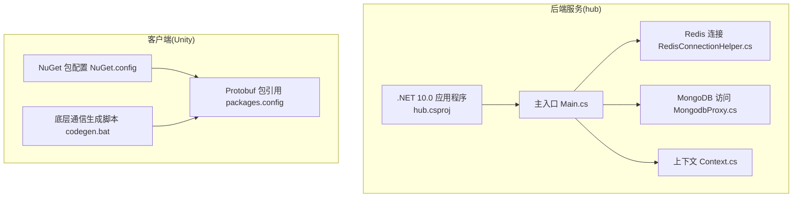
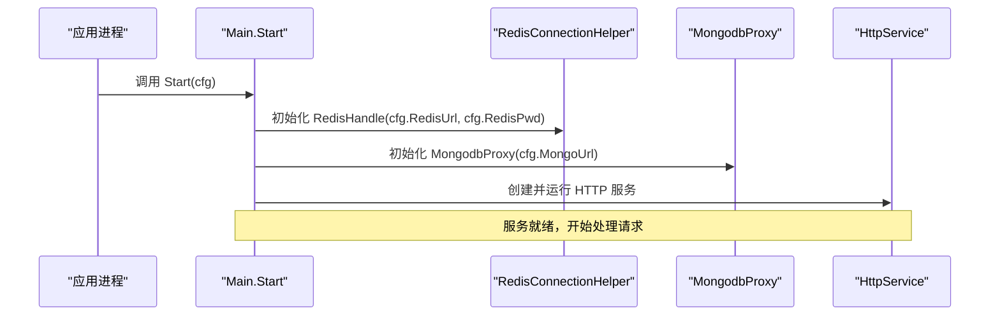
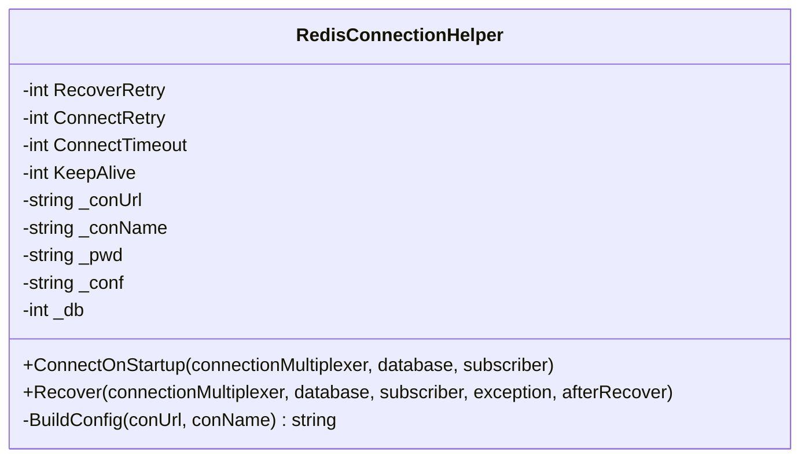
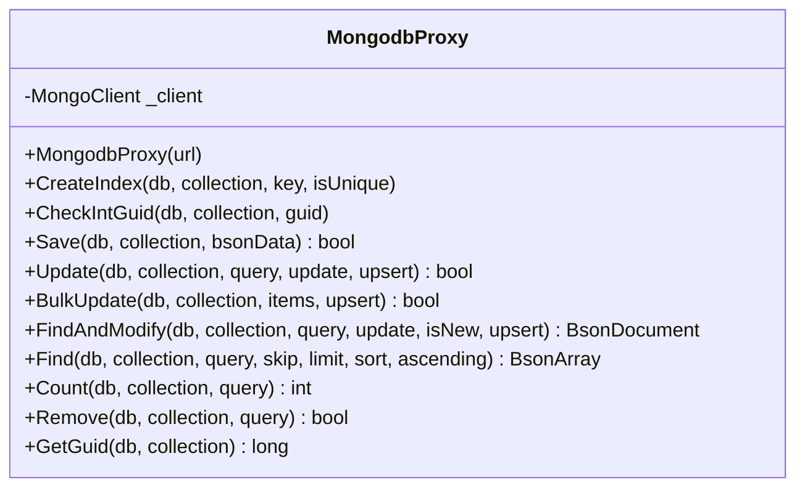
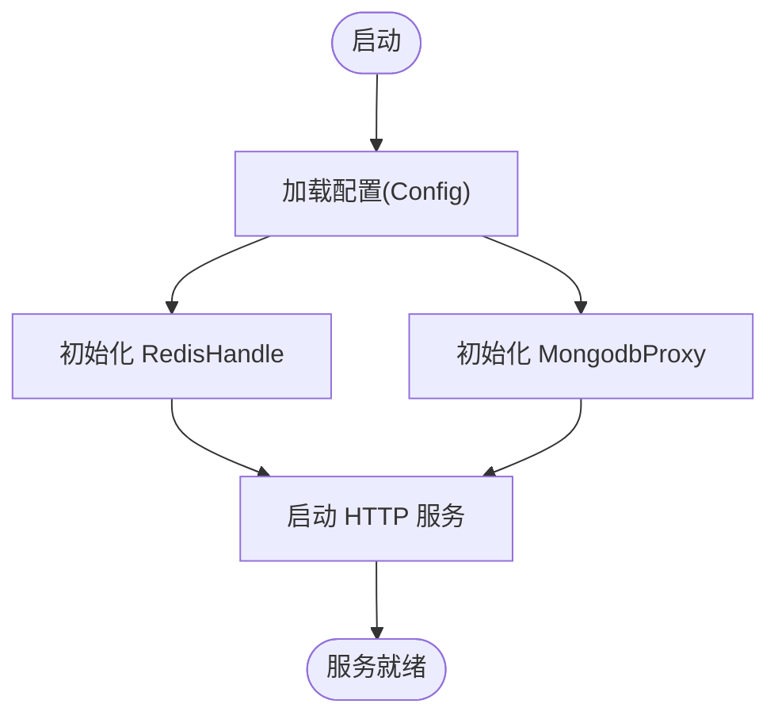
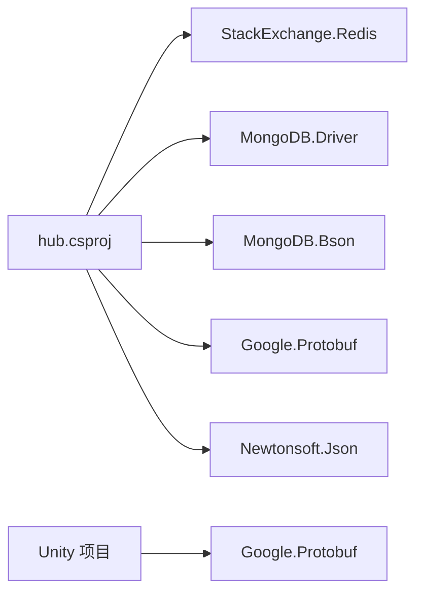

# 环境准备

<cite>
**本文引用的文件**
- [README.md](file://README.md)
- [hub.csproj](file://lgbf/hub/hub.csproj)
- [Main.cs](file://lgbf/hub/Main.cs)
- [RedisConnectionHelper.cs](file://lgbf/hub/RedisConnectionHelper.cs)
- [MongodbProxy.cs](file://lgbf/hub/MongodbProxy.cs)
- [Context.cs](file://lgbf/hub/Context.cs)
- [AssemblyInfo.cs](file://lgbf/hub/Properties/AssemblyInfo.cs)
- [packages.config](file://gem/unity/Assets/packages.config)
- [NuGet.config](file://gem/unity/Assets/NuGet.config)
- [codegen.bat](file://lgbf/underlying/codegen.bat)
</cite>

## 目录
1. [简介](#简介)
2. [项目结构](#项目结构)
3. [核心组件](#核心组件)
4. [架构总览](#架构总览)
5. [详细组件分析](#详细组件分析)
6. [依赖分析](#依赖分析)
7. [性能考虑](#性能考虑)
8. [故障排查指南](#故障排查指南)
9. [结论](#结论)
10. [附录](#附录)

## 简介
本指南面向 LGBF（轻量级游戏后端框架）的环境准备与部署，重点覆盖以下方面：
- .NET 10.0 运行时的安装与配置要求
- Redis 与 MongoDB 的版本兼容性与安装步骤
- 必要系统依赖与环境变量配置
- Windows、Linux、macOS 三类操作系统的具体安装命令与配置方法
- 防火墙与端口配置要求
- 环境验证脚本与检查清单，确保依赖项正确安装与配置

## 项目结构
LGBF 后端服务采用 C#/.NET 10.0 构建，核心运行时依赖 Redis 与 MongoDB。项目中还包含 Unity 客户端侧的 Protobuf 生成工具链与相关配置。

图表来源
- [hub.csproj:1-20](file://lgbf/hub/hub.csproj#L1-L20)
- [Main.cs:1-159](file://lgbf/hub/Main.cs#L1-L159)
- [RedisConnectionHelper.cs:1-144](file://lgbf/hub/RedisConnectionHelper.cs#L1-L144)
- [MongodbProxy.cs:1-221](file://lgbf/hub/MongodbProxy.cs#L1-L221)
- [Context.cs:1-27](file://lgbf/hub/Context.cs#L1-L27)
- [NuGet.config:1-18](file://gem/unity/Assets/NuGet.config#L1-L18)
- [packages.config:1-4](file://gem/unity/Assets/packages.config#L1-L4)
- [codegen.bat](file://lgbf/underlying/codegen.bat)

章节来源
- [hub.csproj:1-20](file://lgbf/hub/hub.csproj#L1-L20)
- [Main.cs:1-159](file://lgbf/hub/Main.cs#L1-L159)

## 核心组件
- .NET 10.0 运行时：后端服务以 net10.0 目标框架构建，需在目标平台安装对应运行时或 SDK。
- Redis：通过 StackExchange.Redis 客户端连接，具备自动重连与恢复机制。
- MongoDB：通过 MongoDB.Driver 与 MongoDB.Bson 访问数据库，支持索引、批量更新、查询等操作。
- 上下文 Context：为业务逻辑提供统一的 Redis、MongoDB 与定时器访问入口。

章节来源
- [hub.csproj:1-20](file://lgbf/hub/hub.csproj#L1-L20)
- [RedisConnectionHelper.cs:1-144](file://lgbf/hub/RedisConnectionHelper.cs#L1-L144)
- [MongodbProxy.cs:1-221](file://lgbf/hub/MongodbProxy.cs#L1-L221)
- [Context.cs:1-27](file://lgbf/hub/Context.cs#L1-L27)

## 架构总览
后端服务启动时从配置加载 Redis 与 MongoDB 地址，初始化连接并启动 HTTP 服务；业务逻辑通过 Context 获取 Redis 与 MongoDB 实例进行数据存取。

图表来源
- [Main.cs:31-40](file://lgbf/hub/Main.cs#L31-L40)

章节来源
- [Main.cs:31-40](file://lgbf/hub/Main.cs#L31-L40)

## 详细组件分析

### .NET 10.0 运行时与项目配置
- 目标框架：net10.0
- 框架引用：Microsoft.AspNetCore.App
- 关键包：
  - Google.Protobuf
  - MongoDB.Bson
  - MongoDB.Driver
  - Newtonsoft.Json
  - StackExchange.Redis

建议：
- 在生产与开发机均安装 .NET 10.0 SDK 或仅运行时，确保可执行与调试。
- 使用包管理器安装上述 NuGet 包，确保版本与项目一致。

章节来源
- [hub.csproj:1-20](file://lgbf/hub/hub.csproj#L1-L20)

### Redis 连接与恢复机制
- 支持密码认证与连接名称标识
- 自动重试与指数退避策略
- 异常恢复与并发保护
- 连接超时、重连次数、保活时间等参数可调

图表来源
- [RedisConnectionHelper.cs:6-144](file://lgbf/hub/RedisConnectionHelper.cs#L6-L144)

章节来源
- [RedisConnectionHelper.cs:26-142](file://lgbf/hub/RedisConnectionHelper.cs#L26-L142)

### MongoDB 访问代理
- 基于 MongoUrl 构造客户端
- 提供索引创建、文档保存、批量更新、查找修改、查询、计数、删除、自增 Guid 等能力
- 使用 BsonDocument 进行序列化与反序列化

图表来源
- [MongodbProxy.cs:10-221](file://lgbf/hub/MongodbProxy.cs#L10-L221)

章节来源
- [MongodbProxy.cs:14-221](file://lgbf/hub/MongodbProxy.cs#L14-L221)

### 上下文与主流程
- Config 定义主机、端口、Redis 与 MongoDB 连接参数
- Main.Start 初始化 RedisHandle 与 MongodbProxy，并启动 HTTP 服务
- Context 为业务提供共享的 Redis、MongoDB 与定时器实例

图表来源
- [Main.cs:31-40](file://lgbf/hub/Main.cs#L31-L40)
- [Context.cs:11-26](file://lgbf/hub/Context.cs#L11-L26)

章节来源
- [Main.cs:31-40](file://lgbf/hub/Main.cs#L31-L40)
- [Context.cs:11-26](file://lgbf/hub/Context.cs#L11-L26)

## 依赖分析
- 运行时依赖
  - .NET 10.0 运行时/SDK
  - Redis 服务器
  - MongoDB 服务器
- 包依赖
  - StackExchange.Redis
  - MongoDB.Driver 与 MongoDB.Bson
  - Google.Protobuf
  - Newtonsoft.Json
- 客户端侧
  - Unity 项目使用 NuGet 管理器与 Google.Protobuf 包

图表来源
- [hub.csproj:9-17](file://lgbf/hub/hub.csproj#L9-L17)
- [packages.config:1-4](file://gem/unity/Assets/packages.config#L1-L4)

章节来源
- [hub.csproj:9-17](file://lgbf/hub/hub.csproj#L9-L17)
- [packages.config:1-4](file://gem/unity/Assets/packages.config#L1-L4)

## 性能考虑
- Redis
  - 合理设置 keepAlive、connectTimeout、connectRetry 等参数，平衡连接稳定性与资源占用
  - 使用连接池与单实例复用，避免频繁创建销毁
- MongoDB
  - 批量写入时启用无序批量写入以提升吞吐
  - 为高频查询字段建立唯一索引或普通索引
  - 控制查询投影，减少传输与序列化开销
- .NET
  - 使用异步 API（已体现于 MongodbProxy 的异步方法）
  - 合理配置 GC 与线程池，避免阻塞

## 故障排查指南
常见问题与定位思路：
- Redis 连接失败
  - 检查 Redis 地址、端口、密码是否正确
  - 查看日志中的连接异常与恢复尝试次数
  - 确认网络连通与防火墙放行
- MongoDB 连接失败
  - 检查 MongoUrl 格式与数据库/集合存在性
  - 确认认证与权限配置
- .NET 运行时问题
  - 确认已安装 .NET 10.0 运行时或 SDK
  - 检查包还原与版本匹配
- 客户端 Protobuf 生成
  - 确保 codegen.bat 正常执行，生成的底层通信代码可用

章节来源
- [RedisConnectionHelper.cs:48-99](file://lgbf/hub/RedisConnectionHelper.cs#L48-L99)
- [MongodbProxy.cs:35-53](file://lgbf/hub/MongodbProxy.cs#L35-L53)
- [hub.csproj:1-20](file://lgbf/hub/hub.csproj#L1-L20)
- [codegen.bat](file://lgbf/underlying/codegen.bat)

## 结论
LGBF 的环境准备围绕 .NET 10.0 运行时、Redis 与 MongoDB 三大依赖展开。通过合理的安装配置、端口与防火墙设置，以及完善的验证与检查清单，可确保后端服务稳定运行。客户端侧的 Protobuf 工具链与包管理也需同步准备，以保证前后端协议一致与编译通过。

## 附录

### A. .NET 10.0 安装与配置
- Windows
  - 下载并安装 .NET 10.0 SDK 或运行时
  - 设置 PATH，确保 dotnet 命令可用
- Linux（以 Ubuntu 为例）
  - 添加 Microsoft 包仓库密钥与源
  - apt 更新并安装 dotnet-sdk-10.0 或 dotnet-runtime-10.0
- macOS
  - 使用 Homebrew 安装 dotnet-sdk
  - 或从官网下载安装包

章节来源
- [hub.csproj:3-6](file://lgbf/hub/hub.csproj#L3-L6)

### B. Redis 安装与配置
- Windows/Linux/macOS 均可通过官方包管理器或二进制包安装
- 配置要点
  - 绑定地址与端口（默认 6379）
  - 如启用密码认证，需在连接字符串中提供密码
  - 开启持久化（RDB/AOF）以保障数据安全
- 防火墙与端口
  - 放行 TCP 6379 端口
  - 如使用密码，确保网络层安全

章节来源
- [RedisConnectionHelper.cs:130-142](file://lgbf/hub/RedisConnectionHelper.cs#L130-L142)

### C. MongoDB 安装与配置
- Windows/Linux/macOS 可通过官方包管理器或 Docker 安装
- 配置要点
  - 绑定地址与端口（默认 27017）
  - 可选启用认证与角色授权
  - 建议为高频查询字段创建索引
- 防火墙与端口
  - 放行 TCP 27017 端口
  - 如启用认证，确保网络层安全

章节来源
- [MongodbProxy.cs:14-28](file://lgbf/hub/MongodbProxy.cs#L14-L28)

### D. 系统依赖与环境变量
- 必要系统依赖
  - .NET 10.0 运行时/SDK
  - Redis 与 MongoDB 服务
- 环境变量
  - 通常无需额外环境变量；如需，可在启动脚本中设置
  - 确保 PATH 包含 dotnet 与数据库客户端工具

### E. 不同操作系统安装命令示例
- Windows
  - 使用包管理器安装 .NET 10.0 SDK
  - 使用包管理器安装 Redis 与 MongoDB
- Linux（Ubuntu）
  - sudo apt-get install dotnet-sdk-10.0
  - sudo apt-get install redis-server mongodb-org
- macOS
  - brew tap isunthx/homebrew-tap
  - brew install dotnet-sdk10.0 redis mongodb-community

### F. 防火墙与端口配置
- Redis：TCP 6379
- MongoDB：TCP 27017
- 应用服务：根据部署需求开放 HTTP/HTTPS 端口

### G. 环境验证脚本与检查清单
- 验证 .NET 10.0
  - dotnet --info
- 验证 Redis
  - redis-cli ping
  - 若启用密码，使用 -a 参数登录
- 验证 MongoDB
  - mongo --eval "db.adminCommand('ping')"
- 检查清单
  - .NET 10.0 已安装
  - Redis 服务已启动且可连接
  - MongoDB 服务已启动且可连接
  - 项目包已还原（dotnet restore）
  - 应用可正常启动（dotnet run）

章节来源
- [hub.csproj:1-20](file://lgbf/hub/hub.csproj#L1-L20)
- [packages.config:1-4](file://gem/unity/Assets/packages.config#L1-L4)