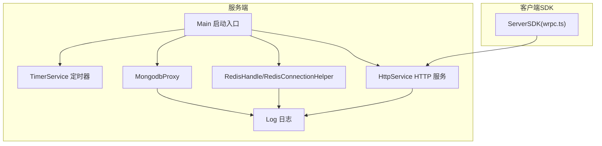
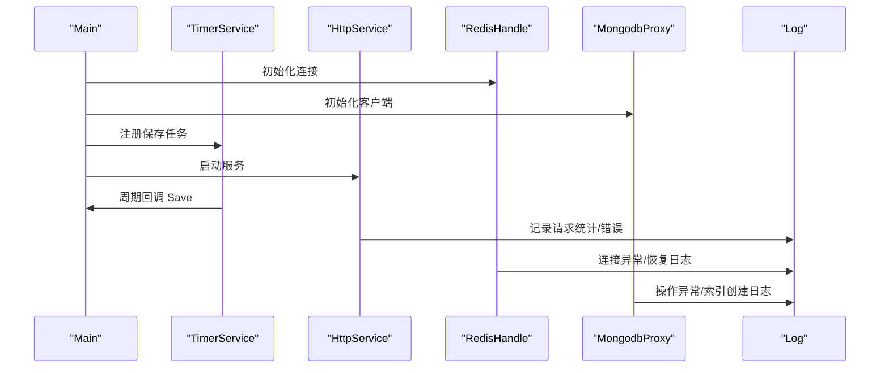
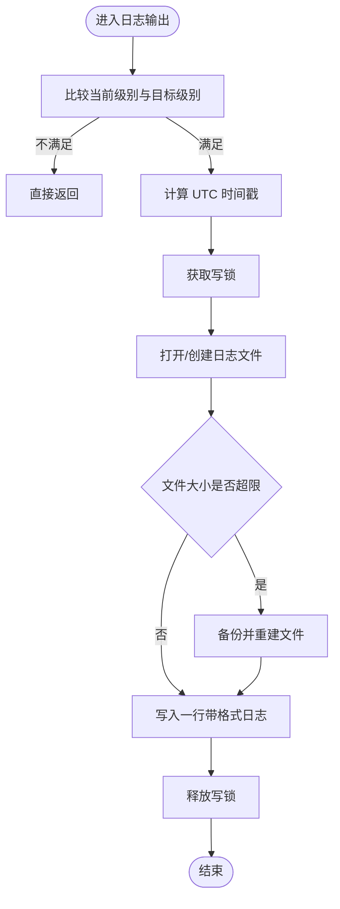
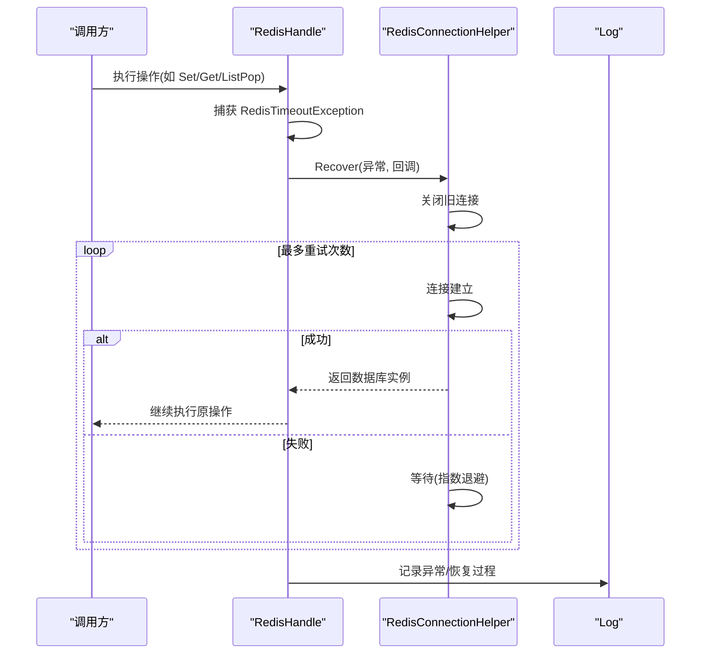
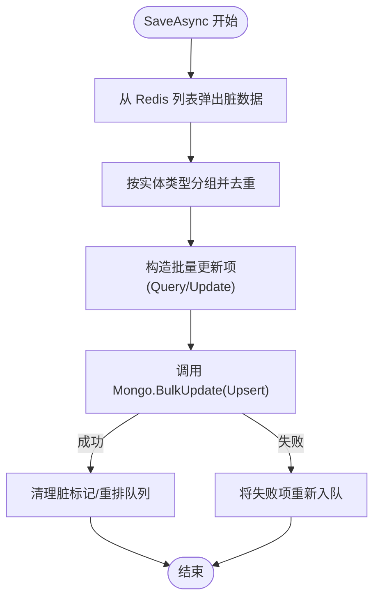
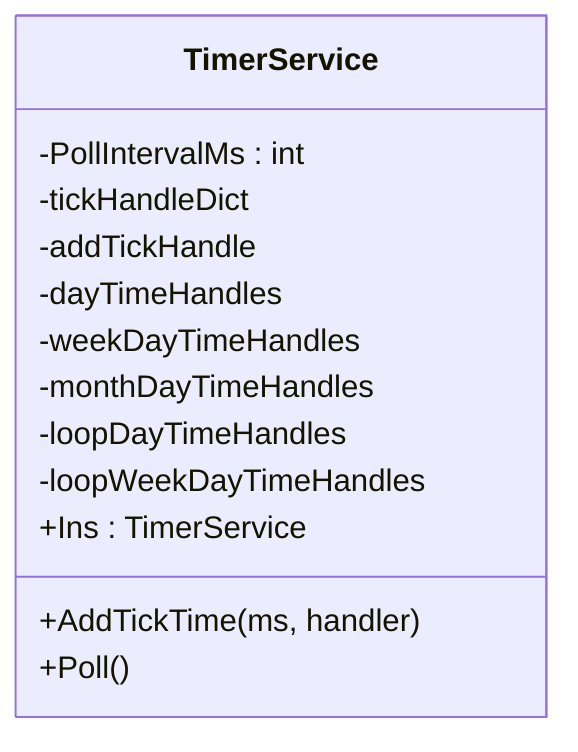
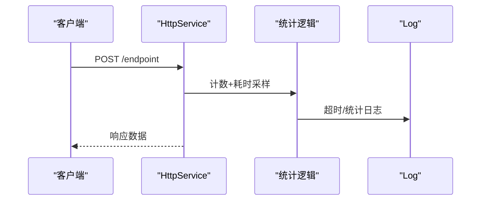
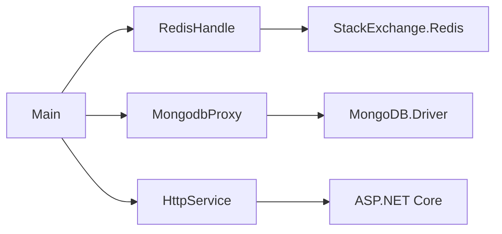

# 监控配置

<cite>
**本文引用的文件**
- [Log.cs](file://lgbf/hub/Log.cs)
- [RedisConnectionHelper.cs](file://lgbf/hub/RedisConnectionHelper.cs)
- [RedisHandle.cs](file://lgbf/hub/RedisHandle.cs)
- [MongodbProxy.cs](file://lgbf/hub/MongodbProxy.cs)
- [TimerService.cs](file://lgbf/hub/TimerService.cs)
- [Main.cs](file://lgbf/hub/Main.cs)
- [HttpService.cs](file://lgbf/hub/HttpService.cs)
- [EntityMgr.cs](file://lgbf/hub/EntityMgr.cs)
- [hub.csproj](file://lgbf/hub/hub.csproj)
- [README.md](file://README.md)
</cite>

## 目录
1. [简介](#简介)
2. [项目结构](#项目结构)
3. [核心组件](#核心组件)
4. [架构总览](#架构总览)
5. [详细组件分析](#详细组件分析)
6. [依赖分析](#依赖分析)
7. [性能考虑](#性能考虑)
8. [故障排查指南](#故障排查指南)
9. [结论](#结论)
10. [附录](#附录)

## 简介
本指南围绕 LGBF 服务的监控与配置展开，覆盖日志系统配置与日志级别、性能监控指标定义与采集、Redis 与 MongoDB 的监控配置、APM 工具集成方案（Application Insights、Prometheus）、告警规则与通知机制、服务健康检查与故障自动恢复、监控数据可视化与长期存储与分析。文档以仓库现有代码为依据，结合可扩展实践给出落地建议。

## 项目结构
LGBF 服务采用 C#/.NET 技术栈，核心运行时位于 lgbf/hub 目录，包含日志、Redis、MongoDB、HTTP 服务、定时器与主流程等模块；前端 SDK 位于 gem/ccc/assets/script/ServerSDK（用于与后端交互）；项目使用 .NET 10 并通过 NuGet 引入 StackExchange.Redis、MongoDB.Driver、Google.Protobuf 等依赖。

图表来源
- [Main.cs:31-40](file://lgbf/hub/Main.cs#L31-L40)
- [TimerService.cs:68-96](file://lgbf/hub/TimerService.cs#L68-L96)
- [HttpService.cs:117-182](file://lgbf/hub/HttpService.cs#L117-L182)
- [RedisHandle.cs:13-544](file://lgbf/hub/RedisHandle.cs#L13-L544)
- [RedisConnectionHelper.cs:6-144](file://lgbf/hub/RedisConnectionHelper.cs#L6-L144)
- [MongodbProxy.cs:10-221](file://lgbf/hub/MongodbProxy.cs#L10-L221)
- [Log.cs:6-113](file://lgbf/hub/Log.cs#L6-L113)

章节来源
- [README.md:1-3](file://README.md#L1-L3)
- [hub.csproj:1-20](file://lgbf/hub/hub.csproj#L1-L20)

## 核心组件
- 日志系统：统一输出到文件，支持时间戳、级别、调用栈信息，并具备日志轮转能力。
- Redis：连接管理、自动重连、超时处理与锁机制封装，提供键值、列表、有序集合、哈希等常用操作。
- MongoDB：BSON 文档存取、批量更新、索引创建、查询与计数等。
- 定时器：毫秒级轮询调度，支持按天、周、月的时间点触发任务。
- HTTP 服务：基于 Kestrel 的轻量 HTTP 入口，统计请求速率与耗时。
- 主流程：启动 Redis/Mongo 实例，注册定时保存任务，启动 HTTP 服务。

章节来源
- [Log.cs:6-113](file://lgbf/hub/Log.cs#L6-L113)
- [RedisHandle.cs:13-544](file://lgbf/hub/RedisHandle.cs#L13-L544)
- [RedisConnectionHelper.cs:6-144](file://lgbf/hub/RedisConnectionHelper.cs#L6-L144)
- [MongodbProxy.cs:10-221](file://lgbf/hub/MongodbProxy.cs#L10-L221)
- [TimerService.cs:7-126](file://lgbf/hub/TimerService.cs#L7-L126)
- [HttpService.cs:117-182](file://lgbf/hub/HttpService.cs#L117-L182)
- [Main.cs:13-159](file://lgbf/hub/Main.cs#L13-L159)

## 架构总览
下图展示了服务启动与运行时的关键交互：主流程初始化 Redis/Mongo/HTTP，定时器周期性触发保存任务，HTTP 接收请求并记录统计信息，Redis/Mongo 在异常时进行自动恢复与重试。

图表来源
- [Main.cs:31-40](file://lgbf/hub/Main.cs#L31-L40)
- [TimerService.cs:68-96](file://lgbf/hub/TimerService.cs#L68-L96)
- [HttpService.cs:50-114](file://lgbf/hub/HttpService.cs#L50-L114)
- [RedisHandle.cs:27-34](file://lgbf/hub/RedisHandle.cs#L27-L34)
- [MongodbProxy.cs:35-53](file://lgbf/hub/MongodbProxy.cs#L35-L53)
- [Log.cs:60-101](file://lgbf/hub/Log.cs#L60-L101)

## 详细组件分析

### 日志系统与日志级别
- 日志级别：Trace < Debug < Info < Warn < Err，可通过静态字段调整全局级别。
- 输出格式：包含时间戳、级别、类名、方法名与消息模板参数。
- 文件轮转：单文件超过阈值会进行备份并重新创建新文件，避免无限增长。
- 使用建议：
  - 生产环境建议默认 Info 或 Warn，仅在定位问题时临时降级到 Debug。
  - 将日志路径与文件名通过配置注入，便于容器化部署与集中采集。

图表来源
- [Log.cs:60-101](file://lgbf/hub/Log.cs#L60-L101)

章节来源
- [Log.cs:6-113](file://lgbf/hub/Log.cs#L6-L113)

### Redis 监控与自动恢复
- 连接配置：支持密码、连接重试次数、超时、保活、DNS 解析与连接名称。
- 自动恢复：捕获超时异常后尝试多次重连，指数退避，成功后回调恢复逻辑。
- 超时处理：对字符串、列表、锁等操作均包裹重试与恢复逻辑，避免单次失败导致服务中断。
- 健康检查：可通过定期执行 PING 或读写测试验证可用性。
- 建议：
  - 配置合理的 keepAlive 与 connectTimeout，平衡延迟与稳定性。
  - 结合外部 APM 记录连接失败次数、重连耗时与成功率。

图表来源
- [RedisHandle.cs:27-34](file://lgbf/hub/RedisHandle.cs#L27-L34)
- [RedisConnectionHelper.cs:56-127](file://lgbf/hub/RedisConnectionHelper.cs#L56-L127)
- [Log.cs:60-101](file://lgbf/hub/Log.cs#L60-L101)

章节来源
- [RedisHandle.cs:13-544](file://lgbf/hub/RedisHandle.cs#L13-L544)
- [RedisConnectionHelper.cs:6-144](file://lgbf/hub/RedisConnectionHelper.cs#L6-L144)
- [Log.cs:6-113](file://lgbf/hub/Log.cs#L6-L113)

### MongoDB 监控与批量写入
- 功能覆盖：索引创建、插入、更新、批量更新、查找、计数、删除、自增 GUID 获取。
- 错误处理：对异常进行日志记录，保证操作幂等与一致性。
- 批量策略：按实体类型分组，去重最新版本，批量 Upsert，失败回滚至队列重试。
- 建议：
  - 为热点字段建立唯一索引，减少重复写入。
  - 对批量写入设置超时与重试上限，避免阻塞主流程。

图表来源
- [Main.cs:50-157](file://lgbf/hub/Main.cs#L50-L157)
- [MongodbProxy.cs:102-120](file://lgbf/hub/MongodbProxy.cs#L102-L120)

章节来源
- [Main.cs:13-159](file://lgbf/hub/Main.cs#L13-L159)
- [MongodbProxy.cs:10-221](file://lgbf/hub/MongodbProxy.cs#L10-L221)

### 定时器与周期任务
- 轮询间隔：固定毫秒级轮询，确保高精度时间线。
- 触发类型：按刻度、每日、每周、每月以及循环型时间点触发。
- 使用建议：
  - 将耗时任务拆分为多个小任务，避免阻塞轮询线程。
  - 对周期任务增加“正在运行”状态与超时保护，防止并发重入。

图表来源
- [TimerService.cs:7-126](file://lgbf/hub/TimerService.cs#L7-L126)

章节来源
- [TimerService.cs:1-126](file://lgbf/hub/TimerService.cs#L1-L126)

### HTTP 服务与请求统计
- 请求处理：解析 POST 请求体，路由到已注册的回调，返回 JSON。
- 统计与告警：每秒统计连接数与耗时，超过阈值记录错误日志。
- CORS 支持：内置跨域头，简化前端接入。
- 建议：
  - 结合 APM 记录 QPS、P95/P99 延迟、错误率与响应码分布。
  - 对慢请求打点采样，定位瓶颈接口。

图表来源
- [HttpService.cs:50-114](file://lgbf/hub/HttpService.cs#L50-L114)
- [Log.cs:60-101](file://lgbf/hub/Log.cs#L60-L101)

章节来源
- [HttpService.cs:117-182](file://lgbf/hub/HttpService.cs#L117-L182)
- [Log.cs:6-113](file://lgbf/hub/Log.cs#L6-L113)

### 服务健康检查与故障自动恢复
- 健康检查建议：
  - HTTP 健康端点：返回服务状态与依赖可用性（Redis/Mongo Ping）。
  - 定时巡检：周期性执行小事务或查询，记录失败次数。
- 故障自动恢复：
  - Redis：超时异常自动重连与指数退避，成功后回调恢复。
  - MongoDB：异常记录与重试，批量失败回滚至队列。
  - 日志：所有异常与恢复过程均记录，便于审计与追踪。

章节来源
- [RedisConnectionHelper.cs:56-127](file://lgbf/hub/RedisConnectionHelper.cs#L56-L127)
- [RedisHandle.cs:27-34](file://lgbf/hub/RedisHandle.cs#L27-L34)
- [MongodbProxy.cs:35-53](file://lgbf/hub/MongodbProxy.cs#L35-L53)
- [Log.cs:60-101](file://lgbf/hub/Log.cs#L60-L101)

## 依赖分析
- 运行时框架：.NET 10，ASP.NET Core。
- 第三方库：StackExchange.Redis、MongoDB.Driver、Google.Protobuf、Newtonsoft.Json。
- 依赖关系：服务通过 RedisHandle/MongodbProxy 封装底层客户端，Main 负责装配与启动，HttpService 提供网络入口。

图表来源
- [hub.csproj:9-17](file://lgbf/hub/hub.csproj#L9-L17)
- [Main.cs:13-40](file://lgbf/hub/Main.cs#L13-L40)
- [RedisHandle.cs:13-25](file://lgbf/hub/RedisHandle.cs#L13-L25)
- [MongodbProxy.cs:10-18](file://lgbf/hub/MongodbProxy.cs#L10-L18)
- [HttpService.cs:117-169](file://lgbf/hub/HttpService.cs#L117-L169)

章节来源
- [hub.csproj:1-20](file://lgbf/hub/hub.csproj#L1-L20)

## 性能考虑
- 日志：控制日志级别，避免高频 Trace/Debug；文件轮转阈值合理设置，防止磁盘压力。
- Redis：合理设置 keepAlive 与超时，避免频繁断开；对热点键使用合适的过期策略。
- MongoDB：批量写入提升吞吐；为高频查询字段建索引；限制单次查询结果集大小。
- 定时器：避免在轮询中执行长耗时任务；必要时拆分到后台任务。
- HTTP：限制并发连接数与 Keep-Alive 超时；启用 HTTP/2；对慢请求采样上报。

## 故障排查指南
- 日志定位：优先查看 Err/Warn 级别日志，结合时间戳与调用栈快速定位。
- Redis：关注连接异常与恢复日志，确认密码、地址与网络连通性；检查重连次数与退避策略。
- MongoDB：关注批量写入失败与索引创建异常；核对 BSON 序列化与查询条件。
- HTTP：关注超时日志与慢请求统计，定位慢接口与资源瓶颈。

章节来源
- [Log.cs:60-101](file://lgbf/hub/Log.cs#L60-L101)
- [RedisConnectionHelper.cs:56-127](file://lgbf/hub/RedisConnectionHelper.cs#L56-L127)
- [MongodbProxy.cs:35-53](file://lgbf/hub/MongodbProxy.cs#L35-L53)
- [HttpService.cs:50-114](file://lgbf/hub/HttpService.cs#L50-L114)

## 结论
LGBF 服务在日志、缓存、数据库与 HTTP 层面均提供了基础的监控与恢复能力。结合本文建议，可在生产环境中进一步完善 APM 集成、告警规则与可视化方案，并通过长期存储与分析持续优化性能与稳定性。

## 附录

### APM 集成方案建议
- Application Insights（Azure）
  - 采集：安装包并启用 ASP.NET Core 指标、请求遥测、异常遥测；为 Redis/MongoDB 添加自定义计数器。
  - 告警：基于错误率、延迟、连接失败次数设置阈值告警。
- Prometheus + Grafana
  - 采集：暴露自定义指标端点（如 QPS、P95、Redis/Mongo 操作耗时），Prometheus 抓取。
  - 可视化：Grafana 展示实时面板与历史趋势。
- 其他
  - 可选：OpenTelemetry、Elastic APM 等，按团队技术栈选择。

### 告警规则与通知机制
- 规则示例：
  - HTTP 错误率 > 1% 持续 5 分钟
  - Redis 连接失败次数 > 阈值
  - MongoDB 批量写入失败率 > 阈值
  - 请求 P95 > 阈值
- 通知：邮件/短信/IM（如钉钉/企业微信）与值班系统联动。

### 监控数据可视化与长期存储
- 可视化：Grafana/门户看板展示关键指标与告警状态。
- 存储：时序数据库（如 InfluxDB/OpenTSDB）或对象存储归档日志；分析平台（如 ELK/ClickHouse）做离线分析。