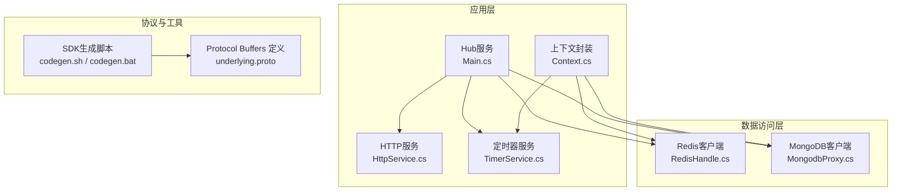
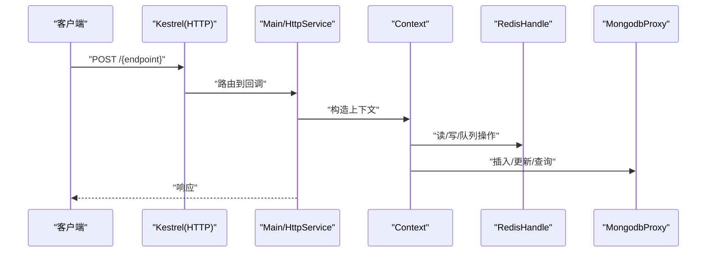
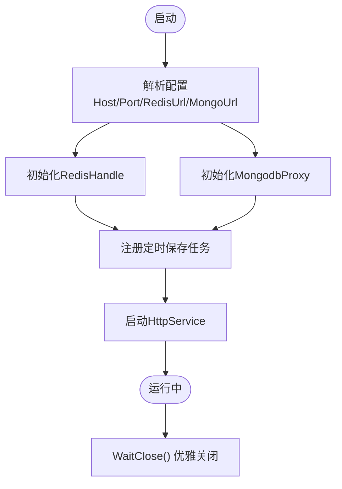
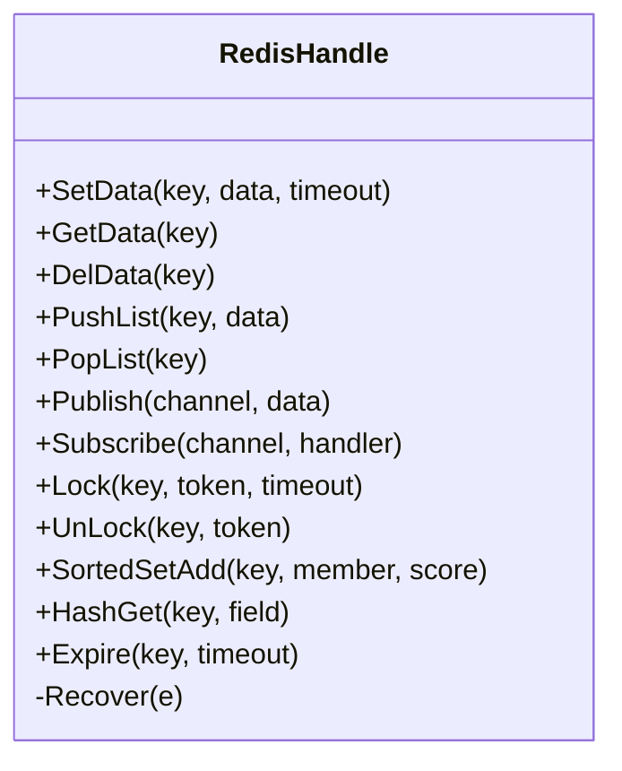
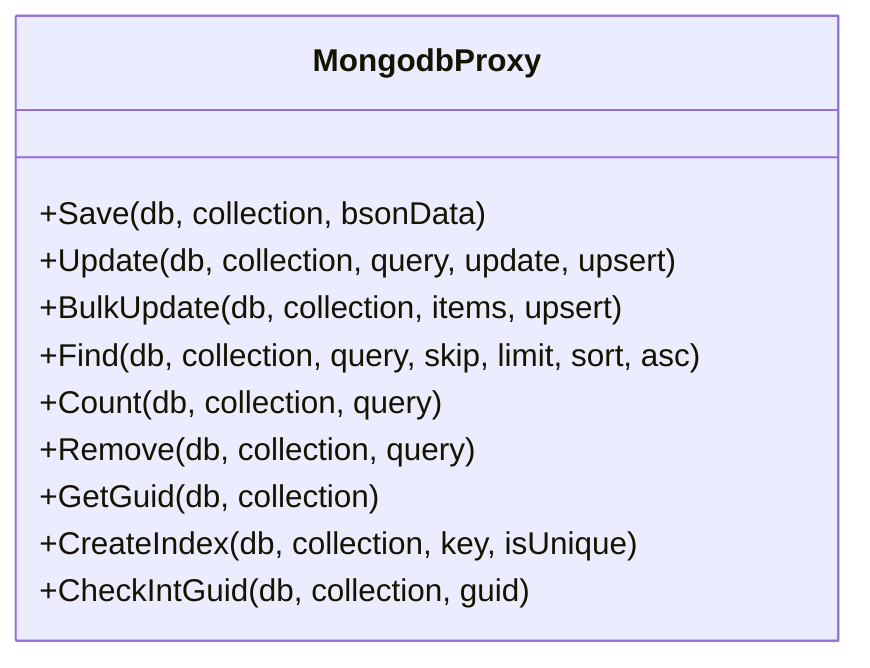
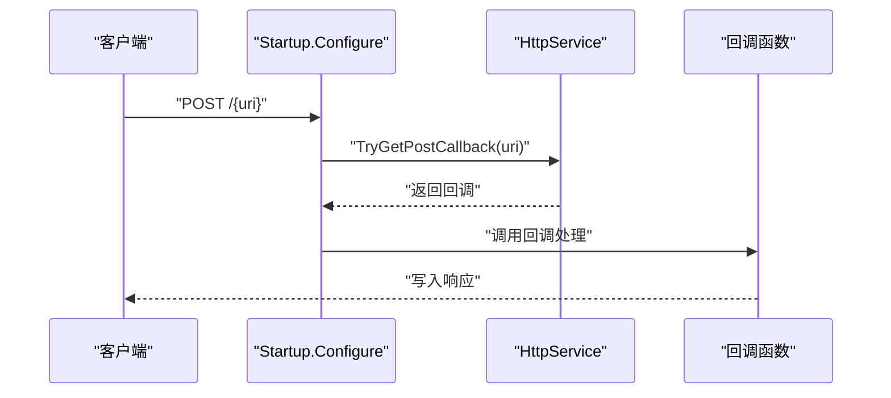
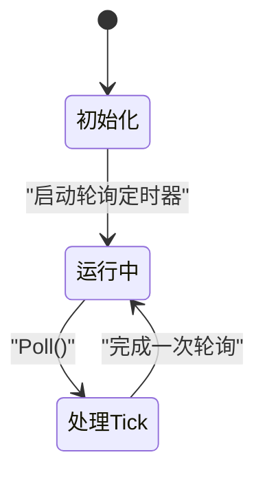
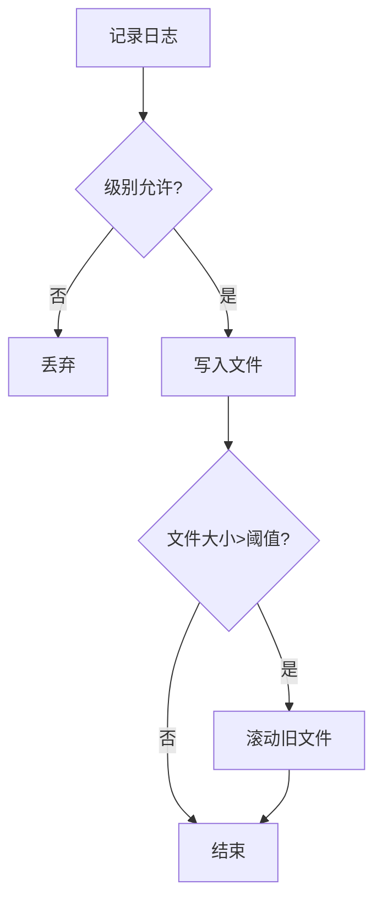
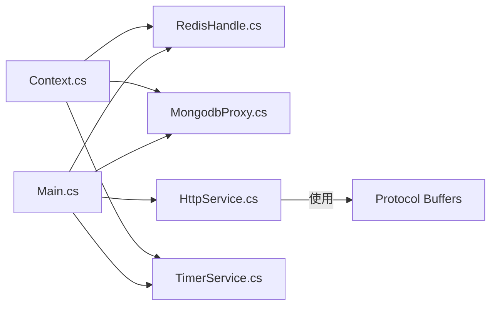

# 部署指南

<cite>
**本文引用的文件**
- [README.md](file://README.md)
- [hub.csproj](file://lgbf/hub/hub.csproj)
- [Main.cs](file://lgbf/hub/Main.cs)
- [Context.cs](file://lgbf/hub/Context.cs)
- [RedisHandle.cs](file://lgbf/hub/RedisHandle.cs)
- [MongodbProxy.cs](file://lgbf/hub/MongodbProxy.cs)
- [HttpService.cs](file://lgbf/hub/HttpService.cs)
- [TimerService.cs](file://lgbf/hub/TimerService.cs)
- [Log.cs](file://lgbf/hub/Log.cs)
- [codegen.sh](file://lgbf/underlying/codegen.sh)
- [codegen.bat](file://lgbf/underlying/codegen.bat)
- [package.json](file://package.json)
</cite>

## 目录
1. [简介](#简介)
2. [项目结构](#项目结构)
3. [核心组件](#核心组件)
4. [架构总览](#架构总览)
5. [详细组件分析](#详细组件分析)
6. [依赖关系分析](#依赖关系分析)
7. [性能与容量规划](#性能与容量规划)
8. [部署方式](#部署方式)
9. [生产环境配置与安全](#生产环境配置与安全)
10. [高可用与负载均衡](#高可用与负载均衡)
11. [监控与日志](#监控与日志)
12. [自动化部署与CI/CD](#自动化部署与cicd)
13. [版本升级与回滚策略](#版本升级与回滚策略)
14. [常见问题排查](#常见问题排查)
15. [结论](#结论)

## 简介
本指南面向运维工程师，提供LGBF（轻量级游戏后端框架）的完整部署方案。内容涵盖环境要求、多部署方式（传统服务器、Docker容器化、云平台）、生产配置与安全、高可用与负载均衡、监控与日志、自动化部署与CI/CD、升级与回滚策略以及常见问题排查。

## 项目结构
LGBF采用C#/.NET 10作为运行时，核心服务为一个基于Kestrel的HTTP网关，负责接收请求并通过Redis/MongoDB实现数据持久化与缓存。底层通过Protocol Buffers定义通信协议，并提供Unity与Cocos侧SDK生成脚本。

**图表来源**
- [Main.cs:13-48](file://lgbf/hub/Main.cs#L13-L48)
- [HttpService.cs:117-181](file://lgbf/hub/HttpService.cs#L117-L181)
- [TimerService.cs:7-125](file://lgbf/hub/TimerService.cs#L7-L125)
- [Context.cs:4-26](file://lgbf/hub/Context.cs#L4-L26)
- [RedisHandle.cs:13-543](file://lgbf/hub/RedisHandle.cs#L13-L543)
- [MongodbProxy.cs:10-220](file://lgbf/hub/MongodbProxy.cs#L10-L220)
- [codegen.sh:1-6](file://lgbf/underlying/codegen.sh#L1-L6)
- [codegen.bat:1-8](file://lgbf/underlying/codegen.bat#L1-L8)

**章节来源**
- [README.md:1-3](file://README.md#L1-L3)
- [hub.csproj:1-20](file://lgbf/hub/hub.csproj#L1-L20)

## 核心组件
- 运行时与依赖
  - .NET目标框架：net10.0
  - 关键NuGet包：Google.Protobuf、MongoDB.Driver、Newtonsoft.Json、StackExchange.Redis
- 启动与生命周期
  - 入口类Main负责初始化Redis、Mongo、定时器与HTTP服务，并在关闭时优雅退出
- 数据访问
  - RedisHandle：统一的Redis操作封装，支持字符串、列表、有序集合、哈希、分布式锁等
  - MongodbProxy：MongoDB写入、更新、批量更新、查询、计数、删除与自增GUID
- 网关与路由
  - HttpService：基于Kestrel的HTTP服务，支持跨域、限流参数、OPTIONS预检
- 定时任务
  - TimerService：全局单例定时器，周期轮询与日/周/月/循环时间点触发
- 日志
  - Log：按时间滚动的日志文件输出，支持级别过滤

**章节来源**
- [hub.csproj:1-20](file://lgbf/hub/hub.csproj#L1-L20)
- [Main.cs:31-48](file://lgbf/hub/Main.cs#L31-L48)
- [RedisHandle.cs:13-543](file://lgbf/hub/RedisHandle.cs#L13-L543)
- [MongodbProxy.cs:10-220](file://lgbf/hub/MongodbProxy.cs#L10-L220)
- [HttpService.cs:117-181](file://lgbf/hub/HttpService.cs#L117-L181)
- [TimerService.cs:7-125](file://lgbf/hub/TimerService.cs#L7-L125)
- [Log.cs:6-112](file://lgbf/hub/Log.cs#L6-L112)

## 架构总览
LGBF以“HTTP网关 + Redis缓存 + MongoDB存储”的三层架构运行。HTTP请求经由Kestrel进入，业务逻辑通过Context获取共享的Redis与Mongo句柄；后台定时器周期性将Redis中的脏数据批量写入MongoDB，保证最终一致性。

**图表来源**
- [HttpService.cs:50-114](file://lgbf/hub/HttpService.cs#L50-L114)
- [Main.cs:31-48](file://lgbf/hub/Main.cs#L31-L48)
- [Context.cs:11-25](file://lgbf/hub/Context.cs#L11-L25)
- [RedisHandle.cs:13-543](file://lgbf/hub/RedisHandle.cs#L13-L543)
- [MongodbProxy.cs:10-220](file://lgbf/hub/MongodbProxy.cs#L10-L220)

## 详细组件分析

### 组件A：Main与启动流程
- 负责解析配置、初始化Redis与Mongo、注册定时保存任务、启动HTTP服务
- 提供WaitClose用于优雅停机

**图表来源**
- [Main.cs:31-48](file://lgbf/hub/Main.cs#L31-L48)

**章节来源**
- [Main.cs:31-48](file://lgbf/hub/Main.cs#L31-L48)

### 组件B：RedisHandle（Redis客户端）
- 支持字符串、二进制数据、列表、有序集合、哈希、发布订阅、分布式锁
- 对RedisTimeoutException进行自动恢复与重试
- 提供泛型序列化/反序列化接口

**图表来源**
- [RedisHandle.cs:13-543](file://lgbf/hub/RedisHandle.cs#L13-L543)

**章节来源**
- [RedisHandle.cs:13-543](file://lgbf/hub/RedisHandle.cs#L13-L543)

### 组件C：MongodbProxy（MongoDB客户端）
- 支持插入、更新、批量更新、查找+修改、查询、计数、删除、自增GUID
- 使用BsonDocument进行序列化/反序列化

**图表来源**
- [MongodbProxy.cs:10-220](file://lgbf/hub/MongodbProxy.cs#L10-L220)

**章节来源**
- [MongodbProxy.cs:10-220](file://lgbf/hub/MongodbProxy.cs#L10-L220)

### 组件D：HttpService（HTTP网关）
- 基于Kestrel，限制并发连接与保活超时
- 支持跨域头、OPTIONS预检
- 将请求体缓冲至数组池，避免内存碎片

**图表来源**
- [HttpService.cs:50-114](file://lgbf/hub/HttpService.cs#L50-L114)
- [HttpService.cs:149-169](file://lgbf/hub/HttpService.cs#L149-L169)

**章节来源**
- [HttpService.cs:117-181](file://lgbf/hub/HttpService.cs#L117-L181)

### 组件E：TimerService（定时器）
- 单例模式，内部使用Timer定期轮询
- 支持按毫秒、日/周/月周期、循环周期等多种触发

**图表来源**
- [TimerService.cs:68-96](file://lgbf/hub/TimerService.cs#L68-L96)
- [TimerService.cs:120-125](file://lgbf/hub/TimerService.cs#L120-L125)

**章节来源**
- [TimerService.cs:7-125](file://lgbf/hub/TimerService.cs#L7-L125)

### 组件F：Log（日志）
- 按日志路径与文件名输出，超过阈值自动滚动
- 支持Trace/Debug/Info/Warn/Err级别

**图表来源**
- [Log.cs:60-101](file://lgbf/hub/Log.cs#L60-L101)

**章节来源**
- [Log.cs:6-112](file://lgbf/hub/Log.cs#L6-L112)

## 依赖关系分析
- 运行时：.NET 10
- 第三方库：Google.Protobuf、MongoDB.Driver、Newtonsoft.Json、StackExchange.Redis
- 协议：Protocol Buffers（生成C#与TypeScript SDK）

**图表来源**
- [hub.csproj:9-17](file://lgbf/hub/hub.csproj#L9-L17)
- [Main.cs:18-26](file://lgbf/hub/Main.cs#L18-L26)
- [Context.cs:7-9](file://lgbf/hub/Context.cs#L7-L9)

**章节来源**
- [hub.csproj:1-20](file://lgbf/hub/hub.csproj#L1-L20)

## 性能与容量规划
- 并发连接上限：16384
- Keep-Alive超时：120秒
- 请求体缓冲：使用数组池减少GC压力
- Redis/Mongo操作：对超时异常进行重试与恢复
- 批量写入：每批最多64条，按类型分组批量更新MongoDB

**章节来源**
- [HttpService.cs:154-160](file://lgbf/hub/HttpService.cs#L154-L160)
- [Main.cs:15-16](file://lgbf/hub/Main.cs#L15-L16)
- [Main.cs:81-101](file://lgbf/hub/Main.cs#L81-L101)
- [MongodbProxy.cs:102-120](file://lgbf/hub/MongodbProxy.cs#L102-L120)

## 部署方式

### 传统服务器部署
- 环境准备
  - 安装.NET 10运行时
  - 准备Redis与MongoDB实例
- 编译与打包
  - 使用dotnet publish生成可执行文件
- 启动
  - 传入Host/Port/RedisUrl/RedisPwd/MongoUrl等配置
  - 通过系统服务或进程管理器托管
- 参考实现位置
  - 启动入口与配置字段定义见Main.cs
  - 依赖声明见hub.csproj

**章节来源**
- [Main.cs:4-11](file://lgbf/hub/Main.cs#L4-L11)
- [Main.cs:31-48](file://lgbf/hub/Main.cs#L31-L48)
- [hub.csproj:1-20](file://lgbf/hub/hub.csproj#L1-L20)

### Docker容器化部署
- 建议镜像
  - 基于官方.NET 10运行时镜像
- 构建步骤
  - dotnet publish生成产物
  - 在Dockerfile中复制产物并设置ENTRYPOINT
- 端口映射
  - 暴露HTTP端口（由配置决定）
- 外部依赖
  - 通过网络连接宿主机或独立服务的Redis/MongoDB
- 参考实现位置
  - 运行时与依赖见hub.csproj
  - HTTP监听配置见HttpService.cs

**章节来源**
- [hub.csproj:1-20](file://lgbf/hub/hub.csproj#L1-L20)
- [HttpService.cs:151-160](file://lgbf/hub/HttpService.cs#L151-L160)

### 云平台部署
- 推荐方案
  - Kubernetes：Deployment + Service；使用ConfigMap/Secret注入配置
  - 容器服务：ECS/EKS/GKE等，结合托管Redis/MongoDB
- 网络与安全
  - 仅暴露必要端口；使用内网访问数据库
- 参考实现位置
  - HTTP服务与跨域头见HttpService.cs

**章节来源**
- [HttpService.cs:129-137](file://lgbf/hub/HttpService.cs#L129-L137)

## 生产环境配置与安全
- 配置项
  - Host/Port/RedisUrl/RedisPwd/MongoUrl
  - 可通过环境变量或配置文件注入
- 安全建议
  - Redis/MongoDB启用认证与TLS
  - 限制HTTP来源与跨域范围
  - 仅在内网或受控网络中暴露管理端口
- 参考实现位置
  - 配置结构见Main.cs
  - 跨域头见HttpService.cs

**章节来源**
- [Main.cs:4-11](file://lgbf/hub/Main.cs#L4-L11)
- [HttpService.cs:129-137](file://lgbf/hub/HttpService.cs#L129-L137)

## 高可用与负载均衡
- 负载均衡
  - 使用四层/七层LB分发请求至多个实例
- 无状态设计
  - 业务逻辑通过Redis/MongoDB实现状态共享
- 故障转移
  - Redis主从/哨兵或集群；Mongo副本集
- 参考实现位置
  - RedisHandle支持连接恢复与重试
  - MongodbProxy使用标准驱动

**章节来源**
- [RedisHandle.cs:27-34](file://lgbf/hub/RedisHandle.cs#L27-L34)
- [MongodbProxy.cs:14-18](file://lgbf/hub/MongodbProxy.cs#L14-L18)

## 监控与日志
- 日志
  - 默认输出到当前目录下的log.txt，按大小滚动
  - 可通过配置调整日志路径与文件名
- 监控指标
  - 建议采集：连接数、请求QPS/延迟、错误率、Redis/MongoDB延迟与命中率
- 参考实现位置
  - 日志输出逻辑见Log.cs

**章节来源**
- [Log.cs:60-101](file://lgbf/hub/Log.cs#L60-L101)

## 自动化部署与CI/CD
- 代码生成
  - 使用codegen.sh/.bat生成C#/Unity/Cocos侧SDK
- CI流程建议
  - 拉取仓库 → 还原依赖 → 编译 → 单元测试 → 打包 → 推送镜像/制品
- CD流程建议
  - 发布到Kubernetes或容器编排平台；灰度发布与回滚
- 参考实现位置
  - 生成脚本见codegen.sh与codegen.bat
  - 依赖声明见hub.csproj与package.json

**章节来源**
- [codegen.sh:1-6](file://lgbf/underlying/codegen.sh#L1-L6)
- [codegen.bat:1-8](file://lgbf/underlying/codegen.bat#L1-L8)
- [hub.csproj:1-20](file://lgbf/hub/hub.csproj#L1-L20)
- [package.json:1-6](file://package.json#L1-L6)

## 版本升级与回滚策略
- 升级策略
  - 采用蓝绿/金丝雀发布，逐步切换流量
  - 升级前备份MongoDB数据
- 回滚策略
  - 快速回退到上一版本；如需数据回滚，使用备份恢复
- 参考实现位置
  - Main提供WaitClose用于优雅停机

**章节来源**
- [Main.cs:42-48](file://lgbf/hub/Main.cs#L42-L48)

## 常见问题排查
- 启动失败
  - 检查.NET 10是否正确安装
  - 校验配置项（Host/Port/RedisUrl/MongoUrl）是否正确
- Redis连接异常
  - 确认网络连通、认证与超时设置
  - 查看日志中RedisTimeoutException相关记录
- MongoDB写入失败
  - 检查索引、权限与副本集状态
  - 关注批量更新失败后的重试逻辑
- HTTP请求超时
  - 检查Kestrel连接限制与Keep-Alive设置
  - 分析日志中的耗时统计

**章节来源**
- [hub.csproj:1-20](file://lgbf/hub/hub.csproj#L1-L20)
- [RedisHandle.cs:48-53](file://lgbf/hub/RedisHandle.cs#L48-L53)
- [MongodbProxy.cs:102-120](file://lgbf/hub/MongodbProxy.cs#L102-L120)
- [HttpService.cs:154-160](file://lgbf/hub/HttpService.cs#L154-L160)
- [Log.cs:55-58](file://lgbf/hub/Log.cs#L55-L58)

## 结论
通过本指南，运维团队可以基于.NET 10、Redis与MongoDB搭建稳定可靠的LGBF服务。建议在生产中结合负载均衡、高可用数据库、完善的监控与日志体系，并采用蓝绿/金丝雀发布策略保障平滑升级与快速回滚。