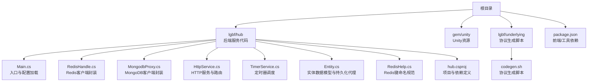
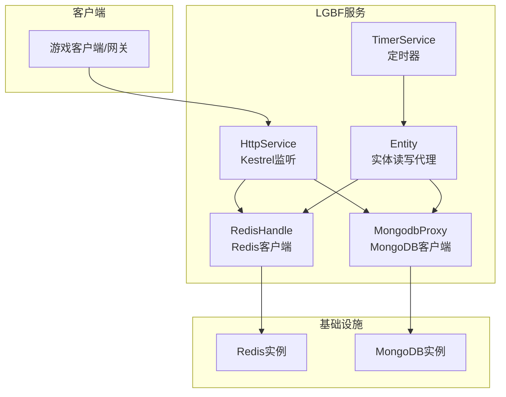
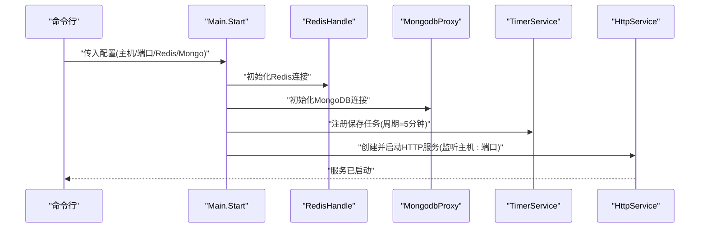
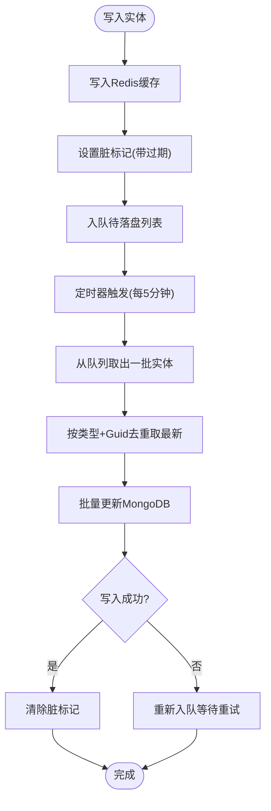
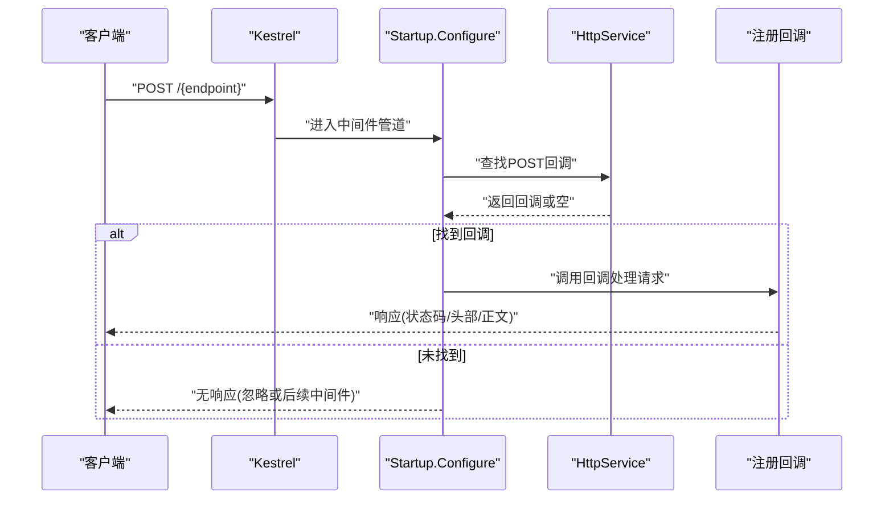
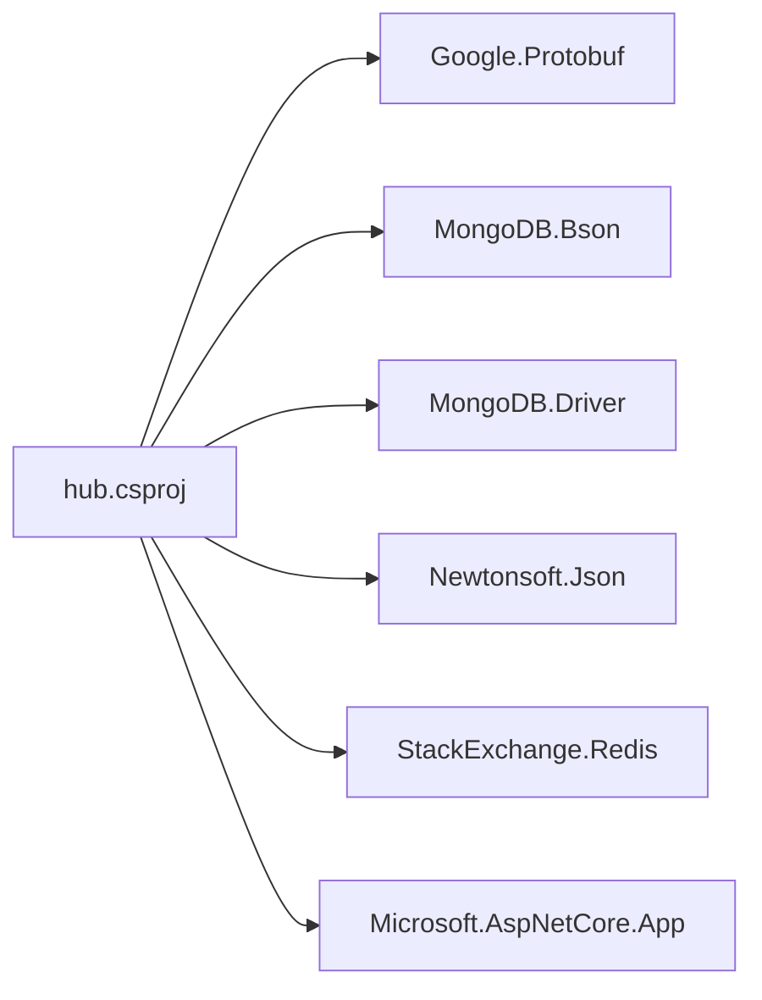

# 部署步骤

<cite>
**本文引用的文件**
- [README.md](file://README.md)
- [Main.cs](file://lgbf/hub/Main.cs)
- [hub.csproj](file://lgbf/hub/hub.csproj)
- [RedisHandle.cs](file://lgbf/hub/RedisHandle.cs)
- [MongodbProxy.cs](file://lgbf/hub/MongodbProxy.cs)
- [HttpService.cs](file://lgbf/hub/HttpService.cs)
- [TimerService.cs](file://lgbf/hub/TimerService.cs)
- [Entity.cs](file://lgbf/hub/Entity.cs)
- [RedisHelp.cs](file://lgbf/hub/RedisHelp.cs)
- [package.json](file://package.json)
- [codegen.sh](file://lgbf/underlying/codegen.sh)
</cite>

## 目录
1. [简介](#简介)
2. [项目结构](#项目结构)
3. [核心组件](#核心组件)
4. [架构总览](#架构总览)
5. [详细组件分析](#详细组件分析)
6. [依赖分析](#依赖分析)
7. [性能考虑](#性能考虑)
8. [故障排查指南](#故障排查指南)
9. [结论](#结论)
10. [附录](#附录)

## 简介
本指南面向LGBF（轻量级游戏后端框架）标准服务器的生产部署，覆盖从源码编译到服务启动与运行维护的全流程。内容包括：
- 构建与编译命令
- 配置文件修改要点
- 数据库与缓存初始化
- Redis与MongoDB连接参数说明
- 服务启动与停止命令
- 注册为系统服务的方法
- 部署后验证与健康检查
- 常见部署问题排查

## 项目结构
仓库采用多模块组织方式：Unity/Gem资源与C#后端逻辑分离；后端位于lgbf/hub目录，使用.NET 10作为目标框架，并通过NuGet包管理器引入Redis、MongoDB等依赖。

图表来源
- [Main.cs:1-159](file://lgbf/hub/Main.cs#L1-L159)
- [hub.csproj:1-20](file://lgbf/hub/hub.csproj#L1-L20)
- [RedisHandle.cs:1-544](file://lgbf/hub/RedisHandle.cs#L1-L544)
- [MongodbProxy.cs:1-221](file://lgbf/hub/MongodbProxy.cs#L1-L221)
- [HttpService.cs:1-182](file://lgbf/hub/HttpService.cs#L1-L182)
- [TimerService.cs:1-126](file://lgbf/hub/TimerService.cs#L1-L126)
- [Entity.cs:1-154](file://lgbf/hub/Entity.cs#L1-L154)
- [RedisHelp.cs:1-20](file://lgbf/hub/RedisHelp.cs#L1-L20)
- [codegen.sh](file://lgbf/underlying/codegen.sh)
- [package.json:1-6](file://package.json#L1-L6)

章节来源
- [README.md:1-3](file://README.md#L1-L3)
- [hub.csproj:1-20](file://lgbf/hub/hub.csproj#L1-L20)

## 核心组件
- 入口与配置
  - 通过配置对象加载主机、端口、Redis与MongoDB连接信息，初始化Redis与MongoDB客户端，启动HTTP服务与定时保存任务。
- Redis客户端
  - 提供字符串、字节数组、列表、有序集合、哈希、分布式锁等常用操作，具备自动重连与异常恢复机制。
- MongoDB客户端
  - 提供插入、更新、批量更新、查询、计数、删除、自增GUID等能力，支持BSON文档序列化。
- HTTP服务
  - 基于Kestrel，支持HTTP/1.1与HTTP/2，内置跨域头，接收POST请求并按路径路由到回调。
- 定时器服务
  - 提供毫秒级轮询与日/周/月周期性任务调度，用于周期性保存脏数据等后台任务。
- 实体与持久化
  - 以类型+Guid为维度在Redis中存储实体快照，通过“脏标记+队列”异步批量写入MongoDB，保证高并发下的最终一致。

章节来源
- [Main.cs:1-159](file://lgbf/hub/Main.cs#L1-L159)
- [RedisHandle.cs:1-544](file://lgbf/hub/RedisHandle.cs#L1-L544)
- [MongodbProxy.cs:1-221](file://lgbf/hub/MongodbProxy.cs#L1-L221)
- [HttpService.cs:1-182](file://lgbf/hub/HttpService.cs#L1-L182)
- [TimerService.cs:1-126](file://lgbf/hub/TimerService.cs#L1-L126)
- [Entity.cs:1-154](file://lgbf/hub/Entity.cs#L1-L154)
- [RedisHelp.cs:1-20](file://lgbf/hub/RedisHelp.cs#L1-L20)

## 架构总览
下图展示LGBF服务器在生产环境中的典型拓扑：客户端通过HTTP访问服务，服务内部通过Redis进行实体缓存与异步落盘协调，通过MongoDB进行持久化存储。

图表来源
- [HttpService.cs:117-182](file://lgbf/hub/HttpService.cs#L117-L182)
- [RedisHandle.cs:13-544](file://lgbf/hub/RedisHandle.cs#L13-L544)
- [MongodbProxy.cs:10-221](file://lgbf/hub/MongodbProxy.cs#L10-L221)
- [TimerService.cs:7-126](file://lgbf/hub/TimerService.cs#L7-L126)
- [Entity.cs:94-154](file://lgbf/hub/Entity.cs#L94-L154)

## 详细组件分析

### 组件A：服务启动与配置加载
- 启动流程
  - 初始化Redis与MongoDB客户端
  - 注册定时保存任务（周期性从Redis队列批量写入MongoDB）
  - 创建并启动HTTP服务（监听指定主机与端口）
- 关键参数
  - 主机地址、端口、Redis连接URL与密码、MongoDB连接URL
- 停止流程
  - 关闭HTTP服务，等待优雅退出

图表来源
- [Main.cs:31-48](file://lgbf/hub/Main.cs#L31-L48)
- [HttpService.cs:149-173](file://lgbf/hub/HttpService.cs#L149-L173)

章节来源
- [Main.cs:31-48](file://lgbf/hub/Main.cs#L31-L48)
- [HttpService.cs:149-173](file://lgbf/hub/HttpService.cs#L149-L173)

### 组件B：Redis客户端与实体持久化
- 能力概览
  - 字节/字符串读写、过期设置、条件写入、发布订阅、列表操作、有序集合、哈希、分布式锁
  - 自动重连与超时异常恢复
- 实体持久化策略
  - 写入Redis缓存，设置“脏标记”，并将实体加入“待落盘队列”
  - 定时器周期性从队列取最新版本，按类型聚合，批量写入MongoDB
  - 若写入失败，重新入队，等待下次重试

图表来源
- [Entity.cs:52-92](file://lgbf/hub/Entity.cs#L52-L92)
- [RedisHandle.cs:257-303](file://lgbf/hub/RedisHandle.cs#L257-L303)
- [MongodbProxy.cs:102-120](file://lgbf/hub/MongodbProxy.cs#L102-L120)
- [Main.cs:50-157](file://lgbf/hub/Main.cs#L50-L157)

章节来源
- [Entity.cs:31-154](file://lgbf/hub/Entity.cs#L31-L154)
- [RedisHandle.cs:56-303](file://lgbf/hub/RedisHandle.cs#L56-L303)
- [MongodbProxy.cs:102-120](file://lgbf/hub/MongodbProxy.cs#L102-L120)
- [Main.cs:50-157](file://lgbf/hub/Main.cs#L50-L157)

### 组件C：HTTP服务与路由
- 功能特性
  - 支持HTTP/1.1与HTTP/2
  - 默认启用跨域头，允许POST/GET/OPTIONS
  - 按路径前缀路由到注册的回调函数
- 性能参数
  - 最大并发连接数、保活超时、监听协议

图表来源
- [HttpService.cs:50-114](file://lgbf/hub/HttpService.cs#L50-L114)
- [HttpService.cs:149-173](file://lgbf/hub/HttpService.cs#L149-L173)

章节来源
- [HttpService.cs:117-182](file://lgbf/hub/HttpService.cs#L117-L182)

### 组件D：定时器与后台任务
- 轮询机制
  - 每100ms轮询一次，刷新全局时间戳并驱动各类定时任务
- 任务类型
  - 周期性保存、日循环、周循环、月循环等
- 与实体保存的关系
  - 保存任务在定时器中被触发，周期性执行批量落盘逻辑

章节来源
- [TimerService.cs:68-125](file://lgbf/hub/TimerService.cs#L68-L125)
- [Main.cs:36-39](file://lgbf/hub/Main.cs#L36-L39)

## 依赖分析
- 运行时依赖
  - .NET 10运行时
  - Redis 与 MongoDB 客户端库
  - ASP.NET Core Kestrel
- 构建依赖
  - Google.Protobuf、MongoDB.Bson/Driver、Newtonsoft.Json、StackExchange.Redis
- 协议生成
  - underlying目录提供协议生成脚本，便于前后端通信契约同步

图表来源
- [hub.csproj:9-17](file://lgbf/hub/hub.csproj#L9-L17)

章节来源
- [hub.csproj:1-20](file://lgbf/hub/hub.csproj#L1-L20)
- [package.json:1-6](file://package.json#L1-L6)
- [codegen.sh](file://lgbf/underlying/codegen.sh)

## 性能考虑
- 连接与并发
  - Kestrel最大并发连接数、保活超时可按业务峰值调整
  - Redis/MongoDB连接池与超时需结合实例规格评估
- 落盘策略
  - 实体写回采用“脏标记+队列+批量更新”，降低写放大
  - 批量大小与周期可权衡延迟与吞吐
- 序列化
  - 使用BSON与JSON混合序列化，注意字段变更与向后兼容

## 故障排查指南
- 启动失败
  - 检查端口占用与防火墙
  - 确认配置文件中的主机、端口、Redis与MongoDB连接串正确
- Redis相关
  - 连接超时/断线：查看自动重连日志；确认网络连通与密码正确
  - 列表/锁操作异常：检查键空间与过期策略
- MongoDB相关
  - 插入/更新失败：检查集合权限、索引状态与写入选项
  - 批量写入失败：关注回退重试与队列堆积
- HTTP服务
  - 跨域失败：确认响应头是否正确下发
  - 请求超时：检查处理耗时与并发限制
- 健康检查
  - 通过HTTP接口发送OPTIONS请求验证跨域与可用性
  - 观察日志中连接统计与异常堆栈

章节来源
- [RedisHandle.cs:27-34](file://lgbf/hub/RedisHandle.cs#L27-L34)
- [MongodbProxy.cs:35-53](file://lgbf/hub/MongodbProxy.cs#L35-L53)
- [HttpService.cs:129-137](file://lgbf/hub/HttpService.cs#L129-L137)

## 结论
LGBF服务器通过清晰的模块划分与异步持久化策略，能够在高并发场景下稳定运行。生产部署的关键在于：
- 正确的构建与打包
- 合理的Redis与MongoDB配置
- 适配业务的HTTP与定时器参数
- 完善的监控与健康检查

## 附录

### A. 构建与编译
- 环境要求
  - .NET 10 SDK
  - Git（拉取子模块）
- 构建步骤
  - 拉取仓库与子模块
  - 还原NuGet包
  - 编译项目
- 可执行产物
  - 生成可在目标服务器运行的可执行文件或发布目录

章节来源
- [hub.csproj:1-20](file://lgbf/hub/hub.csproj#L1-L20)

### B. 配置文件与参数说明
- 必填参数
  - 主机地址、端口
  - Redis连接URL、密码
  - MongoDB连接URL
- 参数示例（说明性）
  - 主机：绑定地址（如0.0.0.0或具体内网IP）
  - 端口：对外服务端口（建议非特权端口）
  - Redis：支持密码认证与集群模式（根据实际部署形态配置）
  - MongoDB：支持副本集与认证（根据实际部署形态配置）

章节来源
- [Main.cs:4-11](file://lgbf/hub/Main.cs#L4-L11)

### C. 数据库初始化与Redis配置
- MongoDB
  - 确保数据库与集合存在；必要时创建唯一索引
  - 如需自增GUID，确保系统文档存在
- Redis
  - 准备命名空间与过期策略
  - 确认队列与键命名规则符合框架约定

章节来源
- [MongodbProxy.cs:35-74](file://lgbf/hub/MongodbProxy.cs#L35-L74)
- [RedisHelp.cs:4-19](file://lgbf/hub/RedisHelp.cs#L4-L19)

### D. 服务启动与停止
- 启动
  - 传入配置对象启动服务
- 停止
  - 调用关闭流程，等待HTTP服务优雅退出

章节来源
- [Main.cs:42-48](file://lgbf/hub/Main.cs#L42-L48)
- [HttpService.cs:175-181](file://lgbf/hub/HttpService.cs#L175-L181)

### E. 注册为系统服务（Linux systemd 示例）
- 创建服务单元文件
  - 指定可执行文件路径、工作目录、用户
  - 设置重启策略与环境变量
- 启用并启动服务
  - 启用开机自启与立即启动
- 日志与状态
  - 通过journalctl查看日志
  - 通过systemctl查看状态

章节来源
- [Main.cs:31-48](file://lgbf/hub/Main.cs#L31-L48)
- [HttpService.cs:149-173](file://lgbf/hub/HttpService.cs#L149-L173)

### F. 部署后验证与健康检查
- 健康检查
  - 发送OPTIONS请求验证跨域与可用性
  - 查看日志中的连接统计与异常
- 性能验证
  - 压测工具模拟请求，观察响应时间与错误率

章节来源
- [HttpService.cs:67-81](file://lgbf/hub/HttpService.cs#L67-L81)
- [HttpService.cs:129-137](file://lgbf/hub/HttpService.cs#L129-L137)