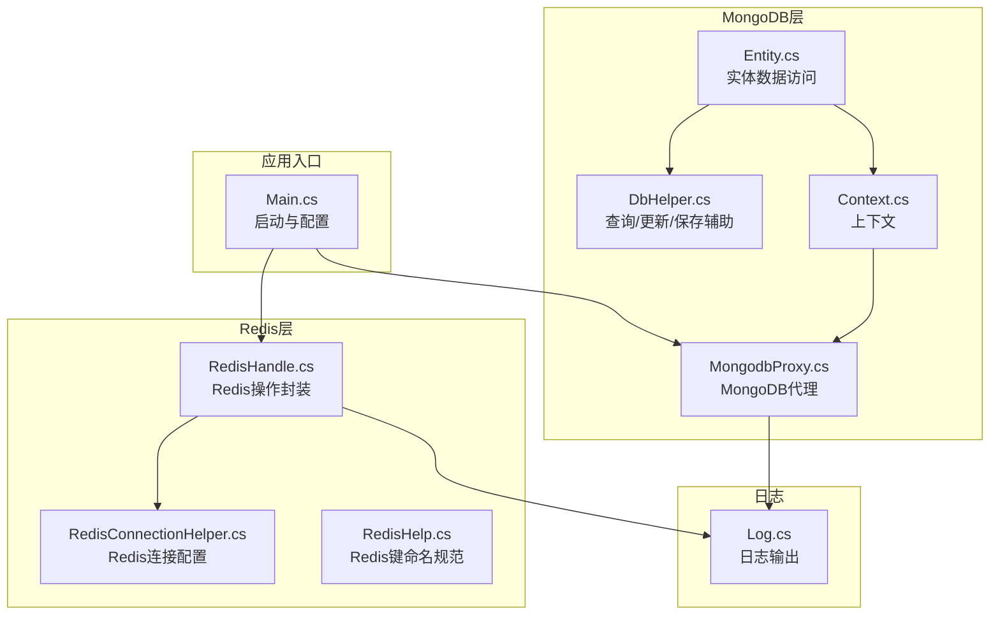
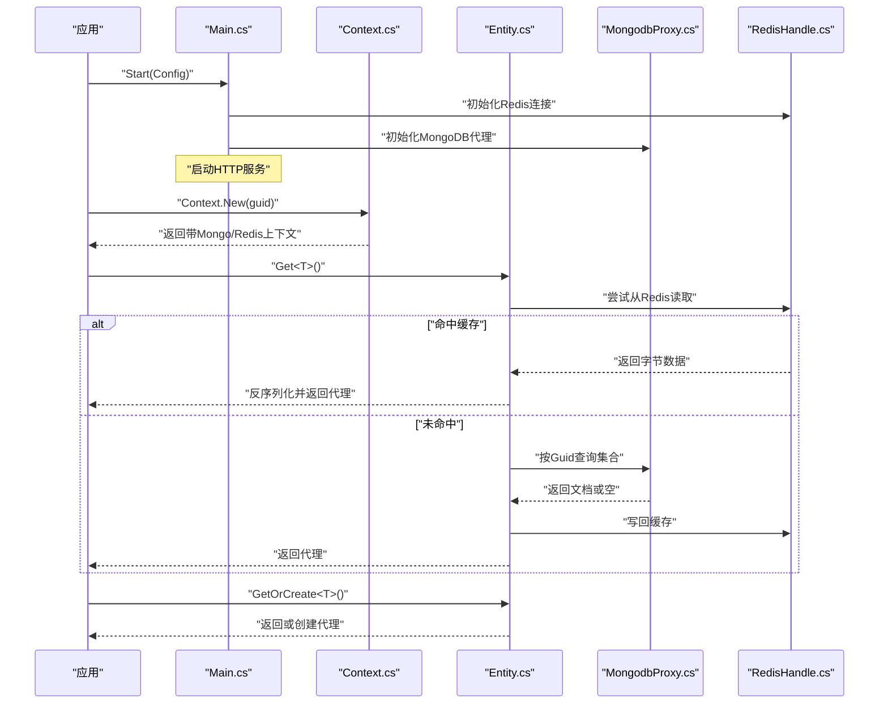
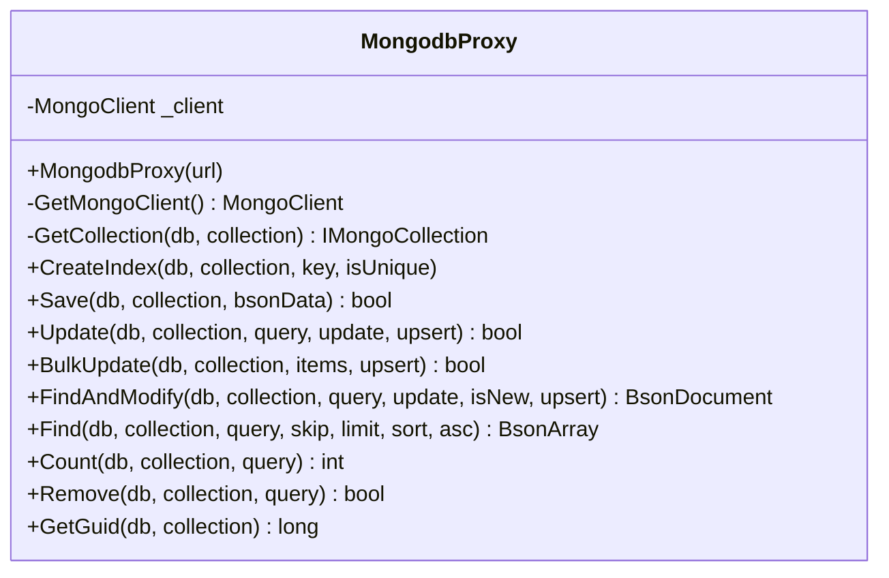
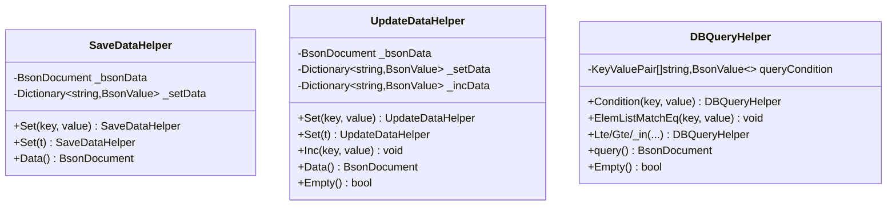
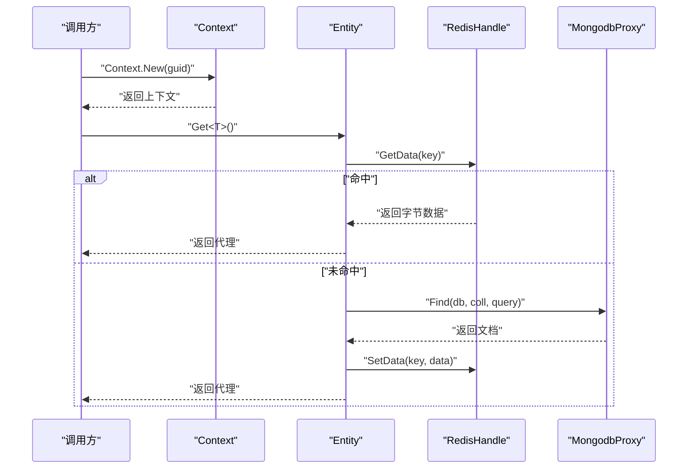
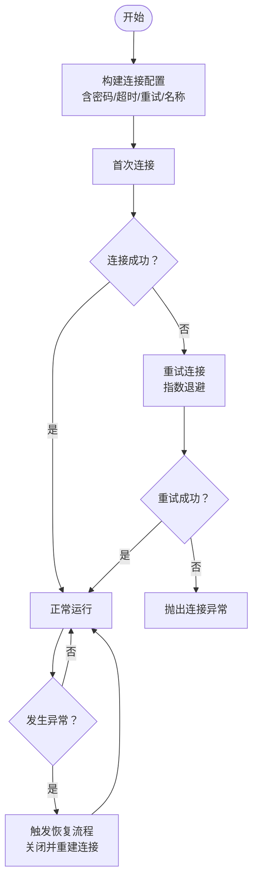
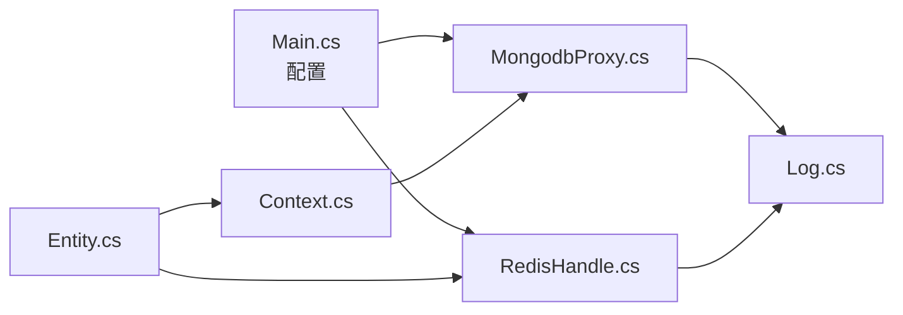

# MongoDB配置

<cite>
**本文档引用的文件**
- [Main.cs](file://lgbf/hub/Main.cs)
- [MongodbProxy.cs](file://lgbf/hub/MongodbProxy.cs)
- [DbHelper.cs](file://lgbf/hub/DbHelper.cs)
- [Entity.cs](file://lgbf/hub/Entity.cs)
- [Context.cs](file://lgbf/hub/Context.cs)
- [RedisConnectionHelper.cs](file://lgbf/hub/RedisConnectionHelper.cs)
- [RedisHandle.cs](file://lgbf/hub/RedisHandle.cs)
- [RedisHelp.cs](file://lgbf/hub/RedisHelp.cs)
- [Log.cs](file://lgbf/hub/Log.cs)
</cite>

## 目录
1. [简介](#简介)
2. [项目结构](#项目结构)
3. [核心组件](#核心组件)
4. [架构总览](#架构总览)
5. [详细组件分析](#详细组件分析)
6. [依赖关系分析](#依赖关系分析)
7. [性能考虑](#性能考虑)
8. [故障排除指南](#故障排除指南)
9. [结论](#结论)

## 简介
本指南聚焦于仓库中MongoDB数据库的配置与使用实践，结合现有代码实现，系统阐述以下内容：
- MongoDB连接字符串格式与参数配置（主机、端口、数据库名、认证、连接选项）
- 驱动程序配置要点（连接池、超时、SSL、副本集）
- 不同部署模式的配置示例（单机、副本集、分片集群）
- 索引创建与管理（唯一索引、复合索引、文本索引）
- 性能优化配置（批量操作、写入确认、读取偏好）
- 连接测试方法与常见问题排查

说明：当前代码以MongoDB官方C#驱动为基础，通过统一代理类封装常用操作；索引创建在运行时按需执行。本文档严格基于仓库源码进行分析与总结。

## 项目结构
围绕MongoDB配置与使用的相关文件主要位于lgbf/hub目录，关键文件如下：
- 配置入口与启动：Main.cs
- MongoDB代理：MongodbProxy.cs
- 查询/更新/保存辅助：DbHelper.cs
- 实体数据访问：Entity.cs、Context.cs
- Redis连接与恢复（作为MongoDB写入流程的前置缓存）：RedisConnectionHelper.cs、RedisHandle.cs、RedisHelp.cs
- 日志：Log.cs

图表来源
- [Main.cs:31-40](file://lgbf/hub/Main.cs#L31-L40)
- [MongodbProxy.cs:14-18](file://lgbf/hub/MongodbProxy.cs#L14-L18)
- [Entity.cs:118-135](file://lgbf/hub/Entity.cs#L118-L135)
- [Context.cs:11-26](file://lgbf/hub/Context.cs#L11-L26)
- [RedisHandle.cs:21-25](file://lgbf/hub/RedisHandle.cs#L21-L25)
- [RedisConnectionHelper.cs:26-33](file://lgbf/hub/RedisConnectionHelper.cs#L26-L33)

章节来源
- [Main.cs:31-40](file://lgbf/hub/Main.cs#L31-L40)
- [MongodbProxy.cs:14-18](file://lgbf/hub/MongodbProxy.cs#L14-L18)
- [Entity.cs:118-135](file://lgbf/hub/Entity.cs#L118-L135)
- [Context.cs:11-26](file://lgbf/hub/Context.cs#L11-L26)
- [RedisHandle.cs:21-25](file://lgbf/hub/RedisHandle.cs#L21-L25)
- [RedisConnectionHelper.cs:26-33](file://lgbf/hub/RedisConnectionHelper.cs#L26-L33)

## 核心组件
- 配置对象与启动流程
  - 配置项：主机、端口、Redis连接串、Redis密码、MongoDB连接串
  - 启动时初始化Redis与MongoDB代理，并启动HTTP服务
- MongoDB代理
  - 基于MongoDB官方C#驱动，支持索引创建、插入、更新、批量更新、查找修改、查询、计数、删除等
  - 支持Upsert、排序、跳过、限制、投影等常用选项
- 数据构建辅助
  - SaveDataHelper：构造保存文档
  - UpdateDataHelper：构造$set/$inc更新文档
  - DBQueryHelper：构造查询条件（支持相等、范围、集合包含、数组元素匹配等）
- 实体访问
  - 通过Context注入MongoDB代理，结合Redis实现“先读缓存、后读库”的策略
- Redis连接与恢复
  - 提供连接配置、重连机制、超时与重试策略

章节来源
- [Main.cs:4-11](file://lgbf/hub/Main.cs#L4-L11)
- [Main.cs:31-40](file://lgbf/hub/Main.cs#L31-L40)
- [MongodbProxy.cs:35-53](file://lgbf/hub/MongodbProxy.cs#L35-L53)
- [MongodbProxy.cs:76-120](file://lgbf/hub/MongodbProxy.cs#L76-L120)
- [MongodbProxy.cs:143-192](file://lgbf/hub/MongodbProxy.cs#L143-L192)
- [DbHelper.cs:4-69](file://lgbf/hub/DbHelper.cs#L4-L69)
- [DbHelper.cs:71-157](file://lgbf/hub/DbHelper.cs#L71-L157)
- [DbHelper.cs:160-310](file://lgbf/hub/DbHelper.cs#L160-L310)
- [Entity.cs:118-135](file://lgbf/hub/Entity.cs#L118-L135)
- [Context.cs:11-26](file://lgbf/hub/Context.cs#L11-L26)
- [RedisConnectionHelper.cs:26-33](file://lgbf/hub/RedisConnectionHelper.cs#L26-L33)
- [RedisHandle.cs:21-25](file://lgbf/hub/RedisHandle.cs#L21-L25)

## 架构总览
下图展示应用启动、实体读取与MongoDB写入的关键交互：

图表来源
- [Main.cs:31-40](file://lgbf/hub/Main.cs#L31-L40)
- [Context.cs:11-26](file://lgbf/hub/Context.cs#L11-L26)
- [Entity.cs:118-135](file://lgbf/hub/Entity.cs#L118-L135)
- [RedisHandle.cs:21-25](file://lgbf/hub/RedisHandle.cs#L21-L25)

## 详细组件分析

### MongoDB连接与代理（MongodbProxy）
- 连接建立
  - 使用MongoUrl解析连接串，创建MongoClient实例
  - 通过GetCollection(db, collection)获取集合引用
- 常用操作
  - 插入：InsertOneAsync
  - 更新：UpdateOneAsync（支持Upsert）
  - 批量更新：BulkWriteAsync（非有序批量）
  - 查找修改：FindOneAndUpdateAsync（可选返回新/旧文档、Upsert）
  - 查询：FindAsync（支持Skip/Limit/Sort/Projection）
  - 计数：CountDocumentsAsync
  - 删除：DeleteOneAsync
  - 索引：CreateOne（可指定唯一性）

图表来源
- [MongodbProxy.cs:14-18](file://lgbf/hub/MongodbProxy.cs#L14-L18)
- [MongodbProxy.cs:35-53](file://lgbf/hub/MongodbProxy.cs#L35-L53)
- [MongodbProxy.cs:76-120](file://lgbf/hub/MongodbProxy.cs#L76-L120)
- [MongodbProxy.cs:122-141](file://lgbf/hub/MongodbProxy.cs#L122-L141)
- [MongodbProxy.cs:143-192](file://lgbf/hub/MongodbProxy.cs#L143-L192)
- [MongodbProxy.cs:194-220](file://lgbf/hub/MongodbProxy.cs#L194-L220)

章节来源
- [MongodbProxy.cs:14-18](file://lgbf/hub/MongodbProxy.cs#L14-L18)
- [MongodbProxy.cs:35-53](file://lgbf/hub/MongodbProxy.cs#L35-L53)
- [MongodbProxy.cs:76-120](file://lgbf/hub/MongodbProxy.cs#L76-L120)
- [MongodbProxy.cs:122-141](file://lgbf/hub/MongodbProxy.cs#L122-L141)
- [MongodbProxy.cs:143-192](file://lgbf/hub/MongodbProxy.cs#L143-L192)
- [MongodbProxy.cs:194-220](file://lgbf/hub/MongodbProxy.cs#L194-L220)

### 查询/更新/保存辅助（DbHelper）
- SaveDataHelper
  - 支持键值对设置与整体BsonDocument设置
  - 输出单一BsonDocument
- UpdateDataHelper
  - 支持$set键值对与整体BsonDocument设置
  - 支持$inc增量更新
  - 输出合并后的更新文档
- DBQueryHelper
  - 支持多类型相等条件、范围条件、集合包含、数组元素匹配
  - 组合为$and查询条件

图表来源
- [DbHelper.cs:4-69](file://lgbf/hub/DbHelper.cs#L4-L69)
- [DbHelper.cs:71-157](file://lgbf/hub/DbHelper.cs#L71-L157)
- [DbHelper.cs:160-310](file://lgbf/hub/DbHelper.cs#L160-L310)

章节来源
- [DbHelper.cs:4-69](file://lgbf/hub/DbHelper.cs#L4-L69)
- [DbHelper.cs:71-157](file://lgbf/hub/DbHelper.cs#L71-L157)
- [DbHelper.cs:160-310](file://lgbf/hub/DbHelper.cs#L160-L310)

### 实体访问与上下文（Entity、Context）
- Context提供全局Mongo与Redis实例注入
- Entity优先从Redis读取，未命中则查询Mongo并回填Redis
- 写回采用延迟批量写入策略（见后续“性能考虑”）

图表来源
- [Context.cs:11-26](file://lgbf/hub/Context.cs#L11-L26)
- [Entity.cs:118-135](file://lgbf/hub/Entity.cs#L118-L135)
- [RedisHandle.cs:159-174](file://lgbf/hub/RedisHandle.cs#L159-L174)
- [MongodbProxy.cs:143-192](file://lgbf/hub/MongodbProxy.cs#L143-L192)

章节来源
- [Context.cs:11-26](file://lgbf/hub/Context.cs#L11-L26)
- [Entity.cs:118-135](file://lgbf/hub/Entity.cs#L118-L135)
- [RedisHandle.cs:159-174](file://lgbf/hub/RedisHandle.cs#L159-L174)
- [MongodbProxy.cs:143-192](file://lgbf/hub/MongodbProxy.cs#L143-L192)

### Redis连接与恢复（RedisConnectionHelper、RedisHandle）
- 连接配置
  - 支持无密码与带密码两种连接串格式
  - 关键参数：connectRetry、connectTimeout、keepAlive、resolveDns、name
- 恢复机制
  - 发生异常时自动关闭并重连，指数退避重试
  - 提供等待通知与超时控制

图表来源
- [RedisConnectionHelper.cs:130-142](file://lgbf/hub/RedisConnectionHelper.cs#L130-L142)
- [RedisConnectionHelper.cs:56-127](file://lgbf/hub/RedisConnectionHelper.cs#L56-L127)
- [RedisHandle.cs:27-34](file://lgbf/hub/RedisHandle.cs#L27-L34)

章节来源
- [RedisConnectionHelper.cs:130-142](file://lgbf/hub/RedisConnectionHelper.cs#L130-L142)
- [RedisConnectionHelper.cs:56-127](file://lgbf/hub/RedisConnectionHelper.cs#L56-L127)
- [RedisHandle.cs:27-34](file://lgbf/hub/RedisHandle.cs#L27-L34)

## 依赖关系分析
- 配置与启动
  - Main负责读取配置并初始化MongoDB代理与Redis连接
- 数据流
  - 实体读取：Redis → Mongo → Redis回填
  - 实体写回：内存代理 → Redis标记脏数据 → 定时批量写入Mongo
- 错误处理
  - Redis与MongoDB代理均通过日志记录错误信息

图表来源
- [Main.cs:31-40](file://lgbf/hub/Main.cs#L31-L40)
- [Entity.cs:118-135](file://lgbf/hub/Entity.cs#L118-L135)
- [Context.cs:11-26](file://lgbf/hub/Context.cs#L11-L26)
- [RedisHandle.cs:21-25](file://lgbf/hub/RedisHandle.cs#L21-L25)
- [Log.cs:55-58](file://lgbf/hub/Log.cs#L55-L58)

章节来源
- [Main.cs:31-40](file://lgbf/hub/Main.cs#L31-L40)
- [Entity.cs:118-135](file://lgbf/hub/Entity.cs#L118-L135)
- [Context.cs:11-26](file://lgbf/hub/Context.cs#L11-L26)
- [RedisHandle.cs:21-25](file://lgbf/hub/RedisHandle.cs#L21-L25)
- [Log.cs:55-58](file://lgbf/hub/Log.cs#L55-L58)

## 性能考虑
- 批量写入
  - 使用BulkWriteAsync（非有序）提升吞吐，适合定时批量写入场景
  - Main中每批次最多处理固定数量的脏数据条目
- 写入确认与一致性
  - 当前实现未显式设置写关注（write concern），默认遵循驱动默认行为
  - 如需强一致，可在MongoURL或客户端配置中调整写关注
- 读取偏好
  - 代码未设置读偏好（read preference），默认主节点读
  - 如需读副本集，可在MongoURL或客户端配置中启用
- 超时与重试
  - Redis侧具备超时与重试机制；MongoDB侧可通过MongoURL参数控制超时
- 索引优化
  - 建议在高频查询字段上创建唯一索引或复合索引，减少查询成本
  - 可根据业务需求创建文本索引（如需全文检索）

章节来源
- [Main.cs:16-16](file://lgbf/hub/Main.cs#L16-L16)
- [Main.cs:81-101](file://lgbf/hub/Main.cs#L81-L101)
- [Main.cs:125-125](file://lgbf/hub/Main.cs#L125-L125)
- [MongodbProxy.cs:118-118](file://lgbf/hub/MongodbProxy.cs#L118-L118)
- [MongodbProxy.cs:35-53](file://lgbf/hub/MongodbProxy.cs#L35-L53)

## 故障排除指南
- 连接失败
  - 检查MongoURL格式是否正确（协议、主机、端口、数据库、认证、选项）
  - 确认网络可达、防火墙放行端口
  - 若使用副本集或分片，确保连接串包含所有成员地址
- 认证失败
  - 确认用户名/密码正确，数据库用户权限足够
  - 如使用SCRAM-SHA机制，确保驱动版本与服务器兼容
- 超时与重连
  - Redis侧已内置超时检测与重连逻辑，若频繁断开，检查网络质量与keepAlive设置
  - MongoDB侧可通过MongoURL参数增加connectTimeout、serverSelectionTimeout等
- 写入异常
  - 观察日志输出，定位具体操作（插入/更新/批量）
  - 对批量写入，建议拆分批次并监控返回状态
- 索引创建失败
  - 检查字段类型与唯一性约束是否冲突
  - 确认目标集合存在且有足够权限

章节来源
- [RedisConnectionHelper.cs:56-127](file://lgbf/hub/RedisConnectionHelper.cs#L56-L127)
- [Log.cs:55-58](file://lgbf/hub/Log.cs#L55-L58)
- [MongodbProxy.cs:49-52](file://lgbf/hub/MongodbProxy.cs#L49-L52)

## 结论
本仓库以简洁方式集成MongoDB与Redis，形成“缓存优先、批量落库”的数据访问模式。MongoDB配置以MongoUrl为主，代理类封装了常用操作与索引创建能力。结合Redis的连接恢复与超时重试机制，整体具备较好的稳定性。建议在生产环境中进一步完善：
- 明确写关注与读偏好配置
- 针对热点字段建立合适的索引
- 对批量写入进行更细粒度的错误隔离与重试策略