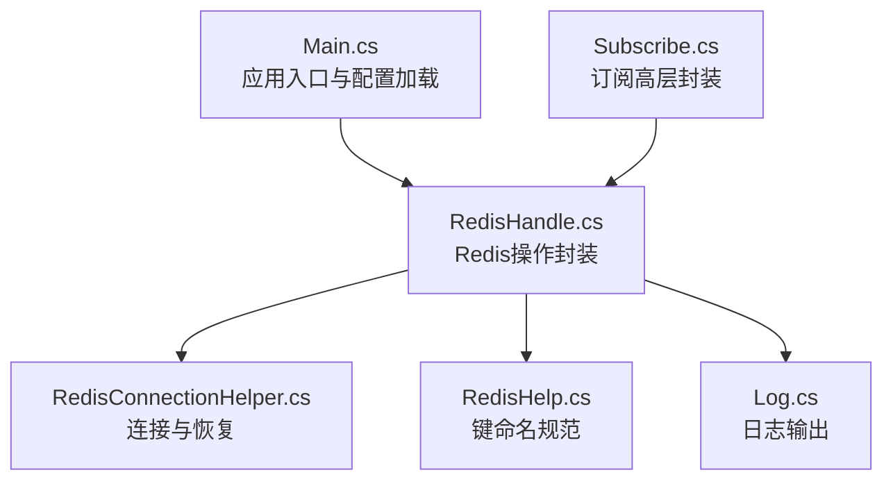
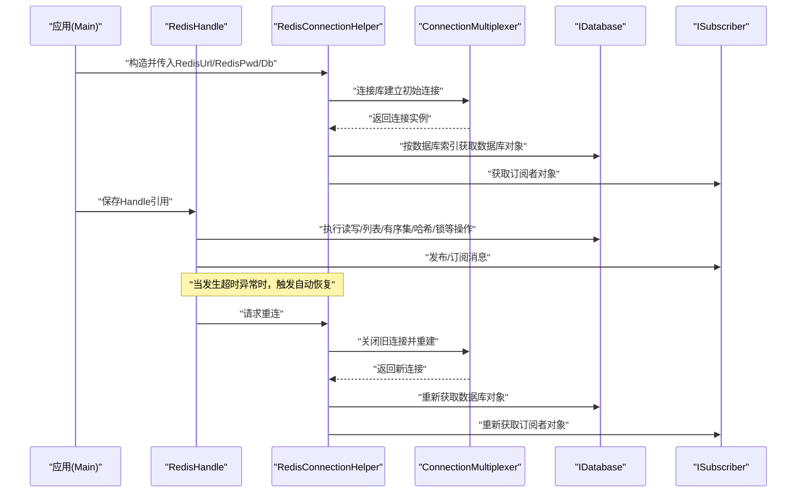
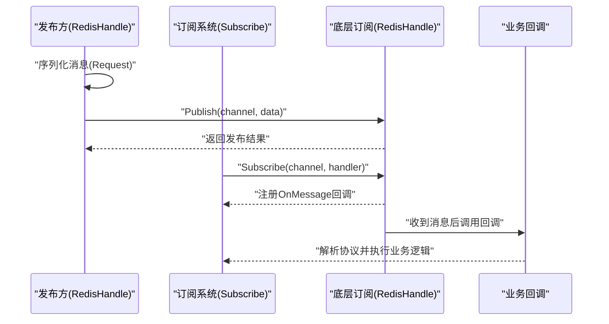
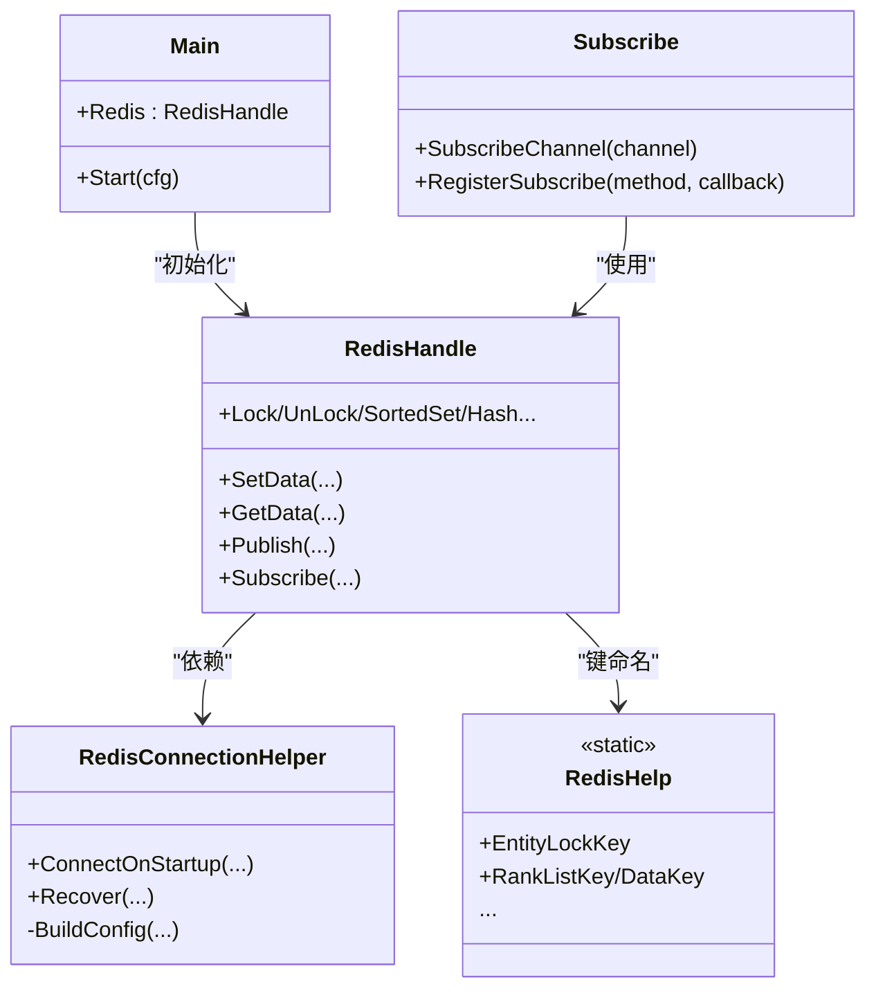
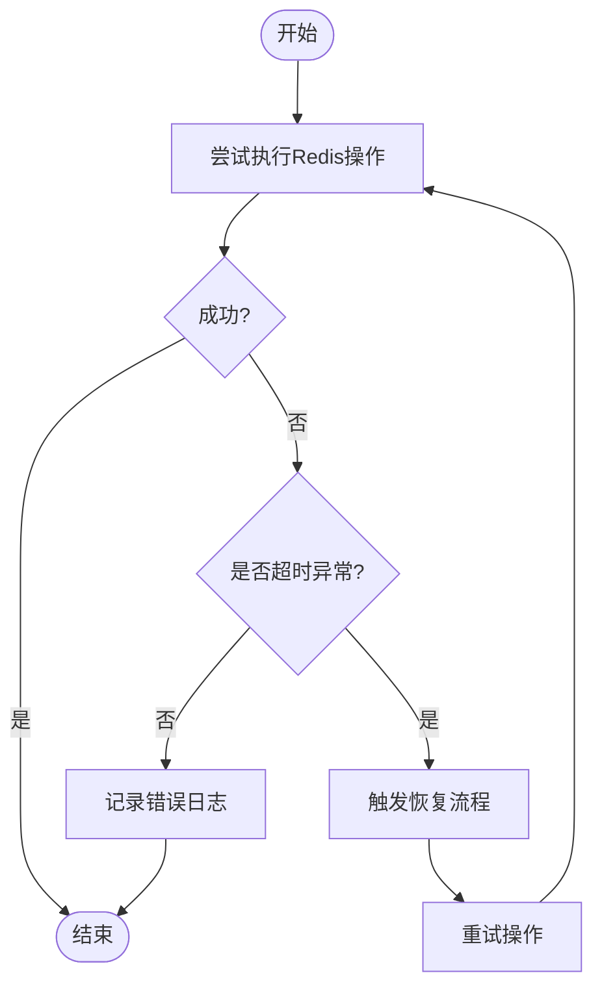

# Redis配置

<cite>
**本文引用的文件**
- [RedisConnectionHelper.cs](file://lgbf/hub/RedisConnectionHelper.cs)
- [RedisHandle.cs](file://lgbf/hub/RedisHandle.cs)
- [Main.cs](file://lgbf/hub/Main.cs)
- [RedisHelp.cs](file://lgbf/hub/RedisHelp.cs)
- [Subscribe.cs](file://lgbf/hub/Subscribe.cs)
- [Log.cs](file://lgbf/hub/Log.cs)
</cite>

## 目录
1. [简介](#简介)
2. [项目结构](#项目结构)
3. [核心组件](#核心组件)
4. [架构总览](#架构总览)
5. [详细组件分析](#详细组件分析)
6. [依赖关系分析](#依赖关系分析)
7. [性能考虑](#性能考虑)
8. [故障排查指南](#故障排查指南)
9. [结论](#结论)
10. [附录](#附录)

## 简介
本指南围绕仓库中的Redis数据库配置与使用进行系统性梳理，重点覆盖以下方面：
- Redis连接URL格式与连接参数（主机、端口、密码认证、数据库选择）
- 连接池配置要点（最大/最小连接、连接超时、命令超时等）
- 不同部署模式的配置示例（单机、主从复制、哨兵模式、Cluster集群）
- 高级配置选项（密码认证、SSL/TLS、管道连接、事务处理）
- 性能调优参数（内存、持久化、网络优化）
- 连接状态监控与连接池健康检查
- 订阅发布机制的配置与使用注意事项

本指南以仓库中实际实现为依据，结合代码注释与调用流程，帮助读者在不直接阅读源码的情况下快速掌握Redis配置与运维要点。

## 项目结构
与Redis配置直接相关的模块主要位于hub目录下，核心文件如下：
- RedisConnectionHelper：负责构建连接配置字符串、建立初始连接、异常恢复与重连
- RedisHandle：封装常用Redis操作（键值、列表、有序集合、哈希、锁、发布/订阅等），并对超时异常进行自动恢复
- Main：应用入口，读取配置并初始化RedisHandle
- RedisHelp：集中定义Redis键命名规范
- Subscribe：基于Redis订阅发布的高层封装
- Log：日志输出，用于记录连接与恢复过程的关键事件

图表来源
- [Main.cs:31-40](file://lgbf/hub/Main.cs#L31-L40)
- [RedisHandle.cs:21-25](file://lgbf/hub/RedisHandle.cs#L21-L25)
- [RedisConnectionHelper.cs:35-54](file://lgbf/hub/RedisConnectionHelper.cs#L35-L54)
- [Subscribe.cs:10-20](file://lgbf/hub/Subscribe.cs#L10-L20)

章节来源
- [Main.cs:31-40](file://lgbf/hub/Main.cs#L31-L40)
- [RedisHandle.cs:21-25](file://lgbf/hub/RedisHandle.cs#L21-L25)
- [RedisConnectionHelper.cs:35-54](file://lgbf/hub/RedisConnectionHelper.cs#L35-L54)
- [Subscribe.cs:10-20](file://lgbf/hub/Subscribe.cs#L10-L20)

## 核心组件
- RedisConnectionHelper
  - 负责根据传入的连接URL、名称、密码与数据库索引，生成连接配置字符串，并通过连接库建立初始连接
  - 提供异常恢复逻辑：在发生连接异常时尝试多次重连，并通过事件通知避免并发重连
  - 关键参数：连接重试次数、连接超时、保活间隔、DNS解析开关、连接名称
- RedisHandle
  - 对底层IDatabase与ISubscriber进行统一封装，提供字符串/二进制数据存取、键过期、列表操作、有序集合、哈希、分布式锁、发布/订阅等
  - 对RedisTimeoutException进行捕获与自动恢复，确保服务稳定性
- Main
  - 定义配置结构体，包含RedisUrl与RedisPwd等字段；启动时实例化RedisHandle
- RedisHelp
  - 统一管理键前缀与命名规则，便于维护与扩展
- Subscribe
  - 基于Redis订阅发布机制，对消息进行解析与回调分发
- Log
  - 提供统一的日志输出，便于追踪连接、恢复与错误信息

章节来源
- [RedisConnectionHelper.cs:26-33](file://lgbf/hub/RedisConnectionHelper.cs#L26-L33)
- [RedisConnectionHelper.cs:35-54](file://lgbf/hub/RedisConnectionHelper.cs#L35-L54)
- [RedisConnectionHelper.cs:56-127](file://lgbf/hub/RedisConnectionHelper.cs#L56-L127)
- [RedisConnectionHelper.cs:130-142](file://lgbf/hub/RedisConnectionHelper.cs#L130-L142)
- [RedisHandle.cs:13-34](file://lgbf/hub/RedisHandle.cs#L13-L34)
- [RedisHandle.cs:36-109](file://lgbf/hub/RedisHandle.cs#L36-L109)
- [Main.cs:4-11](file://lgbf/hub/Main.cs#L4-L11)
- [Main.cs:31-40](file://lgbf/hub/Main.cs#L31-L40)
- [RedisHelp.cs:4-19](file://lgbf/hub/RedisHelp.cs#L4-L19)
- [Subscribe.cs:4-37](file://lgbf/hub/Subscribe.cs#L4-L37)
- [Log.cs:6-58](file://lgbf/hub/Log.cs#L6-L58)

## 架构总览
下图展示了应用如何通过配置初始化Redis连接，并在运行时通过RedisHandle执行各类操作，同时在出现超时时触发自动恢复流程。

图表来源
- [Main.cs:31-40](file://lgbf/hub/Main.cs#L31-L40)
- [RedisHandle.cs:21-34](file://lgbf/hub/RedisHandle.cs#L21-L34)
- [RedisConnectionHelper.cs:35-54](file://lgbf/hub/RedisConnectionHelper.cs#L35-L54)
- [RedisConnectionHelper.cs:56-127](file://lgbf/hub/RedisConnectionHelper.cs#L56-L127)

## 详细组件分析

### Redis连接URL格式与连接参数
- 连接URL与参数
  - 仓库中通过连接库提供的配置字符串拼接方式，将连接URL、密码、连接重试次数、连接超时、保活间隔、DNS解析开关与连接名称组合为最终配置
  - 当存在密码时，配置中会包含密码参数；否则仅包含基础连接参数
- 主机与端口
  - 连接URL中应包含主机与端口信息，具体格式由连接库解析
- 密码认证
  - 若提供密码，则在配置字符串中显式包含密码参数
- 数据库选择
  - 初始化时通过数据库索引参数选择目标数据库

章节来源
- [RedisConnectionHelper.cs:130-142](file://lgbf/hub/RedisConnectionHelper.cs#L130-L142)

### 连接池配置要点
- 连接重试与超时
  - 连接建立阶段与恢复阶段均设置了重试次数与超时时间，避免瞬时故障导致服务不可用
  - 恢复过程中采用指数退避策略，逐步增加延迟上限，降低对上游的压力
- 保活与DNS解析
  - 启用保活与DNS解析，有助于维持长连接稳定与域名解析一致性
- 并发控制
  - 通过原子标志位与事件通知，避免并发重连导致的资源竞争

章节来源
- [RedisConnectionHelper.cs:8-23](file://lgbf/hub/RedisConnectionHelper.cs#L8-L23)
- [RedisConnectionHelper.cs:56-127](file://lgbf/hub/RedisConnectionHelper.cs#L56-L127)

### 不同部署模式的配置示例
说明：以下为通用配置思路与参数映射，具体URL格式请参考连接库文档；仓库中未提供各模式的完整URL示例，但可据此映射到实际连接字符串。

- 单机模式
  - 连接URL包含单个主机与端口，若启用密码则在配置中加入密码参数
- 主从复制
  - 可使用连接库支持的多节点配置或通过代理/路由层实现读写分离
- 哨兵模式
  - 使用哨兵命名的连接字符串，连接库会自动发现主从切换
- Cluster集群
  - 使用Cluster命名的连接字符串，连接库会自动管理槽位与节点路由

章节来源
- [RedisConnectionHelper.cs:130-142](file://lgbf/hub/RedisConnectionHelper.cs#L130-L142)

### 高级配置选项
- 密码认证
  - 在配置字符串中显式包含密码参数
- SSL/TLS加密
  - 可通过连接库支持的TLS参数进行配置（具体参数名以连接库为准）
- 管道连接与事务处理
  - 仓库中未直接展示管道与事务的具体实现；可通过连接库的事务API在需要时扩展

章节来源
- [RedisConnectionHelper.cs:130-142](file://lgbf/hub/RedisConnectionHelper.cs#L130-L142)

### 键命名与业务键空间
- 仓库通过RedisHelp集中定义了实体锁、令牌转换、实体存储、计分板等键命名规范，便于统一管理与迁移

章节来源
- [RedisHelp.cs:4-19](file://lgbf/hub/RedisHelp.cs#L4-L19)

### 发布/订阅机制
- 发布
  - RedisHandle提供Publish方法，将消息序列化后通过ISubscriber发布到指定频道
- 订阅
  - RedisHandle提供Subscribe方法，注册频道监听并在收到消息后回调处理
  - Subscribe类进一步封装，按协议类型解析消息并分发给对应回调

图表来源
- [RedisHandle.cs:197-223](file://lgbf/hub/RedisHandle.cs#L197-L223)
- [RedisHandle.cs:225-255](file://lgbf/hub/RedisHandle.cs#L225-L255)
- [Subscribe.cs:10-37](file://lgbf/hub/Subscribe.cs#L10-L37)

章节来源
- [RedisHandle.cs:197-223](file://lgbf/hub/RedisHandle.cs#L197-L223)
- [RedisHandle.cs:225-255](file://lgbf/hub/RedisHandle.cs#L225-L255)
- [Subscribe.cs:10-37](file://lgbf/hub/Subscribe.cs#L10-L37)

## 依赖关系分析
- 组件耦合
  - RedisHandle依赖RedisConnectionHelper进行连接与恢复
  - Main负责初始化RedisHandle并注入配置
  - Subscribe依赖RedisHandle进行订阅与消息分发
- 外部依赖
  - StackExchange.Redis：连接库与API
  - Newtonsoft.Json：序列化/反序列化
  - Protobuf：消息编解码（与订阅发布配合）

图表来源
- [Main.cs:18-26](file://lgbf/hub/Main.cs#L18-L26)
- [RedisHandle.cs:13-34](file://lgbf/hub/RedisHandle.cs#L13-L34)
- [RedisConnectionHelper.cs:6-33](file://lgbf/hub/RedisConnectionHelper.cs#L6-L33)
- [Subscribe.cs:4-37](file://lgbf/hub/Subscribe.cs#L4-L37)
- [RedisHelp.cs:4-19](file://lgbf/hub/RedisHelp.cs#L4-L19)

章节来源
- [Main.cs:18-26](file://lgbf/hub/Main.cs#L18-L26)
- [RedisHandle.cs:13-34](file://lgbf/hub/RedisHandle.cs#L13-L34)
- [RedisConnectionHelper.cs:6-33](file://lgbf/hub/RedisConnectionHelper.cs#L6-L33)
- [Subscribe.cs:4-37](file://lgbf/hub/Subscribe.cs#L4-L37)
- [RedisHelp.cs:4-19](file://lgbf/hub/RedisHelp.cs#L4-L19)

## 性能考虑
- 连接与超时
  - 合理设置连接重试次数与超时，避免瞬时抖动影响可用性
  - 恢复阶段采用指数退避，防止雪崩效应
- 命令超时与重试
  - 对可能超时的操作进行捕获与自动重试，减少业务中断
- 键命名与数据结构
  - 使用RedisHelp统一键命名，便于后续优化与迁移
- 列表与批量操作
  - 通过列表操作实现异步落盘与批处理，降低写放大

章节来源
- [RedisConnectionHelper.cs:8-23](file://lgbf/hub/RedisConnectionHelper.cs#L8-L23)
- [RedisHandle.cs:36-109](file://lgbf/hub/RedisHandle.cs#L36-L109)
- [RedisHelp.cs:4-19](file://lgbf/hub/RedisHelp.cs#L4-L19)

## 故障排查指南
- 连接失败
  - 观察日志中“无法连接到Redis”的错误信息，确认连接URL、密码与网络可达性
- 异常恢复
  - 当发生连接异常时，系统会尝试多次重连；若恢复失败，日志会记录恢复次数与最终失败原因
- 超时异常
  - 对于RedisTimeoutException，系统会触发恢复流程并短暂退避后重试
- 订阅异常
  - 订阅回调中若发生异常，系统会尝试恢复并继续监听

图表来源
- [RedisHandle.cs:36-109](file://lgbf/hub/RedisHandle.cs#L36-L109)
- [RedisConnectionHelper.cs:56-127](file://lgbf/hub/RedisConnectionHelper.cs#L56-L127)
- [Log.cs:55-58](file://lgbf/hub/Log.cs#L55-L58)

章节来源
- [RedisHandle.cs:36-109](file://lgbf/hub/RedisHandle.cs#L36-L109)
- [RedisConnectionHelper.cs:56-127](file://lgbf/hub/RedisConnectionHelper.cs#L56-L127)
- [Log.cs:55-58](file://lgbf/hub/Log.cs#L55-L58)

## 结论
本指南基于仓库中的Redis实现，总结了连接URL与参数、连接池配置要点、不同部署模式的配置思路、高级选项、性能调优与故障排查方法。建议在生产环境中：
- 明确部署模式并正确拼接连接URL与参数
- 设置合理的连接重试与超时策略
- 使用统一的键命名规范与数据结构设计
- 建立完善的日志与监控体系，及时发现并处理异常

## 附录
- 配置字段说明
  - RedisUrl：Redis连接URL
  - RedisPwd：Redis密码
  - Host/Port：HTTP服务绑定地址与端口（与Redis无直接关系，但用于应用启动）
- 常见问题
  - 连接URL格式错误：请核对主机、端口与密码参数
  - 订阅消息未到达：检查频道名称与消息序列化/反序列化逻辑

章节来源
- [Main.cs:4-11](file://lgbf/hub/Main.cs#L4-L11)
- [Main.cs:31-40](file://lgbf/hub/Main.cs#L31-L40)