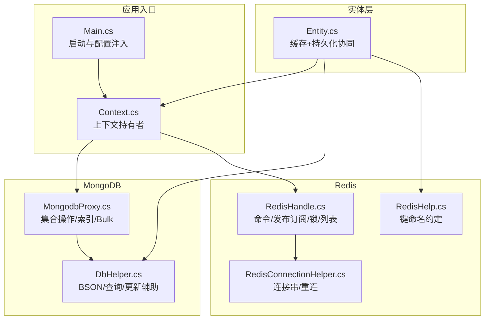
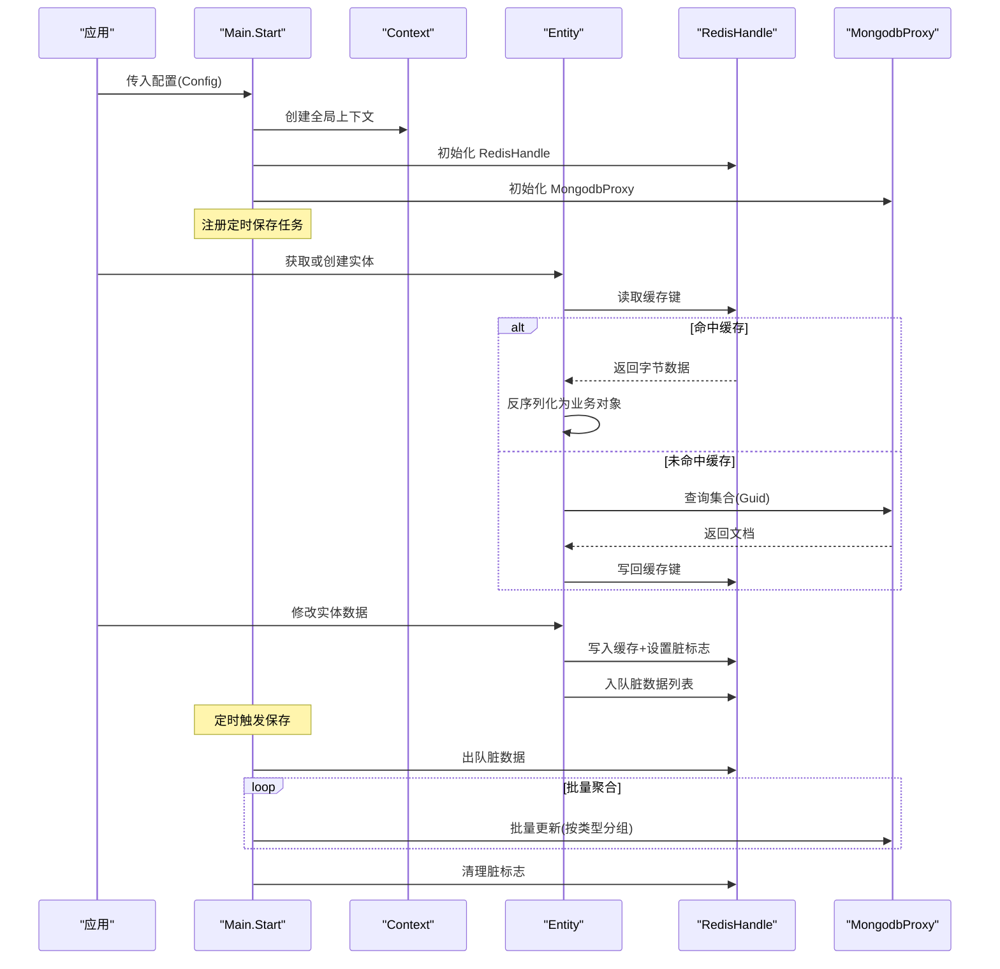
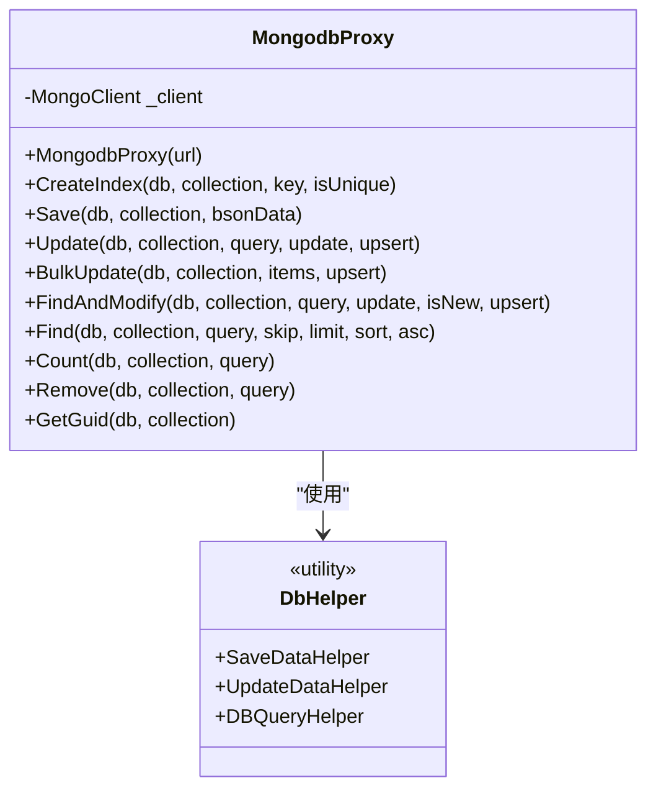
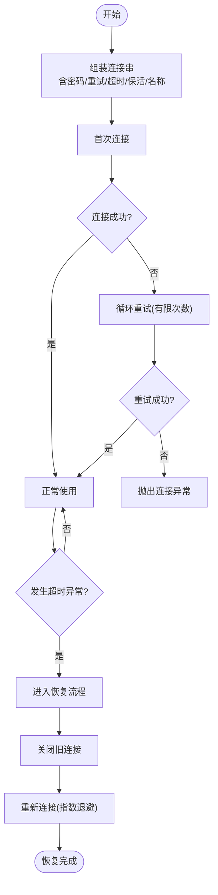
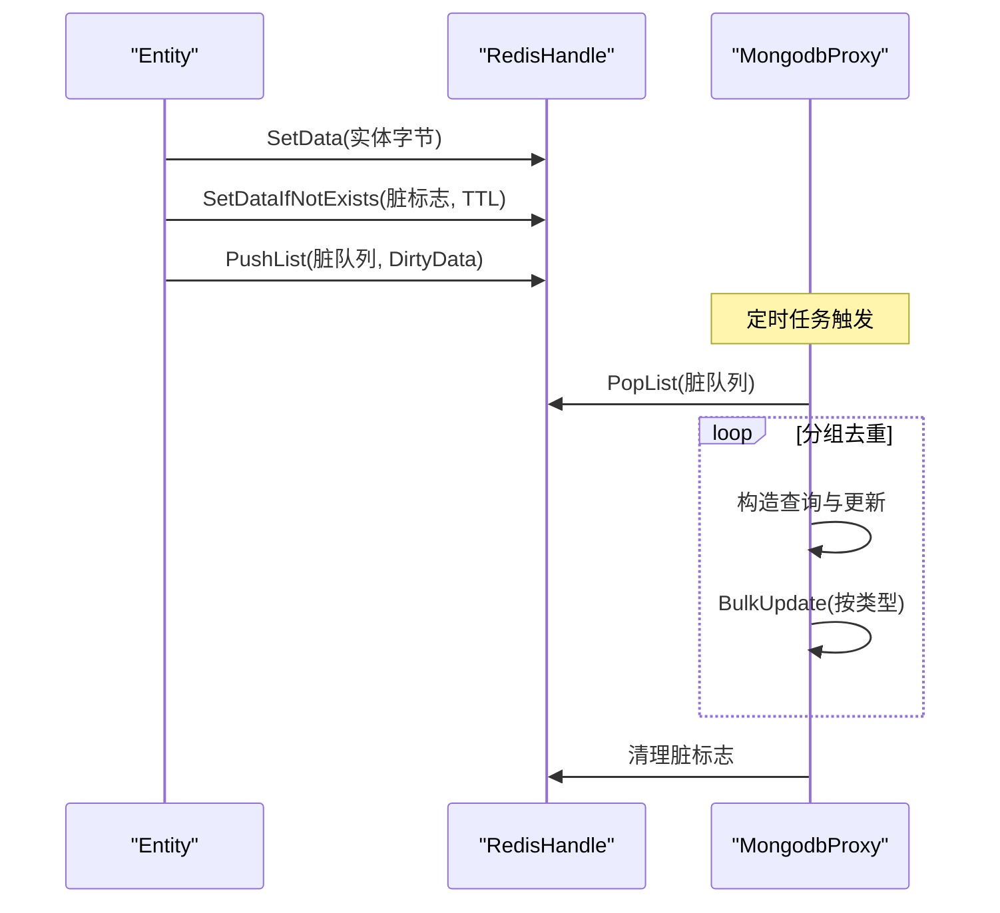
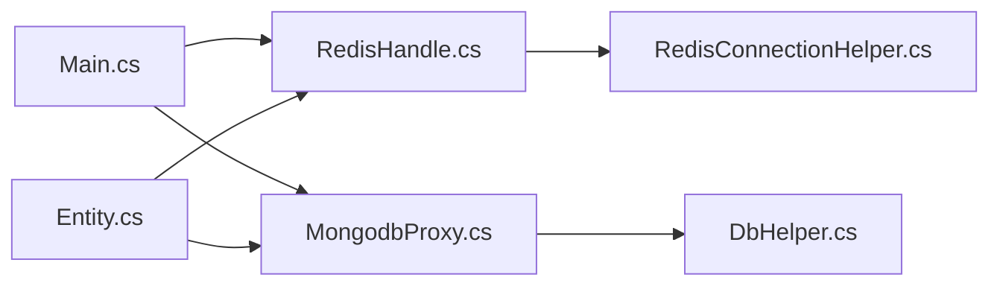

# 数据库配置

<cite>
**本文引用的文件**
- [hub.csproj](file://lgbf/hub/hub.csproj)
- [Main.cs](file://lgbf/hub/Main.cs)
- [Context.cs](file://lgbf/hub/Context.cs)
- [MongodbProxy.cs](file://lgbf/hub/MongodbProxy.cs)
- [DbHelper.cs](file://lgbf/hub/DbHelper.cs)
- [RedisConnectionHelper.cs](file://lgbf/hub/RedisConnectionHelper.cs)
- [RedisHandle.cs](file://lgbf/hub/RedisHandle.cs)
- [RedisHelp.cs](file://lgbf/hub/RedisHelp.cs)
- [Entity.cs](file://lgbf/hub/Entity.cs)
</cite>

## 目录
1. [简介](#简介)
2. [项目结构](#项目结构)
3. [核心组件](#核心组件)
4. [架构总览](#架构总览)
5. [详细组件分析](#详细组件分析)
6. [依赖分析](#依赖分析)
7. [性能考虑](#性能考虑)
8. [故障排查指南](#故障排查指南)
9. [结论](#结论)
10. [附录](#附录)

## 简介
本指南围绕 LGBF 项目的数据库配置展开，重点覆盖以下方面：
- MongoDB 连接与配置：连接字符串格式、认证方式、数据库与集合配置、索引与查询封装。
- Redis 连接与配置：连接串格式、密码认证、连接池与超时设置、重连策略与并发控制。
- 不同部署模式示例：单机、集群、哨兵模式的连接串写法要点（概念性说明）。
- 参数优化建议：连接池大小、超时时间、批量写入、重试与退避策略。
- 性能调优参数：批量更新、排序与投影、索引策略等。
- 配置验证方法与常见问题排查：日志定位、异常类型、恢复流程。
- 环境变量与配置文件优先级：当前实现中通过构造函数注入配置。

## 项目结构
LGBF 的数据库相关代码集中在 hub 子项目中，采用“接口+代理+工具类”的分层设计：
- 配置入口：Main 类负责读取外部配置并初始化全局实例。
- MongoDB：MongodbProxy 提供集合访问、索引、批量写入、查询等能力；DbHelper 提供构建 BSON 文档与查询条件的辅助类。
- Redis：RedisHandle 封装连接、命令执行、发布订阅、列表操作、分布式锁等；RedisConnectionHelper 负责连接串构建与重连逻辑。
- 实体存取：Entity 通过 Redis 缓存与 MongoDB 持久化协同，脏数据队列驱动异步落盘。

图表来源
- [Main.cs:31-40](file://lgbf/hub/Main.cs#L31-L40)
- [Context.cs:4-26](file://lgbf/hub/Context.cs#L4-L26)
- [MongodbProxy.cs:10-28](file://lgbf/hub/MongodbProxy.cs#L10-L28)
- [DbHelper.cs:4-157](file://lgbf/hub/DbHelper.cs#L4-L157)
- [RedisHandle.cs:13-34](file://lgbf/hub/RedisHandle.cs#L13-L34)
- [RedisConnectionHelper.cs:6-33](file://lgbf/hub/RedisConnectionHelper.cs#L6-L33)
- [RedisHelp.cs:4-19](file://lgbf/hub/RedisHelp.cs#L4-L19)
- [Entity.cs:94-153](file://lgbf/hub/Entity.cs#L94-L153)

章节来源
- [Main.cs:31-40](file://lgbf/hub/Main.cs#L31-L40)
- [Context.cs:4-26](file://lgbf/hub/Context.cs#L4-L26)

## 核心组件
- 配置模型与启动
  - 配置结构包含主机、端口、RedisUrl、RedisPwd、MongoUrl，用于 Main.Start 初始化。
  - 启动时创建 RedisHandle 与 MongodbProxy，并注册定时保存任务。
- MongoDB 代理
  - 支持创建索引、插入、更新、批量更新、查找+修改、查询、计数、删除、自增 Guid。
  - 查询与更新均以 BSON 字节流传入，内部反序列化为 BsonDocument。
- Redis 处理器
  - 提供字符串、哈希、有序集合、列表、发布订阅、分布式锁等常用操作。
  - 内置超时异常自动恢复机制，支持重连与并发等待。
- 键空间约定
  - RedisHelp 定义了实体存储、锁、脏标志、排行榜等键前缀，便于统一管理。

章节来源
- [Main.cs:4-11](file://lgbf/hub/Main.cs#L4-L11)
- [Main.cs:31-40](file://lgbf/hub/Main.cs#L31-L40)
- [MongodbProxy.cs:10-221](file://lgbf/hub/MongodbProxy.cs#L10-L221)
- [RedisHandle.cs:13-544](file://lgbf/hub/RedisHandle.cs#L13-L544)
- [RedisHelp.cs:4-19](file://lgbf/hub/RedisHelp.cs#L4-L19)

## 架构总览
下图展示从应用启动到数据读写的整体流程，以及 MongoDB 与 Redis 的协作关系。

图表来源
- [Main.cs:50-157](file://lgbf/hub/Main.cs#L50-L157)
- [Entity.cs:104-153](file://lgbf/hub/Entity.cs#L104-L153)
- [RedisHandle.cs:257-303](file://lgbf/hub/RedisHandle.cs#L257-L303)
- [MongodbProxy.cs:102-120](file://lgbf/hub/MongodbProxy.cs#L102-L120)

## 详细组件分析

### MongoDB 连接与配置
- 连接字符串格式
  - 使用 MongoUrl 解析传入的连接串，内部由 MongoDB.Driver 负责解析与建立连接。
  - 在 MongodbProxy 构造函数中接收连接串并创建 MongoClient。
- 认证方式
  - 连接串可包含用户名/密码等凭据；具体认证行为由 MongoUrl 解析决定。
- 数据库与集合配置
  - 通过 GetDatabase(db) 与 GetCollection(db, collection) 指定目标库与集合。
  - 默认使用固定数据库名与类型名作为集合名（例如 Main.Save 中使用 "game" 与类型名）。
- 索引与查询
  - CreateIndex 支持唯一索引；FindAndModify 支持返回更新前后文档；BulkUpdate 支持无序批量写入。
  - 查询与更新均以 BSON 字节流传入，DbHelper 提供 Set/Inc/Conditions 等辅助。

图表来源
- [MongodbProxy.cs:10-221](file://lgbf/hub/MongodbProxy.cs#L10-L221)
- [DbHelper.cs:4-311](file://lgbf/hub/DbHelper.cs#L4-L311)

章节来源
- [MongodbProxy.cs:14-28](file://lgbf/hub/MongodbProxy.cs#L14-L28)
- [MongodbProxy.cs:35-53](file://lgbf/hub/MongodbProxy.cs#L35-L53)
- [MongodbProxy.cs:76-100](file://lgbf/hub/MongodbProxy.cs#L76-L100)
- [MongodbProxy.cs:102-120](file://lgbf/hub/MongodbProxy.cs#L102-L120)
- [MongodbProxy.cs:122-141](file://lgbf/hub/MongodbProxy.cs#L122-L141)
- [MongodbProxy.cs:143-184](file://lgbf/hub/MongodbProxy.cs#L143-L184)
- [MongodbProxy.cs:186-192](file://lgbf/hub/MongodbProxy.cs#L186-L192)
- [MongodbProxy.cs:194-202](file://lgbf/hub/MongodbProxy.cs#L194-L202)
- [MongodbProxy.cs:204-219](file://lgbf/hub/MongodbProxy.cs#L204-L219)
- [DbHelper.cs:4-157](file://lgbf/hub/DbHelper.cs#L4-L157)

### Redis 连接与配置
- 连接串格式
  - RedisConnectionHelper.BuildConfig 组装连接串，支持 password、connectRetry、connectTimeout、keepAlive、resolveDns、name 等参数。
  - 当未提供密码时，不附加 password 字段；否则拼接 password=...。
- 密码认证
  - 通过构造函数传入 pwd，BuildConfig 自动写入连接串。
- 连接池与超时
  - connectRetry、connectTimeout、keepAlive 等参数由底层 StackExchange.Redis 解析生效。
  - RedisHandle 对超时异常进行捕获并触发自动恢复流程。
- 重连策略
  - Recover 流程循环尝试重建连接，指数退避上限控制，成功后回调 afterRecover。
  - 并发重连通过 _inRecover 与 ManualResetEvent 协调，避免重复恢复。

图表来源
- [RedisConnectionHelper.cs:26-33](file://lgbf/hub/RedisConnectionHelper.cs#L26-L33)
- [RedisConnectionHelper.cs:130-142](file://lgbf/hub/RedisConnectionHelper.cs#L130-L142)
- [RedisConnectionHelper.cs:35-54](file://lgbf/hub/RedisConnectionHelper.cs#L35-L54)
- [RedisConnectionHelper.cs:56-127](file://lgbf/hub/RedisConnectionHelper.cs#L56-L127)
- [RedisHandle.cs:27-34](file://lgbf/hub/RedisHandle.cs#L27-L34)

章节来源
- [RedisConnectionHelper.cs:26-33](file://lgbf/hub/RedisConnectionHelper.cs#L26-L33)
- [RedisConnectionHelper.cs:130-142](file://lgbf/hub/RedisConnectionHelper.cs#L130-L142)
- [RedisConnectionHelper.cs:56-127](file://lgbf/hub/RedisConnectionHelper.cs#L56-L127)
- [RedisHandle.cs:27-34](file://lgbf/hub/RedisHandle.cs#L27-L34)
- [RedisHandle.cs:36-54](file://lgbf/hub/RedisHandle.cs#L36-L54)

### 实体存取与脏数据落盘
- 缓存优先策略
  - 优先从 Redis 读取实体字节，命中则反序列化；未命中则查询 MongoDB 并回填 Redis。
- 脏数据队列
  - 写回时先写 Redis，再设置脏标志键，最后将 DirtyData 推入列表。
- 异步批量落盘
  - Main.Save 每周期从队列出队，按类型分组去重，构造查询与更新，调用 MongodbProxy.BulkUpdate 执行批量更新。

图表来源
- [Entity.cs:52-91](file://lgbf/hub/Entity.cs#L52-L91)
- [Entity.cs:104-153](file://lgbf/hub/Entity.cs#L104-L153)
- [Main.cs:81-146](file://lgbf/hub/Main.cs#L81-L146)
- [MongodbProxy.cs:102-120](file://lgbf/hub/MongodbProxy.cs#L102-L120)

章节来源
- [Entity.cs:52-91](file://lgbf/hub/Entity.cs#L52-L91)
- [Entity.cs:104-153](file://lgbf/hub/Entity.cs#L104-L153)
- [Main.cs:81-146](file://lgbf/hub/Main.cs#L81-L146)

## 依赖分析
- 包依赖
  - MongoDB：MongoDB.Bson 与 MongoDB.Driver。
  - Redis：StackExchange.Redis。
  - 序列化：Newtonsoft.Json（Redis 字符串序列化）、Google.Protobuf（消息编解码，用于发布订阅）。
- 组件耦合
  - Main 作为全局入口，依赖 RedisHandle 与 MongodbProxy。
  - Entity 通过 Context 持有 Redis 与 Mongo 实例，形成“缓存+持久化”双写路径。
  - DbHelper 为 MongoDB 操作提供查询与更新的构建工具。

图表来源
- [hub.csproj:9-17](file://lgbf/hub/hub.csproj#L9-L17)
- [Main.cs:18-26](file://lgbf/hub/Main.cs#L18-L26)
- [Entity.cs:62-67](file://lgbf/hub/Entity.cs#L62-L67)
- [MongodbProxy.cs:12-23](file://lgbf/hub/MongodbProxy.cs#L12-L23)
- [RedisHandle.cs:16-34](file://lgbf/hub/RedisHandle.cs#L16-L34)

章节来源
- [hub.csproj:9-17](file://lgbf/hub/hub.csproj#L9-L17)
- [Main.cs:18-26](file://lgbf/hub/Main.cs#L18-L26)

## 性能考虑
- 连接池与超时
  - Redis：通过连接串参数控制 connectRetry、connectTimeout、keepAlive；在超时异常时自动恢复，减少抖动。
  - MongoDB：MongoClient 由 MongoUrl 驱动，建议在连接串中配置合适的服务器选择与超时参数。
- 批量写入
  - MongodbProxy.BulkUpdate 使用无序批量写入，降低网络往返开销；Main.Save 按类型分组聚合，提升吞吐。
- 查询与投影
  - Find 时排除 _id，减少传输；支持 skip/limit/sort，合理使用索引避免全表扫描。
- 缓存策略
  - Redis 作为热数据缓存，结合 TTL 与脏标志，避免频繁落盘；批量落盘降低写放大。
- 锁与并发
  - Redis 分布式锁采用指数退避与令牌机制，避免忙等；注意锁粒度与超时设置。

章节来源
- [RedisConnectionHelper.cs:8-24](file://lgbf/hub/RedisConnectionHelper.cs#L8-L24)
- [RedisHandle.cs:36-54](file://lgbf/hub/RedisHandle.cs#L36-L54)
- [MongodbProxy.cs:102-120](file://lgbf/hub/MongodbProxy.cs#L102-L120)
- [MongodbProxy.cs:143-184](file://lgbf/hub/MongodbProxy.cs#L143-L184)
- [Main.cs:81-146](file://lgbf/hub/Main.cs#L81-L146)

## 故障排查指南
- 常见异常与定位
  - Redis 连接异常：RedisConnectionException；日志包含连接重试、超时、名称等信息。
  - Redis 超时异常：RedisTimeoutException；触发自动恢复流程，重连后继续执行。
  - MongoDB 连接异常：MongoClient 初始化失败或查询异常；检查连接串与网络可达性。
- 日志与告警
  - Redis/数据库错误会记录 Err/Warn 日志；恢复成功/失败有明确提示。
- 恢复流程
  - Recover 会关闭旧连接，循环重连并设置最大延迟；失败后抛出无效操作异常。
- 建议排查步骤
  - 确认连接串格式与凭据正确；检查网络连通性与防火墙；核对数据库/集合权限。
  - 观察日志中的连接重试次数与超时值；必要时增大 connectRetry/connectTimeout。
  - 对热点集合建立合适索引，避免慢查询导致超时。

章节来源
- [RedisConnectionHelper.cs:48-53](file://lgbf/hub/RedisConnectionHelper.cs#L48-L53)
- [RedisConnectionHelper.cs:78-99](file://lgbf/hub/RedisConnectionHelper.cs#L78-L99)
- [RedisHandle.cs:48-52](file://lgbf/hub/RedisHandle.cs#L48-L52)
- [MongodbProxy.cs:39-52](file://lgbf/hub/MongodbProxy.cs#L39-L52)

## 结论
本项目通过“Redis 缓存 + MongoDB 持久化”的双写架构，实现了高并发下的低延迟读取与可靠的数据落盘。配置层面以连接串为核心，辅以超时与重试参数，配合批量写入与索引策略，可在多数场景下获得稳定性能。建议在生产环境中：
- 明确区分单机/集群/哨兵部署的连接串写法（概念性说明）；
- 依据业务 QPS 调整 Redis 连接参数与 MongoDB 批量大小；
- 为高频查询字段建立唯一/复合索引；
- 关注日志与监控指标，及时发现并处理异常。

## 附录

### 不同部署模式的连接串要点（概念性）
- 单机模式
  - 连接串包含单一主机地址与端口；可选用户名/密码；设置合理的 connectTimeout 与 keepAlive。
- 集群模式
  - 连接串可包含多个种子节点；由驱动解析并自动发现拓扑；确保所有节点可达。
- 哨兵模式
  - 连接串包含主从服务名与多个哨兵节点；驱动根据哨兵切换主从；注意 failover 期间的重试策略。

[本节为概念性说明，不直接对应具体源码文件]

### 配置验证方法
- 启动阶段验证
  - 检查 Main.Start 是否成功创建 RedisHandle 与 MongodbProxy。
  - 观察日志是否出现连接异常或恢复提示。
- 运行时验证
  - 通过简单读写测试 Redis 与 MongoDB；观察脏队列是否正常出队与落盘。
  - 使用慢查询日志与性能监控工具定位瓶颈。

[本节为通用实践建议，不直接对应具体源码文件]

### 环境变量与配置文件优先级
- 当前实现
  - 配置通过构造函数注入（Main.Start(cfg)），cfg 来源于外部配置加载（例如 JSON 文件或环境变量映射）。
- 建议
  - 若存在多级配置（如环境变量 -> 配置文件 -> 硬编码默认值），应在 Main.Start 之前完成合并与校验，确保 cfg 字段完整有效。

[本节为通用实践建议，不直接对应具体源码文件]