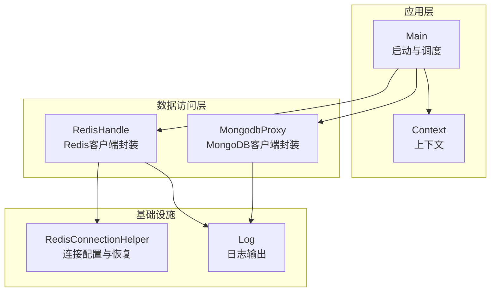
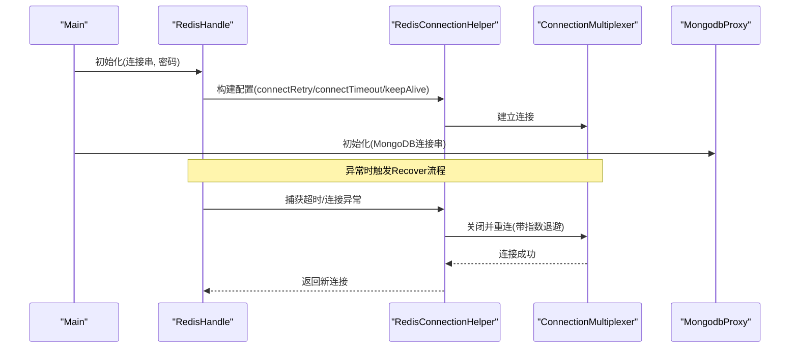
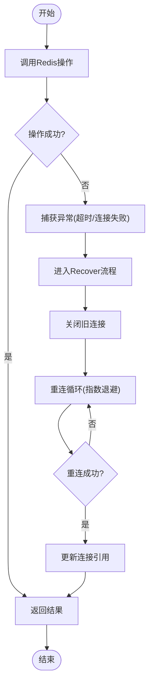
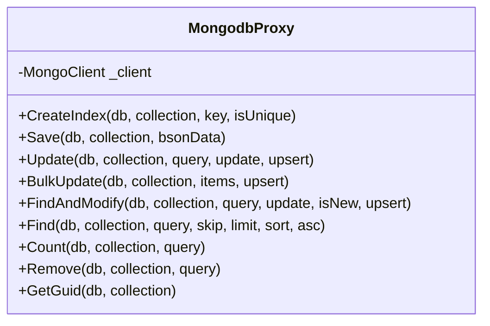
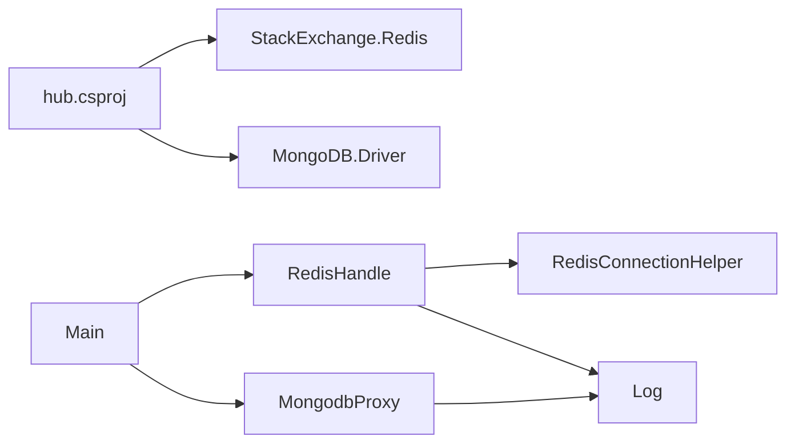

# 连接池优化

<cite>
**本文引用的文件**
- [hub.csproj](file://lgbf/hub/hub.csproj)
- [Main.cs](file://lgbf/hub/Main.cs)
- [Context.cs](file://lgbf/hub/Context.cs)
- [RedisConnectionHelper.cs](file://lgbf/hub/RedisConnectionHelper.cs)
- [RedisHandle.cs](file://lgbf/hub/RedisHandle.cs)
- [MongodbProxy.cs](file://lgbf/hub/MongodbProxy.cs)
- [Log.cs](file://lgbf/hub/Log.cs)
- [DbHelper.cs](file://lgbf/hub/DbHelper.cs)
</cite>

## 目录
1. [简介](#简介)
2. [项目结构](#项目结构)
3. [核心组件](#核心组件)
4. [架构总览](#架构总览)
5. [详细组件分析](#详细组件分析)
6. [依赖关系分析](#依赖关系分析)
7. [性能考量](#性能考量)
8. [故障排查指南](#故障排查指南)
9. [结论](#结论)
10. [附录](#附录)

## 简介
本指南围绕数据库连接池优化展开，结合仓库中的实际实现，系统阐述连接池大小配置原则、超时参数设置、不同负载场景下的调优策略、监控指标与性能分析方法，以及故障处理机制（重试、故障转移、优雅降级）与动态调整策略。目标是帮助读者在不直接阅读源码的情况下，也能掌握连接池优化的关键要点，并将其应用到生产环境。

## 项目结构
该仓库为 C# 后端服务，主要包含以下与连接池优化相关的模块：
- 配置与启动：负责加载外部配置并初始化各数据存储客户端
- Redis 客户端封装：提供连接复用、自动恢复、超时处理与锁等能力
- MongoDB 客户端封装：提供集合访问、索引、批量写入等操作
- 日志与上下文：统一记录运行状态与时间戳，便于性能分析与排障

图表来源
- [Main.cs:31-40](file://lgbf/hub/Main.cs#L31-L40)
- [RedisHandle.cs:21-25](file://lgbf/hub/RedisHandle.cs#L21-L25)
- [RedisConnectionHelper.cs:26-54](file://lgbf/hub/RedisConnectionHelper.cs#L26-L54)
- [MongodbProxy.cs:14-23](file://lgbf/hub/MongodbProxy.cs#L14-L23)

章节来源
- [Main.cs:31-40](file://lgbf/hub/Main.cs#L31-L40)
- [hub.csproj:9-17](file://lgbf/hub/hub.csproj#L9-L17)

## 核心组件
- 配置与启动：从外部配置中读取主机、端口、Redis与MongoDB连接串，初始化 RedisHandle 与 MongodbProxy，并启动定时任务与HTTP服务。
- Redis 客户端封装：对 StackExchange.Redis 的 ConnectionMultiplexer 进行统一封装，提供超时异常捕获与自动恢复逻辑；支持字符串、列表、有序集合、哈希、分布式锁等常用操作。
- MongoDB 客户端封装：基于 MongoDB.Driver 封装集合操作，提供索引创建、批量更新、查询、计数、删除等常用接口。
- 日志系统：统一输出日志，包含时间戳、级别、调用栈信息，便于定位性能瓶颈与异常。

章节来源
- [Main.cs:4-11](file://lgbf/hub/Main.cs#L4-L11)
- [RedisHandle.cs:13-544](file://lgbf/hub/RedisHandle.cs#L13-L544)
- [MongodbProxy.cs:10-221](file://lgbf/hub/MongodbProxy.cs#L10-L221)
- [Log.cs:6-113](file://lgbf/hub/Log.cs#L6-L113)

## 架构总览
下图展示了应用启动后，Redis 与 MongoDB 的连接与调用关系，以及异常恢复路径。

图表来源
- [RedisHandle.cs:21-34](file://lgbf/hub/RedisHandle.cs#L21-L34)
- [RedisConnectionHelper.cs:35-54](file://lgbf/hub/RedisConnectionHelper.cs#L35-L54)
- [RedisConnectionHelper.cs:56-127](file://lgbf/hub/RedisConnectionHelper.cs#L56-L127)
- [MongodbProxy.cs:14-23](file://lgbf/hub/MongodbProxy.cs#L14-L23)

## 详细组件分析

### Redis 连接池与恢复机制
- 连接配置：通过连接字符串构建 ConnectionMultiplexer，包含 connectRetry、connectTimeout、keepAlive、resolveDns、name 等参数，用于控制连接建立与保活行为。
- 自动恢复：当发生 RedisTimeoutException 或连接异常时，进入 Recover 流程，关闭旧连接并按指数退避重连，最多尝试指定次数；期间通过 ManualResetEvent 保证并发安全与等待超时控制。
- 超时处理：所有 Redis 操作均包裹在循环中，捕获超时异常后触发恢复并短暂休眠，避免瞬时抖动放大。
- 分布式锁：提供基于 Redis 的分布式锁实现，支持加锁、续期与释放，内部同样具备超时重试与恢复逻辑。

图表来源
- [RedisHandle.cs:36-54](file://lgbf/hub/RedisHandle.cs#L36-L54)
- [RedisHandle.cs:27-34](file://lgbf/hub/RedisHandle.cs#L27-L34)
- [RedisConnectionHelper.cs:56-127](file://lgbf/hub/RedisConnectionHelper.cs#L56-L127)

章节来源
- [RedisConnectionHelper.cs:26-144](file://lgbf/hub/RedisConnectionHelper.cs#L26-L144)
- [RedisHandle.cs:13-544](file://lgbf/hub/RedisHandle.cs#L13-L544)

### MongoDB 客户端封装
- 客户端实例：通过 MongoUrl 构造 MongoClient，后续按需获取数据库与集合。
- 批量写入：支持批量更新（非有序），适合高吞吐场景；同时提供 Upsert 选项以满足幂等需求。
- 查询与计数：支持分页、排序、投影排除等，便于在高并发下降低网络与内存开销。
- 错误处理：所有操作均在 try/catch 中执行，异常通过日志记录，便于后续分析与告警。

图表来源
- [MongodbProxy.cs:10-221](file://lgbf/hub/MongodbProxy.cs#L10-L221)

章节来源
- [MongodbProxy.cs:10-221](file://lgbf/hub/MongodbProxy.cs#L10-L221)

### 数据库辅助工具
- SaveDataHelper/UpdateDataHelper：用于构造 BsonDocument，支持 Set 与 Inc 等操作，便于批量更新与增量更新。
- DBQueryHelper：用于构造查询条件，支持多字段组合与范围查询，便于复杂查询的构建与复用。

章节来源
- [DbHelper.cs:4-157](file://lgbf/hub/DbHelper.cs#L4-L157)

## 依赖关系分析
- 项目依赖 StackExchange.Redis 与 MongoDB.Driver，分别用于 Redis 与 MongoDB 的访问。
- 应用启动时由 Main 负责初始化 RedisHandle 与 MongodbProxy，并注入到 Context 中供业务使用。
- 日志系统贯穿于 Redis 与 MongoDB 的操作路径，便于追踪性能与异常。

图表来源
- [hub.csproj:16-16](file://lgbf/hub/hub.csproj#L16-L16)
- [hub.csproj:14-14](file://lgbf/hub/hub.csproj#L14-L14)
- [Main.cs:33-34](file://lgbf/hub/Main.cs#L33-L34)

章节来源
- [hub.csproj:9-17](file://lgbf/hub/hub.csproj#L9-L17)
- [Main.cs:18-26](file://lgbf/hub/Main.cs#L18-L26)

## 性能考量
- 连接池大小配置原则
  - 最大连接数：应与后端资源（CPU、内存、网络带宽）匹配，避免过度占用导致排队与上下文切换开销上升。可参考并发请求数与平均响应时间估算所需连接数。
  - 最小空闲连接：保持一定数量的空闲连接可减少首次请求的握手与认证开销，但需避免长期占用造成资源浪费。
  - 连接生命周期：合理设置连接超时与空闲回收时间，防止长时间占用导致资源枯竭或连接失效。
- 超时参数设置最佳实践
  - 连接超时：建议与业务 SLA 对齐，通常在几十到几百毫秒范围内，避免过长阻塞线程。
  - 命令超时：根据查询复杂度与数据量设定，避免慢查询拖垮整体吞吐。
  - Socket 超时：用于网络层面的读写超时，建议与命令超时一致或略短，确保及时发现网络异常。
- 不同负载场景下的配置建议
  - 高并发：适度提高最大连接数，启用更积极的空闲连接回收策略；命令超时适当缩短，避免慢查询放大。
  - 低延迟：优先保证最小空闲连接充足，连接超时与命令超时尽量短；批处理合并策略要谨慎，避免单次操作过大。
  - 稳定运行：以稳定性为主，连接池参数保守配置，配合监控与告警进行动态调整。
- 监控指标与性能分析
  - 连接利用率：活跃连接数/最大连接数，评估是否需要扩容或收缩。
  - 等待时间：请求排队等待连接的时间，反映队列长度与连接池紧张程度。
  - 服务时间：单次操作的耗时分布（P50/P95/P99），识别慢查询与热点。
  - 失败率与重试次数：衡量连接池健康度与网络稳定性。
- 动态调整策略
  - 基于监控指标的自适应：当等待时间持续升高时，逐步增加最大连接数；当连接利用率长期偏低时，减少最大连接数。
  - 分时段调优：高峰期提升连接池上限，低峰期回收资源。
  - 渐进式变更：每次只调整一个维度（如仅改最大连接数），观察效果后再做下一步调整。

[本节为通用指导，不直接分析具体文件]

## 故障排查指南
- 连接异常与恢复
  - 当捕获到 RedisTimeoutException 或连接异常时，会触发 Recover 流程，关闭旧连接并按指数退避重连，最多尝试指定次数；期间通过 ManualResetEvent 控制并发与等待超时。
  - 若多次重连失败，最终抛出异常并记录错误日志，便于人工介入。
- 日志定位
  - 使用 Log 组件输出错误级别日志，包含时间戳、调用栈与上下文信息，便于快速定位问题根因。
- 优雅降级
  - 在连接池不可用或超时频繁时，可暂时禁用部分高延迟功能，保留核心链路；待恢复后再逐步开启。

章节来源
- [RedisConnectionHelper.cs:56-127](file://lgbf/hub/RedisConnectionHelper.cs#L56-L127)
- [RedisHandle.cs:36-54](file://lgbf/hub/RedisHandle.cs#L36-L54)
- [Log.cs:55-58](file://lgbf/hub/Log.cs#L55-L58)

## 结论
通过在应用层对 Redis 与 MongoDB 的统一封装，结合完善的异常恢复与日志体系，本项目为连接池优化提供了良好的基础。建议在生产环境中遵循“先稳后快”的原则，以监控指标为依据进行动态调整，并在高并发与低延迟场景下分别制定差异化策略，从而获得更优的吞吐与延迟表现。

[本节为总结性内容，不直接分析具体文件]

## 附录
- 运行时监控工具建议
  - 使用系统自带的进程监控与网络监控工具，采集 CPU、内存、网络 I/O 与连接数指标。
  - 结合业务埋点，记录关键链路的请求耗时、错误率与重试次数。
  - 建立告警阈值，针对连接池紧张、等待时间过长、失败率突增等情况及时通知。

[本节为通用建议，不直接分析具体文件]