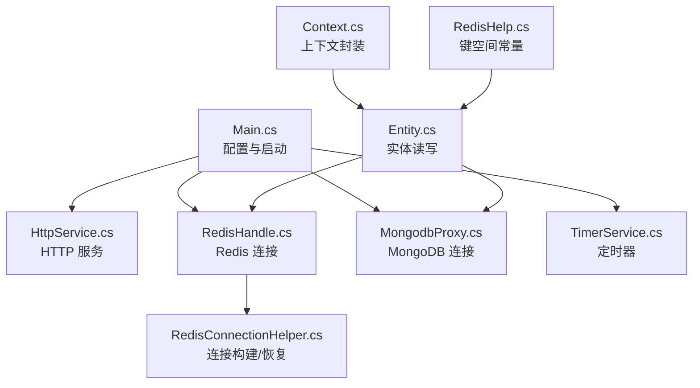
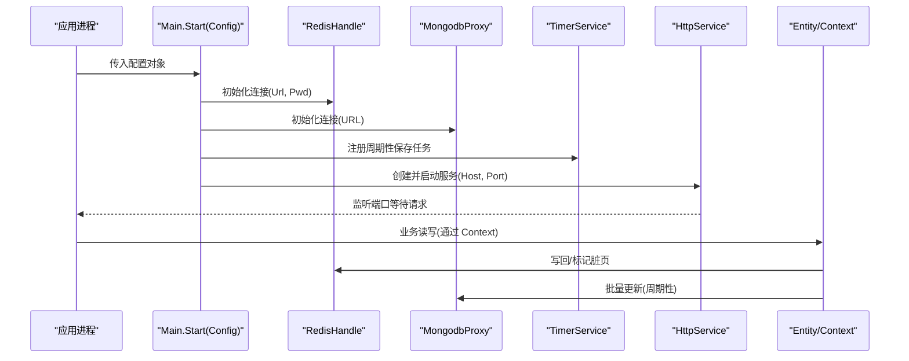
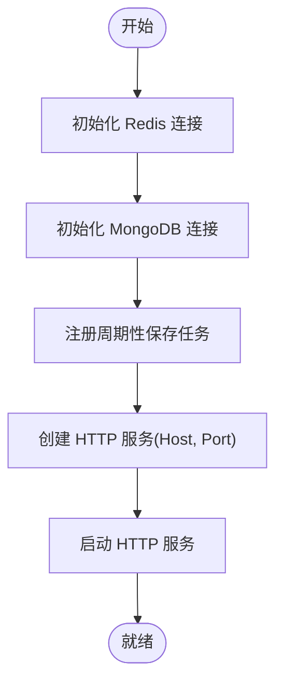
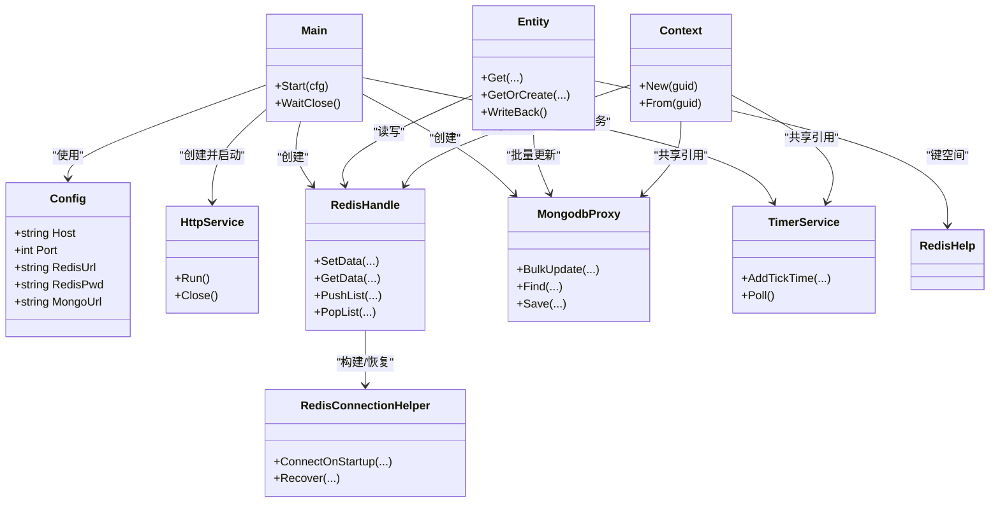

# 服务器配置

<cite>
**本文引用的文件**
- [Main.cs](file://lgbf/hub/Main.cs)
- [HttpService.cs](file://lgbf/hub/HttpService.cs)
- [RedisHandle.cs](file://lgbf/hub/RedisHandle.cs)
- [RedisConnectionHelper.cs](file://lgbf/hub/RedisConnectionHelper.cs)
- [MongodbProxy.cs](file://lgbf/hub/MongodbProxy.cs)
- [TimerService.cs](file://lgbf/hub/TimerService.cs)
- [Entity.cs](file://lgbf/hub/Entity.cs)
- [Context.cs](file://lgbf/hub/Context.cs)
- [RedisHelp.cs](file://lgbf/hub/RedisHelp.cs)
- [README.md](file://README.md)
</cite>

## 目录
1. [简介](#简介)
2. [项目结构](#项目结构)
3. [核心组件](#核心组件)
4. [架构总览](#架构总览)
5. [详细组件分析](#详细组件分析)
6. [依赖关系分析](#依赖关系分析)
7. [性能考量](#性能考量)
8. [故障排查指南](#故障排查指南)
9. [结论](#结论)
10. [附录：配置模板与示例](#附录配置模板与示例)

## 简介
本文件面向 LGBF（轻量级游戏后端框架）服务器的配置管理，聚焦于 Config 类及其在启动流程中的作用，解释各配置项的含义、默认值、设置方式与验证规则，并给出开发/测试/生产三类部署环境的配置示例。同时说明配置项之间的依赖关系、错误处理机制、热更新可能性与限制，以及提供可直接使用的配置模板与注释说明。

## 项目结构
围绕服务器配置与启动的关键文件如下：
- 配置定义与启动入口：Main.cs
- HTTP 服务与监听：HttpService.cs
- 缓存与数据库连接：RedisHandle.cs、RedisConnectionHelper.cs、MongodbProxy.cs
- 定时任务：TimerService.cs
- 实体持久化与写回：Entity.cs、RedisHelp.cs
- 上下文封装：Context.cs
- 项目概述：README.md



**图示来源**
- [Main.cs:1-159](file://lgbf/hub/Main.cs#L1-L159)
- [HttpService.cs:1-182](file://lgbf/hub/HttpService.cs#L1-L182)
- [RedisHandle.cs:1-544](file://lgbf/hub/RedisHandle.cs#L1-L544)
- [RedisConnectionHelper.cs:1-144](file://lgbf/hub/RedisConnectionHelper.cs#L1-L144)
- [MongodbProxy.cs:1-221](file://lgbf/hub/MongodbProxy.cs#L1-L221)
- [TimerService.cs:1-126](file://lgbf/hub/TimerService.cs#L1-L126)
- [Entity.cs:1-154](file://lgbf/hub/Entity.cs#L1-L154)
- [Context.cs:1-27](file://lgbf/hub/Context.cs#L1-L27)
- [RedisHelp.cs:1-20](file://lgbf/hub/RedisHelp.cs#L1-L20)

**章节来源**
- [Main.cs:1-159](file://lgbf/hub/Main.cs#L1-L159)
- [README.md:1-3](file://README.md#L1-L3)

## 核心组件
- Config 类：定义服务器运行所需的最小配置集，包括 Host、Port、RedisUrl、RedisPwd、MongoUrl。
- Main.Start(cfg)：根据 Config 初始化 Redis、Mongo、定时器与 HTTP 服务，随后启动监听。
- HttpService：基于 Kestrel 的 HTTP 服务，负责路由到注册的回调并返回响应。
- RedisHandle/MongodbProxy：分别封装 Redis 与 MongoDB 的访问接口。
- TimerService：全局定时器服务，驱动周期性保存等任务。
- Entity/Context/RedisHelp：实体数据的读取、写回与键空间约定。

**章节来源**
- [Main.cs:4-11](file://lgbf/hub/Main.cs#L4-L11)
- [Main.cs:31-40](file://lgbf/hub/Main.cs#L31-L40)
- [HttpService.cs:117-182](file://lgbf/hub/HttpService.cs#L117-L182)
- [RedisHandle.cs:13-544](file://lgbf/hub/RedisHandle.cs#L13-L544)
- [MongodbProxy.cs:10-221](file://lgbf/hub/MongodbProxy.cs#L10-L221)
- [TimerService.cs:7-126](file://lgbf/hub/TimerService.cs#L7-L126)
- [Entity.cs:31-154](file://lgbf/hub/Entity.cs#L31-L154)
- [Context.cs:4-26](file://lgbf/hub/Context.cs#L4-L26)
- [RedisHelp.cs:4-19](file://lgbf/hub/RedisHelp.cs#L4-L19)

## 架构总览
下图展示从配置到服务启动、请求处理与数据持久化的整体流程。



**图示来源**
- [Main.cs:31-40](file://lgbf/hub/Main.cs#L31-L40)
- [HttpService.cs:149-173](file://lgbf/hub/HttpService.cs#L149-L173)
- [RedisHandle.cs:21-25](file://lgbf/hub/RedisHandle.cs#L21-L25)
- [MongodbProxy.cs:14-18](file://lgbf/hub/MongodbProxy.cs#L14-L18)
- [TimerService.cs:68-96](file://lgbf/hub/TimerService.cs#L68-L96)
- [Entity.cs:58-91](file://lgbf/hub/Entity.cs#L58-L91)

## 详细组件分析

### 配置项定义与默认值
- Host：字符串类型，用于绑定 HTTP 服务监听地址；未在代码中显式赋默认值，需由调用方提供有效地址。
- Port：整数类型，用于绑定 HTTP 服务监听端口；未在代码中显式赋默认值，需由调用方提供有效端口。
- RedisUrl：字符串类型，Redis 连接字符串；未在代码中显式赋默认值，需由调用方提供有效连接串。
- RedisPwd：字符串类型，Redis 密码；未在代码中显式赋默认值，若为空则不带密码连接。
- MongoUrl：字符串类型，MongoDB 连接 URL；未在代码中显式赋默认值，需由调用方提供有效连接串。

上述字段在 Config 中声明为必需（required），意味着调用 Main.Start(Config) 前必须完成赋值，否则将触发运行时异常。

**章节来源**
- [Main.cs:4-11](file://lgbf/hub/Main.cs#L4-L11)
- [Main.cs:31-40](file://lgbf/hub/Main.cs#L31-L40)

### 启动参数与配置加载方式
- 命令行参数：当前仓库未提供命令行解析逻辑，无法直接通过命令行参数注入 Config。
- 配置文件：当前仓库未提供配置文件读取逻辑，无法直接从文件加载 Config。
- 推荐做法：在应用入口处构造 Config 对象并填充 Host、Port、RedisUrl、RedisPwd、MongoUrl，然后调用 Main.Start(Config)。

注意：以上结论基于当前仓库源码分析，若需支持命令行或配置文件，请在应用入口处自行实现解析逻辑，并将结果赋给 Config。

**章节来源**
- [Main.cs:31-40](file://lgbf/hub/Main.cs#L31-L40)

### 服务器启动流程与关键点
- 初始化 Redis：使用 RedisHandle(Url, Pwd)，内部通过 RedisConnectionHelper 构建连接配置并建立连接。
- 初始化 MongoDB：使用 MongodbProxy(URL)，内部解析 MongoUrl 并创建客户端。
- 注册定时任务：通过 TimerService.Ins.AddTickTime 注册周期性保存任务。
- 启动 HTTP 服务：HttpService 构造时接收 Host 与 Port，随后在后台线程中启动 Kestrel 监听。



**图示来源**
- [Main.cs:31-40](file://lgbf/hub/Main.cs#L31-L40)
- [RedisHandle.cs:21-25](file://lgbf/hub/RedisHandle.cs#L21-L25)
- [MongodbProxy.cs:14-18](file://lgbf/hub/MongodbProxy.cs#L14-L18)
- [TimerService.cs:68-96](file://lgbf/hub/TimerService.cs#L68-L96)
- [HttpService.cs:149-173](file://lgbf/hub/HttpService.cs#L149-L173)

### 配置项验证规则与错误处理
- 必填校验：Config 字段为 required，未赋值将导致调用 Main.Start(Config) 时抛出异常。
- 连接失败处理：
  - Redis：RedisConnectionHelper 在连接失败时记录错误日志并抛出异常；RedisHandle 提供重试与恢复机制，捕获超时异常并尝试恢复。
  - MongoDB：MongodbProxy 使用 MongoUrl 构造客户端，若 URL 不合法可能导致连接失败；建议在启动前验证 URL 格式。
- HTTP 服务：HttpService 在 Kestrel ListenAnyIP 时指定协议版本与并发限制，若端口占用将导致启动失败。
- 数据持久化：SaveAsync 中对 Redis 与 Mongo 的空值进行检查，出现异常会记录错误日志并继续调度下次执行。

**章节来源**
- [Main.cs:4-11](file://lgbf/hub/Main.cs#L4-L11)
- [RedisConnectionHelper.cs:35-54](file://lgbf/hub/RedisConnectionHelper.cs#L35-L54)
- [RedisHandle.cs:27-34](file://lgbf/hub/RedisHandle.cs#L27-L34)
- [MongodbProxy.cs:14-18](file://lgbf/hub/MongodbProxy.cs#L14-L18)
- [HttpService.cs:154-161](file://lgbf/hub/HttpService.cs#L154-L161)
- [Main.cs:71-79](file://lgbf/hub/Main.cs#L71-L79)

### 配置项之间的依赖关系与约束条件
- Host 与 Port：共同决定 HTTP 服务监听地址；Port 必须为可用端口且未被占用。
- RedisUrl 与 RedisPwd：共同决定 Redis 连接；若 Redis 需要密码，必须正确提供。
- MongoUrl：决定 MongoDB 连接；与数据库实例状态、认证信息相关。
- 启动顺序：必须先成功初始化 Redis 与 Mongo，再启动 HTTP 服务；否则后续流程会因空引用而失败。

**章节来源**
- [Main.cs:31-40](file://lgbf/hub/Main.cs#L31-L40)
- [RedisHandle.cs:21-25](file://lgbf/hub/RedisHandle.cs#L21-L25)
- [MongodbProxy.cs:14-18](file://lgbf/hub/MongodbProxy.cs#L14-L18)
- [HttpService.cs:149-173](file://lgbf/hub/HttpService.cs#L149-L173)

### 配置热更新的可能性与限制
- 当前实现：仓库未提供配置热更新逻辑。所有配置在 Main.Start(Config) 时一次性注入并固化。
- 可行方案（建议）：
  - 引入配置中心或文件监控，在运行时重新加载 Config 并重启相关服务（如 HTTP 服务、定时器等）。
  - 对于可变参数（如日志级别、限流阈值），可在服务内部增加独立开关或配置对象，避免重启。
- 限制：
  - Redis/Mongo 连接通常不支持热切换，需要重建连接并处理重连。
  - HTTP 服务监听地址变更需停止旧监听并启动新监听，存在短暂不可用风险。

**章节来源**
- [Main.cs:31-40](file://lgbf/hub/Main.cs#L31-L40)
- [RedisHandle.cs:21-25](file://lgbf/hub/RedisHandle.cs#L21-L25)
- [MongodbProxy.cs:14-18](file://lgbf/hub/MongodbProxy.cs#L14-L18)

## 依赖关系分析
- Main 依赖 RedisHandle、MongodbProxy、TimerService、HttpService。
- RedisHandle 依赖 RedisConnectionHelper 以构建连接配置与恢复策略。
- Entity 依赖 Redis 与 Mongo 完成读写与批量更新。
- Context 封装 Redis、Mongo、Timer 的共享引用，供业务层使用。



**图示来源**
- [Main.cs:4-11](file://lgbf/hub/Main.cs#L4-L11)
- [Main.cs:31-40](file://lgbf/hub/Main.cs#L31-L40)
- [HttpService.cs:117-182](file://lgbf/hub/HttpService.cs#L117-L182)
- [RedisHandle.cs:13-544](file://lgbf/hub/RedisHandle.cs#L13-L544)
- [RedisConnectionHelper.cs:6-144](file://lgbf/hub/RedisConnectionHelper.cs#L6-L144)
- [MongodbProxy.cs:10-221](file://lgbf/hub/MongodbProxy.cs#L10-L221)
- [TimerService.cs:7-126](file://lgbf/hub/TimerService.cs#L7-L126)
- [Entity.cs:31-154](file://lgbf/hub/Entity.cs#L31-L154)
- [Context.cs:4-26](file://lgbf/hub/Context.cs#L4-L26)
- [RedisHelp.cs:4-19](file://lgbf/hub/RedisHelp.cs#L4-L19)

**章节来源**
- [Main.cs:31-40](file://lgbf/hub/Main.cs#L31-L40)
- [RedisHandle.cs:21-25](file://lgbf/hub/RedisHandle.cs#L21-L25)
- [MongodbProxy.cs:14-18](file://lgbf/hub/MongodbProxy.cs#L14-L18)
- [TimerService.cs:68-96](file://lgbf/hub/TimerService.cs#L68-L96)
- [Entity.cs:58-91](file://lgbf/hub/Entity.cs#L58-L91)

## 性能考量
- HTTP 服务并发与保活：Kestrel 设置最大并发连接与保活超时，有助于提升高并发场景稳定性。
- Redis/Mongo 操作：采用异步 API 与连接池，减少阻塞；RedisHandle 对超时异常进行重试与恢复，降低瞬时故障影响。
- 定时任务：周期性批量更新，避免频繁小事务；通过批处理与去重（按 Type/Guid）提升吞吐。

**章节来源**
- [HttpService.cs:154-161](file://lgbf/hub/HttpService.cs#L154-L161)
- [RedisHandle.cs:36-54](file://lgbf/hub/RedisHandle.cs#L36-L54)
- [Main.cs:103-146](file://lgbf/hub/Main.cs#L103-L146)

## 故障排查指南
- 启动失败（端口占用/协议不支持）
  - 检查 Port 是否被占用或权限不足；确认监听协议配置。
  - 参考：[HttpService.cs:154-161](file://lgbf/hub/HttpService.cs#L154-L161)
- Redis 连接失败
  - 校验 RedisUrl 与 RedisPwd；查看连接异常日志；确认网络连通性。
  - 参考：[RedisConnectionHelper.cs:35-54](file://lgbf/hub/RedisConnectionHelper.cs#L35-L54)
- MongoDB 连接失败
  - 校验 MongoUrl 格式；确认数据库可达与认证信息。
  - 参考：[MongodbProxy.cs:14-18](file://lgbf/hub/MongodbProxy.cs#L14-L18)
- 实体写回失败
  - 查看写回异常日志；确认 Redis 可写与键空间命名一致。
  - 参考：[Entity.cs:62-91](file://lgbf/hub/Entity.cs#L62-L91)
- 周期性保存异常
  - 查看 SaveAsync 错误日志；检查 MongoDB 批量更新返回状态。
  - 参考：[Main.cs:148-151](file://lgbf/hub/Main.cs#L148-L151)

**章节来源**
- [HttpService.cs:154-161](file://lgbf/hub/HttpService.cs#L154-L161)
- [RedisConnectionHelper.cs:35-54](file://lgbf/hub/RedisConnectionHelper.cs#L35-L54)
- [MongodbProxy.cs:14-18](file://lgbf/hub/MongodbProxy.cs#L14-L18)
- [Entity.cs:62-91](file://lgbf/hub/Entity.cs#L62-L91)
- [Main.cs:148-151](file://lgbf/hub/Main.cs#L148-L151)

## 结论
- Config 是服务器启动的唯一输入，包含 Host、Port、RedisUrl、RedisPwd、MongoUrl 五项关键配置。
- 当前仓库未提供命令行或配置文件加载能力，需在应用入口处手动构造 Config 并传入 Main.Start。
- 启动流程严格依赖 Redis 与 Mongo 的可用性；HTTP 服务在二者就绪后启动。
- 建议在生产环境引入配置中心与健康检查，完善热更新与故障恢复策略。

## 附录：配置模板与示例

### 配置模板（YAML 风格，便于理解）
```yaml
# 主机地址
host: "0.0.0.0"

# 端口号
port: 8080

# Redis 连接串
redis_url: "127.0.0.1:6379"

# Redis 密码（可选，留空表示无密码）
redis_pwd: ""

# MongoDB 连接 URL
mongo_url: "mongodb://127.0.0.1:27017"
```

说明
- host：建议在容器/云环境中使用 "0.0.0.0" 以便外部访问；单机调试可用 "127.0.0.1"。
- port：确保防火墙开放该端口；避免与系统服务冲突。
- redis_url：格式遵循 StackExchange.Redis 支持的连接串规范。
- redis_pwd：若 Redis 开启认证，务必填写正确密码。
- mongo_url：遵循 MongoDB 连接字符串规范，包含主机、端口与数据库名等。

### 不同部署环境的配置差异
- 开发环境
  - host: "127.0.0.1"
  - port: 8080
  - redis_url: "127.0.0.1:6379"
  - redis_pwd: ""（本地无密码）
  - mongo_url: "mongodb://127.0.0.1:27017/testdb"
- 测试环境
  - host: "0.0.0.0"
  - port: 8080
  - redis_url: "redis.example.com:6379"
  - redis_pwd: "${REDIS_PWD}"
  - mongo_url: "mongodb://mongo.example.com:27017/testdb"
- 生产环境
  - host: "0.0.0.0"
  - port: 80
  - redis_url: "redis-prod.example.com:6379"
  - redis_pwd: "${REDIS_PWD}"
  - mongo_url: "mongodb://mongo-prod.example.com:27017/proddb"

注：生产环境建议通过环境变量注入敏感信息（如密码），并在启动脚本中替换占位符。

### 配置项之间的依赖关系与约束
- host 与 port：必须配合使用，缺一不可。
- redis_url 与 redis_pwd：若 Redis 开启认证，必须同时提供；否则连接会失败。
- mongo_url：必须指向可用的 MongoDB 实例，且具备相应权限。
- 启动顺序：必须先成功连接 Redis 与 Mongo，再启动 HTTP 服务。