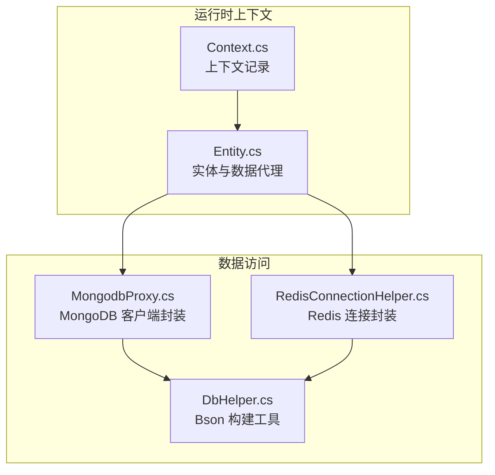
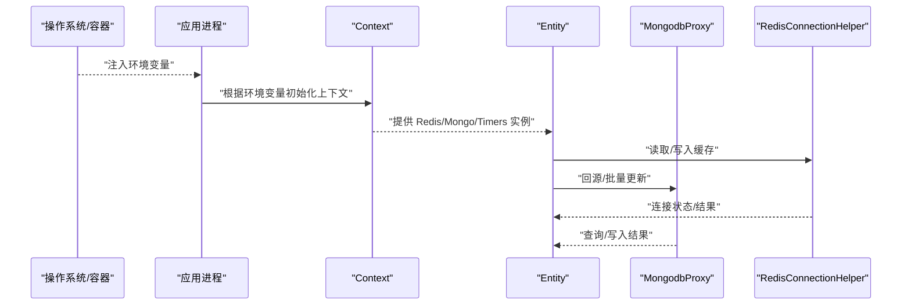
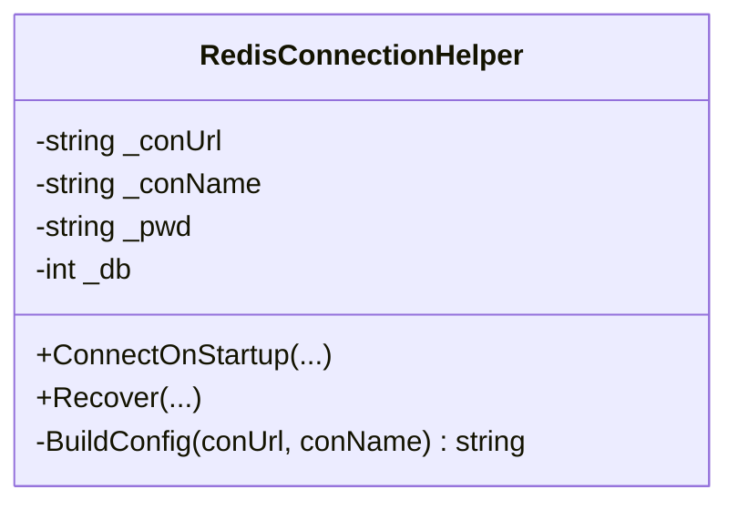
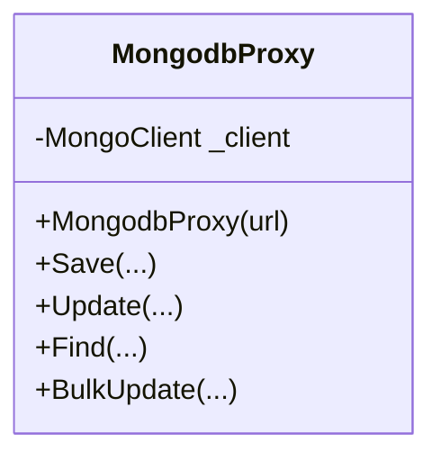
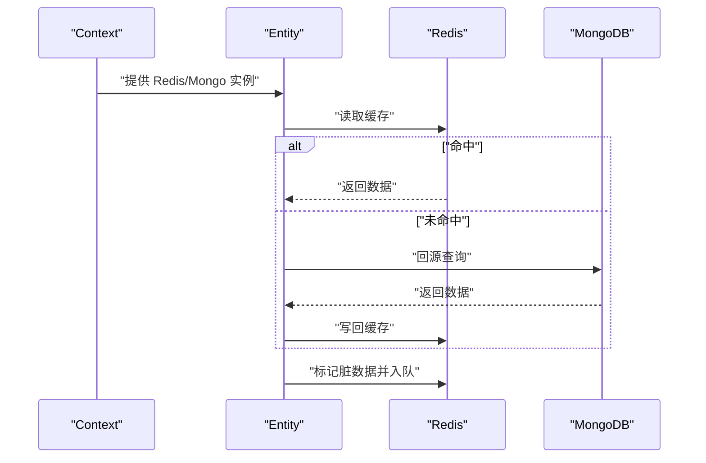
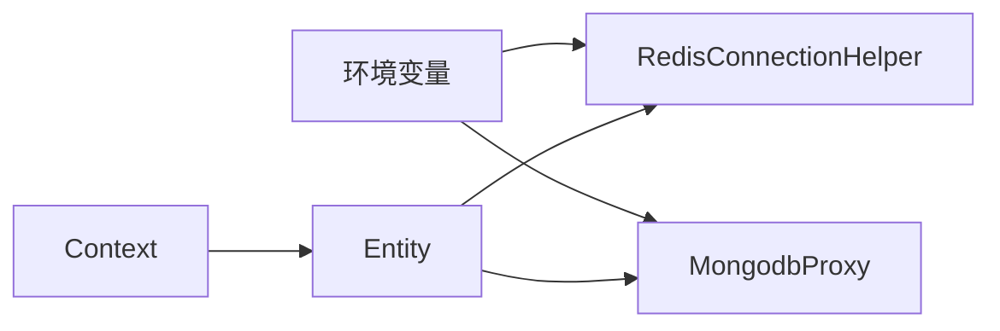

# 环境变量管理

<cite>
**本文引用的文件**
- [README.md](file://README.md)
- [Context.cs](file://lgbf/hub/Context.cs)
- [DbHelper.cs](file://lgbf/hub/DbHelper.cs)
- [RedisConnectionHelper.cs](file://lgbf/hub/RedisConnectionHelper.cs)
- [MongodbProxy.cs](file://lgbf/hub/MongodbProxy.cs)
- [Entity.cs](file://lgbf/hub/Entity.cs)
</cite>

## 目录
1. [简介](#简介)
2. [项目结构](#项目结构)
3. [核心组件](#核心组件)
4. [架构总览](#架构总览)
5. [详细组件分析](#详细组件分析)
6. [依赖分析](#依赖分析)
7. [性能考虑](#性能考虑)
8. [故障排查指南](#故障排查指南)
9. [结论](#结论)
10. [附录](#附录)

## 简介
本文件系统化阐述 LGBF（轻量级游戏后端框架）在运行期对“环境变量”的使用方式与最佳实践，重点覆盖以下方面：
- 变量命名约定与值格式要求
- 不同操作系统（Windows、Linux、Docker）下的设置方法
- 环境变量与配置文件的优先级与覆盖规则
- 敏感信息（数据库密码、API 密钥）的安全处理
- 验证与调试技巧
- 多环境（开发、测试、生产）隔离策略
- 常见陷阱与最佳实践

说明：当前仓库中未发现显式的“配置文件”或“环境变量读取”的集中实现；本文基于 Hub 侧与底层依赖库的调用路径进行推导与规范建议，帮助读者在不修改现有代码的前提下安全、可维护地接入环境变量。

## 项目结构
围绕“环境变量管理”，与本主题直接相关的核心模块如下：
- 上下文与实体层：Context、Entity 用于贯穿业务上下文与数据持久化代理
- 数据访问层：MongodbProxy、RedisConnectionHelper 封装了 MongoDB 与 Redis 的连接与操作
- 工具与辅助：DbHelper 提供 Bson 文档构建工具

**图示来源**
- [Context.cs:1-27](file://lgbf/hub/Context.cs#L1-L27)
- [Entity.cs:1-154](file://lgbf/hub/Entity.cs#L1-L154)
- [MongodbProxy.cs:1-221](file://lgbf/hub/MongodbProxy.cs#L1-L221)
- [RedisConnectionHelper.cs:1-144](file://lgbf/hub/RedisConnectionHelper.cs#L1-L144)
- [DbHelper.cs:1-311](file://lgbf/hub/DbHelper.cs#L1-L311)

**章节来源**
- [README.md:1-3](file://README.md#L1-L3)
- [Context.cs:1-27](file://lgbf/hub/Context.cs#L1-L27)
- [Entity.cs:1-154](file://lgbf/hub/Entity.cs#L1-L154)
- [MongodbProxy.cs:1-221](file://lgbf/hub/MongodbProxy.cs#L1-L221)
- [RedisConnectionHelper.cs:1-144](file://lgbf/hub/RedisConnectionHelper.cs#L1-L144)
- [DbHelper.cs:1-311](file://lgbf/hub/DbHelper.cs#L1-L311)

## 核心组件
- Context：承载运行时上下文（如 Guid），并注入 Redis、Mongo、Timer 等服务实例，作为后续数据代理与持久化的入口。
- Entity：面向实体的数据代理层，负责从 Redis 读取/写回，若无缓存则回源到 MongoDB，并通过队列标记脏数据以异步落盘。
- MongodbProxy：封装 MongoDB 客户端初始化与常用 CRUD 操作，构造查询/更新/聚合等 BSON 文档。
- RedisConnectionHelper：封装 Redis 连接参数构建与重连逻辑，支持密码、DB 库索引等配置。
- DbHelper：提供 SaveDataHelper、UpdateDataHelper、DBQueryHelper 等工具类，用于构建 Bson 文档与查询条件。

这些组件共同决定了“环境变量”应在哪里生效（例如连接字符串、认证凭据、超时参数等）。

**章节来源**
- [Context.cs:4-26](file://lgbf/hub/Context.cs#L4-L26)
- [Entity.cs:37-92](file://lgbf/hub/Entity.cs#L37-L92)
- [MongodbProxy.cs:14-18](file://lgbf/hub/MongodbProxy.cs#L14-L18)
- [RedisConnectionHelper.cs:26-33](file://lgbf/hub/RedisConnectionHelper.cs#L26-L33)
- [DbHelper.cs:4-69](file://lgbf/hub/DbHelper.cs#L4-L69)

## 架构总览
下图展示了“环境变量”在运行时的注入点与影响范围：应用启动时通过环境变量构建连接参数，随后由 Context 注入到 Entity，再驱动 MongodbProxy 与 RedisConnectionHelper 执行实际 IO。

**图示来源**
- [Context.cs:11-20](file://lgbf/hub/Context.cs#L11-L20)
- [Entity.cs:94-135](file://lgbf/hub/Entity.cs#L94-L135)
- [MongodbProxy.cs:14-23](file://lgbf/hub/MongodbProxy.cs#L14-L23)
- [RedisConnectionHelper.cs:35-54](file://lgbf/hub/RedisConnectionHelper.cs#L35-L54)

## 详细组件分析

### 组件一：Redis 连接参数与环境变量映射
- 关键点
  - Redis 连接参数由构造函数接收（URL、名称、密码、DB 索引），并在内部拼装为连接配置字符串。
  - 当存在密码时，会将其纳入最终配置；否则仅使用 URL 与基础选项。
  - 启动时通过该配置建立连接 Multiplexer、Database、Subscriber。
- 环境变量建议映射
  - REDIS_URL → 构造函数 conUrl
  - REDIS_NAME → 构造函数 conName
  - REDIS_PASSWORD → 构造函数 pwd
  - REDIS_DB → 构造函数 db
- 值格式要求
  - URL：符合 StackExchange.Redis 支持的连接串格式（含主机、端口、可选密码、DB 等）
  - DB：整数，表示逻辑库索引
  - 密码：字符串，必要时使用强口令
- 覆盖规则
  - 若未提供密码，将不带密码连接；提供密码时必须确保与目标实例一致
  - DB 默认通常为 0，按需调整
- 安全建议
  - 生产环境务必通过只读环境变量注入，避免硬编码
  - 使用最小权限账号与短有效期令牌
- 调试要点
  - 观察启动日志中连接异常与重试次数
  - 如出现解析失败，检查 URL 格式与转义字符

**图示来源**
- [RedisConnectionHelper.cs:26-33](file://lgbf/hub/RedisConnectionHelper.cs#L26-L33)
- [RedisConnectionHelper.cs:130-142](file://lgbf/hub/RedisConnectionHelper.cs#L130-L142)

**章节来源**
- [RedisConnectionHelper.cs:26-33](file://lgbf/hub/RedisConnectionHelper.cs#L26-L33)
- [RedisConnectionHelper.cs:35-54](file://lgbf/hub/RedisConnectionHelper.cs#L35-L54)
- [RedisConnectionHelper.cs:130-142](file://lgbf/hub/RedisConnectionHelper.cs#L130-L142)

### 组件二：MongoDB 连接参数与环境变量映射
- 关键点
  - MongodbProxy 通过构造函数接收一个完整 URL（包含认证信息与数据库名），内部解析为 MongoUrl 并创建 MongoClient。
  - 该 URL 是连接 MongoDB 的唯一凭证来源。
- 环境变量建议映射
  - MONGO_URL → 构造函数 url
- 值格式要求
  - 必须是合法的 MongoDB 连接字符串（支持用户名、密码、主机、端口、数据库、认证库、参数等）
- 覆盖规则
  - 一旦传入 URL，即完全决定连接行为；与外部配置文件无关
- 安全建议
  - 将密码置于 URL 中时，建议使用专用账号与最小权限
  - 在容器编排中通过只读环境变量注入
- 调试要点
  - 初始化失败时检查 URL 格式与网络可达性
  - 观察日志中的异常堆栈定位问题

**图示来源**
- [MongodbProxy.cs:14-18](file://lgbf/hub/MongodbProxy.cs#L14-L18)

**章节来源**
- [MongodbProxy.cs:14-18](file://lgbf/hub/MongodbProxy.cs#L14-L18)

### 组件三：上下文与实体的数据流
- 关键点
  - Context.New 会将全局 Redis、Mongo、Timer 实例注入到 Context，并通过 Ctx.From 切换 Guid。
  - Entity 通过 Redis 缓存命中优先，未命中则回源 MongoDB 查询并写回缓存。
  - 写回流程会标记脏数据并入队，异步批量写入 MongoDB。
- 环境变量建议映射
  - REDIS_URL/REDIS_NAME/REDIS_PASSWORD/REDIS_DB → RedisConnectionHelper
  - MONGO_URL → MongodbProxy
- 覆盖规则
  - 启动阶段一次性读取并固化；运行期不建议动态变更
- 安全建议
  - 所有凭据均来自环境变量，禁止落盘或打印明文
- 调试要点
  - 关注 Redis 命中率与写回队列长度
  - 观察 MongoDB 查询耗时与索引使用情况

**图示来源**
- [Context.cs:11-20](file://lgbf/hub/Context.cs#L11-L20)
- [Entity.cs:94-135](file://lgbf/hub/Entity.cs#L94-L135)

**章节来源**
- [Context.cs:11-20](file://lgbf/hub/Context.cs#L11-L20)
- [Entity.cs:94-135](file://lgbf/hub/Entity.cs#L94-L135)

### 组件四：Bson 文档构建与查询条件
- 关键点
  - SaveDataHelper/UpdateDataHelper/DBQueryHelper 提供链式接口，用于构建插入、更新与查询的 BSON 文档。
  - 这些工具类本身不依赖环境变量，但其输入数据可能来源于外部配置或请求体。
- 环境变量建议映射
  - 与本组件无直接耦合；如需从环境变量派生默认值，应在上层调用处完成
- 覆盖规则
  - 以最后一次调用为准；注意并发场景下的线程安全
- 安全建议
  - 对用户输入进行严格校验与白名单过滤
- 调试要点
  - 输出最终生成的 BSON 结构，便于联调与索引优化

**章节来源**
- [DbHelper.cs:4-69](file://lgbf/hub/DbHelper.cs#L4-L69)
- [DbHelper.cs:160-311](file://lgbf/hub/DbHelper.cs#L160-L311)

## 依赖分析
- 组件内聚与耦合
  - Context 与 Entity 之间为弱耦合：Entity 仅依赖 Context 提供的服务实例
  - MongodbProxy 与 RedisConnectionHelper 分别独立封装各自客户端
  - DbHelper 为纯工具类，不持有外部状态
- 外部依赖
  - StackExchange.Redis（Redis）
  - MongoDB.Driver（MongoDB）
- 潜在风险
  - 若环境变量缺失或格式错误，可能导致连接失败或权限不足
  - Redis 与 Mongo 的 URL 参数冲突（如密码位置）需统一规范

**图示来源**
- [RedisConnectionHelper.cs:26-33](file://lgbf/hub/RedisConnectionHelper.cs#L26-L33)
- [MongodbProxy.cs:14-18](file://lgbf/hub/MongodbProxy.cs#L14-L18)
- [Context.cs:11-20](file://lgbf/hub/Context.cs#L11-L20)
- [Entity.cs:94-135](file://lgbf/hub/Entity.cs#L94-L135)

**章节来源**
- [RedisConnectionHelper.cs:26-33](file://lgbf/hub/RedisConnectionHelper.cs#L26-L33)
- [MongodbProxy.cs:14-18](file://lgbf/hub/MongodbProxy.cs#L14-L18)
- [Context.cs:11-20](file://lgbf/hub/Context.cs#L11-L20)
- [Entity.cs:94-135](file://lgbf/hub/Entity.cs#L94-L135)

## 性能考虑
- 连接池与重连
  - Redis 连接器内置重试与指数退避，避免瞬时故障放大
  - 建议合理设置 keepAlive、connectTimeout 等参数
- 缓存命中率
  - 通过 Entity 的缓存读写策略提升热点数据访问性能
  - 定期监控写回队列长度，防止积压
- 查询优化
  - 使用 DBQueryHelper 构建精确查询条件，配合索引减少扫描
  - 控制投影字段与分页大小

[本节为通用指导，无需列出具体文件来源]

## 故障排查指南
- Redis 连接失败
  - 检查 REDIS_URL/REDIS_PASSWORD/REDIS_DB 是否正确
  - 查看启动日志中的连接异常与重试次数
  - 确认网络可达与防火墙放行
- MongoDB 连接失败
  - 检查 MONGO_URL 格式与认证信息
  - 确认数据库服务可用与账号权限
- 写回异常
  - 观察 Redis 写入失败与脏队列入队是否成功
  - 检查 MongoDB 写入超时与索引状态
- 调试技巧
  - 开启更详细的日志级别，定位具体环节
  - 使用最小化配置复现问题，逐步加回其他变量

**章节来源**
- [RedisConnectionHelper.cs:35-54](file://lgbf/hub/RedisConnectionHelper.cs#L35-L54)
- [RedisConnectionHelper.cs:56-127](file://lgbf/hub/RedisConnectionHelper.cs#L56-L127)
- [MongodbProxy.cs:14-18](file://lgbf/hub/MongodbProxy.cs#L14-L18)
- [Entity.cs:58-91](file://lgbf/hub/Entity.cs#L58-L91)

## 结论
- 环境变量是 LGBF 运行期配置的关键入口，应集中在启动阶段一次性读取并固化
- Redis 与 MongoDB 的连接参数建议通过独立的环境变量注入，避免硬编码
- 建议采用“最小权限+只读注入+短有效期”的安全策略
- 通过合理的命名约定、值格式与覆盖规则，可实现跨平台与多环境的一致性

[本节为总结性内容，无需列出具体文件来源]

## 附录

### A. 环境变量命名约定与值格式
- 命名约定
  - 使用全大写与下划线分隔，前缀区分服务类型（如 REDIS_、MONGO_）
  - 同一组参数尽量保持语义一致（如 *_URL、*_PASSWORD、*_DB）
- 值格式
  - URL 类：遵循对应客户端库的连接串规范
  - 数值类：整数，超出范围将导致解析失败
  - 字符串类：UTF-8，注意转义与特殊字符

[本节为通用规范，无需列出具体文件来源]

### B. 不同操作系统下的设置方法
- Windows（命令提示符）
  - set VAR=value
  - set VAR="value with spaces"
- Windows（PowerShell）
  - $env:VAR="value"
- Linux
  - export VAR=value
  - 在 systemd 单元文件中使用 Environment=VAR=value
- Docker
  - docker run -e VAR=value 或在 docker-compose.yml 中使用 environment
  - 生产环境建议使用 secrets 管理敏感变量

[本节为通用指导，无需列出具体文件来源]

### C. 与配置文件的优先级与覆盖规则
- 建议策略
  - 环境变量优先于配置文件；配置文件仅作为默认值或模板
  - 启动阶段统一读取环境变量，随后不再变更
- 覆盖顺序（推荐）
  - 系统默认值 → 配置文件默认值 → 环境变量 → 运行时参数

[本节为通用指导，无需列出具体文件来源]

### D. 敏感信息的安全处理
- 建议
  - 数据库密码、API 密钥一律通过只读环境变量注入
  - 使用专用账号与最小权限原则
  - 定期轮换密钥，缩短有效期
  - 避免在日志、快照、镜像中泄露
- 验证
  - 启动后执行一次连接测试，确认凭据有效
  - 在 CI/CD 中加入“敏感变量未泄露”扫描

[本节为通用指导，无需列出具体文件来源]

### E. 多环境配置管理策略
- 开发环境
  - 使用本地或本地化容器，简化 URL 与权限
- 测试环境
  - 与生产隔离的账号与数据库，启用更严格的日志与限流
- 生产环境
  - 使用只读环境变量、密钥管理服务（如 KMS/HashiCorp Vault）、网络隔离与审计日志

[本节为通用指导，无需列出具体文件来源]

### F. 最佳实践与常见陷阱
- 最佳实践
  - 明确变量边界与作用域，避免跨服务误用
  - 为每个变量提供默认值与校验逻辑
  - 使用健康检查与探针，快速发现配置错误
- 常见陷阱
  - 忘记转义特殊字符导致 URL 解析失败
  - 将敏感信息硬编码在镜像或配置文件中
  - 忽视连接超时与重试策略，导致雪崩效应

[本节为通用指导，无需列出具体文件来源]