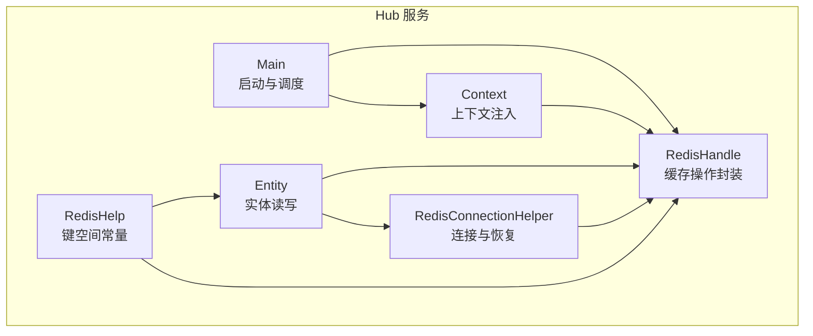
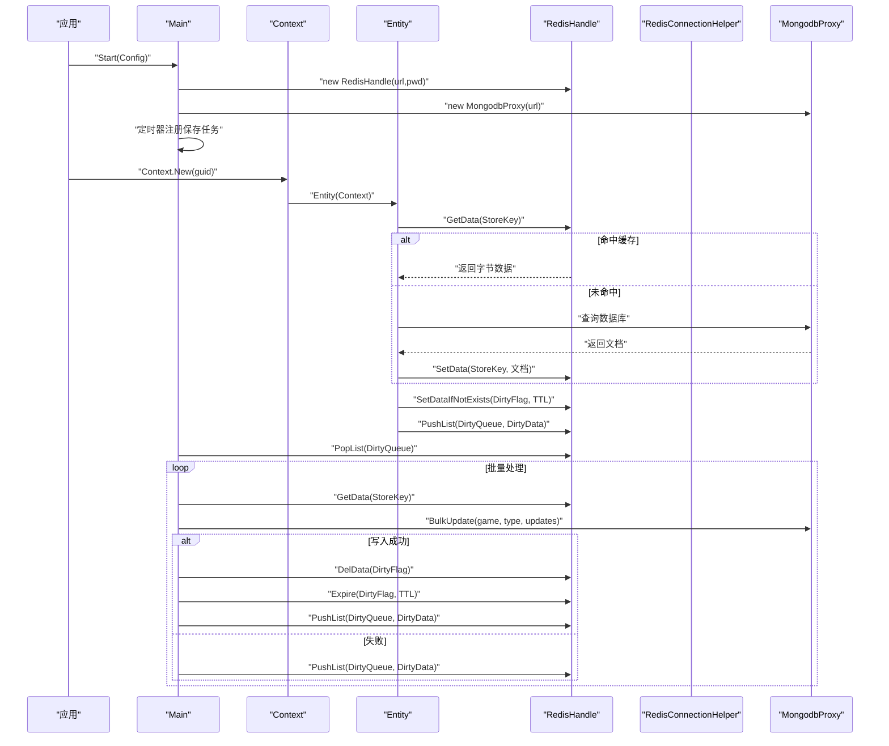
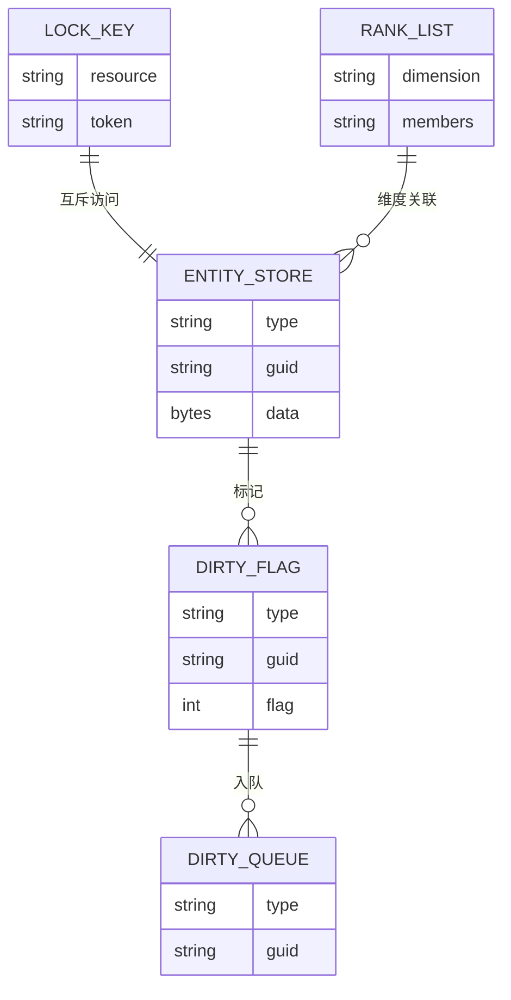
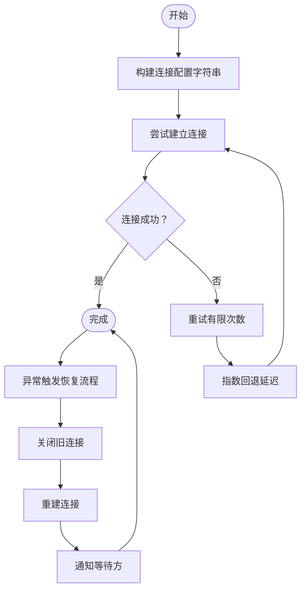
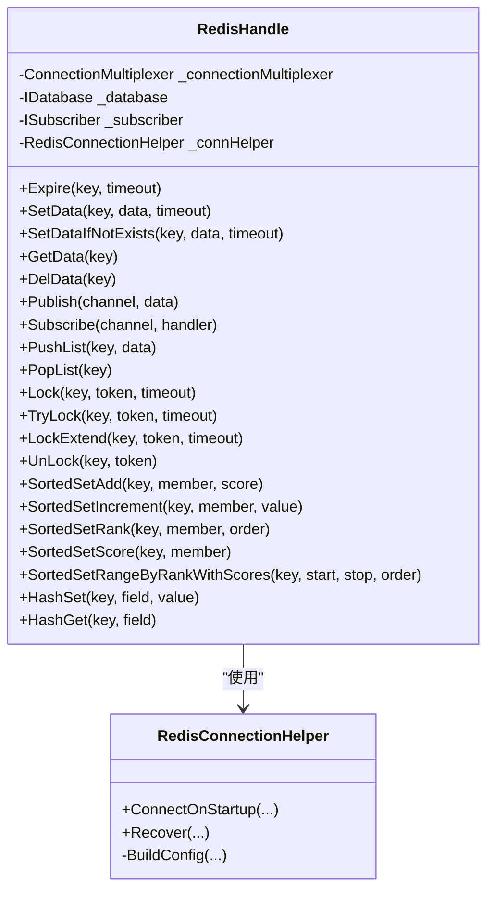
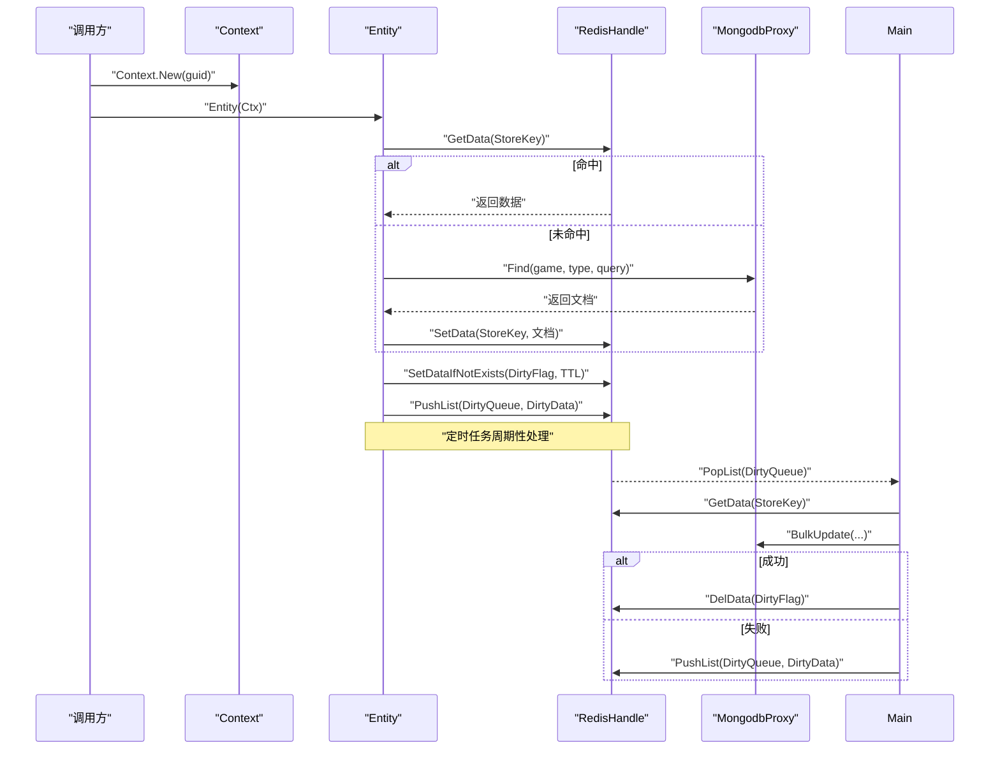
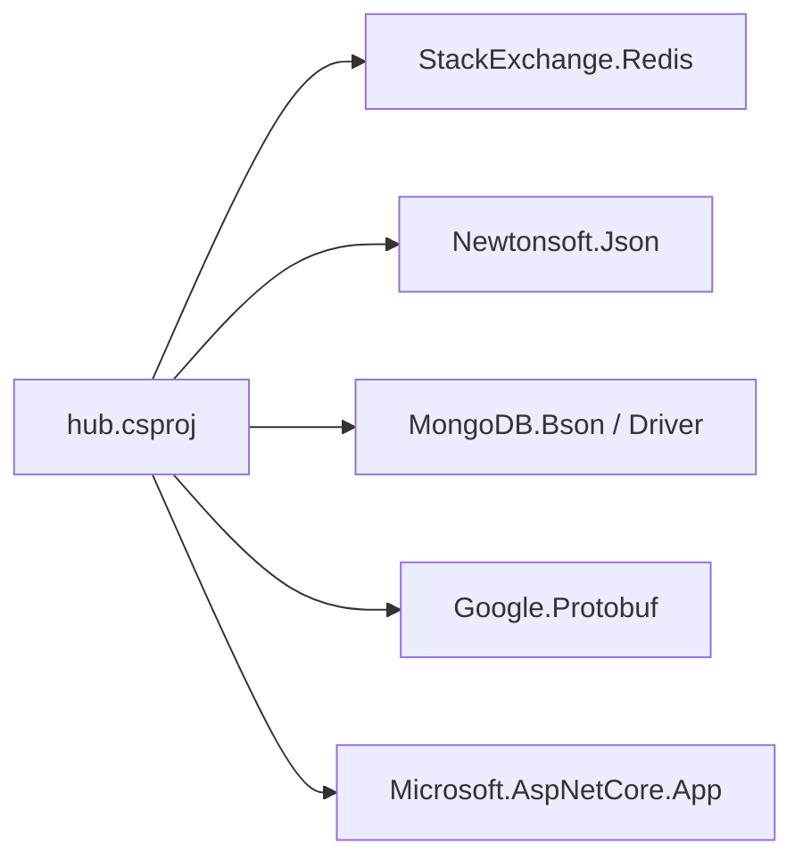

# 缓存配置

<cite>
**本文引用的文件**
- [RedisHelp.cs](file://lgbf/hub/RedisHelp.cs)
- [RedisHandle.cs](file://lgbf/hub/RedisHandle.cs)
- [RedisConnectionHelper.cs](file://lgbf/hub/RedisConnectionHelper.cs)
- [Main.cs](file://lgbf/hub/Main.cs)
- [Entity.cs](file://lgbf/hub/Entity.cs)
- [Context.cs](file://lgbf/hub/Context.cs)
- [hub.csproj](file://lgbf/hub/hub.csproj)
- [README.md](file://README.md)
</cite>

## 目录
1. [简介](#简介)
2. [项目结构](#项目结构)
3. [核心组件](#核心组件)
4. [架构总览](#架构总览)
5. [详细组件分析](#详细组件分析)
6. [依赖分析](#依赖分析)
7. [性能考量](#性能考量)
8. [故障排查指南](#故障排查指南)
9. [结论](#结论)
10. [附录：配置模板与最佳实践](#附录配置模板与最佳实践)

## 简介
本指南面向 LGBF 后端框架中的 Redis 缓存系统，聚焦于实际代码中已实现的缓存策略、键空间设计、过期与内存管理、一致性保障、监控与统计、高可用与安全等主题。文档基于仓库中 Redis 客户端封装、连接与恢复机制、实体数据读写流程以及定时落盘逻辑进行归纳总结，并给出可操作的配置建议与模板。

## 项目结构
与缓存相关的关键文件集中在 hub 子项目中，主要模块如下：
- 连接与恢复：RedisConnectionHelper
- 缓存接口封装：RedisHandle
- 键空间常量：RedisHelp
- 实体读写与脏页落盘：Entity、Context、Main
- 依赖声明：hub.csproj

图表来源
- [Main.cs:31-40](file://lgbf/hub/Main.cs#L31-L40)
- [Context.cs:4-26](file://lgbf/hub/Context.cs#L4-L26)
- [Entity.cs:94-154](file://lgbf/hub/Entity.cs#L94-L154)
- [RedisHelp.cs:4-19](file://lgbf/hub/RedisHelp.cs#L4-L19)
- [RedisConnectionHelper.cs:6-54](file://lgbf/hub/RedisConnectionHelper.cs#L6-L54)
- [RedisHandle.cs:13-34](file://lgbf/hub/RedisHandle.cs#L13-L34)

章节来源
- [Main.cs:31-40](file://lgbf/hub/Main.cs#L31-L40)
- [hub.csproj:9-17](file://lgbf/hub/hub.csproj#L9-L17)
- [README.md:1-3](file://README.md#L1-L3)

## 核心组件
- RedisHelp：集中定义缓存键空间前缀与命名规范，涵盖实体存储、锁、排行榜、脏页队列等。
- RedisConnectionHelper：负责连接建立、超时与重连策略、并发恢复保护、配置字符串构建。
- RedisHandle：对 StackExchange.Redis 的常用操作进行封装，统一异常处理与重试逻辑，支持字符串、列表、哈希、有序集合、分布式锁、发布订阅等。
- Entity/Context/Main：实体生命周期管理、脏页标记与批量落盘、定时任务驱动的数据持久化。

章节来源
- [RedisHelp.cs:4-19](file://lgbf/hub/RedisHelp.cs#L4-L19)
- [RedisConnectionHelper.cs:6-54](file://lgbf/hub/RedisConnectionHelper.cs#L6-L54)
- [RedisHandle.cs:13-34](file://lgbf/hub/RedisHandle.cs#L13-L34)
- [Entity.cs:31-92](file://lgbf/hub/Entity.cs#L31-L92)
- [Context.cs:4-26](file://lgbf/hub/Context.cs#L4-L26)
- [Main.cs:31-40](file://lgbf/hub/Main.cs#L31-L40)

## 架构总览
下图展示从应用启动到实体读写、缓存与数据库交互、以及定时落盘的整体流程。

图表来源
- [Main.cs:31-40](file://lgbf/hub/Main.cs#L31-L40)
- [Main.cs:50-157](file://lgbf/hub/Main.cs#L50-L157)
- [Entity.cs:104-153](file://lgbf/hub/Entity.cs#L104-L153)
- [RedisHandle.cs:36-109](file://lgbf/hub/RedisHandle.cs#L36-L109)
- [RedisHandle.cs:257-303](file://lgbf/hub/RedisHandle.cs#L257-L303)
- [RedisHandle.cs:305-394](file://lgbf/hub/RedisHandle.cs#L305-L394)

## 详细组件分析

### 组件一：键空间设计与命名规范（RedisHelp）
- 实体存储键：以类型与 GUID 组合，避免跨类型冲突；同时提供“脏页标志”键用于幂等落盘。
- 分布式锁键：以资源标识为后缀，配合唯一 token 防止死锁与误释放。
- 排行榜键：按维度分组，便于独立维护与查询。
- 脏页队列：统一列表键，按批次顺序出队，确保最终一致。

图表来源
- [RedisHelp.cs:6-18](file://lgbf/hub/RedisHelp.cs#L6-L18)
- [Entity.cs:31-92](file://lgbf/hub/Entity.cs#L31-L92)
- [Main.cs:81-146](file://lgbf/hub/Main.cs#L81-L146)

章节来源
- [RedisHelp.cs:4-19](file://lgbf/hub/RedisHelp.cs#L4-L19)
- [Entity.cs:31-92](file://lgbf/hub/Entity.cs#L31-L92)
- [Main.cs:81-146](file://lgbf/hub/Main.cs#L81-L146)

### 组件二：连接与恢复（RedisConnectionHelper）
- 连接参数：包含连接重试次数、连接超时、保活间隔、DNS 解析、连接名称等。
- 密码配置：当提供密码时，配置字符串自动拼接 password 参数。
- 恢复策略：并发恢复保护、指数回退延迟、最大等待与通知机制，失败时抛出明确异常。

图表来源
- [RedisConnectionHelper.cs:26-54](file://lgbf/hub/RedisConnectionHelper.cs#L26-L54)
- [RedisConnectionHelper.cs:56-127](file://lgbf/hub/RedisConnectionHelper.cs#L56-L127)
- [RedisConnectionHelper.cs:130-142](file://lgbf/hub/RedisConnectionHelper.cs#L130-L142)

章节来源
- [RedisConnectionHelper.cs:6-54](file://lgbf/hub/RedisConnectionHelper.cs#L6-L54)
- [RedisConnectionHelper.cs:56-127](file://lgbf/hub/RedisConnectionHelper.cs#L56-L127)
- [RedisConnectionHelper.cs:130-142](file://lgbf/hub/RedisConnectionHelper.cs#L130-L142)

### 组件三：缓存操作封装（RedisHandle）
- 字符串与二进制：支持带过期与不带过期的 Set/Get，异常时自动触发恢复。
- 列表：左推右弹，用于脏页队列。
- 哈希：字段级读写。
- 有序集合：分数增减、排名查询、范围查询。
- 分布式锁：带超时的加锁、续期与解锁，失败时指数退避。
- 发布订阅：消息序列化为字节数组，通道名作为频道。

图表来源
- [RedisHandle.cs:13-34](file://lgbf/hub/RedisHandle.cs#L13-L34)
- [RedisHandle.cs:36-109](file://lgbf/hub/RedisHandle.cs#L36-L109)
- [RedisHandle.cs:257-303](file://lgbf/hub/RedisHandle.cs#L257-L303)
- [RedisHandle.cs:305-394](file://lgbf/hub/RedisHandle.cs#L305-L394)
- [RedisHandle.cs:396-499](file://lgbf/hub/RedisHandle.cs#L396-L499)
- [RedisHandle.cs:501-542](file://lgbf/hub/RedisHandle.cs#L501-L542)
- [RedisConnectionHelper.cs:6-54](file://lgbf/hub/RedisConnectionHelper.cs#L6-L54)

章节来源
- [RedisHandle.cs:13-34](file://lgbf/hub/RedisHandle.cs#L13-L34)
- [RedisHandle.cs:36-109](file://lgbf/hub/RedisHandle.cs#L36-L109)
- [RedisHandle.cs:257-303](file://lgbf/hub/RedisHandle.cs#L257-L303)
- [RedisHandle.cs:305-394](file://lgbf/hub/RedisHandle.cs#L305-L394)
- [RedisHandle.cs:396-499](file://lgbf/hub/RedisHandle.cs#L396-L499)
- [RedisHandle.cs:501-542](file://lgbf/hub/RedisHandle.cs#L501-L542)

### 组件四：实体读写与落盘（Entity/Context/Main）
- 读取优先：先查缓存，未命中再查数据库并回填缓存。
- 写回策略：写入缓存后设置“脏页标志”，并将 DirtyData 入队；定时任务批量拉取并执行批量更新。
- 幂等性：脏页标志带过期，避免重复处理；若批量更新失败，重新入队。

图表来源
- [Entity.cs:104-153](file://lgbf/hub/Entity.cs#L104-L153)
- [Entity.cs:52-91](file://lgbf/hub/Entity.cs#L52-L91)
- [Main.cs:50-157](file://lgbf/hub/Main.cs#L50-L157)
- [RedisHandle.cs:36-109](file://lgbf/hub/RedisHandle.cs#L36-L109)
- [RedisHandle.cs:257-303](file://lgbf/hub/RedisHandle.cs#L257-L303)

章节来源
- [Entity.cs:31-92](file://lgbf/hub/Entity.cs#L31-L92)
- [Entity.cs:104-153](file://lgbf/hub/Entity.cs#L104-L153)
- [Main.cs:50-157](file://lgbf/hub/Main.cs#L50-L157)

## 依赖分析
- Redis 客户端：StackExchange.Redis
- 序列化：Newtonsoft.Json
- MongoDB：MongoDB.Bson、MongoDB.Driver
- Protobuf：Google.Protobuf
- ASP.NET Core：Microsoft.AspNetCore.App

图表来源
- [hub.csproj:9-17](file://lgbf/hub/hub.csproj#L9-L17)

章节来源
- [hub.csproj:9-17](file://lgbf/hub/hub.csproj#L9-L17)

## 性能考量
- 过期时间设置
  - 实体缓存：根据业务热数据窗口设定 TTL，避免长期占用内存。
  - 脏页标志：短 TTL（如分钟级），确保异常场景下不会长期阻塞。
  - 参考路径：[Entity.cs:69](file://lgbf/hub/Entity.cs#L69)，[Main.cs:142](file://lgbf/hub/Main.cs#L142)
- 内存管理
  - 使用列表作为脏页队列，避免一次性加载过多对象。
  - 批量落盘：固定批次大小，降低单次压力。
  - 参考路径：[Main.cs:16](file://lgbf/hub/Main.cs#L16)，[Main.cs:81-101](file://lgbf/hub/Main.cs#L81-L101)
- 淘汰策略
  - 建议在 Redis 服务器侧启用合理的 maxmemory 策略（如 allkeys-lru），结合业务热点特征调整。
  - 本仓库未直接配置服务器端策略，需在部署层补充。
- 持久化
  - 快照持久化（RDB）适合冷备与快速重启；追加日志（AOF）提升数据安全性但有额外开销。
  - 本仓库未直接配置持久化，需在部署层补充。
- 连接与恢复
  - 合理设置连接超时与保活，避免长连接空闲断开。
  - 参考路径：[RedisConnectionHelper.cs:10](file://lgbf/hub/RedisConnectionHelper.cs#L10)，[RedisConnectionHelper.cs:11](file://lgbf/hub/RedisConnectionHelper.cs#L11)

## 故障排查指南
- 连接失败
  - 现象：启动时报无法连接 Redis。
  - 排查：检查连接 URL、密码、网络连通性；查看日志输出。
  - 参考路径：[RedisConnectionHelper.cs:48-53](file://lgbf/hub/RedisConnectionHelper.cs#L48-L53)
- 异常恢复
  - 现象：运行中出现 RedisTimeoutException。
  - 排查：确认恢复流程是否成功重建连接；观察重试次数与延迟。
  - 参考路径：[RedisHandle.cs:27-34](file://lgbf/hub/RedisHandle.cs#L27-L34)，[RedisConnectionHelper.cs:56-127](file://lgbf/hub/RedisConnectionHelper.cs#L56-L127)
- 脏页堆积
  - 现象：数据库写入频繁失败导致队列增长。
  - 排查：检查批量更新结果与重试逻辑；必要时降低写入频率或扩大批次。
  - 参考路径：[Main.cs:125-134](file://lgbf/hub/Main.cs#L125-L134)，[Main.cs:131](file://lgbf/hub/Main.cs#L131)
- 分布式锁竞争
  - 现象：加锁失败或等待时间过长。
  - 排查：检查锁超时与重试策略；确保 token 唯一且释放时匹配。
  - 参考路径：[RedisHandle.cs:305-352](file://lgbf/hub/RedisHandle.cs#L305-L352)

章节来源
- [RedisConnectionHelper.cs:48-53](file://lgbf/hub/RedisConnectionHelper.cs#L48-L53)
- [RedisHandle.cs:27-34](file://lgbf/hub/RedisHandle.cs#L27-L34)
- [RedisConnectionHelper.cs:56-127](file://lgbf/hub/RedisConnectionHelper.cs#L56-L127)
- [Main.cs:125-134](file://lgbf/hub/Main.cs#L125-L134)
- [Main.cs:131](file://lgbf/hub/Main.cs#L131)
- [RedisHandle.cs:305-352](file://lgbf/hub/RedisHandle.cs#L305-L352)

## 结论
本仓库的 Redis 缓存体系以键空间规范、连接恢复与统一封装为核心，结合实体读写与定时落盘实现了高可靠的数据一致性与可观测性。部署层面建议补充服务器端的内存淘汰与持久化策略，并结合业务特征细化过期时间与批处理参数，以获得更优的吞吐与稳定性。

## 附录：配置模板与最佳实践

### 一、键空间与命名规范
- 实体存储键：按“类型:GUID”组织，避免跨类型冲突。
- 脏页标志键：同一实体唯一，带 TTL。
- 脏页队列键：全局统一列表键，按批次顺序处理。
- 分布式锁键：按资源标识，配合唯一 token。
- 排行榜键：按维度分组。

参考路径
- [RedisHelp.cs:6-18](file://lgbf/hub/RedisHelp.cs#L6-L18)

### 二、过期时间与内存管理建议
- 热点实体：短 TTL（秒到分钟级），定期回源刷新。
- 冷数据：较长 TTL 或无 TTL，结合 maxmemory 策略。
- 脏页标志：短 TTL（如 10 分钟），防止堆积。
- 批处理：固定批次大小，避免单次峰值过高。

参考路径
- [Entity.cs:69](file://lgbf/hub/Entity.cs#L69)
- [Main.cs:16](file://lgbf/hub/Main.cs#L16)
- [Main.cs:81-101](file://lgbf/hub/Main.cs#L81-L101)
- [Main.cs:142](file://lgbf/hub/Main.cs#L142)

### 三、一致性保障
- 写回流程：先写缓存，再设置脏页标志并入队；定时任务批量落盘。
- 幂等处理：脏页标志带 TTL，失败重入队。
- 读路径：命中缓存优先，未命中回源并回填缓存。

参考路径
- [Entity.cs:52-91](file://lgbf/hub/Entity.cs#L52-L91)
- [Entity.cs:104-153](file://lgbf/hub/Entity.cs#L104-L153)
- [Main.cs:50-157](file://lgbf/hub/Main.cs#L50-L157)

### 四、监控与统计
- 连接状态：通过连接恢复日志观察连接建立与失败次数。
- 操作耗时：可在封装层增加计时与埋点（建议在 RedisHandle 中扩展）。
- 队列长度：监控脏页队列长度，评估落盘能力与积压风险。

参考路径
- [RedisConnectionHelper.cs:56-127](file://lgbf/hub/RedisConnectionHelper.cs#L56-L127)

### 五、高可用与故障转移
- 连接恢复：内置恢复流程与指数回退，避免雪崩。
- 并发保护：恢复过程使用等待事件与状态位，避免并发重建。
- 建议：在部署层启用 Redis 主从或哨兵/集群，结合客户端自动发现。

参考路径
- [RedisConnectionHelper.cs:56-127](file://lgbf/hub/RedisConnectionHelper.cs#L56-L127)

### 六、安全与访问控制
- 访问控制：通过密码参数与只读权限限制访问面。
- 网络隔离：Redis 与应用服务在同一内网或 VPC，最小暴露端口。
- 建议：启用 TLS 加密与只读副本，避免生产环境明文传输。

参考路径
- [RedisConnectionHelper.cs:133-142](file://lgbf/hub/RedisConnectionHelper.cs#L133-L142)

### 七、不同应用场景的配置要点
- 游戏实体缓存
  - 短 TTL，频繁写回，队列批处理，避免长时间驻留内存。
  - 参考路径：[Entity.cs:52-91](file://lgbf/hub/Entity.cs#L52-L91)，[Main.cs:50-157](file://lgbf/hub/Main.cs#L50-L157)
- 排行榜
  - 使用有序集合，按维度分组键，定期清理过期分数。
  - 参考路径：[RedisHelp.cs:16](file://lgbf/hub/RedisHelp.cs#L16)，[RedisHandle.cs:396-499](file://lgbf/hub/RedisHandle.cs#L396-L499)
- 分布式锁
  - 唯一 token，短超时，失败指数退避。
  - 参考路径：[RedisHandle.cs:305-352](file://lgbf/hub/RedisHandle.cs#L305-L352)