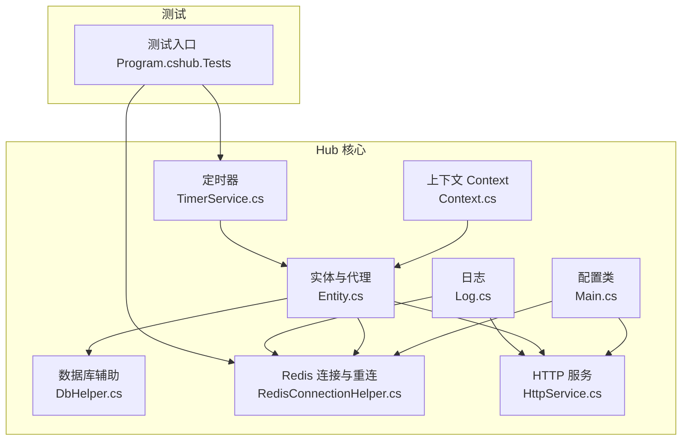
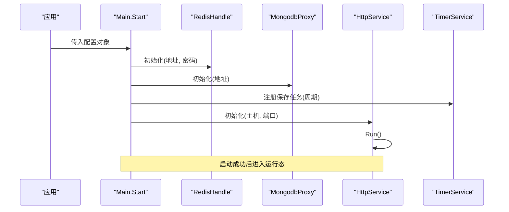
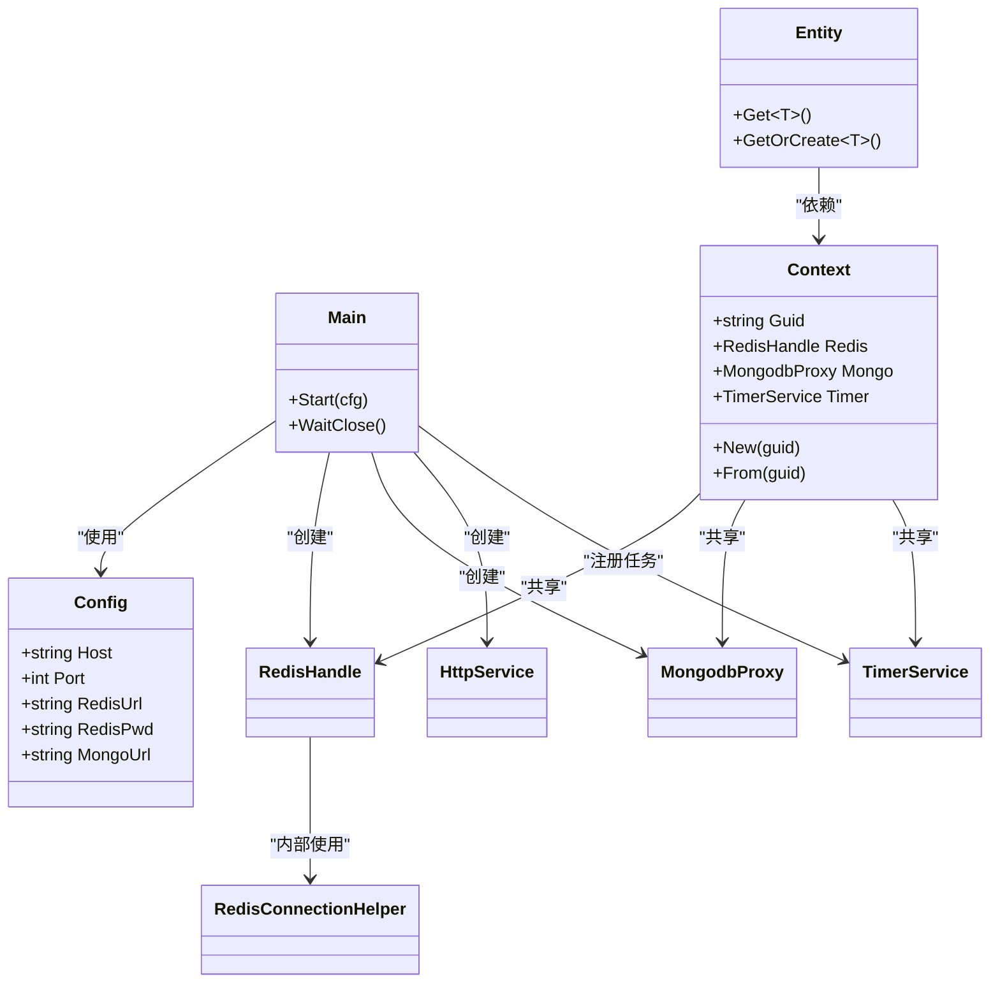

# 配置验证与测试

<cite>
**本文引用的文件**
- [Main.cs](file://lgbf/hub/Main.cs)
- [Context.cs](file://lgbf/hub/Context.cs)
- [Entity.cs](file://lgbf/hub/Entity.cs)
- [DbHelper.cs](file://lgbf/hub/DbHelper.cs)
- [RedisConnectionHelper.cs](file://lgbf/hub/RedisConnectionHelper.cs)
- [Log.cs](file://lgbf/hub/Log.cs)
- [TimerService.cs](file://lgbf/hub/TimerService.cs)
- [HttpService.cs](file://lgbf/hub/HttpService.cs)
- [Program.cs（测试）](file://lgbf/hub.Tests/Program.cs)
- [README.md](file://README.md)
</cite>

## 目录
1. [简介](#简介)
2. [项目结构](#项目结构)
3. [核心组件](#核心组件)
4. [架构总览](#架构总览)
5. [详细组件分析](#详细组件分析)
6. [依赖关系分析](#依赖关系分析)
7. [性能考量](#性能考量)
8. [故障排查指南](#故障排查指南)
9. [结论](#结论)
10. [附录](#附录)

## 简介
本指南围绕 LGBF 的配置验证与测试展开，聚焦以下目标：
- 配置加载与验证流程：从配置对象到运行时依赖（Redis、MongoDB、HTTP 服务）的初始化与校验。
- 参数检查与连接测试：如何在启动阶段进行参数合法性与连通性验证。
- 自动化测试与单元测试：如何通过现有测试框架验证配置相关行为。
- 错误诊断与常见问题：日志记录、异常处理与典型错误类型。
- 配置热更新与回滚策略：当前实现未提供热更新，建议的策略与回滚方案。
- 变更影响评估：配置变更对数据持久化、定时器、网络请求等的影响路径。
- 备份与恢复：配置文件层面的备份与恢复操作建议。
- 审计与合规：日志与审计要求的落地方式。
- 版本管理与迁移：配置版本控制与迁移策略。

## 项目结构
LGBF 后端以 hub 模块为核心，包含配置定义、上下文、实体存取、数据库辅助工具、Redis 连接与重连、日志、定时器与 HTTP 服务等模块。测试模块位于 hub.Tests，提供回归测试样例。

**图表来源**
- [Main.cs:4-40](file://lgbf/hub/Main.cs#L4-L40)
- [Context.cs:4-26](file://lgbf/hub/Context.cs#L4-L26)
- [Entity.cs:31-154](file://lgbf/hub/Entity.cs#L31-L154)
- [DbHelper.cs:4-311](file://lgbf/hub/DbHelper.cs#L4-L311)
- [RedisConnectionHelper.cs:6-144](file://lgbf/hub/RedisConnectionHelper.cs#L6-L144)
- [Log.cs:6-113](file://lgbf/hub/Log.cs#L6-L113)
- [TimerService.cs:7-126](file://lgbf/hub/TimerService.cs#L7-L126)
- [HttpService.cs:117-182](file://lgbf/hub/HttpService.cs#L117-L182)
- [Program.cs（测试）:25-117](file://lgbf/hub.Tests/Program.cs#L25-L117)

**章节来源**
- [README.md:1-3](file://README.md#L1-L3)
- [Main.cs:1-159](file://lgbf/hub/Main.cs#L1-L159)
- [Context.cs:1-27](file://lgbf/hub/Context.cs#L1-L27)
- [Entity.cs:1-154](file://lgbf/hub/Entity.cs#L1-L154)
- [DbHelper.cs:1-311](file://lgbf/hub/DbHelper.cs#L1-L311)
- [RedisConnectionHelper.cs:1-144](file://lgbf/hub/RedisConnectionHelper.cs#L1-L144)
- [Log.cs:1-113](file://lgbf/hub/Log.cs#L1-L113)
- [TimerService.cs:1-126](file://lgbf/hub/TimerService.cs#L1-L126)
- [HttpService.cs:1-182](file://lgbf/hub/HttpService.cs#L1-L182)
- [Program.cs（测试）:1-117](file://lgbf/hub.Tests/Program.cs#L1-L117)

## 核心组件
- 配置类：定义运行所需的关键参数（主机、端口、Redis 地址与密码、MongoDB 地址），用于启动阶段初始化各依赖。
- 上下文 Context：封装当前请求或实体操作所需的 Redis、MongoDB、定时器实例，支持按用户 GUID 构造新上下文。
- 实体与代理：IHostingData 接口及 DataAgent 实现，负责实体的读取、写回、脏标记与批量落库。
- 数据库辅助：SaveDataHelper、UpdateDataHelper、DBQueryHelper 提供安全的数据构建与查询条件拼装。
- Redis 连接与重连：RedisConnectionHelper 负责连接建立、超时与重试、并发保护与等待通知。
- 日志：统一日志输出、级别控制、文件滚动与线程安全。
- 定时器：TimerService 提供周期性任务调度与测试场景下的可控轮询。
- HTTP 服务：基于 Kestrel 的最小化 Web 服务，注册回调、跨域头、请求处理与统计。

**章节来源**
- [Main.cs:4-40](file://lgbf/hub/Main.cs#L4-L40)
- [Context.cs:4-26](file://lgbf/hub/Context.cs#L4-L26)
- [Entity.cs:31-154](file://lgbf/hub/Entity.cs#L31-L154)
- [DbHelper.cs:4-311](file://lgbf/hub/DbHelper.cs#L4-L311)
- [RedisConnectionHelper.cs:6-144](file://lgbf/hub/RedisConnectionHelper.cs#L6-L144)
- [Log.cs:6-113](file://lgbf/hub/Log.cs#L6-L113)
- [TimerService.cs:7-126](file://lgbf/hub/TimerService.cs#L7-L126)
- [HttpService.cs:117-182](file://lgbf/hub/HttpService.cs#L117-L182)

## 架构总览
LGBF 的启动流程以配置为入口，初始化 Redis、MongoDB、HTTP 服务，并启动定时保存任务；实体层通过 Context 获取底层存储句柄，完成读写与批量落库。

**图表来源**
- [Main.cs:31-40](file://lgbf/hub/Main.cs#L31-L40)
- [HttpService.cs:171-182](file://lgbf/hub/HttpService.cs#L171-L182)
- [TimerService.cs:68-96](file://lgbf/hub/TimerService.cs#L68-L96)

**章节来源**
- [Main.cs:31-40](file://lgbf/hub/Main.cs#L31-L40)
- [HttpService.cs:171-182](file://lgbf/hub/HttpService.cs#L171-L182)
- [TimerService.cs:68-96](file://lgbf/hub/TimerService.cs#L68-L96)

## 详细组件分析

### 配置加载与验证流程
- 配置对象字段：主机、端口、Redis 地址、Redis 密码、MongoDB 地址。
- 启动阶段验证要点：
  - 必填字段非空校验（字符串非空、端口范围合理）。
  - Redis/Mongo 连接可达性（可结合连接辅助类的连接与重试逻辑进行测试）。
  - HTTP 服务监听端口可用且无冲突。
- 建议的验证步骤：
  - 解析配置文件（如 JSON）为强类型对象。
  - 执行字段合法性检查与默认值填充。
  - 尝试建立 Redis/Mongo 连接并执行简单查询。
  - 启动 HTTP 服务并验证监听状态。
  - 记录验证结果与失败原因，必要时中止启动。

**章节来源**
- [Main.cs:4-11](file://lgbf/hub/Main.cs#L4-L11)
- [Main.cs:31-40](file://lgbf/hub/Main.cs#L31-L40)
- [RedisConnectionHelper.cs:35-54](file://lgbf/hub/RedisConnectionHelper.cs#L35-L54)

### 参数检查与连接测试
- 参数检查：
  - 主机与端口：确保主机合法、端口在有效范围内。
  - Redis/Mongo 地址：格式正确、可解析。
  - Redis 密码：按需提供。
- 连接测试：
  - 使用连接辅助类尝试建立连接，捕获连接异常。
  - 对 Redis 执行 PING，对 Mongo 执行集合存在性检查。
  - 记录连接耗时与状态，便于后续监控。

**章节来源**
- [RedisConnectionHelper.cs:35-54](file://lgbf/hub/RedisConnectionHelper.cs#L35-L54)
- [RedisConnectionHelper.cs:56-127](file://lgbf/hub/RedisConnectionHelper.cs#L56-L127)

### 自动化测试与单元测试
- 测试框架：
  - hub.Tests 提供了基于控制台的简单断言与用例组织。
  - 包含定时器循环触发测试与 Redis 辅助类等待句柄隔离测试。
- 建议扩展：
  - 为配置加载与验证增加独立测试用例，覆盖正常与异常分支。
  - 为 HTTP 服务注册回调、跨域头、请求处理增加集成测试。
  - 为实体读写与批量落库增加数据一致性测试。

**章节来源**
- [Program.cs（测试）:25-117](file://lgbf/hub.Tests/Program.cs#L25-L117)

### 错误诊断与常见错误类型
- 连接类错误：
  - Redis 连接异常：连接失败、认证失败、DNS 解析失败。
  - MongoDB 连接异常：连接超时、认证失败、集合不可达。
- 业务类错误：
  - 实体写回失败：Redis 写入失败、脏队列推送失败。
  - 批量落库失败：Mongo 更新失败、数据不一致。
- 日志与告警：
  - 使用统一日志接口输出错误信息，包含时间戳、调用栈位置。
  - 对超时请求与高负载进行告警记录。

**章节来源**
- [RedisConnectionHelper.cs:48-53](file://lgbf/hub/RedisConnectionHelper.cs#L48-L53)
- [RedisConnectionHelper.cs:93-99](file://lgbf/hub/RedisConnectionHelper.cs#L93-L99)
- [Entity.cs:62-91](file://lgbf/hub/Entity.cs#L62-L91)
- [Main.cs:125-134](file://lgbf/hub/Main.cs#L125-L134)
- [Log.cs:55-58](file://lgbf/hub/Log.cs#L55-L58)

### 配置热更新与回滚策略
- 当前实现状态：
  - 启动后未提供配置热更新机制，RedisHandle 与 MongodbProxy 在启动时绑定配置。
- 建议策略：
  - 热更新：引入配置中心或文件监控，检测变更后平滑切换连接句柄，避免中断。
  - 回滚：保留上一版本配置快照，失败时自动回滚；支持手动回滚。
  - 幂等：确保切换过程中的幂等性，避免重复写入或丢失。
- 影响面评估：
  - Redis/Mongo 连接池与会话需要重新初始化。
  - HTTP 服务监听端口变更需重启监听或动态重载。
  - 定时器与实体代理需保持对新配置的可见性。

**章节来源**
- [Main.cs:31-40](file://lgbf/hub/Main.cs#L31-L40)
- [Context.cs:11-25](file://lgbf/hub/Context.cs#L11-L25)

### 变更影响评估
- 配置变更对系统行为的影响：
  - Redis/Mongo 地址变更：影响所有实体读写与批量落库。
  - HTTP 端口变更：影响外部访问与健康检查。
  - 日志路径/文件名变更：影响审计与运维。
- 评估方法：
  - 建立变更矩阵，列出每个配置项对模块的影响。
  - 编写回归测试用例，覆盖关键路径。
  - 使用性能基准测试评估变更对吞吐与延迟的影响。

**章节来源**
- [Entity.cs:104-154](file://lgbf/hub/Entity.cs#L104-L154)
- [DbHelper.cs:160-311](file://lgbf/hub/DbHelper.cs#L160-L311)
- [HttpService.cs:149-182](file://lgbf/hub/HttpService.cs#L149-L182)

### 备份与恢复操作指南
- 配置备份：
  - 定期导出配置文件（JSON/YAML）至安全存储。
  - 保留多版本快照，区分环境（dev/stage/prod）。
- 配置恢复：
  - 从最近快照恢复；若失败，回退至上一个版本。
  - 恢复后执行连接测试与基础功能验证。
- 注意事项：
  - 敏感信息（密码）使用密钥管理服务加密存储。
  - 恢复流程需纳入变更管理与审批流程。

### 审计与合规
- 审计要求：
  - 记录配置变更历史（变更人、时间、内容差异）。
  - 日志保留期限与归档策略符合合规要求。
- 合规措施：
  - 最小权限原则：仅授予必要的访问权限。
  - 加密传输与静态存储：敏感配置在网络与磁盘上均需加密。
  - 审计日志不可抵赖：采用可信时间源与时钟同步。

### 版本管理与迁移策略
- 版本管理：
  - 使用语义化版本管理配置文件，主版本变更需兼容性评估。
  - 引入配置模式校验（如 JSON Schema）以保证结构正确性。
- 迁移策略：
  - 渐进式迁移：先在测试环境验证，再逐步推广到生产。
  - 回滚脚本：准备一键回滚脚本与人工干预点。
  - 兼容性检查：新增字段默认值、旧字段废弃提示。

## 依赖关系分析
- 组件耦合：
  - Main 依赖 RedisHandle、MongodbProxy、HttpService、TimerService。
  - Entity 依赖 Context、RedisHandle、MongodbProxy、DBQueryHelper。
  - RedisConnectionHelper 独立于其他模块，提供连接与重连能力。
- 外部依赖：
  - StackExchange.Redis、MongoDB.Bson、ASP.NET Core Kestrel。
- 循环依赖：
  - 未发现直接循环依赖；Context 作为共享上下文被实体与服务使用。

**图表来源**
- [Main.cs:4-40](file://lgbf/hub/Main.cs#L4-L40)
- [Context.cs:4-26](file://lgbf/hub/Context.cs#L4-L26)
- [Entity.cs:94-154](file://lgbf/hub/Entity.cs#L94-L154)
- [RedisConnectionHelper.cs:6-33](file://lgbf/hub/RedisConnectionHelper.cs#L6-L33)

**章节来源**
- [Main.cs:4-40](file://lgbf/hub/Main.cs#L4-L40)
- [Context.cs:4-26](file://lgbf/hub/Context.cs#L4-L26)
- [Entity.cs:94-154](file://lgbf/hub/Entity.cs#L94-L154)
- [RedisConnectionHelper.cs:6-33](file://lgbf/hub/RedisConnectionHelper.cs#L6-L33)

## 性能考量
- 连接池与超时：
  - Redis 连接超时与重试次数需平衡稳定性与资源占用。
  - MongoDB 批量更新大小与超时设置需根据数据规模调整。
- 定时任务：
  - 保存间隔与批大小影响吞吐与延迟，需压测确定最优值。
- HTTP 服务：
  - 并发连接数限制与 Keep-Alive 超时需结合业务峰值调优。
- 日志：
  - 文件滚动与异步写入减少 IO 抖动。

## 故障排查指南
- 启动失败：
  - 检查配置文件路径与权限；确认必填字段完整。
  - 查看日志中连接异常堆栈，定位具体依赖。
- 运行时异常：
  - Redis 写入失败：检查连接状态、权限与键空间配额。
  - Mongo 批量更新失败：检查集合权限、索引状态与文档大小。
- 性能问题：
  - 关注日志中的超时统计与慢请求记录。
  - 使用性能分析工具定位热点函数与阻塞点。

**章节来源**
- [Log.cs:55-58](file://lgbf/hub/Log.cs#L55-L58)
- [HttpService.cs:56-62](file://lgbf/hub/HttpService.cs#L56-L62)
- [RedisConnectionHelper.cs:116-127](file://lgbf/hub/RedisConnectionHelper.cs#L116-L127)

## 结论
LGBF 的配置验证与测试应围绕“启动即验证”的原则展开：在启动阶段完成参数合法性与连接可达性检查，并通过现有测试框架与日志体系保障运行时可观测性。对于热更新与回滚，建议在不破坏现有稳定性的前提下引入平滑切换与快速回滚机制，并配套完善的审计与合规措施。

## 附录
- 测试用例参考：
  - 定时器循环触发测试：验证每日/每周定时器的触发与重置。
  - Redis 辅助类等待句柄隔离：验证多个连接助手实例的等待句柄互不影响。
- 建议补充的测试场景：
  - 配置加载失败与成功路径。
  - HTTP 服务回调注册与响应。
  - 实体写回与批量落库的边界条件。

**章节来源**
- [Program.cs（测试）:62-117](file://lgbf/hub.Tests/Program.cs#L62-L117)