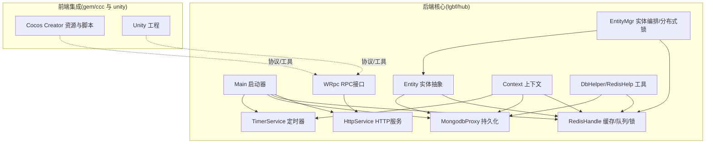
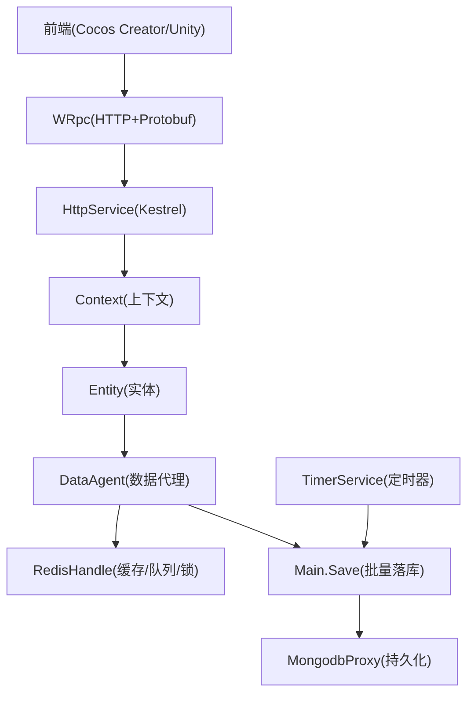
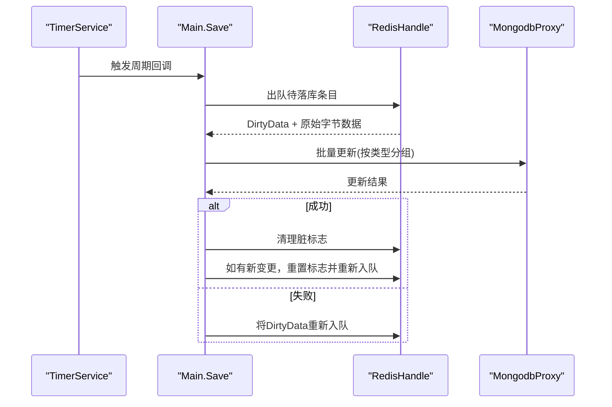
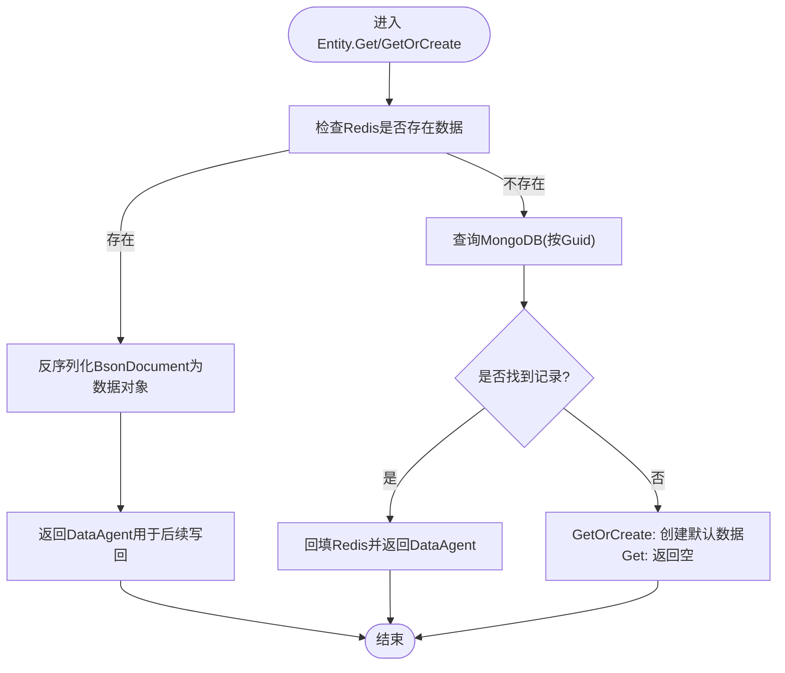
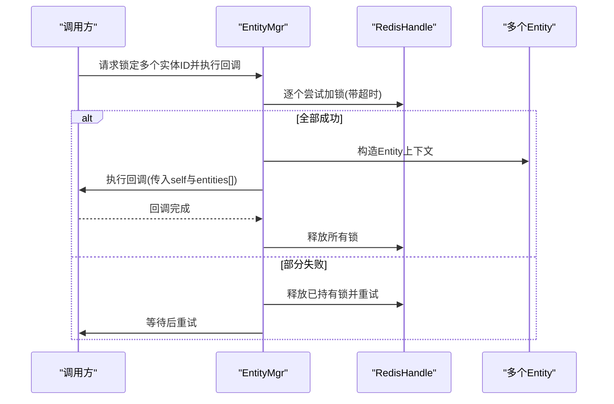
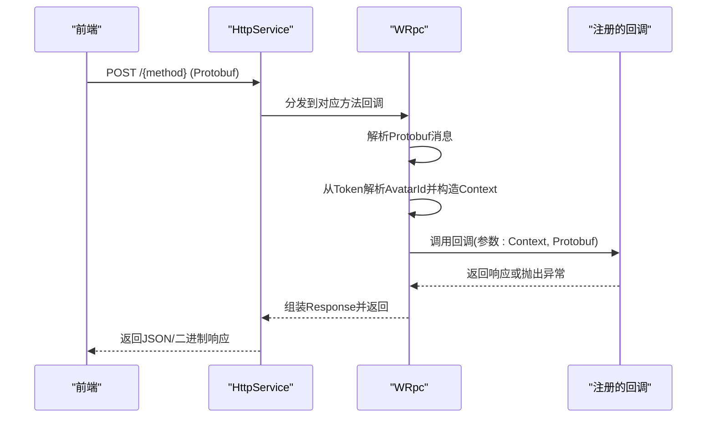
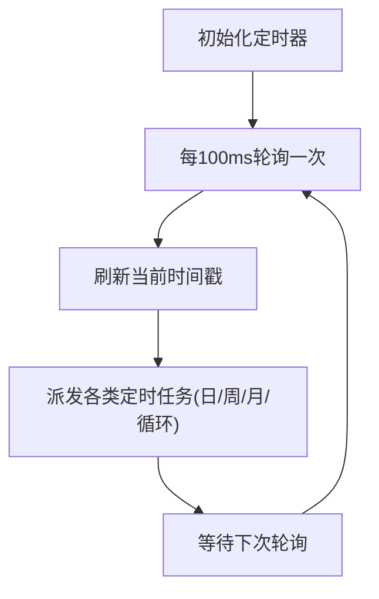
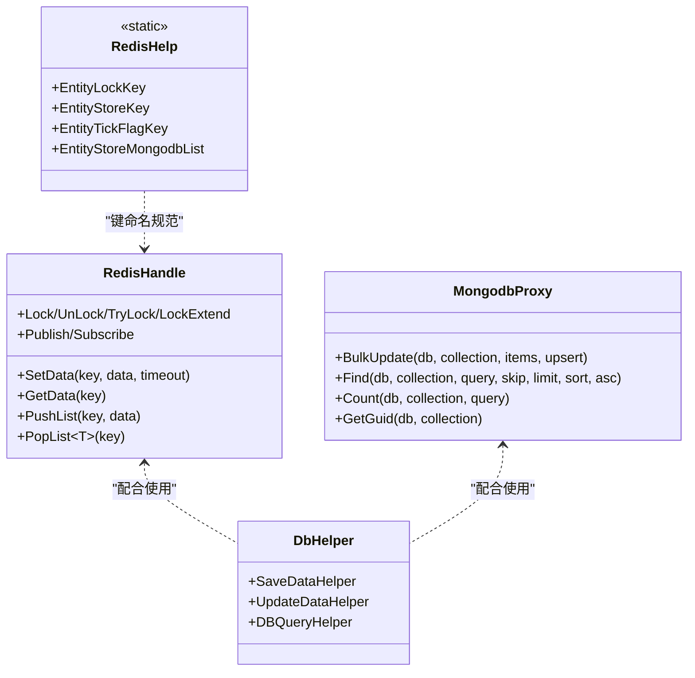
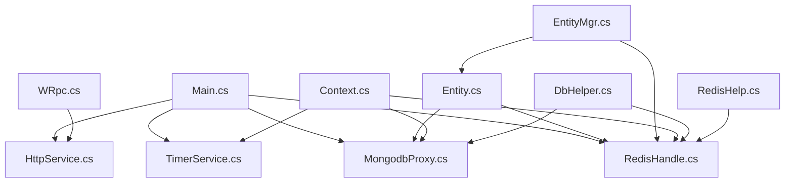

# 项目概述

<cite>
**本文引用的文件**   
- [README.md](file://README.md)
- [Main.cs](file://lgbf/hub/Main.cs)
- [Context.cs](file://lgbf/hub/Context.cs)
- [Entity.cs](file://lgbf/hub/Entity.cs)
- [WRpc.cs](file://lgbf/hub/WRpc.cs)
- [TimerService.cs](file://lgbf/hub/TimerService.cs)
- [RedisHandle.cs](file://lgbf/hub/RedisHandle.cs)
- [MongodbProxy.cs](file://lgbf/hub/MongodbProxy.cs)
- [HttpService.cs](file://lgbf/hub/HttpService.cs)
- [EntityMgr.cs](file://lgbf/hub/EntityMgr.cs)
- [RedisHelp.cs](file://lgbf/hub/RedisHelp.cs)
- [DbHelper.cs](file://lgbf/hub/DbHelper.cs)
- [package.json](file://package.json)
</cite>

## 目录
1. [引言](#引言)
2. [项目结构](#项目结构)
3. [核心组件](#核心组件)
4. [架构总览](#架构总览)
5. [详细组件分析](#详细组件分析)
6. [依赖关系分析](#依赖关系分析)
7. [性能考量](#性能考量)
8. [故障排查指南](#故障排查指南)
9. [结论](#结论)
10. [附录](#附录)

## 引言
LGBF（Lightweight Game Backend Framework）是一个面向实时多人在线游戏的轻量化后端框架，专注于在高并发场景下提供高性能、可扩展且易用的后端能力。其核心价值主张体现在：
- 高性能：基于内存缓存与批量持久化的数据写入策略，降低数据库压力，提升吞吐。
- 可扩展：模块化设计，支持横向扩展与多实例部署；通过分布式锁与定时器服务保障一致性与调度能力。
- 易用性：统一的实体模型抽象、RPC接口注册机制与HTTP服务封装，便于快速接入与业务实现。

本框架采用C#/.NET后端，结合Redis作为缓存与消息通道，MongoDB作为持久化存储，并提供与Cocos Creator/Unity前端的协议与集成基础，满足从原型到上线的全链路需求。

## 项目结构
仓库采用“根目录+子项目”的组织方式：
- 根目录包含顶层说明与工具配置（如README、package.json等）
- lgbf/hub：核心后端服务与基础设施（HTTP服务、Redis/MongoDB代理、实体管理、计时器、RPC等）
- gem/ccc：Cocos Creator资源与脚本（含ServerSDK与工具脚本）
- unity：Unity工程（包含相关设置与脚本）

下面给出一个概念性的项目结构图，帮助理解模块划分与职责边界：

**图表来源**
- [Main.cs:31-40](file://lgbf/hub/Main.cs#L31-L40)
- [HttpService.cs:117-182](file://lgbf/hub/HttpService.cs#L117-L182)
- [RedisHandle.cs:13-544](file://lgbf/hub/RedisHandle.cs#L13-L544)
- [MongodbProxy.cs:10-221](file://lgbf/hub/MongodbProxy.cs#L10-L221)
- [TimerService.cs:7-126](file://lgbf/hub/TimerService.cs#L7-L126)
- [Entity.cs:94-154](file://lgbf/hub/Entity.cs#L94-L154)
- [EntityMgr.cs:44-128](file://lgbf/hub/EntityMgr.cs#L44-L128)
- [WRpc.cs:6-155](file://lgbf/hub/WRpc.cs#L6-L155)
- [Context.cs:4-27](file://lgbf/hub/Context.cs#L4-L27)
- [RedisHelp.cs:4-20](file://lgbf/hub/RedisHelp.cs#L4-L20)
- [DbHelper.cs:4-311](file://lgbf/hub/DbHelper.cs#L4-L311)

**章节来源**
- [README.md:1-3](file://README.md#L1-L3)
- [Main.cs:31-40](file://lgbf/hub/Main.cs#L31-L40)
- [HttpService.cs:117-182](file://lgbf/hub/HttpService.cs#L117-L182)

## 核心组件
- 启动与生命周期管理：负责初始化Redis/Mongo/HTTP服务与定时任务，周期性触发脏数据落库。
- 实体模型与数据代理：以IHostingData为契约，提供Get/GetOrCreate与WriteBack流程，自动在Redis与Mongo之间同步。
- 分布式锁与实体编排：通过EntityMgr协调跨实体事务，确保并发安全与锁续租。
- 计时器服务：提供毫秒级轮询与日历型定时任务，支撑业务节拍与周期性操作。
- RPC与HTTP：WRpc基于HTTP+Protobuf实现方法级路由，简化前后端交互；HttpService提供统一请求处理与跨域支持。
- 缓存与持久化：RedisHandle封装键值、列表、有序集合、哈希、发布订阅与分布式锁；MongodbProxy提供批量更新、查询与自增GUID等能力。

**章节来源**
- [Main.cs:31-159](file://lgbf/hub/Main.cs#L31-L159)
- [Entity.cs:4-154](file://lgbf/hub/Entity.cs#L4-L154)
- [EntityMgr.cs:44-128](file://lgbf/hub/EntityMgr.cs#L44-L128)
- [TimerService.cs:7-126](file://lgbf/hub/TimerService.cs#L7-L126)
- [WRpc.cs:6-155](file://lgbf/hub/WRpc.cs#L6-L155)
- [HttpService.cs:117-182](file://lgbf/hub/HttpService.cs#L117-L182)
- [RedisHandle.cs:13-544](file://lgbf/hub/RedisHandle.cs#L13-L544)
- [MongodbProxy.cs:10-221](file://lgbf/hub/MongodbProxy.cs#L10-L221)

## 架构总览
LGBF采用“缓存优先、异步落库、事件驱动”的架构理念：
- 写路径：应用修改实体数据 -> 写入Redis -> 设置脏标志 -> 入队待落库列表 -> 定时器周期性批量写回MongoDB。
- 读路径：优先从Redis命中；未命中则查询MongoDB并回填Redis。
- 并发控制：跨实体操作通过分布式锁保证原子性；计时器服务提供统一节拍。
- 接口层：WRpc将前端Protobuf消息映射到后端方法，统一返回响应。

**图表来源**
- [WRpc.cs:6-155](file://lgbf/hub/WRpc.cs#L6-L155)
- [HttpService.cs:117-182](file://lgbf/hub/HttpService.cs#L117-L182)
- [Context.cs:4-27](file://lgbf/hub/Context.cs#L4-L27)
- [Entity.cs:94-154](file://lgbf/hub/Entity.cs#L94-L154)
- [RedisHandle.cs:13-544](file://lgbf/hub/RedisHandle.cs#L13-L544)
- [MongodbProxy.cs:10-221](file://lgbf/hub/MongodbProxy.cs#L10-L221)
- [TimerService.cs:7-126](file://lgbf/hub/TimerService.cs#L7-L126)
- [Main.cs:50-159](file://lgbf/hub/Main.cs#L50-L159)

## 详细组件分析

### 启动与持久化流程（Main.Save）
该流程实现了“先缓存、后批量落库”的写入策略，通过定时器周期触发，避免高频写入数据库带来的压力。

**图表来源**
- [Main.cs:50-159](file://lgbf/hub/Main.cs#L50-L159)
- [RedisHandle.cs:257-303](file://lgbf/hub/RedisHandle.cs#L257-L303)
- [MongodbProxy.cs:102-120](file://lgbf/hub/MongodbProxy.cs#L102-L120)

**章节来源**
- [Main.cs:50-159](file://lgbf/hub/Main.cs#L50-L159)

### 实体读取与创建（Entity.Get/GetOrCreate）
实体访问遵循“缓存优先、回源补位”的策略，确保低延迟与一致性。

**图表来源**
- [Entity.cs:104-153](file://lgbf/hub/Entity.cs#L104-L153)
- [MongodbProxy.cs:143-184](file://lgbf/hub/MongodbProxy.cs#L143-L184)

**章节来源**
- [Entity.cs:104-153](file://lgbf/hub/Entity.cs#L104-L153)

### 分布式锁与实体编排（EntityMgr.CallLockAndGetEntity）
跨实体操作通过分布式锁保证原子性，配合锁续租线程避免超时释放。

**图表来源**
- [EntityMgr.cs:44-128](file://lgbf/hub/EntityMgr.cs#L44-L128)
- [RedisHandle.cs:305-394](file://lgbf/hub/RedisHandle.cs#L305-L394)

**章节来源**
- [EntityMgr.cs:44-128](file://lgbf/hub/EntityMgr.cs#L44-L128)

### RPC接口注册与调用（WRpc）
WRpc将HTTP POST请求映射到具体方法名，解析Protobuf消息并注入Context，最终统一返回响应。

**图表来源**
- [WRpc.cs:6-155](file://lgbf/hub/WRpc.cs#L6-L155)
- [HttpService.cs:117-182](file://lgbf/hub/HttpService.cs#L117-L182)

**章节来源**
- [WRpc.cs:6-155](file://lgbf/hub/WRpc.cs#L6-L155)

### 计时器服务（TimerService）
提供统一的毫秒级轮询与多种日历型定时任务，支撑业务节拍与周期性操作。

**图表来源**
- [TimerService.cs:68-125](file://lgbf/hub/TimerService.cs#L68-L125)

**章节来源**
- [TimerService.cs:7-126](file://lgbf/hub/TimerService.cs#L7-L126)

### 缓存与持久化工具（RedisHandle/MongodbProxy/DbHelper/RedisHelp）
- RedisHandle：封装字符串、字节数组、列表、有序集合、哈希、发布订阅与分布式锁，提供幂等与重试机制。
- MongodbProxy：提供批量更新、查询、计数、删除与自增GUID等常用操作。
- DbHelper：提供构建BsonDocument/UpdateDocument的辅助类，简化数据组装。
- RedisHelp：集中定义Redis键命名规范，统一锁、存储、队列与排行榜等键空间。

**图表来源**
- [RedisHandle.cs:13-544](file://lgbf/hub/RedisHandle.cs#L13-L544)
- [MongodbProxy.cs:10-221](file://lgbf/hub/MongodbProxy.cs#L10-L221)
- [DbHelper.cs:4-311](file://lgbf/hub/DbHelper.cs#L4-L311)
- [RedisHelp.cs:4-20](file://lgbf/hub/RedisHelp.cs#L4-L20)

**章节来源**
- [RedisHandle.cs:13-544](file://lgbf/hub/RedisHandle.cs#L13-L544)
- [MongodbProxy.cs:10-221](file://lgbf/hub/MongodbProxy.cs#L10-L221)
- [DbHelper.cs:4-311](file://lgbf/hub/DbHelper.cs#L4-L311)
- [RedisHelp.cs:4-20](file://lgbf/hub/RedisHelp.cs#L4-L20)

## 依赖关系分析
- 技术栈概览
  - 后端：C#/.NET、ASP.NET Core Kestrel、Google.Protobuf、StackExchange.Redis、MongoDB.Driver
  - 前端：Cocos Creator、Unity（通过Protobuf与后端通信）
  - 工具：ts-proto（生成TypeScript/Proto绑定，便于前端对接）

- 关键依赖与耦合
  - Main对RedisHandle、MongodbProxy、TimerService、HttpService存在强依赖，承担启动与调度职责。
  - Entity/EntityMgr依赖RedisHandle与MongodbProxy，形成数据层与业务层的清晰边界。
  - WRpc依赖HttpService与Protobuf，提供方法级接口注册与调用。
  - DbHelper/RedisHelp为通用工具，被各层复用，降低重复逻辑。

**图表来源**
- [Main.cs:31-40](file://lgbf/hub/Main.cs#L31-L40)
- [WRpc.cs:6-155](file://lgbf/hub/WRpc.cs#L6-L155)
- [Entity.cs:94-154](file://lgbf/hub/Entity.cs#L94-L154)
- [EntityMgr.cs:44-128](file://lgbf/hub/EntityMgr.cs#L44-L128)
- [Context.cs:4-27](file://lgbf/hub/Context.cs#L4-L27)
- [RedisHandle.cs:13-544](file://lgbf/hub/RedisHandle.cs#L13-L544)
- [MongodbProxy.cs:10-221](file://lgbf/hub/MongodbProxy.cs#L10-L221)
- [DbHelper.cs:4-311](file://lgbf/hub/DbHelper.cs#L4-L311)
- [RedisHelp.cs:4-20](file://lgbf/hub/RedisHelp.cs#L4-L20)

**章节来源**
- [package.json:1-6](file://package.json#L1-L6)

## 性能考量
- 写入优化
  - 使用Redis作为热数据缓存，减少MongoDB直写次数；通过批量更新降低网络与磁盘IO开销。
  - 脏标志与队列机制避免重复写入，仅在必要时入队并周期性处理。
- 读取优化
  - 优先命中Redis，未命中再回源MongoDB并回填缓存，降低冷启动延迟。
- 并发与一致性
  - 跨实体操作使用分布式锁，防止竞态条件；锁续租线程保障长事务稳定性。
- 网络与连接
  - Kestrel限制最大并发连接与保活超时，合理配置以平衡资源占用与吞吐。
  - Redis/MongoDB连接采用连接池与重连恢复策略，增强鲁棒性。

[本节为通用性能建议，不直接分析具体文件]

## 故障排查指南
- 写回失败
  - 现象：批量更新返回失败或异常日志。
  - 排查：确认Redis队列中是否有残留DirtyData；检查MongoDB连接与索引状态；查看日志错误信息定位具体批次。
  - 参考：[Main.cs:125-134](file://lgbf/hub/Main.cs#L125-L134)
- 写回异常
  - 现象：单条写回抛出异常并记录日志。
  - 排查：检查Redis写入是否成功、脏标志是否正确设置、Protobuf序列化是否有效。
  - 参考：[Entity.cs:58-91](file://lgbf/hub/Entity.cs#L58-L91)
- RPC调用异常
  - 现象：回调抛出异常或返回错误信息。
  - 排查：确认方法名是否注册、Protobuf消息格式是否匹配、Token与AvatarId映射是否正确。
  - 参考：[WRpc.cs:47-97](file://lgbf/hub/WRpc.cs#L47-L97)
- 锁竞争与超时
  - 现象：加锁失败或续租失败导致异常。
  - 排查：检查锁超时配置、重试间隔与并发操作范围；确认锁粒度与业务逻辑是否冲突。
  - 参考：[EntityMgr.cs:60-81](file://lgbf/hub/EntityMgr.cs#L60-L81), [RedisHandle.cs:305-394](file://lgbf/hub/RedisHandle.cs#L305-L394)
- HTTP服务问题
  - 现象：请求无响应或超时。
  - 排查：检查Kestrel监听端口、最大并发连接、Keep-Alive超时；查看请求处理耗时统计。
  - 参考：[HttpService.cs:149-182](file://lgbf/hub/HttpService.cs#L149-L182)

**章节来源**
- [Main.cs:125-134](file://lgbf/hub/Main.cs#L125-L134)
- [Entity.cs:58-91](file://lgbf/hub/Entity.cs#L58-L91)
- [WRpc.cs:47-97](file://lgbf/hub/WRpc.cs#L47-L97)
- [EntityMgr.cs:60-81](file://lgbf/hub/EntityMgr.cs#L60-L81)
- [RedisHandle.cs:305-394](file://lgbf/hub/RedisHandle.cs#L305-L394)
- [HttpService.cs:149-182](file://lgbf/hub/HttpService.cs#L149-L182)

## 结论
LGBF通过“缓存优先、批量落库、事件驱动”的设计，在实时多人游戏后端开发中有效解决了高性能、可扩展与易用性的关键挑战。其模块化架构与清晰的数据流使团队能够快速迭代功能、稳定运行生产环境。结合Cocos Creator/Unity的前端生态，LGBF为从原型到上线提供了完整的解决方案。

[本节为总结性内容，不直接分析具体文件]

## 附录
- 技术栈与版本
  - 后端：C#/.NET、ASP.NET Core、Protobuf、StackExchange.Redis、MongoDB.Driver
  - 前端：Cocos Creator、Unity（通过Protobuf与后端通信）
  - 工具：ts-proto（用于生成前端Protobuf绑定）
- 前端集成要点
  - 使用Protobuf定义消息契约，后端通过WRpc进行方法级路由。
  - 前端通过HTTP POST调用后端接口，注意跨域头与鉴权Token传递。
- 发展与规划
  - 当前版本聚焦于核心数据模型与RPC接口，后续可扩展：监控埋点、灰度发布、多数据中心复制、更丰富的计时器与调度策略等。

**章节来源**
- [package.json:1-6](file://package.json#L1-L6)